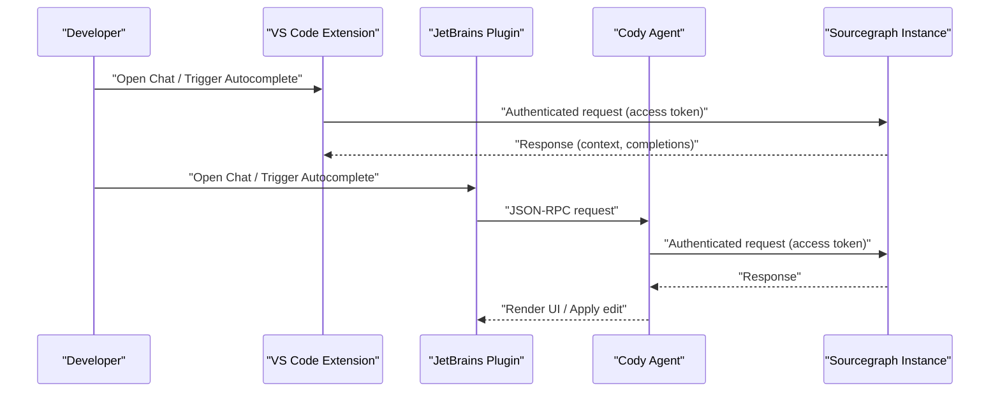
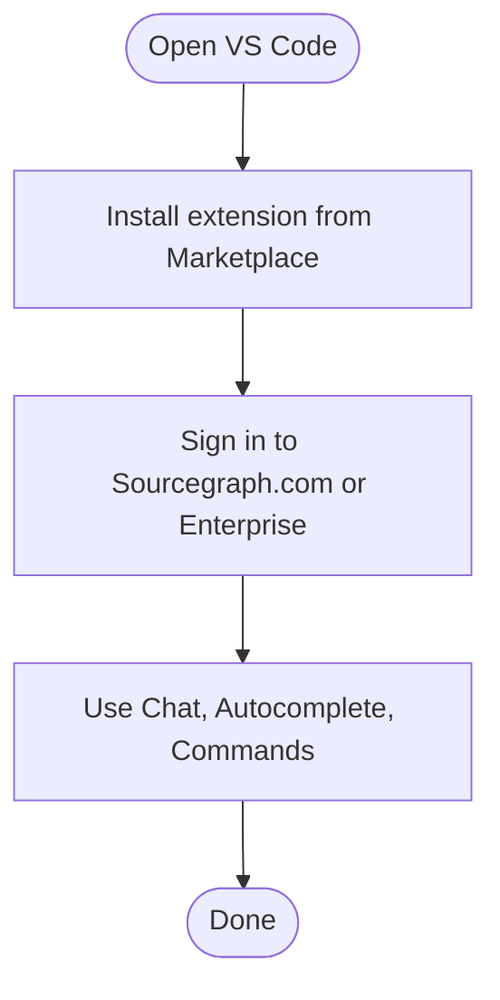
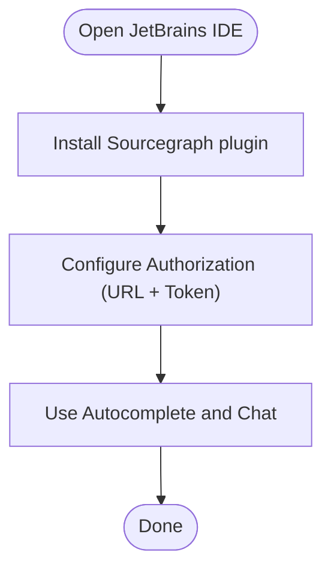
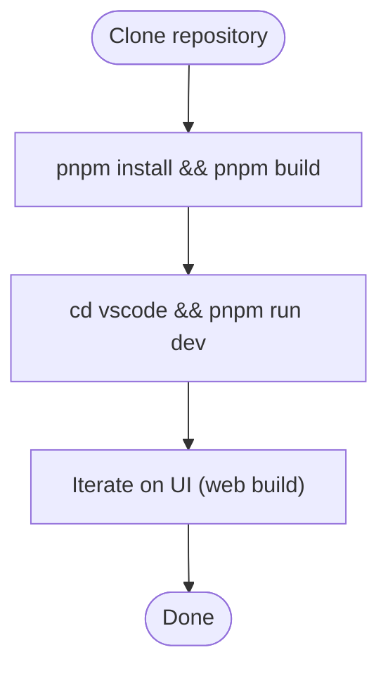
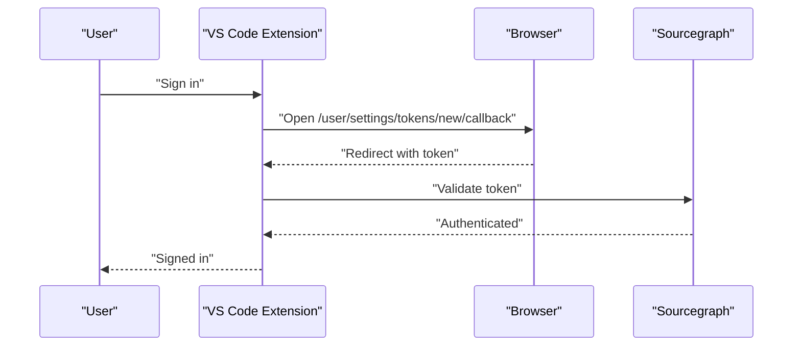
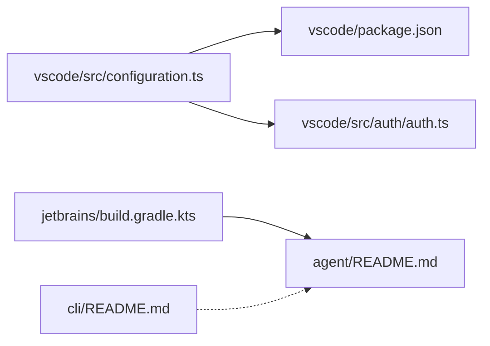

# Getting Started

<cite>
**Referenced Files in This Document**
- [README.md](file://README.md)
- [vscode/README.md](file://vscode/README.md)
- [jetbrains/README.md](file://jetbrains/README.md)
- [agent/README.md](file://agent/README.md)
- [cli/README.md](file://cli/README.md)
- [vscode/package.json](file://vscode/package.json)
- [vscode/src/auth/auth.ts](file://vscode/src/auth/auth.ts)
- [vscode/src/configuration.ts](file://vscode/src/configuration.ts)
- [jetbrains/build.gradle.kts](file://jetbrains/build.gradle.kts)
- [doc/dev/index.md](file://doc/dev/index.md)
</cite>

## Table of Contents
1. [Introduction](#introduction)
2. [Project Structure](#project-structure)
3. [Core Components](#core-components)
4. [Architecture Overview](#architecture-overview)
5. [Detailed Component Analysis](#detailed-component-analysis)
6. [Dependency Analysis](#dependency-analysis)
7. [Performance Considerations](#performance-considerations)
8. [Troubleshooting Guide](#troubleshooting-guide)
9. [Conclusion](#conclusion)
10. [Appendices](#appendices)

## Introduction
This guide helps you get started quickly with Cody AI across VS Code and JetBrains editors, and how to develop locally. You will learn how to install the extensions, connect to a Sourcegraph instance, authenticate, and use core features like chat, autocomplete, and Smart Apply. It also covers local development setup, system requirements, and troubleshooting.

## Project Structure
Cody consists of:
- VS Code extension: a rich desktop and web extension with chat, autocomplete, and commands
- JetBrains plugin: a plugin that integrates with JetBrains IDEs and uses the Cody Agent
- Agent: a JSON-RPC server and protocol used by non-ECMAScript clients (e.g., JetBrains)
- CLI: a command-line client for interacting with Cody

```mermaid
graph TB
subgraph "VS Code"
VSC["VS Code Extension<br/>package.json"]
AUTH["Auth Flow<br/>auth.ts"]
CFG["Configuration<br/>configuration.ts"]
end
subgraph "JetBrains"
JB["JetBrains Plugin<br/>build.gradle.kts"]
AG["Cody Agent<br/>agent/README.md"]
end
subgraph "CLI"
CLI["Cody CLI Docs<br/>cli/README.md"]
end
VSC --> AUTH
VSC --> CFG
JB --> AG
CLI --> AG
```

**Diagram sources**
- [vscode/package.json:11-56](file://vscode/package.json#L11-L56)
- [vscode/src/auth/auth.ts:1-603](file://vscode/src/auth/auth.ts#L1-L603)
- [vscode/src/configuration.ts:1-233](file://vscode/src/configuration.ts#L1-L233)
- [jetbrains/build.gradle.kts:394-419](file://jetbrains/build.gradle.kts#L394-L419)
- [agent/README.md:1-180](file://agent/README.md#L1-L180)
- [cli/README.md:1-8](file://cli/README.md#L1-L8)

**Section sources**
- [README.md:26-34](file://README.md#L26-L34)
- [vscode/package.json:11-56](file://vscode/package.json#L11-L56)
- [jetbrains/build.gradle.kts:394-419](file://jetbrains/build.gradle.kts#L394-L419)
- [agent/README.md:1-180](file://agent/README.md#L1-L180)
- [cli/README.md:1-8](file://cli/README.md#L1-L8)

## Core Components
- VS Code extension: contributes commands, keybindings, views, and manages authentication and configuration
- JetBrains plugin: integrates with JetBrains IDEs and runs the Cody Agent
- Agent: JSON-RPC server and protocol for non-ECMAScript clients
- CLI: documentation moved to Sourcegraph docs; historical context provided

Key capabilities:
- Chat: ask questions about your codebase and get contextual answers
- Autocomplete: inline suggestions as you type
- Smart Apply: propose and apply targeted edits
- Commands: explain, document, generate unit tests, and more

**Section sources**
- [vscode/README.md:40-54](file://vscode/README.md#L40-L54)
- [jetbrains/README.md:11-67](file://jetbrains/README.md#L11-L67)
- [agent/README.md:1-180](file://agent/README.md#L1-L180)
- [cli/README.md:1-8](file://cli/README.md#L1-L8)

## Architecture Overview
Cody’s runtime architecture connects your editor to a Sourcegraph instance (Cloud or Enterprise) using authentication and configuration. The VS Code extension handles UI and commands; the JetBrains plugin delegates to the Agent; the Agent communicates with the Sourcegraph backend.



**Diagram sources**
- [vscode/src/auth/auth.ts:284-378](file://vscode/src/auth/auth.ts#L284-L378)
- [vscode/src/configuration.ts:74-204](file://vscode/src/configuration.ts#L74-L204)
- [jetbrains/build.gradle.kts:467-477](file://jetbrains/build.gradle.kts#L467-L477)
- [agent/README.md:16-29](file://agent/README.md#L16-L29)

## Detailed Component Analysis

### VS Code Installation and Quick Start
- Install from the VS Code Marketplace or build locally
- Launch the extension and sign in to Sourcegraph.com or your Enterprise instance
- Use chat, autocomplete, and commands from the sidebar and command palette



**Diagram sources**
- [README.md:28-34](file://README.md#L28-L34)
- [vscode/src/auth/auth.ts:81-146](file://vscode/src/auth/auth.ts#L81-L146)

**Section sources**
- [README.md:26-34](file://README.md#L26-L34)
- [vscode/README.md:40-88](file://vscode/README.md#L40-L88)
- [vscode/src/auth/auth.ts:81-146](file://vscode/src/auth/auth.ts#L81-L146)

### JetBrains Installation and Quick Start
- Install from the JetBrains Marketplace
- Configure Authorization with your Sourcegraph instance URL and access token
- Use autocomplete and chat from the IDE



**Diagram sources**
- [jetbrains/README.md:114-129](file://jetbrains/README.md#L114-L129)
- [jetbrains/README.md:130-164](file://jetbrains/README.md#L130-L164)

**Section sources**
- [jetbrains/README.md:114-129](file://jetbrains/README.md#L114-L129)
- [jetbrains/README.md:130-164](file://jetbrains/README.md#L130-L164)

### Local Development Setup
- Install dependencies and build the project
- Run the VS Code extension in development mode
- Use web build for quick UI iteration



**Diagram sources**
- [doc/dev/index.md:3-13](file://doc/dev/index.md#L3-L13)
- [doc/dev/index.md:19-35](file://doc/dev/index.md#L19-L35)

**Section sources**
- [doc/dev/index.md:3-13](file://doc/dev/index.md#L3-L13)
- [doc/dev/index.md:19-35](file://doc/dev/index.md#L19-L35)

### Authentication and Configuration
- VS Code: sign in via browser callback or paste an access token; supports Enterprise and dotcom
- Configuration: server endpoint, custom headers, autocomplete settings, and hidden debug flags



**Diagram sources**
- [vscode/src/auth/auth.ts:284-378](file://vscode/src/auth/auth.ts#L284-L378)
- [vscode/src/auth/auth.ts:458-569](file://vscode/src/auth/auth.ts#L458-L569)

**Section sources**
- [vscode/src/auth/auth.ts:81-146](file://vscode/src/auth/auth.ts#L81-L146)
- [vscode/src/auth/auth.ts:284-378](file://vscode/src/auth/auth.ts#L284-L378)
- [vscode/src/auth/auth.ts:458-569](file://vscode/src/auth/auth.ts#L458-L569)
- [vscode/src/configuration.ts:74-204](file://vscode/src/configuration.ts#L74-L204)

### System Requirements and Supported Platforms
- VS Code: requires a minimum VS Code version and Node.js version indicated in the extension manifest
- JetBrains: supports recent IntelliJ Platform versions; specific notes for Apple Silicon and certain IDE versions are documented

**Section sources**
- [vscode/package.json:116-119](file://vscode/package.json#L116-L119)
- [jetbrains/README.md:110-113](file://jetbrains/README.md#L110-L113)

### Initial Configuration Checklist
- VS Code
  - Set server endpoint and custom headers if using Enterprise
  - Enable autocomplete and adjust language-specific settings
  - Use hidden debug settings for tracing if needed
- JetBrains
  - Configure Authorization with URL and token
  - Adjust autocomplete and context settings

**Section sources**
- [vscode/src/configuration.ts:74-204](file://vscode/src/configuration.ts#L74-L204)
- [jetbrains/README.md:130-164](file://jetbrains/README.md#L130-L164)

### Quick Start Tutorials
- Ask questions in chat
  - Open the Chat view and ask contextual questions about your codebase
- Use autocomplete
  - Type in the editor; accept suggestions or trigger manually
- Apply Smart Edits
  - Use commands to edit code and apply targeted changes

Practical examples:
- Chat: ask about implementation details, CI configuration, or resolvers
- Autocomplete: speed up typing with inline suggestions
- Smart Apply: refactor or fix code from anywhere in a file

**Section sources**
- [vscode/README.md:40-54](file://vscode/README.md#L40-L54)
- [jetbrains/README.md:11-67](file://jetbrains/README.md#L11-L67)

### Enterprise Deployment Scenarios
- Use Enterprise instances with Cody Enterprise plan
- Configure model choices and access tokens per instance
- Administrators can manage model options and settings

**Section sources**
- [README.md:83-93](file://README.md#L83-L93)
- [jetbrains/README.md:47-61](file://jetbrains/README.md#L47-L61)

## Dependency Analysis
- VS Code extension depends on configuration and authentication modules
- JetBrains plugin depends on the Agent and builds the agent binaries during plugin build
- CLI documentation is maintained externally; historical context is provided



**Diagram sources**
- [vscode/src/configuration.ts:1-233](file://vscode/src/configuration.ts#L1-L233)
- [vscode/src/auth/auth.ts:1-603](file://vscode/src/auth/auth.ts#L1-L603)
- [vscode/package.json:11-56](file://vscode/package.json#L11-L56)
- [jetbrains/build.gradle.kts:394-419](file://jetbrains/build.gradle.kts#L394-L419)
- [agent/README.md:1-180](file://agent/README.md#L1-L180)
- [cli/README.md:1-8](file://cli/README.md#L1-L8)

**Section sources**
- [vscode/src/configuration.ts:1-233](file://vscode/src/configuration.ts#L1-L233)
- [vscode/src/auth/auth.ts:1-603](file://vscode/src/auth/auth.ts#L1-L603)
- [jetbrains/build.gradle.kts:394-419](file://jetbrains/build.gradle.kts#L394-L419)
- [agent/README.md:1-180](file://agent/README.md#L1-L180)
- [cli/README.md:1-8](file://cli/README.md#L1-L8)

## Performance Considerations
- Use the web build for rapid UI iteration during development
- Tune autocomplete settings and language filters to reduce overhead
- Keep configuration minimal and avoid unnecessary hidden debug flags in production

[No sources needed since this section provides general guidance]

## Troubleshooting Guide
Common issues and resolutions:
- Authentication failures
  - Verify the server endpoint and token validity
  - Reopen the token creation URL and retry the callback
- VS Code web build issues
  - Ensure the web build is connecting to the intended endpoint
- JetBrains plugin agent issues
  - Confirm agent binaries are included in the plugin
  - Review verbose logging and trace paths for diagnostics

**Section sources**
- [vscode/src/auth/auth.ts:324-331](file://vscode/src/auth/auth.ts#L324-L331)
- [vscode/src/auth/auth.ts:458-569](file://vscode/src/auth/auth.ts#L458-L569)
- [jetbrains/build.gradle.kts:502-531](file://jetbrains/build.gradle.kts#L502-L531)
- [agent/README.md:62-79](file://agent/README.md#L62-L79)

## Conclusion
You can start using Cody immediately via the VS Code or JetBrains extensions, sign in to Sourcegraph.com or your Enterprise instance, and leverage chat, autocomplete, and Smart Apply. For development, use the documented setup steps to build and run locally. If you encounter issues, refer to the troubleshooting section for common fixes.

[No sources needed since this section summarizes without analyzing specific files]

## Appendices

### Appendix A: VS Code Commands and Keybindings
- Open the command palette and search for Cody commands
- Use keybindings to trigger chat, autocomplete, and editing actions

**Section sources**
- [vscode/package.json:192-538](file://vscode/package.json#L192-L538)

### Appendix B: JetBrains Settings Reference
- Authorization: instance URL and access token
- Default branch name and remote URL replacements
- Globbing and autocomplete toggles

**Section sources**
- [jetbrains/README.md:130-164](file://jetbrains/README.md#L130-L164)