# Agent Architecture

<cite>
**Referenced Files in This Document**
- [index.ts](file://agent/src/index.ts)
- [agent.ts](file://agent/src/agent.ts)
- [package.json](file://agent/package.json)
- [ARCHITECTURE.md](file://ARCHITECTURE.md)
- [AGENT.md](file://AGENT.md)
- [command-root.ts](file://agent/src/cli/command-root.ts)
- [AgentProviders.ts](file://agent/src/AgentProviders.ts)
- [AgentWorkspaceDocuments.ts](file://agent/src/AgentWorkspaceDocuments.ts)
- [AgentSecretStorage.ts](file://agent/src/AgentSecretStorage.ts)
- [AgentGlobalState.ts](file://agent/src/global-state/AgentGlobalState.ts)
- [jsonrpc-alias.ts](file://agent/src/jsonrpc-alias.ts)
- [certs.ts](file://agent/src/certs.ts)
- [AgentAuthHandler.ts](file://agent/src/AgentAuthHandler.ts)
- [AgentWebviewPanel.ts](file://agent/src/AgentWebviewPanel.ts)
- [AgentWorkspaceConfiguration.ts](file://agent/src/AgentWorkspaceConfiguration.ts)
</cite>

## Table of Contents
1. [Introduction](#introduction)
2. [Project Structure](#project-structure)
3. [Core Components](#core-components)
4. [Architecture Overview](#architecture-overview)
5. [Detailed Component Analysis](#detailed-component-analysis)
6. [Dependency Analysis](#dependency-analysis)
7. [Performance Considerations](#performance-considerations)
8. [Security Architecture](#security-architecture)
9. [Extensibility and Plugin Framework](#extensibility-and-plugin-framework)
10. [System Requirements and Deployment](#system-requirements-and-deployment)
11. [Monitoring and Observability](#monitoring-and-observability)
12. [Troubleshooting Guide](#troubleshooting-guide)
13. [Conclusion](#conclusion)

## Introduction
This document describes the agent runtime system that powers Cody’s cross-platform communication bridge between clients and AI services. The agent runs as a standalone process or embedded runtime, exposing a JSON-RPC interface to clients while hosting a VS Code-compatible extension surface. It manages lifecycle, isolation boundaries, resource allocation, authentication, document synchronization, secrets, telemetry, and webview rendering. The architecture emphasizes process isolation, dependency injection, and a clean separation between client-facing RPC and internal extension activation.

## Project Structure
The agent is implemented as a Node.js program with a CLI entrypoint and a rich set of subsystems:
- CLI entrypoint initializes the process and routes to subcommands.
- Agent core implements JSON-RPC handlers, lifecycle, and extension activation.
- Workspace and document management maintain a virtualized VS Code workspace.
- Security and secrets provide certificate handling and secret storage abstractions.
- Configuration and global state manage settings and persistent state.
- Webview panels integrate with the client’s UI rendering.

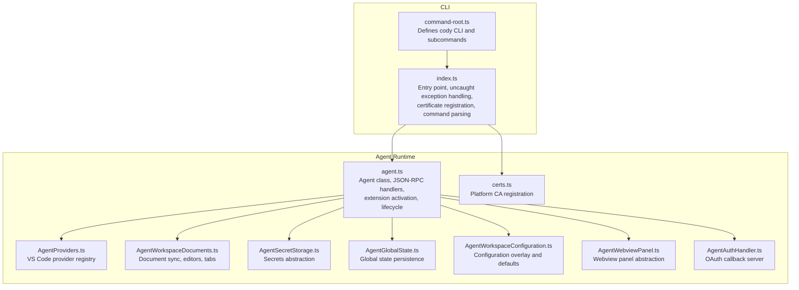

**Diagram sources**
- [command-root.ts:1-23](file://agent/src/cli/command-root.ts#L1-L23)
- [index.ts:1-34](file://agent/src/index.ts#L1-L34)
- [agent.ts:295-499](file://agent/src/agent.ts#L295-L499)
- [AgentProviders.ts:1-24](file://agent/src/AgentProviders.ts#L1-L24)
- [AgentWorkspaceDocuments.ts:1-262](file://agent/src/AgentWorkspaceDocuments.ts#L1-L262)
- [AgentSecretStorage.ts:1-60](file://agent/src/AgentSecretStorage.ts#L1-L60)
- [AgentGlobalState.ts:1-150](file://agent/src/global-state/AgentGlobalState.ts#L1-L150)
- [AgentWorkspaceConfiguration.ts:1-214](file://agent/src/AgentWorkspaceConfiguration.ts#L1-L214)
- [AgentWebviewPanel.ts:1-173](file://agent/src/AgentWebviewPanel.ts#L1-L173)
- [AgentAuthHandler.ts:1-171](file://agent/src/AgentAuthHandler.ts#L1-L171)
- [certs.ts:1-72](file://agent/src/certs.ts#L1-L72)

**Section sources**
- [index.ts:1-34](file://agent/src/index.ts#L1-L34)
- [command-root.ts:1-23](file://agent/src/cli/command-root.ts#L1-L23)
- [package.json:1-112](file://agent/package.json#L1-L112)

## Core Components
- CLI entrypoint and commands: Initializes the process, registers uncaught exception handling, loads platform certificates, and parses subcommands.
- Agent core: Implements the JSON-RPC server, extension activation, capability negotiation, and lifecycle hooks.
- Provider registry: Manages VS Code-style providers (code actions, code lenses).
- Workspace documents: Virtualizes VS Code documents, editors, and tabs; handles incremental/full sync and panic detection.
- Secrets storage: Abstraction for secret storage with client-managed and stateless modes.
- Global state: Persistent Memento-like storage with in-memory and filesystem-backed variants.
- Configuration: Merges client-provided configuration with defaults and overlays.
- Webview panels: Bridges webview messaging to the client.
- Authentication handler: Embedded HTTP server for OAuth token callbacks.
- Certificate registration: Adds platform root certificates to the HTTPS agent.

**Section sources**
- [index.ts:16-34](file://agent/src/index.ts#L16-L34)
- [agent.ts:295-499](file://agent/src/agent.ts#L295-L499)
- [AgentProviders.ts:1-24](file://agent/src/AgentProviders.ts#L1-L24)
- [AgentWorkspaceDocuments.ts:29-118](file://agent/src/AgentWorkspaceDocuments.ts#L29-L118)
- [AgentSecretStorage.ts:5-60](file://agent/src/AgentSecretStorage.ts#L5-L60)
- [AgentGlobalState.ts:12-86](file://agent/src/global-state/AgentGlobalState.ts#L12-L86)
- [AgentWorkspaceConfiguration.ts:10-160](file://agent/src/AgentWorkspaceConfiguration.ts#L10-L160)
- [AgentWebviewPanel.ts:14-34](file://agent/src/AgentWebviewPanel.ts#L14-L34)
- [AgentAuthHandler.ts:17-99](file://agent/src/AgentAuthHandler.ts#L17-L99)
- [certs.ts:13-72](file://agent/src/certs.ts#L13-L72)

## Architecture Overview
The agent exposes a JSON-RPC interface to clients and hosts a VS Code-compatible extension surface. Clients can spawn the agent as a separate process or embed it. The agent registers VS Code providers, manages documents and editors, handles configuration and secrets, and integrates with authentication and telemetry.

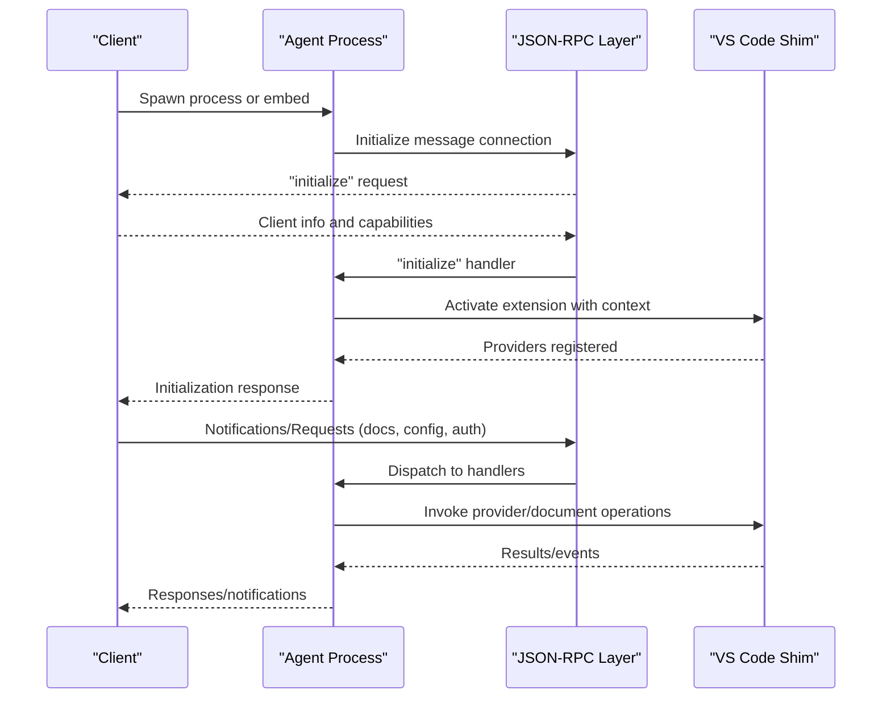

**Diagram sources**
- [agent.ts:381-499](file://agent/src/agent.ts#L381-L499)
- [index.ts:206-251](file://agent/src/index.ts#L206-L251)
- [jsonrpc-alias.ts:1-2](file://agent/src/jsonrpc-alias.ts#L1-L2)

## Detailed Component Analysis

### Agent Lifecycle and Initialization
- Entry point sets up uncaught exception handling and registers platform certificates before parsing CLI commands.
- The Agent class implements the “initialize” request, sets client info, initializes global state, registers providers, configures webviews, and activates the extension.
- Capability negotiation enables/disables features like code actions, code lenses, ignore policies, secrets, and authentication.

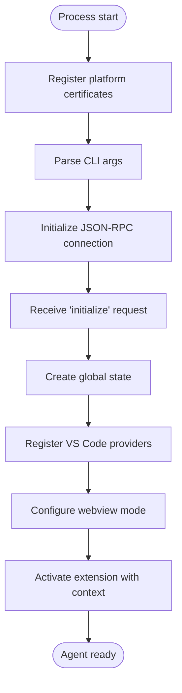

**Diagram sources**
- [index.ts:16-34](file://agent/src/index.ts#L16-L34)
- [agent.ts:381-499](file://agent/src/agent.ts#L381-L499)

**Section sources**
- [index.ts:16-34](file://agent/src/index.ts#L16-L34)
- [agent.ts:381-499](file://agent/src/agent.ts#L381-L499)

### JSON-RPC and Message Handling
- The agent uses a JSON-RPC message connection with a MessageHandler base class.
- Requests and notifications are registered for lifecycle, document operations, configuration, diagnostics, and testing utilities.
- Authentication-aware requests gate protected operations.

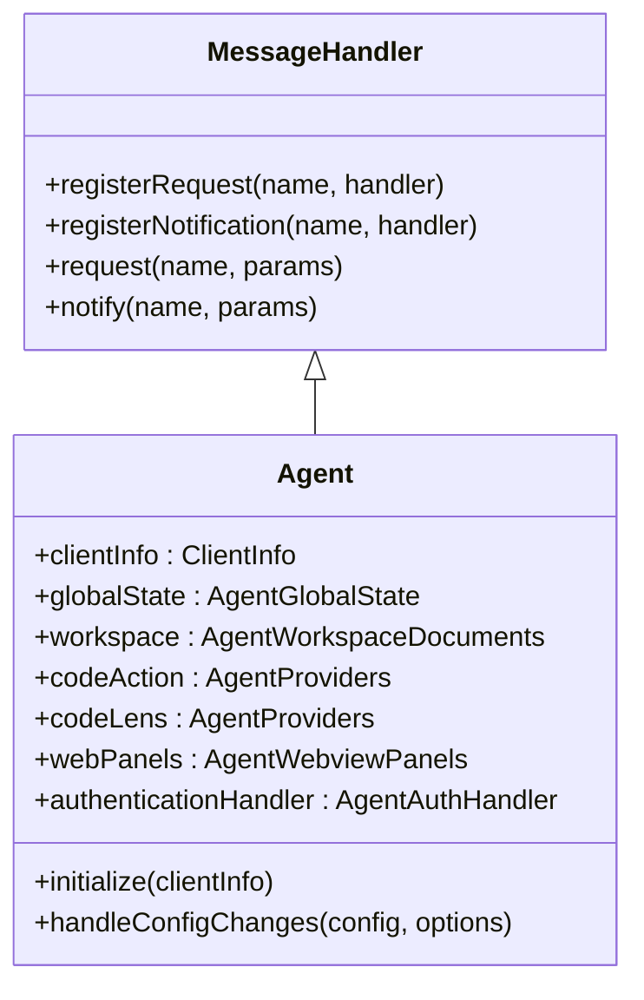

**Diagram sources**
- [jsonrpc-alias.ts:1-2](file://agent/src/jsonrpc-alias.ts#L1-L2)
- [agent.ts:295-499](file://agent/src/agent.ts#L295-L499)

**Section sources**
- [agent.ts:295-499](file://agent/src/agent.ts#L295-L499)
- [jsonrpc-alias.ts:1-2](file://agent/src/jsonrpc-alias.ts#L1-L2)

### Document Synchronization and Workspace Management
- Maintains a map of AgentTextDocument and AgentTextEditor instances keyed by URI string.
- Supports incremental content changes and fallback to full-content diffing.
- Emits VS Code shim events for visible editors, active editor, and tab groups.
- Panic detection compares client and server document state to detect out-of-sync conditions.

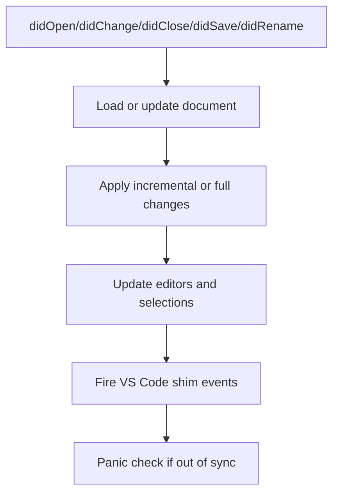

**Diagram sources**
- [AgentWorkspaceDocuments.ts:52-118](file://agent/src/AgentWorkspaceDocuments.ts#L52-L118)
- [agent.ts:550-595](file://agent/src/agent.ts#L550-L595)

**Section sources**
- [AgentWorkspaceDocuments.ts:29-118](file://agent/src/AgentWorkspaceDocuments.ts#L29-L118)
- [agent.ts:550-595](file://agent/src/agent.ts#L550-L595)

### Secrets Management
- Stateless secret storage: in-memory map synchronized with VS Code SecretStorage interface.
- Client-managed secret storage: delegates get/store/delete to the client via JSON-RPC.

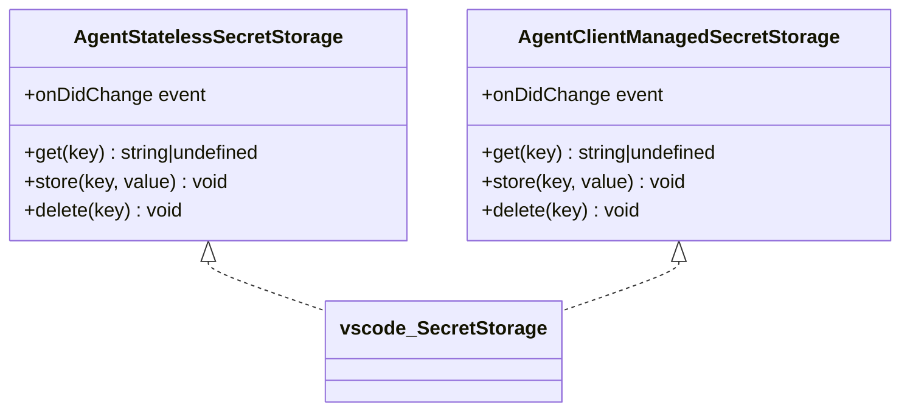

**Diagram sources**
- [AgentSecretStorage.ts:5-60](file://agent/src/AgentSecretStorage.ts#L5-L60)

**Section sources**
- [AgentSecretStorage.ts:5-60](file://agent/src/AgentSecretStorage.ts#L5-L60)

### Global State and Persistence
- Provides a Memento-like interface with two backends:
  - In-memory for ephemeral runs.
  - LocalStorage-backed for persistent state under a configured directory.
- Supports migration and default keys for client-side UX.

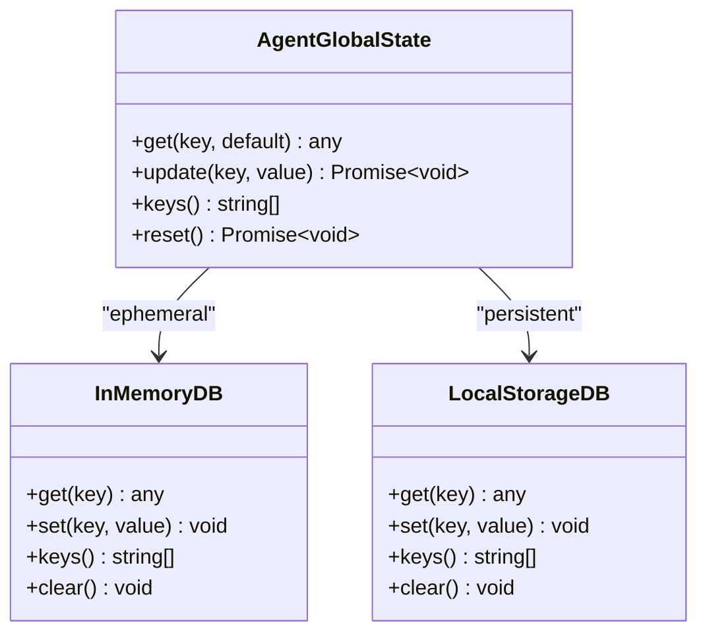

**Diagram sources**
- [AgentGlobalState.ts:12-86](file://agent/src/global-state/AgentGlobalState.ts#L12-L86)
- [AgentGlobalState.ts:95-150](file://agent/src/global-state/AgentGlobalState.ts#L95-L150)

**Section sources**
- [AgentGlobalState.ts:12-86](file://agent/src/global-state/AgentGlobalState.ts#L12-L86)
- [AgentGlobalState.ts:95-150](file://agent/src/global-state/AgentGlobalState.ts#L95-L150)

### Configuration Overlay and Defaults
- Merges client-provided configuration with defaults and overlays.
- Exposes IDE metadata, telemetry mode, and feature flags to the extension.

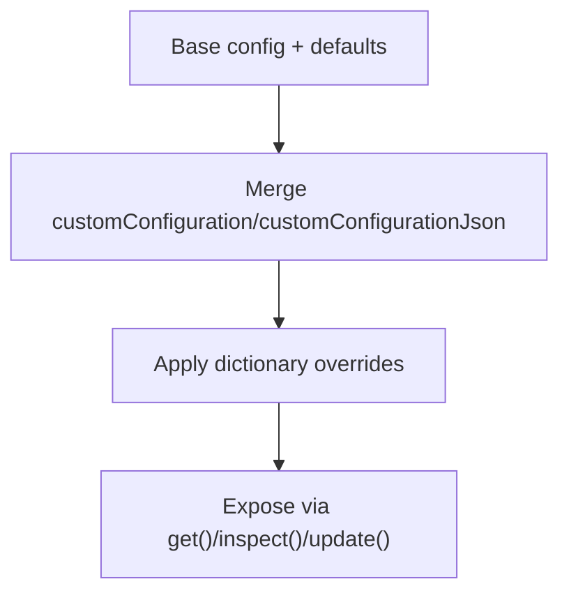

**Diagram sources**
- [AgentWorkspaceConfiguration.ts:59-160](file://agent/src/AgentWorkspaceConfiguration.ts#L59-L160)

**Section sources**
- [AgentWorkspaceConfiguration.ts:10-160](file://agent/src/AgentWorkspaceConfiguration.ts#L10-L160)

### Webview Panels and Messaging
- Manages a registry of webview panels and bridges message APIs to the client.
- Supports attribution results and initialization signaling.

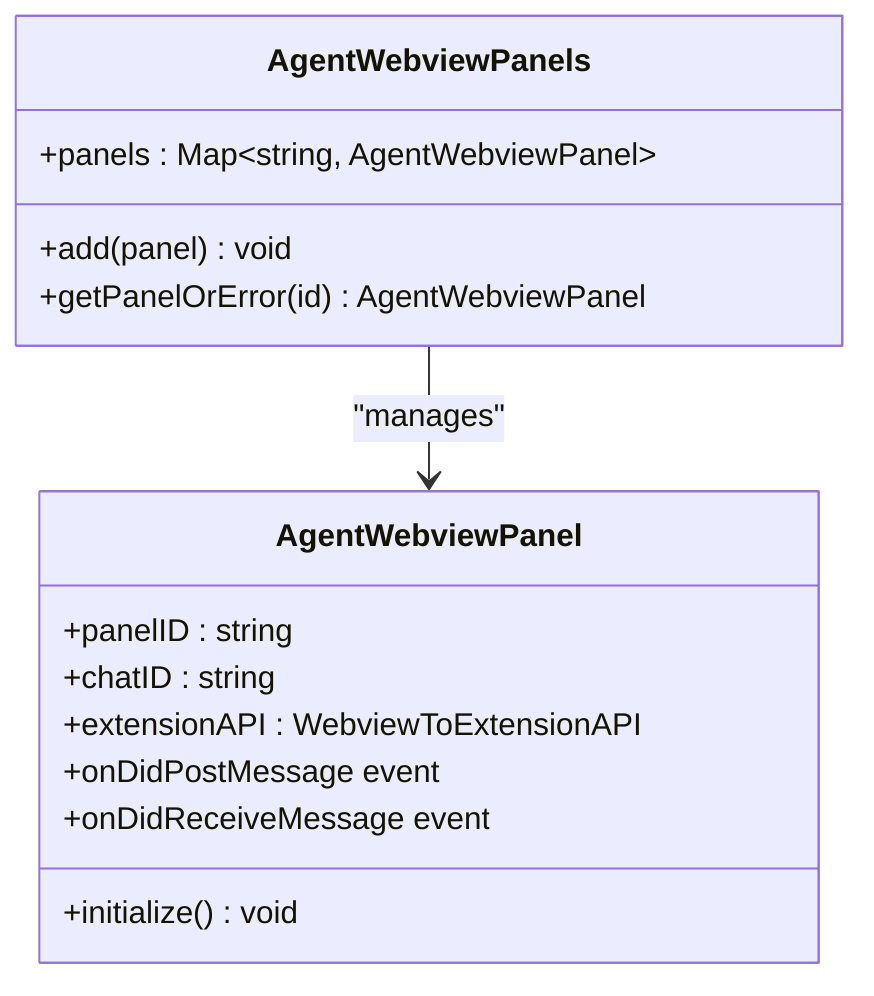

**Diagram sources**
- [AgentWebviewPanel.ts:14-34](file://agent/src/AgentWebviewPanel.ts#L14-L34)
- [AgentWebviewPanel.ts:49-173](file://agent/src/AgentWebviewPanel.ts#L49-L173)

**Section sources**
- [AgentWebviewPanel.ts:14-34](file://agent/src/AgentWebviewPanel.ts#L14-L34)
- [AgentWebviewPanel.ts:49-173](file://agent/src/AgentWebviewPanel.ts#L49-L173)

### Authentication Handler
- Starts a local HTTP server on loopback to receive OAuth tokens.
- Redirects the user to the Sourcegraph login page with a callback URI containing a port parameter.
- Automatically closes the server after a timeout.

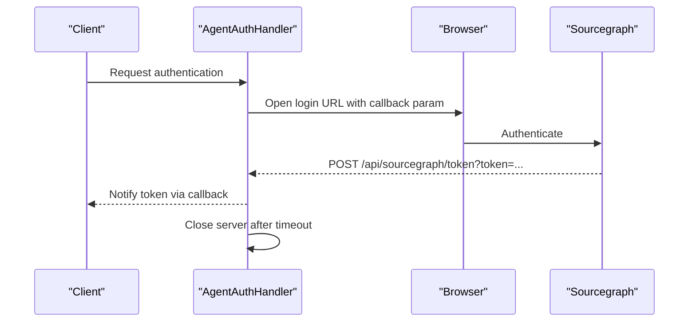

**Diagram sources**
- [AgentAuthHandler.ts:38-99](file://agent/src/AgentAuthHandler.ts#L38-L99)
- [AgentAuthHandler.ts:118-142](file://agent/src/AgentAuthHandler.ts#L118-L142)

**Section sources**
- [AgentAuthHandler.ts:17-99](file://agent/src/AgentAuthHandler.ts#L17-L99)
- [AgentAuthHandler.ts:118-142](file://agent/src/AgentAuthHandler.ts#L118-L142)

### Certificate Registration
- Adds platform-specific root certificates to the HTTPS agent to improve trust on macOS, Windows, and Linux.

**Section sources**
- [certs.ts:13-72](file://agent/src/certs.ts#L13-L72)

## Dependency Analysis
- The CLI entrypoint depends on the root command definition and the agent’s JSON-RPC server.
- The agent depends on the VS Code shim and shared libraries for configuration, telemetry, and GraphQL operations.
- Provider registries decouple extension capabilities from the agent’s core.
- Workspace documents depend on protocol converters and change calculators.

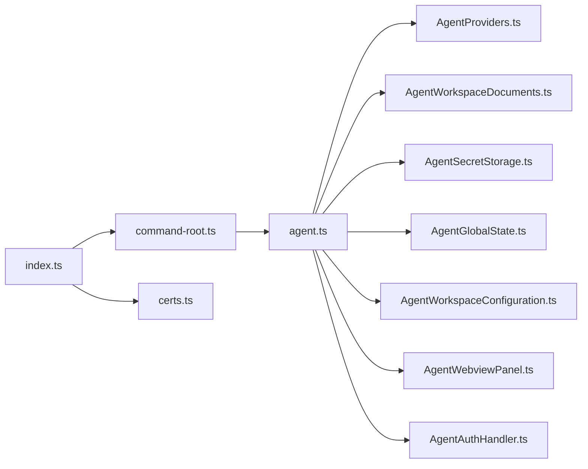

**Diagram sources**
- [index.ts:1-34](file://agent/src/index.ts#L1-L34)
- [command-root.ts:1-23](file://agent/src/cli/command-root.ts#L1-L23)
- [agent.ts:295-499](file://agent/src/agent.ts#L295-L499)
- [AgentProviders.ts:1-24](file://agent/src/AgentProviders.ts#L1-L24)
- [AgentWorkspaceDocuments.ts:1-262](file://agent/src/AgentWorkspaceDocuments.ts#L1-L262)
- [AgentSecretStorage.ts:1-60](file://agent/src/AgentSecretStorage.ts#L1-L60)
- [AgentGlobalState.ts:1-150](file://agent/src/global-state/AgentGlobalState.ts#L1-L150)
- [AgentWorkspaceConfiguration.ts:1-214](file://agent/src/AgentWorkspaceConfiguration.ts#L1-L214)
- [AgentWebviewPanel.ts:1-173](file://agent/src/AgentWebviewPanel.ts#L1-L173)
- [AgentAuthHandler.ts:1-171](file://agent/src/AgentAuthHandler.ts#L1-L171)
- [certs.ts:1-72](file://agent/src/certs.ts#L1-L72)

**Section sources**
- [index.ts:1-34](file://agent/src/index.ts#L1-L34)
- [command-root.ts:1-23](file://agent/src/cli/command-root.ts#L1-L23)
- [agent.ts:295-499](file://agent/src/agent.ts#L295-L499)

## Performance Considerations
- Memory usage and heap dumps are exposed for testing and debugging.
- Garbage collection can be triggered programmatically in test contexts.
- Incremental document synchronization reduces bandwidth and CPU overhead.
- Platform certificate registration avoids repeated network failures and retries.

**Section sources**
- [agent.ts:758-769](file://agent/src/agent.ts#L758-L769)
- [AgentWorkspaceDocuments.ts:88-101](file://agent/src/AgentWorkspaceDocuments.ts#L88-L101)
- [certs.ts:13-72](file://agent/src/certs.ts#L13-L72)

## Security Architecture
- Process isolation: The agent can run as a separate process or be embedded; in either mode, it maintains a strict JSON-RPC boundary.
- Certificate trust: Platform root certificates are injected into the HTTPS agent to ensure secure TLS connections.
- Authentication: The embedded HTTP server listens only on localhost and closes after a timeout; tokens are delivered via a controlled callback.
- Secrets: Two modes—stateless in-memory or client-managed—allow flexible security posture depending on deployment.
- Privilege separation: The agent minimizes privileged operations and defers secrets and persistent state to client-managed or filesystem-backed stores.

**Section sources**
- [index.ts:206-251](file://agent/src/index.ts#L206-L251)
- [certs.ts:13-72](file://agent/src/certs.ts#L13-L72)
- [AgentAuthHandler.ts:38-99](file://agent/src/AgentAuthHandler.ts#L38-L99)
- [AgentSecretStorage.ts:5-60](file://agent/src/AgentSecretStorage.ts#L5-L60)

## Extensibility and Plugin Framework
- Provider registry: Code action and code lens providers are dynamically registered and dispatched through the agent.
- Capability flags: Clients can enable/disable features (e.g., ignore policy, authentication, secrets) to tailor the agent’s behavior.
- Webview modes: Agentic vs native webview support allows different UI rendering strategies.

**Section sources**
- [AgentProviders.ts:9-23](file://agent/src/AgentProviders.ts#L9-L23)
- [agent.ts:409-433](file://agent/src/agent.ts#L409-L433)
- [AgentWebviewPanel.ts:14-34](file://agent/src/AgentWebviewPanel.ts#L14-L34)

## System Requirements and Deployment
- Node.js runtime with source maps enabled for debugging.
- Platform-specific certificate handling for macOS, Windows, and Linux.
- Optional filesystem-backed global state directory for persistent runs.
- Client capability negotiation determines feature availability.

**Section sources**
- [index.ts:19-21](file://agent/src/index.ts#L19-L21)
- [certs.ts:13-72](file://agent/src/certs.ts#L13-L72)
- [AgentGlobalState.ts:28-33](file://agent/src/global-state/AgentGlobalState.ts#L28-L33)

## Monitoring and Observability
- Health checks: The agent responds to shutdown and exit notifications; clients can probe readiness via initialization.
- Metrics and telemetry: The agent sets telemetry level to “agent” and relies on client-side telemetry recording; testing endpoints expose network requests and exported events.
- Logging: Debug messages and window messages are forwarded to stderr and stdout respectively.

**Section sources**
- [agent.ts:503-513](file://agent/src/agent.ts#L503-L513)
- [agent.ts:770-800](file://agent/src/agent.ts#L770-L800)
- [index.ts:6-6](file://agent/src/index.ts#L6-L6)

## Troubleshooting Guide
- Uncaught exceptions: The process logs and continues rather than crashing, aiding resilience during development and testing.
- Document sync panics: The agent detects out-of-sync conditions and logs panic messages to aid debugging.
- Testing utilities: Memory usage, heap dumps, and exported telemetry events are exposed for diagnosing performance and correctness.

**Section sources**
- [index.ts:16-24](file://agent/src/index.ts#L16-L24)
- [agent.ts:306-316](file://agent/src/agent.ts#L306-L316)
- [agent.ts:758-769](file://agent/src/agent.ts#L758-L769)

## Conclusion
The agent runtime provides a robust, cross-platform bridge between clients and AI services. Its architecture emphasizes process isolation, capability-driven feature activation, and a clean separation between client RPC and internal extension activation. With strong foundations in document synchronization, secrets management, configuration overlay, and security, the agent is extensible and suitable for diverse deployment scenarios.