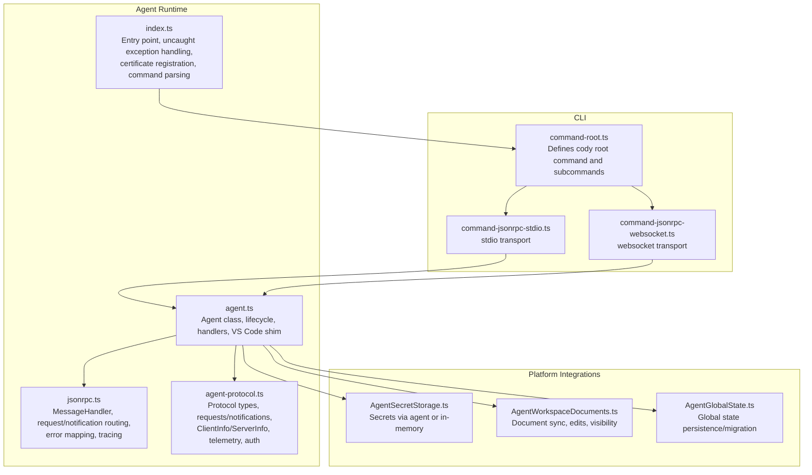
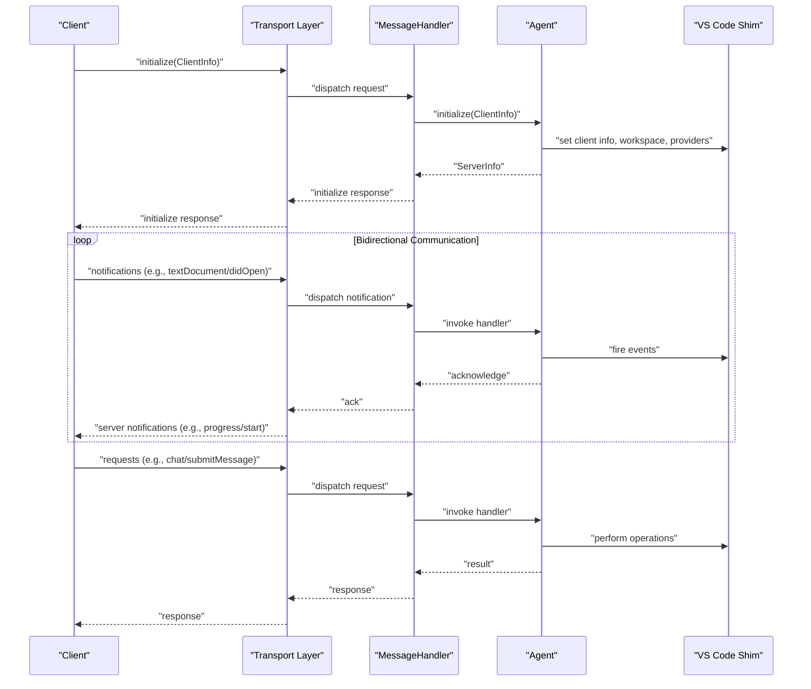
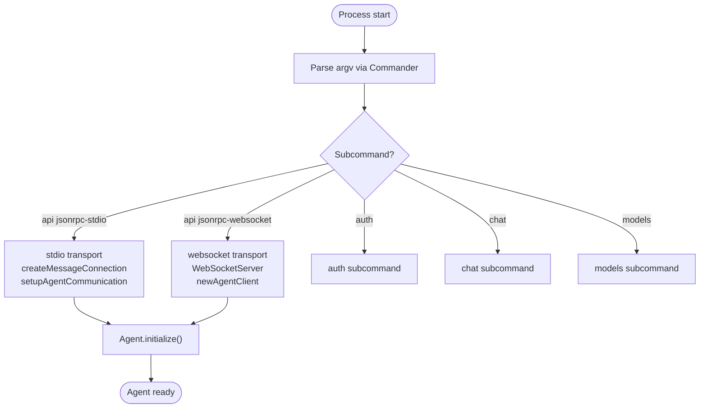
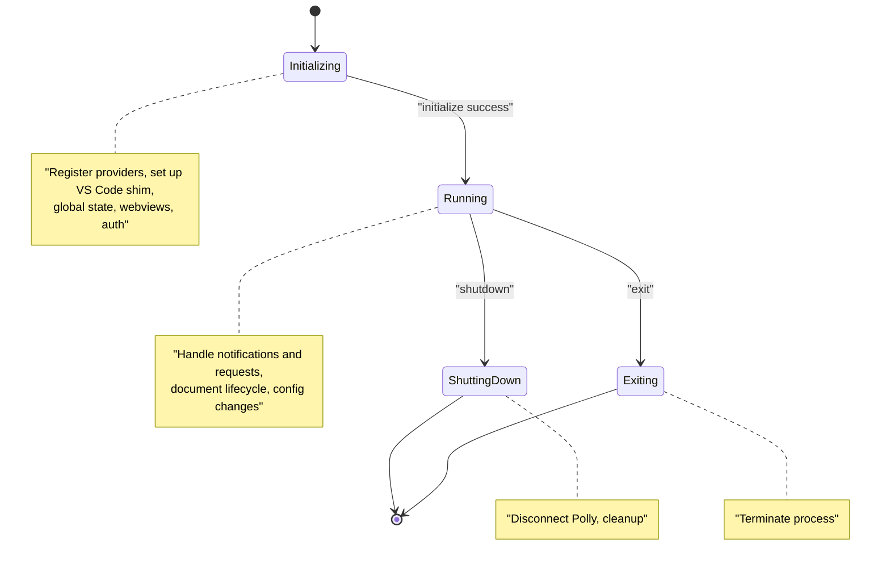
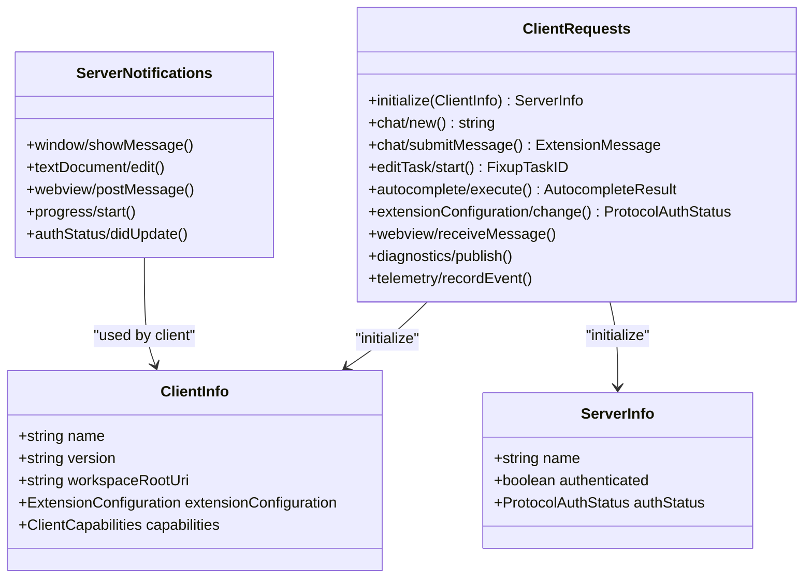
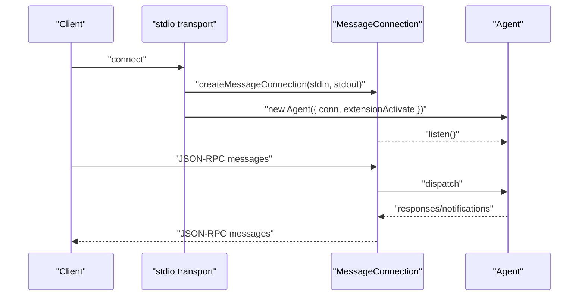
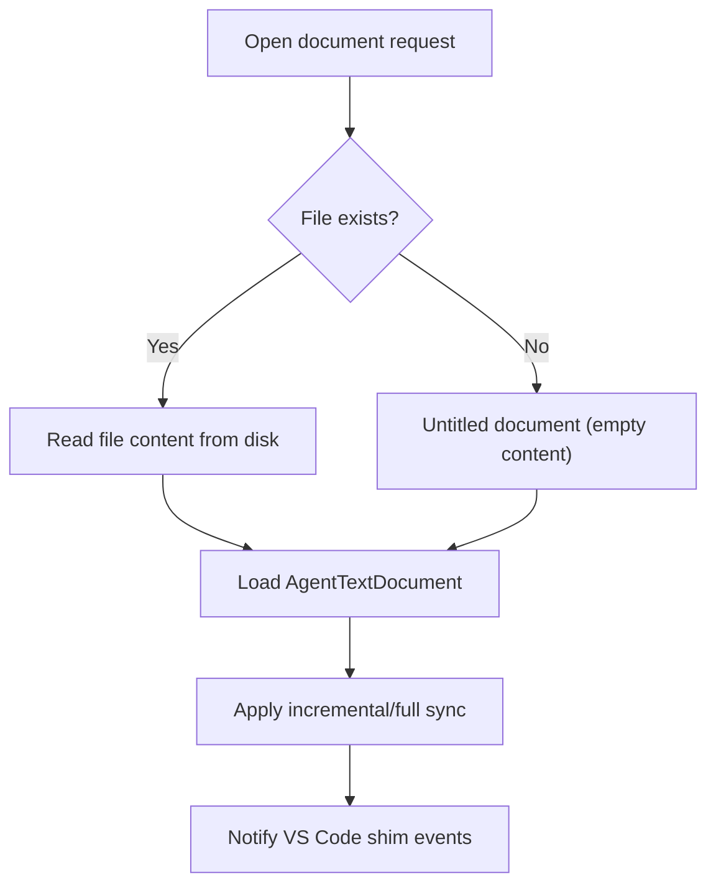
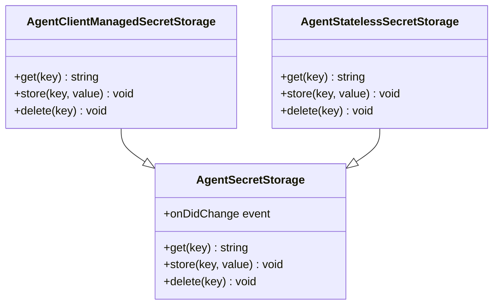
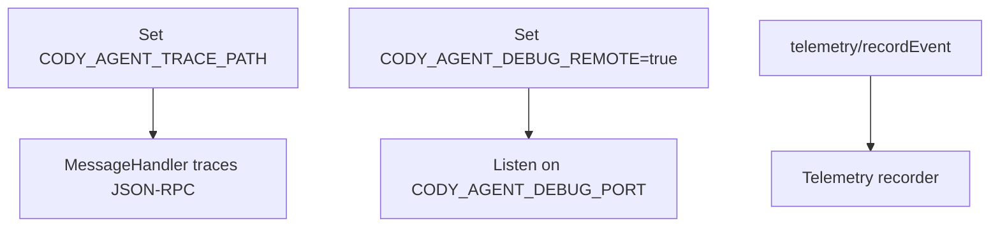
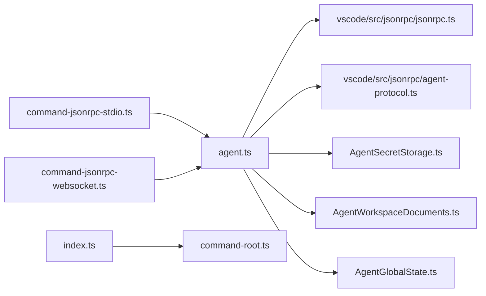

# Agent Runtime

<cite>
**Referenced Files in This Document**
- [index.ts](file://agent/src/index.ts)
- [command-root.ts](file://agent/src/cli/command-root.ts)
- [command-jsonrpc-stdio.ts](file://agent/src/cli/command-jsonrpc-stdio.ts)
- [command-jsonrpc-websocket.ts](file://agent/src/cli/command-jsonrpc-websocket.ts)
- [agent.ts](file://agent/src/agent.ts)
- [jsonrpc.ts](file://vscode/src/jsonrpc/jsonrpc.ts)
- [agent-protocol.ts](file://vscode/src/jsonrpc/agent-protocol.ts)
- [AgentSecretStorage.ts](file://agent/src/AgentSecretStorage.ts)
- [AgentWorkspaceDocuments.ts](file://agent/src/AgentWorkspaceDocuments.ts)
- [AgentGlobalState.ts](file://agent/src/global-state/AgentGlobalState.ts)
- [protocol.md](file://agent/protocol.md)
- [package.json](file://agent/package.json)
</cite>

## Table of Contents
1. [Introduction](#introduction)
2. [Project Structure](#project-structure)
3. [Core Components](#core-components)
4. [Architecture Overview](#architecture-overview)
5. [Detailed Component Analysis](#detailed-component-analysis)
6. [Dependency Analysis](#dependency-analysis)
7. [Performance Considerations](#performance-considerations)
8. [Troubleshooting Guide](#troubleshooting-guide)
9. [Conclusion](#conclusion)
10. [Appendices](#appendices)

## Introduction
This document describes the agent runtime system that powers cross-platform AI interaction via a JSON-RPC protocol. It covers process management, CLI design, subcommand organization, agent lifecycle, JSON-RPC protocol specification, communication channels (stdio and WebSocket), platform integration, security, debugging/logging, performance monitoring, and extensibility.

## Project Structure
The agent runtime is implemented primarily under agent/src and integrates with shared protocol definitions under vscode/src/jsonrpc. The CLI entrypoint delegates to subcommands for stdio and WebSocket transports, and the Agent class implements the JSON-RPC server and VS Code extension activation surface.

**Diagram sources**
- [index.ts:1-34](file://agent/src/index.ts#L1-L34)
- [command-root.ts:1-23](file://agent/src/cli/command-root.ts#L1-L23)
- [command-jsonrpc-stdio.ts:1-208](file://agent/src/cli/command-jsonrpc-stdio.ts#L1-L208)
- [command-jsonrpc-websocket.ts:1-55](file://agent/src/cli/command-jsonrpc-websocket.ts#L1-L55)
- [agent.ts:1-1758](file://agent/src/agent.ts#L1-L1758)
- [jsonrpc.ts:1-191](file://vscode/src/jsonrpc/jsonrpc.ts#L1-L191)
- [agent-protocol.ts:1-1081](file://vscode/src/jsonrpc/agent-protocol.ts#L1-L1081)
- [AgentSecretStorage.ts:1-60](file://agent/src/AgentSecretStorage.ts#L1-L60)
- [AgentWorkspaceDocuments.ts:1-262](file://agent/src/AgentWorkspaceDocuments.ts#L1-L262)
- [AgentGlobalState.ts:1-150](file://agent/src/global-state/AgentGlobalState.ts#L1-L150)

**Section sources**
- [index.ts:1-34](file://agent/src/index.ts#L1-L34)
- [command-root.ts:1-23](file://agent/src/cli/command-root.ts#L1-L23)
- [command-jsonrpc-stdio.ts:1-208](file://agent/src/cli/command-jsonrpc-stdio.ts#L1-L208)
- [command-jsonrpc-websocket.ts:1-55](file://agent/src/cli/command-jsonrpc-websocket.ts#L1-L55)
- [agent.ts:1-1758](file://agent/src/agent.ts#L1-L1758)
- [jsonrpc.ts:1-191](file://vscode/src/jsonrpc/jsonrpc.ts#L1-L191)
- [agent-protocol.ts:1-1081](file://vscode/src/jsonrpc/agent-protocol.ts#L1-L1081)
- [AgentSecretStorage.ts:1-60](file://agent/src/AgentSecretStorage.ts#L1-L60)
- [AgentWorkspaceDocuments.ts:1-262](file://agent/src/AgentWorkspaceDocuments.ts#L1-L262)
- [AgentGlobalState.ts:1-150](file://agent/src/global-state/AgentGlobalState.ts#L1-L150)

## Core Components
- CLI entrypoint and command parsing: Initializes the root command, registers subcommands, and parses arguments. It also redirects console.log to console.error and installs local certificates.
- JSON-RPC transport:
  - stdio: Creates a message connection over stdin/stdout, optionally wraps with Polly for network recording/replay, and starts the Agent.
  - websocket: Starts a WebSocket server and proxies messages to a spawned Agent client.
- Agent lifecycle:
  - initialize: Registers providers, sets up VS Code shim, initializes global state, configures webviews, and authenticates.
  - shutdown: Disconnects Polly and exits cleanly.
  - exit: Terminates the process.
- MessageHandler: Centralized request/notification routing, cancellation/error mapping, tracing, and in-process client access.
- Protocol types: Strongly typed JSON-RPC requests/notifications, ClientInfo/ServerInfo, telemetry, diagnostics, and authentication status.

**Section sources**
- [index.ts:1-34](file://agent/src/index.ts#L1-L34)
- [command-jsonrpc-stdio.ts:115-208](file://agent/src/cli/command-jsonrpc-stdio.ts#L115-L208)
- [command-jsonrpc-websocket.ts:12-55](file://agent/src/cli/command-jsonrpc-websocket.ts#L12-L55)
- [agent.ts:381-513](file://agent/src/agent.ts#L381-L513)
- [jsonrpc.ts:40-191](file://vscode/src/jsonrpc/jsonrpc.ts#L40-L191)
- [agent-protocol.ts:30-472](file://vscode/src/jsonrpc/agent-protocol.ts#L30-L472)

## Architecture Overview
The agent runtime is a JSON-RPC server that can be embedded or launched as a separate process. It speaks JSON-RPC over stdio or WebSocket, exposes a rich protocol for chat, autocomplete, editing, diagnostics, and webviews, and integrates with VS Code APIs via a shim.

**Diagram sources**
- [agent.ts:381-513](file://agent/src/agent.ts#L381-L513)
- [jsonrpc.ts:40-191](file://vscode/src/jsonrpc/jsonrpc.ts#L40-L191)
- [agent-protocol.ts:30-472](file://vscode/src/jsonrpc/agent-protocol.ts#L30-L472)

## Detailed Component Analysis

### CLI and Subcommand Organization
- Root command defines the cody CLI, version, description, and adds subcommands for auth, chat, models, api (jsonrpc-stdio), and internal (bench).
- The stdio subcommand supports Polly recording/replay modes, expiry strategies, and optional debug server over TCP for remote debugging.
- The websocket subcommand starts a WebSocket server and proxies messages to a spawned Agent client.

**Diagram sources**
- [command-root.ts:12-23](file://agent/src/cli/command-root.ts#L12-L23)
- [command-jsonrpc-stdio.ts:61-179](file://agent/src/cli/command-jsonrpc-stdio.ts#L61-L179)
- [command-jsonrpc-websocket.ts:12-55](file://agent/src/cli/command-jsonrpc-websocket.ts#L12-L55)

**Section sources**
- [command-root.ts:1-23](file://agent/src/cli/command-root.ts#L1-L23)
- [command-jsonrpc-stdio.ts:1-208](file://agent/src/cli/command-jsonrpc-stdio.ts#L1-L208)
- [command-jsonrpc-websocket.ts:1-55](file://agent/src/cli/command-jsonrpc-websocket.ts#L1-L55)

### Agent Lifecycle Management
- Startup:
  - initialize: Registers providers (code actions, code lenses), sets up VS Code shim, initializes global state, configures webviews (native or agentic), and authenticates.
  - Handles workspace folders, window focus, document lifecycle (open/change/save/close/rename), and configuration changes.
- Shutdown:
  - shutdown: Stops Polly recording and returns null.
  - exit: Exits the process.
- Error handling:
  - Uncaught exceptions are captured and logged without crashing the process.
  - JSON-RPC error mapping distinguishes rate limit errors, canceled requests, and internal errors.

**Diagram sources**
- [agent.ts:381-513](file://agent/src/agent.ts#L381-L513)
- [index.ts:16-24](file://agent/src/index.ts#L16-L24)
- [jsonrpc.ts:69-88](file://vscode/src/jsonrpc/jsonrpc.ts#L69-L88)

**Section sources**
- [agent.ts:381-513](file://agent/src/agent.ts#L381-L513)
- [index.ts:16-24](file://agent/src/index.ts#L16-L24)
- [jsonrpc.ts:69-88](file://vscode/src/jsonrpc/jsonrpc.ts#L69-L88)

### JSON-RPC Protocol Specification
- The protocol is a JSON-RPC 2.0-compatible wire format with a subset of methods for initialization, chat, autocomplete, editing, diagnostics, webviews, and telemetry.
- Client-to-server requests include initialize, chat/*, commands/*, editTask/*, autocomplete/execute, diagnostics/publish, extensionConfiguration/change, and more.
- Server-to-client notifications include window/showMessage, textDocument/edit, webview/postMessage, progress/*, and authStatus updates.
- ClientInfo and ServerInfo define handshake metadata, including authentication status and capabilities.

**Diagram sources**
- [agent-protocol.ts:30-472](file://vscode/src/jsonrpc/agent-protocol.ts#L30-L472)
- [agent-protocol.ts:588-618](file://vscode/src/jsonrpc/agent-protocol.ts#L588-L618)

**Section sources**
- [protocol.md:1-482](file://agent/protocol.md#L1-L482)
- [agent-protocol.ts:30-472](file://vscode/src/jsonrpc/agent-protocol.ts#L30-L472)
- [agent-protocol.ts:588-618](file://vscode/src/jsonrpc/agent-protocol.ts#L588-L618)

### Communication Channels
- stdio:
  - Uses vscode-jsonrpc StreamMessageReader/Writer over process.stdin/process.stdout.
  - Supports Polly recording/replay for network traffic in testing scenarios.
  - Optionally exposes a debug TCP server for remote debugging.
- WebSocket:
  - Starts a WebSocketServer and proxies messages to a spawned Agent client.
  - Currently marked as not working and serves as a placeholder for future implementation.

**Diagram sources**
- [command-jsonrpc-stdio.ts:181-208](file://agent/src/cli/command-jsonrpc-stdio.ts#L181-L208)
- [jsonrpc.ts:40-67](file://vscode/src/jsonrpc/jsonrpc.ts#L40-L67)
- [agent.ts:195-251](file://agent/src/agent.ts#L195-L251)

**Section sources**
- [command-jsonrpc-stdio.ts:1-208](file://agent/src/cli/command-jsonrpc-stdio.ts#L1-L208)
- [command-jsonrpc-websocket.ts:1-55](file://agent/src/cli/command-jsonrpc-websocket.ts#L1-L55)
- [jsonrpc.ts:40-67](file://vscode/src/jsonrpc/jsonrpc.ts#L40-L67)
- [agent.ts:195-251](file://agent/src/agent.ts#L195-L251)

### Platform Integration
- File system access:
  - Opens documents from disk when needed, handles untitled documents, and reads file contents for new documents.
- Network communication:
  - Uses Polly for recording/replaying network requests in testing; supports passthrough for large downloads.
- Process spawning:
  - Spawns a child process for stdio mode and pipes stderr to parent when configured.
- Webviews:
  - Supports native webviews and agentic webviews, with registration and lifecycle management.

**Diagram sources**
- [AgentWorkspaceDocuments.ts:216-236](file://agent/src/AgentWorkspaceDocuments.ts#L216-L236)
- [AgentWorkspaceDocuments.ts:88-118](file://agent/src/AgentWorkspaceDocuments.ts#L88-L118)

**Section sources**
- [AgentWorkspaceDocuments.ts:1-262](file://agent/src/AgentWorkspaceDocuments.ts#L1-L262)
- [command-jsonrpc-stdio.ts:115-154](file://agent/src/cli/command-jsonrpc-stdio.ts#L115-L154)
- [agent.ts:209-221](file://agent/src/agent.ts#L209-L221)

### Security, Authentication, and Secrets
- Authentication:
  - Authentication handler is conditionally enabled based on client capabilities.
  - Authentication status is exposed via protocol types and notifications.
- Secrets:
  - Two secret storage modes:
    - Client-managed: requests secrets from the agent via JSON-RPC.
    - Stateless in-memory: seeds secrets from configuration and stores them in memory.
- Certificate handling:
  - Installs local certificates at startup to support HTTPS endpoints.

**Diagram sources**
- [AgentSecretStorage.ts:5-60](file://agent/src/AgentSecretStorage.ts#L5-L60)

**Section sources**
- [agent.ts:431-433](file://agent/src/agent.ts#L431-L433)
- [AgentSecretStorage.ts:1-60](file://agent/src/AgentSecretStorage.ts#L1-L60)
- [index.ts:26](file://agent/src/index.ts#L26)

### Debugging, Logging, and Telemetry
- Tracing:
  - Optional JSON trace logging to a file via environment variable.
- Debug server:
  - Optional TCP debug server for remote debugging of the agent process.
- Telemetry:
  - JSON-RPC telemetry/recordEvent request for recording events with metadata and billing categories.
- Error handling:
  - JSON-RPC error codes distinguish rate limits, cancellations, and internal errors.

**Diagram sources**
- [jsonrpc.ts:29](file://vscode/src/jsonrpc/jsonrpc.ts#L29)
- [jsonrpc.ts:61-66](file://vscode/src/jsonrpc/jsonrpc.ts#L61-L66)
- [command-jsonrpc-stdio.ts:56-59](file://agent/src/cli/command-jsonrpc-stdio.ts#L56-L59)
- [agent-protocol.ts:669-683](file://vscode/src/jsonrpc/agent-protocol.ts#L669-L683)

**Section sources**
- [jsonrpc.ts:29-67](file://vscode/src/jsonrpc/jsonrpc.ts#L29-L67)
- [command-jsonrpc-stdio.ts:56-59](file://agent/src/cli/command-jsonrpc-stdio.ts#L56-L59)
- [agent-protocol.ts:669-683](file://vscode/src/jsonrpc/agent-protocol.ts#L669-L683)

### Extensibility and Plugin Architecture
- Providers:
  - Code action and code lens providers are registered dynamically based on client capabilities.
- Webviews:
  - Native and agentic webview support with registration and lifecycle notifications.
- Global state:
  - Migratable persistent storage for extension state.
- Secret storage:
  - Pluggable secret storage backed by client or in-memory storage.

**Section sources**
- [agent.ts:409-424](file://agent/src/agent.ts#L409-L424)
- [agent.ts:473-480](file://agent/src/agent.ts#L473-L480)
- [AgentGlobalState.ts:1-150](file://agent/src/global-state/AgentGlobalState.ts#L1-L150)
- [AgentSecretStorage.ts:1-60](file://agent/src/AgentSecretStorage.ts#L1-L60)

## Dependency Analysis
The agent runtime depends on:
- vscode-jsonrpc for JSON-RPC transport and message handling.
- VS Code protocol types and agent protocol definitions.
- Polly for network recording/replay in testing.
- Node child process for spawning agents in stdio mode.

**Diagram sources**
- [agent.ts:1-106](file://agent/src/agent.ts#L1-L106)
- [jsonrpc.ts:1-10](file://vscode/src/jsonrpc/jsonrpc.ts#L1-L10)
- [agent-protocol.ts:1-26](file://vscode/src/jsonrpc/agent-protocol.ts#L1-L26)
- [AgentSecretStorage.ts:1-60](file://agent/src/AgentSecretStorage.ts#L1-L60)
- [AgentWorkspaceDocuments.ts:1-18](file://agent/src/AgentWorkspaceDocuments.ts#L1-L18)
- [AgentGlobalState.ts:1-9](file://agent/src/global-state/AgentGlobalState.ts#L1-L9)
- [command-jsonrpc-stdio.ts:1-12](file://agent/src/cli/command-jsonrpc-stdio.ts#L1-L12)
- [command-jsonrpc-websocket.ts:1-6](file://agent/src/cli/command-jsonrpc-websocket.ts#L1-L6)
- [index.ts:3-14](file://agent/src/index.ts#L3-L14)

**Section sources**
- [agent.ts:1-106](file://agent/src/agent.ts#L1-L106)
- [jsonrpc.ts:1-10](file://vscode/src/jsonrpc/jsonrpc.ts#L1-L10)
- [agent-protocol.ts:1-26](file://vscode/src/jsonrpc/agent-protocol.ts#L1-L26)
- [AgentSecretStorage.ts:1-60](file://agent/src/AgentSecretStorage.ts#L1-L60)
- [AgentWorkspaceDocuments.ts:1-18](file://agent/src/AgentWorkspaceDocuments.ts#L1-L18)
- [AgentGlobalState.ts:1-9](file://agent/src/global-state/AgentGlobalState.ts#L1-L9)
- [command-jsonrpc-stdio.ts:1-12](file://agent/src/cli/command-jsonrpc-stdio.ts#L1-L12)
- [command-jsonrpc-websocket.ts:1-6](file://agent/src/cli/command-jsonrpc-websocket.ts#L1-L6)
- [index.ts:3-14](file://agent/src/index.ts#L3-L14)

## Performance Considerations
- Incremental document synchronization minimizes bandwidth and CPU by applying only content changes.
- Polly recording/replay reduces network overhead in CI and enables deterministic tests.
- Tracing to a file helps diagnose performance bottlenecks in JSON-RPC message handling.
- Avoid unnecessary global state writes and ensure cleanup on shutdown.

[No sources needed since this section provides general guidance]

## Troubleshooting Guide
- Uncaught exceptions:
  - Captured and logged to stderr without crashing the process.
- JSON-RPC errors:
  - Rate limit errors, canceled requests, and internal errors are mapped to distinct error codes.
- Debugging:
  - Enable JSON trace logging via environment variable and/or remote debug server.
- WebSocket transport:
  - The WebSocket server command is currently not functional; use stdio transport for production.

**Section sources**
- [index.ts:16-24](file://agent/src/index.ts#L16-L24)
- [jsonrpc.ts:69-88](file://vscode/src/jsonrpc/jsonrpc.ts#L69-L88)
- [command-jsonrpc-stdio.ts:56-59](file://agent/src/cli/command-jsonrpc-stdio.ts#L56-L59)
- [command-jsonrpc-websocket.ts:12-15](file://agent/src/cli/command-jsonrpc-websocket.ts#L12-L15)

## Conclusion
The agent runtime provides a robust, cross-platform JSON-RPC server capable of powering AI features across clients. Its modular design supports stdio and WebSocket transports, strong protocol typing, secure secret handling, and extensible provider/webview architectures. With built-in tracing, error mapping, and testing integrations, it is suitable for both development and production environments.

[No sources needed since this section summarizes without analyzing specific files]

## Appendices

### Installation and Environment Setup
- Build and run the agent:
  - Build the agent and dependencies, then run the agent binary with source maps enabled.
  - Scripts are defined in the agent package.json for building, running, and testing.
- Environment variables:
  - CODY_AGENT_TRACE_PATH: Path to write JSON-RPC trace logs.
  - CODY_AGENT_DEBUG_REMOTE/CODY_AGENT_DEBUG_PORT: Enable remote debug server.
  - Polly recording controls: CODY_RECORDING_DIRECTORY, CODY_RECORDING_MODE, CODY_RECORDING_NAME, CODY_RECORDING_EXPIRY_STRATEGY, CODY_RECORDING_EXPIRES_IN, CODY_RECORD_IF_MISSING.

**Section sources**
- [package.json:13-26](file://agent/package.json#L13-L26)
- [command-jsonrpc-stdio.ts:56-114](file://agent/src/cli/command-jsonrpc-stdio.ts#L56-L114)