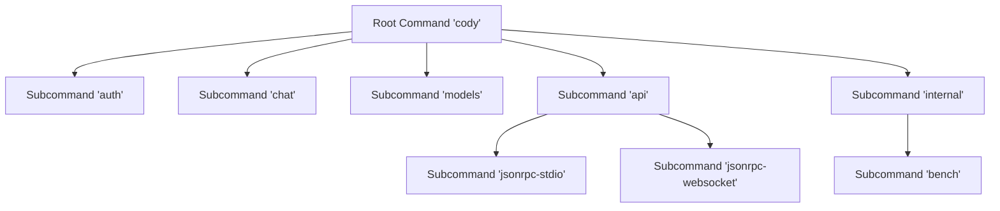
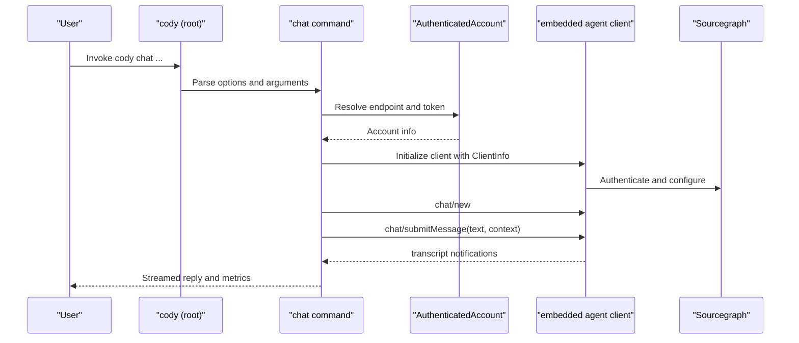
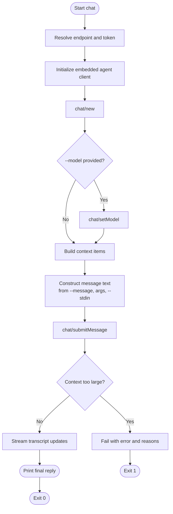
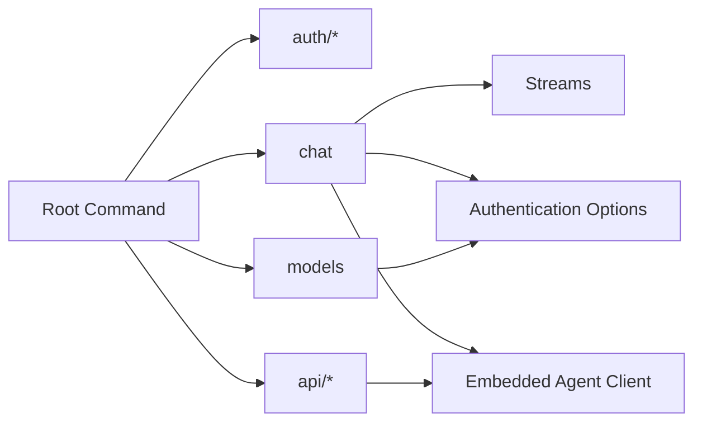

# CLI Interface

<cite>
**Referenced Files in This Document**
- [command-root.ts](file://agent/src/cli/command-root.ts)
- [command-chat.ts](file://agent/src/cli/command-chat.ts)
- [command-models.ts](file://agent/src/cli/command-models.ts)
- [command-jsonrpc-stdio.ts](file://agent/src/cli/command-jsonrpc-stdio.ts)
- [command-jsonrpc-websocket.ts](file://agent/src/cli/command-jsonrpc-websocket.ts)
- [command-auth/command-auth.ts](file://agent/src/cli/command-auth/command-auth.ts)
- [command-auth/command-login.ts](file://agent/src/cli/command-auth/command-login.ts)
- [command-auth/command-accounts.ts](file://agent/src/cli/command-auth/command-accounts.ts)
- [command-auth/command-logout.ts](file://agent/src/cli/command-auth/command-logout.ts)
- [command-auth/command-whoami.ts](file://agent/src/cli/command-auth/command-whoami.ts)
- [Streams.ts](file://agent/src/cli/Streams.ts)
</cite>

## Table of Contents
1. [Introduction](#introduction)
2. [Project Structure](#project-structure)
3. [Core Components](#core-components)
4. [Architecture Overview](#architecture-overview)
5. [Detailed Component Analysis](#detailed-component-analysis)
6. [Dependency Analysis](#dependency-analysis)
7. [Performance Considerations](#performance-considerations)
8. [Troubleshooting Guide](#troubleshooting-guide)
9. [Conclusion](#conclusion)
10. [Appendices](#appendices)

## Introduction
This document describes the agent’s command-line interface (CLI) for the Cody product. It explains the command hierarchy, argument parsing, subcommand organization, global options, configuration management, and operational modes. It also covers chat operations, model management, authentication, debugging utilities, interactive and batch usage, platform and shell integration, error handling, exit codes, diagnostics, and practical automation patterns.

## Project Structure
The CLI is organized under the agent package and built on top of the Commander library. The root command defines the top-level program metadata and aggregates subcommands. Subcommands are grouped by function: chat, authentication, models, and internal JSON-RPC APIs.

**Diagram sources**
- [command-root.ts:12-23](file://agent/src/cli/command-root.ts#L12-L23)
- [command-chat.ts:45-110](file://agent/src/cli/command-chat.ts#L45-L110)
- [command-models.ts:14-51](file://agent/src/cli/command-models.ts#L14-L51)
- [command-jsonrpc-stdio.ts:61-179](file://agent/src/cli/command-jsonrpc-stdio.ts#L61-L179)
- [command-jsonrpc-websocket.ts:12-55](file://agent/src/cli/command-jsonrpc-websocket.ts#L12-L55)

**Section sources**
- [command-root.ts:12-23](file://agent/src/cli/command-root.ts#L12-L23)

## Core Components
- Root command: Defines program name, version, description, and registers subcommands.
- Chat command: End-to-end chat with optional context, streaming, and diagnostics.
- Models command: Lists supported model IDs from the connected Sourcegraph instance.
- Authentication commands: Login, logout, whoami, accounts, and settings-path.
- JSON-RPC API commands: stdio and websocket transports for agent communication.
- Streams utility: Encapsulates stdout/stderr for deterministic output and testing.

**Section sources**
- [command-root.ts:12-23](file://agent/src/cli/command-root.ts#L12-L23)
- [command-chat.ts:29-43](file://agent/src/cli/command-chat.ts#L29-L43)
- [command-models.ts:9-12](file://agent/src/cli/command-models.ts#L9-L12)
- [command-jsonrpc-stdio.ts:13-21](file://agent/src/cli/command-jsonrpc-stdio.ts#L13-L21)
- [Streams.ts:6-28](file://agent/src/cli/Streams.ts#L6-L28)

## Architecture Overview
The CLI initializes an embedded agent client, authenticates against a Sourcegraph endpoint, and communicates via JSON-RPC. The chat command constructs a message from flags, arguments, and/or stdin, submits it to the agent, and streams the response. Authentication options are reused across commands.

**Diagram sources**
- [command-root.ts:12-23](file://agent/src/cli/command-root.ts#L12-L23)
- [command-chat.ts:82-110](file://agent/src/cli/command-chat.ts#L82-L110)
- [command-chat.ts:128-336](file://agent/src/cli/command-chat.ts#L128-L336)
- [command-auth/command-login.ts:14-34](file://agent/src/cli/command-auth/command-login.ts#L14-L34)

## Detailed Component Analysis

### Root Command
- Name: cody
- Version: derived from package.json
- Description: Headless mode and JSON-RPC integration
- Subcommands:
  - auth: Authentication operations
  - chat: Interactive chat with context
  - models: List supported model IDs
  - api: JSON-RPC transports
    - jsonrpc-stdio: stdio transport for editors
    - jsonrpc-websocket: websocket transport (not functional)
  - internal: Benchmarks

**Section sources**
- [command-root.ts:12-23](file://agent/src/cli/command-root.ts#L12-L23)

### Chat Command
Purpose: Run chat sessions with optional context, streaming, and diagnostics.

Key options:
- -m, --message <message>: Primary message text
- --stdin: Read message from stdin
- -C, --dir <dir>: Working directory for context resolution
- --model <model>: Override default chat model
- --context-repo <repos...>: Enterprise-only repository context
- --context-file <files...>: Local file context
- --show-context: Print resolved context items
- --ignore-context-window-errors: Skip context size validation
- --silent: Disable streaming reply
- --debug: Enable debug notifications
- Global auth options: --access-token and --endpoint (via shared options)

Behavior highlights:
- Resolves authentication via shared options and user settings
- Initializes an embedded agent client with ClientInfo and extension activation
- Submits a new chat and optionally sets model
- Validates context size and cancels if too large (unless overridden)
- Streams transcript updates and prints final reply
- Supports stdin piping and argument concatenation

Exit codes:
- 0 on success
- 1 on authentication failure, invalid input, or errors

Interactive and scripting:
- Pipe to stdin with --stdin
- Combine flags and positional arguments
- Silent mode for machine-readable output

**Section sources**
- [command-chat.ts:29-43](file://agent/src/cli/command-chat.ts#L29-L43)
- [command-chat.ts:45-110](file://agent/src/cli/command-chat.ts#L45-L110)
- [command-chat.ts:128-336](file://agent/src/cli/command-chat.ts#L128-L336)
- [command-chat.ts:353-376](file://agent/src/cli/command-chat.ts#L353-L376)
- [command-chat.ts:378-391](file://agent/src/cli/command-chat.ts#L378-L391)
- [command-chat.ts:393-420](file://agent/src/cli/command-chat.ts#L393-L420)
- [command-auth/command-login.ts:24-34](file://agent/src/cli/command-auth/command-login.ts#L24-L34)

#### Chat Flowchart

**Diagram sources**
- [command-chat.ts:128-336](file://agent/src/cli/command-chat.ts#L128-L336)
- [command-chat.ts:353-420](file://agent/src/cli/command-chat.ts#L353-L420)

### Models Command
Purpose: List supported model IDs from the connected Sourcegraph instance.

Subcommand: models list
- Options:
  - --access-token and --endpoint (shared)
- Behavior:
  - Authenticates via user settings or exits
  - Sets client identification headers
  - Fetches model list from /.api/llm/models
  - Prints each model ID to stdout, one per line
  - Exits with 0 on success, 1 on HTTP error

**Section sources**
- [command-models.ts:14-51](file://agent/src/cli/command-models.ts#L14-L51)

### Authentication Commands
Group: cody auth
- Subcommands:
  - login: Browser-based or token-based login
  - logout: Remove active account
  - whoami: Show active account
  - accounts: List all stored accounts and their auth status
  - settings-path: Print user settings JSON path

Common options:
- --access-token <token> (environment: SRC_ACCESS_TOKEN)
- --endpoint <url> (environment: SRC_ENDPOINT, defaults to dotcom)

Login logic:
- If both --web and --access-token are provided, prompts user to choose method
- For web login, opens a local HTTP server to receive a token via redirect
- For CLI login, validates token against endpoint and writes secrets and settings
- Writes active account and persists credentials

Logout logic:
- Prevents logout when using explicit access token
- Removes secret and updates settings

Whoami/accounts:
- Load user settings and resolve active account
- Accounts command validates each account by attempting authentication

**Section sources**
- [command-auth/command-auth.ts:8-27](file://agent/src/cli/command-auth/command-auth.ts#L8-L27)
- [command-auth/command-login.ts:24-34](file://agent/src/cli/command-auth/command-login.ts#L24-L34)
- [command-auth/command-login.ts:39-86](file://agent/src/cli/command-auth/command-login.ts#L39-L86)
- [command-auth/command-login.ts:93-145](file://agent/src/cli/command-auth/command-login.ts#L93-L145)
- [command-auth/command-login.ts:154-194](file://agent/src/cli/command-auth/command-login.ts#L154-L194)
- [command-auth/command-login.ts:218-246](file://agent/src/cli/command-auth/command-login.ts#L218-L246)
- [command-auth/command-login.ts:248-274](file://agent/src/cli/command-auth/command-login.ts#L248-L274)
- [command-auth/command-logout.ts:13-53](file://agent/src/cli/command-auth/command-logout.ts#L13-L53)
- [command-auth/command-whoami.ts:8-32](file://agent/src/cli/command-auth/command-whoami.ts#L8-L32)
- [command-auth/command-accounts.ts:12-46](file://agent/src/cli/command-auth/command-accounts.ts#L12-L46)

### JSON-RPC API Commands
Group: cody api
- Subcommand: jsonrpc-stdio
  - Purpose: Communicate with agent via stdout/stdin (used by editors)
  - Recording options:
    - --recording-directory <path> (env: CODY_RECORDING_DIRECTORY)
    - --keep-unused-recordings <bool> (env: CODY_KEEP_UNUSED_RECORDINGS)
    - --recording-mode <mode> (env: CODY_RECORDING_MODE)
    - --recording-name <name> (env: CODY_RECORDING_NAME)
    - --recording-expiry-strategy <strategy> (env: CODY_RECORDING_EXPIRY_STRATEGY)
    - --recording-expires-in <duration> (env: CODY_RECORDING_EXPIRES_IN)
    - --record-if-missing <bool> (env: CODY_RECORD_IF_MISSING)
  - Debugging:
    - CODY_AGENT_DEBUG_REMOTE=true starts a TCP debug server
    - Port configurable via CODY_AGENT_DEBUG_PORT (default 3113)
  - Behavior:
    - Starts Polly recording/replay if configured
    - Creates JSON-RPC connection over stdin/stdout
    - Exits when stdin/stdout closes (except in debug mode)

- Subcommand: jsonrpc-websocket
  - Purpose: Start a websocket server for JSON-RPC (currently non-functional)
  - Option: --port <number> (default 7000)

**Section sources**
- [command-jsonrpc-stdio.ts:61-179](file://agent/src/cli/command-jsonrpc-stdio.ts#L61-L179)
- [command-jsonrpc-stdio.ts:181-208](file://agent/src/cli/command-jsonrpc-stdio.ts#L181-L208)
- [command-jsonrpc-websocket.ts:12-55](file://agent/src/cli/command-jsonrpc-websocket.ts#L12-L55)

### Streams Utility
- Provides a thin wrapper around stdout/stderr for deterministic output and testing
- Offers default streams and buffered streams for tests
- Methods: write, log, error

**Section sources**
- [Streams.ts:6-28](file://agent/src/cli/Streams.ts#L6-L28)
- [Streams.ts:33-41](file://agent/src/cli/Streams.ts#L33-L41)

## Dependency Analysis
- Root command aggregates subcommands and exposes version from package.json.
- Chat command depends on:
  - Authentication options and account resolution
  - Embedded agent client initialization
  - Streams for output
- Models command depends on:
  - Authentication options
  - Client identification headers
  - HTTP fetch to instance API
- JSON-RPC stdio command depends on:
  - VS Code JSON-RPC streams
  - Polly for network recording/replay
  - Agent client wiring

**Diagram sources**
- [command-root.ts:12-23](file://agent/src/cli/command-root.ts#L12-L23)
- [command-chat.ts:128-164](file://agent/src/cli/command-chat.ts#L128-L164)
- [command-models.ts:24-36](file://agent/src/cli/command-models.ts#L24-L36)
- [command-jsonrpc-stdio.ts:188-194](file://agent/src/cli/command-jsonrpc-stdio.ts#L188-L194)

**Section sources**
- [command-root.ts:12-23](file://agent/src/cli/command-root.ts#L12-L23)
- [command-chat.ts:128-164](file://agent/src/cli/command-chat.ts#L128-L164)
- [command-models.ts:24-36](file://agent/src/cli/command-models.ts#L24-L36)
- [command-jsonrpc-stdio.ts:188-194](file://agent/src/cli/command-jsonrpc-stdio.ts#L188-L194)

## Performance Considerations
- Streaming: The chat command streams transcript updates and displays throughput metrics after completion.
- Context size validation: Early detection of oversized context prevents unnecessary processing.
- Silent mode: Disables spinner and progress text for minimal overhead in automated contexts.
- Recording: Polly recording adds overhead; use only in controlled environments.

[No sources needed since this section provides general guidance]

## Troubleshooting Guide
Common issues and resolutions:
- Authentication failures:
  - Use cody auth login with --web or --access-token/--endpoint
  - Verify environment variables SRC_ACCESS_TOKEN and SRC_ENDPOINT
- Not authenticated:
  - Run cody auth whoami to check active account
  - Use cody auth accounts to inspect stored accounts
- Chat errors:
  - Ensure a message is provided via --message or stdin
  - Check context size; use --ignore-context-window-errors to bypass validation
- JSON-RPC stdio:
  - Ensure recording options are consistent (directory + mode)
  - For debug mode, confirm CODY_AGENT_DEBUG_REMOTE and port
- Exit codes:
  - 0 indicates success
  - 1 indicates failure (authentication, input, or runtime errors)

Diagnostic output:
- Debug mode logs channel and message notifications
- Context items can be printed with --show-context

**Section sources**
- [command-auth/command-login.ts:44-86](file://agent/src/cli/command-auth/command-login.ts#L44-L86)
- [command-auth/command-whoami.ts:12-32](file://agent/src/cli/command-auth/command-whoami.ts#L12-L32)
- [command-auth/command-accounts.ts:16-46](file://agent/src/cli/command-auth/command-accounts.ts#L16-L46)
- [command-chat.ts:165-176](file://agent/src/cli/command-chat.ts#L165-L176)
- [command-chat.ts:323-331](file://agent/src/cli/command-chat.ts#L323-L331)
- [command-jsonrpc-stdio.ts:115-179](file://agent/src/cli/command-jsonrpc-stdio.ts#L115-L179)

## Conclusion
The CLI provides a cohesive, extensible interface for interacting with the Cody agent. It supports interactive chat, model introspection, robust authentication, and JSON-RPC transports for editor integrations. With clear exit codes, diagnostics, and environment-driven configuration, it is suitable for both interactive use and automation.

[No sources needed since this section summarizes without analyzing specific files]

## Appendices

### Command Reference

- cody
  - --version: Print version and exit
  - --help: Show help for root and subcommands

- cody auth
  - cody auth login [--web | --access-token <token> --endpoint <url>]
  - cody auth logout
  - cody auth whoami
  - cody auth accounts
  - cody auth settings-path

- cody chat
  - cody chat -m "<message>" [--stdin] [-C <dir>] [--model <id>] [--context-repo <repos...>] [--context-file <files...>] [--show-context] [--ignore-context-window-errors] [--silent] [--debug]

- cody models list
  - cody models list [--access-token <token> --endpoint <url>]

- cody api
  - cody api jsonrpc-stdio [--recording-directory <path> --keep-unused-recordings <bool> --recording-mode <mode> --recording-name <name> --recording-expiry-strategy <strategy> --recording-expires-in <duration> --record-if-missing <bool>]
  - cody api jsonrpc-websocket [--port <number>]

### Environment Variables
- SRC_ACCESS_TOKEN: Access token for authentication
- SRC_ENDPOINT: Sourcegraph instance endpoint
- CODY_RECORDING_DIRECTORY: Polly recording directory
- CODY_KEEP_UNUSED_RECORDINGS: Keep unused recordings
- CODY_RECORDING_MODE: Recording mode (record, replay, passthrough, stopped, disabled)
- CODY_RECORDING_NAME: Recording name
- CODY_RECORDING_EXPIRY_STRATEGY: Expiry strategy (error, warn, record)
- CODY_RECORDING_EXPIRES_IN: Recording TTL
- CODY_RECORD_IF_MISSING: Record when missing
- CODY_AGENT_DEBUG_REMOTE: Enable debug TCP server
- CODY_AGENT_DEBUG_PORT: Debug TCP server port (default 3113)

### Practical Workflows and Automation Patterns
- Interactive chat with context:
  - cody chat -m "Explain this" --context-file README.md
- Batch processing with stdin:
  - echo "Fix this bug" | cody chat --stdin
- Scripting with silent output:
  - cody chat -m "$INPUT" --silent
- List models for CI:
  - cody models list
- Editor integration:
  - cody api jsonrpc-stdio (used by JetBrains/Neovim)

[No sources needed since this section provides general guidance]