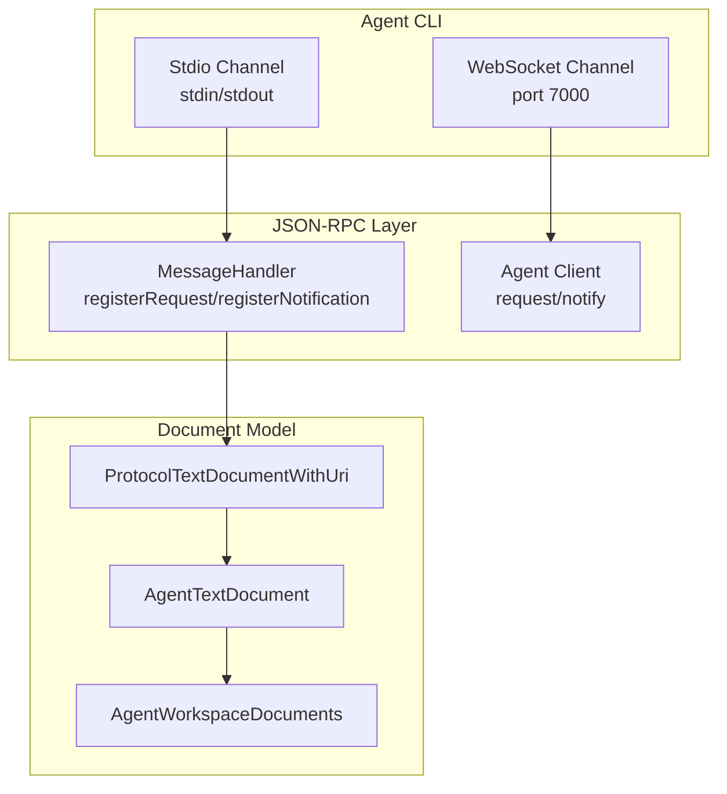
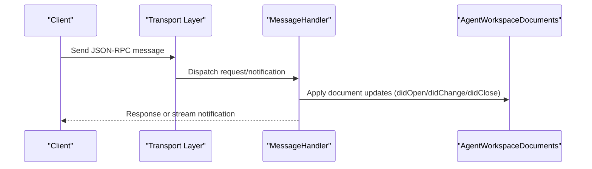
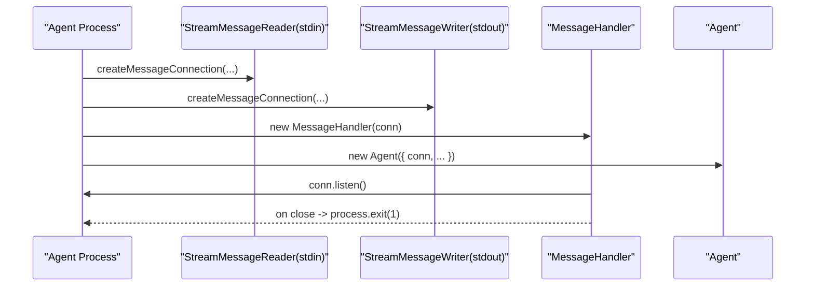
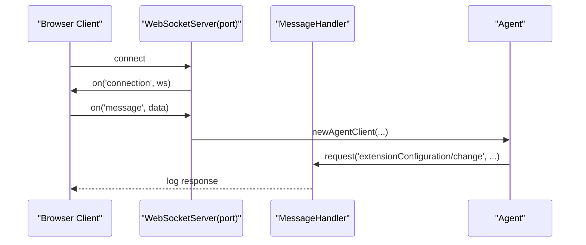
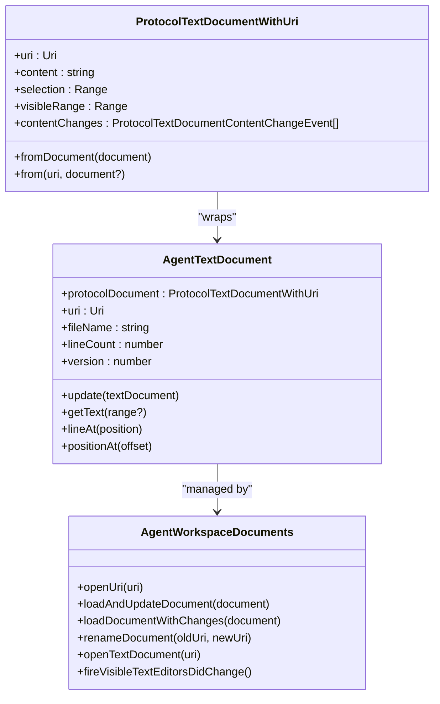
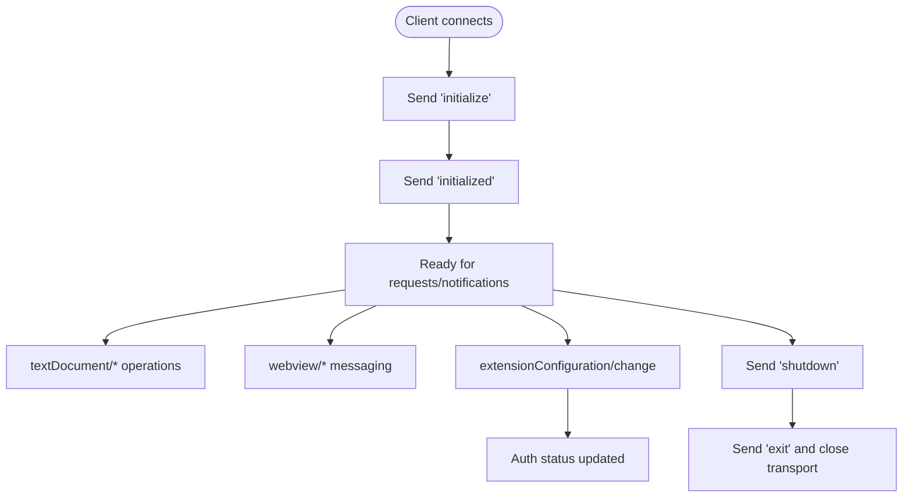
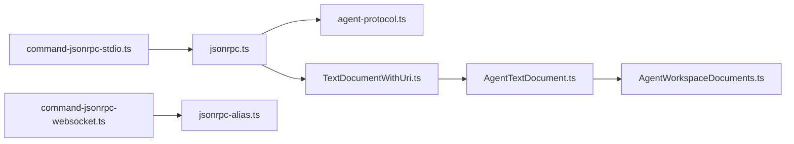

# Communication Channels

<cite>
**Referenced Files in This Document**
- [command-jsonrpc-stdio.ts](file://agent/src/cli/command-jsonrpc-stdio.ts)
- [command-jsonrpc-websocket.ts](file://agent/src/cli/command-jsonrpc-websocket.ts)
- [jsonrpc.ts](file://vscode/src/jsonrpc/jsonrpc.ts)
- [agent-protocol.ts](file://vscode/src/jsonrpc/agent-protocol.ts)
- [TextDocumentWithUri.ts](file://vscode/src/jsonrpc/TextDocumentWithUri.ts)
- [AgentTextDocument.ts](file://agent/src/AgentTextDocument.ts)
- [AgentWorkspaceDocuments.ts](file://agent/src/AgentWorkspaceDocuments.ts)
- [Streams.ts](file://agent/src/cli/Streams.ts)
- [isRunningInsideAgent.ts](file://vscode/src/jsonrpc/isRunningInsideAgent.ts)
- [jsonrpc-alias.ts](file://agent/src/jsonrpc-alias.ts)
</cite>

## Table of Contents
1. [Introduction](#introduction)
2. [Project Structure](#project-structure)
3. [Core Components](#core-components)
4. [Architecture Overview](#architecture-overview)
5. [Detailed Component Analysis](#detailed-component-analysis)
6. [Dependency Analysis](#dependency-analysis)
7. [Performance Considerations](#performance-considerations)
8. [Troubleshooting Guide](#troubleshooting-guide)
9. [Conclusion](#conclusion)
10. [Appendices](#appendices)

## Introduction
This document explains the agent’s communication channel implementations, focusing on:
- Stdio channel over stdout/stdin with JSON-RPC framing and protocol negotiation
- Browser-based WebSocket channel for real-time communication
- TextDocumentWithUri abstraction and document lifecycle management across channels
- Channel-specific optimizations, buffering, and performance tuning
- Error recovery, connection resilience, and fallback strategies
- Channel selection criteria and runtime switching
- Security considerations and debugging/monitoring tools

## Project Structure
The communication channels are implemented in the agent CLI and the JSON-RPC layer:
- Stdio channel: CLI command wires stdin/stdout to a JSON-RPC message connection
- WebSocket channel: CLI command starts a WebSocket server for browser-based clients
- JSON-RPC layer: Generic message handler, request/notification registration, cancellation, and tracing
- Document model: ProtocolTextDocumentWithUri wraps protocol payloads with a parsed URI and provides AgentTextDocument and AgentWorkspaceDocuments for lifecycle management

**Diagram sources**
- [command-jsonrpc-stdio.ts:181-207](file://agent/src/cli/command-jsonrpc-stdio.ts#L181-L207)
- [command-jsonrpc-websocket.ts:17-54](file://agent/src/cli/command-jsonrpc-websocket.ts#L17-L54)
- [jsonrpc.ts:40-190](file://vscode/src/jsonrpc/jsonrpc.ts#L40-L190)
- [TextDocumentWithUri.ts:16-65](file://vscode/src/jsonrpc/TextDocumentWithUri.ts#L16-L65)
- [AgentTextDocument.ts:18-77](file://agent/src/AgentTextDocument.ts#L18-L77)
- [AgentWorkspaceDocuments.ts:29-118](file://agent/src/AgentWorkspaceDocuments.ts#L29-L118)

**Section sources**
- [command-jsonrpc-stdio.ts:1-208](file://agent/src/cli/command-jsonrpc-stdio.ts#L1-L208)
- [command-jsonrpc-websocket.ts:1-55](file://agent/src/cli/command-jsonrpc-websocket.ts#L1-L55)
- [jsonrpc.ts:1-191](file://vscode/src/jsonrpc/jsonrpc.ts#L1-L191)
- [TextDocumentWithUri.ts:1-65](file://vscode/src/jsonrpc/TextDocumentWithUri.ts#L1-L65)
- [AgentTextDocument.ts:1-158](file://agent/src/AgentTextDocument.ts#L1-L158)
- [AgentWorkspaceDocuments.ts:1-262](file://agent/src/AgentWorkspaceDocuments.ts#L1-L262)

## Core Components
- Stdio channel: Creates a JSON-RPC message connection over stdin/stdout, initializes the agent, and exits the process on stream closure
- WebSocket channel: Starts a WebSocket server; accepts a single client per connection and demonstrates a placeholder for future JSON-RPC over WebSocket
- JSON-RPC message handler: Registers request/notification handlers, supports cancellation, error mapping, and optional wire tracing
- ProtocolTextDocumentWithUri: Wraps protocol payloads with a parsed URI and exposes getters for content, selection, and visible range
- AgentTextDocument: In-process document representation with offsets, line counting, and text retrieval
- AgentWorkspaceDocuments: Manages document lifecycle, incremental/full sync, renames, and editor/tab emulation

**Section sources**
- [command-jsonrpc-stdio.ts:181-207](file://agent/src/cli/command-jsonrpc-stdio.ts#L181-L207)
- [command-jsonrpc-websocket.ts:17-54](file://agent/src/cli/command-jsonrpc-websocket.ts#L17-L54)
- [jsonrpc.ts:40-190](file://vscode/src/jsonrpc/jsonrpc.ts#L40-L190)
- [TextDocumentWithUri.ts:16-65](file://vscode/src/jsonrpc/TextDocumentWithUri.ts#L16-L65)
- [AgentTextDocument.ts:18-77](file://agent/src/AgentTextDocument.ts#L18-L77)
- [AgentWorkspaceDocuments.ts:29-118](file://agent/src/AgentWorkspaceDocuments.ts#L29-L118)

## Architecture Overview
The agent supports two primary transport channels:
- Stdio: The canonical transport for native clients (JetBrains, Neovim, etc.) using stdout/stdin
- WebSocket: A browser-based transport for real-time communication

**Diagram sources**
- [command-jsonrpc-stdio.ts:188-206](file://agent/src/cli/command-jsonrpc-stdio.ts#L188-L206)
- [jsonrpc.ts:90-136](file://vscode/src/jsonrpc/jsonrpc.ts#L90-L136)
- [AgentWorkspaceDocuments.ts:52-118](file://agent/src/AgentWorkspaceDocuments.ts#L52-L118)

## Detailed Component Analysis

### Stdio Channel (stdout/stdin)
- Framing and connection
  - Uses a message connection reader/writer over stdin/stdout
  - Initializes the agent and listens for messages
  - Exits the process on stdin/stdout close to prevent zombie processes
- Protocol negotiation
  - The JSON-RPC protocol defines initialization and shutdown sequences; negotiation occurs via initialize/initialized and shutdown/exit
- Buffering and output
  - Buffered stdout/stderr wrappers are available for testing scenarios
- Error handling
  - Cancellation and rate-limit errors are mapped to standardized JSON-RPC error codes
  - Optional wire tracing to a file for debugging

**Diagram sources**
- [command-jsonrpc-stdio.ts:188-206](file://agent/src/cli/command-jsonrpc-stdio.ts#L188-L206)
- [Streams.ts:6-28](file://agent/src/cli/Streams.ts#L6-L28)
- [jsonrpc.ts:50-66](file://vscode/src/jsonrpc/jsonrpc.ts#L50-L66)

**Section sources**
- [command-jsonrpc-stdio.ts:181-207](file://agent/src/cli/command-jsonrpc-stdio.ts#L181-L207)
- [Streams.ts:1-41](file://agent/src/cli/Streams.ts#L1-L41)
- [jsonrpc.ts:69-88](file://vscode/src/jsonrpc/jsonrpc.ts#L69-L88)

### WebSocket Channel (Browser-based)
- Server setup
  - Starts a WebSocket server on a configurable port
  - Accepts a single client per connection
- Placeholder implementation
  - Demonstrates a future direction to integrate JSON-RPC over WebSocket using the same message encoder/decoder pattern
- Real-time communication
  - Messages are stringified and sent to the client; the server logs received messages for debugging

**Diagram sources**
- [command-jsonrpc-websocket.ts:17-54](file://agent/src/cli/command-jsonrpc-websocket.ts#L17-L54)

**Section sources**
- [command-jsonrpc-websocket.ts:1-55](file://agent/src/cli/command-jsonrpc-websocket.ts#L1-L55)

### TextDocumentWithUri Abstraction and Document Management
- ProtocolTextDocumentWithUri
  - Wraps protocol payloads and ensures URI consistency
  - Provides getters for content, selection, and visible range
- AgentTextDocument
  - Implements a lightweight in-process text document with offsets, line counting, and text retrieval
  - Enforces URI invariants and updates offsets on content changes
- AgentWorkspaceDocuments
  - Manages document lifecycle: open, update, rename, close
  - Supports incremental vs full document synchronization
  - Emulates editors/tabs and fires visibility events

**Diagram sources**
- [TextDocumentWithUri.ts:16-65](file://vscode/src/jsonrpc/TextDocumentWithUri.ts#L16-L65)
- [AgentTextDocument.ts:18-77](file://agent/src/AgentTextDocument.ts#L18-L77)
- [AgentWorkspaceDocuments.ts:29-118](file://agent/src/AgentWorkspaceDocuments.ts#L29-L118)

**Section sources**
- [TextDocumentWithUri.ts:16-65](file://vscode/src/jsonrpc/TextDocumentWithUri.ts#L16-L65)
- [AgentTextDocument.ts:18-77](file://agent/src/AgentTextDocument.ts#L18-L77)
- [AgentWorkspaceDocuments.ts:29-118](file://agent/src/AgentWorkspaceDocuments.ts#L29-L118)

### Protocol Negotiation and Lifecycle
- Initialization and shutdown
  - Clients must send initialize followed by initialized before sending other requests
  - Shutdown must be followed by exit
- Authentication and configuration
  - extensionConfiguration/change updates server-side configuration and returns authentication status
- Document lifecycle
  - textDocument/didOpen, didChange, didFocus, didSave, didRename, didClose
- Webview messaging
  - webview/receiveMessage and webview/postMessage for chat sessions

**Diagram sources**
- [agent-protocol.ts:35-40](file://vscode/src/jsonrpc/agent-protocol.ts#L35-L40)
- [agent-protocol.ts:313-318](file://vscode/src/jsonrpc/agent-protocol.ts#L313-L318)
- [agent-protocol.ts:334-348](file://vscode/src/jsonrpc/agent-protocol.ts#L334-L348)
- [agent-protocol.ts:418-425](file://vscode/src/jsonrpc/agent-protocol.ts#L418-L425)
- [agent-protocol.ts:226-229](file://vscode/src/jsonrpc/agent-protocol.ts#L226-L229)

**Section sources**
- [agent-protocol.ts:35-40](file://vscode/src/jsonrpc/agent-protocol.ts#L35-L40)
- [agent-protocol.ts:313-318](file://vscode/src/jsonrpc/agent-protocol.ts#L313-L318)
- [agent-protocol.ts:334-348](file://vscode/src/jsonrpc/agent-protocol.ts#L334-L348)
- [agent-protocol.ts:418-425](file://vscode/src/jsonrpc/agent-protocol.ts#L418-L425)
- [agent-protocol.ts:226-229](file://vscode/src/jsonrpc/agent-protocol.ts#L226-L229)

### Channel Selection Criteria and Runtime Switching
- Stdio is the default and canonical channel for native clients
- WebSocket is intended for browser-based clients and real-time scenarios
- The agent exposes a client for in-process usage via clientForThisInstance for testing or embedding
- Runtime switching is not implemented in the referenced code; selection is typically determined by the client launcher

**Section sources**
- [jsonrpc.ts:152-176](file://vscode/src/jsonrpc/jsonrpc.ts#L152-L176)
- [isRunningInsideAgent.ts:1-10](file://vscode/src/jsonrpc/isRunningInsideAgent.ts#L1-L10)

### Implementation Examples and Extending Channels
- Implementing a custom stdio-based client
  - Use the stdio command as a reference to wire stdin/stdout to a JSON-RPC message connection
  - Initialize the agent and handle lifecycle messages
- Implementing a custom WebSocket client
  - Use the WebSocket server as a reference to establish a connection and forward messages
  - Integrate JSON-RPC over WebSocket using the same encoder/decoder pattern
- Extending document handling
  - Extend ProtocolTextDocumentWithUri for additional fields
  - Extend AgentTextDocument for richer text operations
  - Extend AgentWorkspaceDocuments for custom lifecycle policies

**Section sources**
- [command-jsonrpc-stdio.ts:181-207](file://agent/src/cli/command-jsonrpc-stdio.ts#L181-L207)
- [command-jsonrpc-websocket.ts:17-54](file://agent/src/cli/command-jsonrpc-websocket.ts#L17-L54)
- [TextDocumentWithUri.ts:16-65](file://vscode/src/jsonrpc/TextDocumentWithUri.ts#L16-L65)
- [AgentTextDocument.ts:18-77](file://agent/src/AgentTextDocument.ts#L18-L77)
- [AgentWorkspaceDocuments.ts:29-118](file://agent/src/AgentWorkspaceDocuments.ts#L29-L118)

## Dependency Analysis
- Stdio channel depends on the JSON-RPC message connection and the agent initializer
- WebSocket channel depends on the WebSocket server and the agent client factory
- JSON-RPC layer depends on the protocol definitions and error mapping
- Document model depends on protocol types and offset utilities

**Diagram sources**
- [command-jsonrpc-stdio.ts:181-207](file://agent/src/cli/command-jsonrpc-stdio.ts#L181-L207)
- [command-jsonrpc-websocket.ts:17-54](file://agent/src/cli/command-jsonrpc-websocket.ts#L17-L54)
- [jsonrpc.ts:40-190](file://vscode/src/jsonrpc/jsonrpc.ts#L40-L190)
- [agent-protocol.ts:1-80](file://vscode/src/jsonrpc/agent-protocol.ts#L1-L80)
- [TextDocumentWithUri.ts:16-65](file://vscode/src/jsonrpc/TextDocumentWithUri.ts#L16-L65)
- [AgentTextDocument.ts:18-77](file://agent/src/AgentTextDocument.ts#L18-L77)
- [AgentWorkspaceDocuments.ts:29-118](file://agent/src/AgentWorkspaceDocuments.ts#L29-L118)
- [jsonrpc-alias.ts:1-2](file://agent/src/jsonrpc-alias.ts#L1-L2)

**Section sources**
- [jsonrpc.ts:40-190](file://vscode/src/jsonrpc/jsonrpc.ts#L40-L190)
- [agent-protocol.ts:1-80](file://vscode/src/jsonrpc/agent-protocol.ts#L1-L80)

## Performance Considerations
- Incremental vs full document sync
  - Prefer incremental content changes when available to minimize bandwidth and CPU
  - Fall back to full document replacement when incremental data is absent
- Offsets and line counting
  - Offsets are recalculated on content changes; avoid frequent updates to reduce overhead
- Buffering and output
  - Buffered streams are useful for testing; production should use direct stdout/stderr
- Tracing
  - Enable wire tracing for debugging; disable in production to avoid I/O overhead

**Section sources**
- [AgentWorkspaceDocuments.ts:88-101](file://agent/src/AgentWorkspaceDocuments.ts#L88-L101)
- [AgentTextDocument.ts:72-76](file://agent/src/AgentTextDocument.ts#L72-L76)
- [Streams.ts:6-28](file://agent/src/cli/Streams.ts#L6-L28)
- [jsonrpc.ts:56-66](file://vscode/src/jsonrpc/jsonrpc.ts#L56-L66)

## Troubleshooting Guide
- Stdio channel issues
  - Process exits on stdin/stdout close; ensure the client keeps the pipe open
  - Use wire tracing to diagnose protocol mismatches
- WebSocket channel issues
  - Single client per connection; multiple clients require separate connections
  - Debug by logging received messages and server logs
- Authentication and configuration
  - Use extensionConfiguration/change to update credentials and endpoint
  - Monitor auth status updates via webview notifications
- Error mapping
  - Cancellation and rate-limit errors are mapped to standardized JSON-RPC error codes

**Section sources**
- [command-jsonrpc-stdio.ts:195-204](file://agent/src/cli/command-jsonrpc-stdio.ts#L195-L204)
- [command-jsonrpc-websocket.ts:26-30](file://agent/src/cli/command-jsonrpc-websocket.ts#L26-L30)
- [jsonrpc.ts:69-88](file://vscode/src/jsonrpc/jsonrpc.ts#L69-L88)
- [agent-protocol.ts:407-472](file://vscode/src/jsonrpc/agent-protocol.ts#L407-L472)

## Conclusion
The agent’s communication channels are built around a robust JSON-RPC layer with clear protocol semantics for initialization, document lifecycle, and webview messaging. Stdio remains the canonical transport for native clients, while WebSocket offers a path for browser-based real-time interaction. The document model provides a consistent abstraction across channels, enabling efficient incremental updates and resilient error handling.

## Appendices

### Security Considerations
- Authentication
  - Use extensionConfiguration/change to supply tokens and endpoint configuration
  - Monitor auth status updates to detect credential issues
- Access control
  - Restrict WebSocket server exposure to trusted networks
  - Validate and sanitize incoming messages
- Encryption
  - Prefer secure transports (e.g., TLS) for WebSocket connections
  - Avoid logging sensitive data; use wire tracing only in controlled environments

**Section sources**
- [agent-protocol.ts:620-655](file://vscode/src/jsonrpc/agent-protocol.ts#L620-L655)
- [agent-protocol.ts:470-472](file://vscode/src/jsonrpc/agent-protocol.ts#L470-L472)
- [command-jsonrpc-websocket.ts:17-54](file://agent/src/cli/command-jsonrpc-websocket.ts#L17-L54)

### Debugging Tools and Monitoring
- Wire tracing
  - Enable via environment variable to log all JSON-RPC messages to a file
- RPC logging
  - Conditional logging for RPC messages in webview contexts
- Memory and network diagnostics
  - Use testing endpoints to inspect memory usage and network requests

**Section sources**
- [jsonrpc.ts:29-66](file://vscode/src/jsonrpc/jsonrpc.ts#L29-L66)
- [jsonrpc.ts:336-346](file://vscode/src/jsonrpc/jsonrpc.ts#L336-L346)
- [agent-protocol.ts:174-183](file://vscode/src/jsonrpc/agent-protocol.ts#L174-L183)