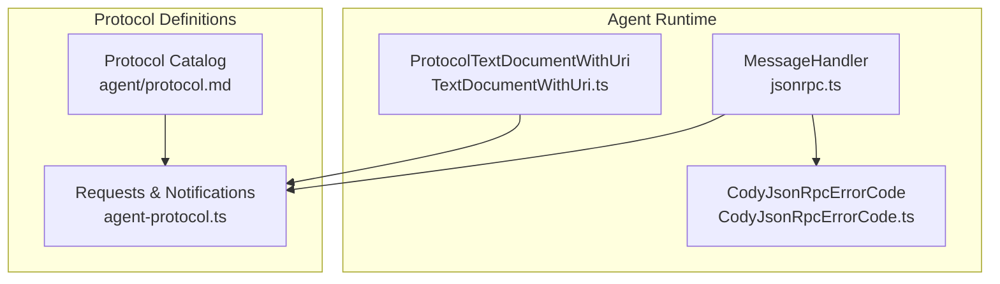
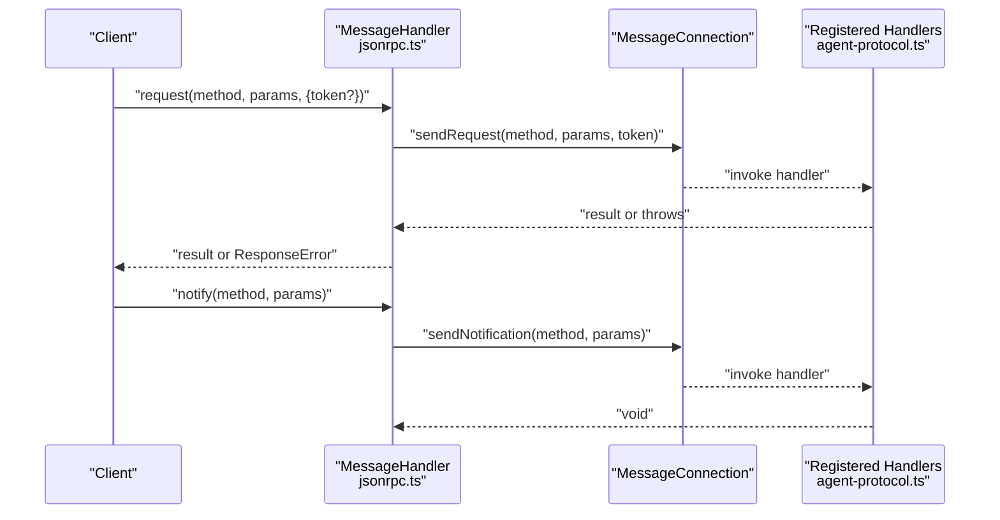
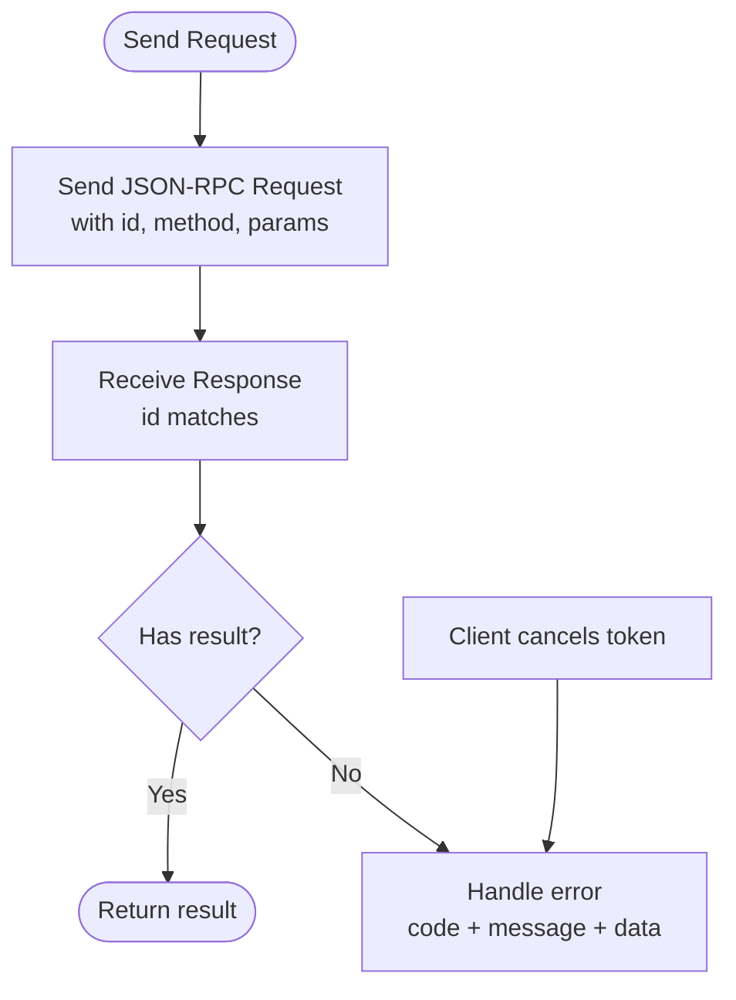
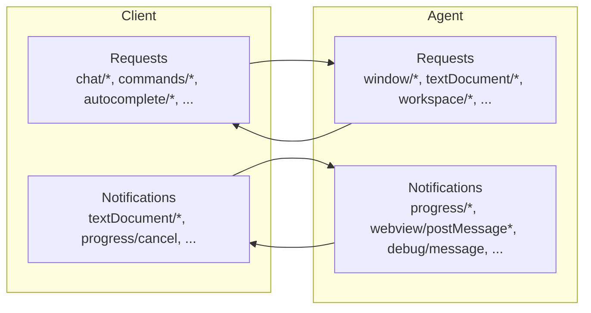
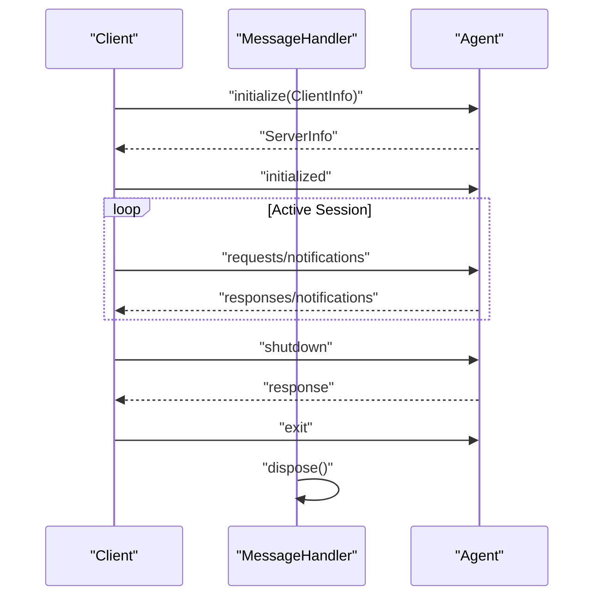
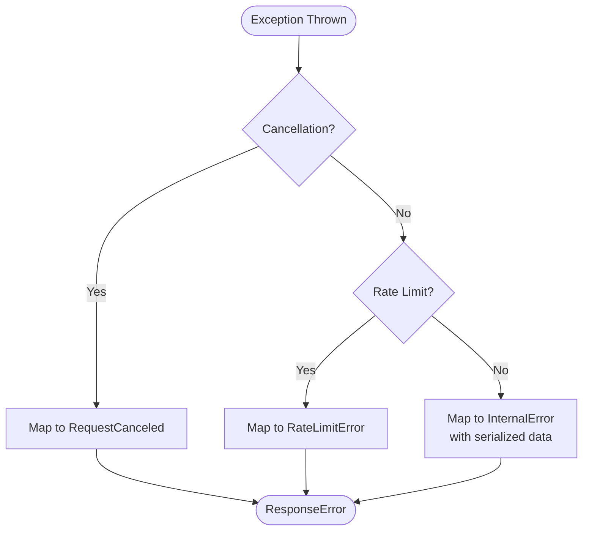
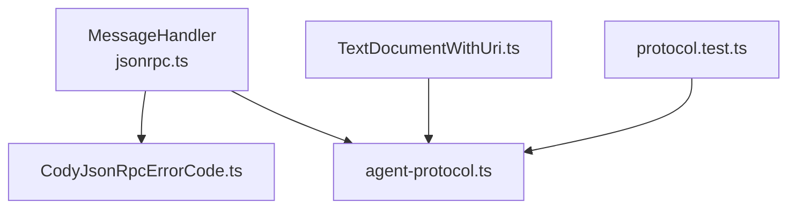

# JSON-RPC Protocol

<cite>
**Referenced Files in This Document**
- [protocol.md](file://agent/protocol.md)
- [agent-protocol.ts](file://vscode/src/jsonrpc/agent-protocol.ts)
- [jsonrpc.ts](file://vscode/src/jsonrpc/jsonrpc.ts)
- [CodyJsonRpcErrorCode.ts](file://vscode/src/jsonrpc/CodyJsonRpcErrorCode.ts)
- [TextDocumentWithUri.ts](file://vscode/src/jsonrpc/TextDocumentWithUri.ts)
- [protocol.test.ts](file://vscode/src/jsonrpc/protocol.test.ts)
</cite>

## Table of Contents
1. [Introduction](#introduction)
2. [Project Structure](#project-structure)
3. [Core Components](#core-components)
4. [Architecture Overview](#architecture-overview)
5. [Detailed Component Analysis](#detailed-component-analysis)
6. [Dependency Analysis](#dependency-analysis)
7. [Performance Considerations](#performance-considerations)
8. [Troubleshooting Guide](#troubleshooting-guide)
9. [Conclusion](#conclusion)
10. [Appendices](#appendices)

## Introduction
This document specifies the JSON-RPC protocol used by the Cody Agent to enable bidirectional communication between an agent process and client applications. The protocol defines method names, parameter schemas, and response formats for requests and notifications. It covers initialization, lifecycle, chat and completion operations, file system interactions, progress reporting, webview messaging, authentication, and error handling. The protocol is designed for stdout/stdin transport and supports cancellation, rate limiting, and structured telemetry.

## Project Structure
The protocol is defined in TypeScript and consumed by the agent runtime and client implementations:
- Protocol definitions: agent-protocol.ts
- JSON-RPC runtime and handlers: jsonrpc.ts
- Error codes: CodyJsonRpcErrorCode.ts
- Text document wrapper: TextDocumentWithUri.ts
- Protocol robustness tests: protocol.test.ts
- High-level protocol overview and method catalog: agent/protocol.md

**Diagram sources**
- [jsonrpc.ts:40-190](file://vscode/src/jsonrpc/jsonrpc.ts#L40-L190)
- [CodyJsonRpcErrorCode.ts:1-10](file://vscode/src/jsonrpc/CodyJsonRpcErrorCode.ts#L1-L10)
- [TextDocumentWithUri.ts:16-66](file://vscode/src/jsonrpc/TextDocumentWithUri.ts#L16-L66)
- [agent-protocol.ts:30-472](file://vscode/src/jsonrpc/agent-protocol.ts#L30-L472)
- [protocol.md:37-482](file://agent/protocol.md#L37-L482)

**Section sources**
- [agent-protocol.ts:30-472](file://vscode/src/jsonrpc/agent-protocol.ts#L30-L472)
- [jsonrpc.ts:40-190](file://vscode/src/jsonrpc/jsonrpc.ts#L40-L190)
- [protocol.md:37-482](file://agent/protocol.md#L37-L482)

## Core Components
- Requests: Client-to-server asynchronous methods that return a value.
- Notifications: Client-to-server or server-to-client fire-and-forget messages used for streaming updates.
- ServerRequests: Server-to-client requests (e.g., window/textDocument/workspace operations).
- ServerNotifications: Server-to-client notifications (e.g., progress, webview messages, auth status).
- MessageHandler: Bridges JSON-RPC transport to typed handlers, manages registration, cancellation, and error mapping.

Key responsibilities:
- Type-safe request/notification registration and dispatch
- Cancellation propagation and rate-limit-aware error mapping
- Graceful shutdown and resource cleanup
- Optional in-process client for testing and embedding

**Section sources**
- [agent-protocol.ts:30-472](file://vscode/src/jsonrpc/agent-protocol.ts#L30-L472)
- [jsonrpc.ts:40-190](file://vscode/src/jsonrpc/jsonrpc.ts#L40-L190)

## Architecture Overview
The protocol follows a peer-to-peer JSON-RPC model over stdout/stdin. The agent exposes a MessageHandler that registers request and notification callbacks. Clients send requests and notifications; the agent responds with results or streams updates via notifications.

**Diagram sources**
- [jsonrpc.ts:121-136](file://vscode/src/jsonrpc/jsonrpc.ts#L121-L136)
- [jsonrpc.ts:90-110](file://vscode/src/jsonrpc/jsonrpc.ts#L90-L110)
- [agent-protocol.ts:30-472](file://vscode/src/jsonrpc/agent-protocol.ts#L30-L472)

## Detailed Component Analysis

### Protocol Methods Catalog
The protocol defines a comprehensive set of methods grouped by direction and domain. See the catalog for method names, parameter shapes, and response types.

- Initialization and lifecycle
  - initialize: [ClientInfo, ServerInfo]
  - initialized: [null]
  - shutdown: [null, null]
  - exit: [null]

- Chat and webview
  - chat/new: [null, string]
  - chat/web/new: [null, { panelId: string; chatId: string }]
  - chat/sidebar/new: [null, { panelId: string; chatId: string }]
  - chat/delete: [{ chatId: string }, ChatExportResult[]]
  - chat/models: [{ modelUsage: ModelUsage }, { readOnly: boolean; models: ModelAvailabilityStatus[] }]
  - chat/export: [null | { fullHistory: boolean }, ChatExportResult[]]
  - chat/import: [{ history: Record<...>, merge: boolean }, null]
  - chat/submitMessage: [{ id: string; message: WebviewMessage }, ExtensionMessage]
  - chat/editMessage: [{ id: string; message: WebviewMessage }, ExtensionMessage]
  - chat/setModel: [{ id: string; model: Model['id'] }, null]
  - webview/didDispose: [{ id: string }, null]
  - webview/receiveMessage: [{ id: string; message: WebviewMessage }, null]
  - webview/receiveMessageStringEncoded: [{ id: string; messageStringEncoded: string }, null]
  - webview/resolveWebviewView: [{ viewId: string; webviewHandle: string }, null]
  - webview/postMessage: [WebviewPostMessageParams] (server-to-client notification)
  - webview/postMessageStringEncoded: [{ id: string; stringEncodedMessage: string }] (server-to-client notification)

- Commands and editing
  - commands/explain: [null, string]
  - commands/smell: [null, string]
  - commands/custom: [{ key: string }, CustomCommandResult]
  - customCommands/list: [null, CodyCommand[]]
  - editTask/start: [null, FixupTaskID | undefined | null]
  - editTask/accept: [FixupTaskID, null]
  - editTask/undo: [FixupTaskID, null]
  - editTask/cancel: [FixupTaskID, null]
  - editTask/retry: [FixupTaskID, FixupTaskID | undefined | null]
  - editTask/getTaskDetails: [FixupTaskID, EditTask]
  - editTask/getFoldingRanges: [GetFoldingRangeParams, GetFoldingRangeResult]
  - codeActions/provide: [{ location: ProtocolLocation; triggerKind: CodeActionTriggerKind }, { codeActions: ProtocolCodeAction[] }]
  - codeActions/trigger: [FixupTaskID, FixupTaskID | undefined | null]
  - command/execute: [ExecuteCommandParams, any]

- Autocomplete
  - autocomplete/execute: [AutocompleteParams, AutocompleteResult]
  - autocomplete/clearLastCandidate: [null]
  - autocomplete/completionSuggested: [CompletionItemParams]
  - autocomplete/completionAccepted: [CompletionItemParams]
  - autocomplete/didHide: [null] (server-to-client)
  - autocomplete/didTrigger: [null] (server-to-client)

- GraphQL and feature flags
  - graphql/getRepoIds: [{ names: string[]; first: number }, { repos: { name: string; id: string }[] }]
  - graphql/currentUserId: [null, string]
  - graphql/currentUserIsPro: [null, boolean]
  - featureFlags/getFeatureFlag: [{ flagName: string }, boolean | null]
  - graphql/getCurrentUserCodySubscription: [null, CurrentUserCodySubscription | null]
  - graphql/getRepoIdIfEmbeddingExists: [{ repoName: string }, string | null]
  - graphql/getRepoId: [{ repoName: string }, string | null]

- Telemetry
  - telemetry/recordEvent: [TelemetryEvent, null]

- Git and ignore
  - git/codebaseName: [{ url: string }, string | null]
  - ignore/test: [{ uri: string }, { policy: 'ignore' | 'use' }]

- Diagnostics and attribution
  - diagnostics/publish: [{ diagnostics: ProtocolDiagnostic[] }, null]
  - attribution/search: [{ id: string; snippet: string }, { error?: string; repoNames: string[]; limitHit: boolean }]

- Workspace and text document lifecycle
  - workspaceFolder/didChange: [{ uris: string[] }]
  - textDocument/didOpen: [ProtocolTextDocument]
  - textDocument/didChange: [ProtocolTextDocument]
  - textDocument/didFocus: [{ uri: string }]
  - textDocument/didSave: [{ uri: string }]
  - textDocument/didRename: [{ oldUri: string; newUri: string }]
  - textDocument/didClose: [ProtocolTextDocument]
  - workspace/didDeleteFiles: [DeleteFilesParams]
  - workspace/didCreateFiles: [CreateFilesParams]
  - workspace/didRenameFiles: [RenameFilesParams]
  - textDocument/change: [ProtocolTextDocument, { success: boolean }]

- Progress and cancellation
  - progress/start: [ProgressStartParams]
  - progress/report: [ProgressReportParams]
  - progress/end: [{ id: string }]
  - progress/cancel: [{ id: string }]
  - $/cancelRequest: [CancelParams]

- Server-to-client requests and notifications
  - window/showMessage: [ShowWindowMessageParams, string | null]
  - window/showSaveDialog: [SaveDialogOptionsParams, string | undefined | null]
  - textDocument/edit: [TextDocumentEditParams, boolean]
  - textDocument/show: [{ uri: string; options?: TextDocumentShowOptionsParams }, boolean]
  - textEditor/selection: [{ uri: string; selection: Range }, null]
  - textEditor/revealRange: [{ uri: string; range: Range }, null]
  - workspace/edit: [WorkspaceEditParams, boolean]
  - env/openExternal: [{ uri: string }, boolean]
  - editTask/getUserInput: [UserEditPromptRequest, UserEditPromptResult | undefined | null]
  - debug/message: [DebugMessage] (server-to-client)
  - extensionConfiguration/didUpdate: [{ key: string; value?: string }, null] (server-to-client)
  - extensionConfiguration/openSettings: [null] (server-to-client)
  - codeLenses/display: [DisplayCodeLensParams] (server-to-client)
  - ignore/didChange: [null] (server-to-client)
  - authStatus/didUpdate: [ProtocolAuthStatus] (server-to-client)

**Section sources**
- [protocol.md:37-482](file://agent/protocol.md#L37-L482)
- [agent-protocol.ts:35-271](file://vscode/src/jsonrpc/agent-protocol.ts#L35-L271)
- [agent-protocol.ts:276-303](file://vscode/src/jsonrpc/agent-protocol.ts#L276-L303)
- [agent-protocol.ts:313-383](file://vscode/src/jsonrpc/agent-protocol.ts#L313-L383)
- [agent-protocol.ts:388-472](file://vscode/src/jsonrpc/agent-protocol.ts#L388-L472)

### JSON-RPC Message Structure
- Transport: stdout/stdin
- Message types:
  - Request: includes id, method, params; expects a Response
  - Notification: includes method, params; no Response
  - Response: includes id and either result or error
- Cancellation: clients can cancel requests; server maps cancellation to a specific error code
- Rate limiting: server maps rate-limit errors to a dedicated error code

**Diagram sources**
- [jsonrpc.ts:69-88](file://vscode/src/jsonrpc/jsonrpc.ts#L69-L88)
- [CodyJsonRpcErrorCode.ts:1-10](file://vscode/src/jsonrpc/CodyJsonRpcErrorCode.ts#L1-L10)

**Section sources**
- [jsonrpc.ts:121-136](file://vscode/src/jsonrpc/jsonrpc.ts#L121-L136)
- [jsonrpc.ts:69-88](file://vscode/src/jsonrpc/jsonrpc.ts#L69-L88)
- [CodyJsonRpcErrorCode.ts:1-10](file://vscode/src/jsonrpc/CodyJsonRpcErrorCode.ts#L1-L10)

### Bidirectional Communication Patterns
- Agent-to-client requests: window/*, textDocument/*, workspace/*, secrets/*, env/*
- Agent-to-client notifications: progress/*, webview/postMessage*, debug/message, authStatus/didUpdate, ignore/didChange, codeLenses/display
- Client-to-agent requests: chat/*, commands/*, autocomplete/*, graphql/*, telemetry/recordEvent, extensionConfiguration/change, diagnostics/publish, attribution/search, ignore/test, textDocument/change
- Client-to-agent notifications: initialized, exit, textDocument/*, workspace/*, progress/cancel, autocomplete/*, secrets/didChange, window/didChangeFocus

**Diagram sources**
- [agent-protocol.ts:35-271](file://vscode/src/jsonrpc/agent-protocol.ts#L35-L271)
- [agent-protocol.ts:276-303](file://vscode/src/jsonrpc/agent-protocol.ts#L276-L303)
- [agent-protocol.ts:313-383](file://vscode/src/jsonrpc/agent-protocol.ts#L313-L383)
- [agent-protocol.ts:388-472](file://vscode/src/jsonrpc/agent-protocol.ts#L388-L472)

**Section sources**
- [agent-protocol.ts:35-271](file://vscode/src/jsonrpc/agent-protocol.ts#L35-L271)
- [agent-protocol.ts:276-303](file://vscode/src/jsonrpc/agent-protocol.ts#L276-L303)
- [agent-protocol.ts:313-383](file://vscode/src/jsonrpc/agent-protocol.ts#L313-L383)
- [agent-protocol.ts:388-472](file://vscode/src/jsonrpc/agent-protocol.ts#L388-L472)

### Authentication and Authorization
- extensionConfiguration/change: [ExtensionConfiguration, ProtocolAuthStatus | null]
- extensionConfiguration/status: [null, ProtocolAuthStatus | null]
- authStatus/didUpdate: [ProtocolAuthStatus] (server-to-client)
- ProtocolAuthStatus variants:
  - authenticated: { status: 'authenticated', authenticated: boolean, endpoint: string, username: string, ... }
  - unauthenticated: { status: 'unauthenticated', authenticated: boolean, endpoint: string, error?: AuthError, pendingValidation: boolean }

Notes:
- extensionConfiguration/change returns the new auth status; invalid credentials prevent autocomplete/chat
- extensionConfiguration/status returns current auth status without changing it
- Clients should subscribe to authStatus/didUpdate for live updates

**Section sources**
- [agent-protocol.ts:226-229](file://vscode/src/jsonrpc/agent-protocol.ts#L226-L229)
- [agent-protocol.ts:471-471](file://vscode/src/jsonrpc/agent-protocol.ts#L471-L471)
- [agent-protocol.ts:705-740](file://vscode/src/jsonrpc/agent-protocol.ts#L705-L740)

### Connection Management, Keep-Alive, and Shutdown
- Initialize sequence: client sends initialize → agent responds with ServerInfo → client sends initialized
- Lifecycle: client sends exit after shutdown response
- Graceful shutdown: client calls shutdown; agent disposes handlers and ends connection
- Keep-alive: implicit via continuous request/notification exchange; clients should monitor connection state
- In-process client: clientForThisInstance() enables direct invocation without transport

**Diagram sources**
- [agent-protocol.ts:38-40](file://vscode/src/jsonrpc/agent-protocol.ts#L38-L40)
- [agent-protocol.ts:314-317](file://vscode/src/jsonrpc/agent-protocol.ts#L314-L317)
- [jsonrpc.ts:178-181](file://vscode/src/jsonrpc/jsonrpc.ts#L178-L181)

**Section sources**
- [agent-protocol.ts:38-40](file://vscode/src/jsonrpc/agent-protocol.ts#L38-L40)
- [agent-protocol.ts:314-317](file://vscode/src/jsonrpc/agent-protocol.ts#L314-L317)
- [jsonrpc.ts:178-181](file://vscode/src/jsonrpc/jsonrpc.ts#L178-L181)

### Error Handling and Fault Tolerance
- Error codes:
  - ParseError, InvalidRequest, MethodNotFound, InvalidParams, InternalError
  - RequestCanceled (-32604)
  - RateLimitError (-32000)
- Behavior:
  - Cancellation mapped to RequestCanceled
  - Rate limit errors mapped to RateLimitError
  - Other exceptions mapped to InternalError with serialized error data
- Tests enforce null/undefined equivalence across protocol types to avoid cross-language ambiguity

**Diagram sources**
- [CodyJsonRpcErrorCode.ts:1-10](file://vscode/src/jsonrpc/CodyJsonRpcErrorCode.ts#L1-L10)
- [jsonrpc.ts:69-88](file://vscode/src/jsonrpc/jsonrpc.ts#L69-L88)

**Section sources**
- [CodyJsonRpcErrorCode.ts:1-10](file://vscode/src/jsonrpc/CodyJsonRpcErrorCode.ts#L1-L10)
- [jsonrpc.ts:69-88](file://vscode/src/jsonrpc/jsonrpc.ts#L69-L88)
- [protocol.test.ts:13-86](file://vscode/src/jsonrpc/protocol.test.ts#L13-L86)

### Extensibility and Custom Method Registration
- MessageHandler.registerRequest and registerNotification enable adding custom methods at runtime
- clientForThisInstance() provides an in-process client for embedding or testing without transport
- Use string-literal method names and ensure parameter/response types align with protocol definitions

Best practices:
- Prefix custom methods to avoid conflicts
- Mirror parameter/response shapes in both directions
- Respect cancellation tokens for long-running operations

**Section sources**
- [jsonrpc.ts:90-110](file://vscode/src/jsonrpc/jsonrpc.ts#L90-L110)
- [jsonrpc.ts:152-176](file://vscode/src/jsonrpc/jsonrpc.ts#L152-L176)

### Practical Examples

- Chat request/response cycle
  - Client calls chat/new to create a session
  - Client subscribes to webview/postMessage for streaming replies
  - Client calls chat/submitMessage with the session id and message
  - Agent streams partial replies via webview/postMessage and finalizes with a response

- Autocomplete flow
  - Client calls autocomplete/execute with uri, position, and optional triggerKind
  - Agent returns AutocompleteResult with inline suggestions and decorated edit items
  - Client logs telemetry via autocomplete/completionSuggested/completionAccepted

- Editing task lifecycle
  - Client calls editTask/start to create a task
  - Agent notifies progress/start/report/end
  - Client calls editTask/accept or editTask/cancel depending on outcome

- Telemetry recording
  - Client calls telemetry/recordEvent with feature, action, and parameters
  - Agent records the event and may stream exported telemetry via testing endpoints

- Authentication update
  - Client calls extensionConfiguration/change with credentials
  - Agent responds with ProtocolAuthStatus; client subscribes to authStatus/didUpdate

Note: The above describe the method interactions. Refer to the method catalogs and types for precise parameter and response schemas.

**Section sources**
- [agent-protocol.ts:45-78](file://vscode/src/jsonrpc/agent-protocol.ts#L45-L78)
- [agent-protocol.ts:130-130](file://vscode/src/jsonrpc/agent-protocol.ts#L130-L130)
- [agent-protocol.ts:96-105](file://vscode/src/jsonrpc/agent-protocol.ts#L96-L105)
- [agent-protocol.ts:144-144](file://vscode/src/jsonrpc/agent-protocol.ts#L144-L144)
- [agent-protocol.ts:226-229](file://vscode/src/jsonrpc/agent-protocol.ts#L226-L229)
- [agent-protocol.ts:471-471](file://vscode/src/jsonrpc/agent-protocol.ts#L471-L471)

## Dependency Analysis
- MessageHandler depends on:
  - vscode-jsonrpc MessageConnection for transport
  - CodyJsonRpcErrorCode for standardized error codes
  - agent-protocol types for method signatures
- TextDocumentWithUri depends on agent-protocol ProtocolTextDocument and vscode.Uri for document modeling
- Protocol tests validate null/undefined handling across definitions

**Diagram sources**
- [jsonrpc.ts:6-8](file://vscode/src/jsonrpc/jsonrpc.ts#L6-L8)
- [CodyJsonRpcErrorCode.ts:1-10](file://vscode/src/jsonrpc/CodyJsonRpcErrorCode.ts#L1-L10)
- [agent-protocol.ts:1-25](file://vscode/src/jsonrpc/agent-protocol.ts#L1-L25)
- [TextDocumentWithUri.ts:3-8](file://vscode/src/jsonrpc/TextDocumentWithUri.ts#L3-L8)
- [protocol.test.ts:1-8](file://vscode/src/jsonrpc/protocol.test.ts#L1-L8)

**Section sources**
- [jsonrpc.ts:6-8](file://vscode/src/jsonrpc/jsonrpc.ts#L6-L8)
- [TextDocumentWithUri.ts:3-8](file://vscode/src/jsonrpc/TextDocumentWithUri.ts#L3-L8)
- [protocol.test.ts:1-8](file://vscode/src/jsonrpc/protocol.test.ts#L1-L8)

## Performance Considerations
- Throughput optimization
  - Use notifications for frequent updates (e.g., progress/report, webview/postMessage) to avoid round-trips
  - Batch workspace and text document lifecycle notifications when possible
- Message queuing
  - The underlying transport queues messages; minimize unnecessary notifications
  - Respect cancellation tokens to avoid wasted work
- Serialization
  - Keep payload sizes reasonable; avoid sending large content repeatedly
- Concurrency
  - Register handlers to process requests concurrently where safe
- Telemetry
  - Use telemetry/recordEvent sparingly; batch events when feasible

[No sources needed since this section provides general guidance]

## Troubleshooting Guide
Common issues and resolutions:
- Method not found
  - Verify method name spelling and that the method is registered
  - Check client/server capabilities and initialization sequence
- Invalid parameters
  - Ensure parameter types match the protocol definitions
  - Confirm optional fields include null/undefined consistently
- Cancellation
  - Ensure cancellation tokens are passed to request() and respected by handlers
- Rate limit errors
  - Back off and retry; reduce request frequency
- Connection termination
  - Ensure shutdown and exit are called in order
  - Dispose handlers to free resources

Diagnostic aids:
- Enable trace logging via CODY_AGENT_TRACE_PATH to capture raw JSON messages
- Use testing endpoints to introspect state (e.g., testing/progress, testing/reset)

**Section sources**
- [jsonrpc.ts:56-66](file://vscode/src/jsonrpc/jsonrpc.ts#L56-L66)
- [jsonrpc.ts:178-181](file://vscode/src/jsonrpc/jsonrpc.ts#L178-L181)
- [protocol.test.ts:13-86](file://vscode/src/jsonrpc/protocol.test.ts#L13-L86)

## Conclusion
The Cody Agent JSON-RPC protocol provides a robust, bidirectional communication layer for agent-client interactions. Its method catalog covers chat, completion, editing, telemetry, authentication, and file system operations. The runtime enforces type safety, cancellation, and error mapping, while the protocol’s design supports extensibility and efficient streaming updates.

[No sources needed since this section summarizes without analyzing specific files]

## Appendices

### Appendix A: Method Catalog Reference
- Full method catalog and parameter/response schemas are documented in the protocol catalog and type definitions.

**Section sources**
- [protocol.md:37-482](file://agent/protocol.md#L37-L482)
- [agent-protocol.ts:35-472](file://vscode/src/jsonrpc/agent-protocol.ts#L35-L472)

### Appendix B: Data Types Overview
- Core types include ClientInfo, ServerInfo, ExtensionConfiguration, ProtocolAuthStatus, ProtocolTextDocument, TelemetryEvent, and many others used across requests and notifications.

**Section sources**
- [agent-protocol.ts:588-763](file://vscode/src/jsonrpc/agent-protocol.ts#L588-L763)
- [agent-protocol.ts:775-826](file://vscode/src/jsonrpc/agent-protocol.ts#L775-L826)
- [agent-protocol.ts:828-1081](file://vscode/src/jsonrpc/agent-protocol.ts#L828-L1081)