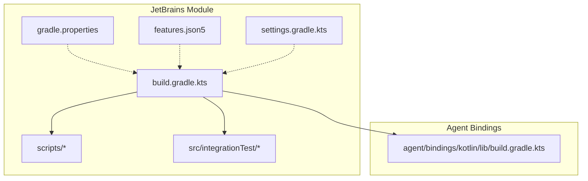
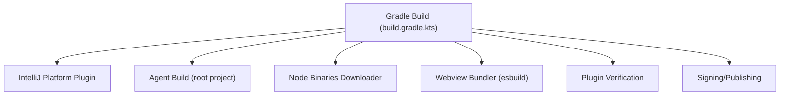
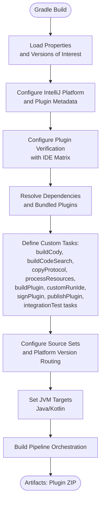
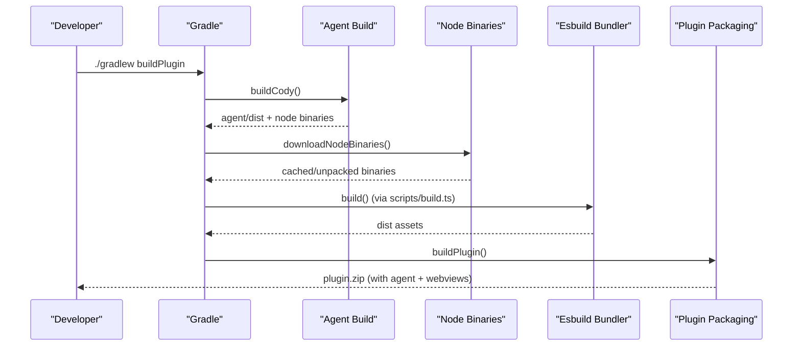
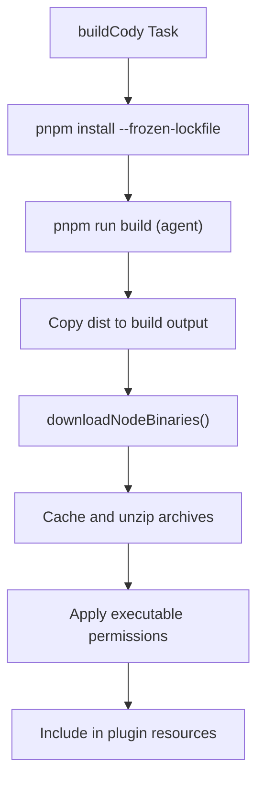
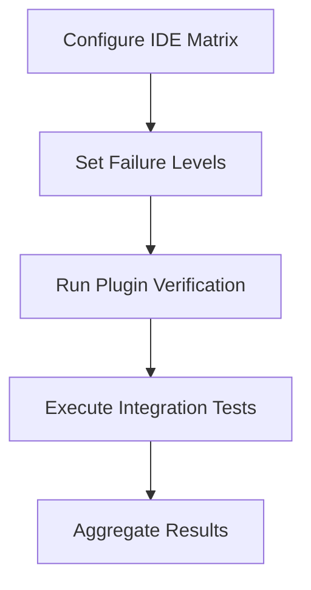
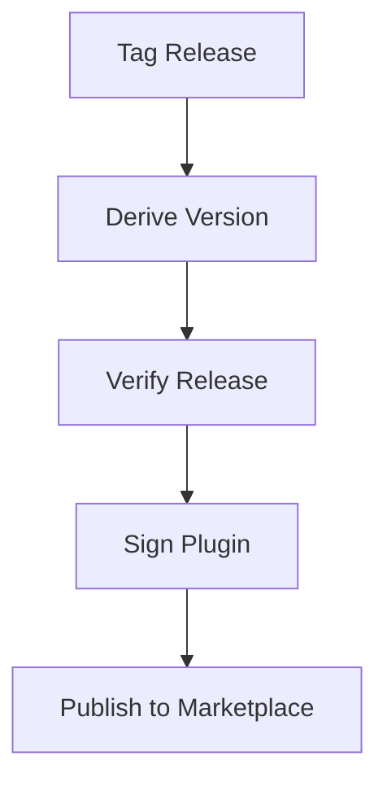
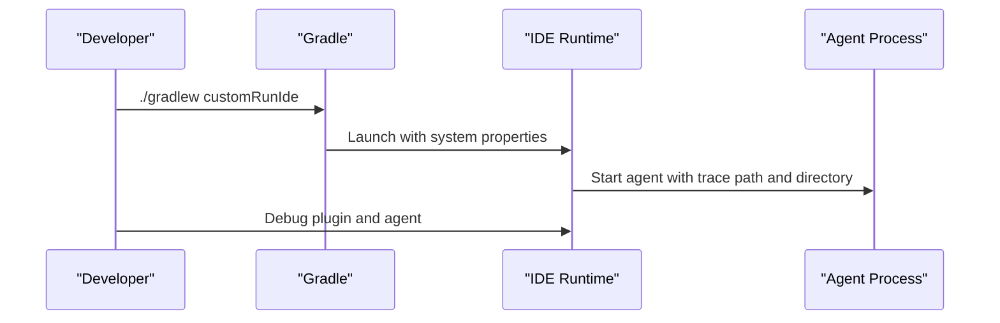
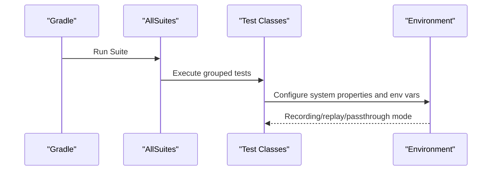
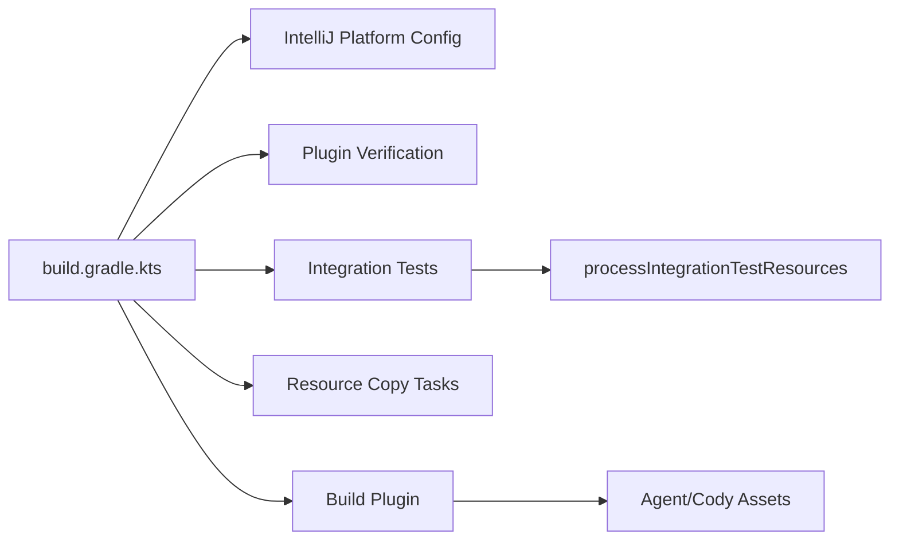

# Build System & Configuration

<cite>
**Referenced Files in This Document**
- [jetbrains/build.gradle.kts](file://jetbrains/build.gradle.kts)
- [jetbrains/settings.gradle.kts](file://jetbrains/settings.gradle.kts)
- [jetbrains/gradle.properties](file://jetbrains/gradle.properties)
- [jetbrains/features.json5](file://jetbrains/features.json5)
- [jetbrains/scripts/build.ts](file://jetbrains/scripts/build.ts)
- [jetbrains/scripts/verify-release.sh](file://jetbrains/scripts/verify-release.sh)
- [jetbrains/scripts/version-from-git-tag.sh](file://jetbrains/scripts/version-from-git-tag.sh)
- [jetbrains/scripts/next-release.sh](file://jetbrains/scripts/next-release.sh)
- [jetbrains/src/integrationTest/kotlin/com/sourcegraph/cody/AllSuites.kt](file://jetbrains/src/integrationTest/kotlin/com/sourcegraph/cody/AllSuites.kt)
- [agent/bindings/kotlin/lib/build.gradle.kts](file://agent/bindings/kotlin/lib/build.gradle.kts)
</cite>

## Table of Contents
1. [Introduction](#introduction)
2. [Project Structure](#project-structure)
3. [Core Components](#core-components)
4. [Architecture Overview](#architecture-overview)
5. [Detailed Component Analysis](#detailed-component-analysis)
6. [Dependency Analysis](#dependency-analysis)
7. [Performance Considerations](#performance-considerations)
8. [Troubleshooting Guide](#troubleshooting-guide)
9. [Conclusion](#conclusion)
10. [Appendices](#appendices)

## Introduction
This document explains the JetBrains plugin build system used by the Cody project. It covers Gradle configuration, dependency management, multi-platform compilation, custom tasks, and the build pipeline orchestration. It also documents agent binary integration, Node.js runtime bundling, cross-platform asset management, plugin verification and compatibility testing, release automation, signing, and distribution. Finally, it outlines development workflow, hot reload capabilities, debugging configurations, optimization strategies, and integration with external tools.

## Project Structure
The JetBrains plugin build is centered in the jetbrains module with supporting scripts and assets. Key areas:
- Gradle build and settings: [jetbrains/build.gradle.kts](file://jetbrains/build.gradle.kts), [jetbrains/settings.gradle.kts](file://jetbrains/settings.gradle.kts)
- Plugin metadata and versioning: [jetbrains/gradle.properties](file://jetbrains/gradle.properties)
- Feature flags: [jetbrains/features.json5](file://jetbrains/features.json5)
- Webview bundling for plugin resources: [jetbrains/scripts/build.ts](file://jetbrains/scripts/build.ts)
- Release and verification scripts: [jetbrains/scripts/verify-release.sh](file://jetbrains/scripts/verify-release.sh), [jetbrains/scripts/version-from-git-tag.sh](file://jetbrains/scripts/version-from-git-tag.sh), [jetbrains/scripts/next-release.sh](file://jetbrains/scripts/next-release.sh)
- Integration tests entry point: [jetbrains/src/integrationTest/kotlin/com/sourcegraph/cody/AllSuites.kt](file://jetbrains/src/integrationTest/kotlin/com/sourcegraph/cody/AllSuites.kt)
- Agent Kotlin bindings module: [agent/bindings/kotlin/lib/build.gradle.kts](file://agent/bindings/kotlin/lib/build.gradle.kts)

**Diagram sources**
- [jetbrains/build.gradle.kts](file://jetbrains/build.gradle.kts)
- [jetbrains/settings.gradle.kts](file://jetbrains/settings.gradle.kts)
- [jetbrains/gradle.properties](file://jetbrains/gradle.properties)
- [jetbrains/features.json5](file://jetbrains/features.json5)
- [jetbrains/scripts/build.ts](file://jetbrains/scripts/build.ts)
- [jetbrains/src/integrationTest/kotlin/com/sourcegraph/cody/AllSuites.kt](file://jetbrains/src/integrationTest/kotlin/com/sourcegraph/cody/AllSuites.kt)
- [agent/bindings/kotlin/lib/build.gradle.kts](file://agent/bindings/kotlin/lib/build.gradle.kts)

**Section sources**
- [jetbrains/build.gradle.kts](file://jetbrains/build.gradle.kts)
- [jetbrains/settings.gradle.kts](file://jetbrains/settings.gradle.kts)
- [jetbrains/gradle.properties](file://jetbrains/gradle.properties)
- [jetbrains/features.json5](file://jetbrains/features.json5)
- [jetbrains/scripts/build.ts](file://jetbrains/scripts/build.ts)
- [jetbrains/src/integrationTest/kotlin/com/sourcegraph/cody/AllSuites.kt](file://jetbrains/src/integrationTest/kotlin/com/sourcegraph/cody/AllSuites.kt)
- [agent/bindings/kotlin/lib/build.gradle.kts](file://agent/bindings/kotlin/lib/build.gradle.kts)

## Core Components
- Gradle build script orchestrates plugin packaging, agent and Node.js runtime bundling, resource processing, and verification.
- Settings configure the Gradle toolchain resolver and local build cache behavior.
- Properties define plugin metadata, platform compatibility, and JVM options.
- Scripts handle webview bundling via esbuild and release verification.
- Integration tests provide multi-IDE compatibility testing and suite composition.

Key responsibilities:
- Multi-platform compilation and packaging for IntelliJ-based IDEs.
- Agent binary and Node runtime inclusion per OS/arch.
- Webview assets built and embedded into plugin resources.
- Verification against a curated set of IDE versions with configurable failure levels.
- Signing and publishing to JetBrains Marketplace with channel selection derived from version.

**Section sources**
- [jetbrains/build.gradle.kts](file://jetbrains/build.gradle.kts)
- [jetbrains/settings.gradle.kts](file://jetbrains/settings.gradle.kts)
- [jetbrains/gradle.properties](file://jetbrains/gradle.properties)
- [jetbrains/scripts/build.ts](file://jetbrains/scripts/build.ts)
- [jetbrains/scripts/verify-release.sh](file://jetbrains/scripts/verify-release.sh)

## Architecture Overview
The build system integrates several external components and internal modules:
- Gradle IntelliJ Plugin drives platform-specific builds and verification.
- Agent build is orchestrated from the root project and copied into plugin resources.
- Node.js runtime binaries are downloaded and extracted for bundling.
- Webview assets are built with esbuild and placed under plugin resources.
- Verification runs against multiple IDE versions with controlled failure levels.

**Diagram sources**
- [jetbrains/build.gradle.kts](file://jetbrains/build.gradle.kts)
- [jetbrains/scripts/build.ts](file://jetbrains/scripts/build.ts)

## Detailed Component Analysis

### Gradle Build Script Architecture
The build script defines:
- Plugins: Java, Kotlin JVM, IntelliJ Platform, Changelog, Spotless, Sentry.
- Repositories: JetBrains releases, Maven Central, Gradle portal, JetBrains Runtime.
- Plugin configuration: name, version, ideaVersion range, description extraction from README.
- Plugin verification: IDE matrix and failure level filtering.
- Dependencies: IntelliJ Platform tooling, bundled plugins, test frameworks, and libraries.
- Custom tasks: buildCodeSearch, buildCody, copyProtocol, processResources, buildPlugin, customRunIde, signPlugin, publishPlugin, integration tests, and resource processing.
- Source sets: main and integrationTest with dynamic Kotlin source roots based on platform version.
- JVM targets: Java compile compatibility and Kotlin JVM target.

**Diagram sources**
- [jetbrains/build.gradle.kts](file://jetbrains/build.gradle.kts)

**Section sources**
- [jetbrains/build.gradle.kts](file://jetbrains/build.gradle.kts)

### Custom Tasks and Build Pipeline
- buildCody: Executes pnpm install and build in the agent directory, copies dist output, downloads and unpacks Node binaries, and applies executable permissions.
- buildCodeSearch: Unzips code-search.zip into resources/dist.
- copyProtocol: Copies generated Kotlin protocol files from agent bindings into the plugin sources and injects a header comment.
- processResources: Depends on buildCodeSearch to ensure assets are present.
- buildPlugin: Packages the plugin, includes agent binaries and webviews, asserts presence of required Node binaries, and excludes specific inline completion classes.
- customRunIde: Launches a targeted IDE runtime with configured system properties and plugin list.
- signPlugin: Reads certificate chain, private key, and password from environment variables.
- publishPlugin: Publishes to JetBrains Marketplace with channel derived from plugin version.
- integrationTest/passthroughIntegrationTest/recordingIntegrationTest: Suite-driven integration tests with shared configuration and environment variables.
- processIntegrationTestResources: Prepares integration test resources.

**Diagram sources**
- [jetbrains/build.gradle.kts](file://jetbrains/build.gradle.kts)
- [jetbrains/scripts/build.ts](file://jetbrains/scripts/build.ts)

**Section sources**
- [jetbrains/build.gradle.kts](file://jetbrains/build.gradle.kts)
- [jetbrains/scripts/build.ts](file://jetbrains/scripts/build.ts)

### Agent Binary Integration and Node.js Runtime Bundling
- Agent binaries are produced by running pnpm build in the agent directory and copied into the build output directory under the agent folder.
- Node.js runtime binaries are downloaded from a GitHub archive, cached locally, and extracted. Inner zip files are processed and deleted after extraction.
- Permissions are applied to make binaries executable.
- The plugin zip is validated to ensure required Node binaries are present for macOS, Linux, and Windows.

**Diagram sources**
- [jetbrains/build.gradle.kts](file://jetbrains/build.gradle.kts)

**Section sources**
- [jetbrains/build.gradle.kts](file://jetbrains/build.gradle.kts)

### Cross-Platform Asset Management
- The build caches Node binaries under a user-level directory for reuse.
- The build script handles Windows vs. non-Windows command invocation for pnpm.
- The plugin packaging ensures agent binaries are included for multiple platforms.

**Section sources**
- [jetbrains/build.gradle.kts](file://jetbrains/build.gradle.kts)

### Plugin Verification and Compatibility Testing
- IDE versions are curated in the build script; validation mode can be lite or full.
- Failure levels are filtered to skip certain categories during verification.
- Tests are executed against the selected IDE matrix, and a dedicated check task depends on integration tests.

**Diagram sources**
- [jetbrains/build.gradle.kts](file://jetbrains/build.gradle.kts)

**Section sources**
- [jetbrains/build.gradle.kts](file://jetbrains/build.gradle.kts)

### Release Automation, Signing, and Distribution
- Release verification script runs clean, buildPlugin, and verifyPlugin.
- Version derivation script extracts semantic version from git tags.
- Next release script computes the next version based on major/minor/patch bump.
- Signing reads certificate chain, private key, and password from environment variables.
- Publishing sets channels based on plugin version suffix.

**Diagram sources**
- [jetbrains/scripts/verify-release.sh](file://jetbrains/scripts/verify-release.sh)
- [jetbrains/scripts/version-from-git-tag.sh](file://jetbrains/scripts/version-from-git-tag.sh)
- [jetbrains/scripts/next-release.sh](file://jetbrains/scripts/next-release.sh)
- [jetbrains/build.gradle.kts](file://jetbrains/build.gradle.kts)

**Section sources**
- [jetbrains/scripts/verify-release.sh](file://jetbrains/scripts/verify-release.sh)
- [jetbrains/scripts/version-from-git-tag.sh](file://jetbrains/scripts/version-from-git-tag.sh)
- [jetbrains/scripts/next-release.sh](file://jetbrains/scripts/next-release.sh)
- [jetbrains/build.gradle.kts](file://jetbrains/build.gradle.kts)

### Development Workflow, Hot Reload, and Debugging
- The customRunIde task launches a specific IDE runtime with configured system properties and plugin list.
- Integration tests support recording, replay, and passthrough modes with environment variables controlling behavior.
- JVM args and system properties are set for verbose logging, tracing, and test execution policies.
- The build script disables the default runIde task and redirects to customRunIde.

**Diagram sources**
- [jetbrains/build.gradle.kts](file://jetbrains/build.gradle.kts)

**Section sources**
- [jetbrains/build.gradle.kts](file://jetbrains/build.gradle.kts)

### Integration Test Orchestration
- A test suite aggregates multiple test classes.
- Shared configuration sets up classpath, heap size, JVM args, system properties, and environment variables.
- Three variants: integrationTest (replay), passthroughIntegrationTest (passthrough), and recordingIntegrationTest (record).

**Diagram sources**
- [jetbrains/src/integrationTest/kotlin/com/sourcegraph/cody/AllSuites.kt](file://jetbrains/src/integrationTest/kotlin/com/sourcegraph/cody/AllSuites.kt)
- [jetbrains/build.gradle.kts](file://jetbrains/build.gradle.kts)

**Section sources**
- [jetbrains/src/integrationTest/kotlin/com/sourcegraph/cody/AllSuites.kt](file://jetbrains/src/integrationTest/kotlin/com/sourcegraph/cody/AllSuites.kt)
- [jetbrains/build.gradle.kts](file://jetbrains/build.gradle.kts)

### Agent Kotlin Bindings Module
- The agent bindings module is a separate Gradle project with JVM and Java Library plugins.
- It declares JSON-RPC dependencies and test frameworks.
- It uses a Java toolchain targeting Java 11.

**Section sources**
- [agent/bindings/kotlin/lib/build.gradle.kts](file://agent/bindings/kotlin/lib/build.gradle.kts)

## Dependency Analysis
- IntelliJ Platform plugin configuration depends on platformType and platformVersion from properties.
- Plugin verification depends on the IDE matrix and failure level filtering.
- Integration tests depend on processIntegrationTestResources and share configuration across tasks.
- The main build depends on buildCody and buildCodeSearch for resources.

**Diagram sources**
- [jetbrains/build.gradle.kts](file://jetbrains/build.gradle.kts)

**Section sources**
- [jetbrains/build.gradle.kts](file://jetbrains/build.gradle.kts)

## Performance Considerations
- Local build cache is enabled outside CI to speed up repeated builds.
- Spotless formatting reduces manual overhead and improves consistency.
- Cached downloads and unzip logic for Node binaries reduce network overhead.
- Incremental webview bundling via esbuild watch mode supports rapid iteration during development.

[No sources needed since this section provides general guidance]

## Troubleshooting Guide
Common issues and remedies:
- Missing agent binaries in plugin: The buildPlugin task validates the presence of required Node binaries; ensure buildCody completes successfully.
- IDE verification failures: Adjust validation mode or review failure levels configuration.
- Integration test timeouts: Increase timeouts via system properties or adjust CI resources.
- Signing failures: Ensure environment variables for certificate chain, private key, and password are set.
- Webview bundling errors: Verify esbuild configuration and watch mode behavior.

**Section sources**
- [jetbrains/build.gradle.kts](file://jetbrains/build.gradle.kts)
- [jetbrains/scripts/verify-release.sh](file://jetbrains/scripts/verify-release.sh)

## Conclusion
The JetBrains plugin build system combines Gradle, the IntelliJ Platform plugin, and custom tasks to deliver a robust, multi-platform build pipeline. It integrates agent and Node runtime assets, bundles webview resources, verifies compatibility across IDE versions, and automates release and distribution. The system emphasizes developer productivity with hot reload, structured integration tests, and optimization strategies such as caching and incremental builds.

[No sources needed since this section summarizes without analyzing specific files]

## Appendices

### Appendix A: Key Properties and Environment Variables
- Properties (from gradle.properties):
  - pluginGroup, pluginName, pluginVersion, pluginSinceBuild, pluginUntilBuild
  - platformType, platformVersion, platformPlugins, javaVersion
  - kotlin.stdlib.default.dependency, kotlin.daemon.jvmargs, org.gradle.jvmargs
  - nodeBinaries.version
- Environment variables (from signPlugin and publishPlugin):
  - CERTIFICATE_CHAIN, PRIVATE_KEY, PRIVATE_KEY_PASSWORD
  - PUBLISH_TOKEN

**Section sources**
- [jetbrains/gradle.properties](file://jetbrains/gradle.properties)
- [jetbrains/build.gradle.kts](file://jetbrains/build.gradle.kts)

### Appendix B: Feature Flags
- The features.json5 file defines feature statuses for JetBrains editor integrations.

**Section sources**
- [jetbrains/features.json5](file://jetbrains/features.json5)