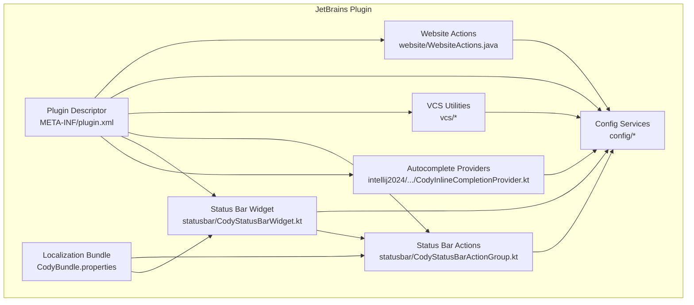
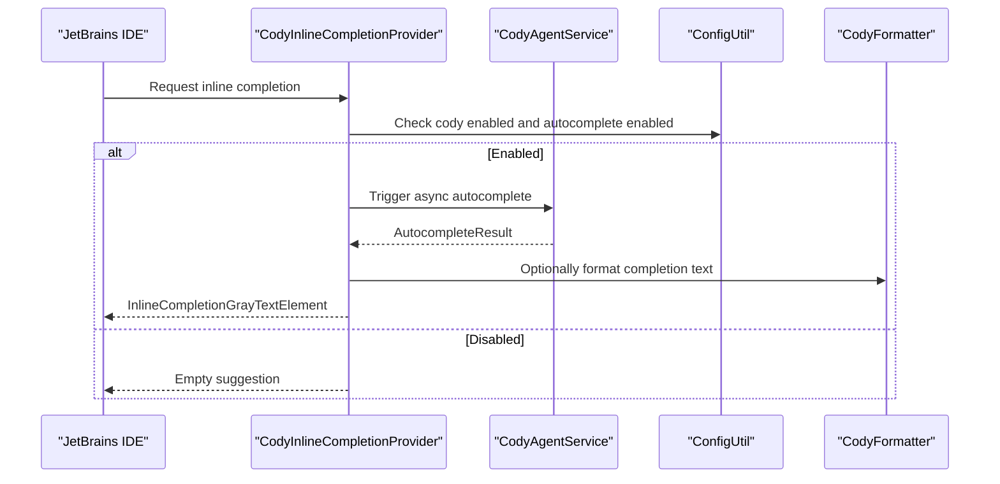
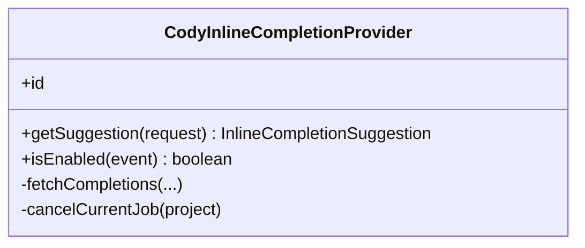
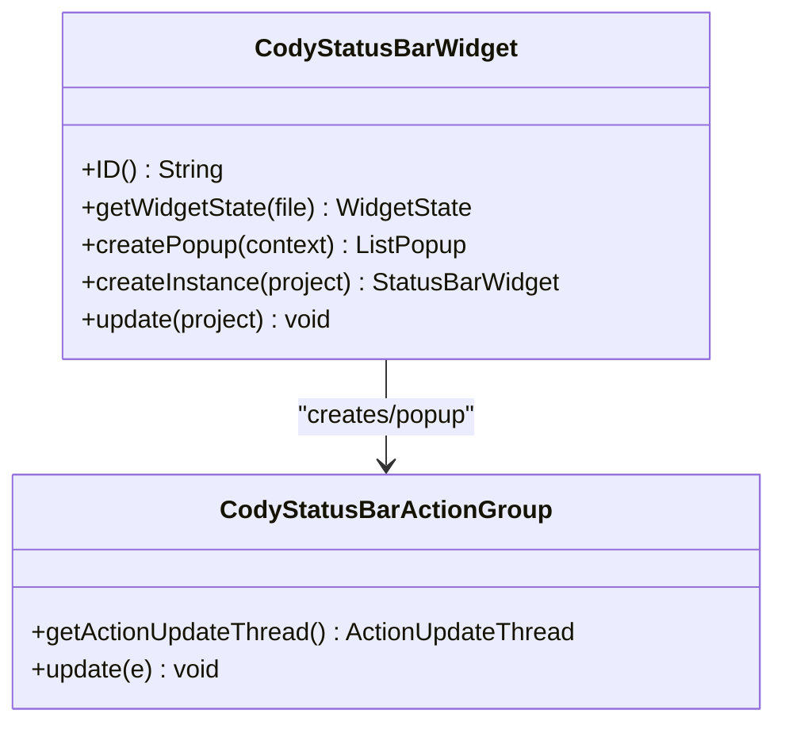
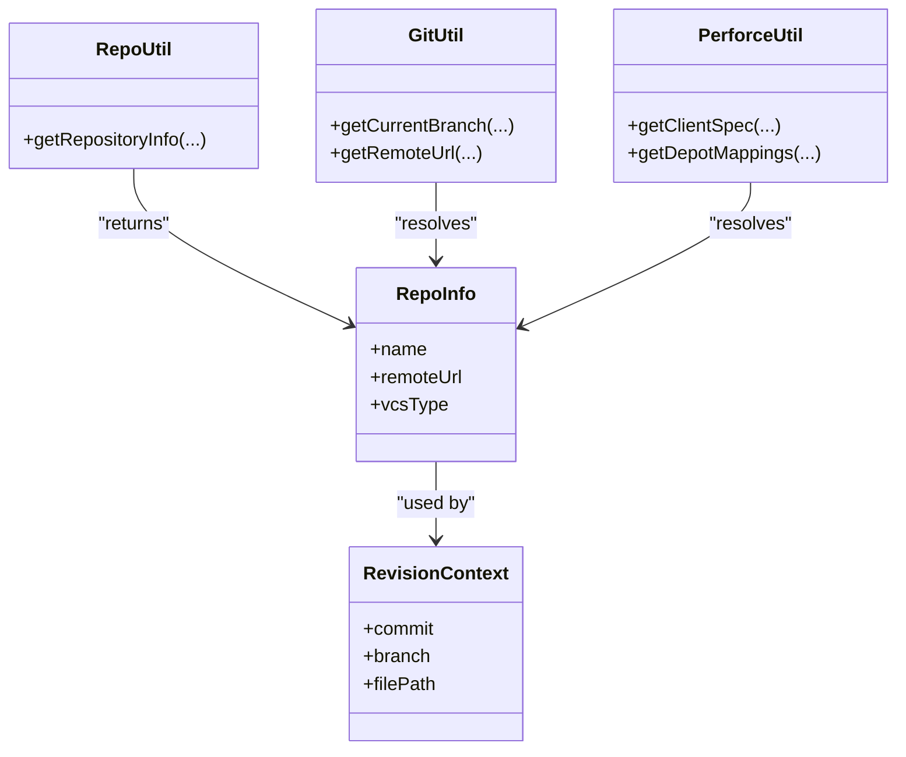
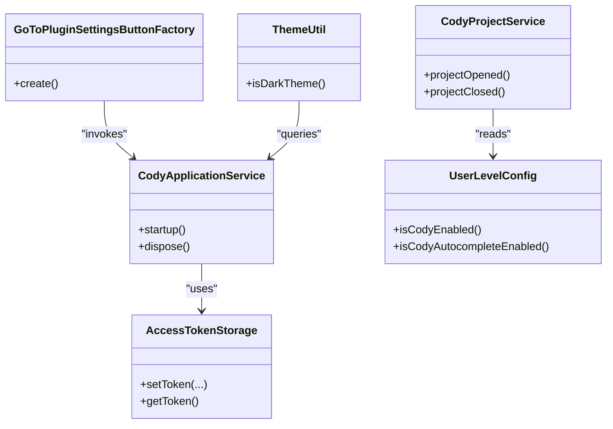
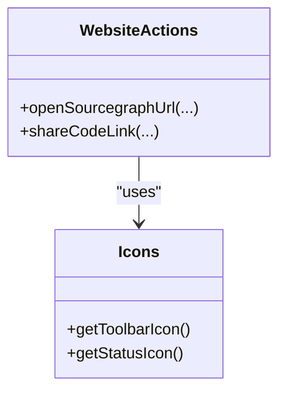
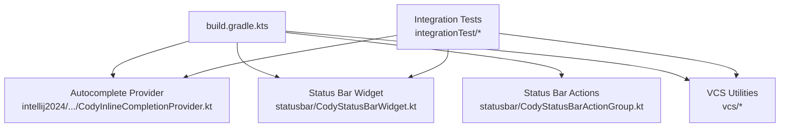

# IDE Integration

<cite>
**Referenced Files in This Document**
- [jetbrains/README.md](file://jetbrains/README.md)
- [jetbrains/build.gradle.kts](file://jetbrains/build.gradle.kts)
- [jetbrains/src/intellij2024/kotlin/com/sourcegraph/cody/autocomplete/CodyInlineCompletionProvider.kt](file://jetbrains/src/intellij2024/kotlin/com/sourcegraph/cody/autocomplete/CodyInlineCompletionProvider.kt)
- [jetbrains/src/integrationTest/kotlin/com/sourcegraph/cody/autocomplete/AutocompleteCompletionTest.kt](file://jetbrains/src/integrationTest/kotlin/com/sourcegraph/cody/autocomplete/AutocompleteCompletionTest.kt)
- [jetbrains/src/integrationTest/kotlin/com/sourcegraph/cody/edit/DocumentCodeTest.kt](file://jetbrains/src/integrationTest/kotlin/com/sourcegraph/cody/edit/DocumentCodeTest.kt)
- [jetbrains/src/main/kotlin/com/sourcegraph/cody/statusbar/CodyStatusBarWidget.kt](file://jetbrains/src/main/kotlin/com/sourcegraph/cody/statusbar/CodyStatusBarWidget.kt)
- [jetbrains/src/main/kotlin/com/sourcegraph/cody/statusbar/CodyStatusBarActionGroup.kt](file://jetbrains/src/main/kotlin/com/sourcegraph/cody/statusbar/CodyStatusBarActionGroup.kt)
- [jetbrains/src/main/java/com/sourcegraph/vcs/GitUtil.java](file://jetbrains/src/main/java/com/sourcegraph/vcs/GitUtil.java)
- [jetbrains/src/main/java/com/sourcegraph/vcs/RepoUtil.java](file://jetbrains/src/main/java/com/sourcegraph/vcs/RepoUtil.java)
- [jetbrains/src/main/java/com/sourcegraph/vcs/RepoInfo.java](file://jetbrains/src/main/java/com/sourcegraph/vcs/RepoInfo.java)
- [jetbrains/src/main/java/com/sourcegraph/vcs/VCSType.java](file://jetbrains/src/main/java/com/sourcegraph/vcs/VCSType.java)
- [jetbrains/src/main/java/com/sourcegraph/vcs/RevisionContext.java](file://jetbrains/src/main/java/com/sourcegraph/vcs/RevisionContext.java)
- [jetbrains/src/main/java/com/sourcegraph/vcs/ConvertUtil.kt](file://jetbrains/src/main/java/com/sourcegraph/vcs/ConvertUtil.kt)
- [jetbrains/src/main/java/com/sourcegraph/vcs/PerforceUtil.java](file://jetbrains/src/main/java/com/sourcegraph/vcs/PerforceUtil.java)
- [jetbrains/src/main/java/com/sourcegraph/cody/config/CodyApplicationService.java](file://jetbrains/src/main/java/com/sourcegraph/cody/config/CodyApplicationService.java)
- [jetbrains/src/main/java/com/sourcegraph/cody/config/CodyProjectService.java](file://jetbrains/src/main/java/com/sourcegraph/cody/config/CodyProjectService.java)
- [jetbrains/src/main/java/com/sourcegraph/cody/config/UserLevelConfig.java](file://jetbrains/src/main/java/com/sourcegraph/cody/config/UserLevelConfig.java)
- [jetbrains/src/main/java/com/sourcegraph/cody/config/AccessTokenStorage.java](file://jetbrains/src/main/java/com/sourcegraph/cody/config/AccessTokenStorage.java)
- [jetbrains/src/main/java/com/sourcegraph/cody/config/GoToPluginSettingsButtonFactory.java](file://jetbrains/src/main/java/com/sourcegraph/cody/config/GoToPluginSettingsButtonFactory.java)
- [jetbrains/src/main/java/com/sourcegraph/cody/config/ThemeUtil.java](file://jetbrains/src/main/java/com/sourcegraph/cody/config/ThemeUtil.java)
- [jetbrains/src/main/java/com/sourcegraph/cody/website/WebsiteActions.java](file://jetbrains/src/main/java/com/sourcegraph/cody/website/WebsiteActions.java)
- [jetbrains/src/main/java/com/sourcegraph/cody/Icons.java](file://jetbrains/src/main/java/com/sourcegraph/cody/Icons.java)
- [jetbrains/src/main/resources/META-INF/plugin.xml](file://jetbrains/src/main/resources/META-INF/plugin.xml)
- [jetbrains/src/main/resources/CodyBundle.properties](file://jetbrains/src/main/resources/CodyBundle.properties)
</cite>

## Table of Contents
1. [Introduction](#introduction)
2. [Project Structure](#project-structure)
3. [Core Components](#core-components)
4. [Architecture Overview](#architecture-overview)
5. [Detailed Component Analysis](#detailed-component-analysis)
6. [Dependency Analysis](#dependency-analysis)
7. [Performance Considerations](#performance-considerations)
8. [Troubleshooting Guide](#troubleshooting-guide)
9. [Conclusion](#conclusion)
10. [Appendices](#appendices)

## Introduction
This document explains the IDE integration patterns implemented for JetBrains IDEs, focusing on autocomplete, inline completion providers, chat and UI actions, status bar integration, notifications, document/editor integration, VCS/repository detection, keyboard shortcuts, menu integration, and UI adaptations across IDE variants. It synthesizes the plugin’s architecture and behavior from the JetBrains module to help developers maintain a consistent user experience across IntelliJ IDEA, WebStorm, PyCharm, and other supported platforms.

## Project Structure
The JetBrains plugin is organized into:
- Autocomplete providers for different IDE baseline versions
- Status bar widget and action groups
- VCS utilities for repository detection and revision context
- Configuration services and settings factories
- Website actions and icon resources
- Plugin descriptor and localization bundle

**Diagram sources**
- [jetbrains/src/intellij2024/kotlin/com/sourcegraph/cody/autocomplete/CodyInlineCompletionProvider.kt:1-148](file://jetbrains/src/intellij2024/kotlin/com/sourcegraph/cody/autocomplete/CodyInlineCompletionProvider.kt#L1-L148)
- [jetbrains/src/main/kotlin/com/sourcegraph/cody/statusbar/CodyStatusBarWidget.kt:1-62](file://jetbrains/src/main/kotlin/com/sourcegraph/cody/statusbar/CodyStatusBarWidget.kt#L1-L62)
- [jetbrains/src/main/kotlin/com/sourcegraph/cody/statusbar/CodyStatusBarActionGroup.kt:1-83](file://jetbrains/src/main/kotlin/com/sourcegraph/cody/statusbar/CodyStatusBarActionGroup.kt#L1-L83)
- [jetbrains/src/main/java/com/sourcegraph/vcs/GitUtil.java](file://jetbrains/src/main/java/com/sourcegraph/vcs/GitUtil.java)
- [jetbrains/src/main/java/com/sourcegraph/vcs/RepoUtil.java](file://jetbrains/src/main/java/com/sourcegraph/vcs/RepoUtil.java)
- [jetbrains/src/main/java/com/sourcegraph/cody/config/CodyApplicationService.java](file://jetbrains/src/main/java/com/sourcegraph/cody/config/CodyApplicationService.java)
- [jetbrains/src/main/java/com/sourcegraph/cody/website/WebsiteActions.java](file://jetbrains/src/main/java/com/sourcegraph/cody/website/WebsiteActions.java)
- [jetbrains/src/main/resources/META-INF/plugin.xml](file://jetbrains/src/main/resources/META-INF/plugin.xml)
- [jetbrains/src/main/resources/CodyBundle.properties](file://jetbrains/src/main/resources/CodyBundle.properties)

**Section sources**
- [jetbrains/README.md:92-128](file://jetbrains/README.md#L92-L128)
- [jetbrains/build.gradle.kts:28-57](file://jetbrains/build.gradle.kts#L28-L57)

## Core Components
- Inline completion provider for modern IDEs (baseline 233+)
- Status bar widget and dynamic action group
- VCS utilities for Git and Perforce
- Configuration services and settings factories
- Website actions and icons
- Plugin descriptor and localized strings

**Section sources**
- [jetbrains/src/intellij2024/kotlin/com/sourcegraph/cody/autocomplete/CodyInlineCompletionProvider.kt:33-148](file://jetbrains/src/intellij2024/kotlin/com/sourcegraph/cody/autocomplete/CodyInlineCompletionProvider.kt#L33-L148)
- [jetbrains/src/main/kotlin/com/sourcegraph/cody/statusbar/CodyStatusBarWidget.kt:16-62](file://jetbrains/src/main/kotlin/com/sourcegraph/cody/statusbar/CodyStatusBarWidget.kt#L16-L62)
- [jetbrains/src/main/kotlin/com/sourcegraph/cody/statusbar/CodyStatusBarActionGroup.kt:13-83](file://jetbrains/src/main/kotlin/com/sourcegraph/cody/statusbar/CodyStatusBarActionGroup.kt#L13-L83)
- [jetbrains/src/main/java/com/sourcegraph/vcs/GitUtil.java](file://jetbrains/src/main/java/com/sourcegraph/vcs/GitUtil.java)
- [jetbrains/src/main/java/com/sourcegraph/vcs/PerforceUtil.java](file://jetbrains/src/main/java/com/sourcegraph/vcs/PerforceUtil.java)
- [jetbrains/src/main/java/com/sourcegraph/cody/config/CodyApplicationService.java](file://jetbrains/src/main/java/com/sourcegraph/cody/config/CodyApplicationService.java)
- [jetbrains/src/main/java/com/sourcegraph/cody/website/WebsiteActions.java](file://jetbrains/src/main/java/com/sourcegraph/cody/website/WebsiteActions.java)
- [jetbrains/src/main/resources/META-INF/plugin.xml](file://jetbrains/src/main/resources/META-INF/plugin.xml)
- [jetbrains/src/main/resources/CodyBundle.properties](file://jetbrains/src/main/resources/CodyBundle.properties)

## Architecture Overview
The plugin integrates with JetBrains IDEs through:
- Inline completion provider registered for modern IDE versions
- Status bar widget that reflects Cody status and exposes actions
- VCS utilities to detect repository metadata and revision context
- Configuration services to manage application/project settings and tokens
- Website actions to open Sourcegraph links and context-aware URLs
- Plugin descriptor wiring actions, widgets, and services

**Diagram sources**
- [jetbrains/src/intellij2024/kotlin/com/sourcegraph/cody/autocomplete/CodyInlineCompletionProvider.kt:39-95](file://jetbrains/src/intellij2024/kotlin/com/sourcegraph/cody/autocomplete/CodyInlineCompletionProvider.kt#L39-L95)
- [jetbrains/src/intellij2024/kotlin/com/sourcegraph/cody/autocomplete/CodyInlineCompletionProvider.kt:98-125](file://jetbrains/src/intellij2024/kotlin/com/sourcegraph/cody/autocomplete/CodyInlineCompletionProvider.kt#L98-L125)

**Section sources**
- [jetbrains/src/intellij2024/kotlin/com/sourcegraph/cody/autocomplete/CodyInlineCompletionProvider.kt:33-148](file://jetbrains/src/intellij2024/kotlin/com/sourcegraph/cody/autocomplete/CodyInlineCompletionProvider.kt#L33-L148)

## Detailed Component Analysis

### Inline Completion Provider
The provider integrates autocomplete into the IDE’s inline completion pipeline:
- Validates IDE version, feature flags, and configuration
- Computes caret position and line context
- Triggers asynchronous autocomplete via the agent
- Applies optional formatting and returns a gray-text suggestion element

**Diagram sources**
- [jetbrains/src/intellij2024/kotlin/com/sourcegraph/cody/autocomplete/CodyInlineCompletionProvider.kt:33-148](file://jetbrains/src/intellij2024/kotlin/com/sourcegraph/cody/autocomplete/CodyInlineCompletionProvider.kt#L33-L148)

**Section sources**
- [jetbrains/src/intellij2024/kotlin/com/sourcegraph/cody/autocomplete/CodyInlineCompletionProvider.kt:39-146](file://jetbrains/src/intellij2024/kotlin/com/sourcegraph/cody/autocomplete/CodyInlineCompletionProvider.kt#L39-L146)

### Status Bar Integration
The status bar widget displays Cody’s current status and provides a popup menu of actions:
- Reflects current status and icon
- Shows placeholder text in remote environments
- Builds action groups dynamically based on status and configuration
- Updates visibility and content depending on Cody’s state

**Diagram sources**
- [jetbrains/src/main/kotlin/com/sourcegraph/cody/statusbar/CodyStatusBarWidget.kt:16-62](file://jetbrains/src/main/kotlin/com/sourcegraph/cody/statusbar/CodyStatusBarWidget.kt#L16-L62)
- [jetbrains/src/main/kotlin/com/sourcegraph/cody/statusbar/CodyStatusBarActionGroup.kt:13-83](file://jetbrains/src/main/kotlin/com/sourcegraph/cody/statusbar/CodyStatusBarActionGroup.kt#L13-L83)

**Section sources**
- [jetbrains/src/main/kotlin/com/sourcegraph/cody/statusbar/CodyStatusBarWidget.kt:19-42](file://jetbrains/src/main/kotlin/com/sourcegraph/cody/statusbar/CodyStatusBarWidget.kt#L19-L42)
- [jetbrains/src/main/kotlin/com/sourcegraph/cody/statusbar/CodyStatusBarActionGroup.kt:19-42](file://jetbrains/src/main/kotlin/com/sourcegraph/cody/statusbar/CodyStatusBarActionGroup.kt#L19-L42)

### VCS Integration and Repository Detection
The plugin detects repositories and revision context to support Sourcegraph links and context:
- Git utilities for repository and remote resolution
- Perforce utilities for depot and client mapping
- Repository info and revision context models
- Conversion utilities for VCS metadata

**Diagram sources**
- [jetbrains/src/main/java/com/sourcegraph/vcs/RepoUtil.java](file://jetbrains/src/main/java/com/sourcegraph/vcs/RepoUtil.java)
- [jetbrains/src/main/java/com/sourcegraph/vcs/GitUtil.java](file://jetbrains/src/main/java/com/sourcegraph/vcs/GitUtil.java)
- [jetbrains/src/main/java/com/sourcegraph/vcs/PerforceUtil.java](file://jetbrains/src/main/java/com/sourcegraph/vcs/PerforceUtil.java)
- [jetbrains/src/main/java/com/sourcegraph/vcs/RepoInfo.java](file://jetbrains/src/main/java/com/sourcegraph/vcs/RepoInfo.java)
- [jetbrains/src/main/java/com/sourcegraph/vcs/RevisionContext.java](file://jetbrains/src/main/java/com/sourcegraph/vcs/RevisionContext.java)

**Section sources**
- [jetbrains/src/main/java/com/sourcegraph/vcs/GitUtil.java](file://jetbrains/src/main/java/com/sourcegraph/vcs/GitUtil.java)
- [jetbrains/src/main/java/com/sourcegraph/vcs/PerforceUtil.java](file://jetbrains/src/main/java/com/sourcegraph/vcs/PerforceUtil.java)
- [jetbrains/src/main/java/com/sourcegraph/vcs/RepoUtil.java](file://jetbrains/src/main/java/com/sourcegraph/vcs/RepoUtil.java)
- [jetbrains/src/main/java/com/sourcegraph/vcs/RepoInfo.java](file://jetbrains/src/main/java/com/sourcegraph/vcs/RepoInfo.java)
- [jetbrains/src/main/java/com/sourcegraph/vcs/RevisionContext.java](file://jetbrains/src/main/java/com/sourcegraph/vcs/RevisionContext.java)
- [jetbrains/src/main/java/com/sourcegraph/vcs/ConvertUtil.kt](file://jetbrains/src/main/java/com/sourcegraph/vcs/ConvertUtil.kt)

### Configuration Services and Settings
Configuration services manage application/project settings, tokens, and theme utilities:
- Application and project services for lifecycle and state
- Access token storage and retrieval
- Settings button factory and theme utilities
- User-level configuration toggles

**Diagram sources**
- [jetbrains/src/main/java/com/sourcegraph/cody/config/CodyApplicationService.java](file://jetbrains/src/main/java/com/sourcegraph/cody/config/CodyApplicationService.java)
- [jetbrains/src/main/java/com/sourcegraph/cody/config/CodyProjectService.java](file://jetbrains/src/main/java/com/sourcegraph/cody/config/CodyProjectService.java)
- [jetbrains/src/main/java/com/sourcegraph/cody/config/AccessTokenStorage.java](file://jetbrains/src/main/java/com/sourcegraph/cody/config/AccessTokenStorage.java)
- [jetbrains/src/main/java/com/sourcegraph/cody/config/GoToPluginSettingsButtonFactory.java](file://jetbrains/src/main/java/com/sourcegraph/cody/config/GoToPluginSettingsButtonFactory.java)
- [jetbrains/src/main/java/com/sourcegraph/cody/config/ThemeUtil.java](file://jetbrains/src/main/java/com/sourcegraph/cody/config/ThemeUtil.java)
- [jetbrains/src/main/java/com/sourcegraph/cody/config/UserLevelConfig.java](file://jetbrains/src/main/java/com/sourcegraph/cody/config/UserLevelConfig.java)

**Section sources**
- [jetbrains/src/main/java/com/sourcegraph/cody/config/CodyApplicationService.java](file://jetbrains/src/main/java/com/sourcegraph/cody/config/CodyApplicationService.java)
- [jetbrains/src/main/java/com/sourcegraph/cody/config/CodyProjectService.java](file://jetbrains/src/main/java/com/sourcegraph/cody/config/CodyProjectService.java)
- [jetbrains/src/main/java/com/sourcegraph/cody/config/AccessTokenStorage.java](file://jetbrains/src/main/java/com/sourcegraph/cody/config/AccessTokenStorage.java)
- [jetbrains/src/main/java/com/sourcegraph/cody/config/GoToPluginSettingsButtonFactory.java](file://jetbrains/src/main/java/com/sourcegraph/cody/config/GoToPluginSettingsButtonFactory.java)
- [jetbrains/src/main/java/com/sourcegraph/cody/config/ThemeUtil.java](file://jetbrains/src/main/java/com/sourcegraph/cody/config/ThemeUtil.java)
- [jetbrains/src/main/java/com/sourcegraph/cody/config/UserLevelConfig.java](file://jetbrains/src/main/java/com/sourcegraph/cody/config/UserLevelConfig.java)

### Website Actions and UI Adaptations
Website actions integrate Sourcegraph links and context-aware URL generation:
- Website actions for opening links and sharing code
- Icon resources for toolbar and status bar
- UI adaptations for remote environments and theme-aware rendering

**Diagram sources**
- [jetbrains/src/main/java/com/sourcegraph/cody/website/WebsiteActions.java](file://jetbrains/src/main/java/com/sourcegraph/cody/website/WebsiteActions.java)
- [jetbrains/src/main/java/com/sourcegraph/cody/Icons.java](file://jetbrains/src/main/java/com/sourcegraph/cody/Icons.java)

**Section sources**
- [jetbrains/src/main/java/com/sourcegraph/cody/website/WebsiteActions.java](file://jetbrains/src/main/java/com/sourcegraph/cody/website/WebsiteActions.java)
- [jetbrains/src/main/java/com/sourcegraph/cody/Icons.java](file://jetbrains/src/main/java/com/sourcegraph/cody/Icons.java)

### Keyboard Shortcuts, Menus, and UI Adaptations
- Supported IDEs include IntelliJ IDEA, WebStorm, PyCharm, and others
- Installation and usage instructions, including Alt+S shortcut for search and context menu actions
- Keymap customization via JetBrains preferences
- Remote environment handling for status bar icons

**Section sources**
- [jetbrains/README.md:92-128](file://jetbrains/README.md#L92-L128)
- [jetbrains/README.md:186-195](file://jetbrains/README.md#L186-L195)

## Dependency Analysis
The plugin targets multiple IDE baseline versions and bundles VCS modules conditionally. Integration tests exercise autocomplete and document-code flows across test projects.

**Diagram sources**
- [jetbrains/build.gradle.kts:32-57](file://jetbrains/build.gradle.kts#L32-L57)
- [jetbrains/build.gradle.kts:123-150](file://jetbrains/build.gradle.kts#L123-L150)
- [jetbrains/src/integrationTest/kotlin/com/sourcegraph/cody/autocomplete/AutocompleteCompletionTest.kt](file://jetbrains/src/integrationTest/kotlin/com/sourcegraph/cody/autocomplete/AutocompleteCompletionTest.kt)
- [jetbrains/src/integrationTest/kotlin/com/sourcegraph/cody/edit/DocumentCodeTest.kt](file://jetbrains/src/integrationTest/kotlin/com/sourcegraph/cody/edit/DocumentCodeTest.kt)

**Section sources**
- [jetbrains/build.gradle.kts:32-57](file://jetbrains/build.gradle.kts#L32-L57)
- [jetbrains/build.gradle.kts:123-150](file://jetbrains/build.gradle.kts#L123-L150)
- [jetbrains/src/integrationTest/kotlin/com/sourcegraph/cody/autocomplete/AutocompleteCompletionTest.kt](file://jetbrains/src/integrationTest/kotlin/com/sourcegraph/cody/autocomplete/AutocompleteCompletionTest.kt)
- [jetbrains/src/integrationTest/kotlin/com/sourcegraph/cody/edit/DocumentCodeTest.kt](file://jetbrains/src/integrationTest/kotlin/com/sourcegraph/cody/edit/DocumentCodeTest.kt)

## Performance Considerations
- Async autocomplete with cancellation and timeout prevents long blocking operations
- Optional formatting can be disabled via system property to reduce overhead
- Status bar updates are triggered efficiently and avoid unnecessary redraws
- Integration tests configure timeouts and resource limits to stabilize CI runs

[No sources needed since this section provides general guidance]

## Troubleshooting Guide
Common issues and remedies:
- Autocomplete disabled: Verify IDE baseline version, feature flags, and configuration toggles
- Status bar widget hidden: Confirm Cody is enabled and status is not disabled
- VCS detection failures: Ensure Git/Perforce clients are installed and accessible in PATH
- Remote environments: Status bar icons fall back to text labels; verify network connectivity
- Keymap conflicts: Adjust custom keymaps in JetBrains preferences

**Section sources**
- [jetbrains/src/intellij2024/kotlin/com/sourcegraph/cody/autocomplete/CodyInlineCompletionProvider.kt:140-146](file://jetbrains/src/intellij2024/kotlin/com/sourcegraph/cody/autocomplete/CodyInlineCompletionProvider.kt#L140-L146)
- [jetbrains/src/main/kotlin/com/sourcegraph/cody/statusbar/CodyStatusBarWidget.kt:19-29](file://jetbrains/src/main/kotlin/com/sourcegraph/cody/statusbar/CodyStatusBarWidget.kt#L19-L29)
- [jetbrains/README.md:114-128](file://jetbrains/README.md#L114-L128)
- [jetbrains/README.md:186-195](file://jetbrains/README.md#L186-L195)

## Conclusion
The JetBrains plugin integrates autocomplete, inline completions, status reporting, VCS-aware context, and UI actions across a wide range of IDEs. By leveraging version-specific providers, dynamic status bar actions, robust VCS utilities, and configurable settings, it maintains a consistent user experience while adapting to IDE-specific capabilities and constraints.

[No sources needed since this section summarizes without analyzing specific files]

## Appendices

### Keyboard Shortcuts and Menus
- Search with Sourcegraph: Alt+S (Option+S on macOS)
- Context menu actions under “Sourcegraph” in editor
- Customize keymaps in JetBrains preferences under Keymap tab, filtered by “sourcegraph”

**Section sources**
- [jetbrains/README.md:125-127](file://jetbrains/README.md#L125-L127)
- [jetbrains/README.md:190-194](file://jetbrains/README.md#L190-L194)

### Supported IDEs and Compatibility Notes
- Supports IntelliJ IDEA, WebStorm, PyCharm, and other JetBrains IDEs
- Recommended IDE versions 2022+
- Known limitation for Apple Silicon with IDE versions 2021.1 and 2021.2 regarding search

**Section sources**
- [jetbrains/README.md:94-112](file://jetbrains/README.md#L94-L112)

### Plugin Descriptor and Localization
- Plugin descriptor registers actions, widgets, and services
- Localization bundle provides status widget labels and messages

**Section sources**
- [jetbrains/src/main/resources/META-INF/plugin.xml](file://jetbrains/src/main/resources/META-INF/plugin.xml)
- [jetbrains/src/main/resources/CodyBundle.properties](file://jetbrains/src/main/resources/CodyBundle.properties)