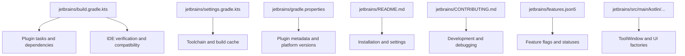
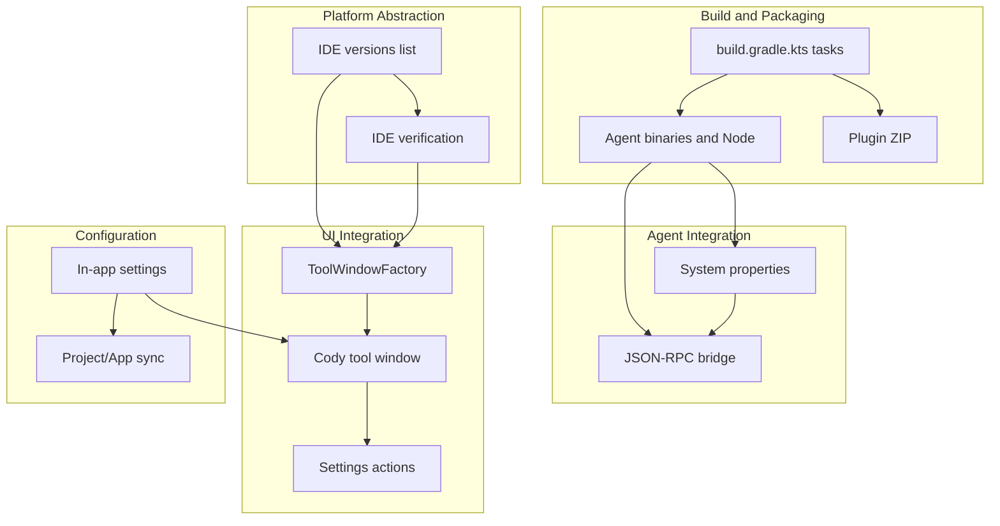
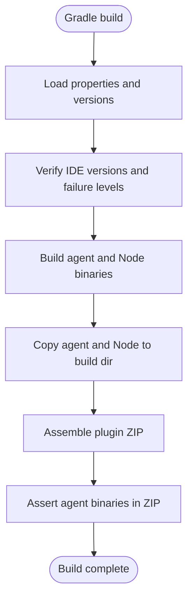
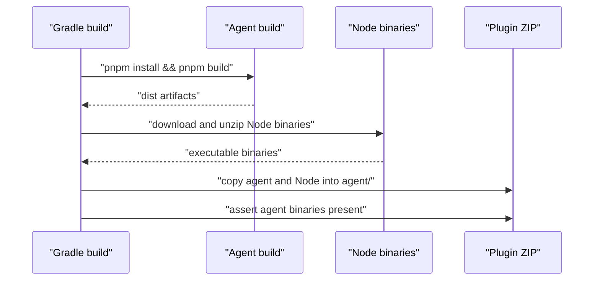
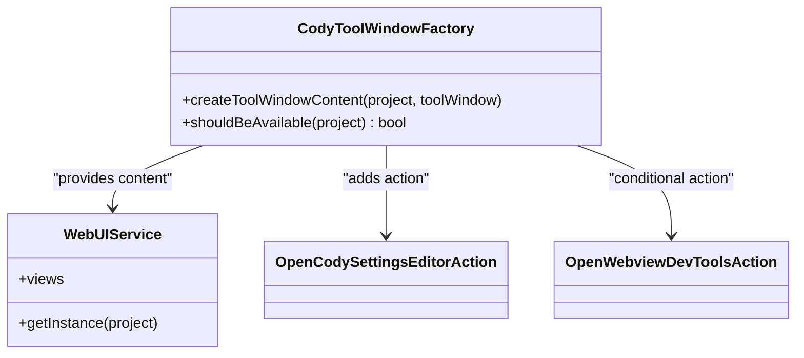
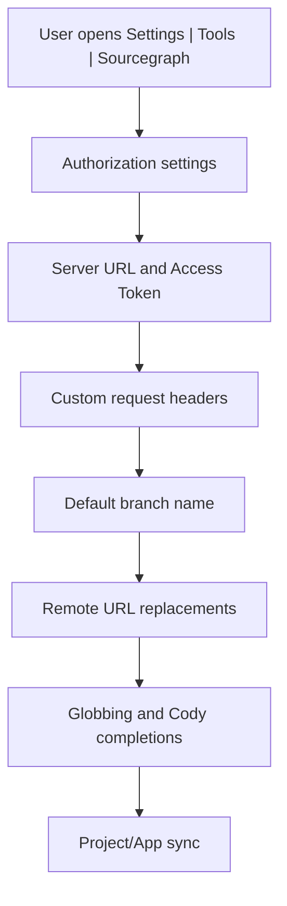
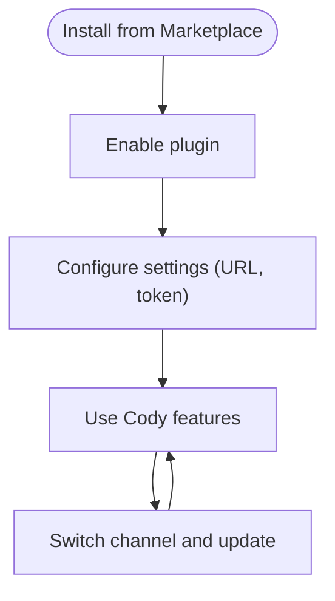
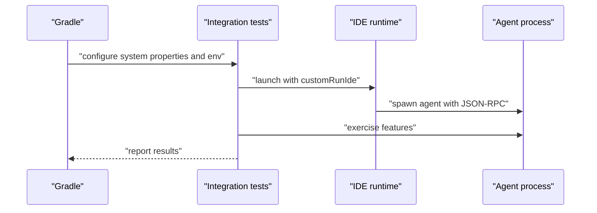
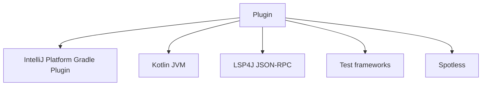

# JetBrains Plugin

<cite>
**Referenced Files in This Document**
- [build.gradle.kts](file://jetbrains/build.gradle.kts)
- [settings.gradle.kts](file://jetbrains/settings.gradle.kts)
- [gradle.properties](file://jetbrains/gradle.properties)
- [README.md](file://jetbrains/README.md)
- [CONTRIBUTING.md](file://jetbrains/CONTRIBUTING.md)
- [features.json5](file://jetbrains/features.json5)
- [CodyToolWindowFactory.kt](file://jetbrains/src/main/kotlin/com/sourcegraph/cody/CodyToolWindowFactory.kt)
</cite>

## Table of Contents
1. [Introduction](#introduction)
2. [Project Structure](#project-structure)
3. [Core Components](#core-components)
4. [Architecture Overview](#architecture-overview)
5. [Detailed Component Analysis](#detailed-component-analysis)
6. [Dependency Analysis](#dependency-analysis)
7. [Performance Considerations](#performance-considerations)
8. [Troubleshooting Guide](#troubleshooting-guide)
9. [Conclusion](#conclusion)
10. [Appendices](#appendices)

## Introduction
This document describes the JetBrains plugin implementation that integrates the Cody AI assistant and Code Search into JetBrains IDEs such as IntelliJ IDEA, WebStorm, PyCharm, and others. It explains the plugin architecture, platform abstraction layers, agent integration, IDE-specific adaptations, build system and multi-platform compilation, integration with JetBrains APIs (project/application services, UI components), agent communication protocols, process management, cross-platform compatibility, configuration and settings synchronization, installation and marketplace distribution, update mechanisms, IDE-specific features and keyboard shortcuts, UI adaptations, testing strategies, integration tests, and compatibility verification across JetBrains IDE versions.

## Project Structure
The JetBrains plugin is implemented as a Gradle-based IntelliJ Platform plugin. The repository organizes the plugin under the jetbrains directory with:
- A Gradle build script that defines tasks, dependencies, and platform targeting
- A settings script for toolchain configuration and build cache
- Properties controlling plugin metadata, platform versions, and Java version
- A README with installation, settings, and usage instructions
- A CONTRIBUTING guide covering development, debugging, and publishing workflows
- A features JSON file indicating feature statuses per editor
- Source code under src/main/kotlin for platform abstractions and UI integrations

**Diagram sources**
- [build.gradle.kts:59-150](file://jetbrains/build.gradle.kts#L59-L150)
- [settings.gradle.kts:1-8](file://jetbrains/settings.gradle.kts#L1-L8)
- [gradle.properties:1-27](file://jetbrains/gradle.properties#L1-L27)
- [README.md:1-207](file://jetbrains/README.md#L1-L207)
- [CONTRIBUTING.md:1-450](file://jetbrains/CONTRIBUTING.md#L1-L450)
- [features.json5:1-69](file://jetbrains/features.json5#L1-L69)

**Section sources**
- [build.gradle.kts:1-632](file://jetbrains/build.gradle.kts#L1-L632)
- [settings.gradle.kts:1-8](file://jetbrains/settings.gradle.kts#L1-L8)
- [gradle.properties:1-27](file://jetbrains/gradle.properties#L1-L27)
- [README.md:1-207](file://jetbrains/README.md#L1-L207)
- [CONTRIBUTING.md:1-450](file://jetbrains/CONTRIBUTING.md#L1-L450)
- [features.json5:1-69](file://jetbrains/features.json5#L1-L69)

## Core Components
- Plugin build and packaging: Gradle tasks assemble the plugin, embed the agent binaries, and verify compatibility across IDE versions.
- Platform abstraction: The plugin targets multiple IDE platforms (IC, PC, GoLand, etc.) and supports multiple IDE versions.
- Agent integration: The plugin builds and bundles the Cody agent and Node binaries, manages agent lifecycle, and communicates via JSON-RPC.
- UI integration: A tool window factory creates the Cody tool window, integrates settings actions, and adapts UI content based on feature flags.
- Configuration and settings: The plugin exposes in-app settings for authorization, server URL, tokens, remote URL replacements, globbing, and Cody completion toggles.
- Testing and verification: Integration tests run against multiple IDE versions, with configurable recording modes and environment variables.

**Section sources**
- [build.gradle.kts:59-150](file://jetbrains/build.gradle.kts#L59-L150)
- [build.gradle.kts:323-419](file://jetbrains/build.gradle.kts#L323-L419)
- [build.gradle.kts:487-531](file://jetbrains/build.gradle.kts#L487-L531)
- [CodyToolWindowFactory.kt:16-41](file://jetbrains/src/main/kotlin/com/sourcegraph/cody/CodyToolWindowFactory.kt#L16-L41)
- [README.md:130-177](file://jetbrains/README.md#L130-L177)

## Architecture Overview
The plugin architecture follows a layered design:
- Build and packaging layer: Gradle orchestrates agent building, resource copying, and plugin assembly.
- Platform abstraction layer: The plugin targets multiple IDE platforms and versions, with version lists and compatibility checks.
- Agent integration layer: The plugin manages the agent process, passes environment/system properties, and verifies agent presence in the packaged plugin.
- UI integration layer: The tool window factory integrates with the JetBrains tool window system and provides settings actions.
- Configuration and settings layer: The plugin exposes in-app settings synchronized at project and application levels.

**Diagram sources**
- [build.gradle.kts:323-419](file://jetbrains/build.gradle.kts#L323-L419)
- [build.gradle.kts:487-531](file://jetbrains/build.gradle.kts#L487-L531)
- [build.gradle.kts:533-545](file://jetbrains/build.gradle.kts#L533-L545)
- [CodyToolWindowFactory.kt:16-41](file://jetbrains/src/main/kotlin/com/sourcegraph/cody/CodyToolWindowFactory.kt#L16-L41)
- [README.md:130-177](file://jetbrains/README.md#L130-L177)

## Detailed Component Analysis

### Build System and Multi-Platform Compilation
- Gradle plugins and dependencies: Kotlin JVM, IntelliJ Platform Gradle Plugin, Changelog, Spotless, Sentry.
- Platform targeting: Properties define platform type and version; tasks select source directories based on major platform version.
- IDE verification: A list of IDE versions is maintained; plugin verification validates against these versions with configurable failure levels.
- Agent and Node binaries: Tasks build the agent, download Node binaries, and copy them into the plugin resources; the buildPlugin task asserts agent binaries are present.
- Integration tests: Tasks configure JVM arguments, system properties, environment variables, and test frameworks for IDE integration testing.

**Diagram sources**
- [build.gradle.kts:28-57](file://jetbrains/build.gradle.kts#L28-L57)
- [build.gradle.kts:394-419](file://jetbrains/build.gradle.kts#L394-L419)
- [build.gradle.kts:502-531](file://jetbrains/build.gradle.kts#L502-L531)

**Section sources**
- [build.gradle.kts:59-150](file://jetbrains/build.gradle.kts#L59-L150)
- [build.gradle.kts:323-419](file://jetbrains/build.gradle.kts#L323-L419)
- [build.gradle.kts:533-545](file://jetbrains/build.gradle.kts#L533-L545)
- [build.gradle.kts:589-606](file://jetbrains/build.gradle.kts#L589-L606)
- [gradle.properties:9-16](file://jetbrains/gradle.properties#L9-L16)

### Agent Integration and Process Management
- Agent building: The buildCody task runs pnpm install and pnpm run build in the agent directory, then copies artifacts to the build directory.
- Node binaries: downloadNodeBinaries fetches and unzips Node binaries from a GitHub archive; permissions are set for executability.
- Bundling: The buildPlugin task includes agent and webviews resources into the plugin ZIP under the agent/ directory.
- Verification: A post-build assertion ensures specific agent binaries exist in the plugin ZIP.
- System properties: Tasks set agent-related system properties for tracing, agent directory, verbose logging, and formatting options.

**Diagram sources**
- [build.gradle.kts:394-419](file://jetbrains/build.gradle.kts#L394-L419)
- [build.gradle.kts:340-390](file://jetbrains/build.gradle.kts#L340-L390)
- [build.gradle.kts:502-531](file://jetbrains/build.gradle.kts#L502-L531)

**Section sources**
- [build.gradle.kts:394-419](file://jetbrains/build.gradle.kts#L394-L419)
- [build.gradle.kts:340-390](file://jetbrains/build.gradle.kts#L340-L390)
- [build.gradle.kts:467-477](file://jetbrains/build.gradle.kts#L467-L477)
- [build.gradle.kts:502-531](file://jetbrains/build.gradle.kts#L502-L531)

### JetBrains IDE Integration and UI Components
- ToolWindowFactory: Creates the Cody tool window, adds content, and registers gear actions for settings and internal tools based on feature flags.
- Availability: The tool window is only available when Cody is enabled.
- UI service integration: The tool window content is provided by a web UI service.

**Diagram sources**
- [CodyToolWindowFactory.kt:16-41](file://jetbrains/src/main/kotlin/com/sourcegraph/cody/CodyToolWindowFactory.kt#L16-L41)

**Section sources**
- [CodyToolWindowFactory.kt:16-41](file://jetbrains/src/main/kotlin/com/sourcegraph/cody/CodyToolWindowFactory.kt#L16-L41)

### Configuration System and Settings Synchronization
- In-app settings: Authorization accounts, server URL, tokens, custom request headers, default branch name, remote URL replacements, globbing, and Cody completion toggles.
- Setting levels: Project-level settings for default account, default branch name, and remote URL replacements; application-level settings for other preferences.
- System properties: Autocomplete formatting can be controlled via system properties.

**Diagram sources**
- [README.md:130-177](file://jetbrains/README.md#L130-L177)

**Section sources**
- [README.md:130-177](file://jetbrains/README.md#L130-L177)

### Installation, Marketplace Distribution, and Updates
- Installation: Users install from the JetBrains Marketplace, ensure git is available, and restart the IDE if needed.
- Marketplace distribution: The publishPlugin task publishes to the JetBrains Marketplace using a release channel derived from the plugin version.
- Update mechanisms: Users can switch to Nightly/Experimental channels and update the plugin; stable releases may be expedited via internal channels.

**Diagram sources**
- [README.md:114-129](file://jetbrains/README.md#L114-L129)
- [CONTRIBUTING.md:137-146](file://jetbrains/CONTRIBUTING.md#L137-L146)
- [build.gradle.kts:565-575](file://jetbrains/build.gradle.kts#L565-L575)

**Section sources**
- [README.md:114-129](file://jetbrains/README.md#L114-L129)
- [CONTRIBUTING.md:137-146](file://jetbrains/CONTRIBUTING.md#L137-L146)
- [build.gradle.kts:565-575](file://jetbrains/build.gradle.kts#L565-L575)

### IDE-Specific Features, Keyboard Shortcuts, and UI Adaptations
- Supported IDEs: The plugin supports IntelliJ IDEA, WebStorm, PyCharm, and many other JetBrains IDEs.
- Keyboard shortcuts: Alt+S for Code Search; context menu actions under Sourcegraph; preferences location differs by OS.
- UI adaptations: The tool window integrates with JetBrains UI conventions; internal tools are gated by feature flags.

**Section sources**
- [README.md:92-129](file://jetbrains/README.md#L92-L129)
- [CodyToolWindowFactory.kt:26-28](file://jetbrains/src/main/kotlin/com/sourcegraph/cody/CodyToolWindowFactory.kt#L26-L28)

### Testing Strategies and Compatibility Verification
- Integration tests: Tasks configure JVM args, system properties, environment variables, and test frameworks; tests run against multiple IDE versions.
- Recording modes: Tests can replay, pass-through, or record responses; resources are processed and copied for integration tests.
- Compatibility verification: The plugin verification task validates against a curated list of IDE versions with configurable failure levels.

**Diagram sources**
- [build.gradle.kts:271-321](file://jetbrains/build.gradle.kts#L271-L321)
- [build.gradle.kts:589-606](file://jetbrains/build.gradle.kts#L589-L606)
- [build.gradle.kts:117-121](file://jetbrains/build.gradle.kts#L117-L121)

**Section sources**
- [build.gradle.kts:271-321](file://jetbrains/build.gradle.kts#L271-L321)
- [build.gradle.kts:589-606](file://jetbrains/build.gradle.kts#L589-L606)
- [build.gradle.kts:117-121](file://jetbrains/build.gradle.kts#L117-L121)
- [CONTRIBUTING.md:434-450](file://jetbrains/CONTRIBUTING.md#L434-L450)

## Dependency Analysis
The plugin depends on:
- IntelliJ Platform Gradle Plugin for platform targeting and verification
- Kotlin JVM for language support
- LSP4J for JSON-RPC communication
- Test frameworks and tools for integration testing
- Spotless for code formatting

**Diagram sources**
- [build.gradle.kts:59-150](file://jetbrains/build.gradle.kts#L59-L150)

**Section sources**
- [build.gradle.kts:59-150](file://jetbrains/build.gradle.kts#L59-L150)

## Performance Considerations
- Build performance: Use cached IDE installations to speed up verification; adjust Gradle JVM args and Kotlin daemon JVM args for memory.
- Agent performance: Enable tracing and use Chrome DevTools to profile CPU/memory; consider disabling formatting for autocomplete elements via system properties.
- Resource bundling: Ensure agent and Node binaries are bundled efficiently; avoid unnecessary files in the plugin ZIP.

[No sources needed since this section provides general guidance]

## Troubleshooting Guide
- Version mismatches: If Node or pnpm versions change, stop the Gradle daemon to pick up changes.
- Memory issues: Increase JVM heap sizes for tests and Gradle; close other processes if encountering error 134.
- Windows specifics: Use PowerShell for building; ensure PNPM_HOME is set; skip codesearch build on ARM64 if needed.
- Debugging: Enable internal mode and JCEF debugging; use run configurations to debug the agent process; auto-rebuild the agent before launching.

**Section sources**
- [CONTRIBUTING.md:90-118](file://jetbrains/CONTRIBUTING.md#L90-L118)
- [CONTRIBUTING.md:211-227](file://jetbrains/CONTRIBUTING.md#L211-L227)
- [CONTRIBUTING.md:284-356](file://jetbrains/CONTRIBUTING.md#L284-L356)

## Conclusion
The JetBrains plugin integrates Cody and Code Search into JetBrains IDEs through a robust Gradle-based build system, platform abstraction for multiple IDEs and versions, embedded agent integration with JSON-RPC, and a cohesive UI layer centered on a tool window. The plugin supports extensive configuration, testing across IDE versions, and streamlined installation and updates via the JetBrains Marketplace. Following the documented build, configuration, and testing practices ensures reliable operation across diverse JetBrains IDE environments.

[No sources needed since this section summarizes without analyzing specific files]

## Appendices
- Feature statuses: Feature flags indicate planned and stable features for the JetBrains editor.
- Additional references: Build tasks, IDE verification, and contribution guidelines provide further implementation details.

**Section sources**
- [features.json5:1-69](file://jetbrains/features.json5#L1-L69)
- [CONTRIBUTING.md:1-450](file://jetbrains/CONTRIBUTING.md#L1-L450)