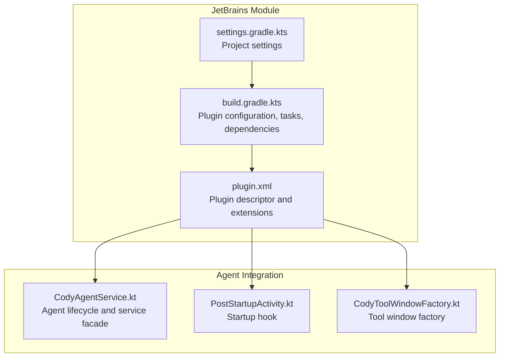
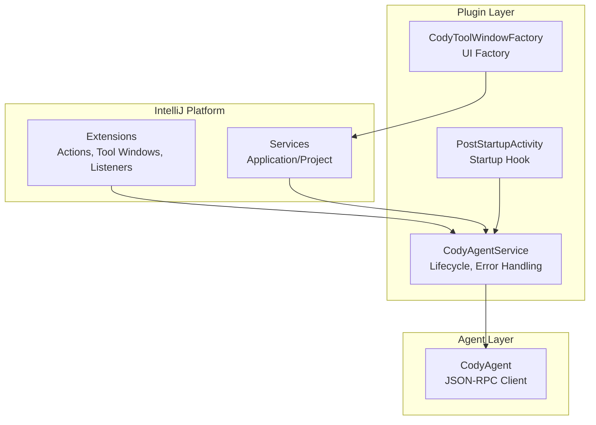
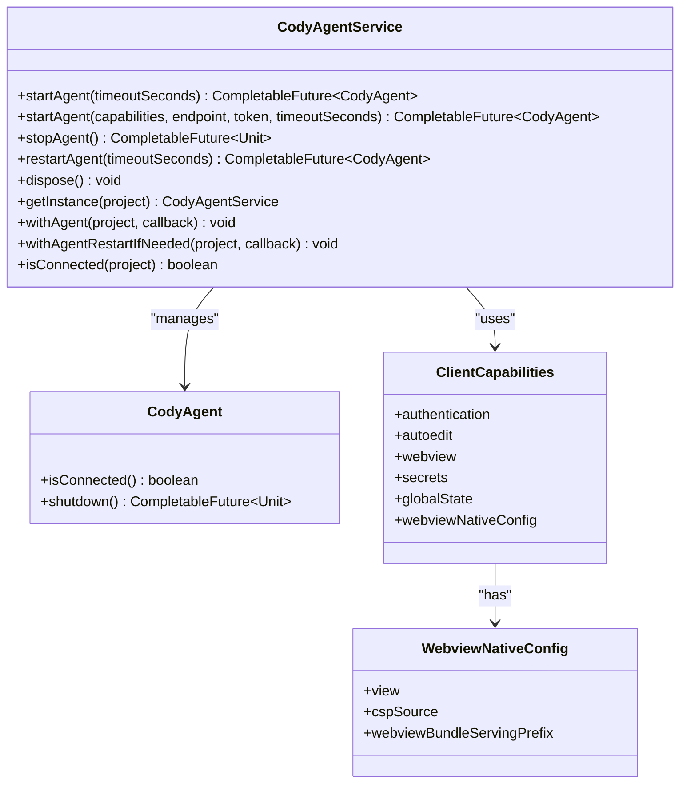
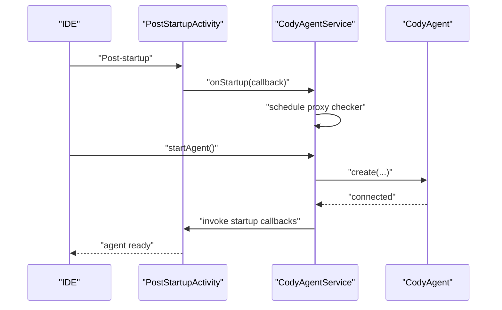
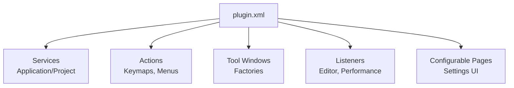
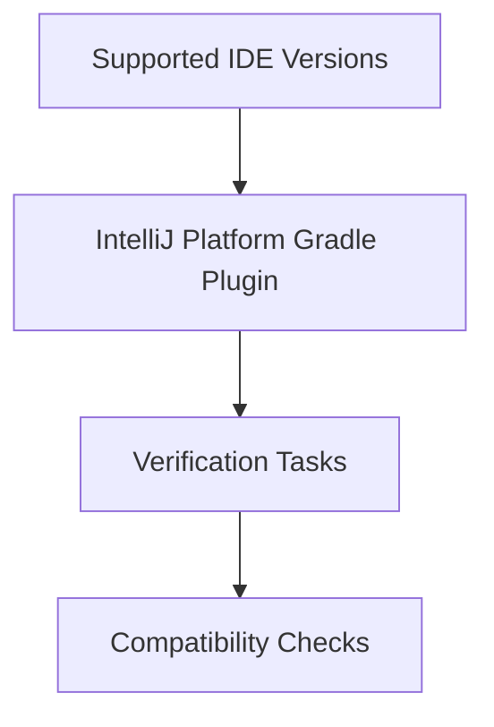
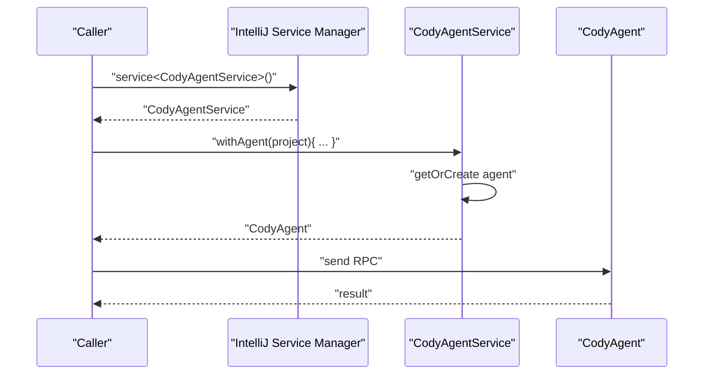
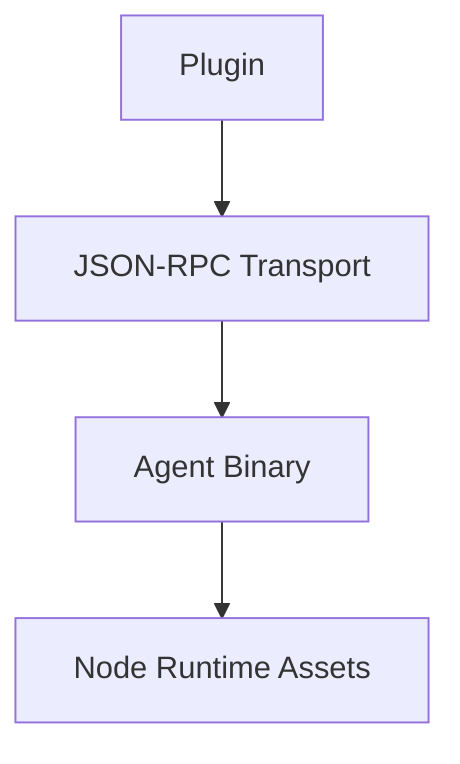
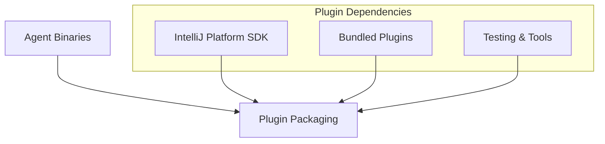

# Plugin Architecture

<cite>
**Referenced Files in This Document**
- [build.gradle.kts](file://jetbrains/build.gradle.kts)
- [settings.gradle.kts](file://jetbrains/settings.gradle.kts)
- [plugin.xml](file://jetbrains/src/main/resources/META-INF/plugin.xml)
- [CodyAgentService.kt](file://jetbrains/src/main/kotlin/com/sourcegraph/cody/agent/CodyAgentService.kt)
- [PostStartupActivity.kt](file://jetbrains/src/main/kotlin/com/sourcegraph/cody/initialization/PostStartupActivity.kt)
- [CodyToolWindowFactory.kt](file://jetbrains/src/main/kotlin/com/sourcegraph/cody/CodyToolWindowFactory.kt)
</cite>

## Table of Contents
1. [Introduction](#introduction)
2. [Project Structure](#project-structure)
3. [Core Components](#core-components)
4. [Architecture Overview](#architecture-overview)
5. [Detailed Component Analysis](#detailed-component-analysis)
6. [Dependency Analysis](#dependency-analysis)
7. [Performance Considerations](#performance-considerations)
8. [Troubleshooting Guide](#troubleshooting-guide)
9. [Conclusion](#conclusion)

## Introduction
This document explains the JetBrains plugin architecture for the Sourcegraph Cody product. It covers the plugin’s core structure, initialization patterns, service layer design, and the agent integration architecture centered around the CodyAgent, CodyAgentService, and CodyAgentClient components. It also documents lifecycle management, startup activities, service registration, multi-IDE compatibility, configuration via the XML plugin descriptor, agent communication protocols, process management, cross-platform considerations, dependency injection patterns, extension points, and modular design with component isolation and inter-service communication.

## Project Structure
The JetBrains plugin is implemented as a multi-module Gradle project with a dedicated jetbrains module. The build script defines platform targets, plugin metadata, dependencies, and tasks for building and packaging the plugin. The plugin descriptor declares services, actions, tool windows, listeners, and extension points.

**Diagram sources**
- [build.gradle.kts](file://jetbrains/build.gradle.kts)
- [settings.gradle.kts](file://jetbrains/settings.gradle.kts)
- [plugin.xml](file://jetbrains/src/main/resources/META-INF/plugin.xml)
- [CodyAgentService.kt](file://jetbrains/src/main/kotlin/com/sourcegraph/cody/agent/CodyAgentService.kt)
- [PostStartupActivity.kt](file://jetbrains/src/main/kotlin/com/sourcegraph/cody/initialization/PostStartupActivity.kt)
- [CodyToolWindowFactory.kt](file://jetbrains/src/main/kotlin/com/sourcegraph/cody/CodyToolWindowFactory.kt)

**Section sources**
- [build.gradle.kts](file://jetbrains/build.gradle.kts)
- [settings.gradle.kts](file://jetbrains/settings.gradle.kts)
- [plugin.xml](file://jetbrains/src/main/resources/META-INF/plugin.xml)

## Core Components
- Plugin descriptor and extension registry: Declares services, actions, tool windows, listeners, and extension points.
- Agent service facade: Manages agent lifecycle, connection, and dispatch of requests.
- Startup activity: Initializes agent-related behaviors after IDE startup.
- UI factories: Provide tool windows and views integrated with the IDE.

Key responsibilities:
- Service registration via the plugin descriptor enables dependency injection through IntelliJ Platform services.
- The agent service encapsulates process management, connection establishment, and error handling.
- Post-startup activity ensures agent readiness for opened files and initial sync.
- Tool window factory integrates the Cody UI into the IDE.

**Section sources**
- [plugin.xml](file://jetbrains/src/main/resources/META-INF/plugin.xml)
- [CodyAgentService.kt](file://jetbrains/src/main/kotlin/com/sourcegraph/cody/agent/CodyAgentService.kt)
- [PostStartupActivity.kt](file://jetbrains/src/main/kotlin/com/sourcegraph/cody/initialization/PostStartupActivity.kt)
- [CodyToolWindowFactory.kt](file://jetbrains/src/main/kotlin/com/sourcegraph/cody/CodyToolWindowFactory.kt)

## Architecture Overview
The plugin architecture follows IntelliJ Platform conventions:
- Services are registered in the plugin descriptor and retrieved via dependency injection.
- The agent service manages a long-running agent process and exposes a synchronous façade for callers.
- Extension points integrate actions, tool windows, and listeners.
- Lifecycle hooks trigger agent startup and UI initialization.

**Diagram sources**
- [plugin.xml](file://jetbrains/src/main/resources/META-INF/plugin.xml)
- [CodyAgentService.kt](file://jetbrains/src/main/kotlin/com/sourcegraph/cody/agent/CodyAgentService.kt)
- [PostStartupActivity.kt](file://jetbrains/src/main/kotlin/com/sourcegraph/cody/initialization/PostStartupActivity.kt)
- [CodyToolWindowFactory.kt](file://jetbrains/src/main/kotlin/com/sourcegraph/cody/CodyToolWindowFactory.kt)

## Detailed Component Analysis

### Agent Integration: CodyAgentService
CodyAgentService is a project-level service that:
- Manages agent creation, connection, and shutdown.
- Registers startup callbacks invoked when the agent becomes ready.
- Monitors proxy changes and restarts the agent when necessary.
- Provides convenience methods to access the agent safely, optionally restarting on failure.

**Diagram sources**
- [CodyAgentService.kt](file://jetbrains/src/main/kotlin/com/sourcegraph/cody/agent/CodyAgentService.kt)

**Section sources**
- [CodyAgentService.kt](file://jetbrains/src/main/kotlin/com/sourcegraph/cody/agent/CodyAgentService.kt)

### Agent Lifecycle and Startup Activities
The agent lifecycle is orchestrated by:
- A periodic proxy change checker to detect network configuration changes and trigger restarts.
- Startup callbacks registered during initialization to synchronize opened files and initialize agent-side state.
- A startup activity that runs after IDE startup to ensure readiness.

**Diagram sources**
- [PostStartupActivity.kt](file://jetbrains/src/main/kotlin/com/sourcegraph/cody/initialization/PostStartupActivity.kt)
- [CodyAgentService.kt](file://jetbrains/src/main/kotlin/com/sourcegraph/cody/agent/CodyAgentService.kt)

**Section sources**
- [PostStartupActivity.kt](file://jetbrains/src/main/kotlin/com/sourcegraph/cody/initialization/PostStartupActivity.kt)
- [CodyAgentService.kt](file://jetbrains/src/main/kotlin/com/sourcegraph/cody/agent/CodyAgentService.kt)

### Plugin Descriptor and Extension Points
The plugin descriptor registers:
- Application and project services.
- Actions and keymap extensions.
- Tool windows and UI providers.
- Listeners for editor and performance events.
- Configurable pages for settings.

**Diagram sources**
- [plugin.xml](file://jetbrains/src/main/resources/META-INF/plugin.xml)

**Section sources**
- [plugin.xml](file://jetbrains/src/main/resources/META-INF/plugin.xml)

### Multi-IDE Compatibility and Platform Abstraction
The build configuration:
- Defines supported IDE versions and platforms.
- Uses the IntelliJ Platform Gradle Plugin to target multiple IDE families and versions.
- Configures verification and compatibility checks across versions.

**Diagram sources**
- [build.gradle.kts](file://jetbrains/build.gradle.kts)

**Section sources**
- [build.gradle.kts](file://jetbrains/build.gradle.kts)

### Dependency Injection and Service Provider Interfaces
- Services are declared in the plugin descriptor and retrieved via the IntelliJ service manager.
- The agent service acts as a façade, exposing convenience methods to access the agent instance.
- Extension points integrate actions, tool windows, and listeners.

**Diagram sources**
- [plugin.xml](file://jetbrains/src/main/resources/META-INF/plugin.xml)
- [CodyAgentService.kt](file://jetbrains/src/main/kotlin/com/sourcegraph/cody/agent/CodyAgentService.kt)

**Section sources**
- [plugin.xml](file://jetbrains/src/main/resources/META-INF/plugin.xml)
- [CodyAgentService.kt](file://jetbrains/src/main/kotlin/com/sourcegraph/cody/agent/CodyAgentService.kt)

### Agent Communication Protocols and Cross-Platform Considerations
- The agent communicates via JSON-RPC over stdio/websockets depending on configuration.
- The build system packages platform-specific agent binaries and Node.js runtime assets.
- The agent service sets capabilities and native webview configuration to align with platform constraints.

**Diagram sources**
- [CodyAgentService.kt](file://jetbrains/src/main/kotlin/com/sourcegraph/cody/agent/CodyAgentService.kt)
- [build.gradle.kts](file://jetbrains/build.gradle.kts)

**Section sources**
- [CodyAgentService.kt](file://jetbrains/src/main/kotlin/com/sourcegraph/cody/agent/CodyAgentService.kt)
- [build.gradle.kts](file://jetbrains/build.gradle.kts)

## Dependency Analysis
The plugin’s dependencies include:
- IntelliJ Platform modules and SDKs.
- Bundled plugins for optional integrations (e.g., Git, JSON).
- Instrumentation and testing libraries.
- Protocol generation and Kotlin/JS tooling.

**Diagram sources**
- [build.gradle.kts](file://jetbrains/build.gradle.kts)

**Section sources**
- [build.gradle.kts](file://jetbrains/build.gradle.kts)

## Performance Considerations
- Agent lifecycle operations are executed on pooled threads to avoid blocking the UI thread.
- Startup callbacks are batched and invoked once the agent is connected.
- Periodic proxy checks run at a fixed interval to minimize overhead while ensuring responsiveness to network changes.

[No sources needed since this section provides general guidance]

## Troubleshooting Guide
Common scenarios and diagnostics:
- Connection timeouts: The agent service surfaces a timeout notification and marks the agent as errored.
- Agent failures: On exceptions, the service logs the error and optionally restarts the agent if configured.
- Proxy changes: Detected proxy changes trigger an automatic restart to re-establish connectivity.
- Graceful shutdown: The service attempts to shut down the agent and reset UI state before disposing.

**Section sources**
- [CodyAgentService.kt](file://jetbrains/src/main/kotlin/com/sourcegraph/cody/agent/CodyAgentService.kt)

## Conclusion
The JetBrains plugin architecture leverages IntelliJ Platform services and extension points to deliver a robust, multi-IDE compatible integration for Cody. The agent service encapsulates lifecycle management, error handling, and cross-platform concerns, while the plugin descriptor and startup activities ensure seamless initialization. The modular design promotes component isolation and clean inter-service communication, enabling maintainable growth across IDE versions and platforms.