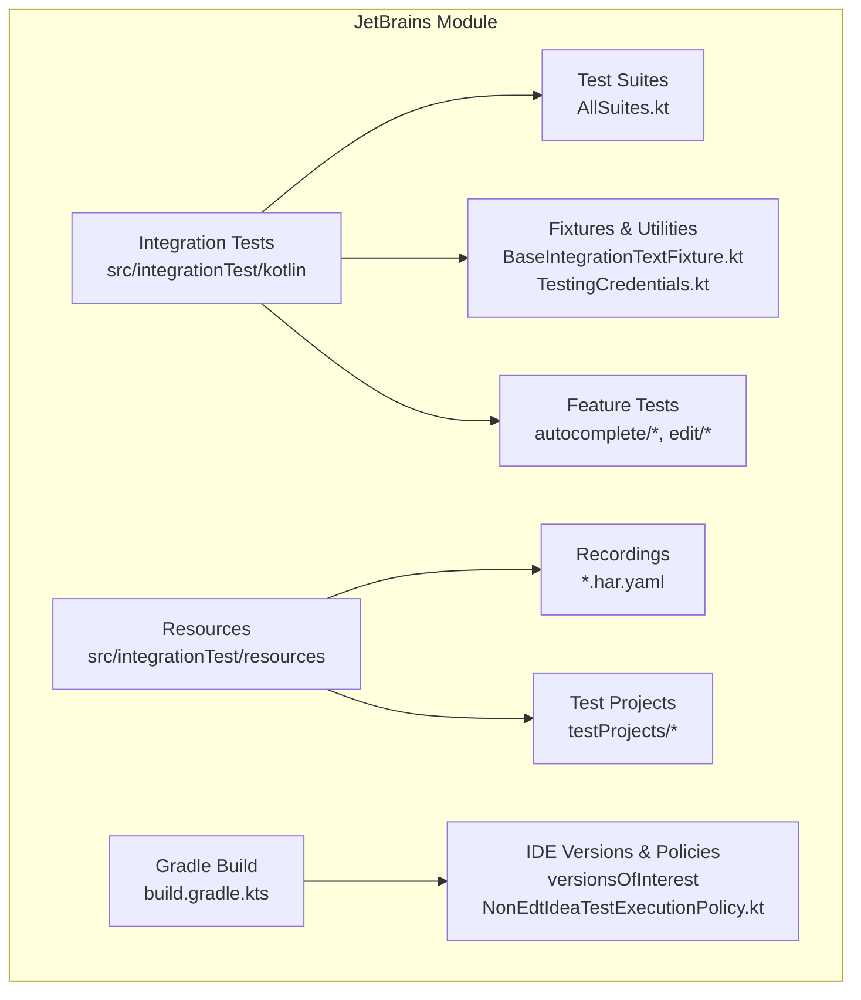
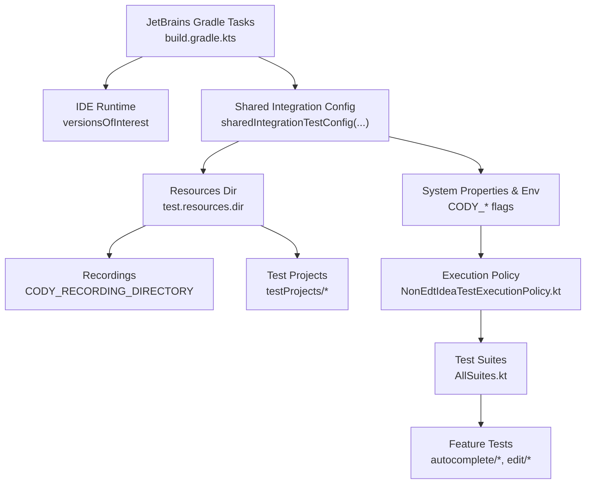
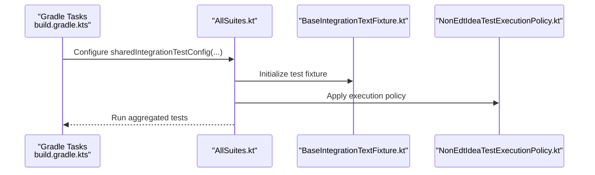
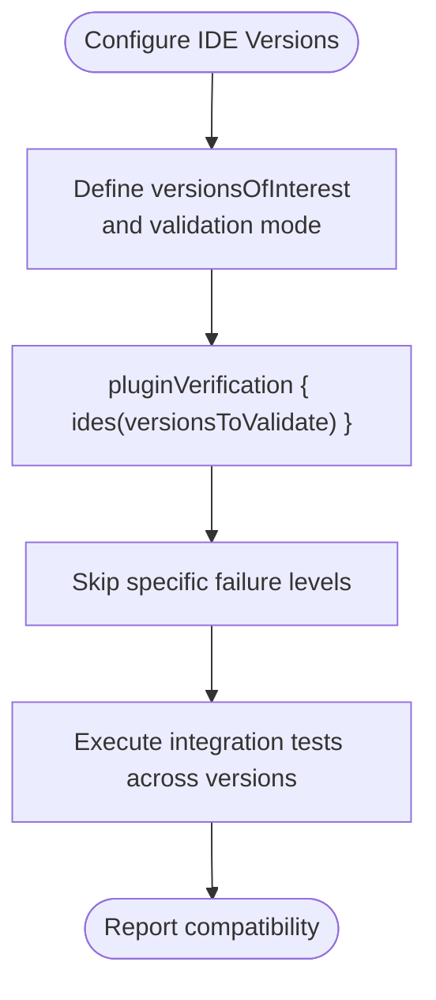
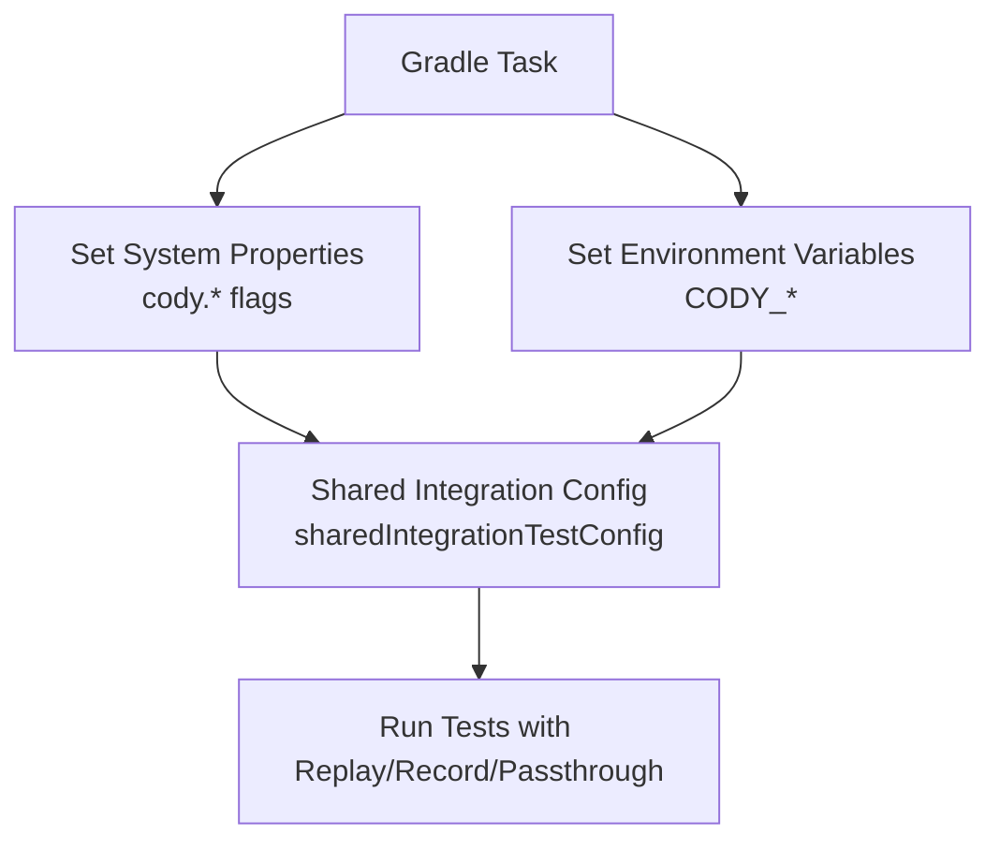
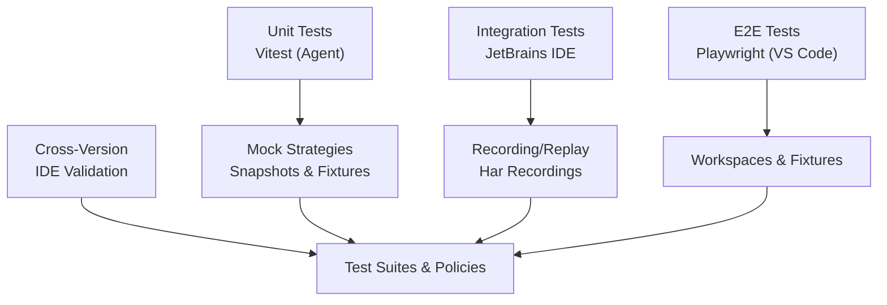
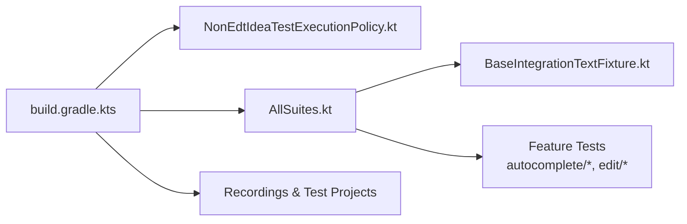

# Testing Framework

<cite>
**Referenced Files in This Document**
- [TESTING.md](file://jetbrains/TESTING.md)
- [build.gradle.kts](file://jetbrains/build.gradle.kts)
- [settings.gradle.kts](file://jetbrains/settings.gradle.kts)
- [AllSuites.kt](file://jetbrains/src/integrationTest/kotlin/com/sourcegraph/cody/AllSuites.kt)
- [NonEdtIdeaTestExecutionPolicy.kt](file://jetbrains/src/integrationTest/kotlin/com/sourcegraph/cody/NonEdtIdeaTestExecutionPolicy.kt)
- [BaseIntegrationTextFixture.kt](file://jetbrains/src/integrationTest/kotlin/com/sourcegraph/cody/util/BaseIntegrationTextFixture.kt)
- [TestingCredentials.kt](file://jetbrains/src/integrationTest/kotlin/com/sourcegraph/cody/util/TestingCredentials.kt)
- [AutocompleteCompletionTest.kt](file://jetbrains/src/integrationTest/kotlin/com/sourcegraph/cody/autocomplete/AutocompleteCompletionTest.kt)
- [AutocompleteEditTest.kt](file://jetbrains/src/integrationTest/kotlin/com/sourcegraph/cody/autocomplete/AutocompleteEditTest.kt)
- [BaseAutocompleteTest.kt](file://jetbrains/src/integrationTest/kotlin/com/sourcegraph/cody/autocomplete/BaseAutocompleteTest.kt)
- [DocumentCodeTest.kt](file://jetbrains/src/integrationTest/kotlin/com/sourcegraph/cody/edit/DocumentCodeTest.kt)
- [recordings/autocomplete_2136217965/recording.har.yaml](file://jetbrains/src/integrationTest/resources/recordings/autocomplete_2136217965/recording.har.yaml)
- [testProjects/autocompleteCompletion/src/main/kotlin/Foo.kt](file://jetbrains/src/integrationTest/resources/testProjects/autocompleteCompletion/src/main/kotlin/Foo.kt)
- [testProjects/documentCode/src/main/java/Foo.java](file://jetbrains/src/integrationTest/resources/testProjects/documentCode/src/main/java/Foo.java)
- [vitest.config.ts](file://agent/vitest.config.ts)
- [agent/__snapshots__/autocomplete.test.ts.snap](file://agent/src/__snapshots__/autocomplete.test.ts.snap)
- [agent/__snapshots__/autoedit.test.ts.snap](file://agent/src/__snapshots__/autoedit.test.ts.snap)
- [agent/__snapshots__/custom-commands.test.ts.snap](file://agent/src/__snapshots__/custom-commands.test.ts.snap)
- [agent/__tests__/document-code/src/example.test.ts](file://agent/src/__tests__/document-code/src/example.test.ts)
- [agent/src/autocomplete.test.ts](file://agent/src/autocomplete.test.ts)
- [agent/src/autoedit.test.ts](file://agent/src/autoedit.test.ts)
- [agent/src/custom-commands.test.ts](file://agent/src/custom-commands.test.ts)
- [agent/src/document-code.test.ts](file://agent/src/document-code.test.ts)
- [agent/src/edit.test.ts](file://agent/src/edit.test.ts)
- [agent/src/generate-unit-test.test.ts](file://agent/src/generate-unit-test.test.ts)
- [agent/src/index.test.ts](file://agent/src/index.test.ts)
- [agent/src/AgentAuthHandler.test.ts](file://agent/src/AgentAuthHandler.test.ts)
- [agent/src/AgentSecretStorage.test.ts](file://agent/src/AgentSecretStorage.test.ts)
- [agent/src/AgentTextDocument.test.ts](file://agent/src/AgentTextDocument.test.ts)
- [agent/src/AgentWorkspaceConfiguration.test.ts](file://agent/src/AgentWorkspaceConfiguration.test.ts)
- [agent/src/AgentWorkspaceDocuments.test.ts](file://agent/src/AgentWorkspaceDocuments.test.ts)
- [vscode/e2e/features/auth.test.ts](file://vscode/e2e/features/auth.test.ts)
- [vscode/e2e/utils/global.setup.ts](file://vscode/e2e/utils/global.setup.ts)
- [vscode/e2e/utils/global.teardown.ts](file://vscode/e2e/utils/global.teardown.ts)
- [vscode/e2e/utils/helpers.ts](file://vscode/e2e/utils/helpers.ts)
- [vscode/playwright.config.ts](file://vscode/playwright.config.ts)
- [vscode/playwright.v2.config.ts](file://vscode/playwright.v2.config.ts)
- [vscode/test/e2e/auth.test.ts](file://vscode/test/e2e/auth.test.ts)
- [vscode/test/e2e/common.ts](file://vscode/test/e2e/common.ts)
- [vscode/test/e2e/helpers.ts](file://vscode/test/e2e/helpers.ts)
- [vscode/test/fixtures/workspace/README.md](file://vscode/test/fixtures/workspace/README.md)
- [vscode/test/fixtures/workspace/src/example.ts](file://vscode/test/fixtures/workspace/src/example.ts)
- [vscode/test/fixtures/mock-server.ts](file://vscode/test/fixtures/mock-server.ts)
- [vscode/test/integration/main.ts](file://vscode/test/integration/main.ts)
- [vscode/test/integration/runner.ts](file://vscode/test/integration/runner.ts)
- [vscode/test/integration/helpers.ts](file://vscode/test/integration/helpers.ts)
- [vscode/test/integration/single-root/README.md](file://vscode/test/integration/single-root/README.md)
- [vscode/test/integration/multi-root/README.md](file://vscode/test/integration/multi-root/README.md)
- [vscode/test/integration/nested-workspaces/README.md](file://vscode/test/integration/nested-workspaces/README.md)
- [vscode/test/README.md](file://vscode/test/README.md)
- [TESTING.md](file://vscode/TESTING.md)
- [TESTING.md](file://TESTING.md)
</cite>

## Table of Contents
1. [Introduction](#introduction)
2. [Project Structure](#project-structure)
3. [Core Components](#core-components)
4. [Architecture Overview](#architecture-overview)
5. [Detailed Component Analysis](#detailed-component-analysis)
6. [Dependency Analysis](#dependency-analysis)
7. [Performance Considerations](#performance-considerations)
8. [Troubleshooting Guide](#troubleshooting-guide)
9. [Conclusion](#conclusion)
10. [Appendices](#appendices)

## Introduction
This document describes the JetBrains plugin testing framework across unit, integration, and end-to-end testing strategies. It explains how the test suites are organized, how fixtures and shared utilities are structured, and how integration tests simulate the IDE and interact with the agent. It also covers credential management for testing, test project structures, test data preparation, execution environments, mocking strategies, test isolation, continuous integration, cross-version compatibility testing, automated verification, debugging techniques, assertion strategies, performance testing, test data management, recording and replay mechanisms, and maintenance strategies.

## Project Structure
The JetBrains module organizes tests into:
- Integration tests under src/integrationTest/kotlin with suites, fixtures, and reusable utilities.
- Shared integration test resources under src/integrationTest/resources including recordings and test projects.
- Cross-version compatibility and IDE runtime configuration via Gradle tasks and properties.
- Additional testing assets and documentation under jetbrains/TESTING.md.

**Diagram sources**
- [build.gradle.kts:32-57](file://jetbrains/build.gradle.kts#L32-L57)
- [AllSuites.kt](file://jetbrains/src/integrationTest/kotlin/com/sourcegraph/cody/AllSuites.kt)
- [BaseIntegrationTextFixture.kt](file://jetbrains/src/integrationTest/kotlin/com/sourcegraph/cody/util/BaseIntegrationTextFixture.kt)
- [TestingCredentials.kt](file://jetbrains/src/integrationTest/kotlin/com/sourcegraph/cody/util/TestingCredentials.kt)
- [AutocompleteCompletionTest.kt](file://jetbrains/src/integrationTest/kotlin/com/sourcegraph/cody/autocomplete/AutocompleteCompletionTest.kt)
- [recordings/autocomplete_2136217965/recording.har.yaml](file://jetbrains/src/integrationTest/resources/recordings/autocomplete_2136217965/recording.har.yaml)
- [testProjects/autocompleteCompletion/src/main/kotlin/Foo.kt](file://jetbrains/src/integrationTest/resources/testProjects/autocompleteCompletion/src/main/kotlin/Foo.kt)

**Section sources**
- [build.gradle.kts:32-57](file://jetbrains/build.gradle.kts#L32-L57)
- [TESTING.md:1-800](file://jetbrains/TESTING.md#L1-L800)

## Core Components
- Test suites orchestration: A central suite aggregates all integration tests and runs them with shared configuration.
- Execution policy: A custom execution policy allows running tests outside the EDT in the IDE context.
- Fixtures and utilities: Base integration fixture provides common setup and teardown, while testing credentials supply controlled identities for tests.
- Feature-specific tests: Dedicated suites for autocomplete and editing behaviors.
- Resources: Recordings capture network interactions; test projects provide reproducible codebases for scenarios.

**Section sources**
- [AllSuites.kt](file://jetbrains/src/integrationTest/kotlin/com/sourcegraph/cody/AllSuites.kt)
- [NonEdtIdeaTestExecutionPolicy.kt](file://jetbrains/src/integrationTest/kotlin/com/sourcegraph/cody/NonEdtIdeaTestExecutionPolicy.kt)
- [BaseIntegrationTextFixture.kt](file://jetbrains/src/integrationTest/kotlin/com/sourcegraph/cody/util/BaseIntegrationTextFixture.kt)
- [TestingCredentials.kt](file://jetbrains/src/integrationTest/kotlin/com/sourcegraph/cody/util/TestingCredentials.kt)
- [AutocompleteCompletionTest.kt](file://jetbrains/src/integrationTest/kotlin/com/sourcegraph/cody/autocomplete/AutocompleteCompletionTest.kt)
- [AutocompleteEditTest.kt](file://jetbrains/src/integrationTest/kotlin/com/sourcegraph/cody/autocomplete/AutocompleteEditTest.kt)
- [DocumentCodeTest.kt](file://jetbrains/src/integrationTest/kotlin/com/sourcegraph/cody/edit/DocumentCodeTest.kt)

## Architecture Overview
The testing architecture integrates Gradle-based IDE runtime provisioning, shared integration test configuration, and resource-driven replay/record modes for deterministic behavior.

**Diagram sources**
- [build.gradle.kts:271-321](file://jetbrains/build.gradle.kts#L271-L321)
- [build.gradle.kts:117-121](file://jetbrains/build.gradle.kts#L117-L121)
- [NonEdtIdeaTestExecutionPolicy.kt](file://jetbrains/src/integrationTest/kotlin/com/sourcegraph/cody/NonEdtIdeaTestExecutionPolicy.kt)
- [AllSuites.kt](file://jetbrains/src/integrationTest/kotlin/com/sourcegraph/cody/AllSuites.kt)
- [recordings/autocomplete_2136217965/recording.har.yaml](file://jetbrains/src/integrationTest/resources/recordings/autocomplete_2136217965/recording.har.yaml)
- [testProjects/autocompleteCompletion/src/main/kotlin/Foo.kt](file://jetbrains/src/integrationTest/resources/testProjects/autocompleteCompletion/src/main/kotlin/Foo.kt)

## Detailed Component Analysis

### Integration Test Suite Orchestration
- Central suite aggregates all integration tests and runs them with shared configuration.
- Gradle tasks define three modes: replay, passthrough, and record, driven by environment variables and system properties.

**Diagram sources**
- [build.gradle.kts:271-321](file://jetbrains/build.gradle.kts#L271-L321)
- [AllSuites.kt](file://jetbrains/src/integrationTest/kotlin/com/sourcegraph/cody/AllSuites.kt)
- [BaseIntegrationTextFixture.kt](file://jetbrains/src/integrationTest/kotlin/com/sourcegraph/cody/util/BaseIntegrationTextFixture.kt)
- [NonEdtIdeaTestExecutionPolicy.kt](file://jetbrains/src/integrationTest/kotlin/com/sourcegraph/cody/NonEdtIdeaTestExecutionPolicy.kt)

**Section sources**
- [AllSuites.kt](file://jetbrains/src/integrationTest/kotlin/com/sourcegraph/cody/AllSuites.kt)
- [build.gradle.kts:589-606](file://jetbrains/build.gradle.kts#L589-L606)

### IDE Simulation and Cross-Version Compatibility
- IDE versions of interest are declared and validated; verification policies skip certain failure categories.
- The IDE runtime is provisioned via Gradle tasks; tests run against multiple IDE versions.

**Diagram sources**
- [build.gradle.kts:32-57](file://jetbrains/build.gradle.kts#L32-L57)
- [build.gradle.kts:117-121](file://jetbrains/build.gradle.kts#L117-L121)

**Section sources**
- [build.gradle.kts:32-57](file://jetbrains/build.gradle.kts#L32-L57)
- [build.gradle.kts:117-121](file://jetbrains/build.gradle.kts#L117-L121)

### Test Execution Environment and Mock Strategies
- System properties and environment variables configure agent tracing, recording modes, telemetry, and testing flags.
- Recording/replay mode is controlled via environment variables and system properties; test resources directory is injected for deterministic fixtures.

**Diagram sources**
- [build.gradle.kts:271-321](file://jetbrains/build.gradle.kts#L271-L321)

**Section sources**
- [build.gradle.kts:271-321](file://jetbrains/build.gradle.kts#L271-L321)

### Credential Management for Testing
- Testing credentials utility supplies controlled identities for tests, enabling repeatable authentication flows without real tokens.

**Section sources**
- [TestingCredentials.kt](file://jetbrains/src/integrationTest/kotlin/com/sourcegraph/cody/util/TestingCredentials.kt)

### Test Project Structures and Test Data Preparation
- Test projects under resources provide minimal, reproducible codebases for scenarios like autocomplete and document code.
- Example test projects include Kotlin and Java files to exercise language-specific behaviors.

**Section sources**
- [testProjects/autocompleteCompletion/src/main/kotlin/Foo.kt](file://jetbrains/src/integrationTest/resources/testProjects/autocompleteCompletion/src/main/kotlin/Foo.kt)
- [testProjects/documentCode/src/main/java/Foo.java](file://jetbrains/src/integrationTest/resources/testProjects/documentCode/src/main/java/Foo.java)

### Test Data Management and Recording/Replay Mechanisms
- Recordings capture HTTP interactions and are stored under resources/recordings; tests can replay these interactions deterministically.
- Recording mode is configured via environment variables and system properties.

**Section sources**
- [recordings/autocomplete_2136217965/recording.har.yaml](file://jetbrains/src/integrationTest/resources/recordings/autocomplete_2136217965/recording.har.yaml)
- [build.gradle.kts:309-317](file://jetbrains/build.gradle.kts#L309-L317)

### Continuous Integration and Automated Verification
- Gradle tasks integrate with IDE verification and run integration tests as part of the check lifecycle.
- CI-friendly build cache configuration is enabled conditionally.

**Section sources**
- [build.gradle.kts](file://jetbrains/build.gradle.kts#L624)
- [settings.gradle.kts:5-8](file://jetbrains/settings.gradle.kts#L5-L8)

### Test Isolation Patterns
- Shared integration fixture ensures consistent setup and teardown across tests.
- Execution policy allows tests to run outside the EDT, reducing UI-thread contention.

**Section sources**
- [BaseIntegrationTextFixture.kt](file://jetbrains/src/integrationTest/kotlin/com/sourcegraph/cody/util/BaseIntegrationTextFixture.kt)
- [NonEdtIdeaTestExecutionPolicy.kt](file://jetbrains/src/integrationTest/kotlin/com/sourcegraph/cody/NonEdtIdeaTestExecutionPolicy.kt)

### Unit Testing Strategies (Agent and VS Code)
- Agent tests use Vitest with snapshot assertions and dedicated test fixtures.
- VS Code tests leverage Playwright for end-to-end flows with global setup/teardown and helpers.

**Section sources**
- [vitest.config.ts](file://agent/vitest.config.ts)
- [agent/src/autocomplete.test.ts](file://agent/src/autocomplete.test.ts)
- [agent/src/autoedit.test.ts](file://agent/src/autoedit.test.ts)
- [agent/src/custom-commands.test.ts](file://agent/src/custom-commands.test.ts)
- [agent/src/document-code.test.ts](file://agent/src/document-code.test.ts)
- [agent/src/edit.test.ts](file://agent/src/edit.test.ts)
- [agent/src/generate-unit-test.test.ts](file://agent/src/generate-unit-test.test.ts)
- [agent/src/index.test.ts](file://agent/src/index.test.ts)
- [agent/__snapshots__/autocomplete.test.ts.snap](file://agent/src/__snapshots__/autocomplete.test.ts.snap)
- [agent/__snapshots__/autoedit.test.ts.snap](file://agent/src/__snapshots__/autoedit.test.ts.snap)
- [agent/__snapshots__/custom-commands.test.ts.snap](file://agent/src/__snapshots__/custom-commands.test.ts.snap)
- [agent/__tests__/document-code/src/example.test.ts](file://agent/src/__tests__/document-code/src/example.test.ts)
- [vscode/playwright.config.ts](file://vscode/playwright.config.ts)
- [vscode/playwright.v2.config.ts](file://vscode/playwright.v2.config.ts)
- [vscode/e2e/utils/global.setup.ts](file://vscode/e2e/utils/global.setup.ts)
- [vscode/e2e/utils/global.teardown.ts](file://vscode/e2e/utils/global.teardown.ts)
- [vscode/e2e/utils/helpers.ts](file://vscode/e2e/utils/helpers.ts)
- [vscode/test/e2e/auth.test.ts](file://vscode/test/e2e/auth.test.ts)
- [vscode/test/e2e/common.ts](file://vscode/test/e2e/common.ts)
- [vscode/test/e2e/helpers.ts](file://vscode/test/e2e/helpers.ts)

### End-to-End Testing Strategies (VS Code)
- E2E tests use Playwright with explicit setup/teardown and helpers; fixtures provide workspace scaffolding.
- Integration tests cover single-root, multi-root, and nested workspace scenarios.

**Section sources**
- [vscode/test/README.md](file://vscode/test/README.md)
- [vscode/test/integration/main.ts](file://vscode/test/integration/main.ts)
- [vscode/test/integration/runner.ts](file://vscode/test/integration/runner.ts)
- [vscode/test/integration/helpers.ts](file://vscode/test/integration/helpers.ts)
- [vscode/test/integration/single-root/README.md](file://vscode/test/integration/single-root/README.md)
- [vscode/test/integration/multi-root/README.md](file://vscode/test/integration/multi-root/README.md)
- [vscode/test/integration/nested-workspaces/README.md](file://vscode/test/integration/nested-workspaces/README.md)
- [vscode/test/fixtures/workspace/README.md](file://vscode/test/fixtures/workspace/README.md)
- [vscode/test/fixtures/workspace/src/example.ts](file://vscode/test/fixtures/workspace/src/example.ts)
- [vscode/test/fixtures/mock-server.ts](file://vscode/test/fixtures/mock-server.ts)

### Conceptual Overview
The testing framework balances deterministic replay with realistic agent interactions, while ensuring cross-version IDE compatibility and robust end-to-end coverage.

[No sources needed since this diagram shows conceptual workflow, not actual code structure]

## Dependency Analysis
The integration test configuration depends on Gradle tasks, IDE verification, and shared utilities. Execution policy and fixtures mediate test isolation and environment setup.

**Diagram sources**
- [build.gradle.kts:271-321](file://jetbrains/build.gradle.kts#L271-L321)
- [NonEdtIdeaTestExecutionPolicy.kt](file://jetbrains/src/integrationTest/kotlin/com/sourcegraph/cody/NonEdtIdeaTestExecutionPolicy.kt)
- [AllSuites.kt](file://jetbrains/src/integrationTest/kotlin/com/sourcegraph/cody/AllSuites.kt)
- [BaseIntegrationTextFixture.kt](file://jetbrains/src/integrationTest/kotlin/com/sourcegraph/cody/util/BaseIntegrationTextFixture.kt)

**Section sources**
- [build.gradle.kts:271-321](file://jetbrains/build.gradle.kts#L271-L321)
- [NonEdtIdeaTestExecutionPolicy.kt](file://jetbrains/src/integrationTest/kotlin/com/sourcegraph/cody/NonEdtIdeaTestExecutionPolicy.kt)
- [AllSuites.kt](file://jetbrains/src/integrationTest/kotlin/com/sourcegraph/cody/AllSuites.kt)
- [BaseIntegrationTextFixture.kt](file://jetbrains/src/integrationTest/kotlin/com/sourcegraph/cody/util/BaseIntegrationTextFixture.kt)

## Performance Considerations
- Use replay mode to avoid network latency and variability in deterministic runs.
- Limit test scope to targeted feature areas and leverage shared fixtures to reduce setup overhead.
- Configure IDE versions strategically to balance coverage and execution time.

[No sources needed since this section provides general guidance]

## Troubleshooting Guide
- If tests fail due to IDE threading, ensure the custom execution policy is applied.
- Validate system properties and environment variables for recording/replay and telemetry.
- Inspect agent tracing logs and test project content to isolate failures.

**Section sources**
- [NonEdtIdeaTestExecutionPolicy.kt](file://jetbrains/src/integrationTest/kotlin/com/sourcegraph/cody/NonEdtIdeaTestExecutionPolicy.kt)
- [build.gradle.kts:271-321](file://jetbrains/build.gradle.kts#L271-L321)
- [testProjects/autocompleteCompletion/src/main/kotlin/Foo.kt](file://jetbrains/src/integrationTest/resources/testProjects/autocompleteCompletion/src/main/kotlin/Foo.kt)

## Conclusion
The JetBrains plugin testing framework combines Gradle-driven IDE provisioning, shared integration fixtures, and resource-driven recording/replay to deliver reliable, cross-version compatible tests. Unit and end-to-end tests complement integration tests to ensure correctness across agent interactions, IDE behaviors, and user workflows.

[No sources needed since this section summarizes without analyzing specific files]

## Appendices

### Test Debugging Techniques
- Enable verbose logging and agent tracing via system properties.
- Use snapshots and fixtures to reproduce failures locally.
- Leverage IDE run tasks and breakpoints within the integration test environment.

**Section sources**
- [build.gradle.kts:467-477](file://jetbrains/build.gradle.kts#L467-L477)
- [agent/vitest.config.ts](file://agent/vitest.config.ts)

### Assertion Strategies
- Snapshot-based assertions for agent behaviors.
- Deterministic assertions for IDE interactions using recorded fixtures.

**Section sources**
- [agent/__snapshots__/autocomplete.test.ts.snap](file://agent/src/__snapshots__/autocomplete.test.ts.snap)
- [agent/__snapshots__/autoedit.test.ts.snap](file://agent/src/__snapshots__/autoedit.test.ts.snap)
- [agent/__snapshots__/custom-commands.test.ts.snap](file://agent/src/__snapshots__/custom-commands.test.ts.snap)

### Test Maintenance Strategies
- Keep test projects minimal and versioned alongside tests.
- Regularly update recordings and adjust test expectations as APIs evolve.
- Maintain clear separation between unit, integration, and E2E tests.

[No sources needed since this section provides general guidance]