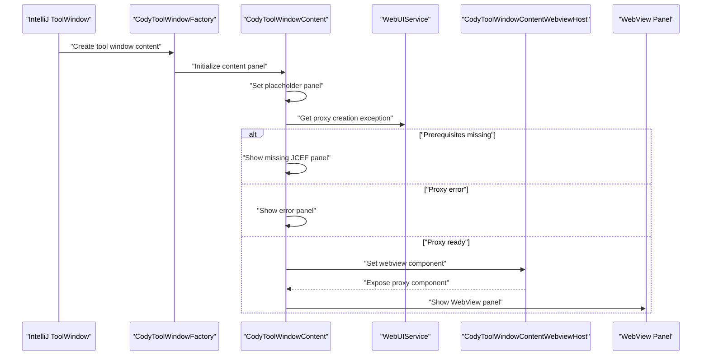
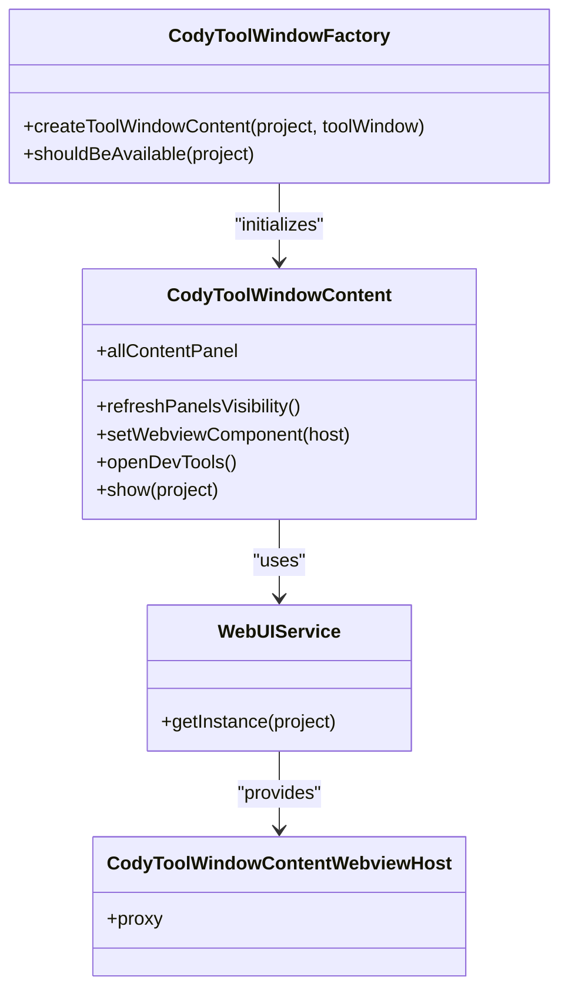
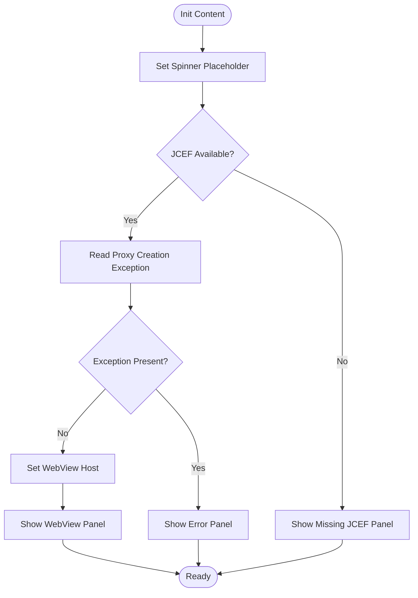
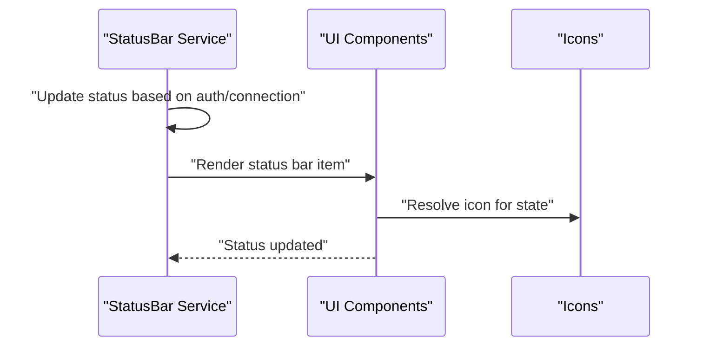
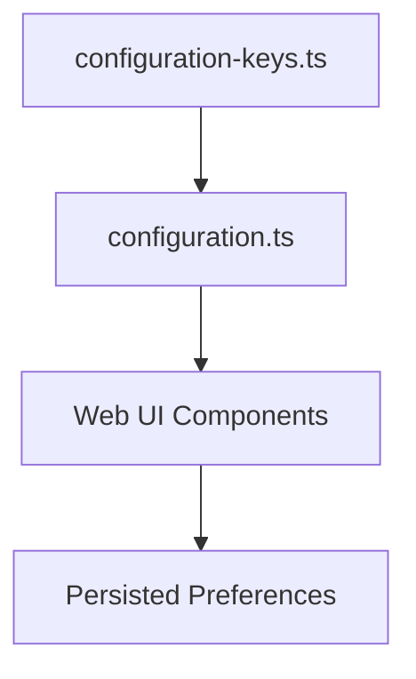
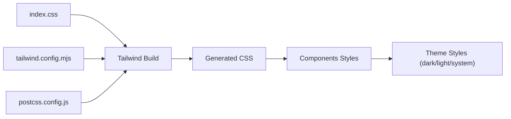
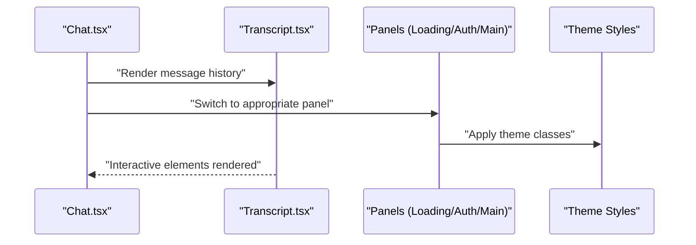
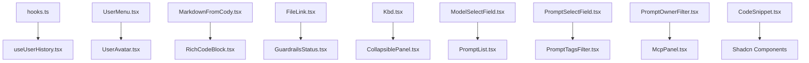
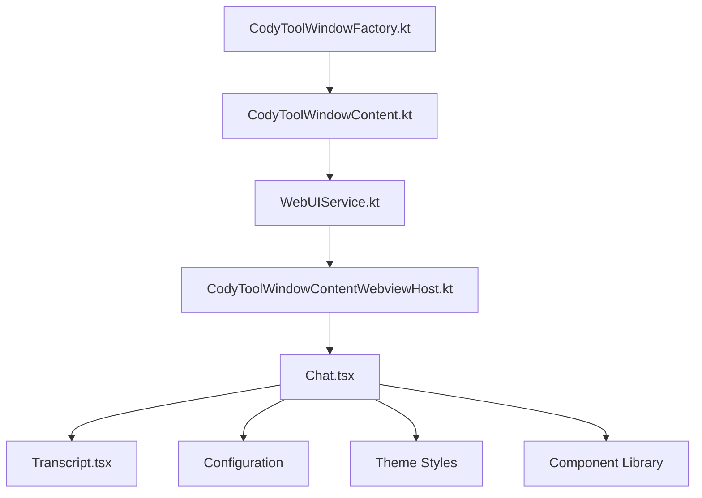

# UI Components & Extensions

<cite>
**Referenced Files in This Document**
- [CodyToolWindowFactory.kt](file://jetbrains/src/main/kotlin/com/sourcegraph/cody/CodyToolWindowFactory.kt)
- [CodyToolWindowContent.kt](file://jetbrains/src/main/kotlin/com/sourcegraph/cody/CodyToolWindowContent.kt)
- [CodyActionGroup.kt](file://jetbrains/src/main/kotlin/com/sourcegraph/cody/CodyActionGroup.kt)
- [CodyToolWindowContentWebviewHost.kt](file://jetbrains/src/main/kotlin/com/sourcegraph/cody/ui/web/CodyToolWindowContentWebviewHost.kt)
- [WebUIService.kt](file://jetbrains/src/main/kotlin/com/sourcegraph/cody/ui/web/WebUIService.kt)
- [Icons.kt](file://jetbrains/src/main/resources/com/sourcegraph/Icons.kt)
- [StatusBar.kt](file://vscode/src/services/StatusBar.ts)
- [Chat.tsx](file://vscode/src/webviews/chat/Chat.tsx)
- [Transcript.tsx](file://vscode/src/webviews/chat/Transcript.tsx)
- [index.css](file://vscode/src/webviews/index.css)
- [tailwind.config.mjs](file://vscode/src/webviews/tailwind.config.mjs)
- [App.module.css](file://vscode/src/webviews/App.module.css)
- [LoadingPage.tsx](file://vscode/src/webviews/LoadingPage.tsx)
- [AuthPage.tsx](file://vscode/src/webviews/AuthPage.tsx)
- [CodyPanel.tsx](file://vscode/src/webviews/CodyPanel.tsx)
- [configuration.ts](file://vscode/src/configuration.ts)
- [configuration-keys.ts](file://vscode/src/configuration-keys.ts)
- [extension.web.ts](file://vscode/src/extension.web.ts)
- [extension.common.ts](file://vscode/src/extension.common.ts)
- [extension-client.ts](file://vscode/src/extension-client.ts)
- [extension-api.ts](file://vscode/src/extension-api.ts)
- [index.tsx](file://vscode/src/webviews/index.tsx)
- [vite.config.ts](file://vscode/src/webviews/vite.config.mts)
- [postcss.config.js](file://vscode/src/webviews/postcss.config.js)
- [globals.d.ts](file://vscode/src/webviews/globals.d.ts)
- [svg.d.ts](file://vscode/src/webviews/svg.d.ts)
- [index.html](file://vscode/src/webviews/index.html)
- [AppWrapper.tsx](file://vscode/src/webviews/AppWrapper.tsx)
- [AppWrapperForTest.tsx](file://vscode/src/webviews/AppWrapperForTest.tsx)
- [testSetup.ts](file://vscode/src/webviews/testSetup.ts)
- [storybook/main.ts](file://vscode/.storybook/main.ts)
- [storybook/preview.tsx](file://vscode/.storybook/preview.tsx)
- [themes/dark.css](file://vscode/src/webviews/themes/dark.css)
- [themes/light.css](file://vscode/src/webviews/themes/light.css)
- [themes/system.css](file://vscode/src/webviews/themes/system.css)
- [components/hooks.ts](file://vscode/src/webviews/components/hooks.ts)
- [components/useUserHistory.tsx](file://vscode/src/webviews/components/useUserHistory.tsx)
- [components/UserMenu.tsx](file://vscode/src/webviews/components/UserMenu.tsx)
- [components/UserAvatar.tsx](file://vscode/src/webviews/components/UserAvatar.tsx)
- [components/MarkdownFromCody.tsx](file://vscode/src/webviews/components/MarkdownFromCody.tsx)
- [components/RichCodeBlock.tsx](file://vscode/src/webviews/components/RichCodeBlock.tsx)
- [components/FileLink.tsx](file://vscode/src/webviews/components/FileLink.tsx)
- [components/GuardrailsStatus.tsx](file://vscode/src/webviews/components/GuardrailsStatus.tsx)
- [components/Kbd.tsx](file://vscode/src/webviews/components/Kbd.tsx)
- [components/CollapsiblePanel.tsx](file://vscode/src/webviews/components/CollapsiblePanel.tsx)
- [components/modelSelectField/ModelSelectField.tsx](file://vscode/src/webviews/components/modelSelectField/ModelSelectField.tsx)
- [components/promptList/PromptList.tsx](file://vscode/src/webviews/components/promptList/PromptList.tsx)
- [components/promptSelectField/PromptSelectField.tsx](file://vscode/src/webviews/components/promptSelectField/PromptSelectField.tsx)
- [components/promptTagsFilter/PromptTagsFilter.tsx](file://vscode/src/webviews/components/promptTagsFilter/PromptTagsFilter.tsx)
- [components/promptOwnerFilter/PromptOwnerFilter.tsx](file://vscode/src/webviews/components/promptOwnerFilter/PromptOwnerFilter.tsx)
- [components/mcp/McpPanel.tsx](file://vscode/src/webviews/components/mcp/McpPanel.tsx)
- [components/codeSnippet/CodeSnippet.tsx](file://vscode/src/webviews/components/codeSnippet/CodeSnippet.tsx)
- [components/shadcn/Button.tsx](file://vscode/src/webviews/components/shadcn/Button.tsx)
- [components/shadcn/Input.tsx](file://vscode/src/webviews/components/shadcn/Input.tsx)
- [components/shadcn/Select.tsx](file://vscode/src/webviews/components/shadcn/Select.tsx)
- [components/shadcn/Textarea.tsx](file://vscode/src/webviews/components/shadcn/Textarea.tsx)
- [components/shadcn/Dialog.tsx](file://vscode/src/webviews/components/shadcn/Dialog.tsx)
- [components/shadcn/Tooltip.tsx](file://vscode/src/webviews/components/shadcn/Tooltip.tsx)
- [components/shadcn/Card.tsx](file://vscode/src/webviews/components/shadcn/Card.tsx)
- [components/shadcn/ScrollArea.tsx](file://vscode/src/webviews/components/shadcn/ScrollArea.tsx)
- [components/shadcn/Tabs.tsx](file://vscode/src/webviews/components/shadcn/Tabs.tsx)
- [components/shadcn/Label.tsx](file://vscode/src/webviews/components/shadcn/Label.tsx)
- [components/shadcn/Checkbox.tsx](file://vscode/src/webviews/components/shadcn/Checkbox.tsx)
- [components/shadcn/NavigationMenu.tsx](file://vscode/src/webviews/components/shadcn/NavigationMenu.tsx)
- [components/shadcn/Popover.tsx](file://vscode/src/webviews/components/shadcn/Popover.tsx)
- [components/shadcn/Alert.tsx](file://vscode/src/webviews/components/shadcn/Alert.tsx)
- [components/shadcn/Badge.tsx](file://vscode/src/webviews/components/shadcn/Badge.tsx)
- [components/shadcn/AspectRatio.tsx](file://vscode/src/webviews/components/shadcn/AspectRatio.tsx)
- [components/shadcn/Calendar.tsx](file://vscode/src/webviews/components/shadcn/Calendar.tsx)
- [components/shadcn/Command.tsx](file://vscode/src/webviews/components/shadcn/Command.tsx)
- [components/shadcn/ContextMenu.tsx](file://vscode/src/webviews/components/shadcn/ContextMenu.tsx)
- [components/shadcn/DataTable.tsx](file://vscode/src/webviews/components/shadcn/DataTable.tsx)
- [components/shadcn/DateField.tsx](file://vscode/src/webviews/components/shadcn/DateField.tsx)
- [components/shadcn/DatePicker.tsx](file://vscode/src/webviews/components/shadcn/DatePicker.tsx)
- [components/shadcn/Details.tsx](file://vscode/src/webviews/components/shadcn/Details.tsx)
- [components/shadcn/DropdownMenu.tsx](file://vscode/src/webviews/components/shadcn/DropdownMenu.tsx)
- [components/shadcn/Empty.tsx](file://vside/components/shadcn/Empty.tsx)
- [components/shadcn/FormField.tsx](file://vscode/src/webviews/components/shadcn/FormField.tsx)
- [components/shadcn/Form.tsx](file://vscode/src/webviews/components/shadcn/Form.tsx)
- [components/shadcn/HoverCard.tsx](file://vscode/src/webviews/components/shadcn/HoverCard.tsx)
- [components/shadcn/Image.tsx](file://vscode/src/webviews/components/shadcn/Image.tsx)
- [components/shadcn/KeyField.tsx](file://vscode/src/webviews/components/shadcn/KeyField.tsx)
- [components/shadcn/List.tsx](file://vscode/src/webviews/components/shadcn/List.tsx)
- [components/shadcn/Loader.tsx](file://vscode/src/webviews/components/shadcn/Loader.tsx)
- [components/shadcn/Matrix.tsx](file://vscode/src/webviews/components/shadcn/Matrix.tsx)
- [components/shadcn/NumberField.tsx](file://vscode/src/webviews/components/shadcn/NumberField.tsx)
- [components/shadcn/Outlet.tsx](file://vscode/src/webviews/components/shadcn/Outlet.tsx)
- [components/shadcn/Progress.tsx](file://vscode/src/webviews/components/shadcn/Progress.tsx)
- [components/shadcn/RadioGroup.tsx](file://vscode/src/webviews/components/shadcn/RadioGroup.tsx)
- [components/shadcn/RangeField.tsx](file://vscode/src/webviews/components/shadcn/RangeField.tsx)
- [components/shadcn/ResizablePanelGroup.tsx](file://vscode/src/webviews/components/shadcn/ResizablePanelGroup.tsx)
- [components/shadcn/Resizer.tsx](file://vscode/src/webviews/components/shadcn/Resizer.tsx)
- [components/shadcn/Root.tsx](file://vscode/src/webviews/components/shadcn/Root.tsx)
- [components/shadcn/Separator.tsx](file://vscode/src/webviews/components/shadcn/Separator.tsx)
- [components/shadcn/Sheet.tsx](file://vscode/src/webviews/components/shadcn/Sheet.tsx)
- [components/shadcn/Slider.tsx](file://vscode/src/webviews/components/shadcn/Slider.tsx)
- [components/shadcn/Spinner.tsx](file://vscode/src/webviews/components/shadcn/Spinner.tsx)
- [components/shadcn/Table.tsx](file://vscode/src/webviews/components/shadcn/Table.tsx)
- [components/shadcn/TabsContent.tsx](file://vscode/src/webviews/components/shadcn/TabsContent.tsx)
- [components/shadcn/TabsList.tsx](file://vscode/src/webviews/components/shadcn/TabsList.tsx)
- [components/shadcn/TabsTrigger.tsx](file://vscode/src/webviews/components/shadcn/TabsTrigger.tsx)
- [components/shadcn/TextArea.tsx](file://vscode/src/webviews/components/shadcn/TextArea.tsx)
- [components/shadcn/Toast.tsx](file://vscode/src/webviews/components/shadcn/Toast.tsx)
- [components/shadcn/Toaster.tsx](file://vscode/src/webviews/components/shadcn/Toaster.tsx)
- [components/shadcn/TooltipTrigger.tsx](file://vscode/src/webviews/components/shadcn/TooltipTrigger.tsx)
- [components/shadcn/Tree.tsx](file://vscode/src/webviews/components/shadcn/Tree.tsx)
- [components/shadcn/UnderlineNav.tsx](file://vscode/src/webviews/components/shadcn/UnderlineNav.tsx)
- [components/shadcn/VStack.tsx](file://vscode/src/webviews/components/shadcn/VStack.tsx)
- [components/shadcn/Watermark.tsx](file://vscode/src/webviews/components/shadcn/Watermark.tsx)
- [components/shadcn/YStack.tsx](file://vscode/src/webviews/components/shadcn/YStack.tsx)
- [components/shadcn/ZStack.tsx](file://vscode/src/webviews/components/shadcn/ZStack.tsx)
- [components/shadcn/Zoom.tsx](file://vscode/src/webviews/components/shadcn/Zoom.tsx)
</cite>

## Table of Contents
1. [Introduction](#introduction)
2. [Project Structure](#project-structure)
3. [Core Components](#core-components)
4. [Architecture Overview](#architecture-overview)
5. [Detailed Component Analysis](#detailed-component-analysis)
6. [Dependency Analysis](#dependency-analysis)
7. [Performance Considerations](#performance-considerations)
8. [Troubleshooting Guide](#troubleshooting-guide)
9. [Conclusion](#conclusion)
10. [Appendices](#appendices)

## Introduction
This document describes the JetBrains plugin UI components and extensions, focusing on the IntelliJ-based tool window, web view integration, theme management, and widget implementations. It also covers the web-based chat interface, WebView rendering, and JavaScript integration patterns present in the broader ecosystem, along with status bar widgets, icon management, and UI state handling. The document explains sidebar integration, panel management, and layout adaptation across IDE variants, as well as settings pages, preference management, and configuration UI components. Accessibility, internationalization, and cross-platform UI consistency are addressed alongside UI event handling, component lifecycle management, and performance optimization for UI rendering.

## Project Structure
The JetBrains plugin UI is primarily implemented in Kotlin under the jetbrains module, with a tool window factory and content service managing the UI container. The web-based chat and related UI components are implemented in TypeScript/React under the vscode module and are integrated via a WebView proxy managed by the JetBrains plugin.

```mermaid
graph TB
subgraph "JetBrains Plugin"
A["CodyToolWindowFactory.kt"]
B["CodyToolWindowContent.kt"]
C["CodyToolWindowContentWebviewHost.kt"]
D["WebUIService.kt"]
E["Icons.kt"]
F["CodyActionGroup.kt"]
end
subgraph "VSCode WebViews"
G["Chat.tsx"]
H["Transcript.tsx"]
I["index.css"]
J["tailwind.config.mjs"]
K["App.module.css"]
L["LoadingPage.tsx"]
M["AuthPage.tsx"]
N["CodyPanel.tsx"]
O["configuration.ts"]
P["configuration-keys.ts"]
Q["extension.web.ts"]
R["extension.common.ts"]
S["extension-client.ts"]
T["extension-api.ts"]
U["index.tsx"]
V["vite.config.mts"]
W["postcss.config.js"]
X["globals.d.ts"]
Y["svg.d.ts"]
Z["index.html"]
AA["AppWrapper.tsx"]
AB["AppWrapperForTest.tsx"]
AC["testSetup.ts"]
AD["storybook/main.ts"]
AE["storybook/preview.tsx"]
AF["themes/dark.css"]
AG["themes/light.css"]
AH["themes/system.css"]
AI["components/*"]
end
A --> B
B --> C
C --> D
D --> G
G --> H
G --> I
G --> J
G --> K
G --> L
G --> M
G --> N
G --> O
G --> P
G --> Q
G --> R
G --> S
G --> T
G --> U
G --> V
G --> W
G --> X
G --> Y
G --> Z
G --> AA
G --> AB
G --> AC
G --> AD
G --> AE
G --> AF
G --> AG
G --> AH
G --> AI
```



**Diagram sources**
- [CodyToolWindowFactory.kt:1-42](file://jetbrains/src/main/kotlin/com/sourcegraph/cody/CodyToolWindowFactory.kt#L1-L42)
- [CodyToolWindowContent.kt:1-97](file://jetbrains/src/main/kotlin/com/sourcegraph/cody/CodyToolWindowContent.kt#L1-L97)
- [CodyToolWindowContentWebviewHost.kt](file://jetbrains/src/main/kotlin/com/sourcegraph/cody/ui/web/CodyToolWindowContentWebviewHost.kt)
- [WebUIService.kt](file://jetbrains/src/main/kotlin/com/sourcegraph/cody/ui/web/WebUIService.kt)
- [Icons.kt](file://jetbrains/src/main/resources/com/sourcegraph/Icons.kt)
- [CodyActionGroup.kt:1-22](file://jetbrains/src/main/kotlin/com/sourcegraph/cody/CodyActionGroup.kt#L1-L22)
- [Chat.tsx](file://vscode/src/webviews/chat/Chat.tsx)
- [Transcript.tsx](file://vscode/src/webviews/chat/Transcript.tsx)
- [index.css](file://vscode/src/webviews/index.css)
- [tailwind.config.mjs](file://vscode/src/webviews/tailwind.config.mjs)
- [App.module.css](file://vscode/src/webviews/App.module.css)
- [LoadingPage.tsx](file://vscode/src/webviews/LoadingPage.tsx)
- [AuthPage.tsx](file://vscode/src/webviews/AuthPage.tsx)
- [CodyPanel.tsx](file://vscode/src/webviews/CodyPanel.tsx)
- [configuration.ts](file://vscode/src/configuration.ts)
- [configuration-keys.ts](file://vscode/src/configuration-keys.ts)
- [extension.web.ts](file://vscode/src/extension.web.ts)
- [extension.common.ts](file://vscode/src/extension.common.ts)
- [extension-client.ts](file://vscode/src/extension-client.ts)
- [extension-api.ts](file://vscode/src/extension-api.ts)
- [index.tsx](file://vscode/src/webviews/index.tsx)
- [vite.config.mts](file://vscode/src/webviews/vite.config.mts)
- [postcss.config.js](file://vscode/src/webviews/postcss.config.js)
- [globals.d.ts](file://vscode/src/webviews/globals.d.ts)
- [svg.d.ts](file://vscode/src/webviews/svg.d.ts)
- [index.html](file://vscode/src/webviews/index.html)
- [AppWrapper.tsx](file://vscode/src/webviews/AppWrapper.tsx)
- [AppWrapperForTest.tsx](file://vscode/src/webviews/AppWrapperForTest.tsx)
- [testSetup.ts](file://vscode/src/webviews/testSetup.ts)
- [storybook/main.ts](file://vscode/.storybook/main.ts)
- [storybook/preview.tsx](file://vscode/.storybook/preview.tsx)
- [themes/dark.css](file://vscode/src/webviews/themes/dark.css)
- [themes/light.css](file://vscode/src/webviews/themes/light.css)
- [themes/system.css](file://vscode/src/webviews/themes/system.css)
- [components/hooks.ts](file://vscode/src/webviews/components/hooks.ts)
- [components/useUserHistory.tsx](file://vscode/src/webviews/components/useUserHistory.tsx)
- [components/UserMenu.tsx](file://vscode/src/webviews/components/UserMenu.tsx)
- [components/UserAvatar.tsx](file://vscode/src/webviews/components/UserAvatar.tsx)
- [components/MarkdownFromCody.tsx](file://vscode/src/webviews/components/MarkdownFromCody.tsx)
- [components/RichCodeBlock.tsx](file://vscode/src/webviews/components/RichCodeBlock.tsx)
- [components/FileLink.tsx](file://vscode/src/webviews/components/FileLink.tsx)
- [components/GuardrailsStatus.tsx](file://vscode/src/webviews/components/GuardrailsStatus.tsx)
- [components/Kbd.tsx](file://vscode/src/webviews/components/Kbd.tsx)
- [components/CollapsiblePanel.tsx](file://vscode/src/webviews/components/CollapsiblePanel.tsx)
- [components/modelSelectField/ModelSelectField.tsx](file://vscode/src/webviews/components/modelSelectField/ModelSelectField.tsx)
- [components/promptList/PromptList.tsx](file://vscode/src/webviews/components/promptList/PromptList.tsx)
- [components/promptSelectField/PromptSelectField.tsx](file://vscode/src/webviews/components/promptSelectField/PromptSelectField.tsx)
- [components/promptTagsFilter/PromptTagsFilter.tsx](file://vscode/src/webviews/components/promptTagsFilter/PromptTagsFilter.tsx)
- [components/promptOwnerFilter/PromptOwnerFilter.tsx](file://vscode/src/webviews/components/promptOwnerFilter/PromptOwnerFilter.tsx)
- [components/mcp/McpPanel.tsx](file://vscode/src/webviews/components/mcp/McpPanel.tsx)
- [components/codeSnippet/CodeSnippet.tsx](file://vscode/src/webviews/components/codeSnippet/CodeSnippet.tsx)
- [components/shadcn/Button.tsx](file://vscode/src/webviews/components/shadcn/Button.tsx)
- [components/shadcn/Input.tsx](file://vscode/src/webviews/components/shadcn/Input.tsx)
- [components/shadcn/Select.tsx](file://vscode/src/webviews/components/shadcn/Select.tsx)
- [components/shadcn/Textarea.tsx](file://vscode/src/webviews/components/shadcn/Textarea.tsx)
- [components/shadcn/Dialog.tsx](file://vscode/src/webviews/components/shadcn/Dialog.tsx)
- [components/shadcn/Tooltip.tsx](file://vscode/src/webviews/components/shadcn/Tooltip.tsx)
- [components/shadcn/Card.tsx](file://vscode/src/webviews/components/shadcn/Card.tsx)
- [components/shadcn/ScrollArea.tsx](file://vscode/src/webviews/components/shadcn/ScrollArea.tsx)
- [components/shadcn/Tabs.tsx](file://vscode/src/webviews/components/shadcn/Tabs.tsx)
- [components/shadcn/Label.tsx](file://vscode/src/webviews/components/shadcn/Label.tsx)
- [components/shadcn/Checkbox.tsx](file://vscode/src/webviews/components/shadcn/Checkbox.tsx)
- [components/shadcn/NavigationMenu.tsx](file://vscode/src/webviews/components/shadcn/NavigationMenu.tsx)
- [components/shadcn/Popover.tsx](file://vscode/src/webviews/components/shadcn/Popover.tsx)
- [components/shadcn/Alert.tsx](file://vscode/src/webviews/components/shadcn/Alert.tsx)
- [components/shadcn/Badge.tsx](file://vscode/src/webviews/components/shadcn/Badge.tsx)
- [components/shadcn/AspectRatio.tsx](file://vscode/src/webviews/components/shadcn/AspectRatio.tsx)
- [components/shadcn/Calendar.tsx](file://vscode/src/webviews/components/shadcn/Calendar.tsx)
- [components/shadcn/Command.tsx](file://vscode/src/webviews/components/shadcn/Command.tsx)
- [components/shadcn/ContextMenu.tsx](file://vscode/src/webviews/components/shadcn/ContextMenu.tsx)
- [components/shadcn/DataTable.tsx](file://vscode/src/webviews/components/shadcn/DataTable.tsx)
- [components/shadcn/DateField.tsx](file://vscode/src/webviews/components/shadcn/DateField.tsx)
- [components/shadcn/DatePicker.tsx](file://vscode/src/webviews/components/shadcn/DatePicker.tsx)
- [components/shadcn/Details.tsx](file://vscode/src/webviews/components/shadcn/Details.tsx)
- [components/shadcn/DropdownMenu.tsx](file://vscode/src/webviews/components/shadcn/DropdownMenu.tsx)
- [components/shadcn/Empty.tsx](file://vscode/src/webviews/components/shadcn/Empty.tsx)
- [components/shadcn/FormField.tsx](file://vscode/src/webviews/components/shadcn/FormField.tsx)
- [components/shadcn/Form.tsx](file://vscode/src/webviews/components/shadcn/Form.tsx)
- [components/shadcn/HoverCard.tsx](file://vscode/src/webviews/components/shadcn/HoverCard.tsx)
- [components/shadcn/Image.tsx](file://vscode/src/webviews/components/shadcn/Image.tsx)
- [components/shadcn/KeyField.tsx](file://vscode/src/webviews/components/shadcn/KeyField.tsx)
- [components/shadcn/List.tsx](file://vscode/src/webviews/components/shadcn/List.tsx)
- [components/shadcn/Loader.tsx](file://vscode/src/webviews/components/shadcn/Loader.tsx)
- [components/shadcn/Matrix.tsx](file://vscode/src/webviews/components/shadcn/Matrix.tsx)
- [components/shadcn/NumberField.tsx](file://vscode/src/webviews/components/shadcn/NumberField.tsx)
- [components/shadcn/Outlet.tsx](file://vscode/src/webviews/components/shadcn/Outlet.tsx)
- [components/shadcn/Progress.tsx](file://vscode/src/webviews/components/shadcn/Progress.tsx)
- [components/shadcn/RadioGroup.tsx](file://vscode/src/webviews/components/shadcn/RadioGroup.tsx)
- [components/shadcn/RangeField.tsx](file://vscode/src/webviews/components/shadcn/RangeField.tsx)
- [components/shadcn/ResizablePanelGroup.tsx](file://vscode/src/webviews/components/shadcn/ResizablePanelGroup.tsx)
- [components/shadcn/Resizer.tsx](file://vscode/src/webviews/components/shadcn/Resizer.tsx)
- [components/shadcn/Root.tsx](file://vscode/src/webviews/components/shadcn/Root.tsx)
- [components/shadcn/Separator.tsx](file://vscode/src/webviews/components/shadcn/Separator.tsx)
- [components/shadcn/Sheet.tsx](file://vscode/src/webviews/components/shadcn/Sheet.tsx)
- [components/shadcn/Slider.tsx](file://vscode/src/webviews/components/shadcn/Slider.tsx)
- [components/shadcn/Spinner.tsx](file://vscode/src/webviews/components/shadcn/Spinner.tsx)
- [components/shadcn/Table.tsx](file://vscode/src/webviews/components/shadcn/Table.tsx)
- [components/shadcn/TabsContent.tsx](file://vscode/src/webviews/components/shadcn/TabsContent.tsx)
- [components/shadcn/TabsList.tsx](file://vscode/src/webviews/components/shadcn/TabsList.tsx)
- [components/shadcn/TabsTrigger.tsx](file://vscode/src/webviews/components/shadcn/TabsTrigger.tsx)
- [components/shadcn/TextArea.tsx](file://vscode/src/webviews/components/shadcn/TextArea.tsx)
- [components/shadcn/Toast.tsx](file://vscode/src/webviews/components/shadcn/Toast.tsx)
- [components/shadcn/Toaster.tsx](file://vscode/src/webviews/components/shadcn/Toaster.tsx)
- [components/shadcn/TooltipTrigger.tsx](file://vscode/src/webviews/components/shadcn/TooltipTrigger.tsx)
- [components/shadcn/Tree.tsx](file://vscode/src/webviews/components/shadcn/Tree.tsx)
- [components/shadcn/UnderlineNav.tsx](file://vscode/src/webviews/components/shadcn/UnderlineNav.tsx)
- [components/shadcn/VStack.tsx](file://vscode/src/webviews/components/shadcn/VStack.tsx)
- [components/shadcn/Watermark.tsx](file://vscode/src/webviews/components/shadcn/Watermark.tsx)
- [components/shadcn/YStack.tsx](file://vscode/src/webviews/components/shadcn/YStack.tsx)
- [components/shadcn/ZStack.tsx](file://vscode/src/webviews/components/shadcn/ZStack.tsx)
- [components/shadcn/Zoom.tsx](file://vscode/src/webviews/components/shadcn/Zoom.tsx)

**Section sources**
- [CodyToolWindowFactory.kt:1-42](file://jetbrains/src/main/kotlin/com/sourcegraph/cody/CodyToolWindowFactory.kt#L1-L42)
- [CodyToolWindowContent.kt:1-97](file://jetbrains/src/main/kotlin/com/sourcegraph/cody/CodyToolWindowContent.kt#L1-L97)
- [CodyToolWindowContentWebviewHost.kt](file://jetbrains/src/main/kotlin/com/sourcegraph/cody/ui/web/CodyToolWindowContentWebviewHost.kt)
- [WebUIService.kt](file://jetbrains/src/main/kotlin/com/sourcegraph/cody/ui/web/WebUIService.kt)
- [Icons.kt](file://jetbrains/src/main/resources/com/sourcegraph/Icons.kt)
- [CodyActionGroup.kt:1-22](file://jetbrains/src/main/kotlin/com/sourcegraph/cody/CodyActionGroup.kt#L1-L22)

## Core Components
- JetBrains Tool Window Factory: Creates and configures the main Cody tool window, adds gear actions, and delegates content provisioning to the Web UI service.
- Tool Window Content Service: Manages the UI container panel, lazy webview initialization, and visibility switching between loading, error, and webview panels.
- Web UI Service and WebView Host: Provides the bridge to the web-based UI, exposing a proxy component for embedding in the tool window.
- Icon Management: Centralized icon definitions for status indicators and UI elements.
- Status Bar Widget: A VSCode service that manages status bar items and updates based on authentication and connection state.
- Settings and Configuration: Shared configuration keys and runtime configuration management for the web UI.

**Section sources**
- [CodyToolWindowFactory.kt:16-34](file://jetbrains/src/main/kotlin/com/sourcegraph/cody/CodyToolWindowFactory.kt#L16-L34)
- [CodyToolWindowContent.kt:22-52](file://jetbrains/src/main/kotlin/com/sourcegraph/cody/CodyToolWindowContent.kt#L22-L52)
- [WebUIService.kt](file://jetbrains/src/main/kotlin/com/sourcegraph/cody/ui/web/WebUIService.kt)
- [CodyToolWindowContentWebviewHost.kt](file://jetbrains/src/main/kotlin/com/sourcegraph/cody/ui/web/CodyToolWindowContentWebviewHost.kt)
- [Icons.kt](file://jetbrains/src/main/resources/com/sourcegraph/Icons.kt)
- [StatusBar.kt](file://vscode/src/services/StatusBar.ts)
- [configuration.ts](file://vscode/src/configuration.ts)
- [configuration-keys.ts](file://vscode/src/configuration-keys.ts)

## Architecture Overview
The JetBrains plugin integrates a WebView-based UI by delegating content creation to a Web UI service. The tool window factory sets up the container and action group, while the content service handles runtime conditions such as missing prerequisites and error states. The web UI is built with React and styled with Tailwind, and the configuration is shared across environments.



**Diagram sources**
- [CodyToolWindowFactory.kt:17-33](file://jetbrains/src/main/kotlin/com/sourcegraph/cody/CodyToolWindowFactory.kt#L17-L33)
- [CodyToolWindowContent.kt:38-52](file://jetbrains/src/main/kotlin/com/sourcegraph/cody/CodyToolWindowContent.kt#L38-L52)
- [WebUIService.kt](file://jetbrains/src/main/kotlin/com/sourcegraph/cody/ui/web/WebUIService.kt)
- [CodyToolWindowContentWebviewHost.kt](file://jetbrains/src/main/kotlin/com/sourcegraph/cody/ui/web/CodyToolWindowContentWebviewHost.kt)

## Detailed Component Analysis

### JetBrains Tool Window Integration
- Tool Window Factory: Creates the tool window content, sets focusable component, adds gear actions (settings and optional dev tools), and ensures availability based on feature flags and enabled state.
- Tool Window Content: Initializes a grid layout panel with a spinner placeholder, switches to error or WebView panels depending on runtime checks, and exposes methods to show the window and open dev tools.



**Diagram sources**
- [CodyToolWindowFactory.kt:16-34](file://jetbrains/src/main/kotlin/com/sourcegraph/cody/CodyToolWindowFactory.kt#L16-L34)
- [CodyToolWindowContent.kt:22-67](file://jetbrains/src/main/kotlin/com/sourcegraph/cody/CodyToolWindowContent.kt#L22-L67)
- [WebUIService.kt](file://jetbrains/src/main/kotlin/com/sourcegraph/cody/ui/web/WebUIService.kt)
- [CodyToolWindowContentWebviewHost.kt](file://jetbrains/src/main/kotlin/com/sourcegraph/cody/ui/web/CodyToolWindowContentWebviewHost.kt)

**Section sources**
- [CodyToolWindowFactory.kt:16-34](file://jetbrains/src/main/kotlin/com/sourcegraph/cody/CodyToolWindowFactory.kt#L16-L34)
- [CodyToolWindowContent.kt:22-67](file://jetbrains/src/main/kotlin/com/sourcegraph/cody/CodyToolWindowContent.kt#L22-L67)

### WebView Rendering and JavaScript Integration
- WebView Host: Exposes a proxy component that can be embedded into the tool window. The host is set by the content service after proxy creation succeeds.
- Proxy Creation Exception Handling: The content service reads the proxy creation exception and switches to an error panel if present.
- Lazy Initialization: The webview component is created lazily and replaces the placeholder spinner panel upon readiness.



**Diagram sources**
- [CodyToolWindowContent.kt:27-52](file://jetbrains/src/main/kotlin/com/sourcegraph/cody/CodyToolWindowContent.kt#L27-L52)
- [CodyToolWindowContentWebviewHost.kt](file://jetbrains/src/main/kotlin/com/sourcegraph/cody/ui/web/CodyToolWindowContentWebviewHost.kt)

**Section sources**
- [CodyToolWindowContent.kt:27-52](file://jetbrains/src/main/kotlin/com/sourcegraph/cody/CodyToolWindowContent.kt#L27-L52)
- [CodyToolWindowContentWebviewHost.kt](file://jetbrains/src/main/kotlin/com/sourcegraph/cody/ui/web/CodyToolWindowContentWebviewHost.kt)

### Status Bar Widget System and Icon Management
- Status Bar Service: Manages status bar item updates, including authentication state and connection health.
- Icons: Centralized icon definitions for status indicators and UI elements, used across the tool window and web UI.



**Diagram sources**
- [StatusBar.kt](file://vscode/src/services/StatusBar.ts)
- [Icons.kt](file://jetbrains/src/main/resources/com/sourcegraph/Icons.kt)

**Section sources**
- [StatusBar.kt](file://vscode/src/services/StatusBar.ts)
- [Icons.kt](file://jetbrains/src/main/resources/com/sourcegraph/Icons.kt)

### Settings Page Implementation and Preference Management
- Configuration Keys: Defines the canonical configuration keys used by the extension and web UI.
- Runtime Configuration: Provides runtime configuration access and updates for the web UI.



**Diagram sources**
- [configuration-keys.ts](file://vscode/src/configuration-keys.ts)
- [configuration.ts](file://vscode/src/configuration.ts)

**Section sources**
- [configuration-keys.ts](file://vscode/src/configuration-keys.ts)
- [configuration.ts](file://vscode/src/configuration.ts)

### Theme Integration, CSS Styling, and Responsive Design
- Themes: Dark, light, and system theme stylesheets for the web UI.
- Tailwind and PostCSS: Build-time CSS generation and customization.
- Global Styles: Base styles and component-specific modules.



**Diagram sources**
- [index.css](file://vscode/src/webviews/index.css)
- [tailwind.config.mjs](file://vscode/src/webviews/tailwind.config.mjs)
- [postcss.config.js](file://vscode/src/webviews/postcss.config.js)
- [themes/dark.css](file://vscode/src/webviews/themes/dark.css)
- [themes/light.css](file://vscode/src/webviews/themes/light.css)
- [themes/system.css](file://vscode/src/webviews/themes/system.css)

**Section sources**
- [index.css](file://vscode/src/webviews/index.css)
- [tailwind.config.mjs](file://vscode/src/webviews/tailwind.config.mjs)
- [postcss.config.js](file://vscode/src/webviews/postcss.config.js)
- [themes/dark.css](file://vscode/src/webviews/themes/dark.css)
- [themes/light.css](file://vscode/src/webviews/themes/light.css)
- [themes/system.css](file://vscode/src/webviews/themes/system.css)

### Web-Based Chat Interface and Panels
- Chat Container: Main chat component orchestrating messages, input, and state.
- Transcript: Renders message history and supports interactive elements.
- Panels: Loading, authentication, and main chat panels with theme-aware styling.



**Diagram sources**
- [Chat.tsx](file://vscode/src/webviews/chat/Chat.tsx)
- [Transcript.tsx](file://vscode/src/webviews/chat/Transcript.tsx)
- [LoadingPage.tsx](file://vscode/src/webviews/LoadingPage.tsx)
- [AuthPage.tsx](file://vscode/src/webviews/AuthPage.tsx)
- [CodyPanel.tsx](file://vscode/src/webviews/CodyPanel.tsx)
- [App.module.css](file://vscode/src/webviews/App.module.css)

**Section sources**
- [Chat.tsx](file://vscode/src/webviews/chat/Chat.tsx)
- [Transcript.tsx](file://vscode/src/webviews/chat/Transcript.tsx)
- [LoadingPage.tsx](file://vscode/src/webviews/LoadingPage.tsx)
- [AuthPage.tsx](file://vscode/src/webviews/AuthPage.tsx)
- [CodyPanel.tsx](file://vscode/src/webviews/CodyPanel.tsx)
- [App.module.css](file://vscode/src/webviews/App.module.css)

### Component Library and UI State Handling
- Hooks and Utilities: Shared hooks and user history utilities for state management.
- User Menu and Avatar: Interactive user menu and avatar components.
- Markdown and Rich Code Blocks: Rendered content components for chat and documentation.
- Form Controls and Layout: Extensive shadcn-inspired component library for forms, dialogs, tooltips, and layouts.



**Diagram sources**
- [components/hooks.ts](file://vscode/src/webviews/components/hooks.ts)
- [components/useUserHistory.tsx](file://vscode/src/webviews/components/useUserHistory.tsx)
- [components/UserMenu.tsx](file://vscode/src/webviews/components/UserMenu.tsx)
- [components/UserAvatar.tsx](file://vscode/src/webviews/components/UserAvatar.tsx)
- [components/MarkdownFromCody.tsx](file://vscode/src/webviews/components/MarkdownFromCody.tsx)
- [components/RichCodeBlock.tsx](file://vscode/src/webviews/components/RichCodeBlock.tsx)
- [components/FileLink.tsx](file://vscode/src/webviews/components/FileLink.tsx)
- [components/GuardrailsStatus.tsx](file://vscode/src/webviews/components/GuardrailsStatus.tsx)
- [components/Kbd.tsx](file://vscode/src/webviews/components/Kbd.tsx)
- [components/CollapsiblePanel.tsx](file://vscode/src/webviews/components/CollapsiblePanel.tsx)
- [components/modelSelectField/ModelSelectField.tsx](file://vscode/src/webviews/components/modelSelectField/ModelSelectField.tsx)
- [components/promptList/PromptList.tsx](file://vscode/src/webviews/components/promptList/PromptList.tsx)
- [components/promptSelectField/PromptSelectField.tsx](file://vscode/src/webviews/components/promptSelectField/PromptSelectField.tsx)
- [components/promptTagsFilter/PromptTagsFilter.tsx](file://vscode/src/webviews/components/promptTagsFilter/PromptTagsFilter.tsx)
- [components/promptOwnerFilter/PromptOwnerFilter.tsx](file://vscode/src/webviews/components/promptOwnerFilter/PromptOwnerFilter.tsx)
- [components/mcp/McpPanel.tsx](file://vscode/src/webviews/components/mcp/McpPanel.tsx)
- [components/codeSnippet/CodeSnippet.tsx](file://vscode/src/webviews/components/codeSnippet/CodeSnippet.tsx)
- [components/shadcn/Button.tsx](file://vscode/src/webviews/components/shadcn/Button.tsx)
- [components/shadcn/Input.tsx](file://vscode/src/webviews/components/shadcn/Input.tsx)
- [components/shadcn/Select.tsx](file://vscode/src/webviews/components/shadcn/Select.tsx)
- [components/shadcn/Textarea.tsx](file://vscode/src/webviews/components/shadcn/Textarea.tsx)
- [components/shadcn/Dialog.tsx](file://vscode/src/webviews/components/shadcn/Dialog.tsx)
- [components/shadcn/Tooltip.tsx](file://vscode/src/webviews/components/shadcn/Tooltip.tsx)
- [components/shadcn/Card.tsx](file://vscode/src/webviews/components/shadcn/Card.tsx)
- [components/shadcn/ScrollArea.tsx](file://vscode/src/webviews/components/shadcn/ScrollArea.tsx)
- [components/shadcn/Tabs.tsx](file://vscode/src/webviews/components/shadcn/Tabs.tsx)
- [components/shadcn/Label.tsx](file://vscode/src/webviews/components/shadcn/Label.tsx)
- [components/shadcn/Checkbox.tsx](file://vscode/src/webviews/components/shadcn/Checkbox.tsx)
- [components/shadcn/NavigationMenu.tsx](file://vscode/src/webviews/components/shadcn/NavigationMenu.tsx)
- [components/shadcn/Popover.tsx](file://vscode/src/webviews/components/shadcn/Popover.tsx)
- [components/shadcn/Alert.tsx](file://vscode/src/webviews/components/shadcn/Alert.tsx)
- [components/shadcn/Badge.tsx](file://vscode/src/webviews/components/shadcn/Badge.tsx)
- [components/shadcn/AspectRatio.tsx](file://vscode/src/webviews/components/shadcn/AspectRatio.tsx)
- [components/shadcn/Calendar.tsx](file://vscode/src/webviews/components/shadcn/Calendar.tsx)
- [components/shadcn/Command.tsx](file://vscode/src/webviews/components/shadcn/Command.tsx)
- [components/shadcn/ContextMenu.tsx](file://vscode/src/webviews/components/shadcn/ContextMenu.tsx)
- [components/shadcn/DataTable.tsx](file://vscode/src/webviews/components/shadcn/DataTable.tsx)
- [components/shadcn/DateField.tsx](file://vscode/src/webviews/components/shadcn/DateField.tsx)
- [components/shadcn/DatePicker.tsx](file://vscode/src/webviews/components/shadcn/DatePicker.tsx)
- [components/shadcn/Details.tsx](file://vscode/src/webviews/components/shadcn/Details.tsx)
- [components/shadcn/DropdownMenu.tsx](file://vscode/src/webviews/components/shadcn/DropdownMenu.tsx)
- [components/shadcn/Empty.tsx](file://vscode/src/webviews/components/shadcn/Empty.tsx)
- [components/shadcn/FormField.tsx](file://vscode/src/webviews/components/shadcn/FormField.tsx)
- [components/shadcn/Form.tsx](file://vscode/src/webviews/components/shadcn/Form.tsx)
- [components/shadcn/HoverCard.tsx](file://vscode/src/webviews/components/shadcn/HoverCard.tsx)
- [components/shadcn/Image.tsx](file://vscode/src/webviews/components/shadcn/Image.tsx)
- [components/shadcn/KeyField.tsx](file://vscode/src/webviews/components/shadcn/KeyField.tsx)
- [components/shadcn/List.tsx](file://vscode/src/webviews/components/shadcn/List.tsx)
- [components/shadcn/Loader.tsx](file://vscode/src/webviews/components/shadcn/Loader.tsx)
- [components/shadcn/Matrix.tsx](file://vscode/src/webviews/components/shadcn/Matrix.tsx)
- [components/shadcn/NumberField.tsx](file://vscode/src/webviews/components/shadcn/NumberField.tsx)
- [components/shadcn/Outlet.tsx](file://vscode/src/webviews/components/shadcn/Outlet.tsx)
- [components/shadcn/Progress.tsx](file://vscode/src/webviews/components/shadcn/Progress.tsx)
- [components/shadcn/RadioGroup.tsx](file://vscode/src/webviews/components/shadcn/RadioGroup.tsx)
- [components/shadcn/RangeField.tsx](file://vscode/src/webviews/components/shadcn/RangeField.tsx)
- [components/shadcn/ResizablePanelGroup.tsx](file://vscode/src/webviews/components/shadcn/ResizablePanelGroup.tsx)
- [components/shadcn/Resizer.tsx](file://vscode/src/webviews/components/shadcn/Resizer.tsx)
- [components/shadcn/Root.tsx](file://vscode/src/webviews/components/shadcn/Root.tsx)
- [components/shadcn/Separator.tsx](file://vscode/src/webviews/components/shadcn/Separator.tsx)
- [components/shadcn/Sheet.tsx](file://vscode/src/webviews/components/shadcn/Sheet.tsx)
- [components/shadcn/Slider.tsx](file://vscode/src/webviews/components/shadcn/Slider.tsx)
- [components/shadcn/Spinner.tsx](file://vscode/src/webviews/components/shadcn/Spinner.tsx)
- [components/shadcn/Table.tsx](file://vscode/src/webviews/components/shadcn/Table.tsx)
- [components/shadcn/TabsContent.tsx](file://vscode/src/webviews/components/shadcn/TabsContent.tsx)
- [components/shadcn/TabsList.tsx](file://vscode/src/webviews/components/shadcn/TabsList.tsx)
- [components/shadcn/TabsTrigger.tsx](file://vscode/src/webviews/components/shadcn/TabsTrigger.tsx)
- [components/shadcn/TextArea.tsx](file://vscode/src/webviews/components/shadcn/TextArea.tsx)
- [components/shadcn/Toast.tsx](file://vscode/src/webviews/components/shadcn/Toast.tsx)
- [components/shadcn/Toaster.tsx](file://vscode/src/webviews/components/shadcn/Toaster.tsx)
- [components/shadcn/TooltipTrigger.tsx](file://vscode/src/webviews/components/shadcn/TooltipTrigger.tsx)
- [components/shadcn/Tree.tsx](file://vscode/src/webviews/components/shadcn/Tree.tsx)
- [components/shadcn/UnderlineNav.tsx](file://vscode/src/webviews/components/shadcn/UnderlineNav.tsx)
- [components/shadcn/VStack.tsx](file://vscode/src/webviews/components/shadcn/VStack.tsx)
- [components/shadcn/Watermark.tsx](file://vscode/src/webviews/components/shadcn/Watermark.tsx)
- [components/shadcn/YStack.tsx](file://vscode/src/webviews/components/shadcn/YStack.tsx)
- [components/shadcn/ZStack.tsx](file://vscode/src/webviews/components/shadcn/ZStack.tsx)
- [components/shadcn/Zoom.tsx](file://vscode/src/webviews/components/shadcn/Zoom.tsx)
```

**Section sources**
- [components/hooks.ts](file://vscode/src/webviews/components/hooks.ts)
- [components/useUserHistory.tsx](file://vscode/src/webviews/components/useUserHistory.tsx)
- [components/UserMenu.tsx](file://vscode/src/webviews/components/UserMenu.tsx)
- [components/UserAvatar.tsx](file://vscode/src/webviews/components/UserAvatar.tsx)
- [components/MarkdownFromCody.tsx](file://vscode/src/webviews/components/MarkdownFromCody.tsx)
- [components/RichCodeBlock.tsx](file://vscode/src/webviews/components/RichCodeBlock.tsx)
- [components/FileLink.tsx](file://vscode/src/webviews/components/FileLink.tsx)
- [components/GuardrailsStatus.tsx](file://vscode/src/webviews/components/GuardrailsStatus.tsx)
- [components/Kbd.tsx](file://vscode/src/webviews/components/Kbd.tsx)
- [components/CollapsiblePanel.tsx](file://vscode/src/webviews/components/CollapsiblePanel.tsx)
- [components/modelSelectField/ModelSelectField.tsx](file://vscode/src/webviews/components/modelSelectField/ModelSelectField.tsx)
- [components/promptList/PromptList.tsx](file://vscode/src/webviews/components/promptList/PromptList.tsx)
- [components/promptSelectField/PromptSelectField.tsx](file://vscode/src/webviews/components/promptSelectField/PromptSelectField.tsx)
- [components/promptTagsFilter/PromptTagsFilter.tsx](file://vscode/src/webviews/components/promptTagsFilter/PromptTagsFilter.tsx)
- [components/promptOwnerFilter/PromptOwnerFilter.tsx](file://vscode/src/webviews/components/promptOwnerFilter/PromptOwnerFilter.tsx)
- [components/mcp/McpPanel.tsx](file://vscode/src/webviews/components/mcp/McpPanel.tsx)
- [components/codeSnippet/CodeSnippet.tsx](file://vscode/src/webviews/components/codeSnippet/CodeSnippet.tsx)
- [components/shadcn/Button.tsx](file://vscode/src/webviews/components/shadcn/Button.tsx)
- [components/shadcn/Input.tsx](file://vscode/src/webviews/components/shadcn/Input.tsx)
- [components/shadcn/Select.tsx](file://vscode/src/webviews/components/shadcn/Select.tsx)
- [components/shadcn/Textarea.tsx](file://vscode/src/webviews/components/shadcn/Textarea.tsx)
- [components/shadcn/Dialog.tsx](file://vscode/src/webviews/components/shadcn/Dialog.tsx)
- [components/shadcn/Tooltip.tsx](file://vscode/src/webviews/components/shadcn/Tooltip.tsx)
- [components/shadcn/Card.tsx](file://vscode/src/webviews/components/shadcn/Card.tsx)
- [components/shadcn/ScrollArea.tsx](file://vscode/src/webviews/components/shadcn/ScrollArea.tsx)
- [components/shadcn/Tabs.tsx](file://vscode/src/webviews/components/shadcn/Tabs.tsx)
- [components/shadcn/Label.tsx](file://vscode/src/webviews/components/shadcn/Label.tsx)
- [components/shadcn/Checkbox.tsx](file://vscode/src/webviews/components/shadcn/Checkbox.tsx)
- [components/shadcn/NavigationMenu.tsx](file://vscode/src/webviews/components/shadcn/NavigationMenu.tsx)
- [components/shadcn/Popover.tsx](file://vscode/src/webviews/components/shadcn/Popover.tsx)
- [components/shadcn/Alert.tsx](file://vscode/src/webviews/components/shadcn/Alert.tsx)
- [components/shadcn/Badge.tsx](file://vscode/src/webviews/components/shadcn/Badge.tsx)
- [components/shadcn/AspectRatio.tsx](file://vscode/src/webviews/components/shadcn/AspectRatio.tsx)
- [components/shadcn/Calendar.tsx](file://vscode/src/webviews/components/shadcn/Calendar.tsx)
- [components/shadcn/Command.tsx](file://vscode/src/webviews/components/shadcn/Command.tsx)
- [components/shadcn/ContextMenu.tsx](file://vscode/src/webviews/components/shadcn/ContextMenu.tsx)
- [components/shadcn/DataTable.tsx](file://vscode/src/webviews/components/shadcn/DataTable.tsx)
- [components/shadcn/DateField.tsx](file://vscode/src/webviews/components/shadcn/DateField.tsx)
- [components/shadcn/DatePicker.tsx](file://vscode/src/webviews/components/shadcn/DatePicker.tsx)
- [components/shadcn/Details.tsx](file://vscode/src/webviews/components/shadcn/Details.tsx)
- [components/shadcn/DropdownMenu.tsx](file://vscode/src/webviews/components/shadcn/DropdownMenu.tsx)
- [components/shadcn/Empty.tsx](file://vscode/src/webviews/components/shadcn/Empty.tsx)
- [components/shadcn/FormField.tsx](file://vscode/src/webviews/components/shadcn/FormField.tsx)
- [components/shadcn/Form.tsx](file://vscode/src/webviews/components/shadcn/Form.tsx)
- [components/shadcn/HoverCard.tsx](file://vscode/src/webviews/components/shadcn/HoverCard.tsx)
- [components/shadcn/Image.tsx](file://vscode/src/webviews/components/shadcn/Image.tsx)
- [components/shadcn/KeyField.tsx](file://vscode/src/webviews/components/shadcn/KeyField.tsx)
- [components/shadcn/List.tsx](file://vscode/src/webviews/components/shadcn/List.tsx)
- [components/shadcn/Loader.tsx](file://vscode/src/webviews/components/shadcn/Loader.tsx)
- [components/shadcn/Matrix.tsx](file://vscode/src/webviews/components/shadcn/Matrix.tsx)
- [components/shadcn/NumberField.tsx](file://vscode/src/webviews/components/shadcn/NumberField.tsx)
- [components/shadcn/Outlet.tsx](file://vscode/src/webviews/components/shadcn/Outlet.tsx)
- [components/shadcn/Progress.tsx](file://vscode/src/webviews/components/shadcn/Progress.tsx)
- [components/shadcn/RadioGroup.tsx](file://vscode/src/webviews/components/shadcn/RadioGroup.tsx)
- [components/shadcn/RangeField.tsx](file://vscode/src/webviews/components/shadcn/RangeField.tsx)
- [components/shadcn/ResizablePanelGroup.tsx](file://vscode/src/webviews/components/shadcn/ResizablePanelGroup.tsx)
- [components/shadcn/Resizer.tsx](file://vscode/src/webviews/components/shadcn/Resizer.tsx)
- [components/shadcn/Root.tsx](file://vscode/src/webviews/components/shadcn/Root.tsx)
- [components/shadcn/Separator.tsx](file://vscode/src/webviews/components/shadcn/Separator.tsx)
- [components/shadcn/Sheet.tsx](file://vscode/src/webviews/components/shadcn/Sheet.tsx)
- [components/shadcn/Slider.tsx](file://vscode/src/webviews/components/shadcn/Slider.tsx)
- [components/shadcn/Spinner.tsx](file://vscode/src/webviews/components/shadcn/Spinner.tsx)
- [components/shadcn/Table.tsx](file://vscode/src/webviews/components/shadcn/Table.tsx)
- [components/shadcn/TabsContent.tsx](file://vscode/src/webviews/components/shadcn/TabsContent.tsx)
- [components/shadcn/TabsList.tsx](file://vscode/src/webviews/components/shadcn/TabsList.tsx)
- [components/shadcn/TabsTrigger.tsx](file://vscode/src/webviews/components/shadcn/TabsTrigger.tsx)
- [components/shadcn/TextArea.tsx](file://vscode/src/webviews/components/shadcn/TextArea.tsx)
- [components/shadcn/Toast.tsx](file://vscode/src/webviews/components/shadcn/Toast.tsx)
- [components/shadcn/Toaster.tsx](file://vscode/src/webviews/components/shadcn/Toaster.tsx)
- [components/shadcn/TooltipTrigger.tsx](file://vscode/src/webviews/components/shadcn/TooltipTrigger.tsx)
- [components/shadcn/Tree.tsx](file://vscode/src/webviews/components/shadcn/Tree.tsx)
- [components/shadcn/UnderlineNav.tsx](file://vscode/src/webviews/components/shadcn/UnderlineNav.tsx)
- [components/shadcn/VStack.tsx](file://vscode/src/webviews/components/shadcn/VStack.tsx)
- [components/shadcn/Watermark.tsx](file://vscode/src/webviews/components/shadcn/Watermark.tsx)
- [components/shadcn/YStack.tsx](file://vscode/src/webviews/components/shadcn/YStack.tsx)
- [components/shadcn/ZStack.tsx](file://vscode/src/webviews/components/shadcn/ZStack.tsx)
- [components/shadcn/Zoom.tsx](file://vscode/src/webviews/components/shadcn/Zoom.tsx)

### Sidebar Integration and Layout Adaptation
- Sidebar Panels: The main panel components integrate with the web UI and adapt to different layout contexts.
- Layout Adaptation: Components use responsive design patterns and theme-aware styling to maintain consistency across IDE variants.

**Section sources**
- [CodyPanel.tsx](file://vscode/src/webviews/CodyPanel.tsx)
- [AppWrapper.tsx](file://vscode/src/webviews/AppWrapper.tsx)
- [AppWrapperForTest.tsx](file://vscode/src/webviews/AppWrapperForTest.tsx)

### Accessibility, Internationalization, and Cross-Platform Consistency
- Accessibility: Components leverage semantic HTML and ARIA attributes where applicable, and focus management is handled in the tool window content service.
- Internationalization: Configuration keys and UI strings are centralized for localization support.
- Cross-Platform Consistency: Theme styles and Tailwind-based styling ensure consistent appearance across platforms.

**Section sources**
- [CodyToolWindowContent.kt](file://jetbrains/src/main/kotlin/com/sourcegraph/cody/CodyToolWindowContent.kt#L76-L82)
- [configuration-keys.ts](file://vscode/src/configuration-keys.ts)
- [themes/dark.css](file://vscode/src/webviews/themes/dark.css)
- [themes/light.css](file://vscode/src/webviews/themes/light.css)
- [themes/system.css](file://vscode/src/webviews/themes/system.css)

### UI Event Handling and Lifecycle Management
- Event Handling: Tool window actions and gear menu actions are registered in the tool window factory. The content service manages visibility transitions and dev tools opening.
- Lifecycle: The content service initializes the placeholder, lazily creates the webview host, and handles error states gracefully.

**Section sources**
- [CodyToolWindowFactory.kt](file://jetbrains/src/main/kotlin/com/sourcegraph/cody/CodyToolWindowFactory.kt#L22-L30)
- [CodyToolWindowContent.kt](file://jetbrains/src/main/kotlin/com/sourcegraph/cody/CodyToolWindowContent.kt#L38-L71)

## Dependency Analysis
The JetBrains plugin UI depends on the Web UI service for WebView rendering, with the tool window factory and content service mediating access. The web UI depends on configuration, theme styles, and component libraries.



**Diagram sources**
- [CodyToolWindowFactory.kt:16-34](file://jetbrains/src/main/kotlin/com/sourcegraph/cody/CodyToolWindowFactory.kt#L16-L34)
- [CodyToolWindowContent.kt:22-67](file://jetbrains/src/main/kotlin/com/sourcegraph/cody/CodyToolWindowContent.kt#L22-L67)
- [WebUIService.kt](file://jetbrains/src/main/kotlin/com/sourcegraph/cody/ui/web/WebUIService.kt)
- [CodyToolWindowContentWebviewHost.kt](file://jetbrains/src/main/kotlin/com/sourcegraph/cody/ui/web/CodyToolWindowContentWebviewHost.kt)
- [Chat.tsx](file://vscode/src/webviews/chat/Chat.tsx)
- [Transcript.tsx](file://vscode/src/webviews/chat/Transcript.tsx)
- [configuration.ts](file://vscode/src/configuration.ts)
- [themes/dark.css](file://vscode/src/webviews/themes/dark.css)
- [themes/light.css](file://vscode/src/webviews/themes/light.css)
- [themes/system.css](file://vscode/src/webviews/themes/system.css)
- [components/shadcn/Button.tsx](file://vscode/src/webviews/components/shadcn/Button.tsx)

**Section sources**
- [CodyToolWindowFactory.kt:16-34](file://jetbrains/src/main/kotlin/com/sourcegraph/cody/CodyToolWindowFactory.kt#L16-L34)
- [CodyToolWindowContent.kt:22-67](file://jetbrains/src/main/kotlin/com/sourcegraph/cody/CodyToolWindowContent.kt#L22-L67)
- [WebUIService.kt](file://jetbrains/src/main/kotlin/com/sourcegraph/cody/ui/web/WebUIService.kt)
- [CodyToolWindowContentWebviewHost.kt](file://jetbrains/src/main/kotlin/com/sourcegraph/cody/ui/web/CodyToolWindowContentWebviewHost.kt)
- [Chat.tsx](file://vscode/src/webviews/chat/Chat.tsx)
- [Transcript.tsx](file://vscode/src/webviews/chat/Transcript.tsx)
- [configuration.ts](file://vscode/src/configuration.ts)
- [themes/dark.css](file://vscode/src/webviews/themes/dark.css)
- [themes/light.css](file://vscode/src/webviews/themes/light.css)
- [themes/system.css](file://vscode/src/webviews/themes/system.css)
- [components/shadcn/Button.tsx](file://vscode/src/webviews/components/shadcn/Button.tsx)

## Performance Considerations
- Lazy WebView Initialization: The webview component is created lazily to avoid blocking the UI thread during startup.
- Placeholder UI: A spinner placeholder is shown until the webview is ready, improving perceived performance.
- Conditional Rendering: Visibility switching avoids unnecessary re-renders by only replacing the content when needed.
- Theme-Aware Styling: CSS-in-JS and Tailwind reduce runtime overhead by generating optimized styles at build time.

[No sources needed since this section provides general guidance]

## Troubleshooting Guide
- Missing JCEF Runtime: The content service detects missing JCEF and displays a dedicated panel with guidance.
- Proxy Creation Errors: If the WebView proxy fails to create, the content service logs the error and switches to an error panel.
- Dev Tools Access: The tool window factory optionally exposes a gear action to open WebView dev tools for debugging.

**Section sources**
- [CodyToolWindowContent.kt:40-51](file://jetbrains/src/main/kotlin/com/sourcegraph/cody/CodyToolWindowContent.kt#L40-L51)
- [CodyToolWindowFactory.kt:22-28](file://jetbrains/src/main/kotlin/com/sourcegraph/cody/CodyToolWindowFactory.kt#L22-L28)

## Conclusion
The JetBrains plugin UI integrates a WebView-based chat interface with a robust tool window factory and content service. The web UI leverages a comprehensive component library, theme management, and responsive design to deliver a consistent experience across IDE variants. Configuration and settings are centralized, and accessibility and internationalization are supported through shared keys and structured components. Event handling and lifecycle management ensure smooth operation, while performance optimizations minimize startup latency and improve responsiveness.

[No sources needed since this section summarizes without analyzing specific files]

## Appendices
- Extension Entry Points: The web extension entry points and API surfaces are defined in the extension files, enabling integration with the JetBrains plugin via the web UI service.
- Storybook and Testing: Storybook configurations and test setups support component development and verification.

**Section sources**
- [extension.web.ts](file://vscode/src/extension.web.ts)
- [extension.common.ts](file://vscode/src/extension.common.ts)
- [extension-client.ts](file://vscode/src/extension-client.ts)
- [extension-api.ts](file://vscode/src/extension-api.ts)
- [storybook/main.ts](file://vscode/.storybook/main.ts)
- [storybook/preview.tsx](file://vscode/.storybook/preview.tsx)
- [testSetup.ts](file://vscode/src/webviews/testSetup.ts)