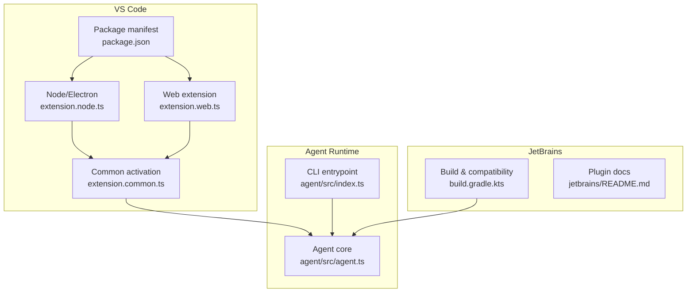
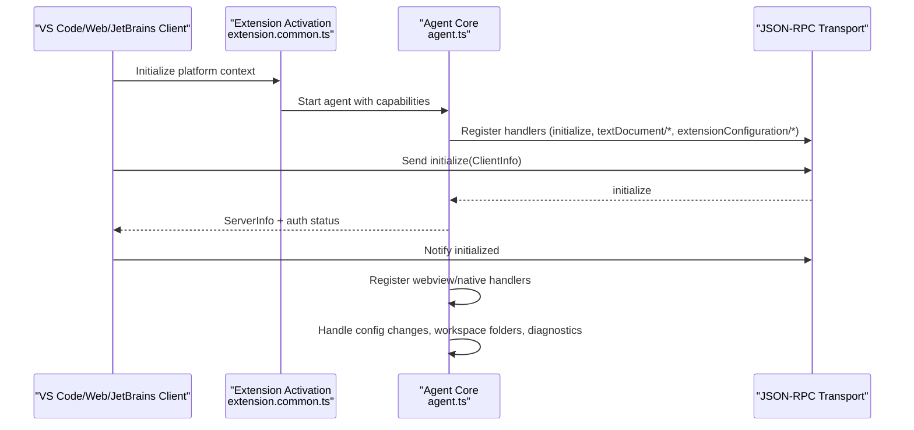
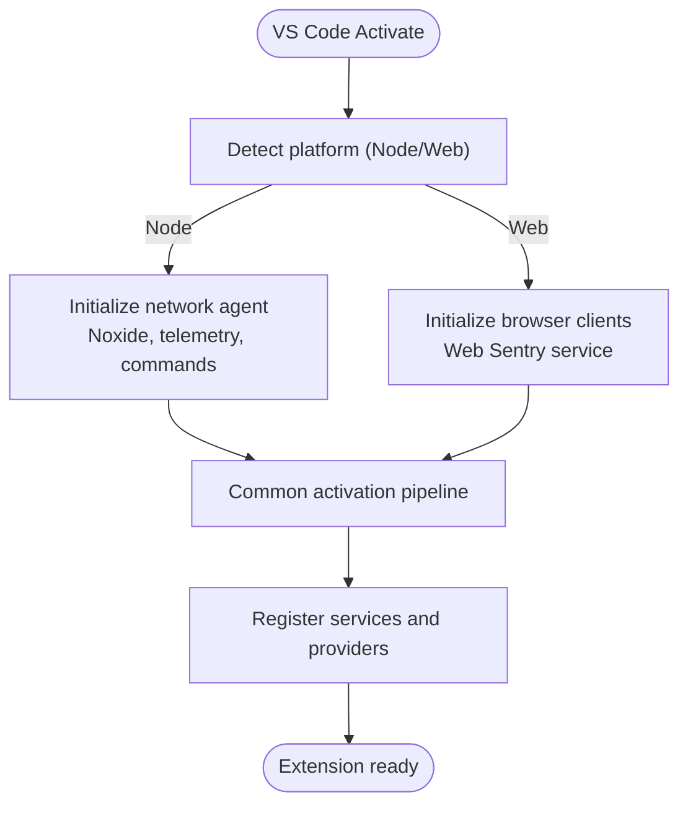
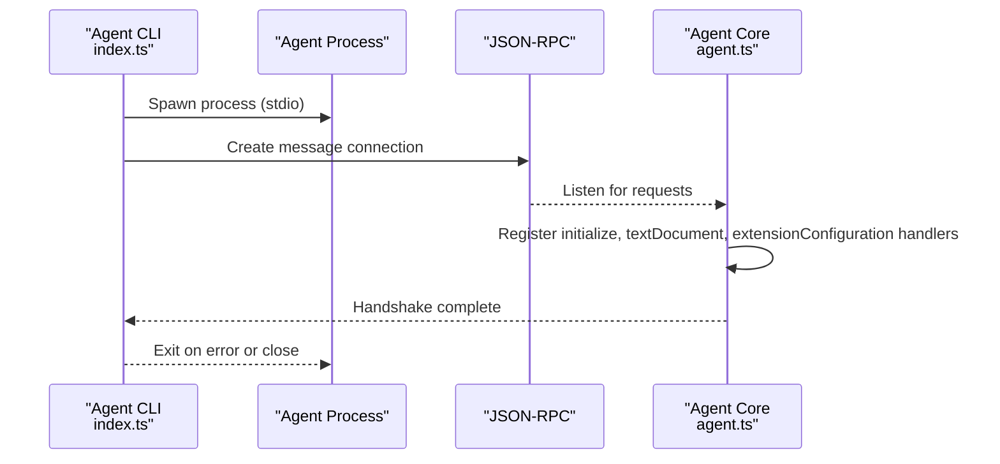
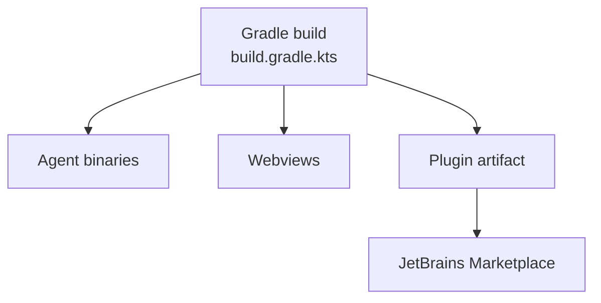
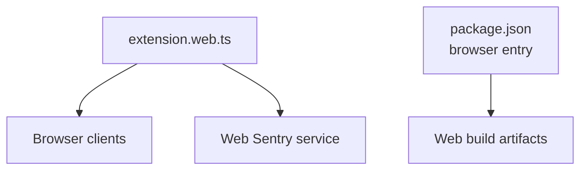
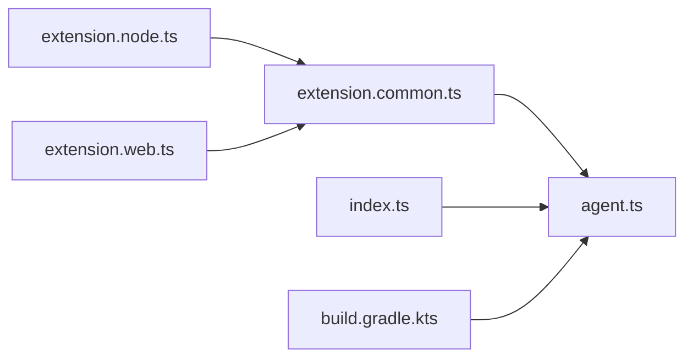
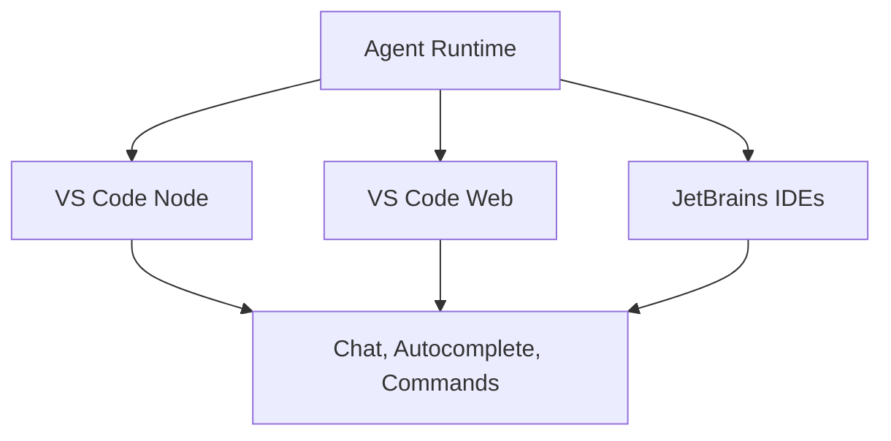

# Platform Integration

<cite>
**Referenced Files in This Document**
- [README.md](file://README.md)
- [ARCHITECTURE.md](file://ARCHITECTURE.md)
- [AGENT.md](file://AGENT.md)
- [vscode/README.md](file://vscode/README.md)
- [jetbrains/README.md](file://jetbrains/README.md)
- [agent/src/index.ts](file://agent/src/index.ts)
- [agent/src/agent.ts](file://agent/src/agent.ts)
- [vscode/src/extension.web.ts](file://vscode/src/extension.web.ts)
- [vscode/src/extension.node.ts](file://vscode/src/extension.node.ts)
- [vscode/src/extension.common.ts](file://vscode/src/extension.common.ts)
- [vscode/package.json](file://vscode/package.json)
- [jetbrains/build.gradle.kts](file://jetbrains/build.gradle.kts)
</cite>

## Table of Contents
1. [Introduction](#introduction)
2. [Project Structure](#project-structure)
3. [Core Components](#core-components)
4. [Architecture Overview](#architecture-overview)
5. [Detailed Component Analysis](#detailed-component-analysis)
6. [Dependency Analysis](#dependency-analysis)
7. [Performance Considerations](#performance-considerations)
8. [Troubleshooting Guide](#troubleshooting-guide)
9. [Conclusion](#conclusion)
10. [Appendices](#appendices)

## Introduction
This document explains Cody’s multi-platform integration across VS Code, JetBrains IDEs, and the web. It covers:
- VS Code extension architecture, activation flows, configuration management, and performance optimizations
- JetBrains plugin implementation and compatibility across IDEs
- Agent runtime system enabling cross-platform communication via JSON-RPC, CLI, and process management
- Web components integration for browser-based usage
- Platform-specific configuration, authentication flows, and feature availability
- Distribution and update mechanisms across marketplaces

## Project Structure
Cody is organized as a monorepo with platform-specific packages and shared components:
- agent: Cross-platform agent runtime, JSON-RPC server, CLI, and process orchestration
- vscode: VS Code extension with platform-specific entrypoints for Node/Electron and Web
- jetbrains: JetBrains plugin with Kotlin/Gradle build, multi-IDE compatibility, and embedded agent resources
- web: Optional web library for browser-based integration
- Shared libraries and utilities under lib/, web/lib/, and agent/bindings/kotlin

**Diagram sources**
- [agent/src/index.ts:1-34](file://agent/src/index.ts#L1-L34)
- [agent/src/agent.ts:195-283](file://agent/src/agent.ts#L195-L283)
- [vscode/src/extension.node.ts:25-58](file://vscode/src/extension.node.ts#L25-L58)
- [vscode/src/extension.web.ts:14-34](file://vscode/src/extension.web.ts#L14-L34)
- [vscode/src/extension.common.ts:44-77](file://vscode/src/extension.common.ts#L44-L77)
- [vscode/package.json:116-122](file://vscode/package.json#L116-L122)
- [jetbrains/build.gradle.kts:502-531](file://jetbrains/build.gradle.kts#L502-L531)
- [jetbrains/README.md:1-207](file://jetbrains/README.md#L1-L207)

**Section sources**
- [README.md:26-41](file://README.md#L26-L41)
- [ARCHITECTURE.md:1-165](file://ARCHITECTURE.md#L1-L165)
- [AGENT.md:1-26](file://AGENT.md#L1-L26)

## Core Components
- VS Code extension entrypoints:
  - Node/Electron activation initializes network agent, Noxide, telemetry, and commands provider
  - Web activation uses browser-compatible clients and services
  - Common activation wires platform-specific services into a unified activation pipeline
- Agent runtime:
  - CLI entrypoint parses commands and routes to subcommands
  - Agent core implements JSON-RPC server, document/workspace handlers, authentication, and webview registration
- JetBrains plugin:
  - Gradle build embeds agent binaries and resources, validates against multiple IDE versions, and publishes to JetBrains Marketplace
- Web components:
  - Browser-based activation and services tailored for web environments

**Section sources**
- [vscode/src/extension.node.ts:25-95](file://vscode/src/extension.node.ts#L25-L95)
- [vscode/src/extension.web.ts:14-35](file://vscode/src/extension.web.ts#L14-L35)
- [vscode/src/extension.common.ts:24-77](file://vscode/src/extension.common.ts#L24-L77)
- [agent/src/index.ts:1-34](file://agent/src/index.ts#L1-L34)
- [agent/src/agent.ts:295-514](file://agent/src/agent.ts#L295-L514)
- [jetbrains/build.gradle.kts:502-531](file://jetbrains/build.gradle.kts#L502-L531)

## Architecture Overview
Cody’s multi-platform architecture centers on a shared agent runtime communicating with clients via JSON-RPC. The VS Code extension activates differently depending on platform (Node vs Web), while the JetBrains plugin embeds the agent and manages compatibility across IDEs.

**Diagram sources**
- [vscode/src/extension.common.ts:44-77](file://vscode/src/extension.common.ts#L44-L77)
- [agent/src/agent.ts:381-499](file://agent/src/agent.ts#L381-L499)

## Detailed Component Analysis

### VS Code Extension Architecture
- Node/Electron activation:
  - Initializes network agent, optional Noxide library, telemetry, and commands provider
  - Reads configuration flags for experimental features and enables platform-specific services
- Web activation:
  - Uses browser-compatible completion client and Sentry service
  - Exposes creation hooks for platform context
- Common activation:
  - Accepts a PlatformContext with constructors for services and clients
  - Wires network agent and other services into the extension lifecycle

**Diagram sources**
- [vscode/src/extension.node.ts:25-58](file://vscode/src/extension.node.ts#L25-L58)
- [vscode/src/extension.web.ts:14-34](file://vscode/src/extension.web.ts#L14-L34)
- [vscode/src/extension.common.ts:44-77](file://vscode/src/extension.common.ts#L44-L77)

**Section sources**
- [vscode/src/extension.node.ts:25-95](file://vscode/src/extension.node.ts#L25-L95)
- [vscode/src/extension.web.ts:14-35](file://vscode/src/extension.web.ts#L14-L35)
- [vscode/src/extension.common.ts:24-77](file://vscode/src/extension.common.ts#L24-L77)

### Agent Runtime System (JSON-RPC, CLI, Process Management)
- CLI entrypoint:
  - Redirects console logging to stderr, registers local certificates, and parses commands
- Agent core:
  - Spawns or embeds the agent process
  - Establishes JSON-RPC connection with client
  - Implements initialize/shutdown lifecycle, workspace/document handlers, diagnostics, and configuration management
  - Supports native webview or generic webview handlers based on client capabilities

**Diagram sources**
- [agent/src/index.ts:1-34](file://agent/src/index.ts#L1-L34)
- [agent/src/agent.ts:195-283](file://agent/src/agent.ts#L195-L283)

**Section sources**
- [agent/src/index.ts:1-34](file://agent/src/index.ts#L1-L34)
- [agent/src/agent.ts:295-514](file://agent/src/agent.ts#L295-L514)

### JetBrains Plugin Implementation
- Multi-IDE compatibility:
  - Gradle build targets multiple IDE versions and bundles agent binaries
  - Validates against a curated list of versions and configures plugin verification
- Resource embedding:
  - Copies agent binaries and webviews into the plugin artifact
- Marketplace distribution:
  - Publish task reads token from environment and applies release channel based on version
- Settings and features:
  - README documents settings, keymaps, and supported IDEs

**Diagram sources**
- [jetbrains/build.gradle.kts:502-531](file://jetbrains/build.gradle.kts#L502-L531)

**Section sources**
- [jetbrains/build.gradle.kts:32-631](file://jetbrains/build.gradle.kts#L32-L631)
- [jetbrains/README.md:92-207](file://jetbrains/README.md#L92-L207)

### Web Components Integration
- Browser-based activation:
  - Web extension entrypoint creates browser-compatible clients and services
- Manifest and engines:
  - Package manifest defines engines and entrypoints for web builds
- Styling and tooling:
  - Tailwind, PostCSS, and Vite configuration support web UI development

**Diagram sources**
- [vscode/src/extension.web.ts:14-34](file://vscode/src/extension.web.ts#L14-L34)
- [vscode/package.json:116-122](file://vscode/package.json#L116-L122)

**Section sources**
- [vscode/src/extension.web.ts:14-35](file://vscode/src/extension.web.ts#L14-L35)
- [vscode/package.json:116-122](file://vscode/package.json#L116-L122)

## Dependency Analysis
- VS Code activation depends on:
  - Platform-specific entrypoints (Node vs Web)
  - Common activation pipeline
  - Agent runtime for JSON-RPC communication
- JetBrains build depends on:
  - Gradle tasks to build agent, download node binaries, and embed resources
  - Verification against multiple IDE versions
- Agent runtime depends on:
  - CLI entrypoint for process orchestration
  - JSON-RPC transport for client communication

**Diagram sources**
- [vscode/src/extension.node.ts:25-58](file://vscode/src/extension.node.ts#L25-L58)
- [vscode/src/extension.web.ts:14-34](file://vscode/src/extension.web.ts#L14-L34)
- [vscode/src/extension.common.ts:44-77](file://vscode/src/extension.common.ts#L44-L77)
- [agent/src/index.ts:1-34](file://agent/src/index.ts#L1-L34)
- [agent/src/agent.ts:295-514](file://agent/src/agent.ts#L295-L514)
- [jetbrains/build.gradle.kts:502-531](file://jetbrains/build.gradle.kts#L502-L531)

**Section sources**
- [vscode/src/extension.common.ts:24-77](file://vscode/src/extension.common.ts#L24-L77)
- [agent/src/agent.ts:381-499](file://agent/src/agent.ts#L381-L499)
- [jetbrains/build.gradle.kts:502-531](file://jetbrains/build.gradle.kts#L502-L531)

## Performance Considerations
- Logging redirection:
  - CLI redirects console.log to stderr to avoid breaking JSON-RPC stdio
- Conditional feature loading:
  - VS Code Node activation conditionally initializes telemetry, Noxide, and Symf based on configuration flags
- Memory and diagnostics:
  - Agent exposes testing endpoints for awaiting pending promises, memory usage, and heap dumps
- Build-time optimizations:
  - VS Code uses separate builds for desktop and web, and Vite for webviews

**Section sources**
- [agent/src/index.ts:6-13](file://agent/src/index.ts#L6-L13)
- [vscode/src/extension.node.ts:45-57](file://vscode/src/extension.node.ts#L45-L57)
- [agent/src/agent.ts:747-775](file://agent/src/agent.ts#L747-L775)
- [vscode/package.json:22-37](file://vscode/package.json#L22-L37)

## Troubleshooting Guide
- Authentication and configuration:
  - Agent handles extension configuration changes and can force authentication based on client capabilities and settings
- Diagnostics and telemetry:
  - Agent exposes endpoints for exporting telemetry events and network requests during testing
- Error handling:
  - CLI catches uncaught exceptions and reports them to stderr
  - Agent core exits on initialization errors and logs debug messages

**Section sources**
- [agent/src/agent.ts:593-626](file://agent/src/agent.ts#L593-L626)
- [agent/src/agent.ts:770-800](file://agent/src/agent.ts#L770-L800)
- [agent/src/index.ts:16-24](file://agent/src/index.ts#L16-L24)

## Conclusion
Cody’s multi-platform integration leverages a shared agent runtime with platform-specific activations and packaging. The VS Code extension supports both Node/Electron and Web environments, the JetBrains plugin embeds agent binaries and validates compatibility across IDEs, and the agent runtime communicates via JSON-RPC with robust configuration and diagnostics. Together, these components deliver a cohesive, cross-platform experience.

## Appendices

### Platform-Specific Configuration Options
- VS Code:
  - Experimental flags for Symf, telemetry, and Noxide
  - Commands, keybindings, and views contributions
- JetBrains:
  - System properties for autocomplete formatting and agent behavior
  - Settings for accounts, default branch, remote URL replacements, and globbing

**Section sources**
- [vscode/src/extension.node.ts:33-44](file://vscode/src/extension.node.ts#L33-L44)
- [vscode/package.json:192-538](file://vscode/package.json#L192-L538)
- [jetbrains/README.md:134-161](file://jetbrains/README.md#L134-L161)
- [jetbrains/README.md:182-184](file://jetbrains/README.md#L182-L184)

### Authentication Flows
- VS Code:
  - Token receiver startup and platform-specific services
- JetBrains:
  - Authorization settings and custom request headers
- Agent:
  - Handles authentication status and capability-based activation

**Section sources**
- [vscode/src/extension.node.ts:55-56](file://vscode/src/extension.node.ts#L55-L56)
- [jetbrains/README.md:134-142](file://jetbrains/README.md#L134-L142)
- [agent/src/agent.ts:431-433](file://agent/src/agent.ts#L431-L433)

### Feature Availability Matrix (Conceptual)

[No sources needed since this diagram shows conceptual feature availability across platforms]

### Distribution and Update Mechanisms
- VS Code:
  - Build scripts for desktop and web, packaging, and release automation
- JetBrains:
  - Gradle tasks to build agent, embed resources, and publish to JetBrains Marketplace using environment tokens

**Section sources**
- [vscode/package.json:11-56](file://vscode/package.json#L11-L56)
- [jetbrains/build.gradle.kts:559-575](file://jetbrains/build.gradle.kts#L559-L575)