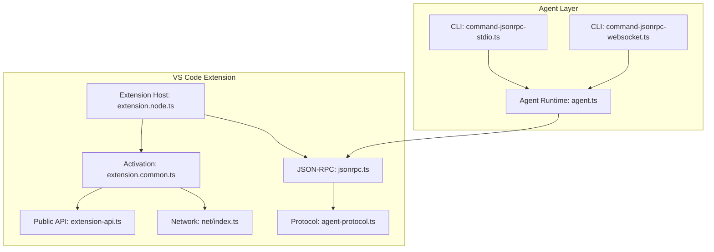
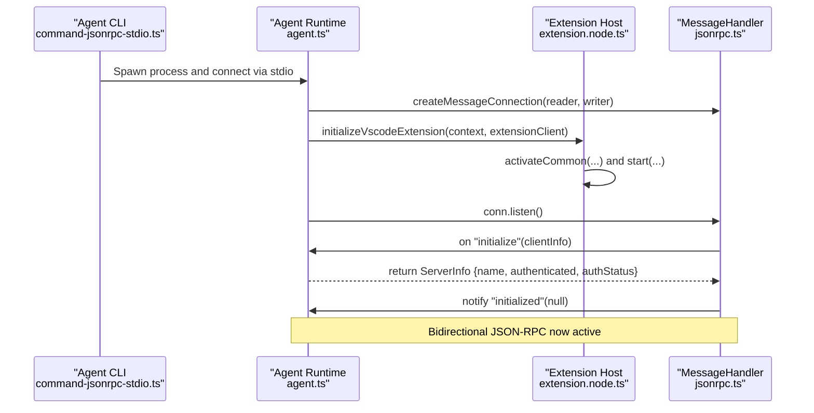
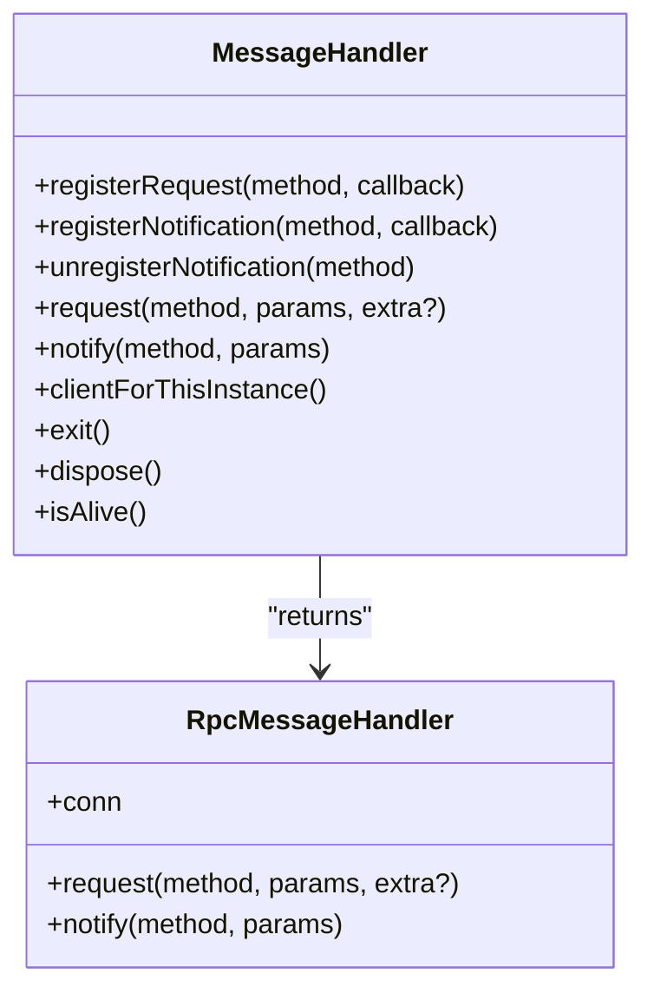
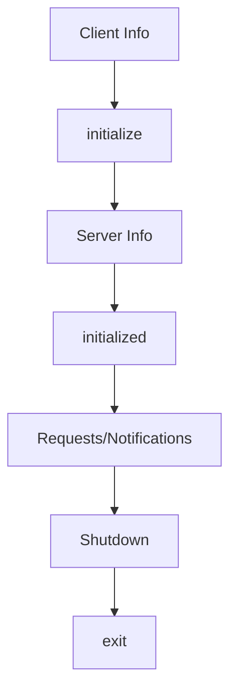
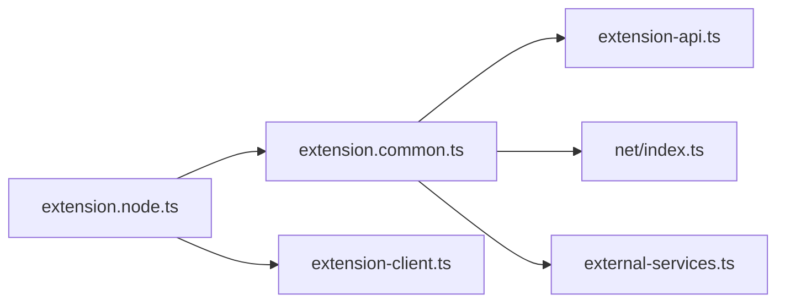
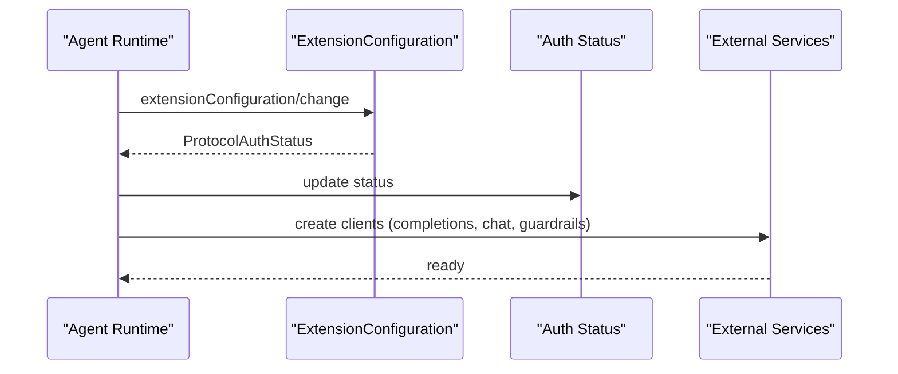
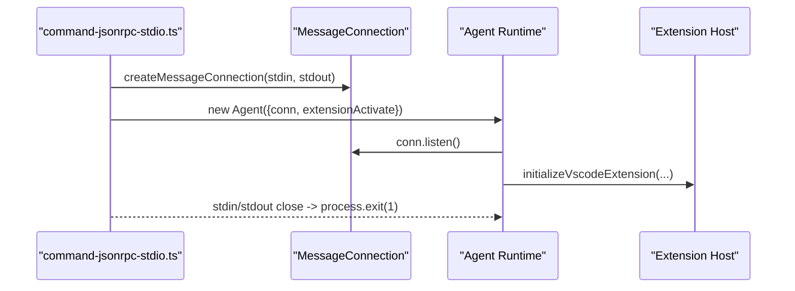
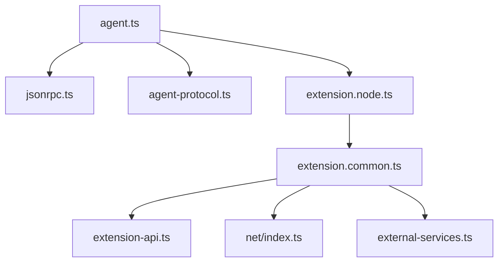

# API Integration

<cite>
**Referenced Files in This Document**
- [agent.ts](file://agent/src/agent.ts)
- [command-jsonrpc-stdio.ts](file://agent/src/cli/command-jsonrpc-stdio.ts)
- [command-jsonrpc-websocket.ts](file://agent/src/cli/command-jsonrpc-websocket.ts)
- [jsonrpc.ts](file://vscode/src/jsonrpc/jsonrpc.ts)
- [agent-protocol.ts](file://vscode/src/jsonrpc/agent-protocol.ts)
- [CodyJsonRpcErrorCode.ts](file://vscode/src/jsonrpc/CodyJsonRpcErrorCode.ts)
- [extension-api.ts](file://vscode/src/extension-api.ts)
- [external-services.ts](file://vscode/src/external-services.ts)
- [extension.node.ts](file://vscode/src/extension.node.ts)
- [extension.common.ts](file://vscode/src/extension.common.ts)
- [extension-client.ts](file://vscode/src/extension-client.ts)
- [index.ts](file://vscode/src/net/index.ts)
</cite>

## Table of Contents
1. [Introduction](#introduction)
2. [Project Structure](#project-structure)
3. [Core Components](#core-components)
4. [Architecture Overview](#architecture-overview)
5. [Detailed Component Analysis](#detailed-component-analysis)
6. [Dependency Analysis](#dependency-analysis)
7. [Performance Considerations](#performance-considerations)
8. [Troubleshooting Guide](#troubleshooting-guide)
9. [Conclusion](#conclusion)

## Introduction
This document explains the API integration patterns for the VS Code extension’s agent, focusing on:
- JSON-RPC protocol implementation for agent communication, including request/response handling, error propagation, and connection lifecycle
- Extension API integration with VS Code’s native APIs, command registration, and event handling
- External service integration architecture, HTTP client configuration, authentication flows, and endpoint management
- Agent protocol specification, message serialization, and bidirectional communication patterns
- Practical usage examples, error handling strategies, and performance optimization techniques for network operations

## Project Structure
The agent and extension collaborate across two layers:
- Agent CLI and runtime: spawns and communicates with the VS Code extension via JSON-RPC over stdio or WebSocket
- VS Code extension: exposes native APIs, manages services, and integrates with external systems

**Diagram sources**
- [command-jsonrpc-stdio.ts:1-208](file://agent/src/cli/command-jsonrpc-stdio.ts#L1-L208)
- [command-jsonrpc-websocket.ts:1-55](file://agent/src/cli/command-jsonrpc-websocket.ts#L1-L55)
- [agent.ts:1-283](file://agent/src/agent.ts#L1-L283)
- [extension.node.ts:1-95](file://vscode/src/extension.node.ts#L1-L95)
- [extension.common.ts:1-78](file://vscode/src/extension.common.ts#L1-L78)
- [extension-api.ts:1-19](file://vscode/src/extension-api.ts#L1-L19)
- [index.ts:1-3](file://vscode/src/net/index.ts#L1-L3)
- [jsonrpc.ts:1-191](file://vscode/src/jsonrpc/jsonrpc.ts#L1-L191)
- [agent-protocol.ts:1-800](file://vscode/src/jsonrpc/agent-protocol.ts#L1-L800)

**Section sources**
- [command-jsonrpc-stdio.ts:1-208](file://agent/src/cli/command-jsonrpc-stdio.ts#L1-L208)
- [command-jsonrpc-websocket.ts:1-55](file://agent/src/cli/command-jsonrpc-websocket.ts#L1-L55)
- [agent.ts:1-283](file://agent/src/agent.ts#L1-L283)
- [extension.node.ts:1-95](file://vscode/src/extension.node.ts#L1-L95)
- [extension.common.ts:1-78](file://vscode/src/extension.common.ts#L1-L78)
- [extension-api.ts:1-19](file://vscode/src/extension-api.ts#L1-L19)
- [index.ts:1-3](file://vscode/src/net/index.ts#L1-L3)
- [jsonrpc.ts:1-191](file://vscode/src/jsonrpc/jsonrpc.ts#L1-L191)
- [agent-protocol.ts:1-800](file://vscode/src/jsonrpc/agent-protocol.ts#L1-L800)

## Core Components
- JSON-RPC message handler and connection lifecycle
  - Manages request handlers, notifications, cancellation, tracing, and error mapping
  - Provides client-facing request/notify methods and in-process client for same-instance communication
- Agent protocol specification
  - Defines all JSON-RPC requests, notifications, and data models exchanged between client and agent
- Extension activation and service wiring
  - Initializes network agent, telemetry, Sentry, and external services
- External services integration
  - Completions, chat, guardrails, and optional local context runner
- Extension client abstraction
  - Delegates capabilities and component creation to the client (VS Code, Agent, etc.)

**Section sources**
- [jsonrpc.ts:1-191](file://vscode/src/jsonrpc/jsonrpc.ts#L1-L191)
- [agent-protocol.ts:1-800](file://vscode/src/jsonrpc/agent-protocol.ts#L1-L800)
- [extension.common.ts:1-78](file://vscode/src/extension.common.ts#L1-L78)
- [external-services.ts:1-60](file://vscode/src/external-services.ts#L1-L60)
- [extension-client.ts:1-44](file://vscode/src/extension-client.ts#L1-L44)

## Architecture Overview
The agent establishes a JSON-RPC connection to the extension host, exchanging typed requests and notifications. The extension initializes services and delegates capabilities to the agent. Bidirectional communication supports streaming-like notifications and request-response semantics.

**Diagram sources**
- [command-jsonrpc-stdio.ts:170-207](file://agent/src/cli/command-jsonrpc-stdio.ts#L170-L207)
- [agent.ts:153-193](file://agent/src/agent.ts#L153-L193)
- [extension.node.ts:25-58](file://vscode/src/extension.node.ts#L25-L58)
- [jsonrpc.ts:121-136](file://vscode/src/jsonrpc/jsonrpc.ts#L121-L136)

## Detailed Component Analysis

### JSON-RPC Protocol Implementation
- Request/Response handling
  - Handlers are registered per method; requests are awaited and responses returned
  - Cancellation tokens propagate cancellation to the server-side handler
- Error propagation
  - Errors are mapped to standardized JSON-RPC error codes, including rate limits and request cancellation
  - Stack traces included in error payload for diagnostics
- Connection lifecycle
  - Connection tracing to file via environment variable
  - Graceful close and disposal of disposables
- In-process client
  - Exposes a client that routes calls to local handlers for same-process usage

**Diagram sources**
- [jsonrpc.ts:40-191](file://vscode/src/jsonrpc/jsonrpc.ts#L40-L191)

**Section sources**
- [jsonrpc.ts:1-191](file://vscode/src/jsonrpc/jsonrpc.ts#L1-L191)
- [CodyJsonRpcErrorCode.ts:1-10](file://vscode/src/jsonrpc/CodyJsonRpcErrorCode.ts#L1-L10)

### Agent Protocol Specification
- Requests (Client → Server)
  - Initialization, shutdown, chat sessions, commands, code actions, autocomplete, diagnostics, webview messaging, configuration changes, telemetry, and testing helpers
- Notifications (Client ↔ Server)
  - Document lifecycle, workspace changes, progress, webview messages, authentication status, and window/context updates
- Data models
  - Rich types for positions, ranges, diagnostics, telemetry events, authentication status, and webview options

**Diagram sources**
- [agent-protocol.ts:35-303](file://vscode/src/jsonrpc/agent-protocol.ts#L35-L303)

**Section sources**
- [agent-protocol.ts:1-800](file://vscode/src/jsonrpc/agent-protocol.ts#L1-L800)

### Extension API Integration with VS Code
- Public API surface
  - Exposes extension mode and optional testing hooks
- Activation and service wiring
  - Initializes network agent, telemetry, Sentry, and optional Noxide library
  - Creates external services (completions, chat, guardrails, optional symf)
- Client capability delegation
  - ExtensionClient interface allows clients to customize capabilities and component creation

**Diagram sources**
- [extension.node.ts:25-58](file://vscode/src/extension.node.ts#L25-L58)
- [extension.common.ts:44-77](file://vscode/src/extension.common.ts#L44-L77)
- [extension-api.ts:1-19](file://vscode/src/extension-api.ts#L1-L19)
- [index.ts:1-3](file://vscode/src/net/index.ts#L1-L3)
- [external-services.ts:21-59](file://vscode/src/external-services.ts#L21-L59)
- [extension-client.ts:11-43](file://vscode/src/extension-client.ts#L11-L43)

**Section sources**
- [extension-api.ts:1-19](file://vscode/src/extension-api.ts#L1-L19)
- [extension.common.ts:1-78](file://vscode/src/extension.common.ts#L1-L78)
- [external-services.ts:1-60](file://vscode/src/external-services.ts#L1-L60)
- [extension-client.ts:1-44](file://vscode/src/extension-client.ts#L1-L44)

### External Services Integration
- HTTP client configuration
  - Network agent initialization delegated to platform context
  - Optional Noxide library integration for enhanced logging
- Authentication flows
  - Extension configuration change triggers authentication status updates
  - Authentication status propagated via protocol types
- Endpoint management
  - Access token and server endpoint configurable; headers supported
  - Anonymous user ID and telemetry client name supported for telemetry correlation

**Diagram sources**
- [agent.ts:609-615](file://agent/src/agent.ts#L609-L615)
- [agent-protocol.ts:620-655](file://vscode/src/jsonrpc/agent-protocol.ts#L620-L655)
- [external-services.ts:21-59](file://vscode/src/external-services.ts#L21-L59)

**Section sources**
- [agent.ts:609-615](file://agent/src/agent.ts#L609-L615)
- [agent-protocol.ts:620-655](file://vscode/src/jsonrpc/agent-protocol.ts#L620-L655)
- [external-services.ts:1-60](file://vscode/src/external-services.ts#L1-L60)

### Agent Communication Entrypoints
- Stdio-based JSON-RPC
  - CLI sets up message connection, optionally wraps with Polly for network recording, and listens for messages
  - Agent process exits on stdin/stdout close to prevent zombies
- WebSocket-based JSON-RPC
  - Experimental server command demonstrates a WebSocket bridge and initial configuration exchange

**Diagram sources**
- [command-jsonrpc-stdio.ts:181-207](file://agent/src/cli/command-jsonrpc-stdio.ts#L181-L207)
- [agent.ts:295-378](file://agent/src/agent.ts#L295-L378)

**Section sources**
- [command-jsonrpc-stdio.ts:1-208](file://agent/src/cli/command-jsonrpc-stdio.ts#L1-L208)
- [command-jsonrpc-websocket.ts:1-55](file://agent/src/cli/command-jsonrpc-websocket.ts#L1-L55)
- [agent.ts:295-378](file://agent/src/agent.ts#L295-L378)

## Dependency Analysis
- Agent depends on:
  - JSON-RPC transport and protocol definitions
  - Extension activation and client capabilities
  - External services for completions, chat, and guardrails
- Extension depends on:
  - Platform context for service creation
  - Network agent for HTTP interception and telemetry
  - Public API surface for testing and extension mode

**Diagram sources**
- [agent.ts:1-106](file://agent/src/agent.ts#L1-L106)
- [jsonrpc.ts:1-12](file://vscode/src/jsonrpc/jsonrpc.ts#L1-L12)
- [agent-protocol.ts:1-26](file://vscode/src/jsonrpc/agent-protocol.ts#L1-L26)
- [extension.node.ts:1-20](file://vscode/src/extension.node.ts#L1-L20)
- [extension.common.ts:1-42](file://vscode/src/extension.common.ts#L1-L42)
- [extension-api.ts:1-19](file://vscode/src/extension-api.ts#L1-L19)
- [index.ts:1-3](file://vscode/src/net/index.ts#L1-L3)
- [external-services.ts:1-30](file://vscode/src/external-services.ts#L1-L30)

**Section sources**
- [agent.ts:1-106](file://agent/src/agent.ts#L1-L106)
- [jsonrpc.ts:1-12](file://vscode/src/jsonrpc/jsonrpc.ts#L1-L12)
- [agent-protocol.ts:1-26](file://vscode/src/jsonrpc/agent-protocol.ts#L1-L26)
- [extension.node.ts:1-20](file://vscode/src/extension.node.ts#L1-L20)
- [extension.common.ts:1-42](file://vscode/src/extension.common.ts#L1-L42)
- [extension-api.ts:1-19](file://vscode/src/extension-api.ts#L1-L19)
- [index.ts:1-3](file://vscode/src/net/index.ts#L1-L3)
- [external-services.ts:1-30](file://vscode/src/external-services.ts#L1-L30)

## Performance Considerations
- Minimize unnecessary network requests by batching document change notifications and deferring non-critical operations
- Use cancellation tokens to cancel long-running requests promptly
- Enable connection tracing only in development to avoid I/O overhead
- Prefer in-process client for same-instance operations to reduce IPC overhead
- Leverage Polly recording judiciously in tests to avoid excessive disk writes

## Troubleshooting Guide
- JSON-RPC errors
  - Inspect standardized error codes and included stack traces for diagnosing failures
  - Verify cancellation handling when requests are canceled
- Connection lifecycle
  - Ensure “initialized” is sent after “initialize” and “exit” after “shutdown”
  - Confirm connection close handlers terminate the process to prevent zombies
- Authentication and configuration
  - Use “extensionConfiguration/change” to update credentials and endpoints
  - Monitor “authStatus/didUpdate” notifications for status changes
- Network interception
  - Initialize the network agent early to prevent premature outbound requests
  - Verify HTTP client name and headers for legacy server compatibility

**Section sources**
- [CodyJsonRpcErrorCode.ts:1-10](file://vscode/src/jsonrpc/CodyJsonRpcErrorCode.ts#L1-L10)
- [jsonrpc.ts:69-88](file://vscode/src/jsonrpc/jsonrpc.ts#L69-L88)
- [agent.ts:501-513](file://agent/src/agent.ts#L501-L513)
- [agent.ts:609-615](file://agent/src/agent.ts#L609-L615)
- [extension.common.ts:56-62](file://vscode/src/extension.common.ts#L56-L62)

## Conclusion
The VS Code extension integrates with the agent through a robust JSON-RPC protocol, enabling bidirectional communication, structured error handling, and lifecycle management. The extension’s activation pattern wires external services and client capabilities, while the agent translates client requests into VS Code-native operations. Following the patterns documented here ensures reliable API usage, predictable error propagation, and efficient network behavior.