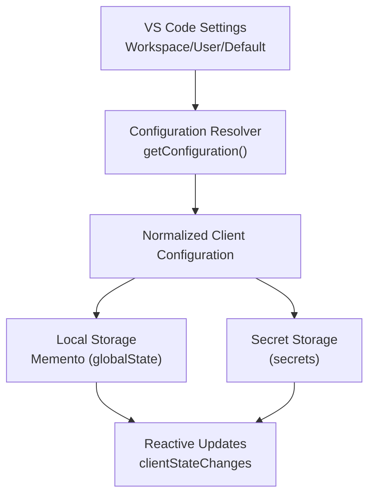
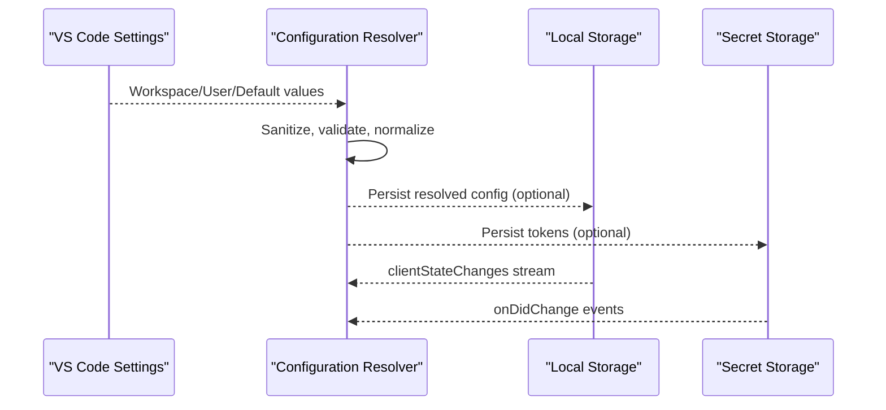
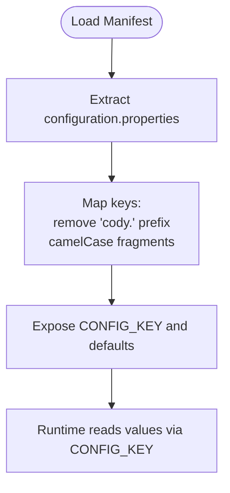
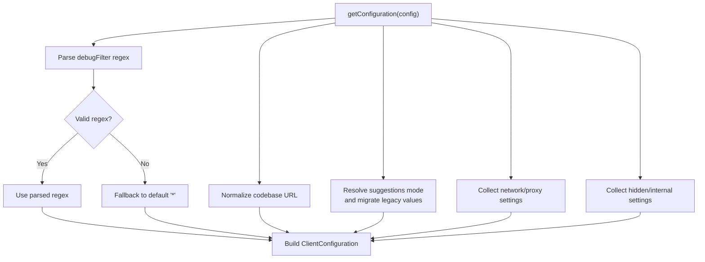
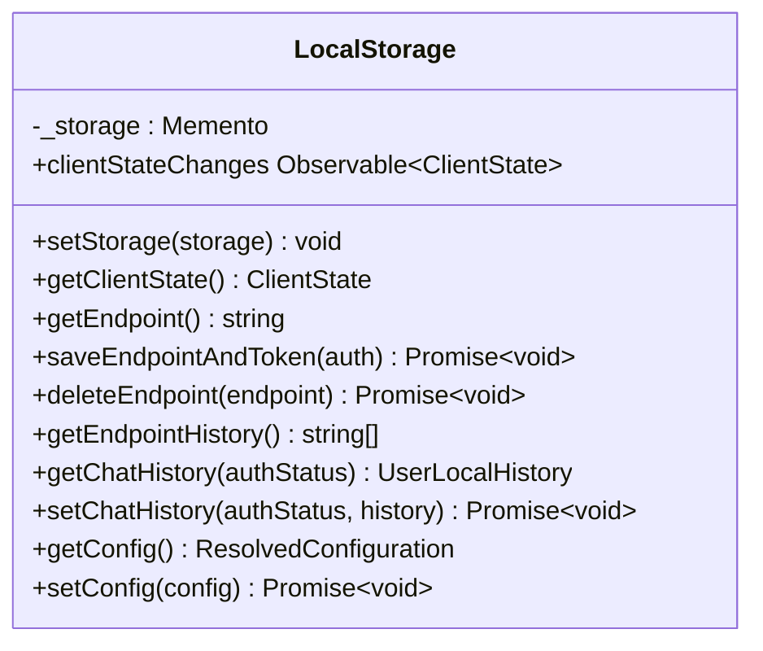
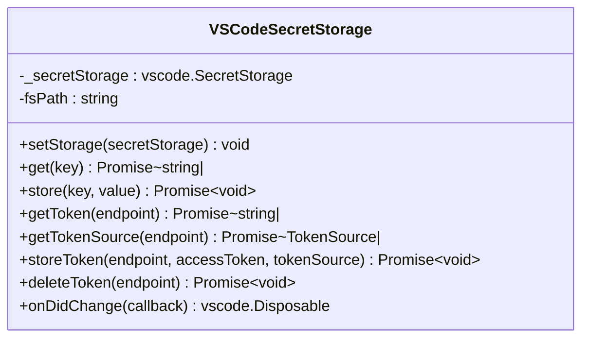
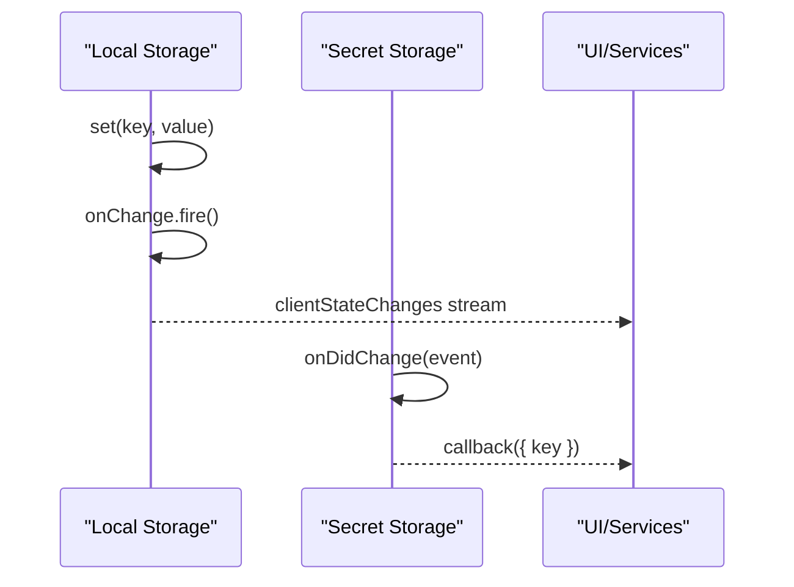
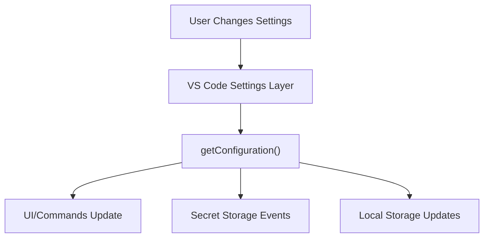
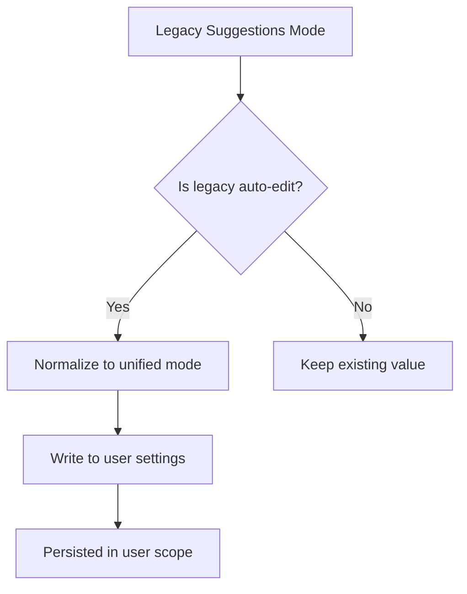
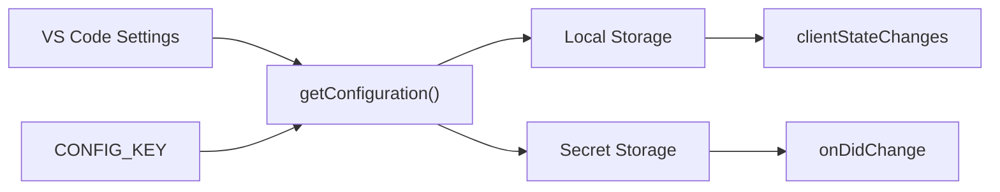

# Configuration Management

<cite>
**Referenced Files in This Document**
- [configuration.ts](file://vscode/src/configuration.ts)
- [configuration-keys.ts](file://vscode/src/configuration-keys.ts)
- [configuration.test.ts](file://vscode/src/configuration.test.ts)
- [package.json](file://vscode/package.json)
- [LocalStorageProvider.ts](file://vscode/src/services/LocalStorageProvider.ts)
- [SecretStorageProvider.ts](file://vscode/src/services/SecretStorageProvider.ts)
</cite>

## Table of Contents
1. [Introduction](#introduction)
2. [Project Structure](#project-structure)
3. [Core Components](#core-components)
4. [Architecture Overview](#architecture-overview)
5. [Detailed Component Analysis](#detailed-component-analysis)
6. [Dependency Analysis](#dependency-analysis)
7. [Performance Considerations](#performance-considerations)
8. [Troubleshooting Guide](#troubleshooting-guide)
9. [Conclusion](#conclusion)

## Introduction
This document explains the VS Code extension’s configuration management system. It covers the multi-layer configuration architecture (workspace, user, default), configuration resolution and validation, persistent storage using VS Code’s storage APIs and secret storage, configuration change detection and reactive updates, real-time synchronization, configuration schema definitions, validation logic, UI integration, and troubleshooting common configuration issues.

## Project Structure
The configuration system spans three primary areas:
- Configuration schema and keys: defined declaratively in the extension manifest and mirrored in code for type-safe access.
- Runtime configuration resolution: transforms VS Code settings into a normalized client configuration object.
- Persistent storage: local and secret storage for user preferences, chat history, and tokens.

**Diagram sources**
- [configuration.ts:25-204](file://vscode/src/configuration.ts#L25-L204)
- [LocalStorageProvider.ts:74-90](file://vscode/src/services/LocalStorageProvider.ts#L74-L90)
- [SecretStorageProvider.ts:26-46](file://vscode/src/services/SecretStorageProvider.ts#L26-L46)

**Section sources**
- [configuration.ts:1-233](file://vscode/src/configuration.ts#L1-L233)
- [configuration-keys.ts:1-55](file://vscode/src/configuration-keys.ts#L1-L55)
- [package.json:123-800](file://vscode/package.json#L123-L800)

## Core Components
- Configuration resolver: reads VS Code settings, applies sanitization and defaults, and produces a normalized client configuration object.
- Configuration keys: auto-generated from the extension manifest to ensure type safety and consistency.
- Local storage: persists user preferences, chat history, and client state using VS Code’s Memento API.
- Secret storage: securely stores tokens keyed by endpoint and supports fallback to filesystem-backed tokens.

Key responsibilities:
- Multi-layer resolution: workspace overrides user overrides defaults.
- Validation and sanitization: regex parsing, URL normalization, default fallbacks.
- Reactive updates: emits observable changes for client state and secrets.
- Real-time synchronization: integrates with VS Code settings and secret storage events.

**Section sources**
- [configuration.ts:25-204](file://vscode/src/configuration.ts#L25-L204)
- [configuration-keys.ts:18-55](file://vscode/src/configuration-keys.ts#L18-L55)
- [LocalStorageProvider.ts:27-90](file://vscode/src/services/LocalStorageProvider.ts#L27-L90)
- [SecretStorageProvider.ts:26-133](file://vscode/src/services/SecretStorageProvider.ts#L26-L133)

## Architecture Overview
The configuration pipeline resolves VS Code settings into a normalized client configuration, persists relevant values, and exposes reactive streams for UI and services to consume.

**Diagram sources**
- [configuration.ts:25-204](file://vscode/src/configuration.ts#L25-L204)
- [LocalStorageProvider.ts:322-328](file://vscode/src/services/LocalStorageProvider.ts#L322-L328)
- [SecretStorageProvider.ts:124-132](file://vscode/src/services/SecretStorageProvider.ts#L124-L132)

## Detailed Component Analysis

### Configuration Schema and Keys
- The configuration schema is declared in the extension manifest and consumed at runtime to:
  - Provide default values.
  - Enable type-safe key access.
  - Drive UI visibility and grouping in settings.

Implementation highlights:
- Keys are derived from the manifest’s configuration properties and transformed into camelCase identifiers.
- A helper retrieves default values directly from the manifest for consistent behavior.

**Diagram sources**
- [configuration-keys.ts:5-55](file://vscode/src/configuration-keys.ts#L5-L55)
- [package.json:123-800](file://vscode/package.json#L123-L800)

**Section sources**
- [configuration-keys.ts:18-55](file://vscode/src/configuration-keys.ts#L18-L55)
- [package.json:123-800](file://vscode/package.json#L123-L800)

### Configuration Resolution and Validation
- The resolver reads VS Code settings through a configurable getter and normalizes them into a typed client configuration object.
- Validation and sanitization:
  - Regex debug filter parsing with fallback to a default pattern.
  - Codebase URL normalization (strip protocol, trim whitespace, remove trailing slash).
  - Suggestions mode backward compatibility: auto-edit modes are normalized to a unified mode and persisted to user settings.
  - Network settings capture VS Code HTTP configuration as a serialized string for monitoring.
  - Hidden/internal settings are read from dedicated keys with environment-based overrides.

**Diagram sources**
- [configuration.ts:25-204](file://vscode/src/configuration.ts#L25-L204)

**Section sources**
- [configuration.ts:25-204](file://vscode/src/configuration.ts#L25-L204)

### Persistent Storage: Local Storage (Memento)
- Purpose: Store user preferences, chat history, endpoint history, anonymous user ID, model preferences, device pixel ratio, and resolved configuration snapshots.
- Mechanism:
  - Uses VS Code’s Memento API (globalState) as the backing store.
  - Provides typed getters/setters and batched updates.
  - Emits observable client state changes for reactive consumers.
- Security: Tokens are not stored here; use secret storage for tokens.

**Diagram sources**
- [LocalStorageProvider.ts:27-385](file://vscode/src/services/LocalStorageProvider.ts#L27-L385)

**Section sources**
- [LocalStorageProvider.ts:27-385](file://vscode/src/services/LocalStorageProvider.ts#L27-L385)

### Persistent Storage: Secret Storage
- Purpose: Securely store tokens keyed by endpoint and token source metadata.
- Mechanism:
  - Integrates with VS Code’s SecretStorage API.
  - Supports a fallback mechanism to read/write tokens from a configured filesystem path for environments without secret storage.
  - Emits change events scoped to the current endpoint token.
- Security: Tokens are stored per endpoint and include optional token source metadata.

**Diagram sources**
- [SecretStorageProvider.ts:26-255](file://vscode/src/services/SecretStorageProvider.ts#L26-L255)

**Section sources**
- [SecretStorageProvider.ts:26-255](file://vscode/src/services/SecretStorageProvider.ts#L26-L255)

### Configuration Change Detection and Reactive Updates
- Local storage exposes an observable stream of client state changes, debounced to distinct values.
- Secret storage exposes change events for the current endpoint token, enabling real-time reactions to token updates.
- These streams allow UI and services to reactively update without polling.

**Diagram sources**
- [LocalStorageProvider.ts:84-90](file://vscode/src/services/LocalStorageProvider.ts#L84-L90)
- [SecretStorageProvider.ts:124-132](file://vscode/src/services/SecretStorageProvider.ts#L124-L132)

**Section sources**
- [LocalStorageProvider.ts:84-90](file://vscode/src/services/LocalStorageProvider.ts#L84-L90)
- [SecretStorageProvider.ts:124-132](file://vscode/src/services/SecretStorageProvider.ts#L124-L132)

### Configuration UI Integration and Settings Synchronization
- The extension contributes commands and menus that depend on configuration values (e.g., enabling/disabling features).
- Keybindings and menu visibility are bound to configuration toggles, ensuring the UI reflects current settings immediately.
- Settings synchronization across environments:
  - Workspace settings override user settings.
  - User settings override defaults.
  - Hidden/internal settings can be overridden via environment variables or dedicated keys.

**Diagram sources**
- [package.json:123-800](file://vscode/package.json#L123-L800)
- [configuration.ts:25-204](file://vscode/src/configuration.ts#L25-L204)

**Section sources**
- [package.json:123-800](file://vscode/package.json#L123-L800)
- [configuration.ts:25-204](file://vscode/src/configuration.ts#L25-L204)

### Configuration Migration Strategies
- Suggestions mode migration: legacy auto-edit modes are normalized to a unified mode and written back to user settings to maintain consistency across sessions.
- Deprecated keys cleanup: local storage clears deprecated keys on initialization to prevent stale data.

**Diagram sources**
- [configuration.ts:59-72](file://vscode/src/configuration.ts#L59-L72)

**Section sources**
- [configuration.ts:59-72](file://vscode/src/configuration.ts#L59-L72)
- [LocalStorageProvider.ts:374-384](file://vscode/src/services/LocalStorageProvider.ts#L374-L384)

## Dependency Analysis
- Configuration resolver depends on:
  - VS Code workspace configuration API for reading values.
  - Configuration keys for type-safe access.
  - Local storage for persisting resolved configuration snapshots.
  - Secret storage for secure token handling.
- Local storage and secret storage are decoupled from the resolver and exposed as singletons for global access.

**Diagram sources**
- [configuration.ts:15-204](file://vscode/src/configuration.ts#L15-L204)
- [LocalStorageProvider.ts:322-328](file://vscode/src/services/LocalStorageProvider.ts#L322-L328)
- [SecretStorageProvider.ts:124-132](file://vscode/src/services/SecretStorageProvider.ts#L124-L132)

**Section sources**
- [configuration.ts:15-204](file://vscode/src/configuration.ts#L15-L204)
- [LocalStorageProvider.ts:322-328](file://vscode/src/services/LocalStorageProvider.ts#L322-L328)
- [SecretStorageProvider.ts:124-132](file://vscode/src/services/SecretStorageProvider.ts#L124-L132)

## Performance Considerations
- Minimize repeated parsing of complex settings (e.g., regex filters) by caching validated values.
- Batch updates to local storage to reduce event churn.
- Avoid unnecessary writes to secret storage; only update when token or source changes.
- Debounce reactive updates to prevent excessive UI re-renders.

## Troubleshooting Guide
Common configuration issues and resolutions:
- Invalid debug filter regex:
  - Symptom: Unexpected behavior in debug filtering.
  - Resolution: Ensure the regex is valid; the resolver falls back to a default pattern on parse errors.
  - Section sources
    - [configuration.ts:32-48](file://vscode/src/configuration.ts#L32-L48)
- Legacy suggestions mode:
  - Symptom: Auto-edit features not behaving as expected.
  - Resolution: The resolver migrates legacy modes to unified mode and persists the change to user settings.
  - Section sources
    - [configuration.ts:59-72](file://vscode/src/configuration.ts#L59-L72)
- Codebase URL normalization:
  - Symptom: Unexpected leading/trailing characters in codebase settings.
  - Resolution: The resolver strips protocols and trims whitespace automatically.
  - Section sources
    - [configuration.ts:206-213](file://vscode/src/configuration.ts#L206-L213)
- Token retrieval failures:
  - Symptom: Authentication issues despite correct token entry.
  - Resolution: Verify secret storage availability; if unsupported, configure the filesystem fallback path and ensure the token file is present and readable.
  - Section sources
    - [SecretStorageProvider.ts:48-77](file://vscode/src/services/SecretStorageProvider.ts#L48-L77)
- Settings not applying:
  - Symptom: UI or commands not reflecting new settings.
  - Resolution: Confirm settings are applied at the correct scope (workspace vs user); ensure hidden/internal settings are accessible via the appropriate keys.
  - Section sources
    - [configuration.ts:25-204](file://vscode/src/configuration.ts#L25-L204)
    - [package.json:123-800](file://vscode/package.json#L123-L800)

## Conclusion
The configuration management system provides a robust, type-safe, and reactive foundation for the extension. It leverages VS Code’s layered settings, validates and normalizes inputs, persists user preferences and tokens securely, and exposes observable streams for real-time UI updates. By following the documented patterns and troubleshooting steps, developers can extend and maintain the configuration layer effectively across diverse VS Code environments.