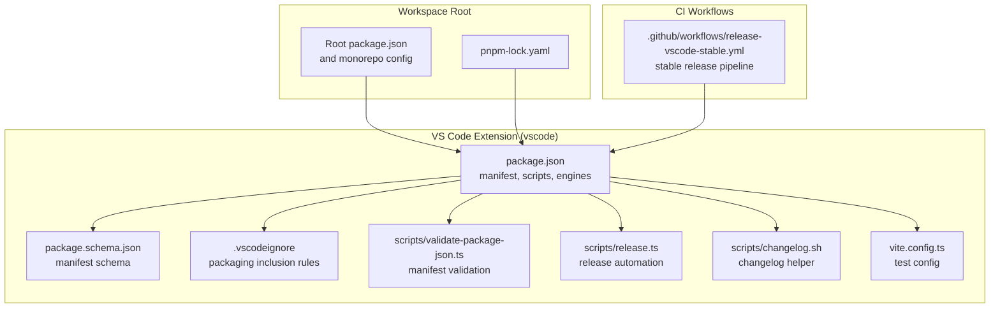
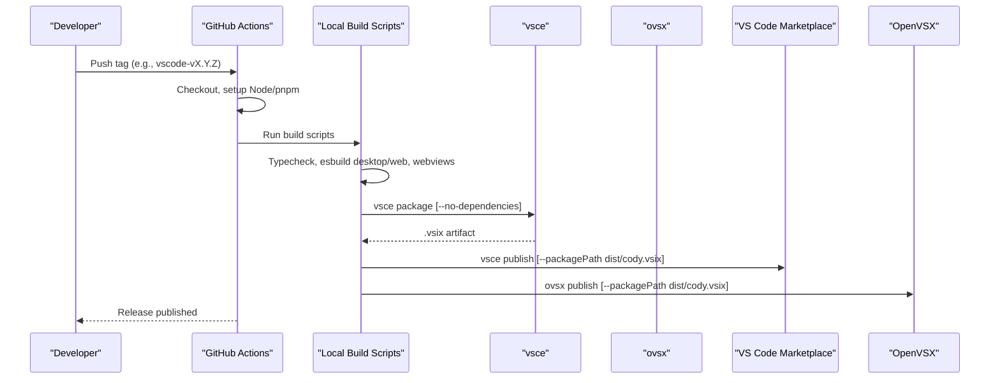
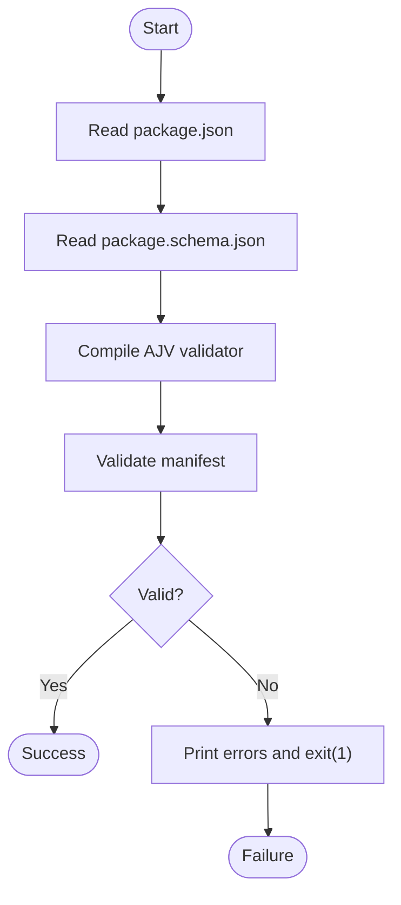
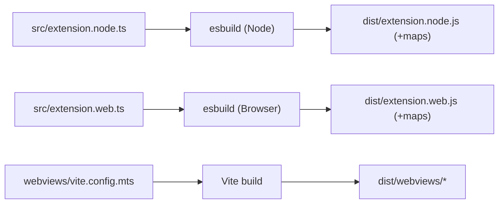
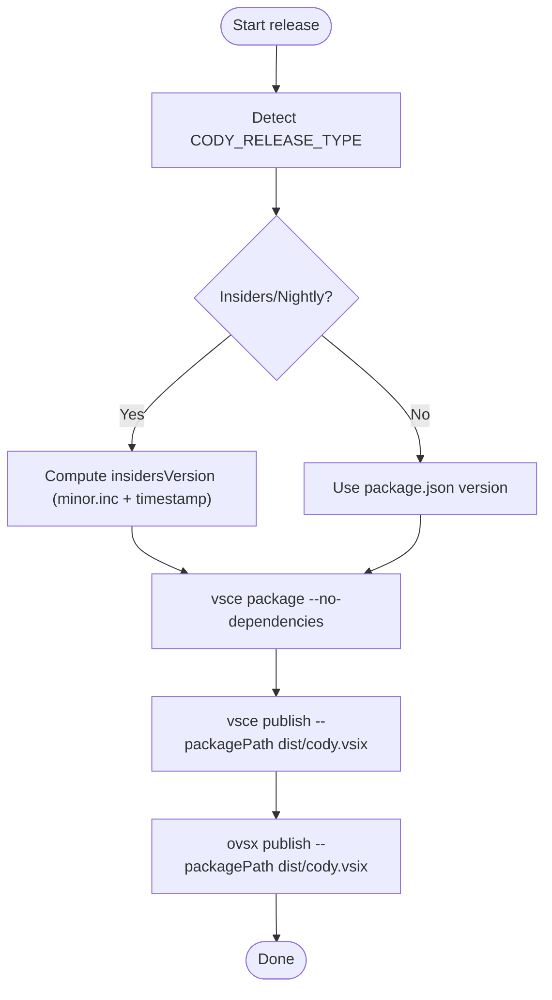
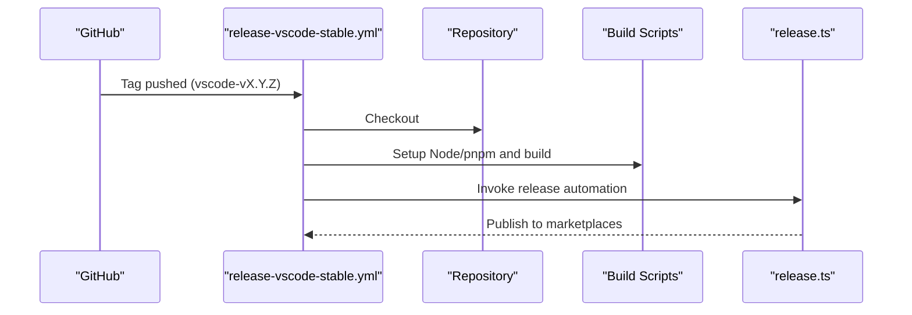
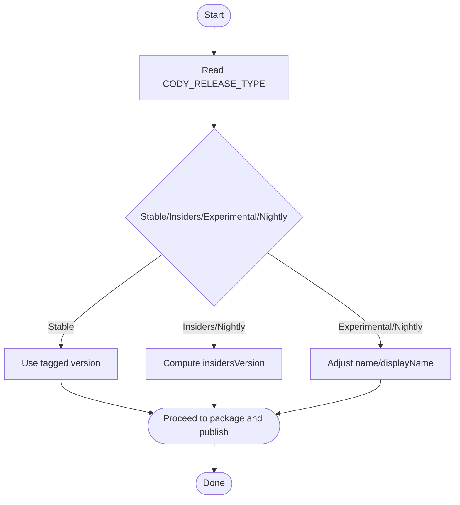
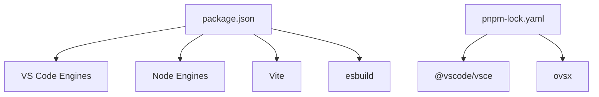
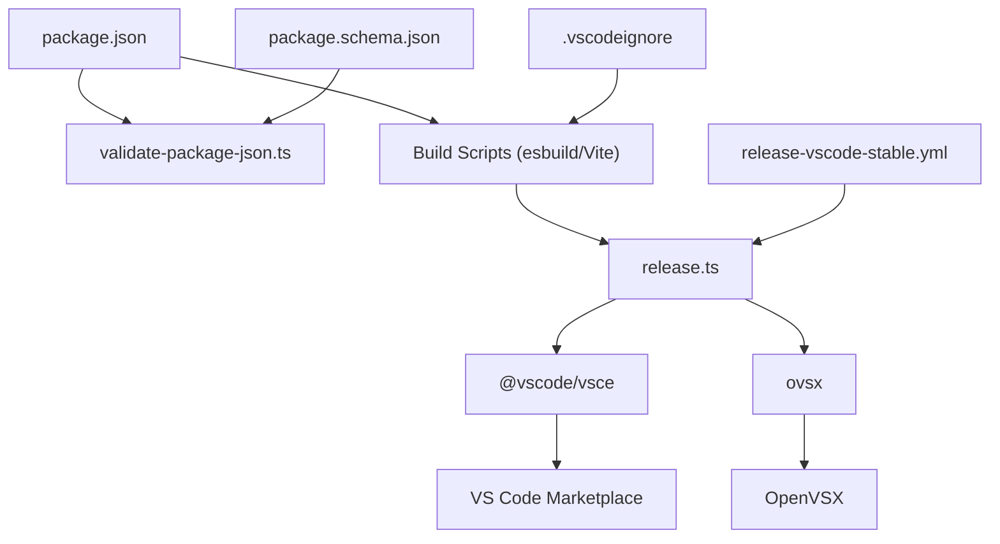

# Deployment & Packaging

<cite>
**Referenced Files in This Document**
- [package.json](file://vscode/package.json)
- [.vscodeignore](file://vscode/.vscodeignore)
- [package.schema.json](file://vscode/package.schema.json)
- [validate-package-json.ts](file://vscode/scripts/validate-package-json.ts)
- [release.ts](file://vscode/scripts/release.ts)
- [changelog.sh](file://vscode/scripts/changelog.sh)
- [vite.config.ts](file://vscode/vite.config.ts)
- [release-vscode-stable.yml](file://.github/workflows/release-vscode-stable.yml)
- [pnpm-lock.yaml](file://pnpm-lock.yaml)
</cite>

## Table of Contents
1. [Introduction](#introduction)
2. [Project Structure](#project-structure)
3. [Core Components](#core-components)
4. [Architecture Overview](#architecture-overview)
5. [Detailed Component Analysis](#detailed-component-analysis)
6. [Dependency Analysis](#dependency-analysis)
7. [Performance Considerations](#performance-considerations)
8. [Troubleshooting Guide](#troubleshooting-guide)
9. [Conclusion](#conclusion)
10. [Appendices](#appendices)

## Introduction
This document explains the VS Code extension’s deployment and packaging process. It covers the extension manifest configuration, marketplace publishing workflow, version management strategies, build system architecture, asset bundling, dependency management, packaging for different platforms, distribution channels, continuous integration pipeline, automated testing, and release automation. It also includes troubleshooting guidance for common packaging issues, marketplace submission requirements, extension verification processes, update mechanisms, backward compatibility considerations, and rollback strategies.

## Project Structure
The VS Code extension is organized as a monorepo workspace with multiple packages. The extension package resides under the vscode directory and defines the manifest, build scripts, and packaging configuration. Supporting scripts handle validation, release automation, and changelog generation. The CI pipeline is defined in GitHub Actions workflows.

**Diagram sources**
- [package.json:1-120](file://vscode/package.json#L1-L120)
- [package.schema.json:1-105](file://vscode/package.schema.json#L1-L105)
- [.vscodeignore:1-25](file://vscode/.vscodeignore#L1-L25)
- [validate-package-json.ts:1-66](file://vscode/scripts/validate-package-json.ts#L1-L66)
- [release.ts:1-229](file://vscode/scripts/release.ts#L1-L229)
- [changelog.sh:1-22](file://vscode/scripts/changelog.sh#L1-L22)
- [vite.config.ts:1-16](file://vscode/vite.config.ts#L1-L16)
- [release-vscode-stable.yml:1-39](file://.github/workflows/release-vscode-stable.yml#L1-L39)
- [pnpm-lock.yaml:7752-7780](file://pnpm-lock.yaml#L7752-L7780)

**Section sources**
- [package.json:1-120](file://vscode/package.json#L1-L120)
- [.vscodeignore:1-25](file://vscode/.vscodeignore#L1-L25)
- [package.schema.json:1-105](file://vscode/package.schema.json#L1-L105)
- [validate-package-json.ts:1-66](file://vscode/scripts/validate-package-json.ts#L1-L66)
- [release.ts:1-229](file://vscode/scripts/release.ts#L1-L229)
- [changelog.sh:1-22](file://vscode/scripts/changelog.sh#L1-L22)
- [vite.config.ts:1-16](file://vscode/vite.config.ts#L1-L16)
- [release-vscode-stable.yml:1-39](file://.github/workflows/release-vscode-stable.yml#L1-L39)
- [pnpm-lock.yaml:7752-7780](file://pnpm-lock.yaml#L7752-L7780)

## Core Components
- Manifest and engine requirements: Defines the extension identity, activation events, main/browser entry points, engines, categories, keywords, and contribution points.
- Build and bundling scripts: Orchestrated via npm-style scripts to compile TypeScript, bundle desktop and web targets, and build webviews.
- Packaging and distribution: Uses vsce to package and publish to the VS Code Marketplace and OpenVSX, with environment-driven release types and tokens.
- Manifest validation: Enforces a strict schema for the package manifest to prevent invalid configurations.
- CI release pipeline: Automated stable releases triggered by version tags.

Key responsibilities:
- package.json: Manifest, engines, activation events, entry points, scripts, contributions.
- .vscodeignore: Packaging inclusion rules for dist assets, resources, and metadata.
- package.schema.json + validate-package-json.ts: Manifest schema enforcement and validation.
- release.ts: Release automation, version management, packaging, and publishing to marketplaces.
- release-vscode-stable.yml: CI workflow for stable releases.

**Section sources**
- [package.json:1-120](file://vscode/package.json#L1-L120)
- [.vscodeignore:1-25](file://vscode/.vscodeignore#L1-L25)
- [package.schema.json:1-105](file://vscode/package.schema.json#L1-L105)
- [validate-package-json.ts:1-66](file://vscode/scripts/validate-package-json.ts#L1-L66)
- [release.ts:1-229](file://vscode/scripts/release.ts#L1-L229)
- [release-vscode-stable.yml:1-39](file://.github/workflows/release-vscode-stable.yml#L1-L39)

## Architecture Overview
The packaging and release architecture integrates local build scripts with CI automation and external marketplaces.

**Diagram sources**
- [release.ts:156-209](file://vscode/scripts/release.ts#L156-L209)
- [release-vscode-stable.yml:1-39](file://.github/workflows/release-vscode-stable.yml#L1-L39)

## Detailed Component Analysis

### Manifest Configuration and Validation
- Manifest schema enforcement ensures that contributions conform to expected patterns (e.g., command and view IDs prefixed with cody., views container cody, etc.).
- The validation script loads a schema (cached or fetched remotely) and validates package.json against it, exiting with errors if invalid.

**Diagram sources**
- [validate-package-json.ts:9-35](file://vscode/scripts/validate-package-json.ts#L9-L35)
- [package.schema.json:1-105](file://vscode/package.schema.json#L1-L105)

**Section sources**
- [package.schema.json:1-105](file://vscode/package.schema.json#L1-L105)
- [validate-package-json.ts:1-66](file://vscode/scripts/validate-package-json.ts#L1-L66)

### Build System Architecture and Asset Bundling
- Desktop target: Bundled via esbuild with Node platform, externalizing vscode and typescript, aliasing specific modules, and emitting sourcemaps.
- Web target: Bundled via esbuild with browser platform, aliasing Node polyfills and externalizing vscode and Node built-ins.
- Webviews: Built using Vite with a dedicated config for unit/benchmark tests and environment-specific setups.
- Scripts orchestrate typechecking, desktop/web builds, and webviews builds in development and production modes.

**Diagram sources**
- [package.json:34-37](file://vscode/package.json#L34-L37)
- [vite.config.ts:1-16](file://vscode/vite.config.ts#L1-L16)

**Section sources**
- [package.json:22-37](file://vscode/package.json#L22-L37)
- [vite.config.ts:1-16](file://vscode/vite.config.ts#L1-L16)

### Packaging and Distribution Channels
- Packaging: The release script invokes vsce package with options to avoid dependencies and produce a .vsix artifact.
- Publishing: The script publishes to both the VS Code Marketplace and OpenVSX using tokens from environment variables.
- Release types: Stable, Insiders, Experimental, and Nightly are supported, with special handling for insider versions and testing extension naming.

**Diagram sources**
- [release.ts:102-209](file://vscode/scripts/release.ts#L102-L209)

**Section sources**
- [release.ts:1-229](file://vscode/scripts/release.ts#L1-L229)

### Continuous Integration Pipeline and Automated Testing
- Stable release workflow: Triggered by tags matching the pattern vscode-v*, extracts version, verifies against package.json, and proceeds with release steps.
- Local testing and e2e: The package.json includes scripts for unit tests, e2e tests, and building artifacts for testing.

**Diagram sources**
- [release-vscode-stable.yml:1-39](file://.github/workflows/release-vscode-stable.yml#L1-L39)
- [release.ts:156-209](file://vscode/scripts/release.ts#L156-L209)

**Section sources**
- [release-vscode-stable.yml:1-39](file://.github/workflows/release-vscode-stable.yml#L1-L39)
- [package.json:45-51](file://vscode/package.json#L45-L51)

### Version Management Strategies
- Stable releases: Triggered by tags; CI reads the tag to derive the version and compares with package.json.
- Insiders/Nightly: Compute a version derived from the current minor increment plus a Unix timestamp suffix; outputs a version tag for CI consumption.
- Experimental/Nightly testing builds: Adjust package name and display name for testing channels.

**Diagram sources**
- [release.ts:33-63](file://vscode/scripts/release.ts#L33-L63)
- [release.ts:131-154](file://vscode/scripts/release.ts#L131-L154)

**Section sources**
- [release.ts:33-63](file://vscode/scripts/release.ts#L33-L63)
- [release.ts:131-154](file://vscode/scripts/release.ts#L131-L154)

### Dependency Management and Tooling
- External packaging tools: vsce and ovsx are used for packaging and publishing; their versions are managed in the lockfile.
- Build tools: esbuild and Vite are used for bundling; Node and VS Code engines are declared in the manifest.

**Diagram sources**
- [package.json:116-121](file://vscode/package.json#L116-L121)
- [pnpm-lock.yaml:7752-7780](file://pnpm-lock.yaml#L7752-L7780)

**Section sources**
- [package.json:116-121](file://vscode/package.json#L116-L121)
- [pnpm-lock.yaml:7752-7780](file://pnpm-lock.yaml#L7752-L7780)

### Packaging Inclusion Rules (.vscodeignore)
- By default, everything is excluded; only explicitly listed paths are included in the packaged extension.
- Ensures only necessary assets (dist outputs, resources, metadata) are shipped.

**Section sources**
- [.vscodeignore:1-25](file://vscode/.vscodeignore#L1-L25)

### Changelog Automation Helper
- A helper script generates changelog entries between two commits and appends them to the changelog under an “Uncategorized” section.

**Section sources**
- [changelog.sh:1-22](file://vscode/scripts/changelog.sh#L1-L22)

## Dependency Analysis
The packaging and release pipeline depends on:
- Manifest validation to ensure schema compliance.
- Build scripts to produce deterministic bundles.
- CI workflow to enforce tagging and release conditions.
- External tools (vsce, ovsx) for packaging and publishing.

**Diagram sources**
- [package.json:1-120](file://vscode/package.json#L1-L120)
- [package.schema.json:1-105](file://vscode/package.schema.json#L1-L105)
- [validate-package-json.ts:1-66](file://vscode/scripts/validate-package-json.ts#L1-L66)
- [release.ts:156-209](file://vscode/scripts/release.ts#L156-L209)
- [release-vscode-stable.yml:1-39](file://.github/workflows/release-vscode-stable.yml#L1-L39)
- [pnpm-lock.yaml:7752-7780](file://pnpm-lock.yaml#L7752-L7780)

**Section sources**
- [package.json:1-120](file://vscode/package.json#L1-L120)
- [package.schema.json:1-105](file://vscode/package.schema.json#L1-L105)
- [validate-package-json.ts:1-66](file://vscode/scripts/validate-package-json.ts#L1-L66)
- [release.ts:156-209](file://vscode/scripts/release.ts#L156-L209)
- [release-vscode-stable.yml:1-39](file://.github/workflows/release-vscode-stable.yml#L1-L39)
- [pnpm-lock.yaml:7752-7780](file://pnpm-lock.yaml#L7752-L7780)

## Performance Considerations
- Minimize bundle size by relying on externalization and aliasing strategies in esbuild to avoid duplicating large libraries in both desktop and web bundles.
- Prefer incremental builds and caching in CI to reduce build times.
- Keep the manifest minimal and validated to avoid re-runs due to schema errors.

## Troubleshooting Guide
Common packaging and marketplace issues:
- Manifest validation failures: Ensure package.json conforms to the schema enforced by validate-package-json.ts. Use the provided update mechanism to refresh cached schemas if needed.
- Missing marketplace tokens: The release script requires VSCODE_MARKETPLACE_TOKEN and VSCODE_OPENVSX_TOKEN. Verify environment variables are set in CI.
- Invalid version or release type: The release script validates versions and release types. Confirm CODY_RELEASE_TYPE and version format.
- Packaging excludes unintended files: Review .vscodeignore to ensure dist, resources, and metadata are included.
- CI tagging mismatch: For stable releases, ensure the tag matches the expected pattern and aligns with the version in package.json.

Verification steps:
- Run manifest validation locally before packaging.
- Dry-run the release process to preview actions.
- Confirm the generated .vsix contains expected assets per .vscodeignore.

**Section sources**
- [validate-package-json.ts:27-34](file://vscode/scripts/validate-package-json.ts#L27-L34)
- [release.ts:121-129](file://vscode/scripts/release.ts#L121-L129)
- [release.ts:44-53](file://vscode/scripts/release.ts#L44-L53)
- [.vscodeignore:10-24](file://vscode/.vscodeignore#L10-L24)
- [release-vscode-stable.yml:28-39](file://.github/workflows/release-vscode-stable.yml#L28-L39)

## Conclusion
The VS Code extension’s deployment and packaging system combines robust manifest validation, deterministic builds, and automated CI/CD to deliver reliable releases across multiple channels. By adhering to the documented versioning, packaging, and validation practices, teams can maintain high-quality releases while minimizing manual intervention.

## Appendices

### Appendix A: Manifest Schema Highlights
- Enforces cody.-prefixed identifiers for commands, views, and submenus.
- Validates structure of contributes (colors, views, commands, keybindings, submenus, menus, configuration, icons).

**Section sources**
- [package.schema.json:8-102](file://vscode/package.schema.json#L8-L102)

### Appendix B: Build Scripts Reference
- Development and production builds for desktop and web.
- Webviews build via Vite.
- Pre-publish and uninstall hooks.

**Section sources**
- [package.json:22-55](file://vscode/package.json#L22-L55)

### Appendix C: Release Types and Behavior
- Stable: Publishes to the stable channel; removes experimental settings from configuration properties.
- Insiders/Nightly: Publishes as pre-release; computes a version with a timestamp suffix; emits a version tag for CI.
- Experimental/Nightly testing: Adjusts package name and display name for testing builds.

**Section sources**
- [release.ts:33-63](file://vscode/scripts/release.ts#L33-L63)
- [release.ts:102-119](file://vscode/scripts/release.ts#L102-L119)
- [release.ts:131-154](file://vscode/scripts/release.ts#L131-L154)