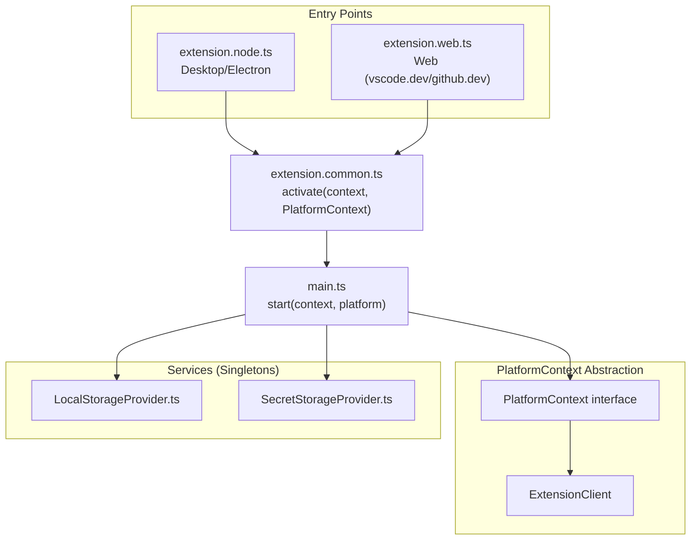
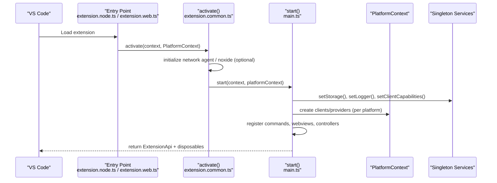
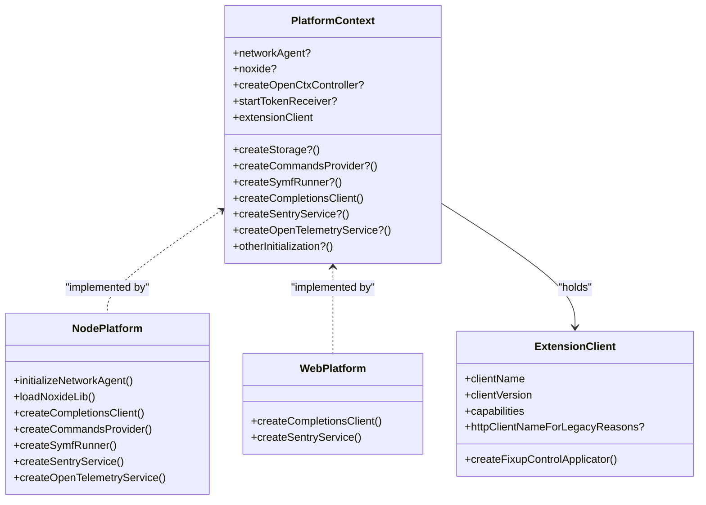
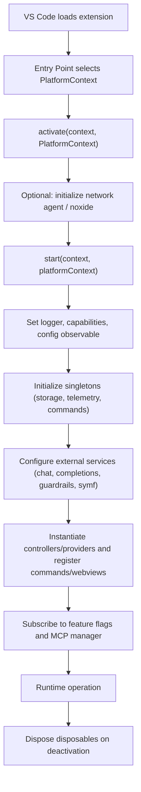
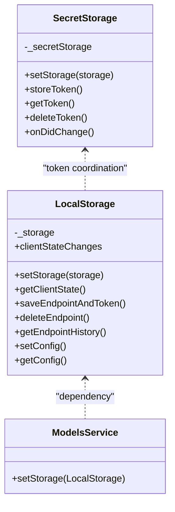
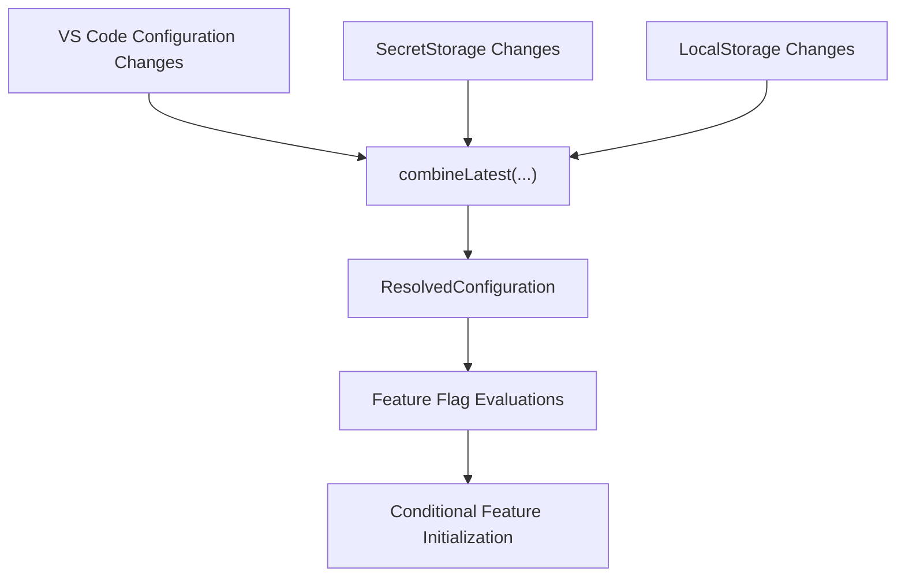
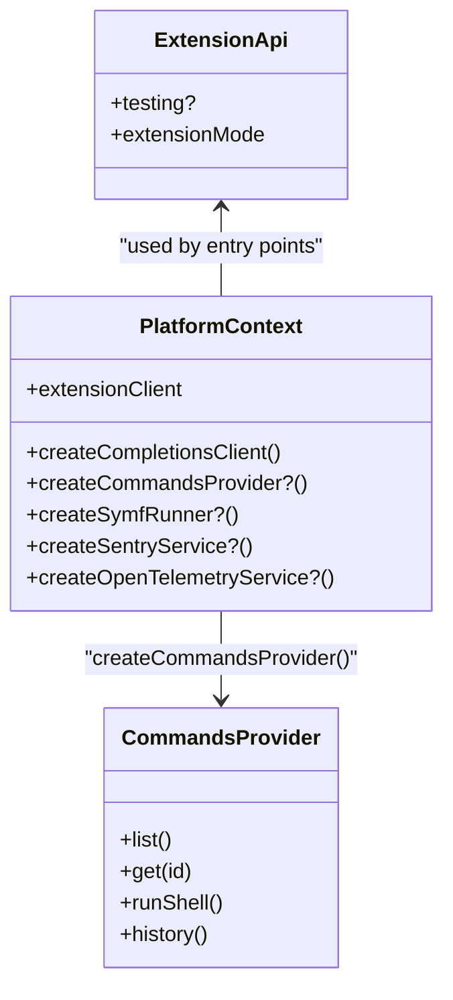
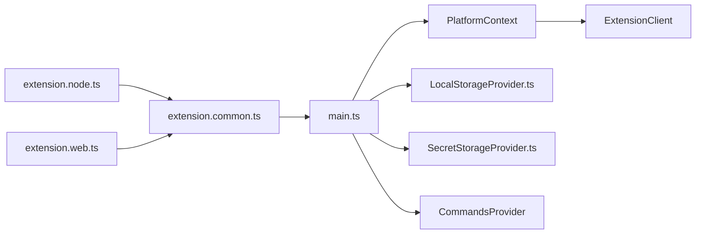

# Extension Architecture

<cite>
**Referenced Files in This Document**
- [main.ts](file://vscode/src/main.ts)
- [extension.common.ts](file://vscode/src/extension.common.ts)
- [extension.node.ts](file://vscode/src/extension.node.ts)
- [extension.web.ts](file://vscode/src/extension.web.ts)
- [extension-api.ts](file://vscode/src/extension-api.ts)
- [extension-client.ts](file://vscode/src/extension-client.ts)
- [LocalStorageProvider.ts](file://vscode/src/services/LocalStorageProvider.ts)
- [SecretStorageProvider.ts](file://vscode/src/services/SecretStorageProvider.ts)
- [modelMigrator.ts](file://vscode/src/models/modelMigrator.ts)
- [provider.ts](file://vscode/src/commands/services/provider.ts)
- [package.json](file://vscode/package.json)
</cite>

## Table of Contents
1. [Introduction](#introduction)
2. [Project Structure](#project-structure)
3. [Core Components](#core-components)
4. [Architecture Overview](#architecture-overview)
5. [Detailed Component Analysis](#detailed-component-analysis)
6. [Dependency Analysis](#dependency-analysis)
7. [Performance Considerations](#performance-considerations)
8. [Troubleshooting Guide](#troubleshooting-guide)
9. [Conclusion](#conclusion)

## Introduction
This document explains the VS Code extension architecture with a focus on multi-platform support for Node.js (desktop Electron) and web environments, the PlatformContext abstraction, and platform-specific implementations. It covers the extension lifecycle (activation, initialization, deactivation), singleton-based shared services, observable-driven reactivity with RxJS-style observables, and dependency injection patterns. It also includes diagrams illustrating component relationships, data flow, and cross-platform abstractions.

## Project Structure
The extension is organized into:
- Entry points for Node.js and web platforms that construct a PlatformContext and delegate to a common activation routine.
- A common activation routine that orchestrates initialization, registers commands, and wires services.
- Services and providers that act as singletons and expose observable streams for configuration and secrets.
- Commands and controllers that depend on injected providers and clients.

**Diagram sources**
- [extension.node.ts:25-58](file://vscode/src/extension.node.ts#L25-L58)
- [extension.web.ts:14-23](file://vscode/src/extension.web.ts#L14-L23)
- [extension.common.ts:44-77](file://vscode/src/extension.common.ts#L44-L77)
- [main.ts:122-214](file://vscode/src/main.ts#L122-L214)
- [LocalStorageProvider.ts:387-391](file://vscode/src/services/LocalStorageProvider.ts#L387-L391)
- [SecretStorageProvider.ts:245-255](file://vscode/src/services/SecretStorageProvider.ts#L245-L255)

**Section sources**
- [extension.node.ts:25-58](file://vscode/src/extension.node.ts#L25-L58)
- [extension.web.ts:14-23](file://vscode/src/extension.web.ts#L14-L23)
- [extension.common.ts:44-77](file://vscode/src/extension.common.ts#L44-L77)
- [main.ts:122-214](file://vscode/src/main.ts#L122-L214)
- [package.json:120-122](file://vscode/package.json#L120-L122)

## Core Components
- PlatformContext: A cross-platform contract that abstracts platform-specific factories and capabilities. It defines creation functions for clients, services, and optional integrations (e.g., Noxide, Symf, Sentry, OpenTelemetry), plus a client capability object.
- ExtensionClient: Encapsulates client-specific behavior (e.g., VSCode-specific fixup controls) and exposes client name/version and capabilities.
- Singletons: LocalStorage and SecretStorage are configured once at activation and accessed globally via module imports.
- Observable-driven configuration: The resolved configuration stream is derived from VS Code configuration changes, secret changes, and local state changes.

Key responsibilities:
- Node platform entry point initializes network agent, Noxide, telemetry, and commands provider.
- Web platform entry point configures browser-based clients and web-specific services.
- Common activation sets logging, client capabilities, and configuration observables, then registers all features.

**Section sources**
- [extension.common.ts:24-37](file://vscode/src/extension.common.ts#L24-L37)
- [extension-client.ts:11-43](file://vscode/src/extension-client.ts#L11-L43)
- [LocalStorageProvider.ts:53-72](file://vscode/src/services/LocalStorageProvider.ts#L53-L72)
- [SecretStorageProvider.ts:34-46](file://vscode/src/services/SecretStorageProvider.ts#L34-L46)
- [main.ts:144-203](file://vscode/src/main.ts#L144-L203)

## Architecture Overview
The architecture separates concerns across layers:
- Entry points select platform-specific implementations and assemble PlatformContext.
- Common activation performs early setup (logging, capabilities, configuration observables).
- Registration stage constructs services, wires observables, and registers commands/webviews.
- Lifecycle: activation → initialization → runtime → deactivation cleanup.

**Diagram sources**
- [extension.node.ts:25-58](file://vscode/src/extension.node.ts#L25-L58)
- [extension.web.ts:14-23](file://vscode/src/extension.web.ts#L14-L23)
- [extension.common.ts:44-77](file://vscode/src/extension.common.ts#L44-L77)
- [main.ts:122-214](file://vscode/src/main.ts#L122-L214)

## Detailed Component Analysis

### PlatformContext and Platform-Specific Implementations
- Node.js platform:
  - Initializes a delegating network agent, optional Noxide library, Symf runner, Sentry, and OpenTelemetry services.
  - Creates a Node-based completions client and a commands provider.
- Web platform:
  - Creates a browser-based completions client and a web Sentry service.
  - Exposes a factory to override parts of PlatformContext for ad-hoc builds.

**Diagram sources**
- [extension.common.ts:24-37](file://vscode/src/extension.common.ts#L24-L37)
- [extension-client.ts:11-43](file://vscode/src/extension-client.ts#L11-L43)
- [extension.node.ts:45-57](file://vscode/src/extension.node.ts#L45-L57)
- [extension.web.ts:18-22](file://vscode/src/extension.web.ts#L18-L22)

**Section sources**
- [extension.node.ts:45-57](file://vscode/src/extension.node.ts#L45-L57)
- [extension.web.ts:18-22](file://vscode/src/extension.web.ts#L18-L22)
- [extension.common.ts:24-37](file://vscode/src/extension.common.ts#L24-L37)
- [extension-client.ts:11-43](file://vscode/src/extension-client.ts#L11-L43)

### Extension Lifecycle: Activation, Initialization, and Deactivation
- Activation:
  - Entry points construct PlatformContext and call the common activate routine.
  - Optional network agent and Noxide initialization occur before configuration resolution begins.
- Initialization:
  - Logging and client capabilities are set.
  - Configuration observable is established from VS Code configuration, secret storage, and local state.
  - Singletons are initialized (storage, telemetry, commands provider).
  - External services (chat, completions, guardrails, symf) are configured.
  - Controllers and providers are instantiated and registered (chat, fixup, edit, autoedits, supercompletions).
  - Feature flags and MCP manager are wired conditionally.
- Deactivation:
  - Disposables collected during registration are disposed when the extension deactivates.

**Diagram sources**
- [extension.common.ts:44-77](file://vscode/src/extension.common.ts#L44-L77)
- [main.ts:122-214](file://vscode/src/main.ts#L122-L214)
- [main.ts:217-357](file://vscode/src/main.ts#L217-L357)

**Section sources**
- [extension.common.ts:44-77](file://vscode/src/extension.common.ts#L44-L77)
- [main.ts:122-214](file://vscode/src/main.ts#L122-L214)
- [main.ts:217-357](file://vscode/src/main.ts#L217-L357)

### Singleton Pattern and Shared Services
- LocalStorage:
  - Set once at activation via platform.createStorage or context.globalState.
  - Provides observable client state changes and centralized persistence for chat history, endpoints, model preferences, and device metrics.
- SecretStorage:
  - Set once at activation via context.secrets.
  - Provides secure token storage and emits changes for the current token.
- Models service:
  - Receives the LocalStorage instance for model preference persistence and migration.

**Diagram sources**
- [LocalStorageProvider.ts:27-90](file://vscode/src/services/LocalStorageProvider.ts#L27-L90)
- [LocalStorageProvider.ts:322-328](file://vscode/src/services/LocalStorageProvider.ts#L322-L328)
- [SecretStorageProvider.ts:26-46](file://vscode/src/services/SecretStorageProvider.ts#L26-L46)
- [modelMigrator.ts:1-58](file://vscode/src/models/modelMigrator.ts#L1-L58)

**Section sources**
- [LocalStorageProvider.ts:53-72](file://vscode/src/services/LocalStorageProvider.ts#L53-L72)
- [LocalStorageProvider.ts:83-90](file://vscode/src/services/LocalStorageProvider.ts#L83-L90)
- [LocalStorageProvider.ts:108-132](file://vscode/src/services/LocalStorageProvider.ts#L108-L132)
- [LocalStorageProvider.ts:322-328](file://vscode/src/services/LocalStorageProvider.ts#L322-L328)
- [SecretStorageProvider.ts:44-46](file://vscode/src/services/SecretStorageProvider.ts#L44-L46)
- [SecretStorageProvider.ts:124-132](file://vscode/src/services/SecretStorageProvider.ts#L124-L132)
- [modelMigrator.ts:1-58](file://vscode/src/models/modelMigrator.ts#L1-L58)

### Observable-Based Reactive Programming
- Configuration observable:
  - Derived from VS Code configuration changes, secret storage changes, and local state changes.
  - Emits a ResolvedConfiguration object used throughout the extension.
- Feature flags and feature toggles:
  - Evaluated observables drive conditional initialization of features (e.g., MCP manager, autoedits, supercompletions).
- Error handling:
  - Observables incorporate error handling to keep UI responsive and logging consistent.

**Diagram sources**
- [main.ts:151-203](file://vscode/src/main.ts#L151-L203)
- [main.ts:464-525](file://vscode/src/main.ts#L464-L525)
- [main.ts:316-334](file://vscode/src/main.ts#L316-L334)

**Section sources**
- [main.ts:151-203](file://vscode/src/main.ts#L151-L203)
- [main.ts:464-525](file://vscode/src/main.ts#L464-L525)
- [main.ts:316-334](file://vscode/src/main.ts#L316-L334)

### Dependency Injection Patterns
- PlatformContext acts as a DI container for platform-specific factories and services.
- Services are singletons configured once and accessed globally via module imports.
- CommandsProvider is constructed per platform and injected into controllers and command registries.

**Diagram sources**
- [extension.common.ts:24-37](file://vscode/src/extension.common.ts#L24-L37)
- [provider.ts:34-141](file://vscode/src/commands/services/provider.ts#L34-L141)
- [extension-api.ts:5-18](file://vscode/src/extension-api.ts#L5-L18)

**Section sources**
- [extension.common.ts:24-37](file://vscode/src/extension.common.ts#L24-L37)
- [provider.ts:34-141](file://vscode/src/commands/services/provider.ts#L34-L141)
- [extension-api.ts:5-18](file://vscode/src/extension-api.ts#L5-L18)

### Extension Entry Points and Startup Orchestration
- Desktop (Node.js):
  - Loads network patch, Sentry, Noxide, and Symf if enabled.
  - Builds PlatformContext with Node-specific factories.
- Web:
  - Builds PlatformContext with browser-based factories and web Sentry.
- Common:
  - Sets logger, client capabilities, and configuration observable.
  - Registers commands, webviews, controllers, and diagnostics.

**Section sources**
- [extension.node.ts:1-95](file://vscode/src/extension.node.ts#L1-L95)
- [extension.web.ts:1-35](file://vscode/src/extension.web.ts#L1-L35)
- [main.ts:122-214](file://vscode/src/main.ts#L122-L214)

### Resource Management
- Disposables:
  - All registrations (commands, webviews, subscriptions) are collected and disposed upon deactivation.
- Memory management:
  - Observables are unsubscribed when features are disabled or when flags change.
  - In-memory ephemeral storages are available for testing and profiling.
- Extension isolation:
  - PlatformContext isolates platform differences; services are singletons scoped to the extension lifetime.

**Section sources**
- [main.ts:217-357](file://vscode/src/main.ts#L217-L357)
- [LocalStorageProvider.ts:408-432](file://vscode/src/services/LocalStorageProvider.ts#L408-L432)
- [SecretStorageProvider.ts:135-223](file://vscode/src/services/SecretStorageProvider.ts#L135-L223)

## Dependency Analysis
- Entry points depend on PlatformContext to supply platform-specific implementations.
- Common activation depends on PlatformContext to create clients and services.
- Services depend on each other (e.g., LocalStorage coordinates with SecretStorage).
- CommandsProvider depends on VS Code APIs and is constructed by PlatformContext.

**Diagram sources**
- [extension.node.ts:25-58](file://vscode/src/extension.node.ts#L25-L58)
- [extension.web.ts:14-23](file://vscode/src/extension.web.ts#L14-L23)
- [extension.common.ts:44-77](file://vscode/src/extension.common.ts#L44-L77)
- [main.ts:122-214](file://vscode/src/main.ts#L122-L214)
- [LocalStorageProvider.ts:387-391](file://vscode/src/services/LocalStorageProvider.ts#L387-L391)
- [SecretStorageProvider.ts:245-255](file://vscode/src/services/SecretStorageProvider.ts#L245-L255)
- [provider.ts:34-141](file://vscode/src/commands/services/provider.ts#L34-L141)

**Section sources**
- [extension.node.ts:25-58](file://vscode/src/extension.node.ts#L25-L58)
- [extension.web.ts:14-23](file://vscode/src/extension.web.ts#L14-L23)
- [extension.common.ts:44-77](file://vscode/src/extension.common.ts#L44-L77)
- [main.ts:122-214](file://vscode/src/main.ts#L122-L214)
- [LocalStorageProvider.ts:387-391](file://vscode/src/services/LocalStorageProvider.ts#L387-L391)
- [SecretStorageProvider.ts:245-255](file://vscode/src/services/SecretStorageProvider.ts#L245-L255)
- [provider.ts:34-141](file://vscode/src/commands/services/provider.ts#L34-L141)

## Performance Considerations
- Reactive streams:
  - Use distinctUntilChanged to minimize redundant work when configuration or auth status changes.
  - Prefer switchMap to cancel in-flight operations when configuration changes.
- Feature toggles:
  - EnableFeature pattern ensures resources are disposed when features are disabled.
- Observables:
  - Avoid long-lived subscriptions by using take and finalize patterns.
- Memory:
  - Use in-memory ephemeral storages for testing to avoid persistent state.
- Network:
  - Initialize network agent early to avoid race conditions with configuration resolution.

[No sources needed since this section provides general guidance]

## Troubleshooting Guide
- Export logs and heap snapshots:
  - Debug commands provide export logs, open output channel, enable verbose debug mode, report issue, and heap dump.
- Authentication and endpoints:
  - LocalStorage and SecretStorage coordinate endpoint and token persistence; reinstall cleanup clears endpoint history and tokens.
- Setup notifications:
  - On first activation, a setup notification is shown after configuration resolves.

**Section sources**
- [main.ts:641-652](file://vscode/src/main.ts#L641-L652)
- [main.ts:176-200](file://vscode/src/main.ts#L176-L200)
- [main.ts:313](file://vscode/src/main.ts#L313)
- [LocalStorageProvider.ts:108-132](file://vscode/src/services/LocalStorageProvider.ts#L108-L132)
- [SecretStorageProvider.ts:114-118](file://vscode/src/services/SecretStorageProvider.ts#L114-L118)

## Conclusion
The extension employs a clean separation of concerns through PlatformContext, enabling consistent behavior across Node.js and web environments. The common activation routine centralizes initialization, while singletons and observable streams provide robust, reactive foundations. Dependency injection via factories ensures testability and modularity. The lifecycle is well-orchestrated with proper resource management and extension isolation.