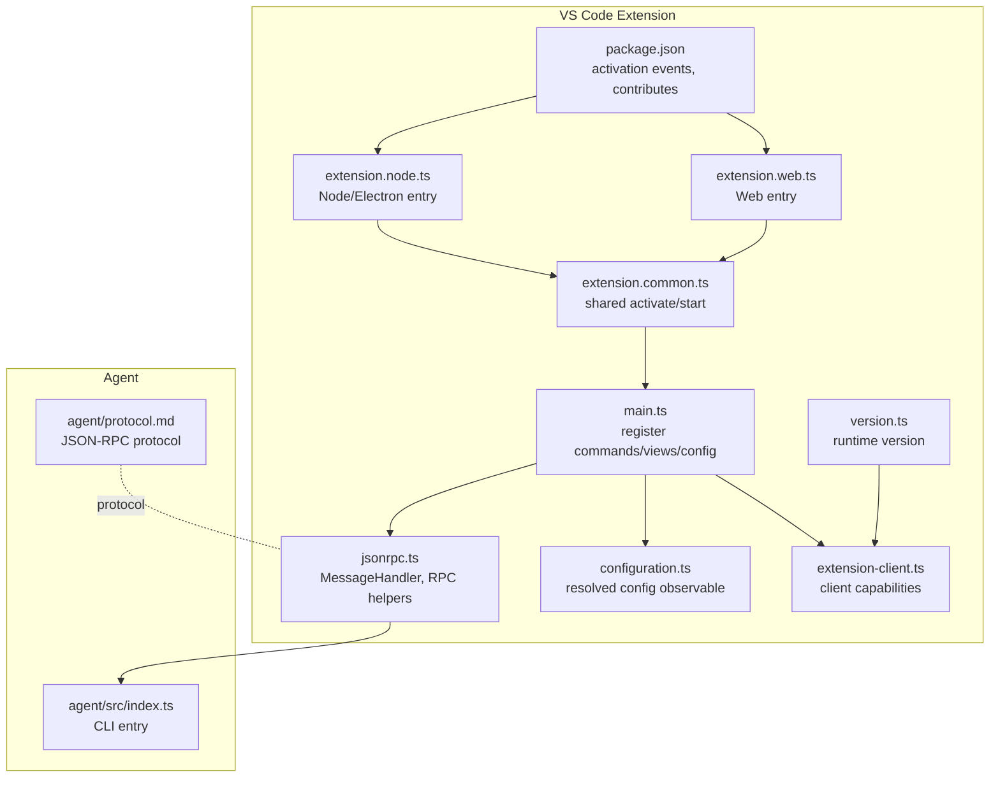
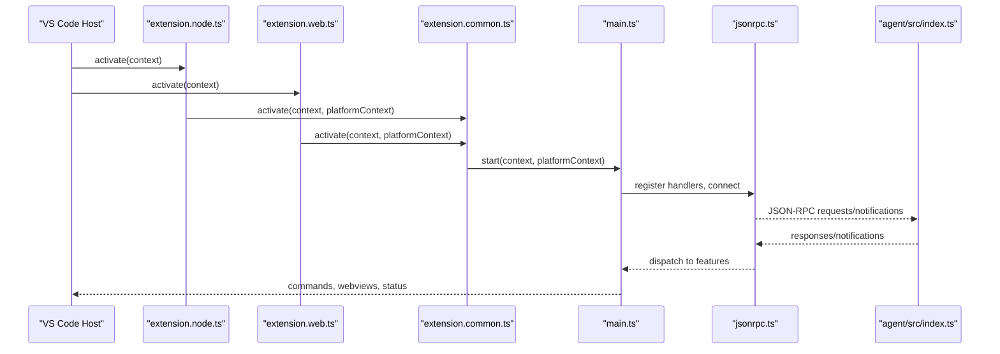
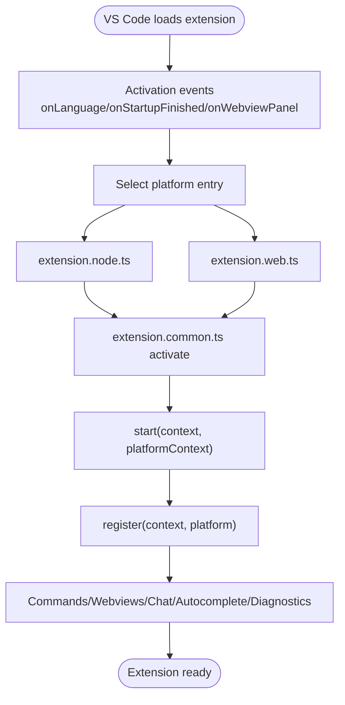
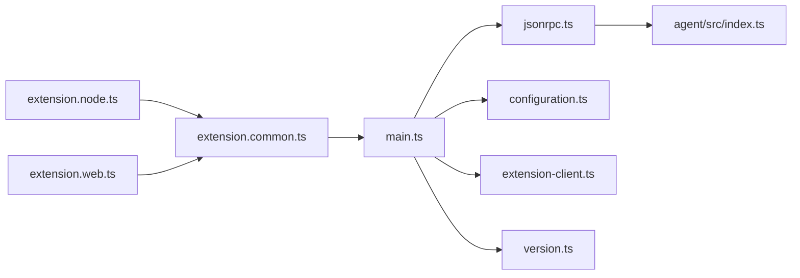

# VS Code Extension

<cite>
**Referenced Files in This Document**
- [package.json](file://vscode/package.json)
- [main.ts](file://vscode/src/main.ts)
- [extension.node.ts](file://vscode/src/extension.node.ts)
- [extension.web.ts](file://vscode/src/extension.web.ts)
- [extension.common.ts](file://vscode/src/extension.common.ts)
- [extension-api.ts](file://vscode/src/extension-api.ts)
- [extension-client.ts](file://vscode/src/extension-client.ts)
- [configuration.ts](file://vscode/src/configuration.ts)
- [jsonrpc.ts](file://vscode/src/jsonrpc/jsonrpc.ts)
- [index.ts](file://agent/src/index.ts)
- [protocol.md](file://agent/protocol.md)
- [version.ts](file://vscode/src/version.ts)
- [index.ts](file://vscode/src/net/index.ts)
- [sentry.ts](file://vscode/src/services/sentry/sentry.ts)
</cite>

## Table of Contents
1. [Introduction](#introduction)
2. [Project Structure](#project-structure)
3. [Core Components](#core-components)
4. [Architecture Overview](#architecture-overview)
5. [Detailed Component Analysis](#detailed-component-analysis)
6. [Dependency Analysis](#dependency-analysis)
7. [Performance Considerations](#performance-considerations)
8. [Troubleshooting Guide](#troubleshooting-guide)
9. [Conclusion](#conclusion)
10. [Appendices](#appendices)

## Introduction
This document explains the VS Code extension implementation for the Cody AI assistant. It covers the extension architecture, platform-specific entry points (Node.js vs Web), lifecycle management, activation and deactivation, manifest configuration, API integration patterns, client-server communication via JSON-RPC, agent process management, setup and installation, troubleshooting, dependency and asset bundling, performance optimization, and security considerations.

## Project Structure
The extension is organized into:
- Manifest and build configuration in the VS Code package
- Platform entry points for Node.js and Web
- Shared activation and startup logic
- Feature registration (commands, views, configuration)
- JSON-RPC client/server abstractions for agent communication
- Agent CLI and protocol definition



**Diagram sources**
- [package.json:120-122](file://vscode/package.json#L120-L122)
- [extension.node.ts:25-58](file://vscode/src/extension.node.ts#L25-L58)
- [extension.web.ts:14-23](file://vscode/src/extension.web.ts#L14-L23)
- [extension.common.ts:44-77](file://vscode/src/extension.common.ts#L44-L77)
- [main.ts:122-214](file://vscode/src/main.ts#L122-L214)
- [jsonrpc.ts:40-191](file://vscode/src/jsonrpc/jsonrpc.ts#L40-L191)
- [configuration.ts:25-204](file://vscode/src/configuration.ts#L25-L204)
- [extension-client.ts:11-43](file://vscode/src/extension-client.ts#L11-L43)
- [version.ts:9-14](file://vscode/src/version.ts#L9-L14)
- [index.ts:1-34](file://agent/src/index.ts#L1-L34)
- [protocol.md:1-482](file://agent/protocol.md#L1-L482)

**Section sources**
- [package.json:120-122](file://vscode/package.json#L120-L122)
- [extension.node.ts:25-58](file://vscode/src/extension.node.ts#L25-L58)
- [extension.web.ts:14-23](file://vscode/src/extension.web.ts#L14-L23)
- [extension.common.ts:44-77](file://vscode/src/extension.common.ts#L44-L77)
- [main.ts:122-214](file://vscode/src/main.ts#L122-L214)
- [jsonrpc.ts:40-191](file://vscode/src/jsonrpc/jsonrpc.ts#L40-L191)
- [configuration.ts:25-204](file://vscode/src/configuration.ts#L25-L204)
- [extension-client.ts:11-43](file://vscode/src/extension-client.ts#L11-L43)
- [version.ts:9-14](file://vscode/src/version.ts#L9-L14)
- [index.ts:1-34](file://agent/src/index.ts#L1-L34)
- [protocol.md:1-482](file://agent/protocol.md#L1-L482)

## Core Components
- Manifest and activation: The extension declares activation events and contributes views, commands, and keybindings.
- Platform entry points: Separate entry points for Node.js (desktop) and Web (browser-based VS Code).
- Shared activation: Common activation logic initializes platform-specific services and starts the extension.
- Startup orchestration: Registration of commands, webviews, chat, autocomplete, and diagnostics.
- Configuration: Centralized configuration resolution and observability.
- JSON-RPC: Typed message handler for agent protocol methods.
- Agent CLI: Standalone agent process with JSON-RPC stdin/stdout transport.
- Telemetry and error reporting: Sentry integration with environment-aware sampling and filtering.

**Section sources**
- [package.json:120-122](file://vscode/package.json#L120-L122)
- [extension.node.ts:25-58](file://vscode/src/extension.node.ts#L25-L58)
- [extension.web.ts:14-23](file://vscode/src/extension.web.ts#L14-L23)
- [extension.common.ts:44-77](file://vscode/src/extension.common.ts#L44-L77)
- [main.ts:122-214](file://vscode/src/main.ts#L122-L214)
- [configuration.ts:25-204](file://vscode/src/configuration.ts#L25-L204)
- [jsonrpc.ts:40-191](file://vscode/src/jsonrpc/jsonrpc.ts#L40-L191)
- [index.ts:1-34](file://agent/src/index.ts#L1-L34)
- [sentry.ts:21-78](file://vscode/src/services/sentry/sentry.ts#L21-L78)

## Architecture Overview
The extension follows a layered architecture:
- Entry points select platform-specific implementations.
- Common activation initializes network agent, stores, telemetry, and starts the main runtime.
- Main registers commands, views, and services.
- JSON-RPC bridges extension and agent for chat, autocomplete, and other features.
- Agent CLI runs independently and speaks the JSON-RPC protocol.



**Diagram sources**
- [extension.node.ts:25-58](file://vscode/src/extension.node.ts#L25-L58)
- [extension.web.ts:14-23](file://vscode/src/extension.web.ts#L14-L23)
- [extension.common.ts:44-77](file://vscode/src/extension.common.ts#L44-L77)
- [main.ts:122-214](file://vscode/src/main.ts#L122-L214)
- [jsonrpc.ts:40-191](file://vscode/src/jsonrpc/jsonrpc.ts#L40-L191)
- [index.ts:1-34](file://agent/src/index.ts#L1-L34)

## Detailed Component Analysis

### Extension Lifecycle and Activation
- Activation events: The extension activates on language detection, startup completion, and webview panel creation.
- Node entry: Initializes optional Noxide library, network agent, telemetry, and starts the common activation.
- Web entry: Provides browser-compatible clients and services.
- Common activation: Sets up network agent, creates ExtensionApi, and subscribes disposables.
- Startup: Registers commands, views, chat, autocomplete, diagnostics, and feature flags.



**Diagram sources**
- [package.json:120-122](file://vscode/package.json#L120-L122)
- [extension.node.ts:25-58](file://vscode/src/extension.node.ts#L25-L58)
- [extension.web.ts:14-23](file://vscode/src/extension.web.ts#L14-L23)
- [extension.common.ts:44-77](file://vscode/src/extension.common.ts#L44-L77)
- [main.ts:122-214](file://vscode/src/main.ts#L122-L214)

**Section sources**
- [package.json:120-122](file://vscode/package.json#L120-L122)
- [extension.node.ts:25-58](file://vscode/src/extension.node.ts#L25-L58)
- [extension.web.ts:14-23](file://vscode/src/extension.web.ts#L14-L23)
- [extension.common.ts:44-77](file://vscode/src/extension.common.ts#L44-L77)
- [main.ts:122-214](file://vscode/src/main.ts#L122-L214)

### Platform-Specific Implementations (Node.js vs Web)
- Node.js entry sets up:
  - Optional Noxide library loader
  - Network agent initialization
  - Sentry and OpenTelemetry services
  - Symf runner and commands provider
- Web entry sets up:
  - Browser-compatible completion client
  - Web Sentry service
- Both delegate to common activation for shared logic.

**Section sources**
- [extension.node.ts:25-58](file://vscode/src/extension.node.ts#L25-L58)
- [extension.web.ts:14-23](file://vscode/src/extension.web.ts#L14-L23)
- [extension.common.ts:44-77](file://vscode/src/extension.common.ts#L44-L77)

### Extension API and Client Capabilities
- ExtensionApi exposes extension mode and optional testing hooks.
- ExtensionClient defines client identity, capabilities, and fixup control applicator.
- Default client for VS Code identifies itself and forwards capabilities.

**Section sources**
- [extension-api.ts:1-19](file://vscode/src/extension-api.ts#L1-L19)
- [extension-client.ts:11-43](file://vscode/src/extension-client.ts#L11-L43)

### Configuration Management
- Centralized configuration getter reads VS Code settings and sanitizes values.
- Resolved configuration is exposed as an observable for reactive updates.
- Includes network, autocomplete, chat, telemetry, and hidden/internal toggles.

**Section sources**
- [configuration.ts:25-204](file://vscode/src/configuration.ts#L25-L204)

### Commands, Views, and Menus
- The manifest contributes:
  - Activity bar view container and chat webview
  - Hundreds of commands grouped by category
  - Keybindings for common actions
- Runtime registration wires commands to handlers and feature flags.

**Section sources**
- [package.json:174-800](file://vscode/package.json#L174-L800)
- [main.ts:405-526](file://vscode/src/main.ts#L405-L526)

### Client-Server Communication and JSON-RPC
- MessageHandler encapsulates JSON-RPC connection, request/notification registration, cancellation, and tracing.
- Methods are strongly typed via agent protocol definitions.
- Agent process runs independently and speaks the JSON-RPC protocol documented in the agent protocol.

```mermaid
classDiagram
class MessageHandler {
+conn
+registerRequest()
+registerNotification()
+unregisterNotification()
+request()
+notify()
+clientForThisInstance()
+exit()
+dispose()
+isAlive()
}
class AgentProtocol {
<<enumeration>>
"initialize","shutdown","chat/*","command/*","autocomplete/*","textDocument/*","workspace/*","telemetry/*"
}
MessageHandler --> AgentProtocol : "handles requests/notifications"
```

**Diagram sources**
- [jsonrpc.ts:40-191](file://vscode/src/jsonrpc/jsonrpc.ts#L40-L191)
- [protocol.md:39-482](file://agent/protocol.md#L39-L482)

**Section sources**
- [jsonrpc.ts:40-191](file://vscode/src/jsonrpc/jsonrpc.ts#L40-L191)
- [protocol.md:1-482](file://agent/protocol.md#L1-L482)

### Agent Process Management
- Agent CLI parses arguments and runs root command.
- Uncaught exceptions are logged and the process continues.
- Agent protocol defines methods for chat, commands, autocomplete, workspace/text document events, telemetry, and progress.

**Section sources**
- [index.ts:1-34](file://agent/src/index.ts#L1-L34)
- [protocol.md:1-482](file://agent/protocol.md#L1-L482)

### Setup, Installation, and Publishing
- Build scripts orchestrate esbuild and vite builds for desktop and web targets.
- Desktop and web bundles are produced with sourcemaps and platform-specific loaders.
- Publishing uses VSCE packaging and post-install hooks.
- Installation steps include installing WASM modules, fonts, and Windows CA roots.

**Section sources**
- [package.json:11-55](file://vscode/package.json#L11-L55)

### Security and Permissions
- Sentry service initializes with environment-aware sampling and filters out common benign errors.
- Network agent initialization is part of activation to avoid premature network activity.
- Proxy and certificate settings are configurable via extension settings.

**Section sources**
- [sentry.ts:21-78](file://vscode/src/services/sentry/sentry.ts#L21-L78)
- [extension.common.ts:44-77](file://vscode/src/extension.common.ts#L44-L77)
- [configuration.ts:74-89](file://vscode/src/configuration.ts#L74-L89)

## Dependency Analysis
- Entry points depend on shared activation and platform context.
- Main depends on configuration, commands, chat, autocomplete, and services.
- JSON-RPC depends on agent protocol definitions and VS Code JSON-RPC.
- Agent CLI depends on root command and protocol definitions.



**Diagram sources**
- [extension.node.ts:25-58](file://vscode/src/extension.node.ts#L25-L58)
- [extension.web.ts:14-23](file://vscode/src/extension.web.ts#L14-L23)
- [extension.common.ts:44-77](file://vscode/src/extension.common.ts#L44-L77)
- [main.ts:122-214](file://vscode/src/main.ts#L122-L214)
- [jsonrpc.ts:40-191](file://vscode/src/jsonrpc/jsonrpc.ts#L40-L191)
- [index.ts:1-34](file://agent/src/index.ts#L1-L34)
- [configuration.ts:25-204](file://vscode/src/configuration.ts#L25-L204)
- [extension-client.ts:11-43](file://vscode/src/extension-client.ts#L11-L43)
- [version.ts:9-14](file://vscode/src/version.ts#L9-L14)

**Section sources**
- [extension.node.ts:25-58](file://vscode/src/extension.node.ts#L25-L58)
- [extension.web.ts:14-23](file://vscode/src/extension.web.ts#L14-L23)
- [extension.common.ts:44-77](file://vscode/src/extension.common.ts#L44-L77)
- [main.ts:122-214](file://vscode/src/main.ts#L122-L214)
- [jsonrpc.ts:40-191](file://vscode/src/jsonrpc/jsonrpc.ts#L40-L191)
- [index.ts:1-34](file://agent/src/index.ts#L1-L34)
- [configuration.ts:25-204](file://vscode/src/configuration.ts#L25-L204)
- [extension-client.ts:11-43](file://vscode/src/extension-client.ts#L11-L43)
- [version.ts:9-14](file://vscode/src/version.ts#L9-L14)

## Performance Considerations
- Lazy registration of features based on configuration and feature flags reduces startup overhead.
- Observables for configuration and auth enable efficient recomputation and minimal reinitialization.
- Network agent initialization occurs early to avoid eager network calls before activation completes.
- Web and Node builds use platform-specific loaders and externalization to reduce bundle size.

[No sources needed since this section provides general guidance]

## Troubleshooting Guide
- Export logs and open output channel for debugging.
- Enable verbose debug mode and heap dump for memory profiling.
- Report issues via built-in reporter.
- Verify proxy and certificate settings if connectivity issues occur.
- Confirm activation events and reinstall cleanup behavior for authentication state.

**Section sources**
- [main.ts:641-652](file://vscode/src/main.ts#L641-L652)
- [configuration.ts:74-89](file://vscode/src/configuration.ts#L74-L89)
- [extension.common.ts:64-66](file://vscode/src/extension.common.ts#L64-L66)

## Conclusion
The VS Code extension integrates tightly with VS Code APIs while maintaining a clean separation between platform-specific entry points and shared activation logic. It provides robust configuration management, a comprehensive command surface, and a strong JSON-RPC bridge to the agent process. The architecture emphasizes modularity, observability, and safety through telemetry and error filtering.

## Appendices

### Extension Manifest Highlights
- Activation events: onLanguage, onStartupFinished, onWebviewPanel:cody.editorPanel
- Contributions: views (webview), commands, keybindings, color themes
- Engines: VS Code ^1.79.0, Node >=20

**Section sources**
- [package.json:120-122](file://vscode/package.json#L120-L122)
- [package.json:174-800](file://vscode/package.json#L174-L800)
- [package.json:116-119](file://vscode/package.json#L116-L119)

### Agent Protocol Reference
- Methods include initialize/shutdown, chat operations, command execution, autocomplete, workspace/text document lifecycle, telemetry, and progress notifications.

**Section sources**
- [protocol.md:39-482](file://agent/protocol.md#L39-L482)