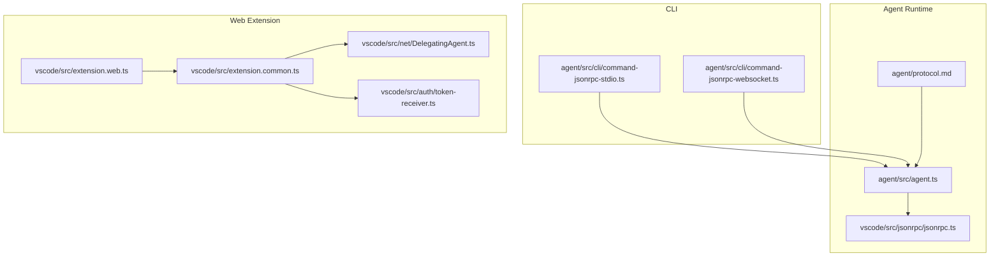
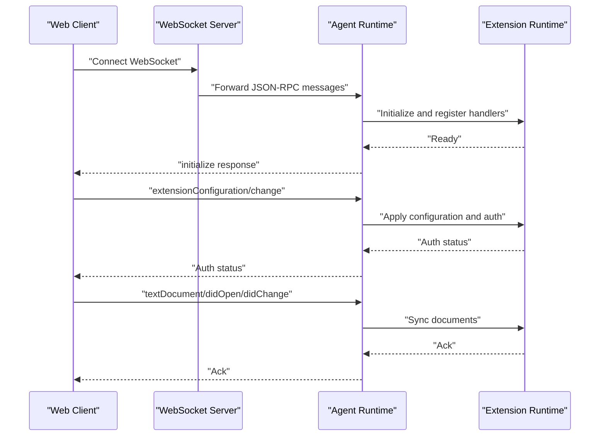
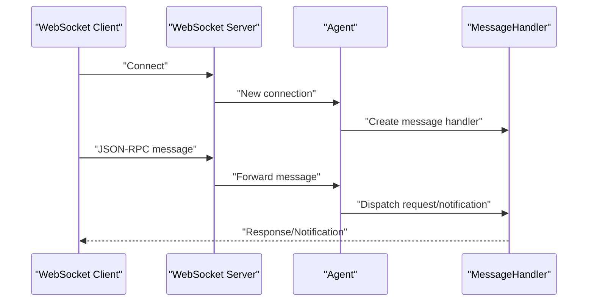
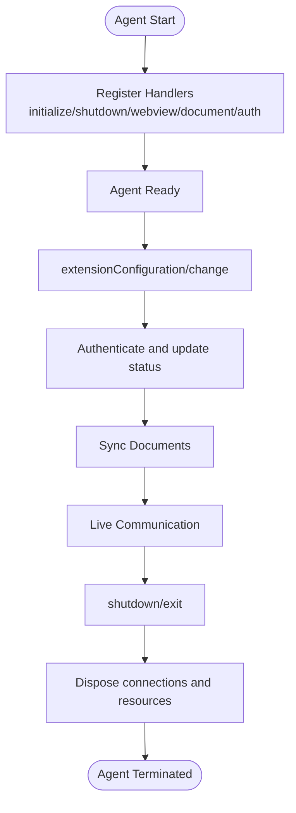
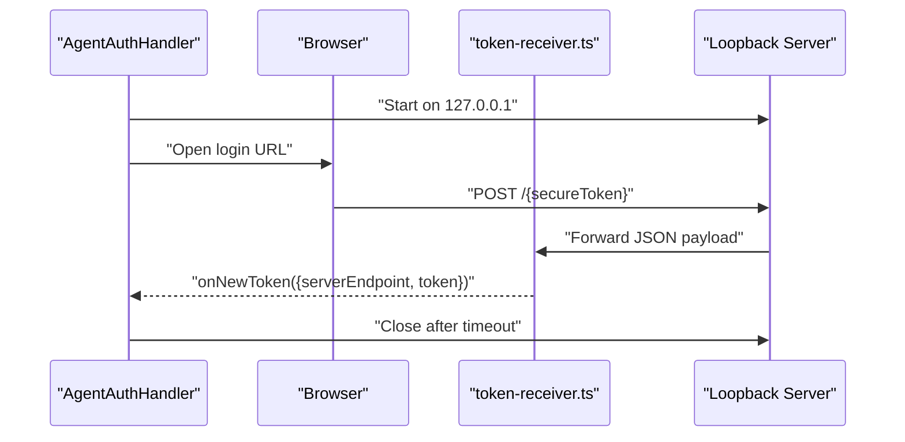
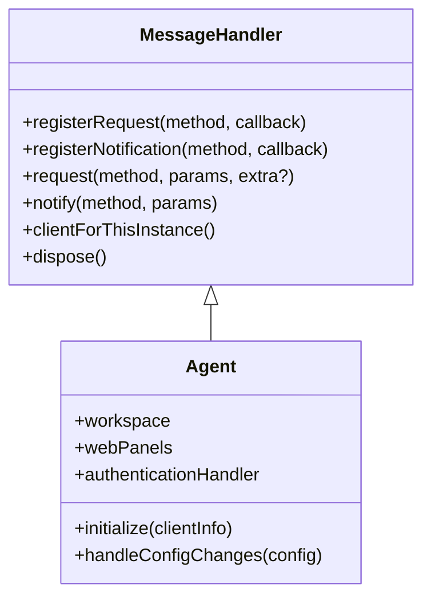
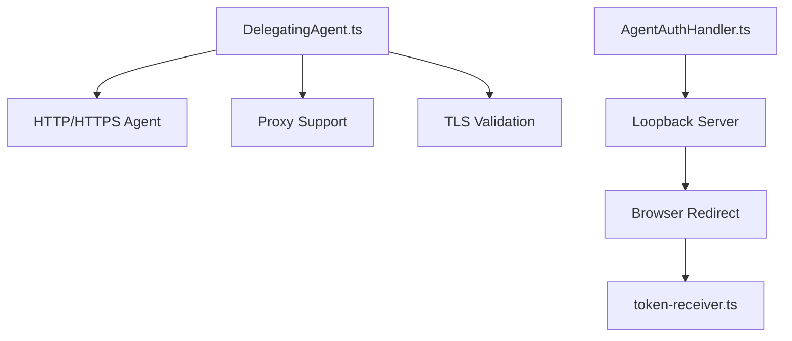
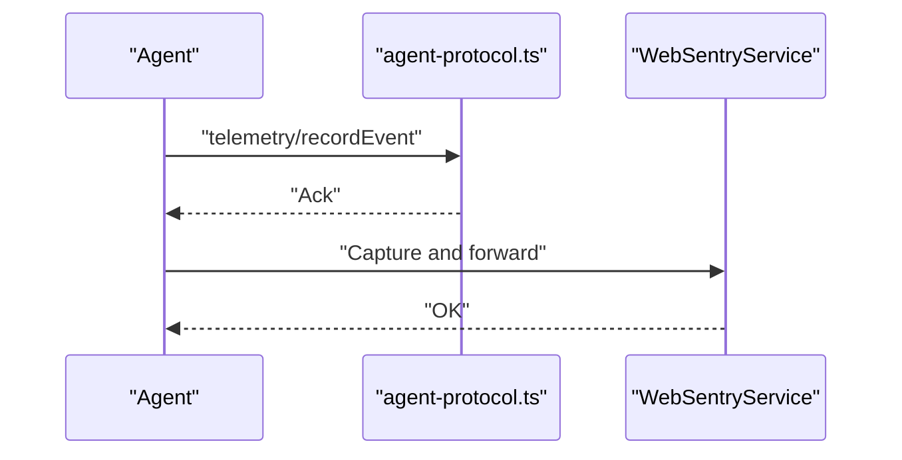
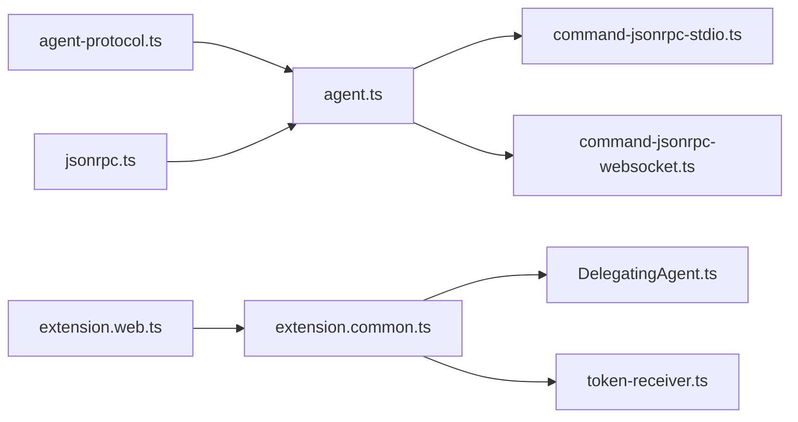

# Agent Integration in Web Contexts

<cite>
**Referenced Files in This Document**
- [agent/README.md](file://agent/README.md)
- [agent/src/index.ts](file://agent/src/index.ts)
- [agent/src/agent.ts](file://agent/src/agent.ts)
- [agent/src/jsonrpc-alias.ts](file://agent/src/jsonrpc-alias.ts)
- [agent/src/protocol-alias.ts](file://agent/src/protocol-alias.ts)
- [agent/protocol.md](file://agent/protocol.md)
- [agent/src/cli/command-jsonrpc-websocket.ts](file://agent/src/cli/command-jsonrpc-websocket.ts)
- [agent/src/cli/command-jsonrpc-stdio.ts](file://agent/src/cli/command-jsonrpc-stdio.ts)
- [agent/src/AgentAuthHandler.ts](file://agent/src/AgentAuthHandler.ts)
- [vscode/src/jsonrpc/agent-protocol.ts](file://vscode/src/jsonrpc/agent-protocol.ts)
- [vscode/src/jsonrpc/jsonrpc.ts](file://vscode/src/jsonrpc/jsonrpc.ts)
- [vscode/src/extension.web.ts](file://vscode/src/extension.web.ts)
- [vscode/src/extension.common.ts](file://vscode/src/extension.common.ts)
- [vscode/src/services/sentry/sentry.web.ts](file://vscode/src/services/sentry/sentry.web.ts)
- [vscode/src/net/DelegatingAgent.ts](file://vscode/src/net/DelegatingAgent.ts)
- [vscode/src/net/index.ts](file://vscode/src/net/index.ts)
- [vscode/src/auth/token-receiver.ts](file://vscode/src/auth/token-receiver.ts)
</cite>

## Table of Contents
1. [Introduction](#introduction)
2. [Project Structure](#project-structure)
3. [Core Components](#core-components)
4. [Architecture Overview](#architecture-overview)
5. [Detailed Component Analysis](#detailed-component-analysis)
6. [Dependency Analysis](#dependency-analysis)
7. [Performance Considerations](#performance-considerations)
8. [Troubleshooting Guide](#troubleshooting-guide)
9. [Conclusion](#conclusion)
10. [Appendices](#appendices)

## Introduction
This document explains how to integrate agents in web-based contexts, focusing on WebSocket-based JSON-RPC transport, authentication flows, real-time communication, lifecycle management, message serialization, protocol negotiation, error recovery, security, telemetry, and browser-specific considerations. It synthesizes the agent protocol, transport mechanisms, authentication, networking, and telemetry from the repository to provide a comprehensive guide for building robust web integrations.

## Project Structure
The agent ecosystem consists of:
- A JSON-RPC protocol definition and transport abstractions
- A CLI that exposes stdio-based JSON-RPC and a WebSocket server command
- An agent runtime that initializes the extension, manages documents, webviews, and authentication
- Web-specific extension activation and services for browsers
- Networking and proxy handling for secure transport
- Authentication handlers and token receivers for secure web flows

**Diagram sources**
- [agent/src/agent.ts:1-120](file://agent/src/agent.ts#L1-L120)
- [vscode/src/jsonrpc/jsonrpc.ts:1-60](file://vscode/src/jsonrpc/jsonrpc.ts#L1-L60)
- [agent/protocol.md:1-60](file://agent/protocol.md#L1-L60)
- [agent/src/cli/command-jsonrpc-stdio.ts:1-60](file://agent/src/cli/command-jsonrpc-stdio.ts#L1-L60)
- [agent/src/cli/command-jsonrpc-websocket.ts:1-40](file://agent/src/cli/command-jsonrpc-websocket.ts#L1-L40)
- [vscode/src/extension.web.ts:1-35](file://vscode/src/extension.web.ts#L1-L35)
- [vscode/src/extension.common.ts:1-40](file://vscode/src/extension.common.ts#L1-L40)
- [vscode/src/net/DelegatingAgent.ts:1-60](file://vscode/src/net/DelegatingAgent.ts#L1-L60)
- [vscode/src/auth/token-receiver.ts:30-52](file://vscode/src/auth/token-receiver.ts#L30-L52)

**Section sources**
- [agent/README.md:1-90](file://agent/README.md#L1-L90)
- [agent/src/index.ts:1-34](file://agent/src/index.ts#L1-L34)
- [agent/src/agent.ts:1-120](file://agent/src/agent.ts#L1-L120)
- [agent/src/cli/command-jsonrpc-stdio.ts:1-60](file://agent/src/cli/command-jsonrpc-stdio.ts#L1-L60)
- [agent/src/cli/command-jsonrpc-websocket.ts:1-40](file://agent/src/cli/command-jsonrpc-websocket.ts#L1-L40)
- [vscode/src/extension.web.ts:1-35](file://vscode/src/extension.web.ts#L1-L35)
- [vscode/src/extension.common.ts:1-40](file://vscode/src/extension.common.ts#L1-L40)
- [vscode/src/net/DelegatingAgent.ts:1-60](file://vscode/src/net/DelegatingAgent.ts#L1-L60)
- [vscode/src/auth/token-receiver.ts:30-52](file://vscode/src/auth/token-receiver.ts#L30-L52)

## Core Components
- JSON-RPC protocol and transport: Defines the agent protocol, request/notification semantics, and the MessageHandler abstraction for registering handlers and managing connections.
- Agent runtime: Initializes the extension, manages document synchronization, webviews, authentication, and configuration changes.
- CLI transports: Exposes stdio-based JSON-RPC and a WebSocket server command for agent communication.
- Web extension activation: Provides browser-specific activation and services.
- Networking and proxies: Centralized HTTP/HTTPS agent with proxy and TLS configuration.
- Authentication: Loopback server and token receiver for secure web authentication flows.

**Section sources**
- [agent/protocol.md:1-60](file://agent/protocol.md#L1-L60)
- [vscode/src/jsonrpc/agent-protocol.ts:1-60](file://vscode/src/jsonrpc/agent-protocol.ts#L1-L60)
- [vscode/src/jsonrpc/jsonrpc.ts:1-60](file://vscode/src/jsonrpc/jsonrpc.ts#L1-L60)
- [agent/src/agent.ts:380-500](file://agent/src/agent.ts#L380-L500)
- [agent/src/cli/command-jsonrpc-stdio.ts:115-208](file://agent/src/cli/command-jsonrpc-stdio.ts#L115-L208)
- [agent/src/cli/command-jsonrpc-websocket.ts:12-55](file://agent/src/cli/command-jsonrpc-websocket.ts#L12-L55)
- [vscode/src/extension.web.ts:14-35](file://vscode/src/extension.web.ts#L14-L35)
- [vscode/src/net/DelegatingAgent.ts:128-180](file://vscode/src/net/DelegatingAgent.ts#L128-L180)
- [vscode/src/auth/token-receiver.ts:30-52](file://vscode/src/auth/token-receiver.ts#L30-L52)

## Architecture Overview
The agent communicates via JSON-RPC over stdio or WebSocket. The MessageHandler registers protocol methods and routes requests/notifications. The agent runtime initializes the extension, manages documents and webviews, and handles authentication and configuration changes. Web activation uses browser-specific services and a delegating HTTP agent for secure transport.

**Diagram sources**
- [agent/src/cli/command-jsonrpc-websocket.ts:17-54](file://agent/src/cli/command-jsonrpc-websocket.ts#L17-L54)
- [agent/src/agent.ts:380-500](file://agent/src/agent.ts#L380-L500)
- [vscode/src/jsonrpc/agent-protocol.ts:35-120](file://vscode/src/jsonrpc/agent-protocol.ts#L35-L120)

## Detailed Component Analysis

### WebSocket Transport and Protocol Negotiation
- The WebSocket server command starts a ws server and forwards messages to the agent. The agent applies configuration changes upon first message.
- Protocol negotiation occurs via the initialize handshake and subsequent requests/notifications.

**Diagram sources**
- [agent/src/cli/command-jsonrpc-websocket.ts:17-54](file://agent/src/cli/command-jsonrpc-websocket.ts#L17-L54)
- [vscode/src/jsonrpc/jsonrpc.ts:90-140](file://vscode/src/jsonrpc/jsonrpc.ts#L90-L140)

**Section sources**
- [agent/src/cli/command-jsonrpc-websocket.ts:12-55](file://agent/src/cli/command-jsonrpc-websocket.ts#L12-L55)
- [agent/protocol.md:37-120](file://agent/protocol.md#L37-L120)
- [vscode/src/jsonrpc/jsonrpc.ts:90-140](file://vscode/src/jsonrpc/jsonrpc.ts#L90-L140)

### Agent Lifecycle Management
- Initialization: The agent registers handlers for initialize, shutdown, document lifecycle, configuration changes, and authentication.
- Graceful shutdown: The agent responds to shutdown and exit notifications, disposing connections and resources.
- Document synchronization: The agent tracks document open/change/save/close and maintains a workspace state.

**Diagram sources**
- [agent/src/agent.ts:380-514](file://agent/src/agent.ts#L380-L514)
- [vscode/src/jsonrpc/agent-protocol.ts:35-120](file://vscode/src/jsonrpc/agent-protocol.ts#L35-L120)

**Section sources**
- [agent/src/agent.ts:380-514](file://agent/src/agent.ts#L380-L514)
- [vscode/src/jsonrpc/agent-protocol.ts:35-120](file://vscode/src/jsonrpc/agent-protocol.ts#L35-L120)

### Authentication Flows for Web Agents
- Loopback server: The AgentAuthHandler starts a local HTTP server on 127.0.0.1 and opens the browser to an OAuth login page.
- Token receiver: The token-receiver service listens for a POST to a secure path and extracts the access token.
- Automatic cleanup: The loopback server is closed after a timeout window.

**Diagram sources**
- [agent/src/AgentAuthHandler.ts:82-108](file://agent/src/AgentAuthHandler.ts#L82-L108)
- [vscode/src/auth/token-receiver.ts:30-52](file://vscode/src/auth/token-receiver.ts#L30-L52)

**Section sources**
- [agent/src/AgentAuthHandler.ts:82-108](file://agent/src/AgentAuthHandler.ts#L82-L108)
- [vscode/src/auth/token-receiver.ts:30-52](file://vscode/src/auth/token-receiver.ts#L30-L52)

### Real-Time Communication Protocols
- JSON-RPC over stdio: The stdio command sets up a message connection and registers the agent.
- JSON-RPC over WebSocket: The WebSocket command forwards messages to the agent and applies configuration on first message.
- MessageHandler: Registers request/notification handlers, tracks connection state, and provides client access for in-process usage.

**Diagram sources**
- [vscode/src/jsonrpc/jsonrpc.ts:40-191](file://vscode/src/jsonrpc/jsonrpc.ts#L40-L191)
- [agent/src/agent.ts:295-380](file://agent/src/agent.ts#L295-L380)

**Section sources**
- [agent/src/cli/command-jsonrpc-stdio.ts:181-208](file://agent/src/cli/command-jsonrpc-stdio.ts#L181-L208)
- [agent/src/cli/command-jsonrpc-websocket.ts:17-54](file://agent/src/cli/command-jsonrpc-websocket.ts#L17-L54)
- [vscode/src/jsonrpc/jsonrpc.ts:40-191](file://vscode/src/jsonrpc/jsonrpc.ts#L40-L191)
- [agent/src/agent.ts:295-380](file://agent/src/agent.ts#L295-L380)

### Security Implementations
- Secure transport: The DelegatingAgent centralizes HTTP/HTTPS configuration, supports proxies, and validates certificates.
- Token management: Loopback server and token receiver enforce secure token exchange.
- Web authentication: AgentAuthHandler binds to localhost and closes after a timeout.

**Diagram sources**
- [vscode/src/net/DelegatingAgent.ts:128-180](file://vscode/src/net/DelegatingAgent.ts#L128-L180)
- [agent/src/AgentAuthHandler.ts:82-108](file://agent/src/AgentAuthHandler.ts#L82-L108)
- [vscode/src/auth/token-receiver.ts:30-52](file://vscode/src/auth/token-receiver.ts#L30-L52)

**Section sources**
- [vscode/src/net/DelegatingAgent.ts:128-180](file://vscode/src/net/DelegatingAgent.ts#L128-L180)
- [agent/src/AgentAuthHandler.ts:82-108](file://agent/src/AgentAuthHandler.ts#L82-L108)
- [vscode/src/auth/token-receiver.ts:30-52](file://vscode/src/auth/token-receiver.ts#L30-L52)

### Telemetry Integration
- Telemetry events: The protocol includes a telemetry/recordEvent method for recording events.
- Web Sentry: WebSentryService initializes Sentry for browser environments.
- Testing telemetry: The agent exposes testing/exportedTelemetryEvents for validation.

**Diagram sources**
- [vscode/src/jsonrpc/agent-protocol.ts:140-150](file://vscode/src/jsonrpc/agent-protocol.ts#L140-L150)
- [vscode/src/services/sentry/sentry.web.ts:5-10](file://vscode/src/services/sentry/sentry.web.ts#L5-L10)

**Section sources**
- [vscode/src/jsonrpc/agent-protocol.ts:140-150](file://vscode/src/jsonrpc/agent-protocol.ts#L140-L150)
- [vscode/src/services/sentry/sentry.web.ts:5-10](file://vscode/src/services/sentry/sentry.web.ts#L5-L10)

### Practical Examples
- Agent initialization: Use the stdio command to start the agent and establish JSON-RPC communication.
- Configuration management: Apply extensionConfiguration/change to update server endpoint, access token, and custom headers.
- Real-time data synchronization: Send textDocument/didOpen/didChange/didSave notifications to synchronize document state.

**Section sources**
- [agent/src/cli/command-jsonrpc-stdio.ts:115-208](file://agent/src/cli/command-jsonrpc-stdio.ts#L115-L208)
- [vscode/src/jsonrpc/agent-protocol.ts:222-232](file://vscode/src/jsonrpc/agent-protocol.ts#L222-L232)
- [vscode/src/jsonrpc/agent-protocol.ts:328-352](file://vscode/src/jsonrpc/agent-protocol.ts#L328-L352)

### Browser-Specific Considerations and CORS
- Web activation: extension.web.ts activates the extension with browser-specific services and clients.
- Networking: DelegatingAgent resolves proxy and certificate settings, ensuring secure transport in browser contexts.
- CORS: Authentication uses a loopback server on 127.0.0.1, avoiding cross-origin issues for token exchange.

**Section sources**
- [vscode/src/extension.web.ts:14-35](file://vscode/src/extension.web.ts#L14-L35)
- [vscode/src/extension.common.ts:44-78](file://vscode/src/extension.common.ts#L44-L78)
- [vscode/src/net/DelegatingAgent.ts:247-296](file://vscode/src/net/DelegatingAgent.ts#L247-L296)
- [agent/src/AgentAuthHandler.ts:82-108](file://agent/src/AgentAuthHandler.ts#L82-L108)

## Dependency Analysis
The agent protocol and runtime depend on JSON-RPC abstractions, the agent runtime, and web extension services. CLI commands bridge to the agent runtime and optionally to a WebSocket server.

**Diagram sources**
- [vscode/src/jsonrpc/agent-protocol.ts:1-60](file://vscode/src/jsonrpc/agent-protocol.ts#L1-L60)
- [agent/src/agent.ts:1-120](file://agent/src/agent.ts#L1-L120)
- [vscode/src/jsonrpc/jsonrpc.ts:1-60](file://vscode/src/jsonrpc/jsonrpc.ts#L1-L60)
- [agent/src/cli/command-jsonrpc-stdio.ts:1-60](file://agent/src/cli/command-jsonrpc-stdio.ts#L1-L60)
- [agent/src/cli/command-jsonrpc-websocket.ts:1-40](file://agent/src/cli/command-jsonrpc-websocket.ts#L1-L40)
- [vscode/src/extension.web.ts:1-35](file://vscode/src/extension.web.ts#L1-L35)
- [vscode/src/extension.common.ts:1-40](file://vscode/src/extension.common.ts#L1-L40)
- [vscode/src/net/DelegatingAgent.ts:1-60](file://vscode/src/net/DelegatingAgent.ts#L1-L60)
- [vscode/src/auth/token-receiver.ts:30-52](file://vscode/src/auth/token-receiver.ts#L30-L52)

**Section sources**
- [agent/src/jsonrpc-alias.ts:1-2](file://agent/src/jsonrpc-alias.ts#L1-L2)
- [agent/src/protocol-alias.ts:1-2](file://agent/src/protocol-alias.ts#L1-L2)
- [agent/src/agent.ts:1-120](file://agent/src/agent.ts#L1-L120)
- [vscode/src/jsonrpc/agent-protocol.ts:1-60](file://vscode/src/jsonrpc/agent-protocol.ts#L1-L60)

## Performance Considerations
- Keep-alive and timeouts: The DelegatingAgent disables keep-alive and sets timeouts to maintain responsiveness for autocomplete and other latency-sensitive operations.
- Proxy and TLS: Efficient caching of agents per proxy/endpoint reduces overhead and improves connection reliability.
- Scheduling: LIFO scheduling prioritizes autocomplete performance.

[No sources needed since this section provides general guidance]

## Troubleshooting Guide
- Uncaught exceptions: The agent logs uncaught exceptions and continues execution to avoid process termination.
- Trace logging: Enable CODY_AGENT_TRACE_PATH to capture verbose JSON-RPC traffic for debugging.
- Polly recording: Use recording modes to capture and replay network traffic for deterministic testing.
- Error handling: MessageHandler maps rate limit and cancellation errors to standardized JSON-RPC error codes.

**Section sources**
- [agent/src/index.ts:16-33](file://agent/src/index.ts#L16-L33)
- [vscode/src/jsonrpc/jsonrpc.ts:25-88](file://vscode/src/jsonrpc/jsonrpc.ts#L25-L88)
- [agent/src/cli/command-jsonrpc-stdio.ts:115-179](file://agent/src/cli/command-jsonrpc-stdio.ts#L115-L179)

## Conclusion
The agent integrates seamlessly in web contexts via JSON-RPC over stdio or WebSocket, with robust authentication, secure transport, and telemetry. The protocol and runtime provide lifecycle management, document synchronization, and extensible handlers for real-time communication. Browser-specific activation and network configuration ensure secure and reliable operation across diverse environments.

## Appendices
- Protocol reference: See agent/protocol.md for the complete method catalog and semantics.
- Extension activation: See extension.web.ts and extension.common.ts for browser-specific activation and services.
- Networking: See DelegatingAgent.ts for centralized proxy and TLS configuration.

**Section sources**
- [agent/protocol.md:37-482](file://agent/protocol.md#L37-L482)
- [vscode/src/extension.web.ts:14-35](file://vscode/src/extension.web.ts#L14-L35)
- [vscode/src/extension.common.ts:44-78](file://vscode/src/extension.common.ts#L44-L78)
- [vscode/src/net/DelegatingAgent.ts:128-180](file://vscode/src/net/DelegatingAgent.ts#L128-L180)