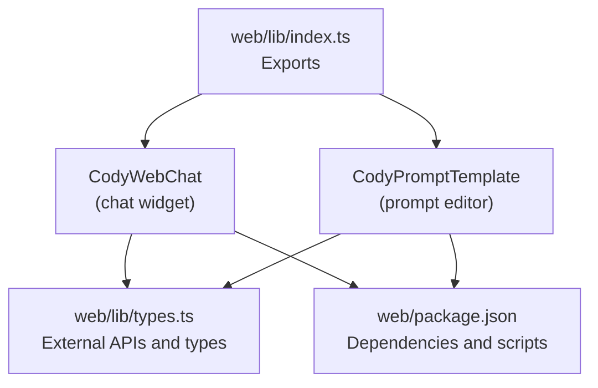
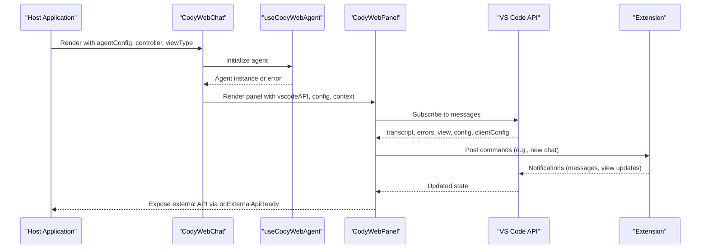
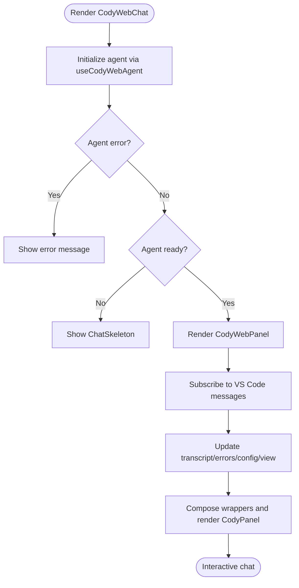
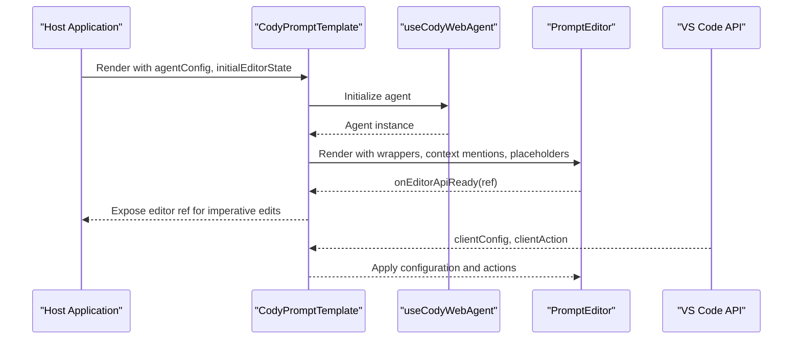
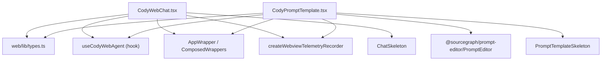

# React Component Library

<cite>
**Referenced Files in This Document**
- [web/lib/index.ts](file://web/lib/index.ts)
- [web/lib/types.ts](file://web/lib/types.ts)
- [web/lib/components/CodyWebChat.tsx](file://web/lib/components/CodyWebChat.tsx)
- [web/lib/components/CodyPromptTemplate.tsx](file://web/lib/components/CodyPromptTemplate.tsx)
- [web/package.json](file://web/package.json)
</cite>

## Table of Contents
1. [Introduction](#introduction)
2. [Project Structure](#project-structure)
3. [Core Components](#core-components)
4. [Architecture Overview](#architecture-overview)
5. [Detailed Component Analysis](#detailed-component-analysis)
6. [Dependency Analysis](#dependency-analysis)
7. [Performance Considerations](#performance-considerations)
8. [Accessibility and UX](#accessibility-and-ux)
9. [Component API Design Principles](#component-api-design-principles)
10. [Testing Strategies](#testing-strategies)
11. [Usage Examples](#usage-examples)
12. [Troubleshooting Guide](#troubleshooting-guide)
13. [Conclusion](#conclusion)

## Introduction
This document describes the React component library architecture for the Cody Web integration. It focuses on the public component exports, their composition patterns, prop interfaces, event handling, state management, lifecycle, rendering optimizations, accessibility, and testing strategies. The primary exported components are the chat widget and the prompt template editor, both built on top of shared agent infrastructure and the VS Code webview stack.

## Project Structure
The component library is published from the web package and exposes two primary components:
- A chat widget component that renders a full chat experience inside a web page or sidebar.
- A prompt template editor component that supports @mentions and dynamic context insertion.

**Diagram sources**
- [web/lib/index.ts:1-20](file://web/lib/index.ts#L1-L20)
- [web/lib/components/CodyWebChat.tsx:117-158](file://web/lib/components/CodyWebChat.tsx#L117-L158)
- [web/lib/components/CodyPromptTemplate.tsx:74-115](file://web/lib/components/CodyPromptTemplate.tsx#L74-L115)
- [web/lib/types.ts:11-31](file://web/lib/types.ts#L11-L31)
- [web/package.json:15-51](file://web/package.json#L15-L51)

**Section sources**
- [web/lib/index.ts:1-20](file://web/lib/index.ts#L1-L20)
- [web/package.json:15-51](file://web/package.json#L15-L51)

## Core Components
- CodyWebChat: A container component that initializes the agent, manages controller messaging, and renders the chat panel with optional sidebar/page view modes.
- CodyPromptTemplate: A specialized editor component that integrates with the prompt editor library and exposes an imperative API for programmatic edits.

Both components share a common initialization pattern: they accept an agent configuration, initialize the agent, and render a composed panel that wires VS Code webview messages, telemetry, and context mentions.

**Section sources**
- [web/lib/components/CodyWebChat.tsx:91-158](file://web/lib/components/CodyWebChat.tsx#L91-L158)
- [web/lib/components/CodyPromptTemplate.tsx:54-115](file://web/lib/components/CodyPromptTemplate.tsx#L54-L115)

## Architecture Overview
The components rely on a shared agent hook to connect to the extension-side agent via a VS Code webview bridge. They compose wrappers to inject telemetry, configuration, and client actions, and they manage a small internal state for transcripts, errors, and view transitions.

**Diagram sources**
- [web/lib/components/CodyWebChat.tsx:117-158](file://web/lib/components/CodyWebChat.tsx#L117-L158)
- [web/lib/components/CodyWebChat.tsx:169-435](file://web/lib/components/CodyWebChat.tsx#L169-L435)
- [web/lib/components/CodyWebChat.tsx:242-280](file://web/lib/components/CodyWebChat.tsx#L242-L280)
- [web/lib/components/CodyWebChat.tsx:188-216](file://web/lib/components/CodyWebChat.tsx#L188-L216)

## Detailed Component Analysis

### CodyWebChat
- Purpose: Provides a full-featured chat experience embedded in a web page or sidebar.
- Composition: Uses a controller pattern to receive and send messages, and a VS Code API bridge to communicate with the extension.
- State management: Maintains transcript, in-progress message, error messages, configuration, and view state. Updates are driven by incoming webview messages.
- Rendering optimization: Uses memoization for wrappers and default context; skeleton loading while agent initializes.
- Accessibility: Delegates to the underlying panel and editor components; ensure focus management and keyboard navigation are handled by those components.

**Diagram sources**
- [web/lib/components/CodyWebChat.tsx:117-158](file://web/lib/components/CodyWebChat.tsx#L117-L158)
- [web/lib/components/CodyWebChat.tsx:169-435](file://web/lib/components/CodyWebChat.tsx#L169-L435)

**Section sources**
- [web/lib/components/CodyWebChat.tsx:91-158](file://web/lib/components/CodyWebChat.tsx#L91-L158)
- [web/lib/components/CodyWebChat.tsx:169-435](file://web/lib/components/CodyWebChat.tsx#L169-L435)

### CodyPromptTemplate
- Purpose: A prompt editor with @mentions and dynamic context items, suitable for building prompt templates.
- Composition: Renders the PromptEditor inside composed wrappers and exposes an imperative ref API for programmatic edits.
- State management: Tracks client configuration and forwards editor events via the VS Code bridge.
- Rendering optimization: Uses memoization for wrappers and default context; skeleton loading while agent initializes.

**Diagram sources**
- [web/lib/components/CodyPromptTemplate.tsx:74-115](file://web/lib/components/CodyPromptTemplate.tsx#L74-L115)
- [web/lib/components/CodyPromptTemplate.tsx:126-205](file://web/lib/components/CodyPromptTemplate.tsx#L126-L205)

**Section sources**
- [web/lib/components/CodyPromptTemplate.tsx:54-115](file://web/lib/components/CodyPromptTemplate.tsx#L54-L115)
- [web/lib/components/CodyPromptTemplate.tsx:126-205](file://web/lib/components/CodyPromptTemplate.tsx#L126-L205)

## Dependency Analysis
The components depend on:
- Shared agent initialization and VS Code webview messaging.
- Prompt editor library for advanced editing features.
- Telemetry and wrapper composition utilities.
- CSS modules for styling and skeleton loaders for initial render.

**Diagram sources**
- [web/lib/components/CodyWebChat.tsx:117-158](file://web/lib/components/CodyWebChat.tsx#L117-L158)
- [web/lib/components/CodyPromptTemplate.tsx:74-115](file://web/lib/components/CodyPromptTemplate.tsx#L74-L115)
- [web/lib/types.ts:11-31](file://web/lib/types.ts#L11-L31)

**Section sources**
- [web/package.json:22-50](file://web/package.json#L22-L50)

## Performance Considerations
- Memoization: Both components use memoization for expensive computations (wrappers, default context) to avoid unnecessary re-renders.
- Conditional rendering: Skeleton loaders are used while the agent is initializing to prevent heavy DOM construction before data is ready.
- Event subscriptions: Message handlers are attached once and cleaned up via unsubscribe patterns exposed by the controller.
- Lazy initialization: Some features (like creating a chat) are deferred until the agent is ready to reduce overhead during mount.

[No sources needed since this section provides general guidance]

## Accessibility and UX
- Keyboard navigation and focus management are delegated to the underlying panels and editors; ensure consumers test with assistive technologies.
- Screen reader support depends on the editor and panel components; verify announcements for new messages and view changes.
- Visual feedback: Error banners and loading states improve usability during initialization and runtime errors.

[No sources needed since this section provides general guidance]

## Component API Design Principles
- TypeScript interfaces define props and return types precisely, enabling strong typing for consumers.
- Optional callbacks and imperative APIs are clearly marked and designed to be memoized to avoid infinite loops.
- Default props and fallbacks are handled internally (e.g., default context items) to simplify consumer usage.

**Section sources**
- [web/lib/components/CodyWebChat.tsx:91-109](file://web/lib/components/CodyWebChat.tsx#L91-L109)
- [web/lib/components/CodyPromptTemplate.tsx:54-69](file://web/lib/components/CodyPromptTemplate.tsx#L54-L69)
- [web/lib/types.ts:11-31](file://web/lib/types.ts#L11-L31)

## Testing Strategies
- Unit tests: Validate component props, state transitions, and message handling using React testing utilities and mocked VS Code APIs.
- Integration tests: Simulate end-to-end flows using Vitest and Playwright to verify controller messaging, telemetry, and editor interactions.
- Visual regression tests: Capture component snapshots in Storybook or via Playwright to detect UI regressions across browser environments.
- Mocked agent: Use the agent hook’s initialization path to test both success and error scenarios without requiring a real extension connection.

[No sources needed since this section provides general guidance]

## Usage Examples
Below are example usage patterns for the exported components. Replace placeholders with your own configuration and callbacks.

- Basic chat widget usage
  - Props: agentConfig, controller (optional), viewType ('page' or 'sidebar'), className (optional)
  - Example snippet path: [CodyWebChat usage:117-158](file://web/lib/components/CodyWebChat.tsx#L117-L158)

- Prompt template editor with initial state
  - Props: agentConfig, initialEditorState (optional), disabled (optional), placeholder (optional), onEditorApiReady (optional)
  - Example snippet path: [CodyPromptTemplate usage:74-115](file://web/lib/components/CodyPromptTemplate.tsx#L74-L115)

- External API exposure
  - Chat: onExternalApiReady receives a typed API for imperative actions
  - Prompt Editor: onEditorApiReady receives a ref with methods to serialize and append text
  - Example snippet paths:
    - [CodyWebChat external API:121-123](file://web/lib/components/CodyWebChat.tsx#L121-L123)
    - [CodyPromptTemplate editor API:80-81](file://web/lib/components/CodyPromptTemplate.tsx#L80-L81)

**Section sources**
- [web/lib/components/CodyWebChat.tsx:117-158](file://web/lib/components/CodyWebChat.tsx#L117-L158)
- [web/lib/components/CodyPromptTemplate.tsx:74-115](file://web/lib/components/CodyPromptTemplate.tsx#L74-L115)

## Troubleshooting Guide
- Agent initialization failures: The component displays an error message when the agent fails to initialize. Verify agentConfig and network connectivity.
- No-op controller: If controller is omitted, the component maintains internal view state; ensure to pass a controller if you need external control.
- Missing context: Ensure initialContext is provided when you need repository/file context; otherwise default context items are empty.
- Editor readiness: onEditorApiReady is called once the editor is mounted; memoize the callback to avoid infinite updates.

**Section sources**
- [web/lib/components/CodyWebChat.tsx:136-142](file://web/lib/components/CodyWebChat.tsx#L136-L142)
- [web/lib/components/CodyPromptTemplate.tsx:133-137](file://web/lib/components/CodyPromptTemplate.tsx#L133-L137)

## Conclusion
The component library provides two cohesive, strongly-typed React components for embedding Cody experiences in web applications. They leverage a shared agent and webview messaging layer, offer composability via wrappers, and expose imperative APIs for advanced integrations. By following the API design principles, performance tips, and testing strategies outlined here, teams can integrate, customize, and maintain these components effectively.