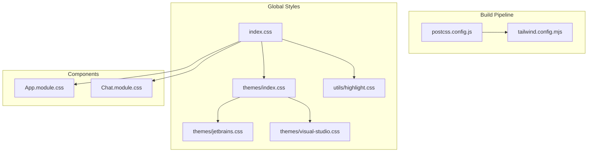
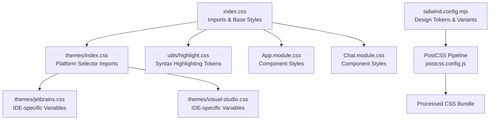
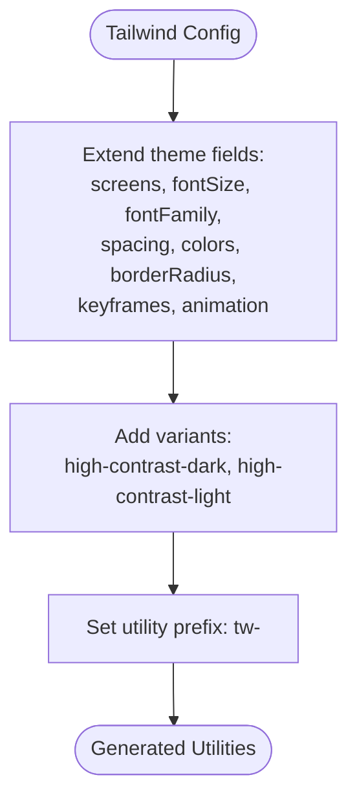
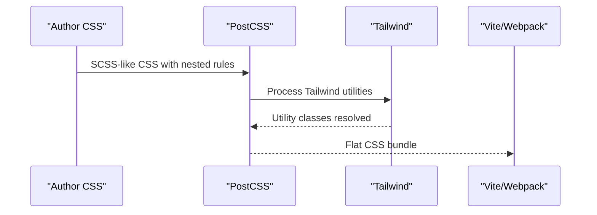
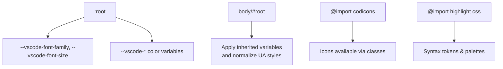
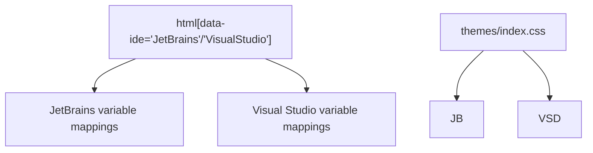
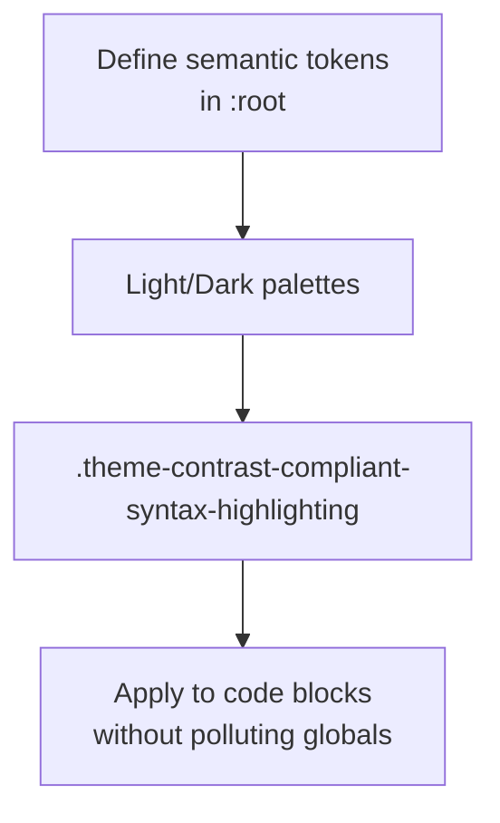
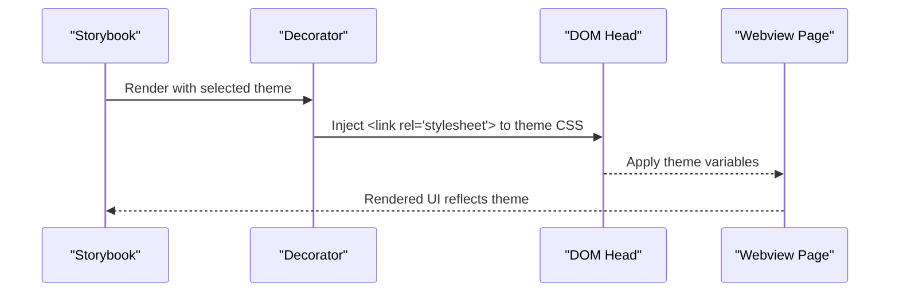
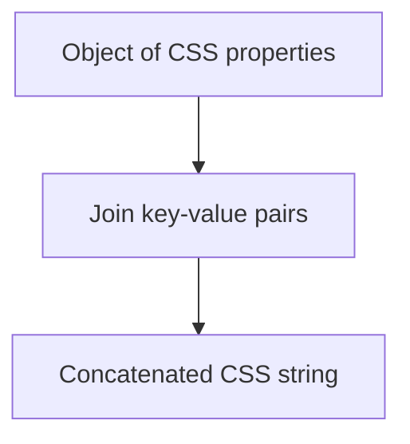
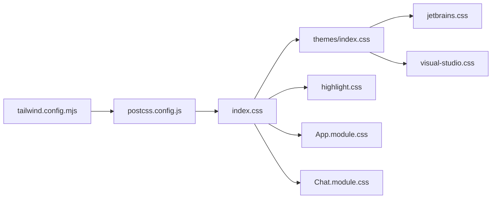

# Styling and Theming System

<cite>
**Referenced Files in This Document**
- [tailwind.config.mjs](file://vscode/webviews/tailwind.config.mjs)
- [postcss.config.js](file://vscode/webviews/postcss.config.js)
- [index.css](file://vscode/webviews/index.css)
- [index.css](file://vscode/webviews/themes/index.css)
- [jetbrains.css](file://vscode/webviews/themes/jetbrains.css)
- [visual-studio.css](file://vscode/webviews/themes/visual-studio.css)
- [highlight.css](file://vscode/webviews/utils/highlight.css)
- [App.module.css](file://vscode/webviews/App.module.css)
- [Chat.module.css](file://vscode/webviews/Chat.module.css)
- [utils.ts](file://vscode/src/autoedits/renderer/decorators/utils.ts)
- [preview.tsx](file://vscode/.storybook/preview.tsx)
- [README.md](file://vscode/.storybook/static/vscode-themes/README.md)
</cite>

## Table of Contents
1. [Introduction](#introduction)
2. [Project Structure](#project-structure)
3. [Core Components](#core-components)
4. [Architecture Overview](#architecture-overview)
5. [Detailed Component Analysis](#detailed-component-analysis)
6. [Dependency Analysis](#dependency-analysis)
7. [Performance Considerations](#performance-considerations)
8. [Troubleshooting Guide](#troubleshooting-guide)
9. [Conclusion](#conclusion)

## Introduction
This document explains the styling and theming system used across the webviews and Storybook environments. It covers the CSS-in-JS-inspired approach using CSS custom properties, Tailwind CSS integration, cross-platform theming for VS Code, JetBrains, and Visual Studio, and the build-time processing pipeline. It also documents design system principles (colors, typography, spacing), component styling patterns, and platform-specific adaptations.

## Project Structure
The styling system is organized around:
- Global styles and imports
- Tailwind CSS configuration and PostCSS pipeline
- Platform-specific theme overlays
- Syntax highlighting utilities
- CSS Modules for component-level styling
- Build-time bundling and optimization

**Diagram sources**
- [postcss.config.js:1-8](file://vscode/webviews/postcss.config.js#L1-L8)
- [tailwind.config.mjs:1-167](file://vscode/webviews/tailwind.config.mjs#L1-L167)
- [index.css:1-66](file://vscode/webviews/index.css#L1-L66)
- [index.css:1-3](file://vscode/webviews/themes/index.css#L1-L3)
- [jetbrains.css:1-704](file://vscode/webviews/themes/jetbrains.css#L1-L704)
- [visual-studio.css:1-640](file://vscode/webviews/themes/visual-studio.css#L1-L640)
- [highlight.css:1-469](file://vscode/webviews/utils/highlight.css#L1-L469)
- [App.module.css:1-40](file://vscode/webviews/App.module.css#L1-L40)
- [Chat.module.css:1-8](file://vscode/webviews/Chat.module.css#L1-L8)

**Section sources**
- [postcss.config.js:1-8](file://vscode/webviews/postcss.config.js#L1-L8)
- [tailwind.config.mjs:1-167](file://vscode/webviews/tailwind.config.mjs#L1-L167)
- [index.css:1-66](file://vscode/webviews/index.css#L1-L66)
- [index.css:1-3](file://vscode/webviews/themes/index.css#L1-L3)
- [jetbrains.css:1-704](file://vscode/webviews/themes/jetbrains.css#L1-L704)
- [visual-studio.css:1-640](file://vscode/webviews/themes/visual-studio.css#L1-L640)
- [highlight.css:1-469](file://vscode/webviews/utils/highlight.css#L1-L469)
- [App.module.css:1-40](file://vscode/webviews/App.module.css#L1-L40)
- [Chat.module.css:1-8](file://vscode/webviews/Chat.module.css#L1-L8)

## Core Components
- Tailwind CSS configuration extends design tokens using CSS custom properties mapped to VS Code theme variables, enabling responsive and variant-aware utilities.
- PostCSS pipeline applies nesting and Tailwind processing to authored styles.
- Platform-specific theme overlays normalize VS Code variables to JetBrains and Visual Studio host environments.
- Global CSS sets baseline styles, imports third-party fonts/icons, and defines IDE-specific overrides.
- Syntax highlighting utilities define contrast-compliant color palettes and scoped selectors.
- CSS Modules encapsulate component-level styles and leverage global tokens.

**Section sources**
- [tailwind.config.mjs:14-166](file://vscode/webviews/tailwind.config.mjs#L14-L166)
- [postcss.config.js:1-8](file://vscode/webviews/postcss.config.js#L1-L8)
- [index.css:1-66](file://vscode/webviews/index.css#L1-L66)
- [jetbrains.css:1-704](file://vscode/webviews/themes/jetbrains.css#L1-L704)
- [visual-studio.css:1-640](file://vscode/webviews/themes/visual-studio.css#L1-L640)
- [highlight.css:1-469](file://vscode/webviews/utils/highlight.css#L1-L469)
- [App.module.css:1-40](file://vscode/webviews/App.module.css#L1-L40)
- [Chat.module.css:1-8](file://vscode/webviews/Chat.module.css#L1-L8)

## Architecture Overview
The styling architecture blends Tailwind utilities with CSS custom properties and platform-specific theme overlays. The build pipeline transforms SCSS-like nesting into vanilla CSS, while Tailwind generates utility classes from the configured design tokens. Platform themes adapt VS Code variables to JetBrains and Visual Studio host contexts.

**Diagram sources**
- [index.css:1-66](file://vscode/webviews/index.css#L1-L66)
- [index.css:1-3](file://vscode/webviews/themes/index.css#L1-L3)
- [jetbrains.css:1-704](file://vscode/webviews/themes/jetbrains.css#L1-L704)
- [visual-studio.css:1-640](file://vscode/webviews/themes/visual-studio.css#L1-L640)
- [highlight.css:1-469](file://vscode/webviews/utils/highlight.css#L1-L469)
- [App.module.css:1-40](file://vscode/webviews/App.module.css#L1-L40)
- [Chat.module.css:1-8](file://vscode/webviews/Chat.module.css#L1-L8)
- [tailwind.config.mjs:1-167](file://vscode/webviews/tailwind.config.mjs#L1-L167)
- [postcss.config.js:1-8](file://vscode/webviews/postcss.config.js#L1-L8)

## Detailed Component Analysis

### Tailwind CSS Integration and Design Tokens
Tailwind is configured to:
- Extend breakpoints, spacing scale, typography, border radius, colors, and animations.
- Map Tailwind color values to CSS custom properties that reflect VS Code theme variables.
- Add variant utilities for high-contrast theme kinds.
- Prefix generated utilities to avoid collisions.

**Diagram sources**
- [tailwind.config.mjs:4-166](file://vscode/webviews/tailwind.config.mjs#L4-L166)

**Section sources**
- [tailwind.config.mjs:14-166](file://vscode/webviews/tailwind.config.mjs#L14-L166)

### PostCSS Pipeline and Build-Time Processing
The PostCSS pipeline:
- Uses SCSS-like syntax.
- Applies nested rules.
- Integrates Tailwind processing via the Tailwind config path.

**Diagram sources**
- [postcss.config.js:1-8](file://vscode/webviews/postcss.config.js#L1-L8)
- [tailwind.config.mjs:1-167](file://vscode/webviews/tailwind.config.mjs#L1-L167)

**Section sources**
- [postcss.config.js:1-8](file://vscode/webviews/postcss.config.js#L1-L8)

### Global Styles and Baseline
Global styles:
- Import Codicons and syntax highlighting assets.
- Define a dedicated code background/foreground pair for the embedded syntax highlighter.
- Establish root-level font family, color, and background derived from VS Code variables.
- Normalize scrollbars and override default UA styles for specific elements.

**Diagram sources**
- [index.css:1-66](file://vscode/webviews/index.css#L1-L66)
- [highlight.css:1-469](file://vscode/webviews/utils/highlight.css#L1-L469)

**Section sources**
- [index.css:1-66](file://vscode/webviews/index.css#L1-L66)

### Platform-Specific Themes and Conditional Styling
Themes are applied conditionally via HTML data attributes:
- JetBrains theme overlay maps VS Code variables to JetBrains host variables.
- Visual Studio theme overlay maps VS Code variables to Visual Studio host variables.
- A selector-based import aggregates platform themes.

**Diagram sources**
- [index.css:1-3](file://vscode/webviews/themes/index.css#L1-L3)
- [jetbrains.css:1-704](file://vscode/webviews/themes/jetbrains.css#L1-L704)
- [visual-studio.css:1-640](file://vscode/webviews/themes/visual-studio.css#L1-L640)

**Section sources**
- [index.css:1-3](file://vscode/webviews/themes/index.css#L1-L3)
- [jetbrains.css:1-704](file://vscode/webviews/themes/jetbrains.css#L1-L704)
- [visual-studio.css:1-640](file://vscode/webviews/themes/visual-studio.css#L1-L640)

### Syntax Highlighting System
The syntax highlighting system:
- Defines a palette of semantic color tokens.
- Provides a contrast-compliant variant for light themes.
- Uses scoped classes to avoid global conflicts.

**Diagram sources**
- [highlight.css:1-469](file://vscode/webviews/utils/highlight.css#L1-L469)

**Section sources**
- [highlight.css:1-469](file://vscode/webviews/utils/highlight.css#L1-L469)

### Component-Level Styling Patterns
Component styles are encapsulated via CSS Modules:
- App.module.css: layout containers, error banners, and resets.
- Chat.module.css: disabled state styling for chat UI.

These files consume global tokens and Tailwind utilities (when imported) to remain consistent with the design system.

**Section sources**
- [App.module.css:1-40](file://vscode/webviews/App.module.css#L1-L40)
- [Chat.module.css:1-8](file://vscode/webviews/Chat.module.css#L1-L8)

### Theme Switching Mechanisms
Theme switching is implemented at two levels:
- VS Code Storybook integration: a decorator injects a themed stylesheet by filename, enabling live previews across multiple VS Code themes.
- IDE platform switching: HTML data attributes on the root element switch between JetBrains and Visual Studio overlays.

**Diagram sources**
- [preview.tsx:68-78](file://vscode/.storybook/preview.tsx#L68-L78)
- [README.md:1-21](file://vscode/.storybook/static/vscode-themes/README.md#L1-L21)

**Section sources**
- [preview.tsx:46-81](file://vscode/.storybook/preview.tsx#L46-L81)
- [README.md:1-21](file://vscode/.storybook/static/vscode-themes/README.md#L1-L21)

### CSS-in-JS Utilities
While the primary styling approach is CSS-in-CSS with Tailwind, there is a small utility for generating inline CSS strings from objects. This supports dynamic styling scenarios (e.g., rendering runtime styles for decorations).

**Diagram sources**
- [utils.ts:1-5](file://vscode/src/autoedits/renderer/decorators/utils.ts#L1-L5)

**Section sources**
- [utils.ts:1-5](file://vscode/src/autoedits/renderer/decorators/utils.ts#L1-L5)

## Dependency Analysis
The styling system exhibits low coupling and high cohesion:
- Global styles depend on Tailwind configuration and platform themes.
- Platform themes depend on VS Code variable names being present in the host environment.
- Component modules depend on global tokens and optional Tailwind utilities.
- Build pipeline depends on PostCSS and Tailwind configuration.

**Diagram sources**
- [tailwind.config.mjs:1-167](file://vscode/webviews/tailwind.config.mjs#L1-L167)
- [postcss.config.js:1-8](file://vscode/webviews/postcss.config.js#L1-L8)
- [index.css:1-66](file://vscode/webviews/index.css#L1-L66)
- [index.css:1-3](file://vscode/webviews/themes/index.css#L1-L3)
- [jetbrains.css:1-704](file://vscode/webviews/themes/jetbrains.css#L1-L704)
- [visual-studio.css:1-640](file://vscode/webviews/themes/visual-studio.css#L1-L640)
- [highlight.css:1-469](file://vscode/webviews/utils/highlight.css#L1-L469)
- [App.module.css:1-40](file://vscode/webviews/App.module.css#L1-L40)
- [Chat.module.css:1-8](file://vscode/webviews/Chat.module.css#L1-L8)

**Section sources**
- [tailwind.config.mjs:1-167](file://vscode/webviews/tailwind.config.mjs#L1-L167)
- [postcss.config.js:1-8](file://vscode/webviews/postcss.config.js#L1-L8)
- [index.css:1-66](file://vscode/webviews/index.css#L1-L66)
- [index.css:1-3](file://vscode/webviews/themes/index.css#L1-L3)
- [jetbrains.css:1-704](file://vscode/webviews/themes/jetbrains.css#L1-L704)
- [visual-studio.css:1-640](file://vscode/webviews/themes/visual-studio.css#L1-L640)
- [highlight.css:1-469](file://vscode/webviews/utils/highlight.css#L1-L469)
- [App.module.css:1-40](file://vscode/webviews/App.module.css#L1-L40)
- [Chat.module.css:1-8](file://vscode/webviews/Chat.module.css#L1-L8)

## Performance Considerations
- Prefer Tailwind utilities over ad-hoc CSS to reduce CSS size and improve cacheability.
- Keep platform theme overlays minimal and scoped to data-attribute selectors to avoid unnecessary cascade.
- Inline styles generated at runtime should be kept small and cached when reused.
- Use CSS custom properties for theme tokens to minimize reflows and enable efficient switching.

## Troubleshooting Guide
- Theme variables missing: If a VS Code variable is not present in the host environment, the mapped variable will be undefined. Verify the variable exists in the host and update the platform theme overlay accordingly.
- JetBrains/Visual Studio mismatch: Confirm the HTML data attribute matches the intended IDE and that the corresponding theme file is included.
- Tailwind utilities not generated: Ensure the content globs in the Tailwind config match the files using utilities and rebuild the bundle.
- PostCSS errors: Validate nesting syntax and ensure Tailwind is configured to use the correct config path.

**Section sources**
- [jetbrains.css:1-704](file://vscode/webviews/themes/jetbrains.css#L1-L704)
- [visual-studio.css:1-640](file://vscode/webviews/themes/visual-studio.css#L1-L640)
- [tailwind.config.mjs:5-12](file://vscode/webviews/tailwind.config.mjs#L5-L12)
- [postcss.config.js:1-8](file://vscode/webviews/postcss.config.js#L1-L8)

## Conclusion
The styling and theming system leverages Tailwind CSS with a robust set of design tokens backed by CSS custom properties. Platform-specific overlays ensure consistent visuals across VS Code, JetBrains, and Visual Studio. The PostCSS pipeline streamlines authoring and optimization, while CSS Modules and global tokens provide predictable, maintainable component styling. This architecture balances flexibility, performance, and cross-platform fidelity.