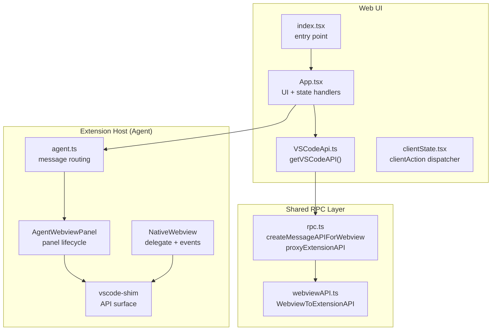
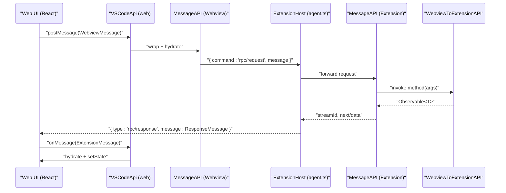
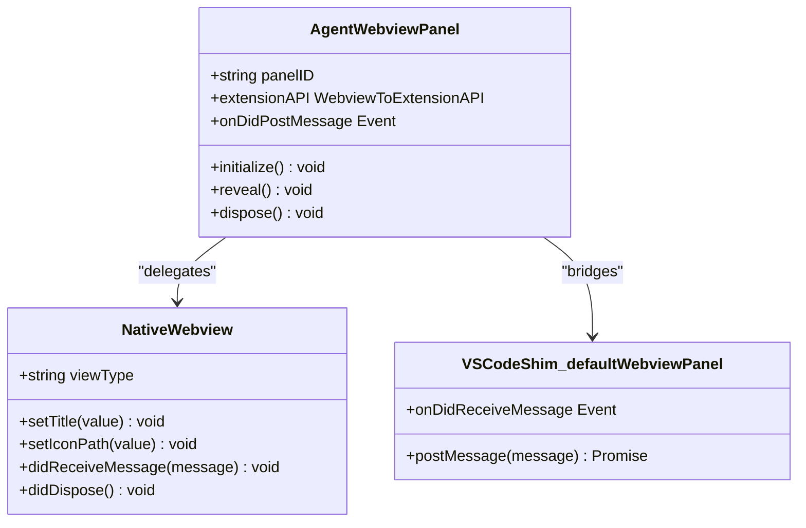
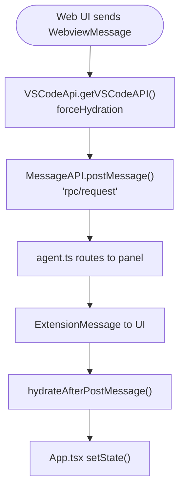
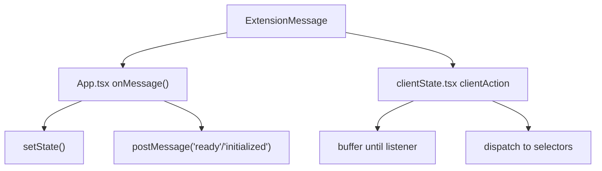
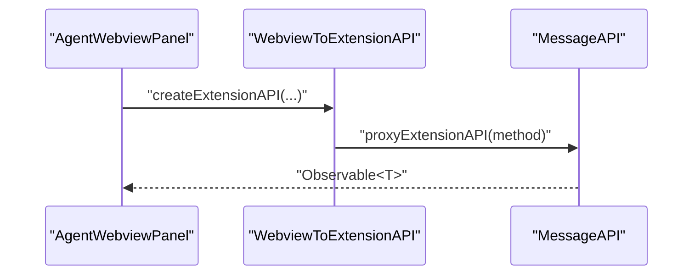
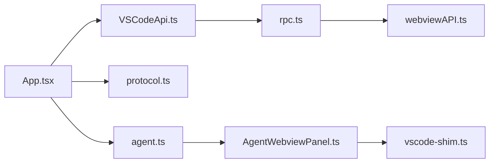

# VS Code Webview Integration

<cite>
**Referenced Files in This Document**
- [extension.web.ts](file://vscode/src/extension.web.ts)
- [agent.ts](file://agent/src/agent.ts)
- [AgentWebviewPanel.ts](file://agent/src/AgentWebviewPanel.ts)
- [NativeWebview.ts](file://agent/src/NativeWebview.ts)
- [vscode-shim.ts](file://agent/src/vscode-shim.ts)
- [webviewAPI.ts](file://lib/shared/src/misc/rpc/webviewAPI.ts)
- [rpc.ts](file://lib/shared/src/misc/rpc/rpc.ts)
- [protocol.ts](file://vscode/src/chat/protocol.ts)
- [index.tsx](file://vscode/webviews/index.tsx)
- [App.tsx](file://vscode/webviews/App.tsx)
- [VSCodeApi.ts](file://vscode/webviews/utils/VSCodeApi.ts)
- [clientState.tsx](file://vscode/webviews/client/clientState.tsx)
</cite>

## Table of Contents
1. [Introduction](#introduction)
2. [Project Structure](#project-structure)
3. [Core Components](#core-components)
4. [Architecture Overview](#architecture-overview)
5. [Detailed Component Analysis](#detailed-component-analysis)
6. [Dependency Analysis](#dependency-analysis)
7. [Performance Considerations](#performance-considerations)
8. [Troubleshooting Guide](#troubleshooting-guide)
9. [Conclusion](#conclusion)

## Introduction
This document explains the VS Code webview integration architecture used by the project’s web-based UI. It covers the webview lifecycle, bidirectional message protocols, data synchronization between the extension host and the web UI, VS Code API integration patterns, client state management, security model, and practical examples for initialization, configuration updates, and real-time data binding. It also includes debugging techniques and message tracing guidance.

## Project Structure
The webview integration spans three layers:
- Extension host (agent) manages webview panels and routes messages to/from the web UI.
- Shared RPC layer defines the message protocol and proxy-based API surface.
- Web UI (React) renders views, reacts to state updates, and sends commands to the extension host.

**Diagram sources**
- [AgentWebviewPanel.ts:49-172](file://agent/src/AgentWebviewPanel.ts#L49-L172)
- [vscode-shim.ts:499-545](file://agent/src/vscode-shim.ts#L499-L545)
- [agent.ts:1624-1661](file://agent/src/agent.ts#L1624-L1661)
- [webviewAPI.ts:20-115](file://lib/shared/src/misc/rpc/webviewAPI.ts#L20-L115)
- [rpc.ts:134-183](file://lib/shared/src/misc/rpc/rpc.ts#L134-L183)
- [index.tsx:1-18](file://vscode/webviews/index.tsx#L1-L18)
- [App.tsx:32-233](file://vscode/webviews/App.tsx#L32-L233)
- [VSCodeApi.ts:1-45](file://vscode/webviews/utils/VSCodeApi.ts#L1-L45)
- [clientState.tsx:1-134](file://vscode/webviews/client/clientState.tsx#L1-L134)

**Section sources**
- [extension.web.ts:14-34](file://vscode/src/extension.web.ts#L14-L34)
- [agent.ts:1624-1661](file://agent/src/agent.ts#L1624-L1661)
- [AgentWebviewPanel.ts:49-172](file://agent/src/AgentWebviewPanel.ts#L49-L172)
- [vscode-shim.ts:499-545](file://agent/src/vscode-shim.ts#L499-L545)
- [webviewAPI.ts:20-115](file://lib/shared/src/misc/rpc/webviewAPI.ts#L20-L115)
- [rpc.ts:134-183](file://lib/shared/src/misc/rpc/rpc.ts#L134-L183)
- [index.tsx:1-18](file://vscode/webviews/index.tsx#L1-L18)
- [App.tsx:32-233](file://vscode/webviews/App.tsx#L32-L233)
- [VSCodeApi.ts:1-45](file://vscode/webviews/utils/VSCodeApi.ts#L1-L45)
- [clientState.tsx:1-134](file://vscode/webviews/client/clientState.tsx#L1-L134)

## Core Components
- Webview lifecycle and message channels:
  - AgentWebviewPanel wraps a WebviewPanel and exposes postMessage/onMessage via EventEmitter-based bridges.
  - NativeWebview delegates HTML/CSP/title/icon to the extension host.
  - vscode-shim provides a default WebviewPanel implementation for agent environments.
- RPC and API surface:
  - createMessageAPIForWebview adapts VS Code’s postMessage/onMessage to a generic MessageAPI.
  - proxyExtensionAPI creates typed observables for extension-host APIs consumed by the web UI.
  - WebviewToExtensionAPI defines the contract for the extension-host side.
- Web UI:
  - index.tsx bootstraps the React app and passes getVSCodeAPI() to App.
  - App.tsx handles ExtensionMessage types, updates state, and posts WebviewMessage commands.
  - VSCodeApi.ts wraps the acquireVsCodeApi() bridge with hydration for complex objects.
  - clientState.tsx provides a clientAction dispatcher/buffer for actions from the extension host.

**Section sources**
- [AgentWebviewPanel.ts:49-172](file://agent/src/AgentWebviewPanel.ts#L49-L172)
- [NativeWebview.ts:333-375](file://agent/src/NativeWebview.ts#L333-L375)
- [vscode-shim.ts:499-545](file://agent/src/vscode-shim.ts#L499-L545)
- [webviewAPI.ts:20-115](file://lib/shared/src/misc/rpc/webviewAPI.ts#L20-L115)
- [rpc.ts:134-183](file://lib/shared/src/misc/rpc/rpc.ts#L134-L183)
- [index.tsx:1-18](file://vscode/webviews/index.tsx#L1-L18)
- [App.tsx:32-233](file://vscode/webviews/App.tsx#L32-L233)
- [VSCodeApi.ts:1-45](file://vscode/webviews/utils/VSCodeApi.ts#L1-L45)
- [clientState.tsx:1-134](file://vscode/webviews/client/clientState.tsx#L1-L134)

## Architecture Overview
The integration uses a bidirectional RPC channel:
- The web UI sends WebviewMessage commands to the extension host.
- The extension host sends ExtensionMessage updates to the web UI (configuration, transcript, theme, errors, client actions).
- The extension host can also stream observable results to the web UI using a streaming RPC pattern with streamId and events (next/error/complete).

**Diagram sources**
- [rpc.ts:134-183](file://lib/shared/src/misc/rpc/rpc.ts#L134-L183)
- [rpc.ts:250-334](file://lib/shared/src/misc/rpc/rpc.ts#L250-L334)
- [webviewAPI.ts:20-115](file://lib/shared/src/misc/rpc/webviewAPI.ts#L20-L115)
- [protocol.ts:55-179](file://vscode/src/chat/protocol.ts#L55-L179)
- [protocol.ts:188-235](file://vscode/src/chat/protocol.ts#L188-L235)
- [agent.ts:1624-1661](file://agent/src/agent.ts#L1624-L1661)
- [App.tsx:67-136](file://vscode/webviews/App.tsx#L67-L136)

## Detailed Component Analysis

### Webview Lifecycle and Panels
- AgentWebviewPanel:
  - Initializes with a unique panelID and emits “ready” and “initialized” upon first use.
  - Exposes extensionAPI via createExtensionAPI(createMessageAPIForWebview(...)) to allow the web UI to call extension-host APIs as observables.
  - Bridges postMessage/onMessage via EventEmitter to integrate with the agent’s message bus.
- NativeWebview:
  - Delegates title/icon changes to the extension host and maintains internal state for visibility and active status.
- vscode-shim.defaultWebviewPanel:
  - Provides a minimal WebviewPanel suitable for agent environments, wiring postMessage to an async emitter and exposing onDidReceiveMessage.

**Diagram sources**
- [AgentWebviewPanel.ts:49-172](file://agent/src/AgentWebviewPanel.ts#L49-L172)
- [NativeWebview.ts:333-375](file://agent/src/NativeWebview.ts#L333-L375)
- [vscode-shim.ts:499-545](file://agent/src/vscode-shim.ts#L499-L545)

**Section sources**
- [AgentWebviewPanel.ts:49-172](file://agent/src/AgentWebviewPanel.ts#L49-L172)
- [NativeWebview.ts:333-375](file://agent/src/NativeWebview.ts#L333-L375)
- [vscode-shim.ts:499-545](file://agent/src/vscode-shim.ts#L499-L545)

### Message Protocols and Serialization
- WebviewMessage (from UI to extension host):
  - Includes lifecycle commands (“ready”, “initialized”), telemetry, submit/edit commands, auth, attribution, and RPC requests.
- ExtensionMessage (from extension host to UI):
  - Includes configuration, client configuration, theme, transcript, view, rate limit, errors, clientAction, attribution, and RPC responses.
- Serialization:
  - VSCodeApi.getVSCodeAPI() wraps postMessage and onMessage, applying forceHydration and hydrateAfterPostMessage to restore complex objects (e.g., URIs).
- RPC:
  - createMessageAPIForWebview maps “rpc/response” to the extension host’s “rpc/request” and vice versa.
  - proxyExtensionAPI turns extension-host methods into observables with streaming support.

**Diagram sources**
- [protocol.ts:55-179](file://vscode/src/chat/protocol.ts#L55-L179)
- [protocol.ts:188-235](file://vscode/src/chat/protocol.ts#L188-L235)
- [VSCodeApi.ts:23-40](file://vscode/webviews/utils/VSCodeApi.ts#L23-L40)
- [rpc.ts:134-183](file://lib/shared/src/misc/rpc/rpc.ts#L134-L183)
- [App.tsx:67-136](file://vscode/webviews/App.tsx#L67-L136)

**Section sources**
- [protocol.ts:55-179](file://vscode/src/chat/protocol.ts#L55-L179)
- [protocol.ts:188-235](file://vscode/src/chat/protocol.ts#L188-L235)
- [VSCodeApi.ts:23-40](file://vscode/webviews/utils/VSCodeApi.ts#L23-L40)
- [rpc.ts:134-183](file://lib/shared/src/misc/rpc/rpc.ts#L134-L183)
- [App.tsx:67-136](file://vscode/webviews/App.tsx#L67-L136)

### Client State Management and Reactive Updates
- App.tsx:
  - Subscribes to ExtensionMessage types and updates React state (transcript, token usage, view, errors).
  - Sends “ready” and “initialized” lifecycle messages to the extension host.
  - Uses guardrails and telemetry integration based on clientConfig.
- clientState.tsx:
  - Provides a clientAction dispatcher/buffer to handle actions from the extension host (e.g., recent prompts).
  - Supports selective listeners via selectors and replay buffers for first-match delivery.

**Diagram sources**
- [App.tsx:67-136](file://vscode/webviews/App.tsx#L67-L136)
- [clientState.tsx:36-85](file://vscode/webviews/client/clientState.tsx#L36-L85)

**Section sources**
- [App.tsx:32-233](file://vscode/webviews/App.tsx#L32-L233)
- [clientState.tsx:1-134](file://vscode/webviews/client/clientState.tsx#L1-L134)

### VS Code API Integration Patterns
- Extension API exposure:
  - AgentWebviewPanel exposes WebviewToExtensionAPI via createExtensionAPI(createMessageAPIForWebview(...)).
  - Methods include prompts, models, authStatus, transcript, userHistory, and more.
- Workspace and configuration:
  - vscode-shim provides a workspace abstraction with configuration events and applyEdit forwarding to the agent.
  - Extension configuration changes are forwarded to the extension host for synchronization.
- Command execution:
  - Web UI posts commands (e.g., submit, edit, auth) which the extension host interprets and executes.

**Diagram sources**
- [AgentWebviewPanel.ts:149-162](file://agent/src/AgentWebviewPanel.ts#L149-L162)
- [webviewAPI.ts:117-167](file://lib/shared/src/misc/rpc/webviewAPI.ts#L117-L167)
- [rpc.ts:237-245](file://lib/shared/src/misc/rpc/rpc.ts#L237-L245)

**Section sources**
- [AgentWebviewPanel.ts:149-162](file://agent/src/AgentWebviewPanel.ts#L149-L162)
- [webviewAPI.ts:117-167](file://lib/shared/src/misc/rpc/webviewAPI.ts#L117-L167)
- [vscode-shim.ts:176-199](file://agent/src/vscode-shim.ts#L176-L199)

### Security Model and CSP
- NativeWebview delegates CSP source and HTML rendering to the extension host.
- The shim’s defaultWebviewPanel exposes cspSource and html fields, enabling the extension host to enforce Content Security Policy.
- Secure communication relies on the postMessage bridge and the agent’s JSON-RPC transport.

**Section sources**
- [NativeWebview.ts:333-375](file://agent/src/NativeWebview.ts#L333-L375)
- [vscode-shim.ts:531-543](file://agent/src/vscode-shim.ts#L531-L543)

### Practical Examples
- Webview initialization:
  - Web UI posts “ready” and “initialized” after mounting and receiving configuration.
  - See [App.tsx:138-148](file://vscode/webviews/App.tsx#L138-L148).
- Configuration updates:
  - Extension host sends “config” and “clientConfig” messages; UI applies theme CSS variables and updates state.
  - See [App.tsx:67-107](file://vscode/webviews/App.tsx#L67-L107).
- Real-time data binding:
  - Transcript updates include in-progress message handling and token usage.
  - See [App.tsx:79-93](file://vscode/webviews/App.tsx#L79-L93).
- Client actions:
  - Extension host can broadcast clientAction events; UI buffers and dispatches selectively.
  - See [clientState.tsx:36-85](file://vscode/webviews/client/clientState.tsx#L36-L85).

**Section sources**
- [App.tsx:67-148](file://vscode/webviews/App.tsx#L67-L148)
- [clientState.tsx:36-85](file://vscode/webviews/client/clientState.tsx#L36-L85)

## Dependency Analysis
- Coupling:
  - App.tsx depends on VSCodeApi.ts and protocol.ts for message typing.
  - rpc.ts and webviewAPI.ts define the RPC contract and proxies.
  - AgentWebviewPanel depends on vscode-shim for default WebviewPanel and on the agent for message routing.
- Cohesion:
  - Message serialization concerns are centralized in VSCodeApi.ts and rpc.ts.
  - UI state updates are encapsulated in App.tsx and clientState.tsx.

**Diagram sources**
- [App.tsx:32-233](file://vscode/webviews/App.tsx#L32-L233)
- [VSCodeApi.ts:1-45](file://vscode/webviews/utils/VSCodeApi.ts#L1-L45)
- [rpc.ts:134-183](file://lib/shared/src/misc/rpc/rpc.ts#L134-L183)
- [webviewAPI.ts:20-115](file://lib/shared/src/misc/rpc/webviewAPI.ts#L20-L115)
- [agent.ts:1624-1661](file://agent/src/agent.ts#L1624-L1661)
- [AgentWebviewPanel.ts:49-172](file://agent/src/AgentWebviewPanel.ts#L49-L172)
- [vscode-shim.ts:499-545](file://agent/src/vscode-shim.ts#L499-L545)

**Section sources**
- [App.tsx:32-233](file://vscode/webviews/App.tsx#L32-L233)
- [rpc.ts:134-183](file://lib/shared/src/misc/rpc/rpc.ts#L134-L183)
- [webviewAPI.ts:20-115](file://lib/shared/src/misc/rpc/webviewAPI.ts#L20-L115)
- [agent.ts:1624-1661](file://agent/src/agent.ts#L1624-L1661)
- [AgentWebviewPanel.ts:49-172](file://agent/src/AgentWebviewPanel.ts#L49-L172)
- [vscode-shim.ts:499-545](file://agent/src/vscode-shim.ts#L499-L545)

## Performance Considerations
- Streaming RPC:
  - Use streamId and streamEvent semantics to efficiently deliver incremental results and cancel streams on unsubscribe.
- Message batching:
  - Coalesce frequent UI updates (e.g., transcript deltas) to reduce re-renders.
- Hydration cost:
  - Avoid unnecessary hydration by limiting message payload sizes and using compact serializations where possible.
- Retain context:
  - Respect retainContextWhenHidden settings to balance performance and UX.

[No sources needed since this section provides general guidance]

## Troubleshooting Guide
- Enable RPC logs:
  - Set the environment variable to log RPC messages for debugging.
  - See [rpc.ts:336-346](file://lib/shared/src/misc/rpc/rpc.ts#L336-L346).
- Verify lifecycle messages:
  - Ensure the UI posts “ready” and “initialized” after mounting and receiving configuration.
  - See [App.tsx:138-148](file://vscode/webviews/App.tsx#L138-L148).
- Inspect message types:
  - Confirm WebviewMessage and ExtensionMessage variants align with protocol definitions.
  - See [protocol.ts:55-179](file://vscode/src/chat/protocol.ts#L55-L179) and [protocol.ts:188-235](file://vscode/src/chat/protocol.ts#L188-L235).
- Debug DevTools:
  - Use browser DevTools to inspect postMessage traffic and state updates.
  - Use VSCodeApi.getVSCodeAPI() wrapper to trace message flow.
  - See [VSCodeApi.ts:23-40](file://vscode/webviews/utils/VSCodeApi.ts#L23-L40).

**Section sources**
- [rpc.ts:336-346](file://lib/shared/src/misc/rpc/rpc.ts#L336-L346)
- [App.tsx:138-148](file://vscode/webviews/App.tsx#L138-L148)
- [protocol.ts:55-179](file://vscode/src/chat/protocol.ts#L55-L179)
- [protocol.ts:188-235](file://vscode/src/chat/protocol.ts#L188-L235)
- [VSCodeApi.ts:23-40](file://vscode/webviews/utils/VSCodeApi.ts#L23-L40)

## Conclusion
The VS Code webview integration leverages a robust RPC layer, a clear message protocol, and a React-based UI to synchronize state and enable bidirectional communication. The architecture cleanly separates concerns between the extension host, the shared RPC utilities, and the web UI, while providing strong typing and observability for real-time updates. Following the patterns documented here ensures reliable initialization, efficient data binding, and secure communication.