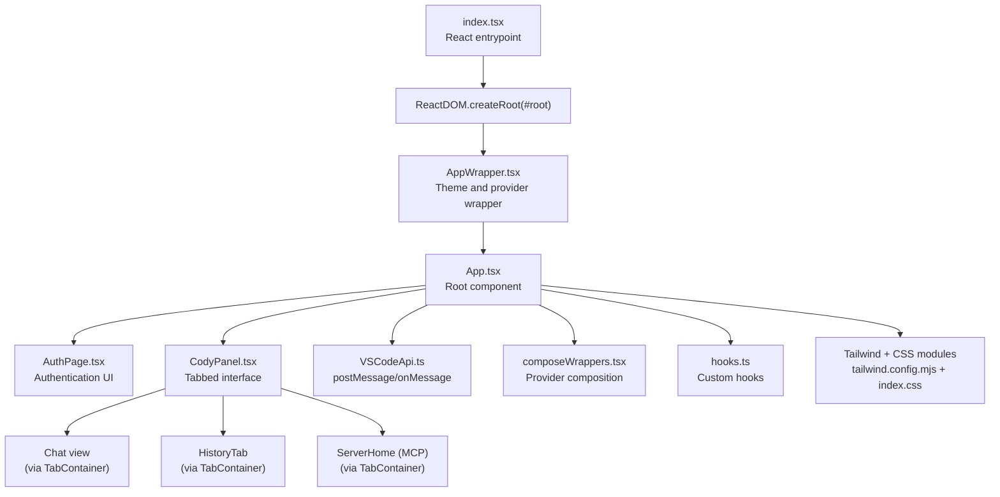
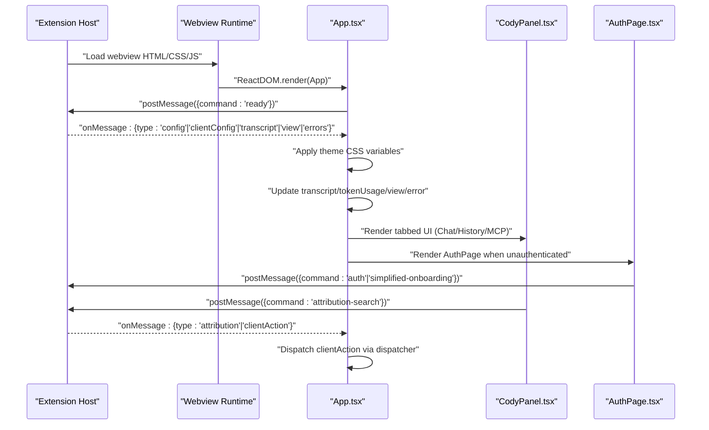
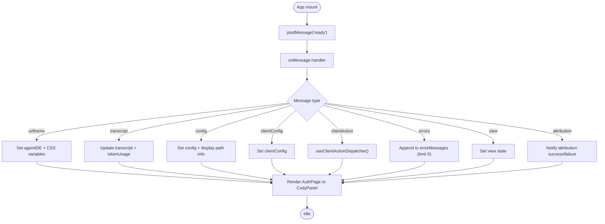
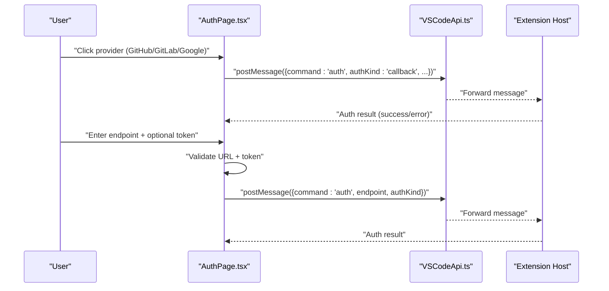
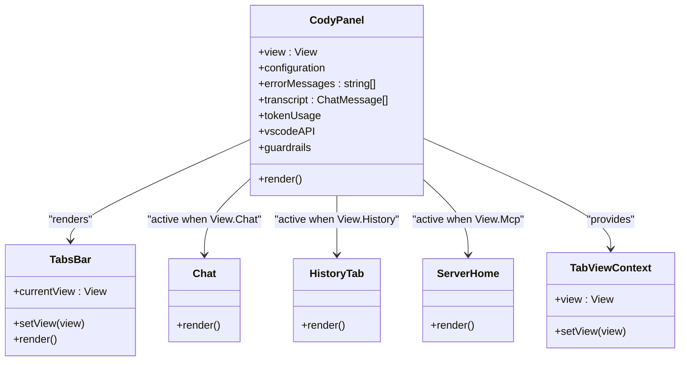
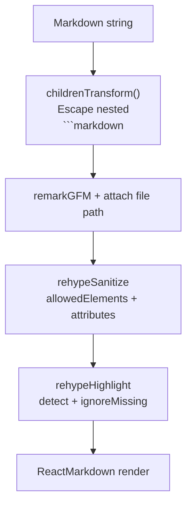
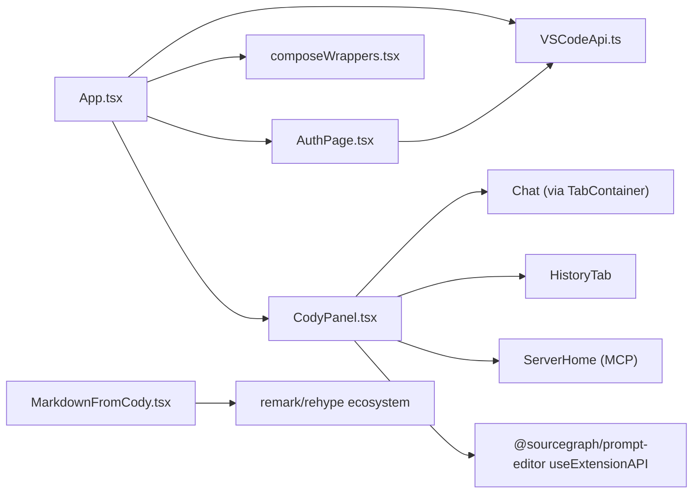
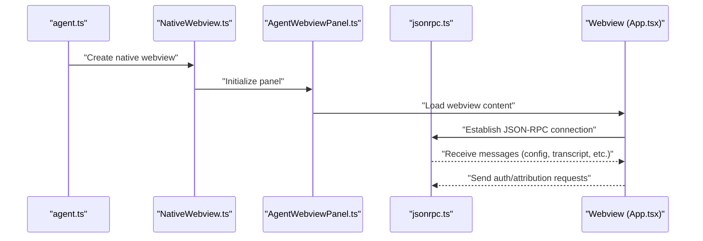

# Web Components

<cite>
**Referenced Files in This Document**
- [index.tsx](file://vscode/webviews/index.tsx)
- [App.tsx](file://vscode/webviews/App.tsx)
- [AppWrapper.tsx](file://vscode/webviews/AppWrapper.tsx)
- [AuthPage.tsx](file://vscode/webviews/AuthPage.tsx)
- [CodyPanel.tsx](file://vscode/webviews/CodyPanel.tsx)
- [MarkdownFromCody.tsx](file://vscode/webviews/components/MarkdownFromCody.tsx)
- [hooks.ts](file://vscode/webviews/components/hooks.ts)
- [VSCodeApi.ts](file://vscode/webviews/utils/VSCodeApi.ts)
- [composeWrappers.tsx](file://vscode/webviews/utils/composeWrappers.tsx)
- [types.ts](file://vscode/webviews/tabs/types.ts)
- [index.html](file://vscode/webviews/index.html)
- [index.css](file://vscode/webviews/index.css)
- [tailwind.config.mjs](file://vscode/webviews/tailwind.config.mjs)
- [postcss.config.js](file://vscode/webviews/postcss.config.js)
- [vite.config.mts](file://vscode/webviews/vite.config.mts)
- [globals.d.ts](file://vscode/webviews/globals.d.ts)
- [agent.ts](file://agent/src/agent.ts)
- [NativeWebview.ts](file://agent/src/NativeWebview.ts)
- [AgentWebviewPanel.ts](file://agent/src/AgentWebviewPanel.ts)
- [jsonrpc.ts](file://vscode/src/jsonrpc/jsonrpc.ts)
</cite>

## Table of Contents
1. [Introduction](#introduction)
2. [Project Structure](#project-structure)
3. [Core Components](#core-components)
4. [Architecture Overview](#architecture-overview)
5. [Detailed Component Analysis](#detailed-component-analysis)
6. [Dependency Analysis](#dependency-analysis)
7. [Performance Considerations](#performance-considerations)
8. [Security and Compliance](#security-and-compliance)
9. [Build System](#build-system)
10. [Testing Strategies](#testing-strategies)
11. [Troubleshooting Guide](#troubleshooting-guide)
12. [Conclusion](#conclusion)

## Introduction
This document describes the web components and browser-based integration system for the VS Code extension’s webviews. It covers the React component library architecture, state management, UI rendering strategies, VS Code webview message passing, styling architecture (CSS-in-JS, Tailwind CSS, and themes), agent integration via JSON-RPC/WebSocket, component APIs and event handling, browser compatibility and progressive enhancement, security measures, build system, and testing strategies.

## Project Structure
The webview application is a React app bundled with Vite and rendered inside VS Code webviews. The entry point initializes the React root and wraps the application with providers and configuration. The main application orchestrates views (chat, login, history, settings, MCP), handles theme and configuration updates from the extension host, and coordinates telemetry and client actions.

**Diagram sources**
- [index.tsx:11-17](file://vscode/webviews/index.tsx#L11-L17)
- [App.tsx:32-233](file://vscode/webviews/App.tsx#L32-L233)
- [AuthPage.tsx:46-239](file://vscode/webviews/AuthPage.tsx#L46-L239)
- [CodyPanel.tsx:67-194](file://vscode/webviews/CodyPanel.tsx#L67-L194)
- [VSCodeApi.ts:23-44](file://vscode/webviews/utils/VSCodeApi.ts#L23-L44)
- [composeWrappers.tsx:18-32](file://vscode/webviews/utils/composeWrappers.tsx#L18-L32)
- [hooks.ts:1-63](file://vscode/webviews/components/hooks.ts#L1-L63)
- [tailwind.config.mjs](file://vscode/webviews/tailwind.config.mjs)
- [index.css](file://vscode/webviews/index.css)

**Section sources**
- [index.tsx:1-18](file://vscode/webviews/index.tsx#L1-L18)
- [App.tsx:32-233](file://vscode/webviews/App.tsx#L32-L233)
- [index.html](file://vscode/webviews/index.html)
- [index.css](file://vscode/webviews/index.css)
- [tailwind.config.mjs](file://vscode/webviews/tailwind.config.mjs)
- [postcss.config.js](file://vscode/webviews/postcss.config.js)

## Core Components
- App: Central orchestration component managing configuration, client configuration, view state, transcript, token usage, and error messages. It listens to messages from the extension host, applies theme CSS variables, and renders either the AuthPage or CodyPanel depending on authentication state.
- AuthPage: Provides multiple authentication flows (GitHub, GitLab, Google, enterprise URL/token) and telemetry integration.
- CodyPanel: Tabbed container for chat, history, and MCP views, wiring extension API, feature flags, notices, and error banners.
- VSCodeApi: Thin wrapper around acquireVsCodeApi providing typed postMessage/onMessage and state persistence.
- ComposedWrappers: Utility to compose React Providers and components declaratively.
- hooks: Custom hooks for local storage and keyboard suppression.

**Section sources**
- [App.tsx:32-233](file://vscode/webviews/App.tsx#L32-L233)
- [AuthPage.tsx:46-239](file://vscode/webviews/AuthPage.tsx#L46-L239)
- [CodyPanel.tsx:67-194](file://vscode/webviews/CodyPanel.tsx#L67-L194)
- [VSCodeApi.ts:23-44](file://vscode/webviews/utils/VSCodeApi.ts#L23-L44)
- [composeWrappers.tsx:18-32](file://vscode/webviews/utils/composeWrappers.tsx#L18-L32)
- [hooks.ts:1-63](file://vscode/webviews/components/hooks.ts#L1-L63)

## Architecture Overview
The webview communicates with the extension host via a structured message protocol. The App component listens for incoming messages and updates internal state accordingly. It also posts messages for readiness, initialization, authentication requests, and attribution searches. Providers are composed to supply configuration, telemetry, and extension API to descendant components.

**Diagram sources**
- [App.tsx:67-148](file://vscode/webviews/App.tsx#L67-L148)
- [AuthPage.tsx:267-277](file://vscode/webviews/AuthPage.tsx#L267-L277)
- [CodyPanel.tsx:118-131](file://vscode/webviews/CodyPanel.tsx#L118-L131)
- [VSCodeApi.ts:23-44](file://vscode/webviews/utils/VSCodeApi.ts#L23-L44)

## Detailed Component Analysis

### App Component
Responsibilities:
- Manage configuration and client configuration state.
- Listen to extension-host messages to update theme, transcript, token usage, view, and errors.
- Provide telemetry recorder and guardrails integration.
- Render AuthPage when unauthenticated or CodyPanel when authenticated.
- Compose providers via ComposedWrappers.

Key behaviors:
- Theme application: Applies agentIDE and CSS variables to document root.
- Transcript handling: Supports in-progress message and token usage updates.
- Client action dispatch: Bridges extension actions to UI state.
- Attribution: Sends attribution search requests and reacts to attribution results.

**Diagram sources**
- [App.tsx:67-148](file://vscode/webviews/App.tsx#L67-L148)
- [App.tsx:150-162](file://vscode/webviews/App.tsx#L150-L162)

**Section sources**
- [App.tsx:32-233](file://vscode/webviews/App.tsx#L32-L233)

### AuthPage Component
Responsibilities:
- Provide multiple authentication pathways: enterprise URL/token, GitHub, GitLab, Google, and simplified onboarding for web.
- Validate endpoint URL and access token.
- Record telemetry events for auth clicks.
- Integrate with VS Code wrapper to send auth commands.

Key behaviors:
- Toggle between enterprise sign-in and provider-based sign-in.
- Memoized button and form components to minimize re-renders.
- Conditional rendering based on uiKindIsWeb and allowEndpointChange.

**Diagram sources**
- [AuthPage.tsx:89-95](file://vscode/webviews/AuthPage.tsx#L89-L95)
- [AuthPage.tsx:375-393](file://vscode/webviews/AuthPage.tsx#L375-L393)
- [VSCodeApi.ts:23-44](file://vscode/webviews/utils/VSCodeApi.ts#L23-L44)

**Section sources**
- [AuthPage.tsx:46-239](file://vscode/webviews/AuthPage.tsx#L46-L239)

### CodyPanel Component
Responsibilities:
- Provide a vertical tabbed UI for Chat, History, and MCP.
- Wire extension API (chat models, MCP settings, client action broadcast).
- Render notices, error banners, and state debug overlay.
- Manage view transitions and feature-flag-driven visibility.

Key behaviors:
- Subscribes to clientActionBroadcast and triggers UI actions (e.g., insert recent prompts).
- Conditionally renders MCP tab only when MCP servers are available.
- Exposes external API surface for running prompts programmatically.

**Diagram sources**
- [CodyPanel.tsx:67-194](file://vscode/webviews/CodyPanel.tsx#L67-L194)
- [types.ts:1-9](file://vscode/webviews/tabs/types.ts#L1-L9)

**Section sources**
- [CodyPanel.tsx:67-194](file://vscode/webviews/CodyPanel.tsx#L67-L194)
- [types.ts:1-9](file://vscode/webviews/tabs/types.ts#L1-L9)

### Markdown Rendering Component
Responsibilities:
- Render assistant responses safely with remark/rehype plugins.
- Sanitize HTML and restrict allowed elements and attributes.
- Support syntax highlighting with language detection.
- Transform URLs for IDE-specific opening behavior.

Key behaviors:
- Allowed URI schemes and elements are explicitly enumerated.
- URL transformation routes links to a VS Code command for IDE integration.
- Children transformation preserves nested Markdown code blocks.

**Diagram sources**
- [MarkdownFromCody.tsx](file://vscode/webviews/components/MarkdownFromCody.tsx#L151-L184)

**Section sources**
- [MarkdownFromCody.tsx](file://vscode/webviews/components/MarkdownFromCody.tsx#L151-L184)

### VS Code Webview Integration
Responsibilities:
- Provide a typed wrapper around acquireVsCodeApi for postMessage/onMessage.
- Hydrate messages with URIs and force hydration for transport safety.
- Persist and restore state via setState/getState.

Integration pattern:
- App mounts and immediately signals readiness.
- Listens for configuration and UI updates from the extension host.
- Sends auth requests and attribution queries back to the host.

**Section sources**
- [VSCodeApi.ts](file://vscode/webviews/utils/VSCodeApi.ts#L23-L44)
- [App.tsx](file://vscode/webviews/App.tsx#L138-L148)

### Provider Composition Pattern
Responsibilities:
- Compose React Providers and components without deep nesting.
- Supply telemetry recorder, extension API, config, client config, and link opener.

Composition:
- Wrapper union supports either a Provider with a value or a component with props.
- ComposedWrappers iterates backwards to wrap children in the correct order.

**Section sources**
- [composeWrappers.tsx](file://vscode/webviews/utils/composeWrappers.tsx#L6-L32)
- [App.tsx](file://vscode/webviews/App.tsx#L243-L272)

### Custom Hooks
Responsibilities:
- Local storage hook with JSON serialization/deserialization and setter.
- Keyboard suppression for Emacs keybindings and special characters.

Usage:
- Persist UI preferences and suppress unintended key combinations.

**Section sources**
- [hooks.ts](file://vscode/webviews/components/hooks.ts#L3-L27)
- [hooks.ts](file://vscode/webviews/components/hooks.ts#L29-L62)

## Dependency Analysis
High-level dependencies:
- App depends on VSCodeApi, ComposedWrappers, and multiple subcomponents.
- AuthPage depends on VSCodeApi and telemetry recorder.
- CodyPanel depends on extension API, feature flags, and tab utilities.
- MarkdownFromCody depends on remark/rehype ecosystem and syntax highlighting languages.

**Diagram sources**
- [App.tsx](file://vscode/webviews/App.tsx#L15-L31)
- [AuthPage.tsx](file://vscode/webviews/AuthPage.tsx#L1-L25)
- [CodyPanel.tsx](file://vscode/webviews/CodyPanel.tsx#L12-L29)
- [MarkdownFromCody.tsx](file://vscode/webviews/components/MarkdownFromCody.tsx#L1-L13)

**Section sources**
- [App.tsx](file://vscode/webviews/App.tsx#L15-L31)
- [AuthPage.tsx](file://vscode/webviews/AuthPage.tsx#L1-L25)
- [CodyPanel.tsx](file://vscode/webviews/CodyPanel.tsx#L12-L29)
- [MarkdownFromCody.tsx](file://vscode/webviews/components/MarkdownFromCody.tsx#L1-L13)

## Performance Considerations
- Memoization: App and AuthPage extensively use useMemo/useCallback to prevent unnecessary re-renders.
- Provider composition: ComposedWrappers avoids deeply nested JSX, reducing render overhead.
- Lazy rendering: Views are only rendered when configuration and view state are available.
- Plugin selection: Markdown rendering conditionally enables syntax highlighting to balance fidelity and performance.
- Device pixel ratio: Notifier is wired to optimize assets for high-DPI displays.

[No sources needed since this section provides general guidance]

## Security and Compliance
- Content Security Policy: The webview runtime enforces CSP; only allowed URI schemes are permitted for links.
- XSS prevention: rehypeSanitize whitelists elements and attributes; URL transformation ensures unsafe links are neutralized.
- Input validation: Endpoint URL validation and access token checks occur before posting auth messages.
- Telemetry: Events are recorded via a controlled telemetry recorder; sensitive data is not posted to the extension host.

**Section sources**
- [MarkdownFromCody.tsx](file://vscode/webviews/components/MarkdownFromCody.tsx#L22-L84)
- [MarkdownFromCody.tsx](file://vscode/webviews/components/MarkdownFromCody.tsx#L106-L129)
- [AuthPage.tsx](file://vscode/webviews/AuthPage.tsx#L317-L336)

## Build System
- Bundler: Vite with TypeScript and React Fast Refresh.
- Styling: Tailwind CSS with PostCSS; CSS modules used for scoped styles.
- Assets: Static assets referenced via imports; fonts and icons included via resource paths.
- Environment: Global declarations and type definitions for webview globals.

Build artifacts and configuration:
- Entry HTML and CSS are served by the webview host.
- Tailwind is configured for JIT and custom theme tokens.
- Vite configuration defines aliases and plugin pipeline.

**Section sources**
- [vite.config.mts](file://vscode/webviews/vite.config.mts)
- [tailwind.config.mjs](file://vscode/webviews/tailwind.config.mjs)
- [postcss.config.js](file://vscode/webviews/postcss.config.js)
- [index.html](file://vscode/webviews/index.html)
- [index.css](file://vscode/webviews/index.css)
- [globals.d.ts](file://vscode/webviews/globals.d.ts)

## Testing Strategies
- Unit tests: Component-level tests using React Testing Library and Vitest; focus on rendering, prop interfaces, and event handlers.
- Integration tests: End-to-end tests with Playwright covering user flows (auth, chat, history).
- Visual regression: Storybook stories for component variants and Tailwind-based UI states.
- Mocking: VSCode API wrapper can be replaced for isolated testing; extension API observables mocked via libraries.

[No sources needed since this section provides general guidance]

## Troubleshooting Guide
Common issues and resolutions:
- Webview not receiving messages: Verify readiness signaling and onMessage registration.
- Authentication failures: Check endpoint URL validation and access token format; confirm allowEndpointChange setting.
- Theme not applied: Ensure ui/theme messages include CSS variables and agentIDE.
- Markdown rendering anomalies: Confirm allowed elements and attributes; check URL transformation and sanitization rules.
- MCP tab missing: Confirm MCP servers observable resolves; otherwise tab defaults to Chat.

**Section sources**
- [App.tsx](file://vscode/webviews/App.tsx#L67-L148)
- [AuthPage.tsx](file://vscode/webviews/AuthPage.tsx#L317-L336)
- [MarkdownFromCody.tsx](file://vscode/webviews/components/MarkdownFromCody.tsx#L106-L129)
- [CodyPanel.tsx](file://vscode/webviews/CodyPanel.tsx#L107-L111)

## Agent Integration and Real-Time Communication
The agent integrates with the webview through JSON-RPC and a native webview panel abstraction. The agent exposes a JSON-RPC client that communicates with the extension host, while the webview uses a VS Code wrapper for message passing. The agent also manages native webview panels and state persistence.

**Diagram sources**
- [agent.ts](file://agent/src/agent.ts)
- [NativeWebview.ts](file://agent/src/NativeWebview.ts)
- [AgentWebviewPanel.ts](file://agent/src/AgentWebviewPanel.ts)
- [jsonrpc.ts](file://vscode/src/jsonrpc/jsonrpc.ts)

**Section sources**
- [agent.ts](file://agent/src/agent.ts)
- [NativeWebview.ts](file://agent/src/NativeWebview.ts)
- [AgentWebviewPanel.ts](file://agent/src/AgentWebviewPanel.ts)
- [jsonrpc.ts](file://vscode/src/jsonrpc/jsonrpc.ts)

## Browser Compatibility and Progressive Enhancement
- Polyfills: The project relies on modern web APIs; ensure polyfills for older browsers if targeting legacy environments.
- Feature detection: Use capability checks for optional features (e.g., MCP availability).
- Graceful degradation: Disable advanced features (e.g., syntax highlighting) when unsupported.
- Accessibility: Ensure keyboard navigation and screen reader compatibility via semantic markup and ARIA attributes.

[No sources needed since this section provides general guidance]

## Conclusion
The webview system combines a modular React component library with a robust VS Code integration layer. It emphasizes safe rendering, efficient provider composition, and clear message protocols. The styling architecture leverages Tailwind CSS and CSS modules, while the agent integration ensures seamless real-time communication. The documented patterns and guidelines provide a foundation for extending functionality, maintaining security, and ensuring cross-browser compatibility.