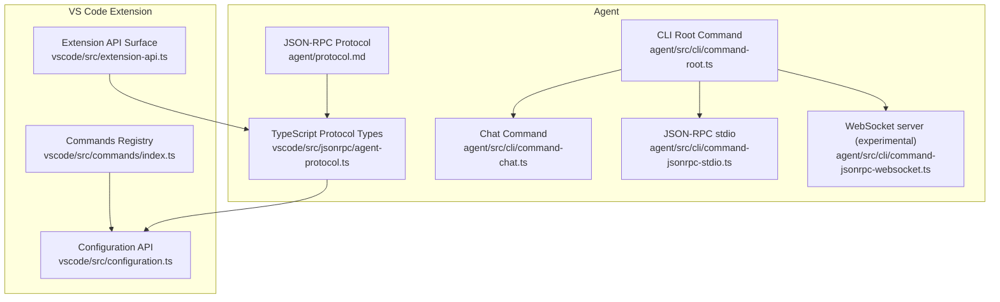
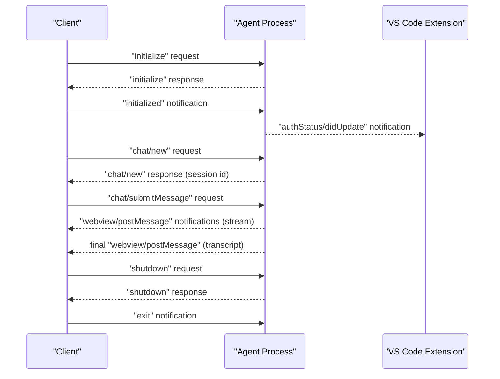
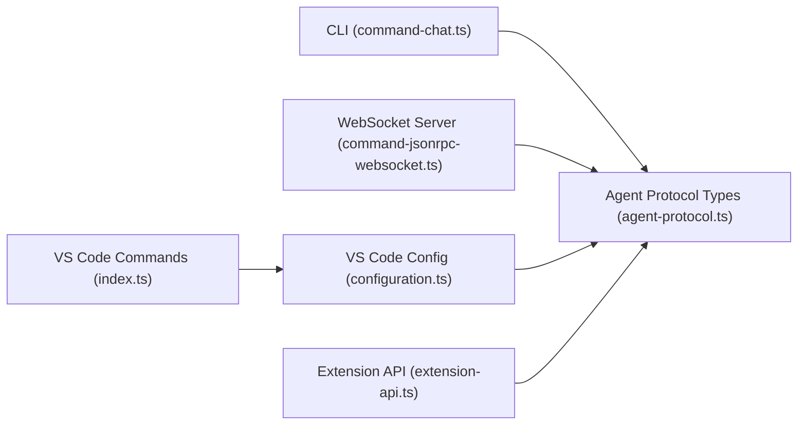

# API Reference

<cite>
**Referenced Files in This Document**
- [protocol.md](file://agent/protocol.md)
- [agent-protocol.ts](file://vscode/src/jsonrpc/agent-protocol.ts)
- [command-root.ts](file://agent/src/cli/command-root.ts)
- [command-chat.ts](file://agent/src/cli/command-chat.ts)
- [command-jsonrpc-stdio.ts](file://agent/src/cli/command-jsonrpc-stdio.ts)
- [command-jsonrpc-websocket.ts](file://agent/src/cli/command-jsonrpc-websocket.ts)
- [index.ts](file://vscode/src/commands/index.ts)
- [configuration.ts](file://vscode/src/configuration.ts)
- [extension-api.ts](file://vscode/src/extension-api.ts)
</cite>

## Table of Contents
1. [Introduction](#introduction)
2. [Project Structure](#project-structure)
3. [Core Components](#core-components)
4. [Architecture Overview](#architecture-overview)
5. [Detailed Component Analysis](#detailed-component-analysis)
6. [Dependency Analysis](#dependency-analysis)
7. [Performance Considerations](#performance-considerations)
8. [Troubleshooting Guide](#troubleshooting-guide)
9. [Conclusion](#conclusion)
10. [Appendices](#appendices)

## Introduction
This document provides comprehensive API documentation for the Cody platform’s public interfaces. It covers:
- The JSON-RPC protocol used by the Agent for client–server communication
- The VS Code extension APIs for command registration, configuration, and event handling
- The CLI interface with commands, options, and usage patterns
- WebSocket interfaces for real-time communication and HTTP endpoints for web integration
- Protocol-specific examples, error handling strategies, and authentication methods
- Versioning, compatibility, and deprecation policies
- Debugging tools, monitoring approaches, and performance optimization tips

## Project Structure
The Cody platform exposes multiple public surfaces:
- Agent JSON-RPC protocol for headless and plugin integrations
- VS Code extension APIs for commands, configuration, and events
- CLI for headless usage and JSON-RPC over stdio
- Experimental WebSocket server for JSON-RPC over websockets

**Diagram sources**
- [protocol.md](file://agent/protocol.md)
- [agent-protocol.ts](file://vscode/src/jsonrpc/agent-protocol.ts)
- [command-root.ts](file://agent/src/cli/command-root.ts)
- [command-chat.ts](file://agent/src/cli/command-chat.ts)
- [command-jsonrpc-stdio.ts](file://agent/src/cli/command-jsonrpc-stdio.ts)
- [command-jsonrpc-websocket.ts](file://agent/src/cli/command-jsonrpc-websocket.ts)
- [index.ts](file://vscode/src/commands/index.ts)
- [configuration.ts](file://vscode/src/configuration.ts)
- [extension-api.ts](file://vscode/src/extension-api.ts)

**Section sources**
- [protocol.md](file://agent/protocol.md)
- [agent-protocol.ts](file://vscode/src/jsonrpc/agent-protocol.ts)
- [command-root.ts](file://agent/src/cli/command-root.ts)
- [command-chat.ts](file://agent/src/cli/command-chat.ts)
- [command-jsonrpc-stdio.ts](file://agent/src/cli/command-jsonrpc-stdio.ts)
- [command-jsonrpc-websocket.ts](file://agent/src/cli/command-jsonrpc-websocket.ts)
- [index.ts](file://vscode/src/commands/index.ts)
- [configuration.ts](file://vscode/src/configuration.ts)
- [extension-api.ts](file://vscode/src/extension-api.ts)

## Core Components
- Agent JSON-RPC protocol: Defines requests, notifications, and data models for client–server interaction. See [protocol.md](file://agent/protocol.md) and [agent-protocol.ts](file://vscode/src/jsonrpc/agent-protocol.ts).
- VS Code extension APIs: Expose commands, configuration getters, and extension API surface. See [index.ts](file://vscode/src/commands/index.ts), [configuration.ts](file://vscode/src/configuration.ts), and [extension-api.ts](file://vscode/src/extension-api.ts).
- CLI: Provides subcommands for authentication, chat, models, and JSON-RPC stdio. See [command-root.ts](file://agent/src/cli/command-root.ts) and [command-chat.ts](file://agent/src/cli/command-chat.ts).
- WebSocket server: Experimental JSON-RPC over websocket server. See [command-jsonrpc-websocket.ts](file://agent/src/cli/command-jsonrpc-websocket.ts).

**Section sources**
- [protocol.md](file://agent/protocol.md)
- [agent-protocol.ts](file://vscode/src/jsonrpc/agent-protocol.ts)
- [index.ts](file://vscode/src/commands/index.ts)
- [configuration.ts](file://vscode/src/configuration.ts)
- [extension-api.ts](file://vscode/src/extension-api.ts)
- [command-root.ts](file://agent/src/cli/command-root.ts)
- [command-chat.ts](file://agent/src/cli/command-chat.ts)
- [command-jsonrpc-stdio.ts](file://agent/src/cli/command-jsonrpc-stdio.ts)
- [command-jsonrpc-websocket.ts](file://agent/src/cli/command-jsonrpc-websocket.ts)

## Architecture Overview
The Agent protocol is a bidirectional JSON-RPC 2.0 over stdout/stdin. The VS Code extension integrates with the Agent via the protocol and exposes commands and configuration. The CLI embeds the Agent and exposes subcommands for chat and JSON-RPC stdio. The WebSocket server is experimental and forwards JSON-RPC messages to the Agent.

**Diagram sources**
- [protocol.md](file://agent/protocol.md)
- [agent-protocol.ts](file://vscode/src/jsonrpc/agent-protocol.ts)

## Detailed Component Analysis

### JSON-RPC Protocol (Agent)
- Transport: stdout/stdin
- Base protocol: Peer-to-peer JSON-RPC 2.0; requests expect responses; notifications do not
- Methods are grouped into:
  - Client-to-server requests (e.g., initialize, chat/new, chat/submitMessage, autocomplete/execute)
  - Server-to-client requests (e.g., window/showMessage, textDocument/edit)
  - Client-to-server notifications (e.g., initialized, textDocument/didOpen)
  - Server-to-client notifications (e.g., webview/postMessage, progress/start)
- Data models include ClientInfo, ServerInfo, ExtensionConfiguration, ProtocolAuthStatus, TelemetryEvent, Position, Range, AutocompleteParams/Result, and many others

Key method categories:
- Initialization and lifecycle: initialize, initialized, shutdown, exit
- Chat: chat/new, chat/web/new, chat/sidebar/new, chat/delete, chat/models, chat/export, chat/import, chat/submitMessage, chat/editMessage, chat/setModel
- Commands: commands/explain, commands/test, commands/smell, commands/custom, customCommands/list
- Edit tasks: editTask/start, editTask/accept, editTask/undo, editTask/cancel, editTask/retry, editTask/getTaskDetails, editTask/getFoldingRanges
- Code actions: codeActions/provide, codeActions/trigger
- Autocomplete: autocomplete/execute
- GraphQL: graphql/getRepoIds, graphql/currentUserId, graphql/currentUserIsPro, graphql/getCurrentUserCodySubscription, graphql/getRepoIdIfEmbeddingExists, graphql/getRepoId
- Feature flags: featureFlags/getFeatureFlag
- Telemetry: telemetry/recordEvent
- Webviews: webview/didDispose, webview/resolveWebviewView, webview/receiveMessage, webview/receiveMessageStringEncoded
- Diagnostics: diagnostics/publish
- Testing helpers: testing/progress, testing/exportedTelemetryEvents, testing/networkRequests, testing/requestErrors, testing/closestPostData, testing/memoryUsage, testing/heapdump, testing/awaitPendingPromises, testing/workspaceDocuments, testing/diagnostics, testing/progressCancelation, testing/reset, testing/autocomplete/completionEvent, testing/autocomplete/autoeditEvent, testing/autocomplete/awaitPendingVisibilityTimeout, testing/autocomplete/setCompletionVisibilityDelay, testing/autocomplete/providerConfig
- Extension configuration: extensionConfiguration/change, extensionConfiguration/status, extensionConfiguration/getSettingsSchema, extension/reset
- Ignore policy: ignore/test, testing/ignore/overridePolicy
- Internal: internal/getAuthHeaders
- Server requests: window/showMessage, window/showSaveDialog, textDocument/edit, textDocument/show, textEditor/selection, textEditor/revealRange, workspace/edit, secrets/get/store/delete, env/openExternal, editTask/getUserInput
- Client notifications: extensionConfiguration/didChange (deprecated), workspaceFolder/didChange, textDocument/* lifecycle, workspace/* file events, $/cancelRequest, autocomplete/* telemetry, progress/cancel, testing/runInAgent, webview/didDisposeNative, secrets/didChange, window/didChangeFocus, testing/resetStorage
- Server notifications: autocomplete/didHide, autocomplete/didTrigger, debug/message, extensionConfiguration/didUpdate, extensionConfiguration/openSettings, codeLenses/display, ignore/didChange, webview/postMessage(s), progress/*, webview/* native webview lifecycle, window/didChangeContext, window/focusSidebar, authStatus/didUpdate

Authentication and configuration:
- ExtensionConfiguration carries serverEndpoint, proxy, accessToken, customHeaders, anonymousUserID, and customConfigurationJson
- ProtocolAuthStatus distinguishes authenticated vs unauthenticated states and includes user metadata and pending validation flags

Telemetry:
- TelemetryEvent includes feature, action, and parameters with optional metadata and billing metadata

**Section sources**
- [protocol.md](file://agent/protocol.md)
- [agent-protocol.ts](file://vscode/src/jsonrpc/agent-protocol.ts)

### VS Code Extension APIs
- Commands registry: Exposes menu items for chat, edit, document, explain, unit tests, code smells, commit generation, and custom commands
- Configuration API: Resolves client configuration with sanitization, including network settings, codebase, server endpoint, custom headers, debug filters, autocomplete modes, code actions, chat/agentic context, external auth providers, and internal/unstable toggles
- Extension API surface: Public API class exposing extensionMode and optional testing hooks when environment variable CODY_TESTING is enabled

Common use cases:
- Registering commands and keybindings for chat and edit workflows
- Reading and applying configuration values for autocomplete, networking, and telemetry
- Providing testing hooks for CI and E2E scenarios

**Section sources**
- [index.ts](file://vscode/src/commands/index.ts)
- [configuration.ts](file://vscode/src/configuration.ts)
- [extension-api.ts](file://vscode/src/extension-api.ts)

### CLI Interface
- Root command groups subcommands for auth, chat, models, and API (jsonrpc-stdio and jsonrpc-websocket)
- Chat command:
  - Options: message, stdin, dir, model, context-repo, context-file, show-context, ignore-context-window-errors, silent, debug
  - Behavior: initializes embedded Agent, authenticates, selects model, constructs context, submits message, streams transcript, validates context window
- JSON-RPC stdio:
  - Options: recording directory/mode/name/expiry and related Polly controls
  - Behavior: sets up JSON-RPC connection over stdin/stdout, optionally with network recording/replay
- JSON-RPC websocket (experimental):
  - Options: port
  - Behavior: starts WebSocket server, forwards messages to Agent client

Usage examples:
- Chat with context files and repositories
- Pipe diffs or stdin into chat
- Authenticate and run headless chat sessions

**Section sources**
- [command-root.ts](file://agent/src/cli/command-root.ts)
- [command-chat.ts](file://agent/src/cli/command-chat.ts)
- [command-jsonrpc-stdio.ts](file://agent/src/cli/command-jsonrpc-stdio.ts)
- [command-jsonrpc-websocket.ts](file://agent/src/cli/command-jsonrpc-websocket.ts)

### WebSocket Interfaces and HTTP Endpoints
- WebSocket server (experimental):
  - Starts a WebSocket server on a configurable port
  - On first message, initializes Agent client with configured credentials and logs initialization
  - Messages are logged and processed conceptually; current implementation notes indicate future rework with vscode-jsonrpc
- HTTP endpoints:
  - No HTTP endpoints are exposed by the Agent or CLI in the analyzed files; HTTP is primarily used for upstream server communication

Note: The WebSocket server is marked as not working at the moment and is intended for experimentation.

**Section sources**
- [command-jsonrpc-websocket.ts](file://agent/src/cli/command-jsonrpc-websocket.ts)

## Dependency Analysis
- The Agent protocol types are defined in TypeScript and consumed by the VS Code extension and CLI
- The CLI embeds the Agent and uses the protocol to drive chat and autocomplete
- The VS Code extension reads configuration and exposes commands that internally use the protocol
- The WebSocket server depends on the Agent client and forwards JSON-RPC messages

**Diagram sources**
- [agent-protocol.ts](file://vscode/src/jsonrpc/agent-protocol.ts)
- [command-chat.ts](file://agent/src/cli/command-chat.ts)
- [command-jsonrpc-websocket.ts](file://agent/src/cli/command-jsonrpc-websocket.ts)
- [configuration.ts](file://vscode/src/configuration.ts)
- [index.ts](file://vscode/src/commands/index.ts)
- [extension-api.ts](file://vscode/src/extension-api.ts)

**Section sources**
- [agent-protocol.ts](file://vscode/src/jsonrpc/agent-protocol.ts)
- [command-chat.ts](file://agent/src/cli/command-chat.ts)
- [command-jsonrpc-websocket.ts](file://agent/src/cli/command-jsonrpc-websocket.ts)
- [configuration.ts](file://vscode/src/configuration.ts)
- [index.ts](file://vscode/src/commands/index.ts)
- [extension-api.ts](file://vscode/src/extension-api.ts)

## Performance Considerations
- Use context filtering to avoid oversized context windows; the CLI validates context and cancels when items exceed limits
- Disable autocomplete in CLI to reduce overhead when only chat is needed
- Prefer streaming responses for long-running operations; monitor token throughput for feedback
- Use Polly recording modes judiciously in tests to avoid excessive network overhead
- Avoid frequent $/cancelRequest misuse; only cancel progress bars marked as cancelable

[No sources needed since this section provides general guidance]

## Troubleshooting Guide
- Authentication failures:
  - Verify access token and server endpoint; use CLI auth commands to manage accounts
  - Check ProtocolAuthStatus for pending validation or error details
- Context window errors:
  - Reduce context files or repositories; use ignore-context-window-errors only when appropriate
- Network issues:
  - Configure proxy and custom headers via ExtensionConfiguration; review Polly recording logs for request errors
- Debugging:
  - Enable debug logging in CLI chat; subscribe to debug/message notifications
  - Use testing/progress and testing/progressCancelation to simulate progress UI behavior
- WebSocket server:
  - The server is experimental; consult logs and consider stdio-based JSON-RPC as a stable alternative

**Section sources**
- [command-chat.ts](file://agent/src/cli/command-chat.ts)
- [agent-protocol.ts](file://vscode/src/jsonrpc/agent-protocol.ts)

## Conclusion
Cody exposes a robust JSON-RPC protocol for Agent communication, a rich VS Code extension API surface, and a flexible CLI for headless usage. The protocol supports chat, commands, editing, diagnostics, telemetry, and webviews. The CLI and WebSocket server provide multiple integration pathways, with clear authentication and configuration mechanisms. Following the guidelines above ensures reliable, performant, and maintainable integrations.

[No sources needed since this section summarizes without analyzing specific files]

## Appendices

### API Method Definitions and Schemas
- Requests (Client → Server)
  - initialize: [ClientInfo, ServerInfo]
  - chat/new: [null, string]
  - chat/web/new: [null, { panelId: string; chatId: string }]
  - chat/sidebar/new: [null, { panelId: string; chatId: string }]
  - chat/delete: [{ chatId: string }, ChatExportResult[]]
  - chat/models: [{ modelUsage: ModelUsage }, { readOnly: boolean; models: ModelAvailabilityStatus[] }]
  - chat/export: [null | { fullHistory: boolean }, ChatExportResult[]]
  - chat/import: [{ history: Record<string, Record<string, SerializedChatTranscript>>; merge: boolean }, null]
  - chat/submitMessage: [{ id: string; message: WebviewMessage }, ExtensionMessage]
  - chat/editMessage: [{ id: string; message: WebviewMessage }, ExtensionMessage]
  - chat/setModel: [{ id: string; model: Model['id'] }, null]
  - commands/explain: [null, string]
  - commands/test: [null, string]
  - commands/smell: [null, string]
  - commands/custom: [{ key: string }, CustomCommandResult]
  - customCommands/list: [null, CodyCommand[]]
  - editTask/start: [null, FixupTaskID | undefined | null]
  - editTask/accept: [FixupTaskID, null]
  - editTask/undo: [FixupTaskID, null]
  - editTask/cancel: [FixupTaskID, null]
  - editTask/retry: [FixupTaskID, FixupTaskID | undefined | null]
  - editTask/getTaskDetails: [FixupTaskID, EditTask]
  - editTask/getFoldingRanges: [GetFoldingRangeParams, GetFoldingRangeResult]
  - command/execute: [ExecuteCommandParams, any]
  - codeActions/provide: [{ location: ProtocolLocation; triggerKind: CodeActionTriggerKind }, { codeActions: ProtocolCodeAction[] }]
  - codeActions/trigger: [FixupTaskID, FixupTaskID | undefined | null]
  - autocomplete/execute: [AutocompleteParams, AutocompleteResult]
  - graphql/getRepoIds: [{ names: string[]; first: number }, { repos: { name: string; id: string }[] }]
  - graphql/currentUserId: [null, string]
  - graphql/currentUserIsPro: [null, boolean]
  - featureFlags/getFeatureFlag: [{ flagName: string }, boolean | null]
  - graphql/getCurrentUserCodySubscription: [null, CurrentUserCodySubscription | null]
  - telemetry/recordEvent: [TelemetryEvent, null]
  - graphql/getRepoIdIfEmbeddingExists: [{ repoName: string }, string | null]
  - graphql/getRepoId: [{ repoName: string }, string | null]
  - git/codebaseName: [{ url: string }, string | null]
  - webview/didDispose: [{ id: string }, null]
  - webview/resolveWebviewView: [{ viewId: string; webviewHandle: string }, null]
  - webview/receiveMessage: [{ id: string; message: WebviewMessage }, null]
  - webview/receiveMessageStringEncoded: [{ id: string; messageStringEncoded: string }, null]
  - diagnostics/publish: [{ diagnostics: ProtocolDiagnostic[] }, null]
  - testing/progress: [{ title: string }, { result: string }]
  - testing/exportedTelemetryEvents: [null, { events: TestingTelemetryEvent[] }]
  - testing/networkRequests: [null, { requests: NetworkRequest[] }]
  - testing/requestErrors: [null, { errors: NetworkRequest[] }]
  - testing/closestPostData: [{ url: string; postData: string }, { closestBody: string }]
  - testing/memoryUsage: [null, { usage: MemoryUsage }]
  - testing/heapdump: [null, null]
  - testing/awaitPendingPromises: [null, null]
  - testing/workspaceDocuments: [GetDocumentsParams, GetDocumentsResult]
  - testing/diagnostics: [{ uri: string }, { diagnostics: ProtocolDiagnostic[] }]
  - testing/progressCancelation: [{ title: string }, { result: string }]
  - testing/reset: [null, null]
  - testing/autocomplete/completionEvent: [CompletionItemParams, CompletionBookkeepingEvent | undefined | null]
  - testing/autocomplete/autoeditEvent: [CompletionItemParams, AutoeditRequestStateForAgentTesting | undefined | null]
  - testing/autocomplete/awaitPendingVisibilityTimeout: [null, CompletionItemID | undefined]
  - testing/autocomplete/setCompletionVisibilityDelay: [{ delay: number }, null]
  - testing/autocomplete/providerConfig: [null, { id: string; legacyModel: string; configSource: string } | null | undefined]
  - extensionConfiguration/change: [ExtensionConfiguration, ProtocolAuthStatus | null]
  - extensionConfiguration/status: [null, ProtocolAuthStatus | null]
  - extensionConfiguration/getSettingsSchema: [null, string]
  - textDocument/change: [ProtocolTextDocument, { success: boolean }]
  - attribution/search: [{ id: string; snippet: string }, { error?: string | undefined | null; repoNames: string[]; limitHit: boolean }]
  - ignore/test: [{ uri: string }, { policy: 'ignore' | 'use' }]
  - testing/ignore/overridePolicy: [ContextFilters | null, null]
  - extension/reset: [null, null]
  - internal/getAuthHeaders: [string, Record<string, string>]

- Notifications (Client → Server)
  - initialized: [null]
  - exit: [null]
  - extensionConfiguration/didChange: [ExtensionConfiguration] (deprecated)
  - workspaceFolder/didChange: [{ uris: string[] }]
  - textDocument/didOpen: [ProtocolTextDocument]
  - textDocument/didChange: [ProtocolTextDocument]
  - textDocument/didFocus: [{ uri: string }]
  - textDocument/didSave: [{ uri: string }]
  - textDocument/didRename: [{ oldUri: string; newUri: string }]
  - textDocument/didClose: [ProtocolTextDocument]
  - workspace/didDeleteFiles: [DeleteFilesParams]
  - workspace/didCreateFiles: [CreateFilesParams]
  - workspace/didRenameFiles: [RenameFilesParams]
  - $/cancelRequest: [CancelParams]
  - autocomplete/clearLastCandidate: [null]
  - autocomplete/completionSuggested: [CompletionItemParams]
  - autocomplete/completionAccepted: [CompletionItemParams]
  - progress/cancel: [{ id: string }]
  - testing/runInAgent: [string]
  - webview/didDisposeNative: [{ handle: string }]
  - secrets/didChange: [{ key: string }]
  - window/didChangeFocus: [{ focused: boolean }]
  - testing/resetStorage: [null]

- Requests (Server → Client)
  - window/showMessage: [ShowWindowMessageParams, string | null]
  - window/showSaveDialog: [SaveDialogOptionsParams, string | undefined | null]
  - textDocument/edit: [TextDocumentEditParams, boolean]
  - textDocument/show: [{ uri: string; options?: TextDocumentShowOptionsParams | undefined | null }, boolean]
  - textEditor/selection: [{ uri: string; selection: Range }, null]
  - textEditor/revealRange: [{ uri: string; range: Range }, null]
  - workspace/edit: [WorkspaceEditParams, boolean]
  - secrets/get: [{ key: string }, string | null | undefined]
  - secrets/store: [{ key: string; value: string }, null | undefined]
  - secrets/delete: [{ key: string }, null | undefined]
  - env/openExternal: [{ uri: string }, boolean]
  - editTask/getUserInput: [UserEditPromptRequest, UserEditPromptResult | undefined | null]

- Notifications (Server → Client)
  - autocomplete/didHide: [null]
  - autocomplete/didTrigger: [null]
  - debug/message: [DebugMessage]
  - extensionConfiguration/didUpdate: [{ key: string; value?: string | undefined | null }]
  - extensionConfiguration/openSettings: [null]
  - codeLenses/display: [DisplayCodeLensParams]
  - ignore/didChange: [null]
  - webview/postMessage: [WebviewPostMessageParams]
  - webview/postMessageStringEncoded: [{ id: string; stringEncodedMessage: string }]
  - progress/start: [ProgressStartParams]
  - progress/report: [ProgressReportParams]
  - progress/end: [{ id: string }]
  - webview/registerWebviewView: [{ viewId: string; retainContextWhenHidden: boolean }]
  - webview/createWebviewPanel: [{ handle: string; viewType: string; title: string; showOptions: { preserveFocus: boolean; viewColumn: number }; options: WebviewCreateWebviewPanelOptions }, null]
  - webview/dispose: [{ handle: string }]
  - webview/reveal: [{ handle: string; viewColumn: number; preserveFocus: boolean }]
  - webview/setTitle: [{ handle: string; title: string }]
  - webview/setIconPath: [{ handle: string; iconPathUri?: string | null | undefined }]
  - webview/setOptions: [{ handle: string; options: DefiniteWebviewOptions }]
  - webview/setHtml: [{ handle: string; html: string }]
  - window/didChangeContext: [{ key: string; value?: string | undefined | null }]
  - window/focusSidebar: [null]
  - authStatus/didUpdate: [ProtocolAuthStatus]

**Section sources**
- [protocol.md](file://agent/protocol.md)
- [agent-protocol.ts](file://vscode/src/jsonrpc/agent-protocol.ts)

### CLI Command Specifications
- Root command: cody -v/--version, description, subcommands auth, chat, models, api, internal
- auth: login, logout, whoami, accounts, settings-path
- chat: -m/--message, --stdin, -C/--dir, --model, --context-repo, --context-file, --show-context, --ignore-context-window-errors, --silent, --debug
- api: jsonrpc-stdio, jsonrpc-websocket
- internal: bench

**Section sources**
- [command-root.ts](file://agent/src/cli/command-root.ts)
- [command-chat.ts](file://agent/src/cli/command-chat.ts)
- [command-jsonrpc-stdio.ts](file://agent/src/cli/command-jsonrpc-stdio.ts)
- [command-jsonrpc-websocket.ts](file://agent/src/cli/command-jsonrpc-websocket.ts)

### Authentication Methods
- Access token and server endpoint configured via ExtensionConfiguration.change
- ProtocolAuthStatus indicates authenticated/unauthenticated state and user metadata
- CLI auth subcommands manage accounts and settings path

**Section sources**
- [agent-protocol.ts](file://vscode/src/jsonrpc/agent-protocol.ts)
- [command-auth.ts](file://agent/src/cli/command-auth/command-auth.ts)

### Error Handling Strategies
- Use testing/requestErrors to capture upstream request errors
- Validate context window and cancel on overflow
- Subscribe to debug/message for runtime diagnostics
- Use $/cancelRequest for progress cancellation

**Section sources**
- [agent-protocol.ts](file://vscode/src/jsonrpc/agent-protocol.ts)
- [command-chat.ts](file://agent/src/cli/command-chat.ts)

### Versioning, Backwards Compatibility, and Deprecations
- Protocol types use string discriminators for auth status to simplify deserialization
- Deprecated method: extensionConfiguration/didChange (use extensionConfiguration/change instead)
- Legacy fields preserved for migration (e.g., workspaceRootPath in ClientInfo)
- CLI and Agent versions align; use -v/--version to verify

**Section sources**
- [agent-protocol.ts](file://vscode/src/jsonrpc/agent-protocol.ts)
- [command-root.ts](file://agent/src/cli/command-root.ts)

### Monitoring and Debugging Tools
- CLI debug logging and spinner feedback
- Polly recording/replay for network traffic
- Testing endpoints for telemetry, memory, and diagnostics
- WebSocket server logs for message inspection

**Section sources**
- [command-chat.ts](file://agent/src/cli/command-chat.ts)
- [command-jsonrpc-stdio.ts](file://agent/src/cli/command-jsonrpc-stdio.ts)
- [command-jsonrpc-websocket.ts](file://agent/src/cli/command-jsonrpc-websocket.ts)

### Integration Patterns
- Headless chat via CLI with context injection
- Plugin integration via JSON-RPC stdio
- VS Code extension commands driving Agent workflows
- Experimental WebSocket server for real-time scenarios

**Section sources**
- [command-chat.ts](file://agent/src/cli/command-chat.ts)
- [command-jsonrpc-stdio.ts](file://agent/src/cli/command-jsonrpc-stdio.ts)
- [command-jsonrpc-websocket.ts](file://agent/src/cli/command-jsonrpc-websocket.ts)
- [index.ts](file://vscode/src/commands/index.ts)