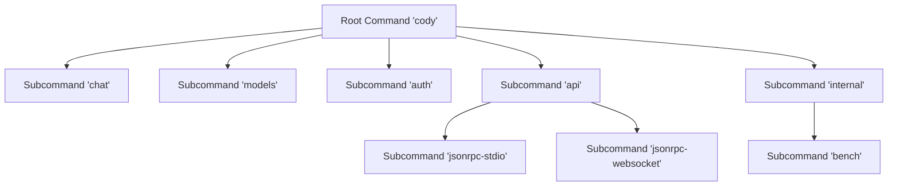
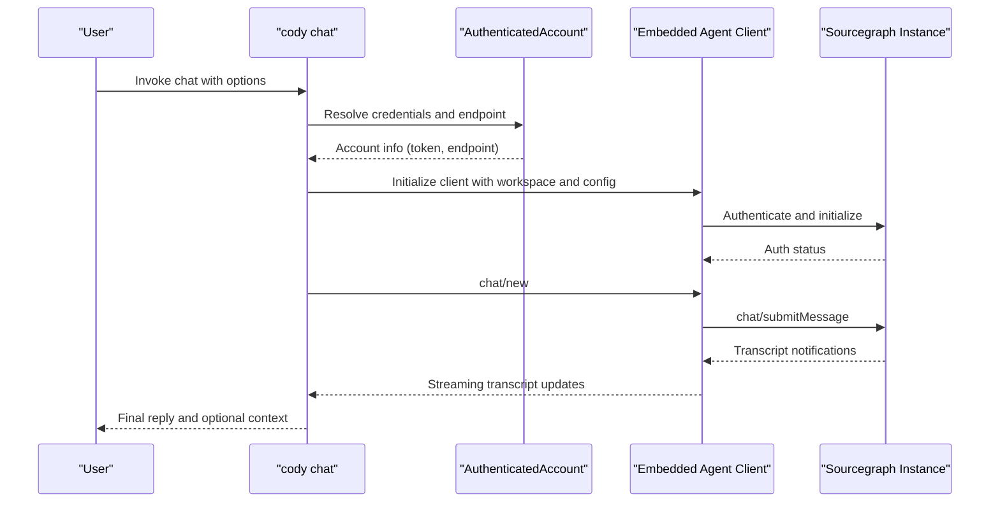
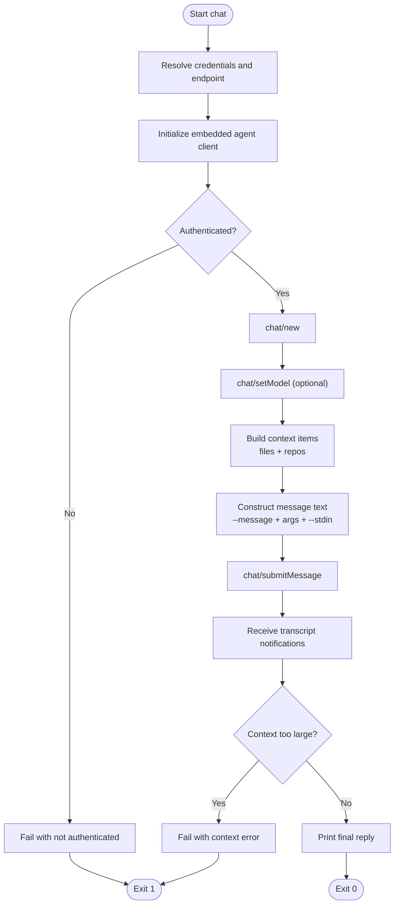
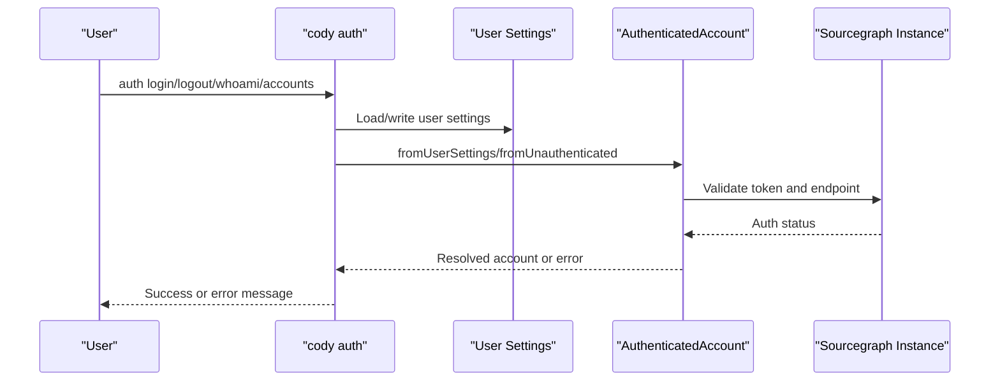
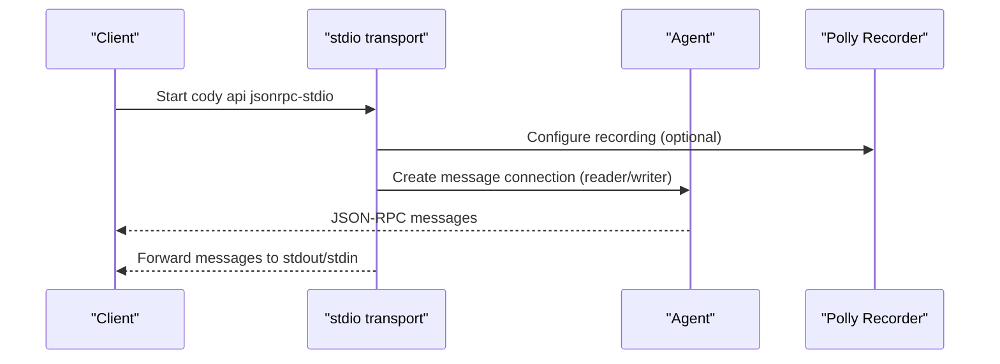
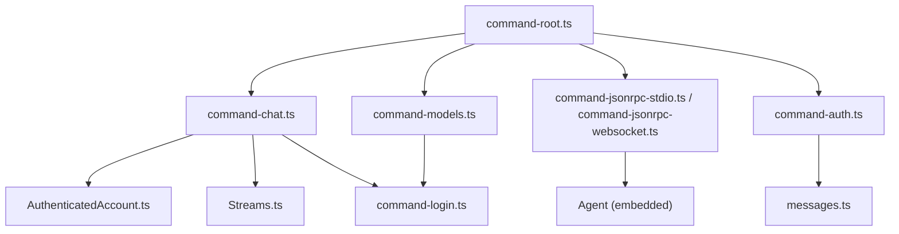

# CLI Interface

<cite>
**Referenced Files in This Document**
- [command-root.ts](file://agent/src/cli/command-root.ts)
- [command-chat.ts](file://agent/src/cli/command-chat.ts)
- [command-models.ts](file://agent/src/cli/command-models.ts)
- [command-jsonrpc-stdio.ts](file://agent/src/cli/command-jsonrpc-stdio.ts)
- [command-jsonrpc-websocket.ts](file://agent/src/cli/command-jsonrpc-websocket.ts)
- [command-auth.ts](file://agent/src/cli/command-auth/command-auth.ts)
- [command-accounts.ts](file://agent/src/cli/command-auth/command-accounts.ts)
- [command-logout.ts](file://agent/src/cli/command-auth/command-logout.ts)
- [command-whoami.ts](file://agent/src/cli/command-auth/command-whoami.ts)
- [command-login.ts](file://agent/src/cli/command-auth/command-login.ts)
- [AuthenticatedAccount.ts](file://agent/src/cli/command-auth/AuthenticatedAccount.ts)
- [messages.ts](file://agent/src/cli/command-auth/messages.ts)
- [Streams.ts](file://agent/src/cli/Streams.ts)
- [legacyCodyClientName.ts](file://agent/src/cli/legacyCodyClientName.ts)
- [package.json](file://agent/package.json)
</cite>

## Table of Contents
1. [Introduction](#introduction)
2. [Project Structure](#project-structure)
3. [Core Components](#core-components)
4. [Architecture Overview](#architecture-overview)
5. [Detailed Component Analysis](#detailed-component-analysis)
6. [Dependency Analysis](#dependency-analysis)
7. [Performance Considerations](#performance-considerations)
8. [Troubleshooting Guide](#troubleshooting-guide)
9. [Conclusion](#conclusion)
10. [Appendices](#appendices)

## Introduction
This document describes the Cody command-line interface (CLI) and its commands for chat, model management, authentication, and JSON-RPC integration. It explains command syntax, options, input/output formats, streaming behavior, interactive flows, authentication, environment variables, configuration, and practical usage patterns for scripting and automation.

## Project Structure
The CLI is organized under the agent package and exposes a root command named cody with subcommands for chat, models, authentication, and internal APIs. The root command wires together subcommands and sets global metadata such as version and description.

**Diagram sources**
- [command-root.ts:12-23](file://agent/src/cli/command-root.ts#L12-L23)

**Section sources**
- [command-root.ts:12-23](file://agent/src/cli/command-root.ts#L12-L23)
- [package.json](file://agent/package.json)

## Core Components
- Root command: Defines the CLI name, version, description, and registers subcommands.
- Chat command: Runs Cody in headless mode, supports stdin, context injection, and streaming replies.
- Models command: Lists supported model IDs from the connected Sourcegraph instance.
- Authentication commands: Login, logout, whoami, accounts, and internal auth utilities.
- JSON-RPC integration: stdio and websocket transports for headless operation and testing.
- Internal benchmarking: Bench command for headless evaluations.

**Section sources**
- [command-root.ts:12-23](file://agent/src/cli/command-root.ts#L12-L23)
- [command-chat.ts:45-110](file://agent/src/cli/command-chat.ts#L45-L110)
- [command-models.ts:14-51](file://agent/src/cli/command-models.ts#L14-L51)
- [command-jsonrpc-stdio.ts:61-179](file://agent/src/cli/command-jsonrpc-stdio.ts#L61-L179)
- [command-jsonrpc-websocket.ts:12-55](file://agent/src/cli/command-jsonrpc-websocket.ts#L12-L55)

## Architecture Overview
The CLI orchestrates a local embedded agent client, authenticates via user settings or explicit options, and communicates with a Sourcegraph instance using JSON-RPC. Chat operations stream transcript updates and optionally print context items. Model listing performs an HTTP request to the instance’s model endpoint.

**Diagram sources**
- [command-chat.ts:82-110](file://agent/src/cli/command-chat.ts#L82-L110)
- [command-chat.ts:160-205](file://agent/src/cli/command-chat.ts#L160-L205)
- [AuthenticatedAccount.ts](file://agent/src/cli/command-auth/AuthenticatedAccount.ts)
- [command-root.ts:12-23](file://agent/src/cli/command-root.ts#L12-L23)

## Detailed Component Analysis

### Root Command and Help
- Name: cody
- Version: Provided from package metadata
- Description: Headless mode and JSON-RPC interaction
- Subcommands:
  - auth: Login, logout, whoami, accounts
  - chat: Chat with codebase context
  - models: List supported model IDs
  - api: jsonrpc-stdio, jsonrpc-websocket
  - internal: bench

**Section sources**
- [command-root.ts:12-23](file://agent/src/cli/command-root.ts#L12-L23)
- [package.json](file://agent/package.json)

### Chat Command
Purpose: Run Cody chat in headless mode with optional stdin, context files/repos, and streaming output.

Key options and behavior:
- Message input:
  - --message/-m: Explicit message text
  - --stdin: Read message from stdin
  - Positional arguments: If exactly "-", treat as stdin; otherwise concatenate with other inputs
- Authentication:
  - --access-token and --endpoint options are inherited from login options
  - Resolves credentials via user settings or explicit options
- Workspace and model:
  - -C/--dir: Working directory (required)
  - --model: Select chat model
- Context:
  - --context-file: Local files to include as context
  - --context-repo: Enterprise-only repository names (requires Enterprise)
- Output and diagnostics:
  - --show-context: Print context items used in the reply
  - --ignore-context-window-errors: Skip early failure when context is too large
  - --silent: Disable streaming reply
  - --debug: Enable debug logging channel
- Exit codes:
  - 0 on success
  - 1 on authentication failure, invalid input, or errors

Input formats:
- Message construction supports combining explicit message, positional arguments, and stdin.
- Context items are either files or repositories (Enterprise).

Output formats:
- Streaming transcript updates via notifications
- Final reply printed to stdout
- Optional context list printed to stdout when requested

Interactive and streaming:
- Uses spinner and notifications to reflect progress and model selection
- Tokens per second computed and displayed after completion

Security and credentials:
- Uses resolved access token and endpoint
- Respects enterprise-only features and validates repository names

Environment variables:
- CODY_RECORDING_DIRECTORY, CODY_RECORDING_NAME: Enable Polly recording for tests

Example usage patterns:
- Pipe a diff to explain: git diff | cody chat --stdin -m "Explain this diff"
- Summarize a file: cody chat --context-file README.md --message "Summarize this readme"
- Enterprise repository context: cody chat --context-repo github.com/sourcegraph/cody --message "What is the agent?"

**Section sources**
- [command-chat.ts:28-43](file://agent/src/cli/command-chat.ts#L28-L43)
- [command-chat.ts:45-110](file://agent/src/cli/command-chat.ts#L45-L110)
- [command-chat.ts:128-336](file://agent/src/cli/command-chat.ts#L128-L336)
- [command-chat.ts:353-376](file://agent/src/cli/command-chat.ts#L353-L376)
- [command-chat.ts:378-391](file://agent/src/cli/command-chat.ts#L378-L391)
- [command-chat.ts:393-421](file://agent/src/cli/command-chat.ts#L393-L421)
- [command-login.ts](file://agent/src/cli/command-auth/command-login.ts)
- [AuthenticatedAccount.ts](file://agent/src/cli/command-auth/AuthenticatedAccount.ts)

#### Chat Flowchart

**Diagram sources**
- [command-chat.ts:82-110](file://agent/src/cli/command-chat.ts#L82-L110)
- [command-chat.ts:160-205](file://agent/src/cli/command-chat.ts#L160-L205)
- [command-chat.ts:214-287](file://agent/src/cli/command-chat.ts#L214-L287)
- [command-chat.ts:353-376](file://agent/src/cli/command-chat.ts#L353-L376)
- [command-chat.ts:393-421](file://agent/src/cli/command-chat.ts#L393-L421)

### Models Command
Purpose: List supported model IDs from the connected Sourcegraph instance.

Behavior:
- Accepts --access-token and --endpoint options
- Initializes client identification headers
- Fetches model list from /.api/llm/models
- Prints each model ID to stdout, one per line
- Exits with 0 on success, 1 on HTTP error

Notes:
- Requires a valid token and endpoint
- Output is newline-delimited model IDs

**Section sources**
- [command-models.ts:14-51](file://agent/src/cli/command-models.ts#L14-L51)

### Authentication Commands
Overview: Provides login, logout, whoami, and accounts management.

- auth:
  - Subcommands: login, logout, whoami, accounts
- login:
  - Options: --web, --access-token, --endpoint
  - Persists credentials to user settings
- logout:
  - Removes an account from user settings
- whoami:
  - Prints active authenticated account
- accounts:
  - Lists all stored accounts and their authentication status

Credential resolution:
- Reads from user settings and validates against the instance
- Supports explicit --access-token and --endpoint overrides

**Section sources**
- [command-root.ts:18-20](file://agent/src/cli/command-root.ts#L18-L20)
- [command-auth.ts](file://agent/src/cli/command-auth/command-auth.ts)
- [command-accounts.ts:12-45](file://agent/src/cli/command-auth/command-accounts.ts#L12-L45)
- [command-logout.ts:45-52](file://agent/src/cli/command-auth/command-logout.ts#L45-L52)
- [command-whoami.ts:8-31](file://agent/src/cli/command-auth/command-whoami.ts#L8-L31)
- [command-login.ts](file://agent/src/cli/command-auth/command-login.ts)
- [AuthenticatedAccount.ts](file://agent/src/cli/command-auth/AuthenticatedAccount.ts)
- [messages.ts](file://agent/src/cli/command-auth/messages.ts)

#### Authentication Sequence

**Diagram sources**
- [command-accounts.ts:16-45](file://agent/src/cli/command-auth/command-accounts.ts#L16-L45)
- [command-logout.ts:45-52](file://agent/src/cli/command-auth/command-logout.ts#L45-L52)
- [command-whoami.ts:12-31](file://agent/src/cli/command-auth/command-whoami.ts#L12-L31)
- [AuthenticatedAccount.ts](file://agent/src/cli/command-auth/AuthenticatedAccount.ts)
- [messages.ts](file://agent/src/cli/command-auth/messages.ts)

### JSON-RPC Integration
Two transports are exposed for headless operation and testing.

- jsonrpc-stdio:
  - Interacts with the Agent using JSON-RPC over stdout/stdin
  - Recording options:
    - --recording-directory: Directory for HAR recordings
    - --recording-mode: record, replay, passthrough, stopped, disabled
    - --recording-name: Unique recording name
    - --recording-expiry-strategy: error, warn, record
    - --recording-expires-in: Duration before expiration
    - --keep-unused-recordings: Boolean toggle
    - --record-if-missing: Boolean toggle
  - Environment variables mirror options for CI-friendly configuration
  - Debugging: When CODY_AGENT_DEBUG_REMOTE=true, listens on a TCP port for remote debugging

- jsonrpc-websocket:
  - Starts a WebSocket server for JSON-RPC connections
  - Currently marked as not working

**Section sources**
- [command-jsonrpc-stdio.ts:61-179](file://agent/src/cli/command-jsonrpc-stdio.ts#L61-L179)
- [command-jsonrpc-websocket.ts:12-55](file://agent/src/cli/command-jsonrpc-websocket.ts#L12-L55)

#### JSON-RPC stdio Sequence

**Diagram sources**
- [command-jsonrpc-stdio.ts:181-207](file://agent/src/cli/command-jsonrpc-stdio.ts#L181-L207)

### Internal Bench Command
Purpose: Evaluate Cody by running the Agent in headless mode for benchmarks.

Key options include workspace selection, test counts, snapshot directories, include/exclude filters, and evaluation configuration.

**Section sources**
- [command-jsonrpc-websocket.ts:12-55](file://agent/src/cli/command-jsonrpc-websocket.ts#L12-L55)

## Dependency Analysis
High-level dependencies among CLI components:

**Diagram sources**
- [command-root.ts:12-23](file://agent/src/cli/command-root.ts#L12-L23)
- [command-chat.ts:18-26](file://agent/src/cli/command-chat.ts#L18-L26)
- [command-models.ts:4-7](file://agent/src/cli/command-models.ts#L4-L7)
- [command-jsonrpc-stdio.ts:8](file://agent/src/cli/command-jsonrpc-stdio.ts#L8)
- [command-auth.ts](file://agent/src/cli/command-auth/command-auth.ts)
- [AuthenticatedAccount.ts](file://agent/src/cli/command-auth/AuthenticatedAccount.ts)
- [messages.ts](file://agent/src/cli/command-auth/messages.ts)
- [Streams.ts](file://agent/src/cli/Streams.ts)
- [command-login.ts](file://agent/src/cli/command-auth/command-login.ts)

**Section sources**
- [command-root.ts:12-23](file://agent/src/cli/command-root.ts#L12-L23)
- [command-chat.ts:18-26](file://agent/src/cli/command-chat.ts#L18-L26)
- [command-models.ts:4-7](file://agent/src/cli/command-models.ts#L4-L7)
- [command-jsonrpc-stdio.ts:8](file://agent/src/cli/command-jsonrpc-stdio.ts#L8)
- [command-auth.ts](file://agent/src/cli/command-auth/command-auth.ts)
- [AuthenticatedAccount.ts](file://agent/src/cli/command-auth/AuthenticatedAccount.ts)
- [messages.ts](file://agent/src/cli/command-auth/messages.ts)
- [Streams.ts](file://agent/src/cli/Streams.ts)
- [command-login.ts](file://agent/src/cli/command-auth/command-login.ts)

## Performance Considerations
- Streaming: Chat uses spinner and notifications to reflect progress; disable with --silent to reduce overhead.
- Context size: Large context files may exceed the model’s context window; use --ignore-context-window-errors to bypass checks or reduce context.
- Token throughput: The CLI computes tokens per second for the final reply; minimizing context improves throughput.
- Recording overhead: Enabling Polly recording adds IO overhead; use only in controlled testing environments.

[No sources needed since this section provides general guidance]

## Troubleshooting Guide
Common issues and resolutions:
- Not authenticated:
  - Use cody auth login to configure credentials or pass --access-token and --endpoint explicitly.
  - Verify who you are with cody auth whoami.
- No directory provided:
  - Always specify -C/--dir; the CLI requires a working directory.
- Enterprise-only features:
  - --context-repo is only available for Enterprise; ensure you are logged into an Enterprise instance.
- Context too large:
  - Reduce --context-file or edit files to fit the context window; alternatively use --ignore-context-window-errors.
- JSON-RPC stdio not responding:
  - Ensure stdin/stdout remain open; the agent exits when the transport closes.
  - For debugging, set CODY_AGENT_DEBUG_REMOTE and connect to the debug port.

**Section sources**
- [command-chat.ts:84-93](file://agent/src/cli/command-chat.ts#L84-L93)
- [command-chat.ts:135-139](file://agent/src/cli/command-chat.ts#L135-L139)
- [command-chat.ts:214-222](file://agent/src/cli/command-chat.ts#L214-L222)
- [command-chat.ts:399-419](file://agent/src/cli/command-chat.ts#L399-L419)
- [command-jsonrpc-stdio.ts:195-204](file://agent/src/cli/command-jsonrpc-stdio.ts#L195-L204)

## Conclusion
The Cody CLI provides a robust, extensible interface for headless chat, model introspection, authentication, and JSON-RPC integration. By leveraging environment variables, explicit options, and structured output, it supports scripting, automation, and advanced testing workflows while maintaining secure credential handling and clear diagnostics.

[No sources needed since this section summarizes without analyzing specific files]

## Appendices

### Command Reference

- cody
  - --version/-v: Print version
  - Description: Headless mode and JSON-RPC interaction

- cody chat
  - Options:
    - -m, --message <message>
    - --stdin
    - -C, --dir <dir>
    - --model <model>
    - --context-repo <repos...>
    - --context-file <files...>
    - --show-context
    - --ignore-context-window-errors
    - --silent
    - --debug
    - --access-token, --endpoint (from login options)
  - Examples:
    - cody chat -m "Tell me about React hooks"
    - cody chat --context-file README.md --message "Summarize this readme"
    - git diff | cody chat --stdin -m "Explain this diff"

- cody models list
  - Options:
    - --access-token, --endpoint
  - Output: One model ID per line

- cody auth
  - cody auth login
    - Options: --web, --access-token, --endpoint
  - cody auth logout
  - cody auth whoami
  - cody auth accounts

- cody api
  - cody api jsonrpc-stdio
    - Options: --recording-directory, --recording-mode, --recording-name, --recording-expiry-strategy, --recording-expires-in, --keep-unused-recordings, --record-if-missing
    - Env: CODY_RECORDING_DIRECTORY, CODY_KEEP_UNUSED_RECORDINGS, CODY_RECORDING_MODE, CODY_RECORDING_NAME, CODY_RECORDING_EXPIRY_STRATEGY, CODY_RECORDING_EXPIRES_IN, CODY_RECORD_IF_MISSING
    - Debug: CODY_AGENT_DEBUG_REMOTE=true, CODY_AGENT_DEBUG_PORT=<number>
  - cody api jsonrpc-websocket
    - Options: --port <number>
    - Notes: Currently not functional

- cody internal bench
  - Options include workspace, test counts, snapshot directories, include/exclude filters, and evaluation configuration

**Section sources**
- [command-root.ts:12-23](file://agent/src/cli/command-root.ts#L12-L23)
- [command-chat.ts:45-110](file://agent/src/cli/command-chat.ts#L45-L110)
- [command-models.ts:14-51](file://agent/src/cli/command-models.ts#L14-L51)
- [command-jsonrpc-stdio.ts:61-179](file://agent/src/cli/command-jsonrpc-stdio.ts#L61-L179)
- [command-jsonrpc-websocket.ts:12-55](file://agent/src/cli/command-jsonrpc-websocket.ts#L12-L55)
- [command-login.ts](file://agent/src/cli/command-auth/command-login.ts)
- [command-accounts.ts:12-45](file://agent/src/cli/command-auth/command-accounts.ts#L12-L45)
- [command-logout.ts:45-52](file://agent/src/cli/command-auth/command-logout.ts#L45-L52)
- [command-whoami.ts:8-31](file://agent/src/cli/command-auth/command-whoami.ts#L8-L31)

### Environment Variables
- CODY_RECORDING_DIRECTORY: Directory for Polly recordings
- CODY_KEEP_UNUSED_RECORDINGS: Keep unused recordings
- CODY_RECORDING_MODE: Recording mode (record, replay, passthrough, stopped, disabled)
- CODY_RECORDING_NAME: Recording name
- CODY_RECORDING_EXPIRY_STRATEGY: Expiry strategy (error, warn, record)
- CODY_RECORDING_EXPIRES_IN: Expiration duration
- CODY_RECORD_IF_MISSING: Fail if missing vs record
- CODY_AGENT_DEBUG_REMOTE: Enable debug server
- CODY_AGENT_DEBUG_PORT: Debug server port (default 3113)

**Section sources**
- [command-jsonrpc-stdio.ts:70-114](file://agent/src/cli/command-jsonrpc-stdio.ts#L70-L114)
- [command-jsonrpc-stdio.ts:56-59](file://agent/src/cli/command-jsonrpc-stdio.ts#L56-L59)

### Exit Codes
- 0: Success
- 1: Authentication failure, invalid input, errors, or context too large

**Section sources**
- [command-chat.ts:88-93](file://agent/src/cli/command-chat.ts#L88-L93)
- [command-chat.ts:165-168](file://agent/src/cli/command-chat.ts#L165-L168)
- [command-chat.ts:270-274](file://agent/src/cli/command-chat.ts#L270-L274)
- [command-chat.ts:293-299](file://agent/src/cli/command-chat.ts#L293-L299)
- [command-chat.ts:310-312](file://agent/src/cli/command-chat.ts#L310-L312)
- [command-chat.ts:418](file://agent/src/cli/command-chat.ts#L418)
- [command-models.ts:37-42](file://agent/src/cli/command-models.ts#L37-L42)