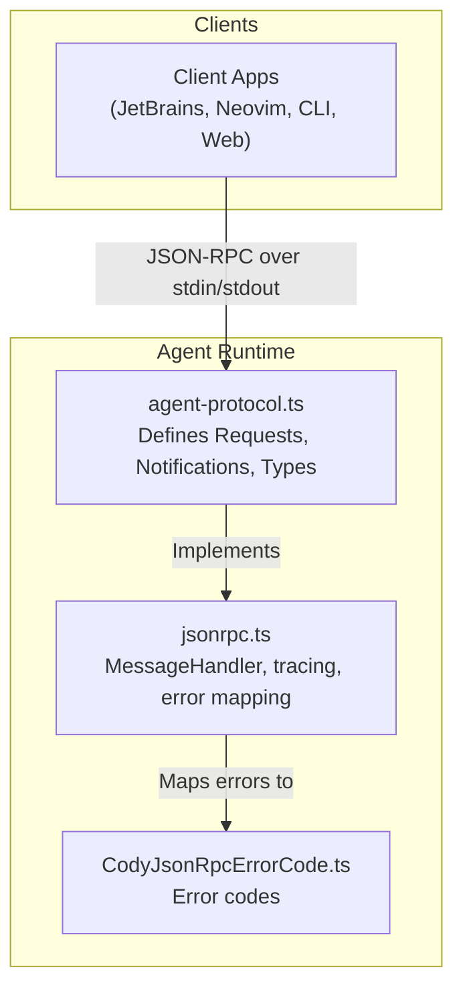
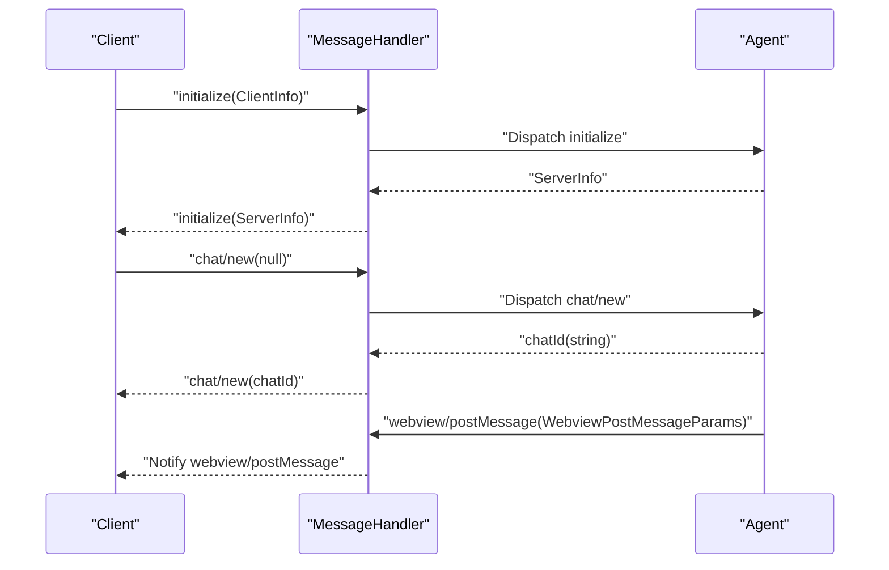
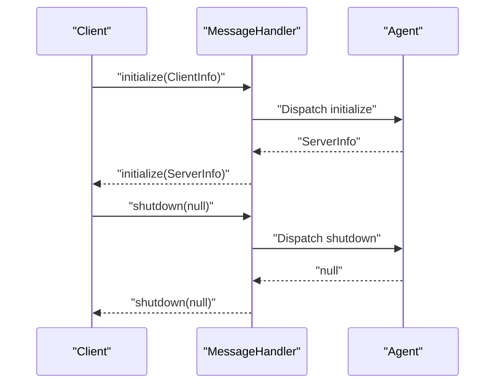
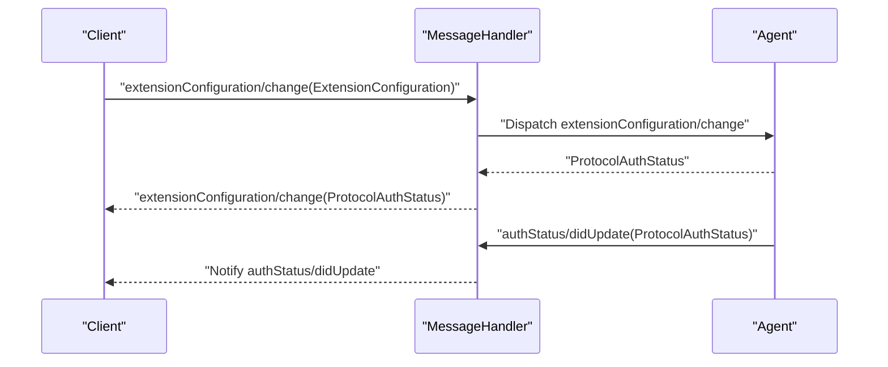
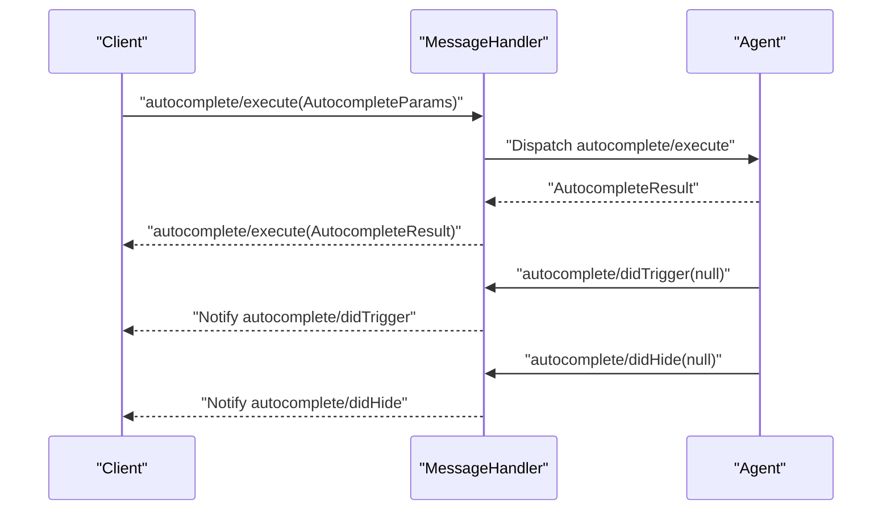
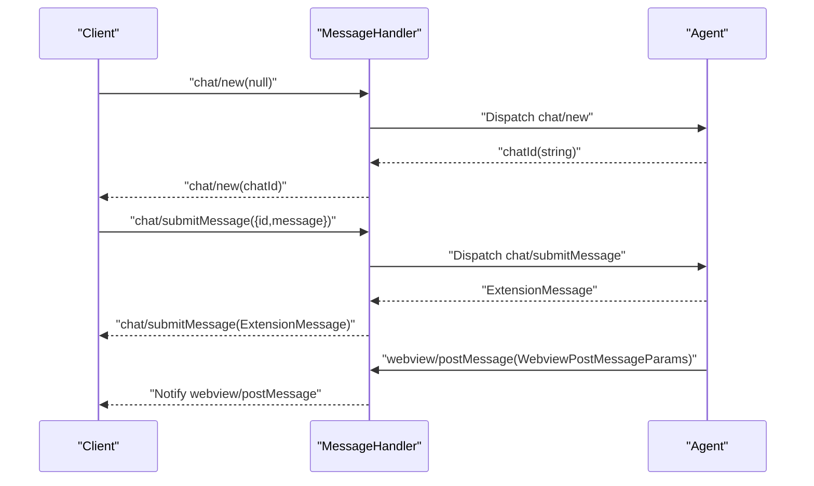
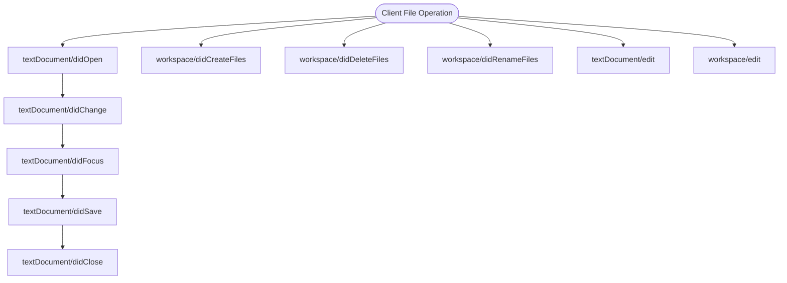
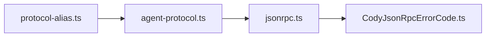

# JSON-RPC Protocol

<cite>
**Referenced Files in This Document**
- [protocol.md](file://agent/protocol.md)
- [agent-protocol.ts](file://vscode/src/jsonrpc/agent-protocol.ts)
- [jsonrpc.ts](file://vscode/src/jsonrpc/jsonrpc.ts)
- [CodyJsonRpcErrorCode.ts](file://vscode/src/jsonrpc/CodyJsonRpcErrorCode.ts)
- [protocol-alias.ts](file://agent/src/protocol-alias.ts)
- [protocol.test.ts](file://vscode/src/jsonrpc/protocol.test.ts)
- [limiter.ts](file://vscode/src/graph/lsp/limiter.ts)
- [limiter.test.ts](file://vscode/src/graph/lsp/limiter.test.ts)
</cite>

## Table of Contents
1. [Introduction](#introduction)
2. [Project Structure](#project-structure)
3. [Core Components](#core-components)
4. [Architecture Overview](#architecture-overview)
5. [Detailed Component Analysis](#detailed-component-analysis)
6. [Dependency Analysis](#dependency-analysis)
7. [Performance Considerations](#performance-considerations)
8. [Troubleshooting Guide](#troubleshooting-guide)
9. [Conclusion](#conclusion)
10. [Appendices](#appendices)

## Introduction
This document specifies the JSON-RPC protocol used by the Cody Agent for cross-platform communication between the agent and clients. It covers initialization, authentication, completion requests, chat operations, and file/workspace operations. It also explains bidirectional communication, error handling, connection management, protocol versioning, backwards compatibility, performance characteristics, and debugging/logging strategies.

## Project Structure
The protocol is defined in a central TypeScript module and consumed by the agent runtime and clients. The agent’s protocol documentation is maintained alongside the implementation.

**Diagram sources**
- [agent-protocol.ts:1-1081](file://vscode/src/jsonrpc/agent-protocol.ts#L1-L1081)
- [jsonrpc.ts:1-191](file://vscode/src/jsonrpc/jsonrpc.ts#L1-L191)
- [CodyJsonRpcErrorCode.ts:1-10](file://vscode/src/jsonrpc/CodyJsonRpcErrorCode.ts#L1-L10)

**Section sources**
- [protocol.md:1-482](file://agent/protocol.md#L1-L482)
- [agent-protocol.ts:1-1081](file://vscode/src/jsonrpc/agent-protocol.ts#L1-L1081)

## Core Components
- Requests: Client-to-server asynchronous calls that return a result.
- Notifications: Client-to-server or server-to-client fire-and-forget messages.
- Types: Strongly typed parameter and result schemas for all methods.
- Error codes: Standardized JSON-RPC error codes plus Cody-specific codes.
- MessageHandler: Transport-agnostic JSON-RPC message routing and tracing.

Key responsibilities:
- Define the canonical method signatures and schemas.
- Enforce null/undefined equivalence for cross-language interoperability.
- Provide structured error mapping and cancellation semantics.
- Support tracing and debugging via environment-controlled logging.

**Section sources**
- [agent-protocol.ts:24-472](file://vscode/src/jsonrpc/agent-protocol.ts#L24-L472)
- [jsonrpc.ts:13-191](file://vscode/src/jsonrpc/jsonrpc.ts#L13-L191)
- [CodyJsonRpcErrorCode.ts:1-10](file://vscode/src/jsonrpc/CodyJsonRpcErrorCode.ts#L1-L10)
- [protocol.test.ts:1-97](file://vscode/src/jsonrpc/protocol.test.ts#L1-L97)

## Architecture Overview
The protocol follows a peer-to-peer JSON-RPC model over stdin/stdout. Both sides can send requests and notifications. The agent exposes a set of methods grouped by domain (initialization, chat, autocomplete, workspace, telemetry, etc.). Clients register handlers for server-to-client notifications and send requests for desired operations.

**Diagram sources**
- [agent-protocol.ts:35-303](file://vscode/src/jsonrpc/agent-protocol.ts#L35-L303)
- [agent-protocol.ts:313-472](file://vscode/src/jsonrpc/agent-protocol.ts#L313-L472)
- [jsonrpc.ts:121-136](file://vscode/src/jsonrpc/jsonrpc.ts#L121-L136)

## Detailed Component Analysis

### Initialization and Shutdown
- initialize: Client sends ClientInfo; server responds with ServerInfo. Must be the first request.
- shutdown: Client requests graceful termination; server responds then exits.

**Diagram sources**
- [agent-protocol.ts:38-40](file://vscode/src/jsonrpc/agent-protocol.ts#L38-L40)
- [jsonrpc.ts:121-132](file://vscode/src/jsonrpc/jsonrpc.ts#L121-L132)

**Section sources**
- [agent-protocol.ts:38-40](file://vscode/src/jsonrpc/agent-protocol.ts#L38-L40)
- [protocol.md:40-53](file://agent/protocol.md#L40-L53)

### Authentication
- extensionConfiguration/change: Updates connection settings and returns ProtocolAuthStatus.
- extensionConfiguration/status: Queries current auth status without changing it.
- authStatus/didUpdate: Server-to-client notification indicating auth changes.

**Diagram sources**
- [agent-protocol.ts:226-229](file://vscode/src/jsonrpc/agent-protocol.ts#L226-L229)
- [agent-protocol.ts:471](file://vscode/src/jsonrpc/agent-protocol.ts#L471)
- [agent-protocol.ts:326](file://vscode/src/jsonrpc/agent-protocol.ts#L326)

**Section sources**
- [agent-protocol.ts:620-655](file://vscode/src/jsonrpc/agent-protocol.ts#L620-L655)
- [agent-protocol.ts:705-740](file://vscode/src/jsonrpc/agent-protocol.ts#L705-L740)

### Autocomplete
- autocomplete/execute: Requests inline completions with position and context.
- Client notifications: completionSuggested, completionAccepted, clearLastCandidate.
- Server notifications: didTrigger, didHide.

**Diagram sources**
- [agent-protocol.ts:130](file://vscode/src/jsonrpc/agent-protocol.ts#L130)
- [agent-protocol.ts:580-586](file://vscode/src/jsonrpc/agent-protocol.ts#L580-L586)
- [agent-protocol.ts:394-405](file://vscode/src/jsonrpc/agent-protocol.ts#L394-L405)

**Section sources**
- [agent-protocol.ts:514-586](file://vscode/src/jsonrpc/agent-protocol.ts#L514-L586)
- [agent-protocol.ts:357-383](file://vscode/src/jsonrpc/agent-protocol.ts#L357-L383)
- [agent-protocol.ts:394-405](file://vscode/src/jsonrpc/agent-protocol.ts#L394-L405)

### Chat Operations
- chat/new: Starts a new chat session; returns chat identifier.
- chat/submitMessage: Sends a message to a chat session.
- chat/editMessage: Edits an existing message.
- webview/postMessage: Streams chat replies to the client.
- webview/receiveMessage: Low-level message delivery to a session.

**Diagram sources**
- [agent-protocol.ts:45](file://vscode/src/jsonrpc/agent-protocol.ts#L45)
- [agent-protocol.ts:77](file://vscode/src/jsonrpc/agent-protocol.ts#L77)
- [agent-protocol.ts:831](file://vscode/src/jsonrpc/agent-protocol.ts#L831)
- [agent-protocol.ts:421](file://vscode/src/jsonrpc/agent-protocol.ts#L421)

**Section sources**
- [agent-protocol.ts:45](file://vscode/src/jsonrpc/agent-protocol.ts#L45)
- [agent-protocol.ts:77](file://vscode/src/jsonrpc/agent-protocol.ts#L77)
- [agent-protocol.ts:828-831](file://vscode/src/jsonrpc/agent-protocol.ts#L828-L831)

### File and Workspace Operations
- textDocument/didOpen/didChange/didSave/didClose: Document lifecycle.
- workspace/didCreateFiles/didDeleteFiles/didRenameFiles: Workspace file events.
- textDocument/edit, workspace/edit: Apply edits to documents or workspace.

**Diagram sources**
- [agent-protocol.ts:334-354](file://vscode/src/jsonrpc/agent-protocol.ts#L334-L354)
- [agent-protocol.ts:280-292](file://vscode/src/jsonrpc/agent-protocol.ts#L280-L292)

**Section sources**
- [agent-protocol.ts:334-354](file://vscode/src/jsonrpc/agent-protocol.ts#L334-L354)
- [agent-protocol.ts:280-292](file://vscode/src/jsonrpc/agent-protocol.ts#L280-L292)

### Telemetry and Diagnostics
- telemetry/recordEvent: Records telemetry events with structured parameters.
- diagnostics/publish: Publishes diagnostics for code actions.

**Section sources**
- [agent-protocol.ts:144](file://vscode/src/jsonrpc/agent-protocol.ts#L144)
- [agent-protocol.ts:171](file://vscode/src/jsonrpc/agent-protocol.ts#L171)

### Progress and Debugging
- progress/start/report/end: Server-to-client progress reporting.
- debug/message: Debug channel messages.
- $/cancelRequest: Client cancels in-flight requests.

**Section sources**
- [agent-protocol.ts:427-434](file://vscode/src/jsonrpc/agent-protocol.ts#L427-L434)
- [agent-protocol.ts:407](file://vscode/src/jsonrpc/agent-protocol.ts#L407)
- [agent-protocol.ts:354](file://vscode/src/jsonrpc/agent-protocol.ts#L354)

## Dependency Analysis
- Protocol definition: Centralized in agent-protocol.ts.
- Runtime: jsonrpc.ts provides a MessageHandler abstraction over vscode-jsonrpc.
- Error mapping: jsonrpc.ts maps exceptions to standardized JSON-RPC error codes, including a Cody-specific rate limit code.
- Aliasing: agent/src/protocol-alias.ts re-exports the protocol for agent consumers.

**Diagram sources**
- [agent-protocol.ts:1-1081](file://vscode/src/jsonrpc/agent-protocol.ts#L1-L1081)
- [jsonrpc.ts:1-191](file://vscode/src/jsonrpc/jsonrpc.ts#L1-L191)
- [CodyJsonRpcErrorCode.ts:1-10](file://vscode/src/jsonrpc/CodyJsonRpcErrorCode.ts#L1-L10)
- [protocol-alias.ts:1-2](file://agent/src/protocol-alias.ts#L1-L2)

**Section sources**
- [protocol-alias.ts:1-2](file://agent/src/protocol-alias.ts#L1-L2)
- [protocol.test.ts:10-97](file://vscode/src/jsonrpc/protocol.test.ts#L10-L97)

## Performance Considerations
- Concurrency and timeouts: A generic limiter enforces a fixed concurrency limit and applies a timeout to queued requests. This prevents resource exhaustion and ensures responsiveness.
- Rate limiting: The agent maps rate-limit errors to a dedicated JSON-RPC error code, enabling clients to detect throttling and back off.
- Autocomplete visibility: The protocol includes testing hooks to tune completion visibility delays and provider configuration, useful for performance tuning in controlled environments.

Practical guidance:
- Use the limiter pattern for external API calls to bound concurrency and prevent timeouts.
- Respect rate limit errors and implement exponential backoff.
- Prefer batched workspace operations where possible to reduce frequent notifications.

**Section sources**
- [limiter.ts:18-42](file://vscode/src/graph/lsp/limiter.ts#L18-L42)
- [limiter.test.ts:48-107](file://vscode/src/graph/lsp/limiter.test.ts#L48-L107)
- [jsonrpc.ts:69-88](file://vscode/src/jsonrpc/jsonrpc.ts#L69-L88)
- [CodyJsonRpcErrorCode.ts:8-8](file://vscode/src/jsonrpc/CodyJsonRpcErrorCode.ts#L8-L8)

## Troubleshooting Guide
Common issues and remedies:
- Parse or request errors: Ensure parameters match the exact schema; optional fields must consistently include null/undefined variants.
- Cancellation: If a request is canceled, the server returns a specific cancellation error code.
- Rate limiting: Detect the rate limit error code and retry with backoff.
- Tracing: Enable low-level JSON-RPC message tracing via an environment variable to capture all incoming/outgoing messages.

Debugging steps:
- Verify the initialize/shutdown handshake is performed correctly.
- Confirm that extensionConfiguration/change returns a valid auth status.
- Use progress and debug notifications to observe server-side activity.
- Inspect trace logs for malformed requests or missing parameters.

**Section sources**
- [protocol.test.ts:32-84](file://vscode/src/jsonrpc/protocol.test.ts#L32-L84)
- [jsonrpc.ts:29](file://vscode/src/jsonrpc/jsonrpc.ts#L29)
- [jsonrpc.ts:69-88](file://vscode/src/jsonrpc/jsonrpc.ts#L69-L88)
- [CodyJsonRpcErrorCode.ts:1-10](file://vscode/src/jsonrpc/CodyJsonRpcErrorCode.ts#L1-L10)

## Conclusion
The Cody Agent JSON-RPC protocol provides a robust, bidirectional contract for cross-platform integration. Its strong typing, explicit lifecycle methods, and structured error handling enable reliable client implementations. By following the documented patterns for initialization, authentication, completions, chat, and workspace operations—and by leveraging the provided performance and debugging facilities—clients can deliver a consistent and responsive user experience.

## Appendices

### Protocol Versioning and Backwards Compatibility
- The protocol is defined centrally and re-exported for agent consumers, ensuring a single source of truth.
- Cross-language interoperability is enforced by requiring consistent null/undefined handling across all optional fields.
- Migration strategies:
  - Introduce new methods alongside existing ones without removing old ones.
  - Keep parameter schemas backward-compatible; add optional fields rather than changing required ones.
  - Use feature flags or capability negotiation to gate new behavior.

**Section sources**
- [protocol-alias.ts:1-2](file://agent/src/protocol-alias.ts#L1-L2)
- [protocol.test.ts:32-84](file://vscode/src/jsonrpc/protocol.test.ts#L32-L84)

### Practical Examples
- Initialize the agent and start a chat:
  - Client sends initialize with ClientInfo.
  - Client sends chat/new and awaits chatId.
  - Client sends chat/submitMessage with the returned id and a message payload.
  - Client subscribes to webview/postMessage for streaming responses.
- Apply an edit:
  - Client sends textDocument/edit or workspace/edit with a set of operations.
  - Client expects a boolean success result.

Note: Refer to the method definitions for exact parameter and response schemas.

**Section sources**
- [agent-protocol.ts:38-40](file://vscode/src/jsonrpc/agent-protocol.ts#L38-L40)
- [agent-protocol.ts:45](file://vscode/src/jsonrpc/agent-protocol.ts#L45)
- [agent-protocol.ts:77](file://vscode/src/jsonrpc/agent-protocol.ts#L77)
- [agent-protocol.ts:831](file://vscode/src/jsonrpc/agent-protocol.ts#L831)
- [agent-protocol.ts:280-292](file://vscode/src/jsonrpc/agent-protocol.ts#L280-L292)