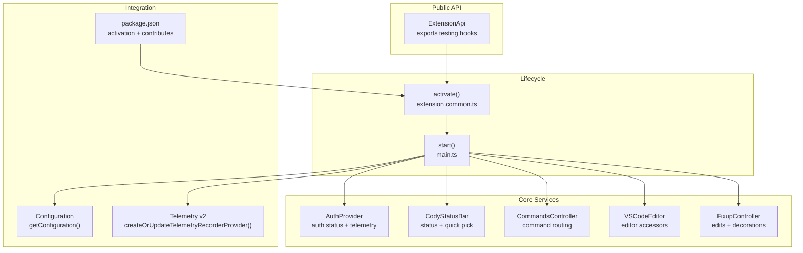
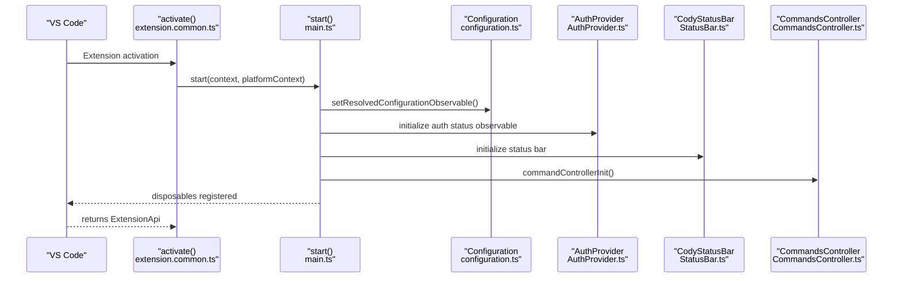
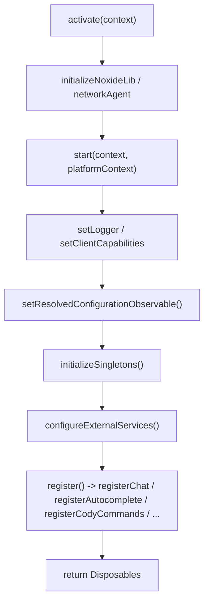
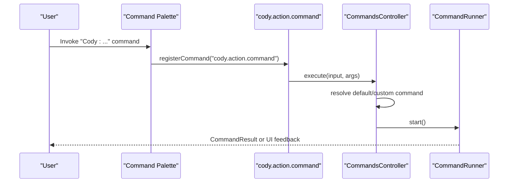
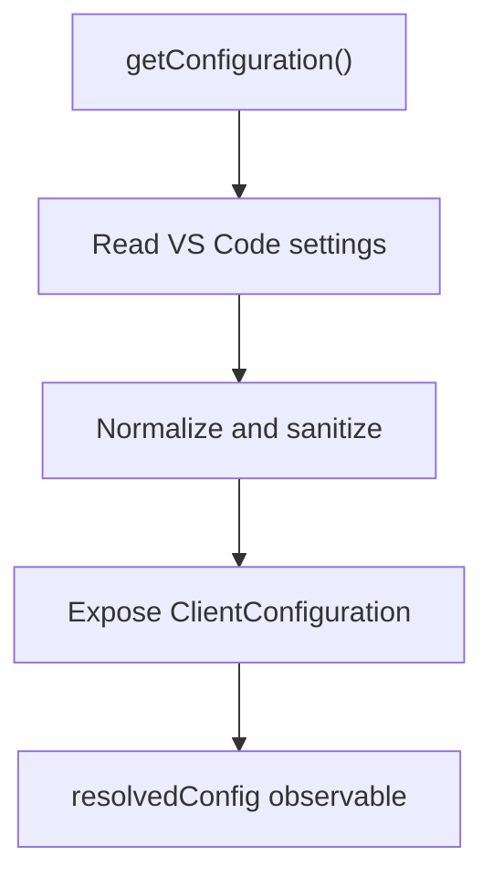
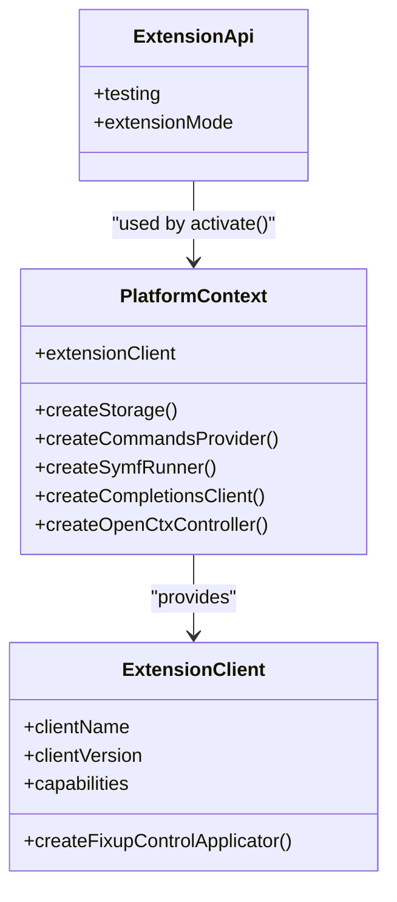

# VS Code Extension API

<cite>
**Referenced Files in This Document**
- [extension-api.ts](file://vscode/src/extension-api.ts)
- [extension.common.ts](file://vscode/src/extension.common.ts)
- [extension.web.ts](file://vscode/src/extension.web.ts)
- [main.ts](file://vscode/src/main.ts)
- [package.json](file://vscode/package.json)
- [package.schema.json](file://vscode/package.schema.json)
- [configuration.ts](file://vscode/src/configuration.ts)
- [configuration-keys.ts](file://vscode/src/configuration-keys.ts)
- [extension-client.ts](file://vscode/src/extension-client.ts)
- [CommandsController.ts](file://vscode/src/commands/CommandsController.ts)
- [telemetry-v2.ts](file://vscode/src/services/telemetry-v2.ts)
- [AuthProvider.ts](file://vscode/src/services/AuthProvider.ts)
- [FixupController.ts](file://vscode/src/non-stop/FixupController.ts)
- [vscode-editor.ts](file://vscode/src/editor/vscode-editor.ts)
- [StatusBar.ts](file://vscode/src/services/StatusBar.ts)
</cite>

## Table of Contents
1. [Introduction](#introduction)
2. [Project Structure](#project-structure)
3. [Core Components](#core-components)
4. [Architecture Overview](#architecture-overview)
5. [Detailed Component Analysis](#detailed-component-analysis)
6. [Dependency Analysis](#dependency-analysis)
7. [Performance Considerations](#performance-considerations)
8. [Troubleshooting Guide](#troubleshooting-guide)
9. [Conclusion](#conclusion)
10. [Appendices](#appendices)

## Introduction
This document describes the VS Code Extension API surface for Cody’s IDE integration. It covers exported APIs, command registration, event handling, configuration management, UI integration points (status bar, menus, context menus), telemetry, error reporting, debugging, and extension lifecycle. It also includes guidance on marketplace requirements, security considerations, and performance optimization.

## Project Structure
Cody’s VS Code extension is organized around a small public API surface and a rich internal subsystem for commands, editing, chat, telemetry, and UI integration. The extension exposes a minimal ExtensionApi class and delegates most functionality to internal services and controllers.

**Diagram sources**
- [extension-api.ts:1-19](file://vscode/src/extension-api.ts#L1-L19)
- [extension.common.ts:44-77](file://vscode/src/extension.common.ts#L44-L77)
- [main.ts:122-214](file://vscode/src/main.ts#L122-L214)
- [AuthProvider.ts:45-206](file://vscode/src/services/AuthProvider.ts#L45-L206)
- [StatusBar.ts:60-127](file://vscode/src/services/StatusBar.ts#L60-L127)
- [CommandsController.ts:27-108](file://vscode/src/commands/CommandsController.ts#L27-L108)
- [vscode-editor.ts:17-205](file://vscode/src/editor/vscode-editor.ts#L17-L205)
- [FixupController.ts:72-143](file://vscode/src/non-stop/FixupController.ts#L72-L143)
- [configuration.ts:25-204](file://vscode/src/configuration.ts#L25-L204)
- [telemetry-v2.ts:26-99](file://vscode/src/services/telemetry-v2.ts#L26-L99)
- [package.json:122-539](file://vscode/package.json#L122-L539)

**Section sources**
- [extension-api.ts:1-19](file://vscode/src/extension-api.ts#L1-L19)
- [extension.common.ts:44-77](file://vscode/src/extension.common.ts#L44-L77)
- [main.ts:122-214](file://vscode/src/main.ts#L122-L214)
- [package.json:122-539](file://vscode/package.json#L122-L539)

## Core Components
- ExtensionApi: Minimal public API exposing optional testing hooks and extension mode.
- activate/start: Lifecycle entrypoints that initialize platform context, network agent, configuration observables, services, and UI.
- CommandsController: Centralized command execution with default and custom commands.
- AuthProvider: Authentication state management, context flags, and telemetry.
- VSCodeEditor: Editor accessors for active document, selection, diagnostics, and file creation.
- FixupController: Non-stop editing orchestration with decorations and code lenses.
- CodyStatusBar: Status bar integration with quick pick settings UI and error loaders.
- Configuration: Reads and sanitizes VS Code settings into a normalized ClientConfiguration.
- Telemetry v2: Global telemetry recorder provider initialization and event recording.

**Section sources**
- [extension-api.ts:5-18](file://vscode/src/extension-api.ts#L5-L18)
- [extension.common.ts:44-77](file://vscode/src/extension.common.ts#L44-L77)
- [main.ts:122-357](file://vscode/src/main.ts#L122-L357)
- [CommandsController.ts:27-124](file://vscode/src/commands/CommandsController.ts#L27-L124)
- [AuthProvider.ts:45-206](file://vscode/src/services/AuthProvider.ts#L45-L206)
- [vscode-editor.ts:17-205](file://vscode/src/editor/vscode-editor.ts#L17-L205)
- [FixupController.ts:72-143](file://vscode/src/non-stop/FixupController.ts#L72-L143)
- [StatusBar.ts:60-127](file://vscode/src/services/StatusBar.ts#L60-L127)
- [configuration.ts:25-204](file://vscode/src/configuration.ts#L25-L204)
- [telemetry-v2.ts:26-99](file://vscode/src/services/telemetry-v2.ts#L26-L99)

## Architecture Overview
The extension follows a modular architecture:
- Public API: A small ExtensionApi class is returned by activate.
- Platform abstraction: PlatformContext allows swapping implementations for clients (VS Code, Agent, Web).
- Reactive configuration: Observables drive configuration, secrets, and client state changes.
- Feature flags: FeatureFlagProvider enables conditional feature registration.
- UI integration: Status bar, menus, and context menus are declared in package.json and driven by runtime state.

**Diagram sources**
- [extension.common.ts:44-77](file://vscode/src/extension.common.ts#L44-L77)
- [main.ts:122-214](file://vscode/src/main.ts#L122-L214)
- [configuration.ts:25-204](file://vscode/src/configuration.ts#L25-L204)
- [AuthProvider.ts:45-206](file://vscode/src/services/AuthProvider.ts#L45-L206)
- [StatusBar.ts:60-127](file://vscode/src/services/StatusBar.ts#L60-L127)
- [CommandsController.ts:27-108](file://vscode/src/commands/CommandsController.ts#L27-L108)

## Detailed Component Analysis

### Extension API Surface
- ExtensionApi exposes:
  - testing: Optional testing hooks when environment variable CODY_TESTING is true.
  - extensionMode: Read-only mode for development/test/web.
- Returned by activate and consumed by tests and internal helpers.

**Section sources**
- [extension-api.ts:5-18](file://vscode/src/extension-api.ts#L5-L18)
- [extension.common.ts:54](file://vscode/src/extension.common.ts#L54)

### Extension Lifecycle and Activation
- activate:
  - Initializes optional Noxide library and network agent.
  - Calls start(context, platformContext) and registers disposables.
  - Captures exceptions via Sentry.
- start:
  - Sets up logging, client capabilities, and resolved configuration observable.
  - Initializes platform singletons, external services, editor, chat, fixup, and status bar.
  - Registers commands, menus, and debug handlers.
  - Applies feature flags and MCP manager initialization.
  - Saves resolved config for deactivation.

**Diagram sources**
- [extension.common.ts:44-77](file://vscode/src/extension.common.ts#L44-L77)
- [main.ts:122-357](file://vscode/src/main.ts#L122-L357)

**Section sources**
- [extension.common.ts:44-77](file://vscode/src/extension.common.ts#L44-L77)
- [main.ts:122-357](file://vscode/src/main.ts#L122-L357)

### Command Registration and Execution
- Command palette integration:
  - Declared in package.json contributes.commands and menus.commandPalette.
  - Includes Cody commands, auth commands, chat commands, debug commands, and keybindings.
- Execution:
  - cody.action.command routes to executeCodyCommand via CommandsController.
  - Default commands (explain, smell, test, doc, edit) are handled centrally.
  - Custom commands are provided by CommandsProvider and executed via CommandRunner.

**Diagram sources**
- [package.json:192-738](file://vscode/package.json#L192-L738)
- [CommandsController.ts:54-99](file://vscode/src/commands/CommandsController.ts#L54-L99)
- [main.ts:419-450](file://vscode/src/main.ts#L419-L450)

**Section sources**
- [package.json:192-738](file://vscode/package.json#L192-L738)
- [CommandsController.ts:27-124](file://vscode/src/commands/CommandsController.ts#L27-L124)
- [main.ts:419-526](file://vscode/src/main.ts#L419-L526)

### Event Handling and Context Flags
- AuthProvider:
  - Emits auth status observable.
  - Updates context flags: cody.activated, cody.serverEndpoint.
  - Reports auth telemetry and serializes uninstaller info.
- Status Bar:
  - Reactively renders state based on auth, config, errors, loaders, and ignore status.
  - Quick pick UI for settings toggles and feedback.

**Section sources**
- [AuthProvider.ts:45-206](file://vscode/src/services/AuthProvider.ts#L45-L206)
- [StatusBar.ts:60-127](file://vscode/src/services/StatusBar.ts#L60-L127)

### Configuration Management
- getConfiguration:
  - Reads VS Code settings and normalizes into ClientConfiguration.
  - Sanitizes codebase, parses debug regex, maps legacy auto-edit to suggestions mode.
  - Exposes hidden/internal settings for debugging and feature flags.
- Configuration keys:
  - Derived from package.json contributes.configuration using CONFIG_KEY.
- Schema:
  - package.schema.json validates structure of package.json contributions.

**Diagram sources**
- [configuration.ts:25-204](file://vscode/src/configuration.ts#L25-L204)
- [configuration-keys.ts:18-54](file://vscode/src/configuration-keys.ts#L18-L54)
- [package.schema.json:1-105](file://vscode/package.schema.json#L1-L105)

**Section sources**
- [configuration.ts:25-204](file://vscode/src/configuration.ts#L25-L204)
- [configuration-keys.ts:18-54](file://vscode/src/configuration-keys.ts#L18-L54)
- [package.schema.json:1-105](file://vscode/package.schema.json#L1-L105)

### UI Integration Points
- Status Bar:
  - Dynamic icon/text/style based on auth, errors, loaders, and ignore status.
  - Quick pick for toggling features, opening settings, and feedback.
- Menus and Context Menus:
  - Declared in package.json contributes.menus and contributes.submenus.
  - Adds Cody submenu items to editor/context menus.
- Keybindings:
  - Extensive keybindings for chat, commands, fixes, and suggestions.

**Section sources**
- [StatusBar.ts:60-420](file://vscode/src/services/StatusBar.ts#L60-L420)
- [package.json:669-800](file://vscode/package.json#L669-L800)

### Editor Decorations and Non-Stop Editing
- FixupController:
  - Manages FixupTask lifecycle (creating, applying, accepting, rejecting, undoing).
  - Integrates with ExtensionClient to create fixup control applicator (code lenses).
  - Uses decorators and observers for file and edit changes.
  - Emits telemetry for apply/revert/user actions.

**Section sources**
- [FixupController.ts:72-143](file://vscode/src/non-stop/FixupController.ts#L72-L143)
- [FixupController.ts:527-800](file://vscode/src/non-stop/FixupController.ts#L527-L800)
- [extension-client.ts:11-43](file://vscode/src/extension-client.ts#L11-L43)

### Telemetry Integration
- createOrUpdateTelemetryRecorderProvider:
  - Initializes TelemetryRecorderProvider based on resolved config and mode.
  - Supports mock exporter in testing, dev whitelisted events, and production export.
  - Records initial extension events (installed/savedLogin) and cleans up on reinstall.

**Section sources**
- [telemetry-v2.ts:26-99](file://vscode/src/services/telemetry-v2.ts#L26-L99)

### Error Reporting and Debugging
- AuthProvider reports auth-related telemetry and serializes uninstaller info.
- Status bar supports error loaders and quick pick actions for diagnostics.
- Debug commands:
  - Export logs, open output channel, enable verbose debug, report issue, heap dump.

**Section sources**
- [AuthProvider.ts:346-380](file://vscode/src/services/AuthProvider.ts#L346-L380)
- [StatusBar.ts:133-200](file://vscode/src/services/StatusBar.ts#L133-L200)
- [main.ts:641-652](file://vscode/src/main.ts#L641-L652)

## Dependency Analysis
- PlatformContext abstraction:
  - Allows swapping implementations for completions client, storage, commands provider, and extension client.
- ExtensionClient:
  - Defines capabilities and creates fixup control applicator.
- Reactive dependencies:
  - resolvedConfig drives feature flags, autoedits, autocomplete, and UI state.
  - authStatus drives context flags and telemetry.

**Diagram sources**
- [extension.common.ts:24-37](file://vscode/src/extension.common.ts#L24-L37)
- [extension-client.ts:11-43](file://vscode/src/extension-client.ts#L11-L43)
- [extension-api.ts:5-18](file://vscode/src/extension-api.ts#L5-L18)

**Section sources**
- [extension.common.ts:24-37](file://vscode/src/extension.common.ts#L24-L37)
- [extension-client.ts:11-43](file://vscode/src/extension-client.ts#L11-L43)
- [extension-api.ts:5-18](file://vscode/src/extension-api.ts#L5-L18)

## Performance Considerations
- Use feature flags and lazy initialization to avoid heavy work during activation.
- Debounce or throttle configuration and auth status updates.
- Prefer incremental UI updates (status bar loaders) to avoid blocking activation.
- Avoid synchronous blocking operations in command handlers; defer to observables where possible.

## Troubleshooting Guide
- Authentication issues:
  - Verify cody.activated context flag and auth status observable.
  - Use cody.auth.refresh command to re-validate credentials.
- Status bar errors:
  - Inspect error loaders and quick pick options for actionable steps.
- Telemetry not recorded:
  - Ensure resolvedConfig is initialized and telemetry provider is created.
- Debug logs:
  - Use cody.debug.enable.all and cody.debug.export.logs commands.
- Network diagnostics:
  - Use cody.debug.net.showOutputChannel from status bar interaction.

**Section sources**
- [AuthProvider.ts:201-206](file://vscode/src/services/AuthProvider.ts#L201-L206)
- [StatusBar.ts:422-428](file://vscode/src/services/StatusBar.ts#L422-L428)
- [telemetry-v2.ts:26-99](file://vscode/src/services/telemetry-v2.ts#L26-L99)
- [main.ts:641-652](file://vscode/src/main.ts#L641-L652)

## Conclusion
Cody’s VS Code extension API is intentionally minimal, delegating functionality to robust internal services. The extension initializes a reactive configuration pipeline, manages authentication state, integrates UI affordances (status bar, menus, context menus), and provides a comprehensive command system. Telemetry and debugging facilities are built-in, and the architecture supports platform abstractions for different clients.

## Appendices

### Command Palette and Menus
- Declared in package.json under contributes.commands and menus.commandPalette.
- Includes Cody commands, auth commands, chat commands, debug commands, and keybindings.

**Section sources**
- [package.json:192-738](file://vscode/package.json#L192-L738)

### Activation Events and Marketplace Requirements
- Activation events: onLanguage, onStartupFinished, onWebviewPanel:cody.editorPanel.
- Marketplace metadata: publisher, license, categories, keywords, engines.vscode, engines.node.
- Validation: package.schema.json enforces structure for contributes fields.

**Section sources**
- [package.json:122](file://vscode/package.json#L122)
- [package.json:57-119](file://vscode/package.json#L57-L119)
- [package.schema.json:1-105](file://vscode/package.schema.json#L1-L105)

### Security Considerations
- Hidden settings are exposed only via getHiddenSetting to prevent unintended exposure.
- Telemetry metadata splitting separates numeric/boolean metadata from private metadata.
- Uninstaller info serialization occurs on auth changes to support post-uninstall reporting.

**Section sources**
- [configuration.ts:132-203](file://vscode/src/configuration.ts#L132-L203)
- [telemetry-v2.ts:126-171](file://vscode/src/services/telemetry-v2.ts#L126-L171)
- [AuthProvider.ts:312-332](file://vscode/src/services/AuthProvider.ts#L312-L332)

### Best Practices for API Usage
- Use CommandsController.execute for command invocation to centralize prompt building and context fetching.
- Leverage resolvedConfig observable for feature gating and UI updates.
- Use ExtensionClient to adapt UI components per client capabilities.
- Keep command handlers asynchronous and avoid long-running work on the UI thread.

**Section sources**
- [CommandsController.ts:54-99](file://vscode/src/commands/CommandsController.ts#L54-L99)
- [extension-client.ts:11-43](file://vscode/src/extension-client.ts#L11-L43)
- [main.ts:545-565](file://vscode/src/main.ts#L545-L565)