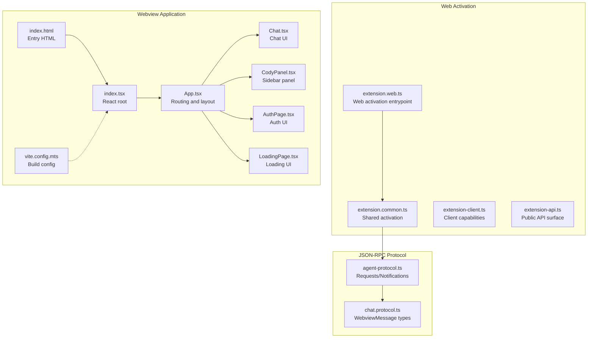
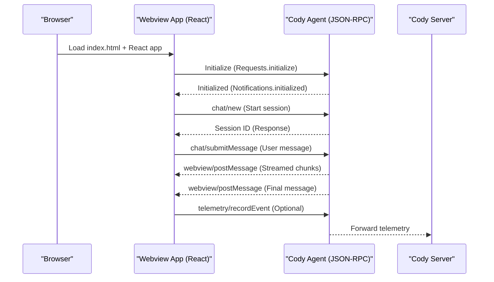
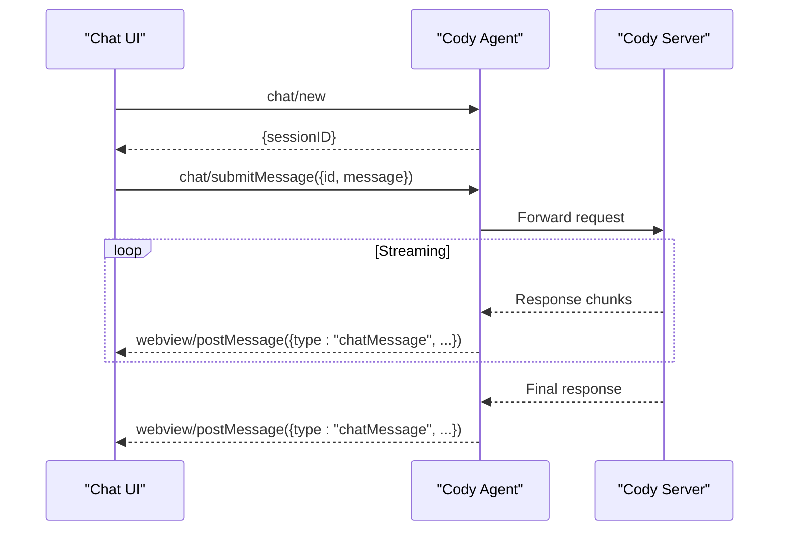
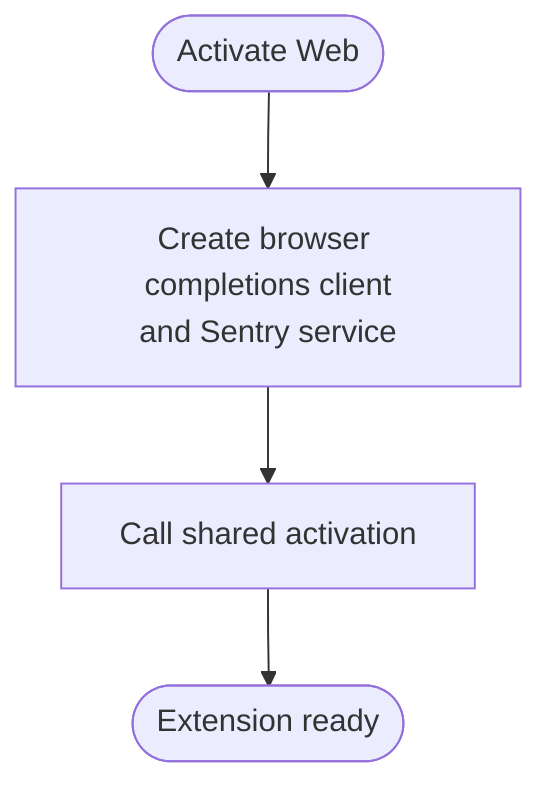
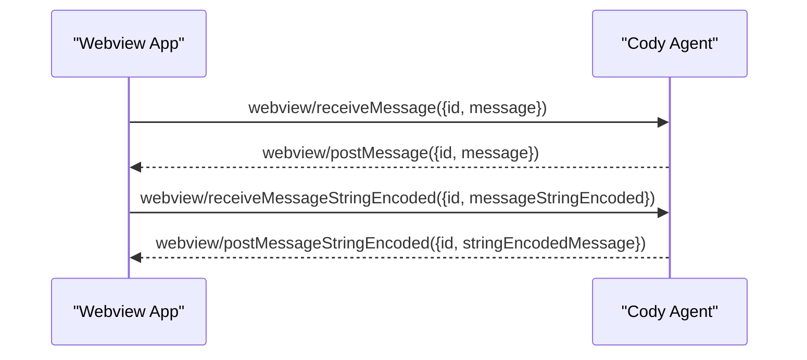
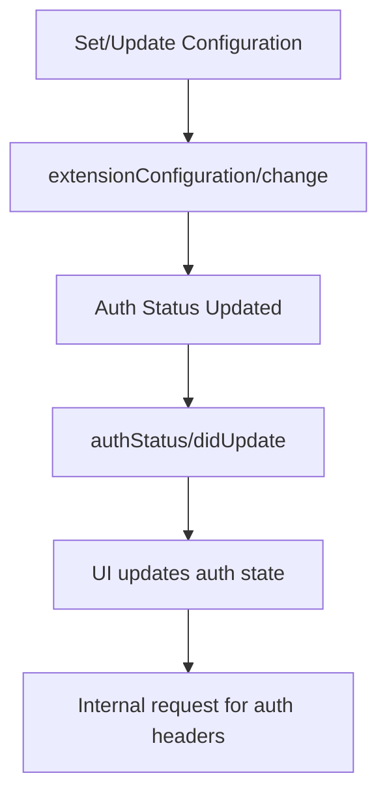
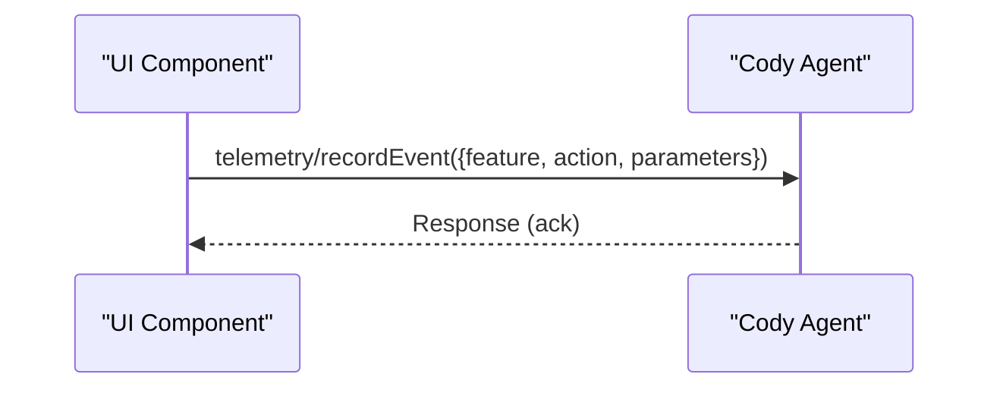
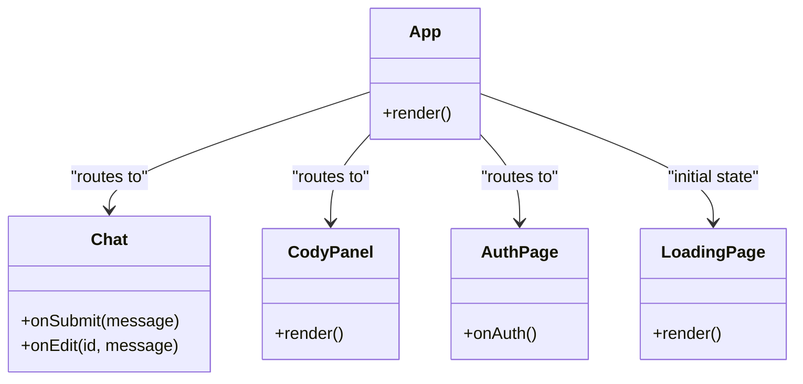
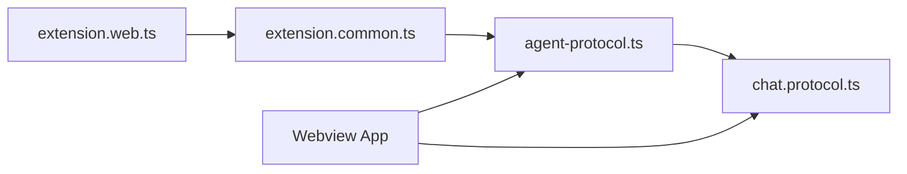

# Web APIs

<cite>
**Referenced Files in This Document**
- [extension.web.ts](file://vscode/src/extension.web.ts)
- [extension.common.ts](file://vscode/src/extension.common.ts)
- [extension-client.ts](file://vscode/src/extension-client.ts)
- [extension-api.ts](file://vscode/src/extension-api.ts)
- [agent-protocol.ts](file://vscode/src/jsonrpc/agent-protocol.ts)
- [chat.protocol.ts](file://vscode/src/chat/protocol.ts)
- [webviewAPI.ts](file://lib/shared/src/misc/rpc/webviewAPI.ts)
- [index.html](file://vscode/webviews/index.html)
- [index.tsx](file://vscode/webviews/index.tsx)
- [App.tsx](file://vscode/webviews/App.tsx)
- [Chat.tsx](file://vscode/webviews/Chat.tsx)
- [CodyPanel.tsx](file://vscode/webviews/CodyPanel.tsx)
- [AuthPage.tsx](file://vscode/webviews/AuthPage.tsx)
- [LoadingPage.tsx](file://vscode/webviews/LoadingPage.tsx)
- [vite.config.mts](file://vscode/webviews/vite.config.mts)
- [package.json](file://vscode/package.json)
- [README.md](file://vscode/README.md)
</cite>

## Table of Contents
1. [Introduction](#introduction)
2. [Project Structure](#project-structure)
3. [Core Components](#core-components)
4. [Architecture Overview](#architecture-overview)
5. [Detailed Component Analysis](#detailed-component-analysis)
6. [Dependency Analysis](#dependency-analysis)
7. [Performance Considerations](#performance-considerations)
8. [Troubleshooting Guide](#troubleshooting-guide)
9. [Conclusion](#conclusion)
10. [Appendices](#appendices)

## Introduction
This document describes the web-based integration APIs for Cody, focusing on:
- Real-time chat and streaming responses via the JSON-RPC protocol used by the Cody Agent
- Web authentication flows and configuration retrieval
- Telemetry submission
- The webview messaging protocol and postMessage usage
- Authentication methods, token management, and secure communication
- Web component APIs, React integration patterns, and state management approaches
- Embedding scenarios, customization options, CORS policies, and cross-origin considerations
- Performance optimization, caching strategies, and offline capabilities

## Project Structure
The web integration centers around:
- A web-based activation entrypoint for VS Code Web
- A JSON-RPC protocol definition for chat, configuration, telemetry, and webview messaging
- A React-based webview application that renders chat, authentication, and panels
- Build and runtime configuration for web deployment

**Diagram sources**
- [extension.web.ts:14-34](file://vscode/src/extension.web.ts#L14-L34)
- [extension.common.ts:44-77](file://vscode/src/extension.common.ts#L44-L77)
- [extension-client.ts:11-43](file://vscode/src/extension-client.ts#L11-L43)
- [extension-api.ts:5-18](file://vscode/src/extension-api.ts#L5-L18)
- [agent-protocol.ts:35-271](file://vscode/src/jsonrpc/agent-protocol.ts#L35-L271)
- [chat.protocol.ts](file://vscode/src/chat/protocol.ts)
- [index.html](file://vscode/webviews/index.html)
- [index.tsx](file://vscode/webviews/index.tsx)
- [App.tsx](file://vscode/webviews/App.tsx)
- [Chat.tsx](file://vscode/webviews/Chat.tsx)
- [CodyPanel.tsx](file://vscode/webviews/CodyPanel.tsx)
- [AuthPage.tsx](file://vscode/webviews/AuthPage.tsx)
- [LoadingPage.tsx](file://vscode/webviews/LoadingPage.tsx)
- [vite.config.mts](file://vscode/webviews/vite.config.mts)

**Section sources**
- [extension.web.ts:14-34](file://vscode/src/extension.web.ts#L14-L34)
- [extension.common.ts:44-77](file://vscode/src/extension.common.ts#L44-L77)
- [agent-protocol.ts:35-271](file://vscode/src/jsonrpc/agent-protocol.ts#L35-L271)
- [index.html](file://vscode/webviews/index.html)
- [index.tsx](file://vscode/webviews/index.tsx)
- [App.tsx](file://vscode/webviews/App.tsx)
- [Chat.tsx](file://vscode/webviews/Chat.tsx)
- [CodyPanel.tsx](file://vscode/webviews/CodyPanel.tsx)
- [AuthPage.tsx](file://vscode/webviews/AuthPage.tsx)
- [LoadingPage.tsx](file://vscode/webviews/LoadingPage.tsx)
- [vite.config.mts](file://vscode/webviews/vite.config.mts)

## Core Components
- Web activation for VS Code Web: Initializes the extension with a browser-compatible completions client and Sentry service.
- JSON-RPC protocol: Defines chat sessions, streaming replies, configuration updates, telemetry, and webview messaging.
- Webview application: React-based UI for chat, authentication, and panels, integrated with the protocol.

Key responsibilities:
- Real-time chat: JSON-RPC requests for new chats, submitting messages, editing messages, and streaming replies via webview notifications.
- Configuration and authentication: Requests to update configuration and retrieve auth status; webview messaging for auth UI.
- Telemetry: JSON-RPC request to record telemetry events.
- Webview messaging: High-level helpers to send/receive messages and stream responses.

**Section sources**
- [extension.web.ts:14-34](file://vscode/src/extension.web.ts#L14-L34)
- [agent-protocol.ts:35-271](file://vscode/src/jsonrpc/agent-protocol.ts#L35-L271)
- [agent-protocol.ts:418-472](file://vscode/src/jsonrpc/agent-protocol.ts#L418-L472)
- [chat.protocol.ts](file://vscode/src/chat/protocol.ts)

## Architecture Overview
The web integration uses a layered architecture:
- Web activation layer initializes platform-specific services for VS Code Web.
- Protocol layer defines bidirectional JSON-RPC requests and notifications for chat, configuration, telemetry, and webview messaging.
- Webview layer renders UI components and communicates with the protocol via webview messaging.

**Diagram sources**
- [agent-protocol.ts:35-271](file://vscode/src/jsonrpc/agent-protocol.ts#L35-L271)
- [agent-protocol.ts:418-472](file://vscode/src/jsonrpc/agent-protocol.ts#L418-L472)

## Detailed Component Analysis

### JSON-RPC Protocol: Chat, Streaming, and Webview Messaging
- Chat lifecycle:
  - Create chat sessions via dedicated requests for different contexts (panel, sidebar).
  - Submit and edit messages using high-level helpers that wrap low-level webview messaging.
  - Stream responses via webview notifications.
- Webview messaging:
  - Low-level receive/send via webview/receiveMessage and webview/postMessage.
  - String-encoded variants for clients with specific capabilities.
- Configuration and authentication:
  - Change extension configuration and retrieve auth status.
  - Internal helper to fetch auth headers for requests.
- Telemetry:
  - Record telemetry events via a dedicated request.

**Diagram sources**
- [agent-protocol.ts:42-77](file://vscode/src/jsonrpc/agent-protocol.ts#L42-L77)
- [agent-protocol.ts:418-425](file://vscode/src/jsonrpc/agent-protocol.ts#L418-L425)

**Section sources**
- [agent-protocol.ts:35-271](file://vscode/src/jsonrpc/agent-protocol.ts#L35-L271)
- [agent-protocol.ts:418-472](file://vscode/src/jsonrpc/agent-protocol.ts#L418-L472)

### Web Activation for VS Code Web
- Creates a browser-compatible completions client and Sentry service.
- Delegates to shared activation logic with platform-specific factories.

**Diagram sources**
- [extension.web.ts:14-34](file://vscode/src/extension.web.ts#L14-L34)
- [extension.common.ts:44-77](file://vscode/src/extension.common.ts#L44-L77)

**Section sources**
- [extension.web.ts:14-34](file://vscode/src/extension.web.ts#L14-L34)
- [extension.common.ts:44-77](file://vscode/src/extension.common.ts#L44-L77)

### Webview Messaging Protocol and postMessage API
- High-level helpers:
  - chat/submitMessage wraps webview messaging for chat submissions.
  - webview/receiveMessage and webview/postMessage provide low-level message exchange.
- String-encoded variants:
  - webview/receiveMessageStringEncoded and webview/postMessageStringEncoded for clients with specific capabilities.
- Webview creation and lifecycle:
  - Native webview creation, disposal, and HTML updates are exposed via notifications.

**Diagram sources**
- [agent-protocol.ts:159-166](file://vscode/src/jsonrpc/agent-protocol.ts#L159-L166)
- [agent-protocol.ts:418-425](file://vscode/src/jsonrpc/agent-protocol.ts#L418-L425)

**Section sources**
- [agent-protocol.ts:155-166](file://vscode/src/jsonrpc/agent-protocol.ts#L155-L166)
- [agent-protocol.ts:418-425](file://vscode/src/jsonrpc/agent-protocol.ts#L418-L425)

### Authentication Methods, Token Management, and Secure Communication
- Authentication status:
  - Retrieve and update authentication status via protocol requests.
  - Auth status notifications inform UI of changes.
- Token management:
  - Access tokens are part of extension configuration.
  - Internal helper request to fetch auth headers for outbound requests.
- Secure communication:
  - Use HTTPS endpoints and validated TLS.
  - Avoid exposing secrets in logs or telemetry payloads.

**Diagram sources**
- [agent-protocol.ts:222-230](file://vscode/src/jsonrpc/agent-protocol.ts#L222-L230)
- [agent-protocol.ts:470-471](file://vscode/src/jsonrpc/agent-protocol.ts#L470-L471)
- [agent-protocol.ts:270](file://vscode/src/jsonrpc/agent-protocol.ts#L270)

**Section sources**
- [agent-protocol.ts:222-230](file://vscode/src/jsonrpc/agent-protocol.ts#L222-L230)
- [agent-protocol.ts:470-471](file://vscode/src/jsonrpc/agent-protocol.ts#L470-L471)
- [agent-protocol.ts:270](file://vscode/src/jsonrpc/agent-protocol.ts#L270)

### Telemetry Submission
- Record telemetry events via a JSON-RPC request.
- Events include feature, action, and structured parameters.

**Diagram sources**
- [agent-protocol.ts:144](file://vscode/src/jsonrpc/agent-protocol.ts#L144)

**Section sources**
- [agent-protocol.ts:144](file://vscode/src/jsonrpc/agent-protocol.ts#L144)

### Web Component APIs and React Integration Patterns
- React components:
  - App routing and layout
  - Chat UI and transcript rendering
  - Sidebar panel and authentication page
  - Loading page for initialization
- Integration patterns:
  - Use webview messaging to synchronize state with the Agent.
  - Handle streaming updates via webview notifications.
  - Manage configuration and auth state in component state or a shared store.

**Diagram sources**
- [App.tsx](file://vscode/webviews/App.tsx)
- [Chat.tsx](file://vscode/webviews/Chat.tsx)
- [CodyPanel.tsx](file://vscode/webviews/CodyPanel.tsx)
- [AuthPage.tsx](file://vscode/webviews/AuthPage.tsx)
- [LoadingPage.tsx](file://vscode/webviews/LoadingPage.tsx)

**Section sources**
- [App.tsx](file://vscode/webviews/App.tsx)
- [Chat.tsx](file://vscode/webviews/Chat.tsx)
- [CodyPanel.tsx](file://vscode/webviews/CodyPanel.tsx)
- [AuthPage.tsx](file://vscode/webviews/AuthPage.tsx)
- [LoadingPage.tsx](file://vscode/webviews/LoadingPage.tsx)

### State Management Approaches
- Shared state:
  - Use a centralized store for chat history, configuration, and auth status.
  - Subscribe to webview notifications to keep UI in sync.
- Component state:
  - Local state for transient UI elements (e.g., input fields).
- Cross-component coordination:
  - Prop drilling or a lightweight event bus for message streaming.

[No sources needed since this section provides general guidance]

### Embedding Scenarios and Customization Options
- Embedding:
  - Host the webview application on a trusted origin.
  - Configure the server endpoint and custom headers in extension configuration.
- Customization:
  - Adjust webview options (scripts, forms, command URIs, local roots).
  - Customize client name/version for legacy server compatibility.

**Section sources**
- [agent-protocol.ts:474-504](file://vscode/src/jsonrpc/agent-protocol.ts#L474-L504)
- [extension-client.ts:27-30](file://vscode/src/extension-client.ts#L27-L30)

### CORS Policies and Security Headers
- CORS:
  - Ensure the server supports CORS for the web origin.
  - Validate Access-Control-Allow-Origin and related headers.
- Security headers:
  - Enforce Content-Security-Policy to restrict script execution and external resources.
  - Use Strict-Transport-Security for HTTPS enforcement.

[No sources needed since this section provides general guidance]

## Dependency Analysis
The web integration has clear boundaries:
- Web activation depends on shared activation and platform-specific services.
- Protocol defines the contract between the webview and the Agent.
- Webview application depends on protocol types and messaging.

**Diagram sources**
- [extension.web.ts:14-34](file://vscode/src/extension.web.ts#L14-L34)
- [extension.common.ts:44-77](file://vscode/src/extension.common.ts#L44-L77)
- [agent-protocol.ts:35-271](file://vscode/src/jsonrpc/agent-protocol.ts#L35-L271)
- [chat.protocol.ts](file://vscode/src/chat/protocol.ts)

**Section sources**
- [extension.web.ts:14-34](file://vscode/src/extension.web.ts#L14-L34)
- [extension.common.ts:44-77](file://vscode/src/extension.common.ts#L44-L77)
- [agent-protocol.ts:35-271](file://vscode/src/jsonrpc/agent-protocol.ts#L35-L271)

## Performance Considerations
- Streaming:
  - Use webview notifications for incremental rendering to reduce perceived latency.
- Caching:
  - Cache configuration and auth status to minimize repeated requests.
- Offline:
  - Persist chat transcripts locally and queue telemetry events when offline; flush on reconnect.

[No sources needed since this section provides general guidance]

## Troubleshooting Guide
- Authentication failures:
  - Verify access token validity and endpoint reachability.
  - Check auth status notifications and UI feedback.
- Streaming issues:
  - Confirm webview postMessage handlers are registered and messages are delivered.
- Telemetry not recorded:
  - Validate telemetry request payload and feature/action naming.

**Section sources**
- [agent-protocol.ts:470-471](file://vscode/src/jsonrpc/agent-protocol.ts#L470-L471)
- [agent-protocol.ts:418-425](file://vscode/src/jsonrpc/agent-protocol.ts#L418-L425)
- [agent-protocol.ts:144](file://vscode/src/jsonrpc/agent-protocol.ts#L144)

## Conclusion
Cody’s web integration leverages a robust JSON-RPC protocol for real-time chat and streaming responses, a React-based webview application for UI, and secure authentication and telemetry mechanisms. By adhering to the documented protocol and leveraging the provided components, integrators can embed Cody in browsers, manage authentication securely, and optimize performance with streaming and caching strategies.

## Appendices

### API Reference Summary

- Chat
  - chat/new: Start a new chat session
  - chat/web/new: Start a new web panel chat session
  - chat/sidebar/new: Start a new sidebar chat session
  - chat/submitMessage: Submit a message to a session
  - chat/editMessage: Edit an existing message
  - chat/delete: Delete a chat by ID
  - chat/models: List available models
  - chat/export: Export chat history
  - chat/import: Import chat history

- Webview Messaging
  - webview/receiveMessage: Send a message to a session
  - webview/receiveMessageStringEncoded: Send a string-encoded message
  - webview/postMessage: Receive streamed updates
  - webview/postMessageStringEncoded: Receive string-encoded updates

- Configuration and Authentication
  - extensionConfiguration/change: Update configuration and validate auth
  - extensionConfiguration/status: Retrieve current auth status
  - extensionConfiguration/getSettingsSchema: Get settings schema
  - internal/getAuthHeaders: Get auth headers for requests
  - authStatus/didUpdate: Auth status change notification

- Telemetry
  - telemetry/recordEvent: Record telemetry events

- Other
  - initialize/shutdown: Lifecycle management
  - window/*: UI and environment notifications
  - progress/*: Progress reporting
  - secrets/*: Secure storage operations

**Section sources**
- [agent-protocol.ts:35-271](file://vscode/src/jsonrpc/agent-protocol.ts#L35-L271)
- [agent-protocol.ts:276-303](file://vscode/src/jsonrpc/agent-protocol.ts#L276-L303)
- [agent-protocol.ts:418-472](file://vscode/src/jsonrpc/agent-protocol.ts#L418-L472)