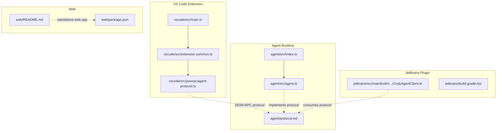
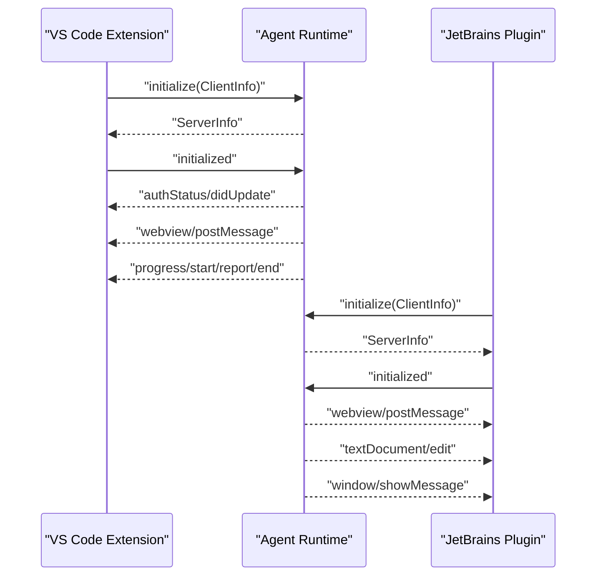
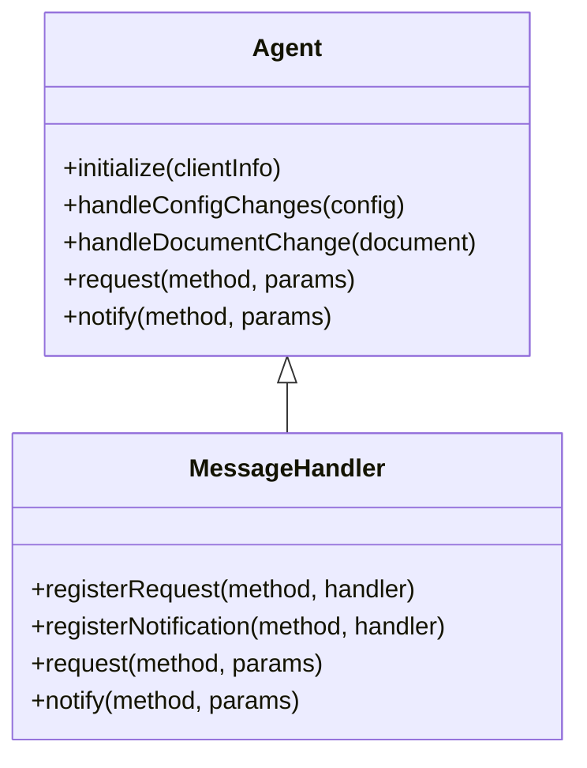
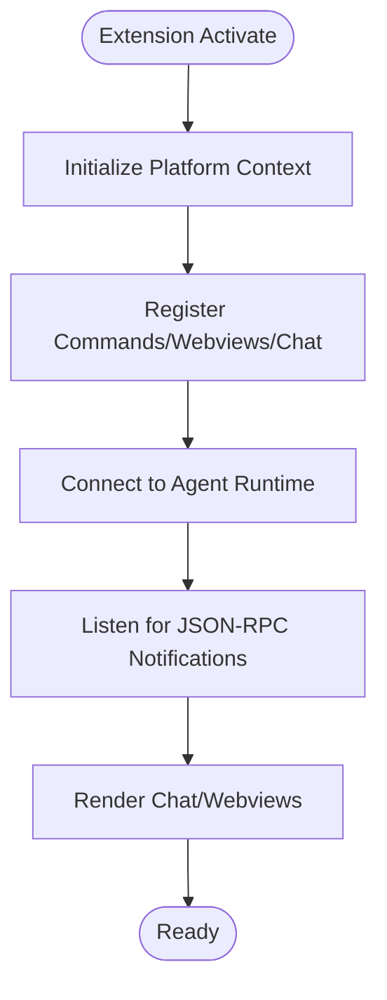
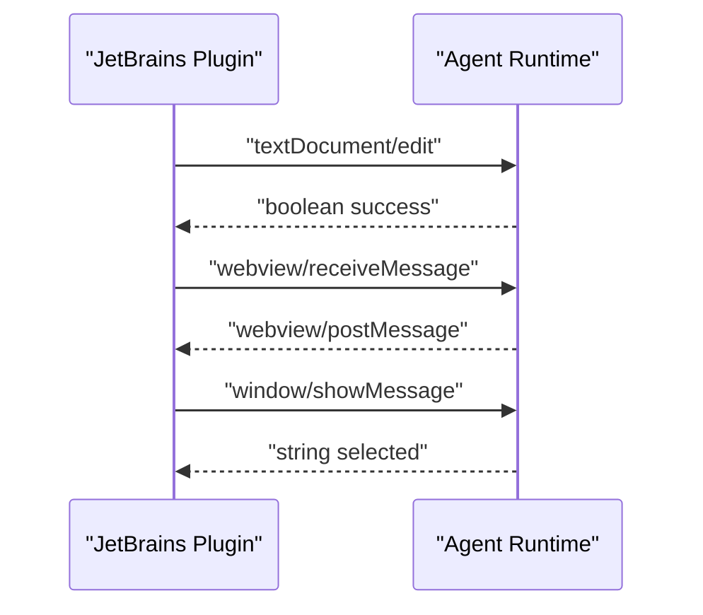
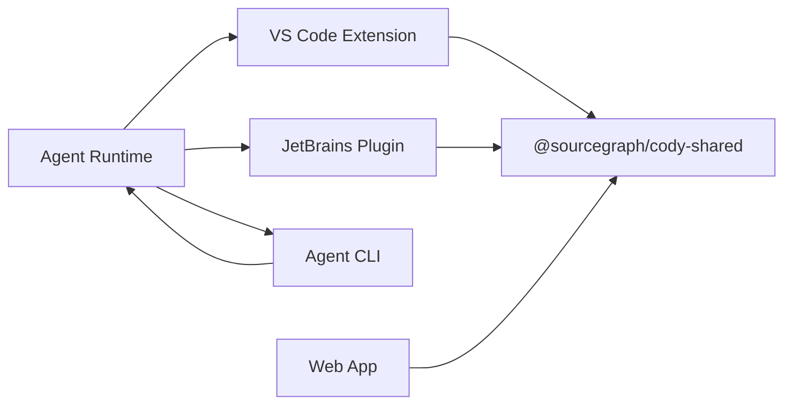

# Architecture Overview

<cite>
**Referenced Files in This Document**
- [ARCHITECTURE.md](file://ARCHITECTURE.md)
- [AGENT.md](file://AGENT.md)
- [README.md](file://README.md)
- [agent/README.md](file://agent/README.md)
- [agent/src/agent.ts](file://agent/src/agent.ts)
- [agent/src/index.ts](file://agent/src/index.ts)
- [agent/protocol.md](file://agent/protocol.md)
- [agent/src/jsonrpc-alias.ts](file://agent/src/jsonrpc-alias.ts)
- [agent/src/protocol-alias.ts](file://agent/src/protocol-alias.ts)
- [vscode/src/extension.common.ts](file://vscode/src/extension.common.ts)
- [vscode/src/main.ts](file://vscode/src/main.ts)
- [vscode/src/jsonrpc/agent-protocol.ts](file://vscode/src/jsonrpc/agent-protocol.ts)
- [jetbrains/build.gradle.kts](file://jetbrains/build.gradle.kts)
- [jetbrains/src/main/kotlin/com/sourcegraph/cody/agent/CodyAgentClient.kt](file://jetbrains/src/main/kotlin/com/sourcegraph/cody/agent/CodyAgentClient.kt)
- [web/README.md](file://web/README.md)
- [web/package.json](file://web/package.json)
</cite>

## Table of Contents
1. [Introduction](#introduction)
2. [Project Structure](#project-structure)
3. [Core Components](#core-components)
4. [Architecture Overview](#architecture-overview)
5. [Detailed Component Analysis](#detailed-component-analysis)
6. [Dependency Analysis](#dependency-analysis)
7. [Performance Considerations](#performance-considerations)
8. [Troubleshooting Guide](#troubleshooting-guide)
9. [Conclusion](#conclusion)
10. [Appendices](#appendices)

## Introduction
This document describes the Cody AI platform system design across multiple client environments: VS Code extension, JetBrains plugin, agent runtime, CLI interface, and web components. It explains how the IDE plugins integrate with the agent runtime via a JSON-RPC protocol, outlines cross-cutting concerns such as authentication, context retrieval, and telemetry, and highlights the modular design enabling swappable LLM providers and extensible functionality. The document also covers infrastructure and deployment topology considerations for consistent AI functionality across development environments.

## Project Structure
The Cody platform is organized as a monorepo with distinct packages for each client and runtime:
- agent: JSON-RPC server and protocol definitions for non-ECMAScript clients (e.g., JetBrains, Neovim)
- vscode: VS Code extension implementation, including UI, commands, chat, and integrations
- jetbrains: JetBrains plugin with Kotlin/Java implementation and Gradle build
- web: Standalone web application and components
- Shared libraries and documentation under lib, doc, and root configuration files

**Diagram sources**
- [vscode/src/main.ts:122-356](file://vscode/src/main.ts#L122-L356)
- [vscode/src/extension.common.ts:44-77](file://vscode/src/extension.common.ts#L44-L77)
- [vscode/src/jsonrpc/agent-protocol.ts:1-200](file://vscode/src/jsonrpc/agent-protocol.ts#L1-L200)
- [agent/src/index.ts:1-34](file://agent/src/index.ts#L1-L34)
- [agent/src/agent.ts:381-499](file://agent/src/agent.ts#L381-L499)
- [agent/protocol.md:1-60](file://agent/protocol.md#L1-L60)
- [jetbrains/src/main/kotlin/com/sourcegraph/cody/agent/CodyAgentClient.kt:1-60](file://jetbrains/src/main/kotlin/com/sourcegraph/cody/agent/CodyAgentClient.kt#L1-L60)
- [jetbrains/build.gradle.kts:487-531](file://jetbrains/build.gradle.kts#L487-L531)
- [web/README.md:1-25](file://web/README.md#L1-L25)
- [web/package.json:1-52](file://web/package.json#L1-L52)

**Section sources**
- [README.md:26-93](file://README.md#L26-L93)
- [ARCHITECTURE.md:10-165](file://ARCHITECTURE.md#L10-L165)
- [AGENT.md:1-26](file://AGENT.md#L1-L26)

## Core Components
- Agent runtime: JSON-RPC server that exposes a protocol for IDE clients to interact with Cody features (chat, autocomplete, edits, diagnostics, telemetry).
- VS Code extension: Full-featured client that registers commands, webviews, chat, and context retrieval, and integrates with the agent runtime.
- JetBrains plugin: Kotlin-based client that consumes the agent protocol for autocomplete, chat, and editing within JetBrains IDEs.
- Web components: Standalone web app and packages for embedding Cody experiences in browsers.
- CLI interface: Agent CLI commands for building, testing, and debugging the agent process.

Key implementation references:
- Agent runtime entrypoint and protocol: [agent/src/index.ts:1-34](file://agent/src/index.ts#L1-L34), [agent/protocol.md:1-60](file://agent/protocol.md#L1-L60)
- Agent server initialization and handlers: [agent/src/agent.ts:381-499](file://agent/src/agent.ts#L381-L499)
- VS Code extension startup and registration: [vscode/src/main.ts:122-356](file://vscode/src/main.ts#L122-L356), [vscode/src/extension.common.ts:44-77](file://vscode/src/extension.common.ts#L44-L77)
- JetBrains client protocol bindings and handlers: [jetbrains/src/main/kotlin/com/sourcegraph/cody/agent/CodyAgentClient.kt:1-60](file://jetbrains/src/main/kotlin/com/sourcegraph/cody/agent/CodyAgentClient.kt#L1-L60)
- Web app and packages: [web/README.md:1-25](file://web/README.md#L1-L25), [web/package.json:1-52](file://web/package.json#L1-L52)

**Section sources**
- [agent/src/index.ts:1-34](file://agent/src/index.ts#L1-L34)
- [agent/src/agent.ts:381-499](file://agent/src/agent.ts#L381-L499)
- [vscode/src/main.ts:122-356](file://vscode/src/main.ts#L122-L356)
- [vscode/src/extension.common.ts:44-77](file://vscode/src/extension.common.ts#L44-L77)
- [jetbrains/src/main/kotlin/com/sourcegraph/cody/agent/CodyAgentClient.kt:1-60](file://jetbrains/src/main/kotlin/com/sourcegraph/cody/agent/CodyAgentClient.kt#L1-L60)
- [web/README.md:1-25](file://web/README.md#L1-L25)
- [web/package.json:1-52](file://web/package.json#L1-L52)

## Architecture Overview
The Cody system employs a multi-client architecture:
- VS Code extension and JetBrains plugin act as clients to the agent runtime.
- The agent runtime implements a JSON-RPC protocol that defines requests, notifications, and responses for features such as chat, autocomplete, diagnostics, and telemetry.
- The CLI provides commands to build, test, and debug the agent process.

**Diagram sources**
- [agent/protocol.md:37-120](file://agent/protocol.md#L37-L120)
- [vscode/src/jsonrpc/agent-protocol.ts:35-120](file://vscode/src/jsonrpc/agent-protocol.ts#L35-L120)
- [jetbrains/src/main/kotlin/com/sourcegraph/cody/agent/CodyAgentClient.kt:197-237](file://jetbrains/src/main/kotlin/com/sourcegraph/cody/agent/CodyAgentClient.kt#L197-L237)
- [agent/src/agent.ts:381-499](file://agent/src/agent.ts#L381-L499)

## Detailed Component Analysis

### Agent Runtime
The agent runtime is a JSON-RPC server that:
- Initializes with client information and capabilities
- Handles document lifecycle notifications (open, change, save, close)
- Manages configuration changes and authentication status
- Exposes requests for chat, autocomplete, diagnostics, and telemetry
- Emits server-side notifications for UI updates and progress

**Diagram sources**
- [agent/src/agent.ts:295-380](file://agent/src/agent.ts#L295-L380)
- [agent/src/agent.ts:381-499](file://agent/src/agent.ts#L381-L499)

**Section sources**
- [agent/src/agent.ts:295-499](file://agent/src/agent.ts#L295-L499)
- [agent/protocol.md:37-120](file://agent/protocol.md#L37-L120)

### VS Code Extension
The VS Code extension:
- Starts the extension lifecycle, initializes platform context, and registers commands and webviews
- Integrates with the agent runtime via the JSON-RPC protocol
- Manages chat, autocomplete, code actions, and edit workflows
- Handles authentication, telemetry, and diagnostics

**Diagram sources**
- [vscode/src/extension.common.ts:44-77](file://vscode/src/extension.common.ts#L44-L77)
- [vscode/src/main.ts:122-356](file://vscode/src/main.ts#L122-L356)

**Section sources**
- [vscode/src/extension.common.ts:24-37](file://vscode/src/extension.common.ts#L24-L37)
- [vscode/src/main.ts:122-356](file://vscode/src/main.ts#L122-L356)

### JetBrains Plugin
The JetBrains plugin:
- Implements a client that consumes the agent protocol
- Handles requests for editing, document navigation, and secrets
- Processes server notifications for UI updates, progress, and webviews
- Integrates with the IDE’s editor and status bar

**Diagram sources**
- [jetbrains/src/main/kotlin/com/sourcegraph/cody/agent/CodyAgentClient.kt:78-117](file://jetbrains/src/main/kotlin/com/sourcegraph/cody/agent/CodyAgentClient.kt#L78-L117)
- [jetbrains/src/main/kotlin/com/sourcegraph/cody/agent/CodyAgentClient.kt:197-237](file://jetbrains/src/main/kotlin/com/sourcegraph/cody/agent/CodyAgentClient.kt#L197-L237)
- [agent/protocol.md:398-482](file://agent/protocol.md#L398-L482)

**Section sources**
- [jetbrains/src/main/kotlin/com/sourcegraph/cody/agent/CodyAgentClient.kt:1-60](file://jetbrains/src/main/kotlin/com/sourcegraph/cody/agent/CodyAgentClient.kt#L1-L60)
- [jetbrains/build.gradle.kts:487-531](file://jetbrains/build.gradle.kts#L487-L531)

### Web Components
The web components provide a standalone web app and packages:
- A demo standalone web app for Cody Web
- Dependencies and build scripts for development and production

**Section sources**
- [web/README.md:1-25](file://web/README.md#L1-L25)
- [web/package.json:1-52](file://web/package.json#L1-L52)

### CLI Interface
The agent CLI provides commands for building, testing, and debugging:
- Build and run the agent
- Debug and trace JSON-RPC traffic
- Manage HTTP recordings for deterministic tests

**Section sources**
- [agent/README.md:35-114](file://agent/README.md#L35-L114)
- [agent/src/index.ts:1-34](file://agent/src/index.ts#L1-L34)

## Dependency Analysis
The system exhibits clear separation of concerns:
- The agent runtime encapsulates protocol definitions and server logic
- The VS Code and JetBrains clients depend on the agent protocol
- The web app depends on shared libraries and packages
- CLI tools support development and testing workflows

**Diagram sources**
- [agent/src/agent.ts:381-499](file://agent/src/agent.ts#L381-L499)
- [vscode/src/main.ts:122-356](file://vscode/src/main.ts#L122-L356)
- [jetbrains/src/main/kotlin/com/sourcegraph/cody/agent/CodyAgentClient.kt:1-60](file://jetbrains/src/main/kotlin/com/sourcegraph/cody/agent/CodyAgentClient.kt#L1-L60)
- [web/package.json:22-50](file://web/package.json#L22-L50)

**Section sources**
- [agent/src/agent.ts:381-499](file://agent/src/agent.ts#L381-L499)
- [vscode/src/main.ts:122-356](file://vscode/src/main.ts#L122-L356)
- [jetbrains/src/main/kotlin/com/sourcegraph/cody/agent/CodyAgentClient.kt:1-60](file://jetbrains/src/main/kotlin/com/sourcegraph/cody/agent/CodyAgentClient.kt#L1-L60)
- [web/package.json:22-50](file://web/package.json#L22-L50)

## Performance Considerations
- Token counting: Accurate tokenization depends on the specific model’s tokenizer; prefer counting after model selection and avoid naive heuristics.
- Telemetry: Use numeric metadata for exportable fields and protect sensitive data in privateMetadata.
- Protocol efficiency: JSON-RPC enables bidirectional requests/notifications; minimize unnecessary notifications and batch document updates.
- Cross-language bindings: Protocol definitions are TypeScript-based; clients must implement JSON-RPC handlers and manage state consistency.

[No sources needed since this section provides general guidance]

## Troubleshooting Guide
- Authentication: Verify endpoint configuration and access tokens; monitor authStatus updates and telemetry events.
- Document synchronization: The agent enforces document sync checks and panics if client/server content diverges.
- Debugging: Enable agent tracing via environment variables and inspect JSON-RPC traffic; use CLI commands to run tests in recording/replay modes.
- Error handling: The agent captures uncaught exceptions and logs them; ensure proper error propagation in client implementations.

**Section sources**
- [ARCHITECTURE.md:55-122](file://ARCHITECTURE.md#L55-L122)
- [agent/src/agent.ts:306-316](file://agent/src/agent.ts#L306-L316)
- [agent/README.md:62-114](file://agent/README.md#L62-L114)

## Conclusion
Cody’s architecture leverages a robust agent runtime and a JSON-RPC protocol to deliver consistent AI functionality across VS Code, JetBrains, and web environments. The modular design supports swappable LLM providers and extensible features, while cross-cutting concerns like authentication, context retrieval, and telemetry are integrated throughout the system. Infrastructure and deployment considerations emphasize deterministic testing, secure credential handling, and efficient protocol communication.

[No sources needed since this section summarizes without analyzing specific files]

## Appendices

### System Context and Multi-Platform Architecture
- VS Code extension: Full-featured client with chat, commands, and webviews; integrates with the agent runtime.
- JetBrains plugin: Kotlin client consuming the agent protocol for autocomplete, chat, and editing.
- Agent runtime: JSON-RPC server powering non-ECMAScript clients; supports chat, autocomplete, diagnostics, and telemetry.
- Web components: Standalone web app and packages for browser-based experiences.
- CLI: Commands for building, testing, and debugging the agent process.

**Section sources**
- [README.md:26-93](file://README.md#L26-L93)
- [agent/README.md:1-180](file://agent/README.md#L1-L180)
- [jetbrains/README.md:1-207](file://jetbrains/README.md#L1-L207)
- [web/README.md:1-25](file://web/README.md#L1-L25)