# Authentication Configuration

<cite>
**Referenced Files in This Document**
- [auth.ts](file://vscode/src/auth/auth.ts)
- [AuthProvider.ts](file://vscode/src/services/AuthProvider.ts)
- [auth-resolver.ts](file://lib/shared/src/configuration/auth-resolver.ts)
- [resolver.ts](file://lib/shared/src/configuration/resolver.ts)
- [SecretStorageProvider.ts](file://vscode/src/services/SecretStorageProvider.ts)
- [tokens.ts](file://lib/shared/src/auth/tokens.ts)
- [token-receiver.ts](file://vscode/src/auth/token-receiver.ts)
- [types.ts](file://lib/shared/src/auth/types.ts)
- [AccessTokenStorage.java](file://jetbrains/src/main/java/com/sourcegraph/config/AccessTokenStorage.java)
- [auth.ts (JetBrains)](file://jetbrains/src/main/kotlin/com/sourcegraph/cody/auth/auth.kt)
- [auth-resolver.test.ts](file://lib/shared/src/configuration/auth-resolver.test.ts)
- [AuthProviderSimplified.ts](file://vscode/src/services/AuthProviderSimplified.ts)
- [errors.ts](file://lib/shared/src/sourcegraph-api/errors.ts)
- [AuthPage.tsx](file://vscode/webviews/AuthPage.tsx)
</cite>

## Table of Contents
1. [Introduction](#introduction)
2. [Project Structure](#project-structure)
3. [Core Components](#core-components)
4. [Architecture Overview](#architecture-overview)
5. [Detailed Component Analysis](#detailed-component-analysis)
6. [Dependency Analysis](#dependency-analysis)
7. [Performance Considerations](#performance-considerations)
8. [Troubleshooting Guide](#troubleshooting-guide)
9. [Security Best Practices](#security-best-practices)
10. [Conclusion](#conclusion)

## Introduction
This document explains how authentication is configured and managed in the Cody platform across desktop, web, and JetBrains integrations. It covers personal access tokens, enterprise SSO, and external provider integration, token management and refresh, credential storage security, authentication flow configuration, multi-account support, server endpoint validation, and troubleshooting. It also provides practical examples for connecting to Sourcegraph instances, configuring enterprise SSO, and managing multiple authenticated accounts.

## Project Structure
Authentication spans three layers:
- Editor integration (VS Code): UI flows, token callbacks, secret storage, and simplified onboarding.
- Shared configuration: resolution of credentials, external provider headers, and configuration observables.
- JetBrains integration: platform-specific token storage and authentication.

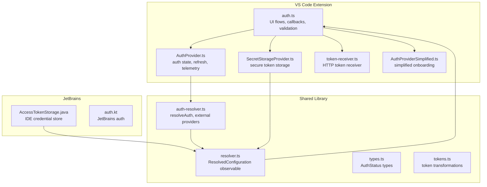

**Diagram sources**
- [auth.ts:1-603](file://vscode/src/auth/auth.ts#L1-L603)
- [AuthProvider.ts:1-380](file://vscode/src/services/AuthProvider.ts#L1-L380)
- [auth-resolver.ts:1-160](file://lib/shared/src/configuration/auth-resolver.ts#L1-L160)
- [resolver.ts:1-191](file://lib/shared/src/configuration/resolver.ts#L1-L191)
- [SecretStorageProvider.ts:1-256](file://vscode/src/services/SecretStorageProvider.ts#L1-L256)
- [AccessTokenStorage.java:1-30](file://jetbrains/src/main/java/com/sourcegraph/config/AccessTokenStorage.java#L1-L30)
- [AuthProviderSimplified.ts:1-50](file://vscode/src/services/AuthProviderSimplified.ts#L1-L50)
- [token-receiver.ts:1-82](file://vscode/src/auth/token-receiver.ts#L1-L82)
- [types.ts:1-87](file://lib/shared/src/auth/types.ts#L1-L87)
- [tokens.ts:1-26](file://lib/shared/src/auth/tokens.ts#L1-L26)

**Section sources**
- [auth.ts:1-603](file://vscode/src/auth/auth.ts#L1-L603)
- [AuthProvider.ts:1-380](file://vscode/src/services/AuthProvider.ts#L1-L380)
- [auth-resolver.ts:1-160](file://lib/shared/src/configuration/auth-resolver.ts#L1-L160)
- [resolver.ts:1-191](file://lib/shared/src/configuration/resolver.ts#L1-L191)
- [SecretStorageProvider.ts:1-256](file://vscode/src/services/SecretStorageProvider.ts#L1-L256)
- [AccessTokenStorage.java:1-30](file://jetbrains/src/main/java/com/sourcegraph/config/AccessTokenStorage.java#L1-L30)
- [AuthProviderSimplified.ts:1-50](file://vscode/src/services/AuthProviderSimplified.ts#L1-L50)
- [token-receiver.ts:1-82](file://vscode/src/auth/token-receiver.ts#L1-L82)
- [types.ts:1-87](file://lib/shared/src/auth/types.ts#L1-L87)
- [tokens.ts:1-26](file://lib/shared/src/auth/tokens.ts#L1-L26)

## Core Components
- Authentication UI and flows: sign-in menu, enterprise URL flow, token callback handler, sign-out, and endpoint formatting.
- AuthProvider: manages authentication state, validates and stores credentials, periodic refresh, telemetry, and context updates.
- Credential resolution: resolveAuth chooses between personal access tokens and external provider headers; supports overrides.
- Secret storage: secure token persistence across VS Code sessions and fallbacks for environments without secret storage.
- External provider integration: executes external commands to produce headers with optional expiration handling.
- Simplified onboarding: enterprise SSO flows for dotcom via external providers.
- Token transformations: gateway token derivation for dotcom tokens.

**Section sources**
- [auth.ts:81-146](file://vscode/src/auth/auth.ts#L81-L146)
- [AuthProvider.ts:45-335](file://vscode/src/services/AuthProvider.ts#L45-L335)
- [auth-resolver.ts:129-160](file://lib/shared/src/configuration/auth-resolver.ts#L129-L160)
- [SecretStorageProvider.ts:26-133](file://vscode/src/services/SecretStorageProvider.ts#L26-L133)
- [AuthProviderSimplified.ts:13-21](file://vscode/src/services/AuthProviderSimplified.ts#L13-L21)
- [tokens.ts:3-25](file://lib/shared/src/auth/tokens.ts#L3-L25)

## Architecture Overview
The authentication pipeline resolves credentials, validates them against the target endpoint, and maintains state with periodic refresh and telemetry.

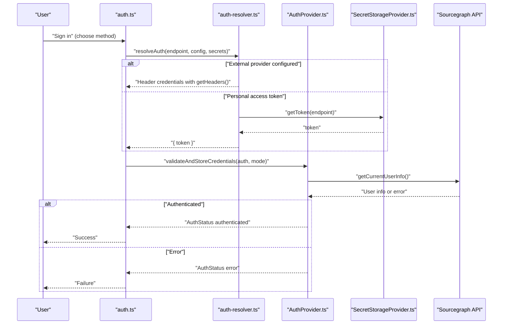

**Diagram sources**
- [auth.ts:126-144](file://vscode/src/auth/auth.ts#L126-L144)
- [auth-resolver.ts:129-160](file://lib/shared/src/configuration/auth-resolver.ts#L129-L160)
- [AuthProvider.ts:248-280](file://vscode/src/services/AuthProvider.ts#L248-L280)
- [SecretStorageProvider.ts:89-112](file://vscode/src/services/SecretStorageProvider.ts#L89-L112)

## Detailed Component Analysis

### Personal Access Tokens
- Resolution: resolveAuth falls back to ClientSecrets.getToken to retrieve tokens per endpoint.
- Storage: VSCodeSecretStorage persists tokens and token source, with optional local file fallback.
- Validation: validateCredentials calls the GraphQL API to verify token validity and endpoint compatibility.
- Expiration handling: tokens do not expire in the codebase; refresh occurs on demand and periodically for transient network errors.

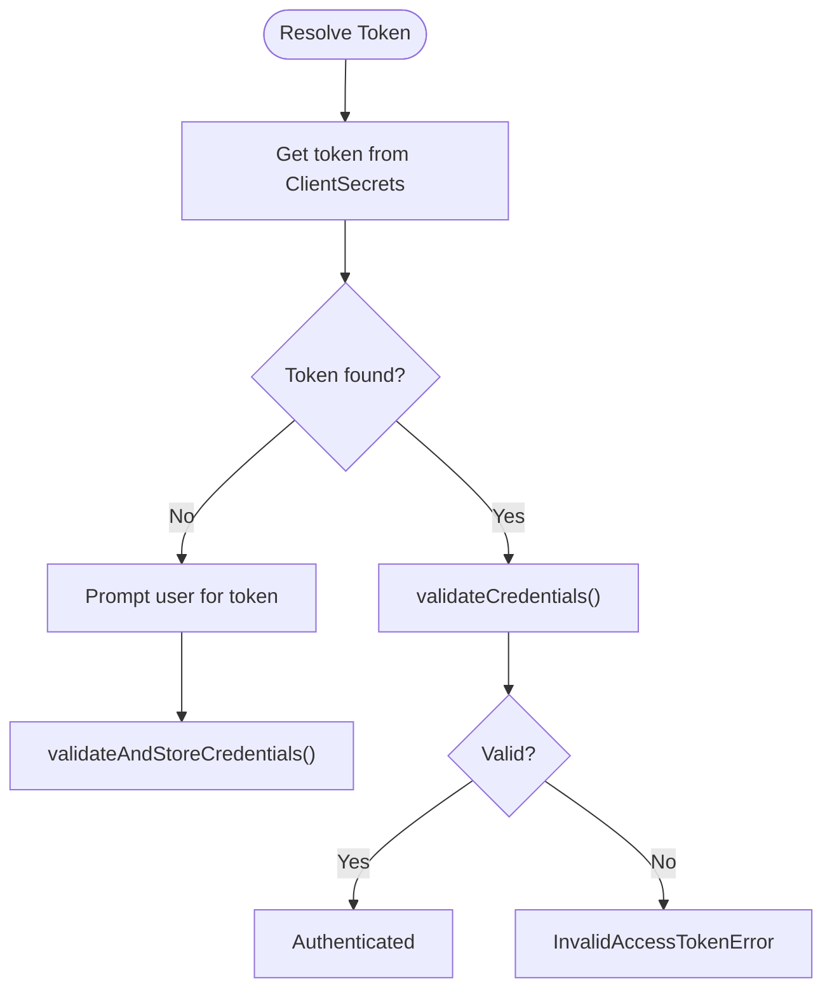

**Diagram sources**
- [auth-resolver.ts:74-90](file://lib/shared/src/configuration/auth-resolver.ts#L74-L90)
- [SecretStorageProvider.ts:89-112](file://vscode/src/services/SecretStorageProvider.ts#L89-L112)
- [auth.ts:458-569](file://vscode/src/auth/auth.ts#L458-L569)

**Section sources**
- [auth-resolver.ts:74-90](file://lib/shared/src/configuration/auth-resolver.ts#L74-L90)
- [SecretStorageProvider.ts:89-112](file://vscode/src/services/SecretStorageProvider.ts#L89-L112)
- [auth.ts:458-569](file://vscode/src/auth/auth.ts#L458-L569)

### Enterprise Single Sign-On (SSO)
- External provider integration: resolveAuth detects configured external providers and executes their executable to obtain headers with optional expiration.
- Header caching and refresh: headers are cached and refreshed when expired; failures trigger externalAuthRefresh and error propagation.
- Simplified onboarding: AuthProviderSimplified opens provider login pages for dotcom and sets pending auth state.

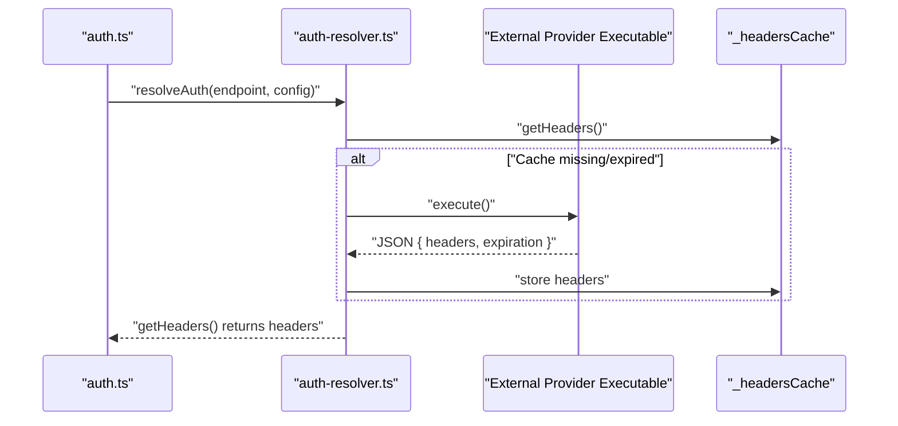

**Diagram sources**
- [auth-resolver.ts:92-127](file://lib/shared/src/configuration/auth-resolver.ts#L92-L127)
- [auth-resolver.test.ts:63-100](file://lib/shared/src/configuration/auth-resolver.test.ts#L63-L100)
- [AuthProviderSimplified.ts:14-20](file://vscode/src/services/AuthProviderSimplified.ts#L14-L20)

**Section sources**
- [auth-resolver.ts:92-127](file://lib/shared/src/configuration/auth-resolver.ts#L92-L127)
- [auth-resolver.test.ts:63-100](file://lib/shared/src/configuration/auth-resolver.test.ts#L63-L100)
- [AuthProviderSimplified.ts:14-20](file://vscode/src/services/AuthProviderSimplified.ts#L14-L20)
- [AuthPage.tsx:97-137](file://vscode/webviews/AuthPage.tsx#L97-L137)

### External Provider Integration
- Execution: externalAuth commands are executed in Node.js environments with timeouts and environment variables.
- Output validation: expects JSON with headers and optional expiration; rejects malformed or expired outputs.
- Error propagation: logs and throws ExternalAuthProviderError; triggers externalAuthRefresh.

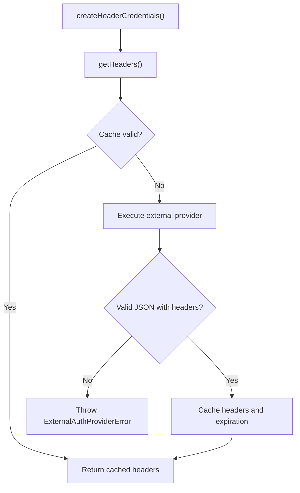

**Diagram sources**
- [auth-resolver.ts:102-127](file://lib/shared/src/configuration/auth-resolver.ts#L102-L127)
- [auth-resolver.test.ts:102-128](file://lib/shared/src/configuration/auth-resolver.test.ts#L102-L128)

**Section sources**
- [auth-resolver.ts:18-38](file://lib/shared/src/configuration/auth-resolver.ts#L18-L38)
- [auth-resolver.ts:51-72](file://lib/shared/src/configuration/auth-resolver.ts#L51-L72)
- [auth-resolver.test.ts:102-166](file://lib/shared/src/configuration/auth-resolver.test.ts#L102-L166)

### Token Management and Refresh Mechanisms
- AuthProvider validates credentials on configuration changes and periodically retries on transient network errors.
- Refresh requests are triggered by availability errors; AuthProvider emits pending validation state while validating.
- Telemetry reports connection status and first-ever authentication events.

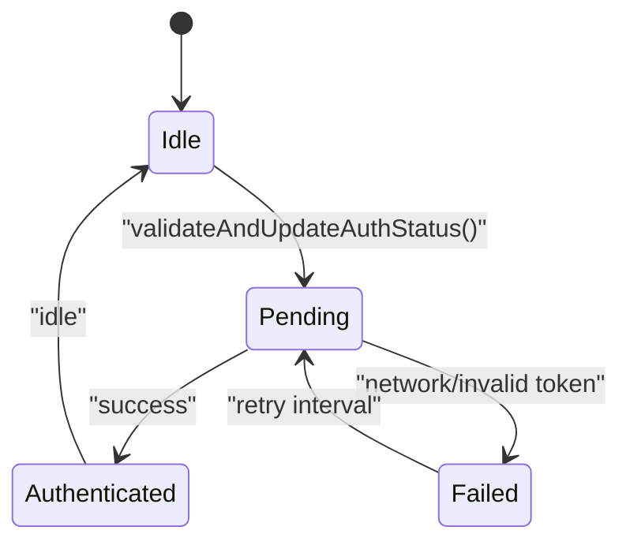

**Diagram sources**
- [AuthProvider.ts:61-88](file://vscode/src/services/AuthProvider.ts#L61-L88)
- [AuthProvider.ts:148-170](file://vscode/src/services/AuthProvider.ts#L148-L170)
- [auth.ts:500-523](file://vscode/src/auth/auth.ts#L500-L523)

**Section sources**
- [AuthProvider.ts:61-88](file://vscode/src/services/AuthProvider.ts#L61-L88)
- [AuthProvider.ts:148-170](file://vscode/src/services/AuthProvider.ts#L148-L170)
- [auth.ts:500-523](file://vscode/src/auth/auth.ts#L500-L523)

### Credential Storage Security
- VS Code: tokens stored in secure secret storage keyed by endpoint; token source stored separately; optional local file fallback for environments without secret storage.
- JetBrains: tokens stored in IDE credential store with separate keys for dotcom and enterprise.
- Gateway token transformation: dotcom tokens are transformed to gateway tokens for internal use.

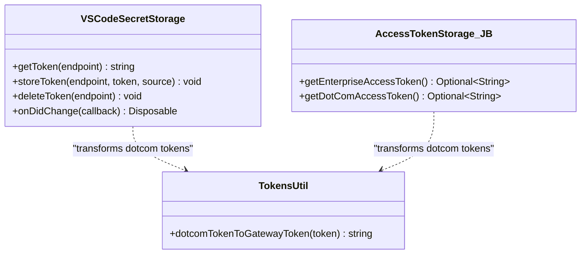

**Diagram sources**
- [SecretStorageProvider.ts:26-133](file://vscode/src/services/SecretStorageProvider.ts#L26-L133)
- [AccessTokenStorage.java:12-30](file://jetbrains/src/main/java/com/sourcegraph/config/AccessTokenStorage.java#L12-L30)
- [tokens.ts:3-25](file://lib/shared/src/auth/tokens.ts#L3-L25)

**Section sources**
- [SecretStorageProvider.ts:89-118](file://vscode/src/services/SecretStorageProvider.ts#L89-L118)
- [AccessTokenStorage.java:23-30](file://jetbrains/src/main/java/com/sourcegraph/config/AccessTokenStorage.java#L23-L30)
- [tokens.ts:3-25](file://lib/shared/src/auth/tokens.ts#L3-L25)

### Authentication Flow Configuration
- Menu-driven flows: choose enterprise, dotcom, or token-based sign-in; enterprise flow supports URL input and token paste.
- Callback handling: tokenCallbackHandler processes redirect URIs and switches instances when requested.
- Endpoint settings delivery: requestEndpointSettingsDeliveryToSearchPlugin obtains auth headers for plugin integration.

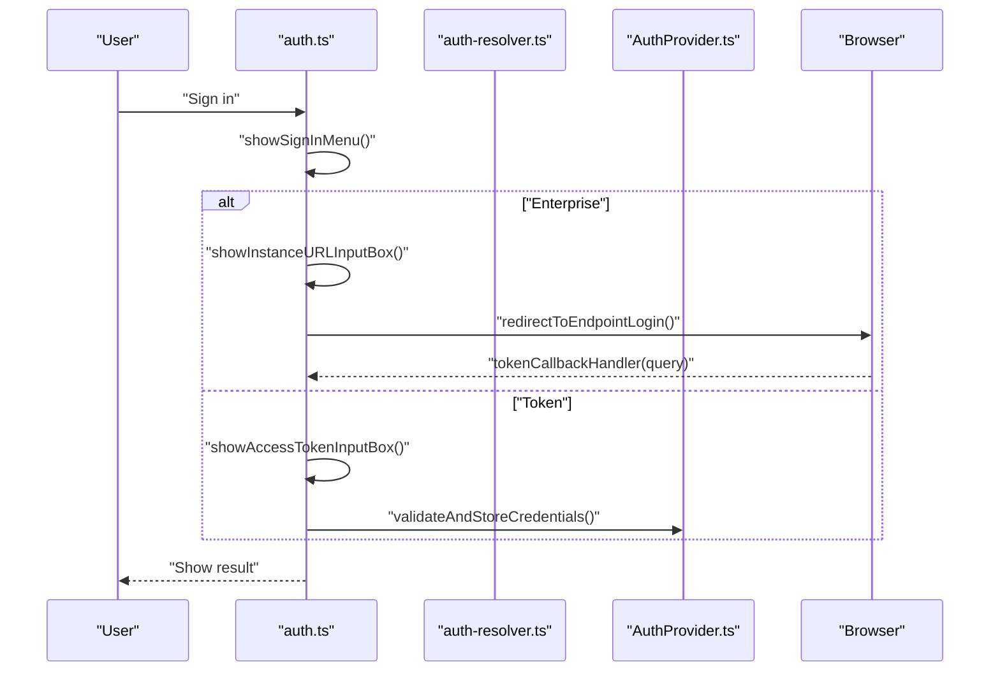

**Diagram sources**
- [auth.ts:81-146](file://vscode/src/auth/auth.ts#L81-L146)
- [auth.ts:283-310](file://vscode/src/auth/auth.ts#L283-L310)
- [auth.ts:336-378](file://vscode/src/auth/auth.ts#L336-L378)

**Section sources**
- [auth.ts:81-146](file://vscode/src/auth/auth.ts#L81-L146)
- [auth.ts:283-310](file://vscode/src/auth/auth.ts#L283-L310)
- [auth.ts:336-378](file://vscode/src/auth/auth.ts#L336-L378)

### Multi-Account Support
- Endpoint history and switching: showSignInMenu aggregates endpoint history and allows switching between accounts.
- Persistent storage: localStorage tracks endpoint history; AuthProvider maintains last validated credentials per endpoint.
- Sign-out: removes token and clears endpoint from persistent storage.

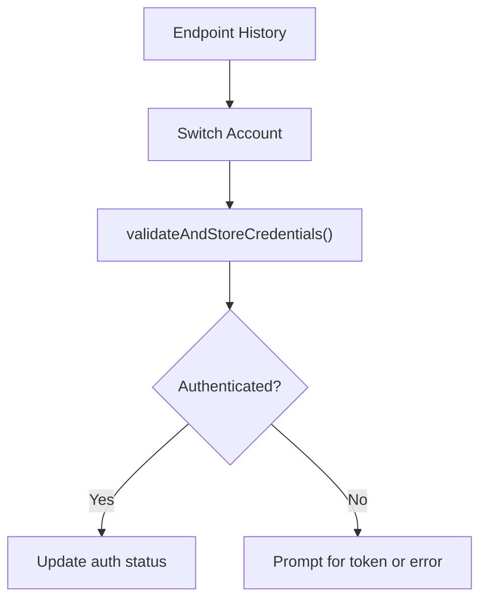

**Diagram sources**
- [auth.ts:153-172](file://vscode/src/auth/auth.ts#L153-L172)
- [auth.ts:420-444](file://vscode/src/auth/auth.ts#L420-L444)

**Section sources**
- [auth.ts:153-172](file://vscode/src/auth/auth.ts#L153-L172)
- [auth.ts:420-444](file://vscode/src/auth/auth.ts#L420-L444)

### Server Endpoint Validation
- URL normalization and validation: formatURL ensures HTTPS and valid format; showInstanceURLInputBox validates input.
- Endpoint-specific behavior: validateCredentials checks dotcom vs enterprise; enterprise user on dotcom triggers EnterpriseUserDotComError.

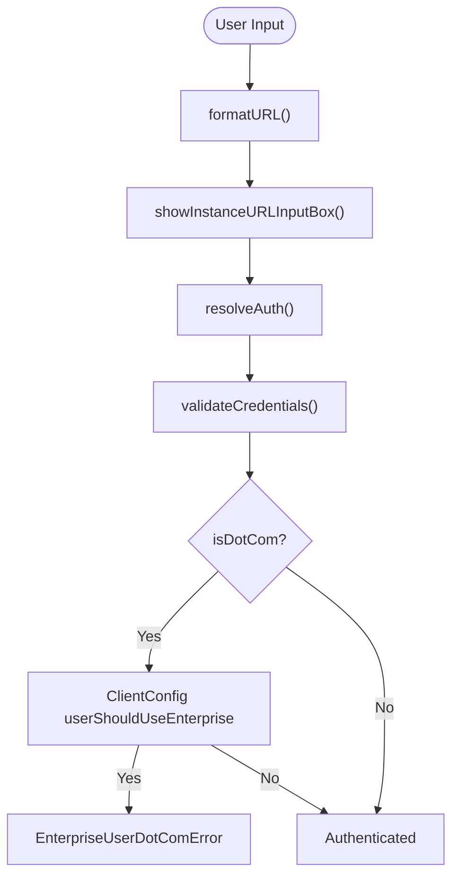

**Diagram sources**
- [auth.ts:380-403](file://vscode/src/auth/auth.ts#L380-L403)
- [auth.ts:177-208](file://vscode/src/auth/auth.ts#L177-L208)
- [auth.ts:540-557](file://vscode/src/auth/auth.ts#L540-L557)

**Section sources**
- [auth.ts:380-403](file://vscode/src/auth/auth.ts#L380-L403)
- [auth.ts:540-557](file://vscode/src/auth/auth.ts#L540-L557)

### Common Authentication Scenarios
- Connecting to a Sourcegraph instance:
  - Use enterprise URL flow to connect to a self-hosted instance.
  - Paste a personal access token when prompted.
- Configuring enterprise SSO:
  - Configure an external provider with executable returning headers and optional expiration.
  - Use simplified onboarding for dotcom SSO.
- Managing multiple authenticated accounts:
  - Switch between endpoints using the sign-in menu; endpoint history is persisted.

**Section sources**
- [auth.ts:61-77](file://vscode/src/auth/auth.ts#L61-L77)
- [auth.ts:101-144](file://vscode/src/auth/auth.ts#L101-L144)
- [auth-resolver.ts:129-160](file://lib/shared/src/configuration/auth-resolver.ts#L129-L160)
- [AuthProviderSimplified.ts:14-20](file://vscode/src/services/AuthProviderSimplified.ts#L14-L20)

## Dependency Analysis
- AuthProvider depends on:
  - ResolvedConfiguration observable from resolver.ts
  - SecretStorageProvider for tokens
  - Sourcegraph API for validation
- resolveAuth depends on:
  - ClientSecrets for tokens
  - External provider executable for headers
- VS Code UI depends on:
  - AuthProvider for status
  - SecretStorageProvider for token persistence

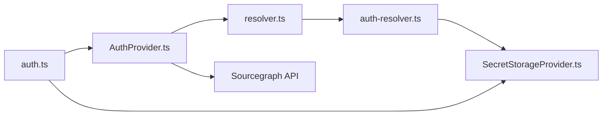

**Diagram sources**
- [auth.ts:1-603](file://vscode/src/auth/auth.ts#L1-L603)
- [AuthProvider.ts:1-380](file://vscode/src/services/AuthProvider.ts#L1-L380)
- [resolver.ts:76-106](file://lib/shared/src/configuration/resolver.ts#L76-L106)
- [auth-resolver.ts:129-160](file://lib/shared/src/configuration/auth-resolver.ts#L129-L160)
- [SecretStorageProvider.ts:1-256](file://vscode/src/services/SecretStorageProvider.ts#L1-L256)

**Section sources**
- [auth.ts:1-603](file://vscode/src/auth/auth.ts#L1-L603)
- [AuthProvider.ts:1-380](file://vscode/src/services/AuthProvider.ts#L1-L380)
- [resolver.ts:76-106](file://lib/shared/src/configuration/resolver.ts#L76-L106)
- [auth-resolver.ts:129-160](file://lib/shared/src/configuration/auth-resolver.ts#L129-L160)
- [SecretStorageProvider.ts:1-256](file://vscode/src/services/SecretStorageProvider.ts#L1-L256)

## Performance Considerations
- Periodic refresh intervals are tuned for availability errors; adjust intervals carefully to avoid excessive background network activity.
- External provider header retrieval is cached and refreshed only when expired; keep expiration reasonable to minimize overhead.
- Telemetry reporting is decoupled from frequent updates to reduce churn.

[No sources needed since this section provides general guidance]

## Troubleshooting Guide
- Token expiration:
  - Tokens are not rotated automatically; if authentication fails, re-enter the token or re-run the enterprise SSO flow.
- Network connectivity issues:
  - AuthProvider retries on transient network errors; ensure the endpoint is reachable and firewall rules allow connections.
- Provider-specific configuration problems:
  - External provider command must output valid JSON with headers and optional expiration; malformed output triggers ExternalAuthProviderError.
  - Verify executable permissions and environment variables.
- Enterprise user on dotcom:
  - If EnterpriseUserDotComError appears, sign in through your enterprise instance instead of dotcom.
- Token callback failures:
  - Ensure the redirect URI scheme matches the extension and that tokenCallbackHandler receives both token and endpoint.

**Section sources**
- [AuthProvider.ts:148-170](file://vscode/src/services/AuthProvider.ts#L148-L170)
- [auth-resolver.ts:51-72](file://lib/shared/src/configuration/auth-resolver.ts#L51-L72)
- [auth-resolver.test.ts:102-166](file://lib/shared/src/configuration/auth-resolver.test.ts#L102-L166)
- [errors.ts:171-181](file://lib/shared/src/sourcegraph-api/errors.ts#L171-L181)
- [auth.ts:336-378](file://vscode/src/auth/auth.ts#L336-L378)

## Security Best Practices
- Prefer secure secret storage for tokens; avoid storing tokens in plaintext files.
- Use external provider headers when available to avoid long-lived tokens.
- Limit token scope and rotation policies on the Sourcegraph instance.
- Transform dotcom tokens to gateway tokens internally to minimize exposure.
- Validate and sanitize endpoint URLs; reject tokens entered as URLs.

**Section sources**
- [SecretStorageProvider.ts:89-118](file://vscode/src/services/SecretStorageProvider.ts#L89-L118)
- [tokens.ts:3-25](file://lib/shared/src/auth/tokens.ts#L3-L25)
- [auth.ts:380-403](file://vscode/src/auth/auth.ts#L380-L403)

## Conclusion
Cody’s authentication system integrates personal access tokens, enterprise SSO via external providers, and simplified onboarding flows. It emphasizes secure storage, robust validation, and resilient refresh mechanisms. By understanding the credential resolution pipeline, storage providers, and error handling, teams can configure reliable authentication across desktop, web, and JetBrains environments.