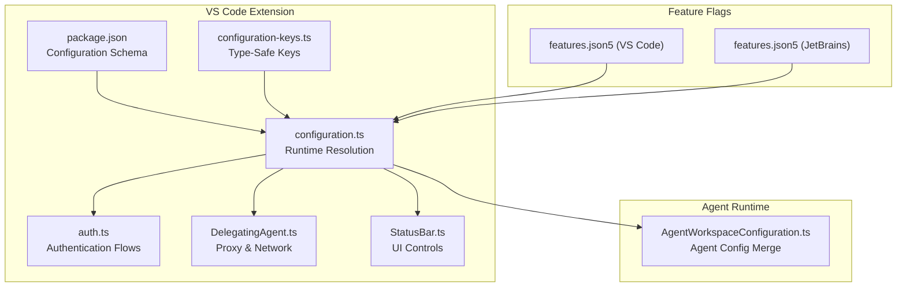
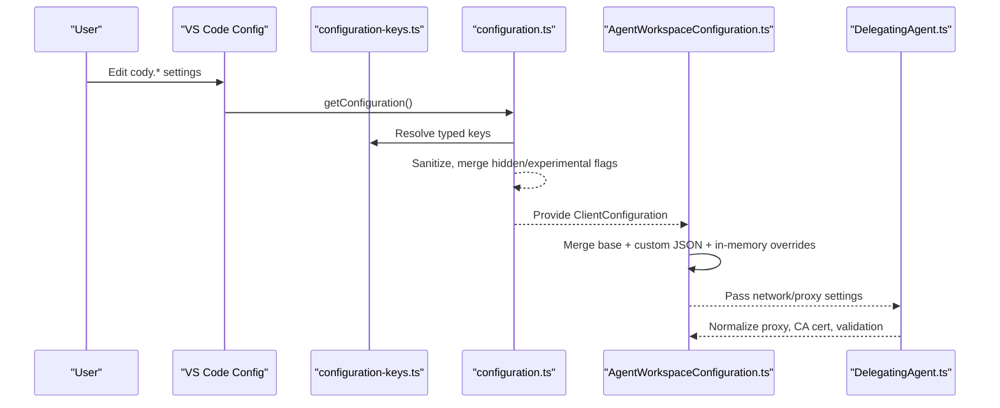
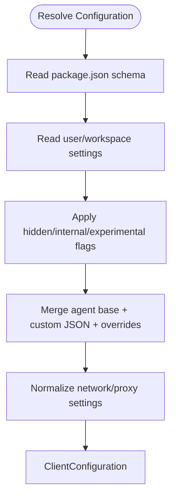
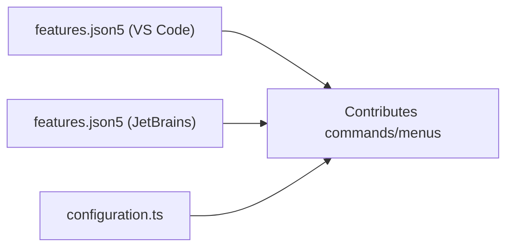
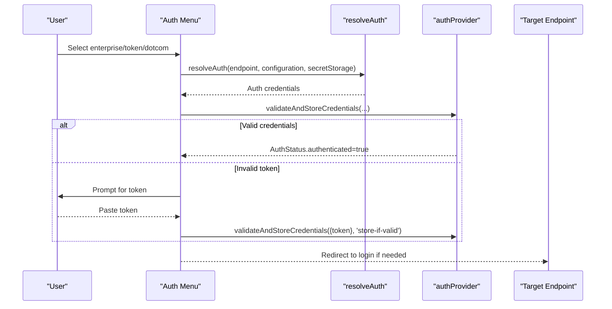
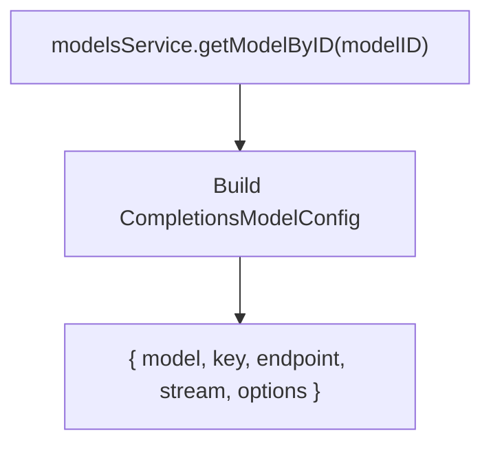
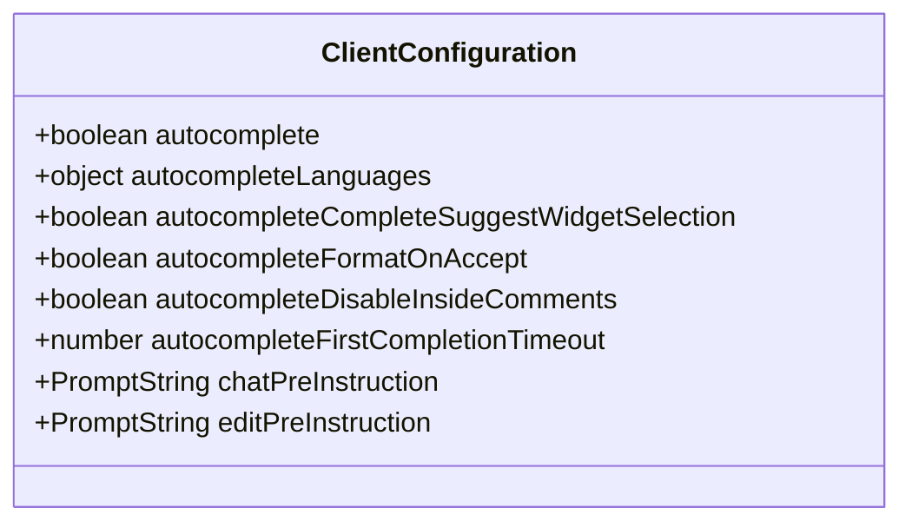
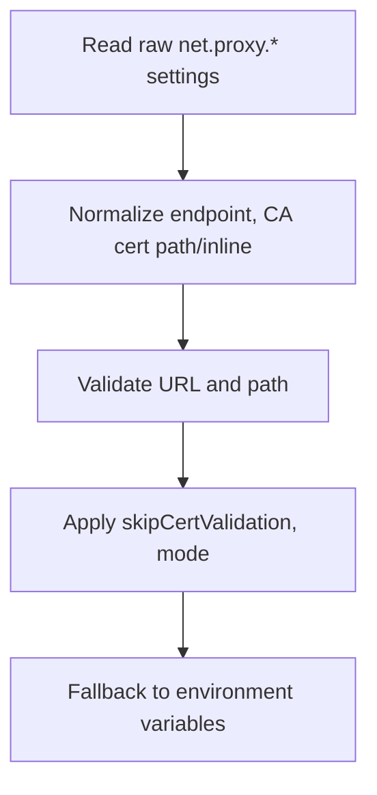
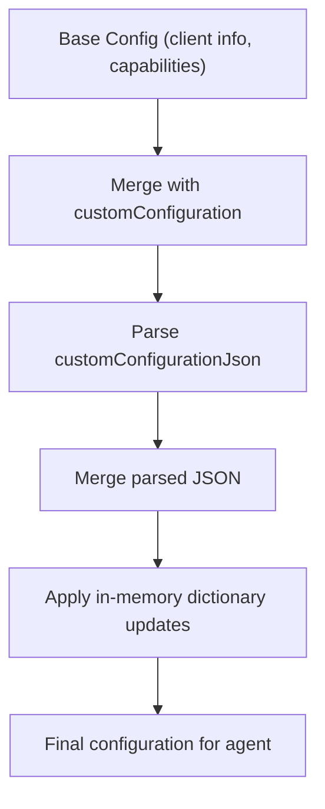
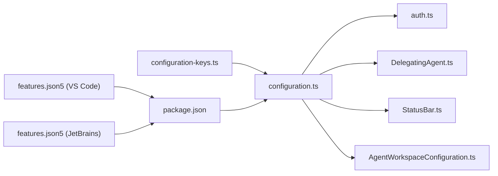

# Configuration & Customization

<cite>
**Referenced Files in This Document**
- [configuration.ts](file://vscode/src/configuration.ts)
- [configuration-keys.ts](file://vscode/src/configuration-keys.ts)
- [AgentWorkspaceConfiguration.ts](file://agent/src/AgentWorkspaceConfiguration.ts)
- [features.json5 (VS Code)](file://vscode/features.json5)
- [features.json5 (JetBrains)](file://jetbrains/features.json5)
- [package.json](file://vscode/package.json)
- [auth.ts](file://vscode/src/auth/auth.ts)
- [DelegatingAgent.ts](file://vscode/src/net/DelegatingAgent.ts)
- [configuration.test.ts](file://vscode/src/configuration.test.ts)
- [StatusBar.ts](file://vscode/src/services/StatusBar.ts)
</cite>

## Table of Contents
1. [Introduction](#introduction)
2. [Project Structure](#project-structure)
3. [Core Components](#core-components)
4. [Architecture Overview](#architecture-overview)
5. [Detailed Component Analysis](#detailed-component-analysis)
6. [Dependency Analysis](#dependency-analysis)
7. [Performance Considerations](#performance-considerations)
8. [Troubleshooting Guide](#troubleshooting-guide)
9. [Conclusion](#conclusion)
10. [Appendices](#appendices)

## Introduction
This document explains the multi-layer configuration system in the Cody platform, covering user preferences, workspace settings, and enterprise policies. It details feature flag management, experimental feature controls, authentication configuration for personal tokens and enterprise SSO, LLM provider configuration and model selection, and customization options for chat behavior, autocomplete, and code editing preferences. It also covers enterprise deployment settings such as proxy configuration and security policies, along with practical configuration scenarios and troubleshooting guidance.

## Project Structure
Cody’s configuration system spans:
- VS Code extension configuration schema and runtime resolution
- JetBrains IDE configuration surface
- Feature flags and staged rollouts
- Authentication flows and credential management
- Networking/proxy configuration
- Agent-side configuration merging and overrides

**Diagram sources**
- [package.json:120-319](file://vscode/package.json#L120-L319)
- [configuration.ts:25-204](file://vscode/src/configuration.ts#L25-L204)
- [configuration-keys.ts:18-52](file://vscode/src/configuration-keys.ts#L18-L52)
- [auth.ts:61-146](file://vscode/src/auth/auth.ts#L61-L146)
- [DelegatingAgent.ts:369-395](file://vscode/src/net/DelegatingAgent.ts#L369-L395)
- [AgentWorkspaceConfiguration.ts:59-160](file://agent/src/AgentWorkspaceConfiguration.ts#L59-L160)
- [features.json5 (VS Code):1-91](file://vscode/features.json5#L1-L91)
- [features.json5 (JetBrains):1-69](file://jetbrains/features.json5#L1-L69)

**Section sources**
- [package.json:120-319](file://vscode/package.json#L120-L319)
- [configuration.ts:25-204](file://vscode/src/configuration.ts#L25-L204)
- [configuration-keys.ts:18-52](file://vscode/src/configuration-keys.ts#L18-L52)
- [AgentWorkspaceConfiguration.ts:59-160](file://agent/src/AgentWorkspaceConfiguration.ts#L59-L160)
- [features.json5 (VS Code):1-91](file://vscode/features.json5#L1-L91)
- [features.json5 (JetBrains):1-69](file://jetbrains/features.json5#L1-L69)

## Core Components
- Configuration schema and defaults are declared in the VS Code package.json and consumed at runtime by configuration.ts.
- Type-safe configuration keys are generated from the schema to prevent drift and ensure consistent access.
- AgentWorkspaceConfiguration merges base configuration, custom JSON, and in-memory overrides to produce a unified configuration for agent clients.
- Feature flags are defined per editor and tagged for staged rollout and product line targeting.
- Authentication supports enterprise SSO and personal tokens, with flows that validate and persist credentials.
- Networking configuration supports explicit proxy endpoints, CA certificates, and certificate validation toggles.
- UI surfaces expose configuration options for autocomplete modes and related behaviors.

**Section sources**
- [configuration.ts:25-204](file://vscode/src/configuration.ts#L25-L204)
- [configuration-keys.ts:18-52](file://vscode/src/configuration-keys.ts#L18-L52)
- [AgentWorkspaceConfiguration.ts:59-160](file://agent/src/AgentWorkspaceConfiguration.ts#L59-L160)
- [features.json5 (VS Code):1-91](file://vscode/features.json5#L1-L91)
- [auth.ts:61-146](file://vscode/src/auth/auth.ts#L61-L146)
- [DelegatingAgent.ts:369-395](file://vscode/src/net/DelegatingAgent.ts#L369-L395)
- [StatusBar.ts:651-666](file://vscode/src/services/StatusBar.ts#L651-L666)

## Architecture Overview
The configuration pipeline resolves user preferences layered over workspace and enterprise defaults, applies hidden/internal/experimental toggles, and exposes a normalized ClientConfiguration consumed by the rest of the app. Feature flags gate availability and rollout stages. Agent clients receive a merged configuration that respects both base settings and dynamic overrides.

**Diagram sources**
- [configuration.ts:25-204](file://vscode/src/configuration.ts#L25-L204)
- [configuration-keys.ts:18-52](file://vscode/src/configuration-keys.ts#L18-L52)
- [AgentWorkspaceConfiguration.ts:59-160](file://agent/src/AgentWorkspaceConfiguration.ts#L59-L160)
- [DelegatingAgent.ts:369-395](file://vscode/src/net/DelegatingAgent.ts#L369-L395)

## Detailed Component Analysis

### Multi-Layer Configuration System
- User preferences: cody.* keys under VS Code settings.
- Workspace settings: per-folder overrides via VS Code workspace configuration.
- Enterprise policies: managed via client configuration fetched by the extension and merged into the resolved configuration.
- Hidden/internal/experimental toggles: prefixed cody.internal.* and cody.experimental.* for controlled rollout.
- Agent overrides: customConfiguration/customConfigurationJson and in-memory dictionary updates.

**Diagram sources**
- [configuration.ts:25-204](file://vscode/src/configuration.ts#L25-L204)
- [AgentWorkspaceConfiguration.ts:114-150](file://agent/src/AgentWorkspaceConfiguration.ts#L114-L150)
- [DelegatingAgent.ts:369-395](file://vscode/src/net/DelegatingAgent.ts#L369-L395)

**Section sources**
- [configuration.ts:25-204](file://vscode/src/configuration.ts#L25-L204)
- [configuration-keys.ts:18-52](file://vscode/src/configuration-keys.ts#L18-L52)
- [AgentWorkspaceConfiguration.ts:59-160](file://agent/src/AgentWorkspaceConfiguration.ts#L59-L160)
- [configuration.test.ts:15-221](file://vscode/src/configuration.test.ts#L15-L221)

### Feature Flag Management and Experimental Controls
- Feature flags are defined in features.json5 files per editor, with statuses and tags indicating stability and product line.
- The VS Code extension contributes commands and menus conditionally based on feature flags and suggestions mode.
- Internal/unstable and experimental toggles allow staged enablement and debugging.

**Diagram sources**
- [features.json5 (VS Code):1-91](file://vscode/features.json5#L1-L91)
- [features.json5 (JetBrains):1-69](file://jetbrains/features.json5#L1-L69)
- [package.json:192-800](file://vscode/package.json#L192-L800)
- [configuration.ts:122-159](file://vscode/src/configuration.ts#L122-L159)

**Section sources**
- [features.json5 (VS Code):1-91](file://vscode/features.json5#L1-L91)
- [features.json5 (JetBrains):1-69](file://jetbrains/features.json5#L1-L69)
- [package.json:192-800](file://vscode/package.json#L192-L800)
- [configuration.ts:122-159](file://vscode/src/configuration.ts#L122-L159)

### Authentication Configuration
- Supports enterprise SSO and personal access tokens.
- Validates credentials against the target endpoint and persists them securely.
- Provides flows to sign in, switch accounts, and handle invalid tokens.

**Diagram sources**
- [auth.ts:61-146](file://vscode/src/auth/auth.ts#L61-L146)

**Section sources**
- [auth.ts:61-146](file://vscode/src/auth/auth.ts#L61-L146)

### LLM Provider Configuration and Model Selection
- Model selection and provider configuration are derived from the shared models service and client-side provider configs.
- The configuration system exposes developer-only model lists and provider limits for advanced scenarios.
- API key management is handled per provider via client-side configuration.

**Diagram sources**
- [configuration.ts:190-191](file://vscode/src/configuration.ts#L190-L191)

**Section sources**
- [configuration.ts:190-191](file://vscode/src/configuration.ts#L190-L191)

### Chat Behavior and Autocomplete Preferences
- Chat pre-instructions and edit pre-instructions allow injecting context-sensitive instructions.
- Autocomplete behavior includes language scoping, accept/formatting behavior, comment handling, and timeout tuning.
- Suggestions mode toggles between autocomplete and auto-edit modes, with backward compatibility handling.

**Diagram sources**
- [configuration.ts:96-116](file://vscode/src/configuration.ts#L96-L116)
- [configuration.ts:100-101](file://vscode/src/configuration.ts#L100-L101)
- [configuration.ts:186-189](file://vscode/src/configuration.ts#L186-L189)

**Section sources**
- [configuration.ts:96-116](file://vscode/src/configuration.ts#L96-L116)
- [configuration.ts:100-101](file://vscode/src/configuration.ts#L100-L101)
- [configuration.ts:186-189](file://vscode/src/configuration.ts#L186-L189)
- [StatusBar.ts:651-666](file://vscode/src/services/StatusBar.ts#L651-L666)

### Enterprise Configuration: Proxy and Security Policies
- Explicit proxy configuration supports endpoint, CA certificate (inline or path), and certificate validation skipping.
- Network mode and VS Code HTTP settings are captured to influence retry and auth behavior.
- Environment variable fallbacks exist for default proxy and no-proxy behavior.

**Diagram sources**
- [DelegatingAgent.ts:369-395](file://vscode/src/net/DelegatingAgent.ts#L369-L395)
- [configuration.ts:75-89](file://vscode/src/configuration.ts#L75-L89)

**Section sources**
- [DelegatingAgent.ts:369-395](file://vscode/src/net/DelegatingAgent.ts#L369-L395)
- [configuration.ts:75-89](file://vscode/src/configuration.ts#L75-L89)

### Agent Configuration Merging and Overrides
- AgentWorkspaceConfiguration merges base configuration, custom JSON, and in-memory overrides.
- It maps client capabilities to agent-specific settings and ensures deep merges for object values.

**Diagram sources**
- [AgentWorkspaceConfiguration.ts:59-160](file://agent/src/AgentWorkspaceConfiguration.ts#L59-L160)

**Section sources**
- [AgentWorkspaceConfiguration.ts:59-160](file://agent/src/AgentWorkspaceConfiguration.ts#L59-L160)

## Dependency Analysis
- configuration.ts depends on configuration-keys.ts for type-safe key access and on VS Code workspace configuration APIs.
- AgentWorkspaceConfiguration depends on extension configuration and client capability metadata.
- Feature flags in features.json5 influence command visibility and behavior in package.json contributions.
- Authentication flows depend on resolveAuth and authProvider to validate and store credentials.
- Networking depends on DelegatingAgent normalization for proxy and TLS settings.

**Diagram sources**
- [configuration-keys.ts:18-52](file://vscode/src/configuration-keys.ts#L18-L52)
- [configuration.ts:25-204](file://vscode/src/configuration.ts#L25-L204)
- [package.json:120-319](file://vscode/package.json#L120-L319)
- [auth.ts:61-146](file://vscode/src/auth/auth.ts#L61-L146)
- [DelegatingAgent.ts:369-395](file://vscode/src/net/DelegatingAgent.ts#L369-L395)
- [StatusBar.ts:651-666](file://vscode/src/services/StatusBar.ts#L651-L666)
- [AgentWorkspaceConfiguration.ts:59-160](file://agent/src/AgentWorkspaceConfiguration.ts#L59-L160)
- [features.json5 (VS Code):1-91](file://vscode/features.json5#L1-L91)
- [features.json5 (JetBrains):1-69](file://jetbrains/features.json5#L1-L69)

**Section sources**
- [configuration.ts:25-204](file://vscode/src/configuration.ts#L25-L204)
- [configuration-keys.ts:18-52](file://vscode/src/configuration-keys.ts#L18-L52)
- [AgentWorkspaceConfiguration.ts:59-160](file://agent/src/AgentWorkspaceConfiguration.ts#L59-L160)
- [features.json5 (VS Code):1-91](file://vscode/features.json5#L1-L91)
- [features.json5 (JetBrains):1-69](file://jetbrains/features.json5#L1-L69)
- [auth.ts:61-146](file://vscode/src/auth/auth.ts#L61-L146)
- [DelegatingAgent.ts:369-395](file://vscode/src/net/DelegatingAgent.ts#L369-L395)
- [StatusBar.ts:651-666](file://vscode/src/services/StatusBar.ts#L651-L666)

## Performance Considerations
- Minimize repeated reads of large configuration objects; cache resolved configuration where appropriate.
- Prefer targeted updates for agent overrides to reduce deep merge overhead.
- Tune autocomplete timeouts to balance responsiveness and accuracy for your environment.
- Use feature flags to stage expensive experiments and avoid impacting default users.

## Troubleshooting Guide
Common configuration issues and resolutions:
- Invalid proxy endpoint URL: Ensure the proxy endpoint is a valid URL; errors are thrown and logged during normalization.
- Certificate validation failures: Disable certificate validation only temporarily; prefer providing a correct CA certificate path or inline PEM.
- Regex debug filter errors: If the debug filter regex is invalid, a default wildcard pattern is applied and an error message is shown.
- Autocomplete mode mismatch: Suggestions mode determines whether autocomplete or auto-edit is active; switching modes updates persisted settings.
- Authentication failures: If credentials are invalid, the system prompts for a new token; ensure the token matches the target endpoint.

**Section sources**
- [DelegatingAgent.ts:387-395](file://vscode/src/net/DelegatingAgent.ts#L387-L395)
- [configuration.ts:32-48](file://vscode/src/configuration.ts#L32-L48)
- [configuration.ts:59-72](file://vscode/src/configuration.ts#L59-L72)
- [auth.ts:130-142](file://vscode/src/auth/auth.ts#L130-L142)

## Conclusion
Cody’s configuration system provides a robust, layered approach to managing user preferences, workspace settings, enterprise policies, and experimental features. It integrates authentication, networking, and agent-specific overrides while exposing a clear schema and type-safe access patterns. Feature flags enable controlled rollouts, and the UI surfaces allow users to tailor chat behavior, autocomplete, and editing preferences to their workflows.

## Appendices

### Configuration Scenarios
- Enable auto-edit suggestions: Switch suggestions mode to auto-edit; the system migrates the stored preference and enables related behaviors.
- Configure a corporate proxy: Set proxy endpoint, optional CA certificate, and toggle certificate validation as needed; environment variable fallbacks are supported.
- Inject pre-instructions: Add chat and edit pre-instructions to guide model behavior for specific tasks.
- Limit autocomplete to specific languages: Use the autocomplete language scoping to enable/disable suggestions per language ID.
- Stage experimental features: Use internal/unstable and experimental toggles to enable features for testing and gather feedback.

**Section sources**
- [configuration.ts:59-72](file://vscode/src/configuration.ts#L59-L72)
- [configuration.ts:75-89](file://vscode/src/configuration.ts#L75-L89)
- [configuration.ts:100-101](file://vscode/src/configuration.ts#L100-L101)
- [configuration.ts:97-99](file://vscode/src/configuration.ts#L97-L99)
- [configuration.ts:132-159](file://vscode/src/configuration.ts#L132-L159)