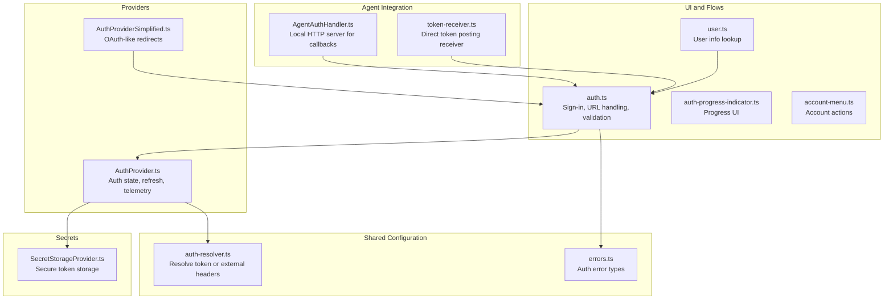
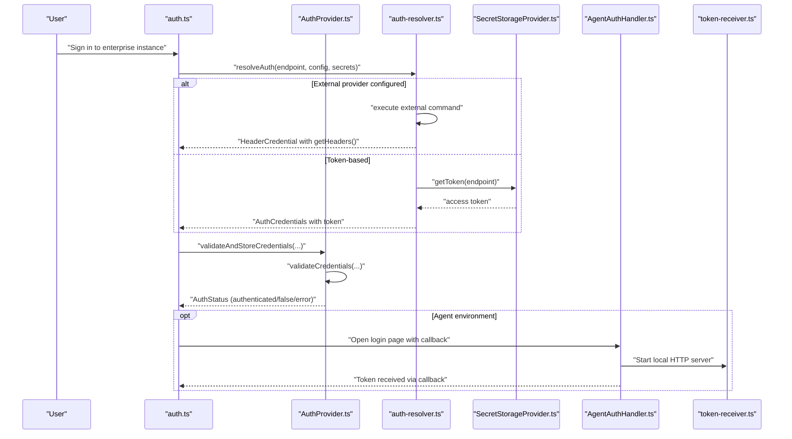
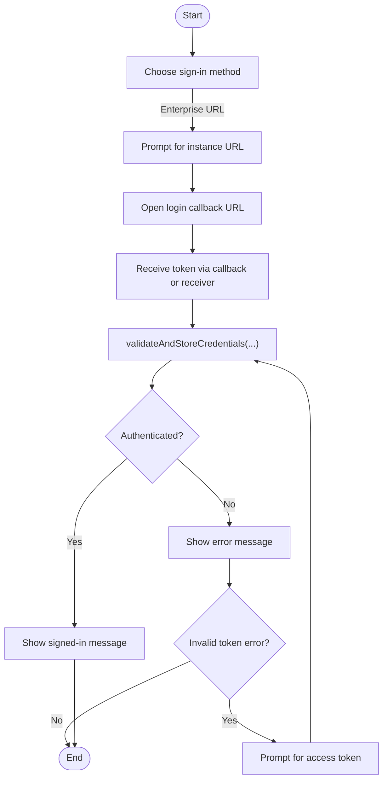
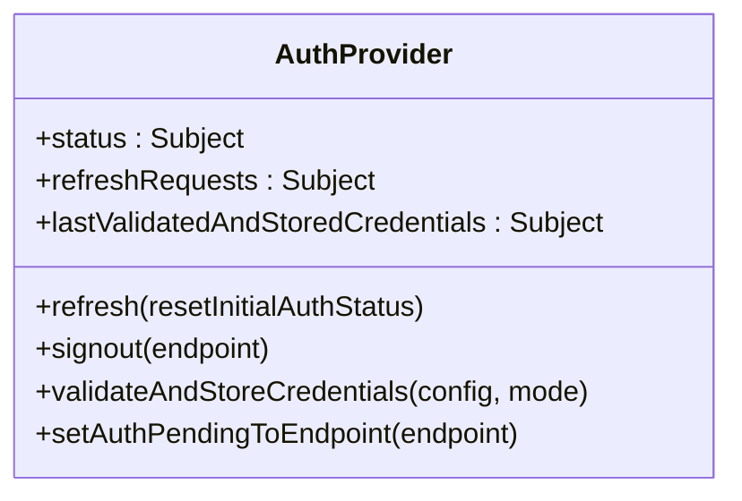
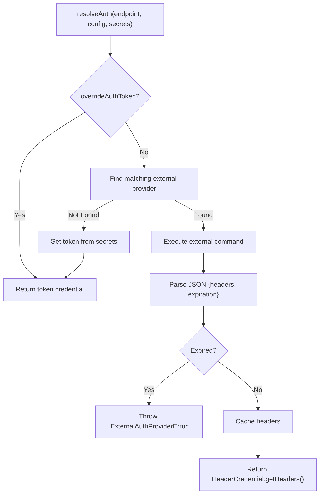
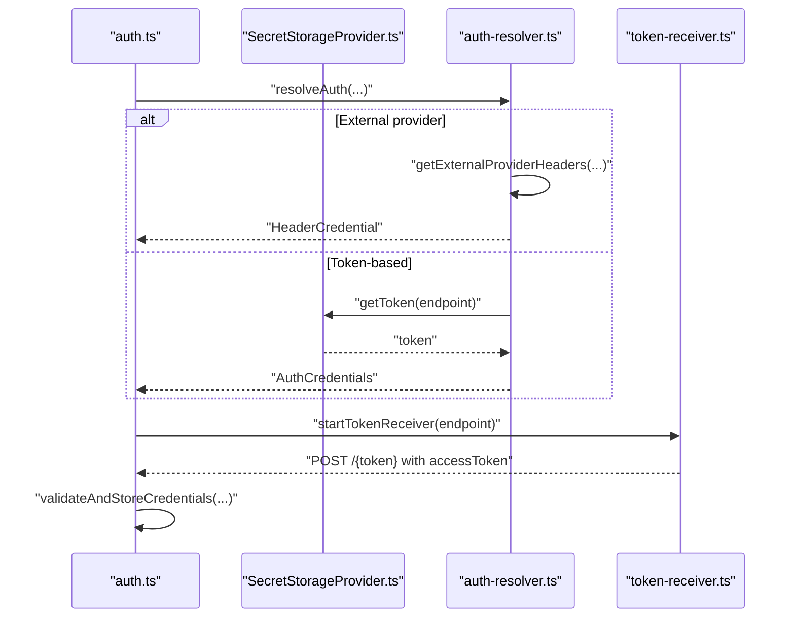
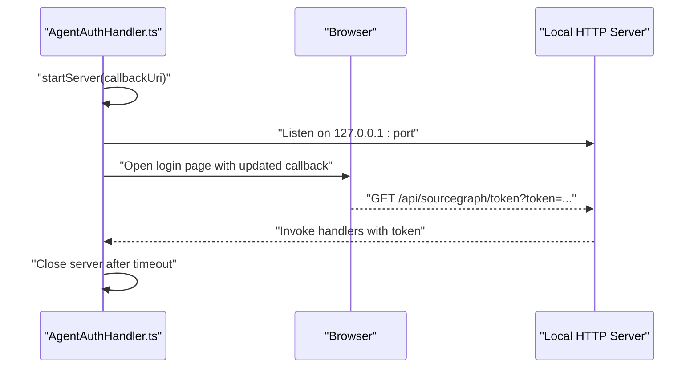
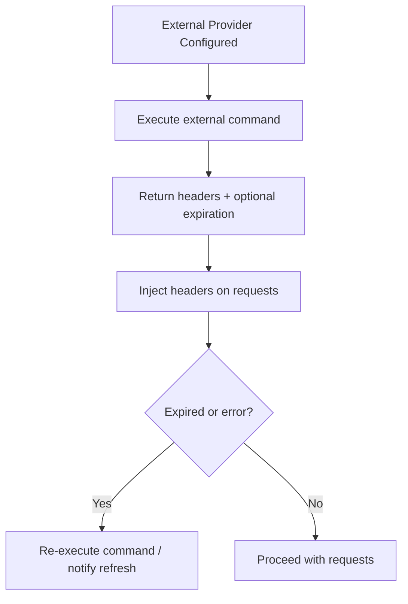
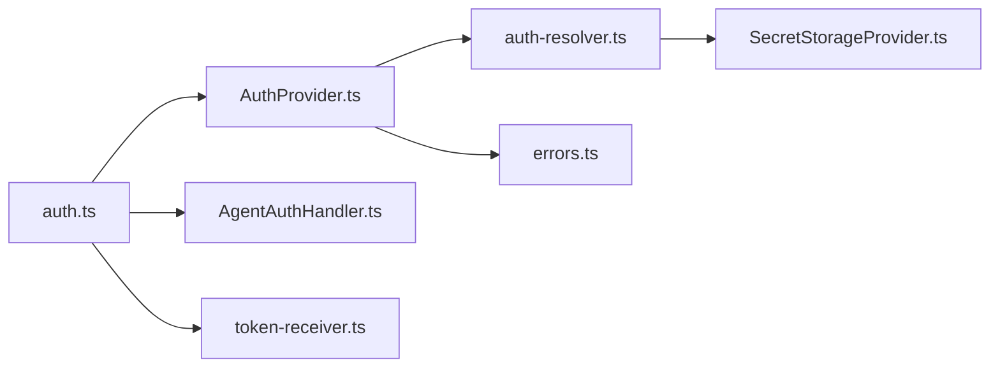

# Authentication Policies

<cite>
**Referenced Files in This Document**
- [auth.ts](file://vscode/src/auth/auth.ts)
- [auth-progress-indicator.ts](file://vscode/src/auth/auth-progress-indicator.ts)
- [user.ts](file://vscode/src/auth/user.ts)
- [account-menu.ts](file://vscode/src/auth/account-menu.ts)
- [AuthProvider.ts](file://vscode/src/services/AuthProvider.ts)
- [AuthProviderSimplified.ts](file://vscode/src/services/AuthProviderSimplified.ts)
- [SecretStorageProvider.ts](file://vscode/src/services/SecretStorageProvider.ts)
- [auth-resolver.ts](file://lib/shared/src/configuration/auth-resolver.ts)
- [AgentAuthHandler.ts](file://agent/src/AgentAuthHandler.ts)
- [token-receiver.ts](file://vscode/src/auth/token-receiver.ts)
- [errors.ts](file://lib/shared/src/sourcegraph-api/errors.ts)
- [client.test.ts](file://lib/shared/src/sourcegraph-api/graphql/client.test.ts)
- [auth.test.ts](file://vscode/src/auth/auth.test.ts)
</cite>

## Table of Contents
1. [Introduction](#introduction)
2. [Project Structure](#project-structure)
3. [Core Components](#core-components)
4. [Architecture Overview](#architecture-overview)
5. [Detailed Component Analysis](#detailed-component-analysis)
6. [Dependency Analysis](#dependency-analysis)
7. [Performance Considerations](#performance-considerations)
8. [Troubleshooting Guide](#troubleshooting-guide)
9. [Conclusion](#conclusion)
10. [Appendices](#appendices)

## Introduction
This document describes enterprise authentication policies and provider configurations in Cody. It explains how external authentication providers are integrated, how tokens and headers are managed, and how authentication flows are customized for enterprise environments. It covers OAuth-like redirection flows, custom header injection for enterprise identity providers, token storage and transmission security, and troubleshooting steps for common authentication issues.

## Project Structure
Authentication spans several modules:
- UI and flows: sign-in/sign-out, progress indicators, account menu
- Providers: token-based and external header-based authentication
- Secrets: secure token storage and retrieval
- Agent integration: local HTTP server for token callbacks
- Shared configuration: resolution of authentication credentials

**Diagram sources**
- [auth.ts:1-603](file://vscode/src/auth/auth.ts#L1-L603)
- [AuthProvider.ts:1-380](file://vscode/src/services/AuthProvider.ts#L1-L380)
- [AuthProviderSimplified.ts:1-50](file://vscode/src/services/AuthProviderSimplified.ts#L1-L50)
- [SecretStorageProvider.ts:1-256](file://vscode/src/services/SecretStorageProvider.ts#L1-L256)
- [AgentAuthHandler.ts:1-171](file://agent/src/AgentAuthHandler.ts#L1-L171)
- [token-receiver.ts:1-82](file://vscode/src/auth/token-receiver.ts#L1-L82)
- [auth-resolver.ts:1-160](file://lib/shared/src/configuration/auth-resolver.ts#L1-L160)
- [errors.ts:171-229](file://lib/shared/src/sourcegraph-api/errors.ts#L171-L229)

**Section sources**
- [auth.ts:1-603](file://vscode/src/auth/auth.ts#L1-L603)
- [AuthProvider.ts:1-380](file://vscode/src/services/AuthProvider.ts#L1-L380)
- [auth-resolver.ts:1-160](file://lib/shared/src/configuration/auth-resolver.ts#L1-L160)

## Core Components
- Authentication UI and flows:
  - Sign-in menu, URL and token input boxes, callback handling, sign-out, and account menu.
- Authentication provider:
  - Centralized state machine that validates credentials, refreshes automatically, emits telemetry, and updates context.
- External authentication provider:
  - Executes an external command to produce headers with optional expiration; caches and refreshes headers.
- Secret storage:
  - Secure token storage with optional local fallback; exposes token source and change notifications.
- Agent authentication handler:
  - Starts a local HTTP server to receive token callbacks and opens the browser login page.
- Token receiver:
  - Alternative mechanism to receive tokens via a localhost POST endpoint.

**Section sources**
- [auth.ts:81-146](file://vscode/src/auth/auth.ts#L81-L146)
- [auth.ts:284-310](file://vscode/src/auth/auth.ts#L284-L310)
- [AuthProvider.ts:45-206](file://vscode/src/services/AuthProvider.ts#L45-L206)
- [auth-resolver.ts:51-127](file://lib/shared/src/configuration/auth-resolver.ts#L51-L127)
- [SecretStorageProvider.ts:26-133](file://vscode/src/services/SecretStorageProvider.ts#L26-L133)
- [AgentAuthHandler.ts:17-99](file://agent/src/AgentAuthHandler.ts#L17-L99)
- [token-receiver.ts:15-81](file://vscode/src/auth/token-receiver.ts#L15-L81)

## Architecture Overview
The authentication architecture supports:
- Enterprise token-based authentication
- External header-based authentication (enterprise identity providers)
- Browser-based OAuth-like flows with local callback handling
- Agent-side token callback handling via a local HTTP server
- Token posting via a localhost endpoint for environments without redirects

**Diagram sources**
- [auth.ts:61-77](file://vscode/src/auth/auth.ts#L61-L77)
- [auth.ts:336-378](file://vscode/src/auth/auth.ts#L336-L378)
- [auth-resolver.ts:129-159](file://lib/shared/src/configuration/auth-resolver.ts#L129-L159)
- [AuthProvider.ts:248-280](file://vscode/src/services/AuthProvider.ts#L248-L280)
- [AgentAuthHandler.ts:38-99](file://agent/src/AgentAuthHandler.ts#L38-L99)
- [token-receiver.ts:15-81](file://vscode/src/auth/token-receiver.ts#L15-L81)

## Detailed Component Analysis

### Authentication UI and Flows
- Enterprise sign-in flow:
  - Prompts for instance URL, opens login callback URL, validates and stores credentials, and shows success/failure messages.
- OAuth-like redirects:
  - Simplified provider redirects (GitHub, GitLab, Google) to Sourcegraph’s OIDC login page, then back with a token.
- Token input fallback:
  - If token validation fails due to invalid access token, prompts for a token paste.
- Sign-out:
  - Deletes tokens from secret storage and resets auth state.

**Diagram sources**
- [auth.ts:81-146](file://vscode/src/auth/auth.ts#L81-L146)
- [auth.ts:262-281](file://vscode/src/auth/auth.ts#L262-L281)
- [auth.ts:336-378](file://vscode/src/auth/auth.ts#L336-L378)
- [auth.test.ts:37-95](file://vscode/src/auth/auth.test.ts#L37-L95)

**Section sources**
- [auth.ts:81-146](file://vscode/src/auth/auth.ts#L81-L146)
- [auth.ts:262-281](file://vscode/src/auth/auth.ts#L262-L281)
- [auth.ts:336-378](file://vscode/src/auth/auth.ts#L336-L378)
- [auth.test.ts:37-95](file://vscode/src/auth/auth.test.ts#L37-L95)

### Authentication Provider
- Responsibilities:
  - Validate credentials against the configured endpoint.
  - Refresh auth status automatically on configuration changes and periodic intervals.
  - Emit telemetry and update VS Code context variables.
  - Serialize uninstaller snapshot on successful auth.
- Error handling:
  - Emits appropriate errors for availability/network issues, invalid tokens, and external provider failures.
  - Supports periodic retries when a challenge is required (e.g., MFA).

**Diagram sources**
- [AuthProvider.ts:45-206](file://vscode/src/services/AuthProvider.ts#L45-L206)

**Section sources**
- [AuthProvider.ts:45-206](file://vscode/src/services/AuthProvider.ts#L45-L206)
- [AuthProvider.ts:148-170](file://vscode/src/services/AuthProvider.ts#L148-L170)

### External Authentication Provider (Custom Header Injection)
- External provider configuration:
  - Uses an executable command to produce JSON with headers and optional expiration.
  - Caches headers and refreshes when expired or on demand.
- Resolution:
  - If an external provider matches the endpoint, returns header credentials; otherwise falls back to token-based credentials from secret storage.

**Diagram sources**
- [auth-resolver.ts:129-159](file://lib/shared/src/configuration/auth-resolver.ts#L129-L159)
- [auth-resolver.ts:51-127](file://lib/shared/src/configuration/auth-resolver.ts#L51-L127)

**Section sources**
- [auth-resolver.ts:51-127](file://lib/shared/src/configuration/auth-resolver.ts#L51-L127)
- [auth-resolver.ts:129-159](file://lib/shared/src/configuration/auth-resolver.ts#L129-L159)

### Token Management and Storage
- Token storage:
  - Secure token storage with optional local file fallback.
  - Stores token and token source separately; notifies on changes.
- Token retrieval:
  - Retrieves token and source per endpoint; supports deletion and updates.
- Token posting receiver:
  - Provides a localhost POST endpoint to receive tokens directly, useful when redirects are unavailable.

**Diagram sources**
- [SecretStorageProvider.ts:89-118](file://vscode/src/services/SecretStorageProvider.ts#L89-L118)
- [auth-resolver.ts:74-90](file://lib/shared/src/configuration/auth-resolver.ts#L74-L90)
- [token-receiver.ts:15-81](file://vscode/src/auth/token-receiver.ts#L15-L81)

**Section sources**
- [SecretStorageProvider.ts:89-118](file://vscode/src/services/SecretStorageProvider.ts#L89-L118)
- [token-receiver.ts:15-81](file://vscode/src/auth/token-receiver.ts#L15-L81)

### Agent Authentication Handler
- Purpose:
  - Starts a local HTTP server on loopback interface to receive token callbacks.
  - Updates callback URI with a unique port and opens the browser login page.
  - Automatically closes server after a timeout to prevent lingering listeners.

**Diagram sources**
- [AgentAuthHandler.ts:38-99](file://agent/src/AgentAuthHandler.ts#L38-L99)
- [AgentAuthHandler.ts:118-142](file://agent/src/AgentAuthHandler.ts#L118-L142)

**Section sources**
- [AgentAuthHandler.ts:38-99](file://agent/src/AgentAuthHandler.ts#L38-L99)
- [AgentAuthHandler.ts:118-142](file://agent/src/AgentAuthHandler.ts#L118-L142)

### Authentication Flow Customization and Enterprise Identity Provider Integration
- Custom headers:
  - External provider headers are injected into requests; expiration is enforced and cached.
- Enterprise SSO/OAuth:
  - Simplified provider redirects support GitHub, GitLab, and Google via Sourcegraph’s OIDC login pages.
- Multi-factor authentication:
  - When a challenge is required, the system retries periodically until the user completes the challenge.

**Diagram sources**
- [auth-resolver.ts:92-127](file://lib/shared/src/configuration/auth-resolver.ts#L92-L127)
- [AuthProviderSimplified.ts:24-49](file://vscode/src/services/AuthProviderSimplified.ts#L24-L49)
- [AuthProvider.ts:148-170](file://vscode/src/services/AuthProvider.ts#L148-L170)

**Section sources**
- [auth-resolver.ts:92-127](file://lib/shared/src/configuration/auth-resolver.ts#L92-L127)
- [AuthProviderSimplified.ts:24-49](file://vscode/src/services/AuthProviderSimplified.ts#L24-L49)
- [AuthProvider.ts:148-170](file://vscode/src/services/AuthProvider.ts#L148-L170)

## Dependency Analysis
- UI depends on provider and resolver for authentication decisions.
- Provider depends on resolver and secret storage for credentials.
- External provider relies on OS command execution and caching.
- Agent handler and token receiver provide alternative callback mechanisms.

**Diagram sources**
- [auth.ts:1-603](file://vscode/src/auth/auth.ts#L1-L603)
- [AuthProvider.ts:1-380](file://vscode/src/services/AuthProvider.ts#L1-L380)
- [auth-resolver.ts:1-160](file://lib/shared/src/configuration/auth-resolver.ts#L1-L160)
- [SecretStorageProvider.ts:1-256](file://vscode/src/services/SecretStorageProvider.ts#L1-L256)
- [AgentAuthHandler.ts:1-171](file://agent/src/AgentAuthHandler.ts#L1-L171)
- [token-receiver.ts:1-82](file://vscode/src/auth/token-receiver.ts#L1-L82)
- [errors.ts:171-229](file://lib/shared/src/sourcegraph-api/errors.ts#L171-L229)

**Section sources**
- [auth.ts:1-603](file://vscode/src/auth/auth.ts#L1-L603)
- [AuthProvider.ts:1-380](file://vscode/src/services/AuthProvider.ts#L1-L380)
- [auth-resolver.ts:1-160](file://lib/shared/src/configuration/auth-resolver.ts#L1-L160)

## Performance Considerations
- Header caching:
  - External provider headers are cached and refreshed only when expired, reducing repeated command executions.
- Periodic refresh:
  - Provider retries authentication periodically when a challenge is required, minimizing long-lived failures.
- Local server timeouts:
  - Agent callback servers close automatically after a timeout to prevent resource leaks.

[No sources needed since this section provides general guidance]

## Troubleshooting Guide
Common issues and resolutions:
- Invalid access token:
  - The system detects invalid tokens and prompts for a new token. Ensure the token belongs to the target endpoint.
- Network or availability errors:
  - Transient network issues trigger availability errors; the provider retries periodically.
- External provider failures:
  - Execution errors or malformed output lead to external provider errors; verify the external command and its output format.
- Needs auth challenge:
  - When a challenge is required (e.g., MFA), the system retries at short intervals until the user completes the challenge.
- Token expiration handling:
  - External provider headers with past expiration are rejected; ensure the provider returns future expirations.
- Fallback mechanisms:
  - If redirects are unavailable (e.g., VS Code Web), use the token posting receiver or paste a token manually.

**Section sources**
- [auth.ts:458-569](file://vscode/src/auth/auth.ts#L458-L569)
- [auth.test.ts:37-95](file://vscode/src/auth/auth.test.ts#L37-L95)
- [client.test.ts:37-54](file://lib/shared/src/sourcegraph-api/graphql/client.test.ts#L37-L54)
- [errors.ts:171-229](file://lib/shared/src/sourcegraph-api/errors.ts#L171-L229)
- [auth-resolver.ts:64-69](file://lib/shared/src/configuration/auth-resolver.ts#L64-L69)

## Conclusion
Cody’s authentication system supports enterprise-grade scenarios through:
- Token-based authentication with secure storage
- External header-based authentication for enterprise identity providers
- Browser-based OAuth-like flows with robust callback handling
- Agent-side token callback servers and direct token posting receivers
- Clear error handling, periodic retries, and telemetry for diagnostics

These capabilities enable flexible, secure, and resilient authentication across diverse enterprise environments.

## Appendices

### Security Considerations for Token Storage and Transmission
- Token storage:
  - Prefer secure secret storage; local file fallback is available but less secure.
  - Token source is stored separately to distinguish programmatically generated tokens.
- Transmission:
  - Use HTTPS endpoints and secure callback mechanisms.
  - Avoid exposing tokens in logs or URLs.
- Expiration enforcement:
  - External provider headers must not specify past expiration dates; the system rejects them.

**Section sources**
- [SecretStorageProvider.ts:89-118](file://vscode/src/services/SecretStorageProvider.ts#L89-L118)
- [auth-resolver.ts:64-69](file://lib/shared/src/configuration/auth-resolver.ts#L64-L69)