# Deployment Settings

<cite>
**Referenced Files in This Document**
- [Dockerfile](file://Dockerfile)
- [package.json](file://package.json)
- [vscode/package.json](file://vscode/package.json)
- [vscode/src/configuration-keys.ts](file://vscode/src/configuration-keys.ts)
- [vscode/src/configuration.ts](file://vscode/src/configuration.ts)
- [lib/shared/src/configuration/environment.ts](file://lib/shared/src/configuration/environment.ts)
- [vscode/src/auth/auth.ts](file://vscode/src/auth/auth.ts)
- [lib/shared/src/sourcegraph-api/userProductSubscription.ts](file://lib/shared/src/sourcegraph-api/userProductSubscription.ts)
- [vscode/src/chat/chat-view/tools/MCPManager.ts](file://vscode/src/chat/chat-view/tools/MCPManager.ts)
- [vscode/webviews/components/mcp/views/AddServerForm.tsx](file://vscode/webviews/components/mcp/views/AddServerForm.tsx)
- [agent/src/cli/command-auth/secrets.ts](file://agent/src/cli/command-auth/secrets.ts)
- [agent/scripts/compile-bindings-if-diff.sh](file://agent/scripts/compile-bindings-if-diff.sh)
- [vscode/src/services/telemetry-v2.test.ts](file://vscode/src/services/telemetry-v2.test.ts)
- [lib/shared/src/telemetry-v2/TelemetryRecorderProvider.ts](file://lib/shared/src/telemetry-v2/TelemetryRecorderProvider.ts)
- [vscode/src/agent.ts](file://vscode/src/agent.ts)
</cite>

## Table of Contents
1. [Introduction](#introduction)
2. [Project Structure](#project-structure)
3. [Core Components](#core-components)
4. [Architecture Overview](#architecture-overview)
5. [Detailed Component Analysis](#detailed-component-analysis)
6. [Dependency Analysis](#dependency-analysis)
7. [Performance Considerations](#performance-considerations)
8. [Troubleshooting Guide](#troubleshooting-guide)
9. [Conclusion](#conclusion)
10. [Appendices](#appendices)

## Introduction
This document describes enterprise deployment configuration and environment-specific settings for Cody. It covers multi-environment configuration management (development, staging, production), environment variable usage, configuration inheritance and overrides, containerized deployment, Kubernetes and cloud platform integration patterns, self-hosted and hybrid cloud deployments, and observability and monitoring configuration. Guidance is grounded in the repository’s configuration APIs, environment variable handling, and deployment artifacts.

## Project Structure
Cody comprises multiple packages and deployment targets:
- A Node-based CLI agent packaged as a Docker image
- A VS Code extension with extensive configuration and telemetry
- Shared libraries for configuration and telemetry
- Webviews and MCP tooling for advanced integrations

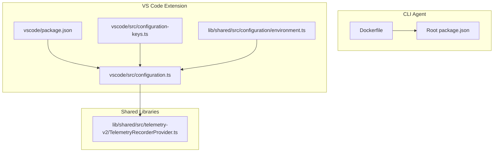

**Diagram sources**
- [Dockerfile:1-46](file://Dockerfile#L1-L46)
- [package.json:1-99](file://package.json#L1-L99)
- [vscode/package.json:1-800](file://vscode/package.json#L1-L800)
- [vscode/src/configuration.ts:1-233](file://vscode/src/configuration.ts#L1-L233)
- [vscode/src/configuration-keys.ts:1-55](file://vscode/src/configuration-keys.ts#L1-L55)
- [lib/shared/src/configuration/environment.ts:1-141](file://lib/shared/src/configuration/environment.ts#L1-L141)
- [lib/shared/src/telemetry-v2/TelemetryRecorderProvider.ts:111-207](file://lib/shared/src/telemetry-v2/TelemetryRecorderProvider.ts#L111-L207)

**Section sources**
- [Dockerfile:1-46](file://Dockerfile#L1-L46)
- [package.json:1-99](file://package.json#L1-L99)
- [vscode/package.json:1-800](file://vscode/package.json#L1-L800)

## Core Components
- Configuration resolution pipeline: configuration keys are derived from the extension manifest and resolved into a typed client configuration, including hidden/internal settings and environment variable-backed overrides.
- Environment variable handling: a dedicated environment accessor centralizes reading and normalizing environment variables with fallbacks and defaults.
- Enterprise detection and subscription metadata: utilities to determine enterprise vs. dotcom contexts and attach subscription metadata to telemetry.
- Telemetry providers and processors: configurable telemetry recorder providers and processors that attach metadata (including tier) to events.
- Containerized CLI agent: a multi-stage Dockerfile that builds and runs the agent in a minimal Alpine runtime.

**Section sources**
- [vscode/src/configuration-keys.ts:1-55](file://vscode/src/configuration-keys.ts#L1-L55)
- [vscode/src/configuration.ts:1-233](file://vscode/src/configuration.ts#L1-L233)
- [lib/shared/src/configuration/environment.ts:1-141](file://lib/shared/src/configuration/environment.ts#L1-L141)
- [lib/shared/src/sourcegraph-api/userProductSubscription.ts:89-104](file://lib/shared/src/sourcegraph-api/userProductSubscription.ts#L89-L104)
- [lib/shared/src/telemetry-v2/TelemetryRecorderProvider.ts:111-207](file://lib/shared/src/telemetry-v2/TelemetryRecorderProvider.ts#L111-L207)
- [Dockerfile:1-46](file://Dockerfile#L1-L46)

## Architecture Overview
The configuration and deployment architecture integrates environment variables, VS Code configuration, and telemetry providers to support enterprise environments and multi-region deployments.

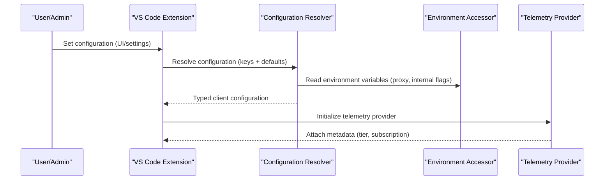

**Diagram sources**
- [vscode/src/configuration.ts:25-204](file://vscode/src/configuration.ts#L25-L204)
- [lib/shared/src/configuration/environment.ts:22-122](file://lib/shared/src/configuration/environment.ts#L22-L122)
- [lib/shared/src/telemetry-v2/TelemetryRecorderProvider.ts:182-207](file://lib/shared/src/telemetry-v2/TelemetryRecorderProvider.ts#L182-L207)

## Detailed Component Analysis

### Multi-Environment Configuration Management
- Configuration keys are derived from the extension manifest and exposed via a strongly typed key map. This enables consistent configuration across environments while allowing per-environment overrides.
- The resolver applies sanitization and defaulting, and supports hidden/internal settings that can be toggled via environment variables or explicit overrides.
- Enterprise detection is based on authentication status and endpoint, enabling environment-aware behavior and telemetry metadata.

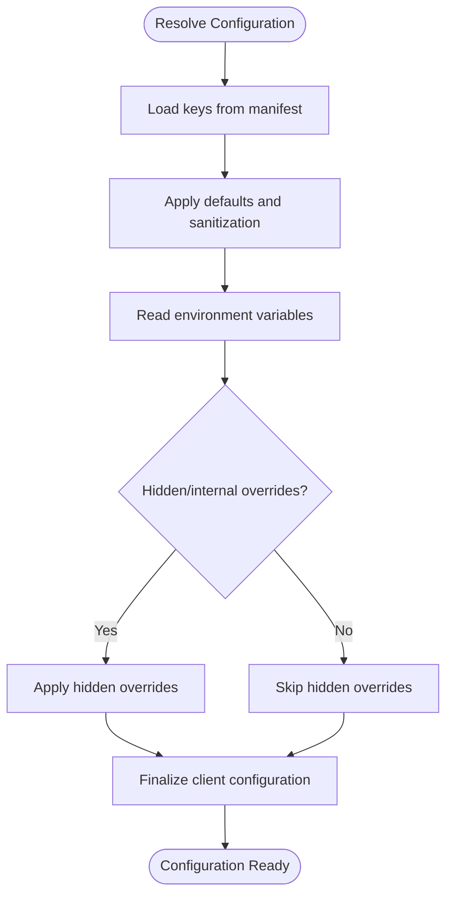

**Diagram sources**
- [vscode/src/configuration-keys.ts:18-55](file://vscode/src/configuration-keys.ts#L18-L55)
- [vscode/src/configuration.ts:25-204](file://vscode/src/configuration.ts#L25-L204)
- [lib/shared/src/configuration/environment.ts:22-122](file://lib/shared/src/configuration/environment.ts#L22-L122)

**Section sources**
- [vscode/src/configuration-keys.ts:1-55](file://vscode/src/configuration-keys.ts#L1-L55)
- [vscode/src/configuration.ts:1-233](file://vscode/src/configuration.ts#L1-L233)
- [lib/shared/src/sourcegraph-api/userProductSubscription.ts:89-104](file://lib/shared/src/sourcegraph-api/userProductSubscription.ts#L89-L104)

### Environment Variable Configuration
- Environment variables are accessed through a centralized accessor that normalizes values and provides fallbacks. Examples include proxy configuration and internal feature flags.
- The CLI agent reads environment variables to configure runtime behavior and secure storage operations.

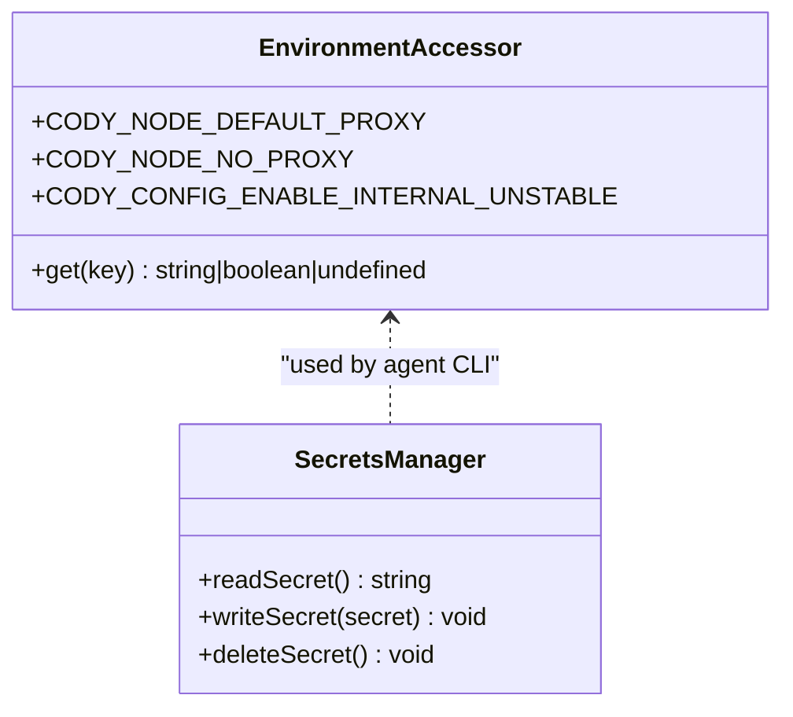

**Diagram sources**
- [lib/shared/src/configuration/environment.ts:22-122](file://lib/shared/src/configuration/environment.ts#L22-L122)
- [agent/src/cli/command-auth/secrets.ts:126-282](file://agent/src/cli/command-auth/secrets.ts#L126-L282)

**Section sources**
- [lib/shared/src/configuration/environment.ts:1-141](file://lib/shared/src/configuration/environment.ts#L1-L141)
- [agent/src/cli/command-auth/secrets.ts:126-282](file://agent/src/cli/command-auth/secrets.ts#L126-L282)

### Configuration Inheritance and Overrides
- Configuration resolution merges VS Code settings with environment-backed values and hidden overrides. Overrides take precedence over other configuration sources.
- The resolver also handles backward compatibility and normalization (for example, codebase sanitization).

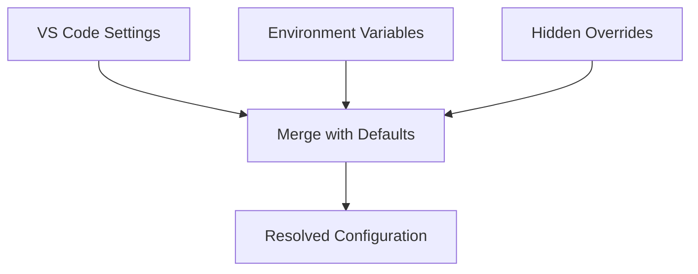

**Diagram sources**
- [vscode/src/configuration.ts:25-204](file://vscode/src/configuration.ts#L25-L204)

**Section sources**
- [vscode/src/configuration.ts:1-233](file://vscode/src/configuration.ts#L1-L233)

### Containerized Deployment Settings
- The CLI agent is packaged using a multi-stage Dockerfile that installs Node.js and runtime dependencies, copies the built agent, and exposes a wrapper script to run the agent.
- The image targets a minimal Alpine runtime and includes necessary libraries for secure credential storage.

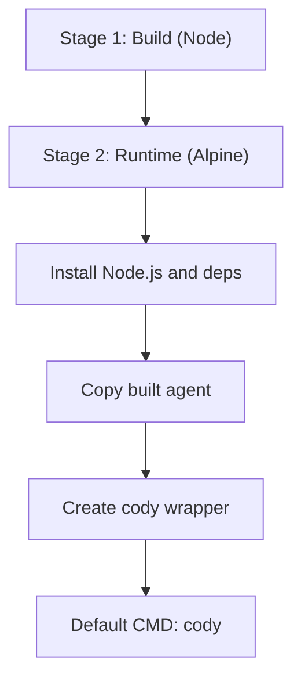

**Diagram sources**
- [Dockerfile:12-46](file://Dockerfile#L12-L46)

**Section sources**
- [Dockerfile:1-46](file://Dockerfile#L1-L46)

### Kubernetes and Cloud Platform Integration
- The repository does not include Kubernetes manifests or cloud platform-specific configuration files. Enterprise deployments typically integrate the CLI agent container with orchestration platforms and secure secret management systems. Use the Docker image produced by the included Dockerfile as the base for containerized deployments and apply platform-specific configuration via environment variables and secrets management.

[No sources needed since this section provides general guidance]

### Self-Hosted and Hybrid Cloud Deployments
- Enterprise endpoints are supported by resolving authentication against a configured endpoint and validating credentials. Subscription metadata can be used to tailor behavior and telemetry.
- MCP (Model Context Protocol) server configuration supports adding, updating, and deleting servers, enabling hybrid cloud and edge deployments where local tools are registered alongside enterprise endpoints.

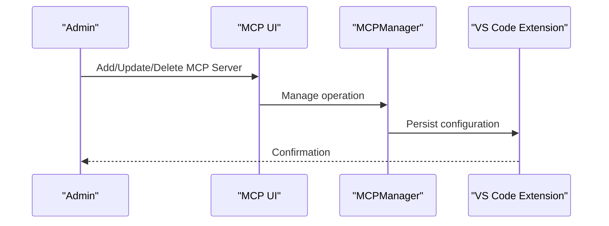

**Diagram sources**
- [vscode/webviews/components/mcp/views/AddServerForm.tsx:43-78](file://vscode/webviews/components/mcp/views/AddServerForm.tsx#L43-L78)
- [vscode/src/chat/chat-view/tools/MCPManager.ts:424-578](file://vscode/src/chat/chat-view/tools/MCPManager.ts#L424-L578)

**Section sources**
- [vscode/src/auth/auth.ts:61-65](file://vscode/src/auth/auth.ts#L61-L65)
- [lib/shared/src/sourcegraph-api/userProductSubscription.ts:89-104](file://lib/shared/src/sourcegraph-api/userProductSubscription.ts#L89-L104)
- [vscode/webviews/components/mcp/views/AddServerForm.tsx:43-78](file://vscode/webviews/components/mcp/views/AddServerForm.tsx#L43-L78)
- [vscode/src/chat/chat-view/tools/MCPManager.ts:424-578](file://vscode/src/chat/chat-view/tools/MCPManager.ts#L424-L578)

### Configuration Validation and Rollback Procedures
- Configuration validation occurs during resolution and parsing of regex filters and nested keys. Errors are surfaced to the user with fallbacks (for example, default regex).
- Rollback procedures for configuration changes are typically managed by the IDE or platform (for example, reverting settings). For agent-side configuration, environment variables and hidden overrides can be temporarily adjusted to mitigate issues.

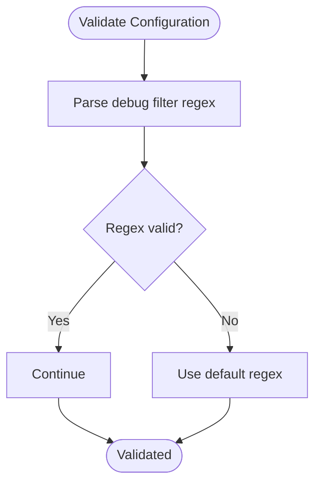

**Diagram sources**
- [vscode/src/configuration.ts:32-48](file://vscode/src/configuration.ts#L32-L48)

**Section sources**
- [vscode/src/configuration.ts:25-233](file://vscode/src/configuration.ts#L25-L233)

### Deployment Automation
- The repository includes a script to compile Kotlin bindings when differences are detected in the agent bindings, supporting automated rebuilds in CI/CD pipelines.
- Root scripts demonstrate patterns for building, testing, and releasing across workspaces, which can be adapted for deployment automation.

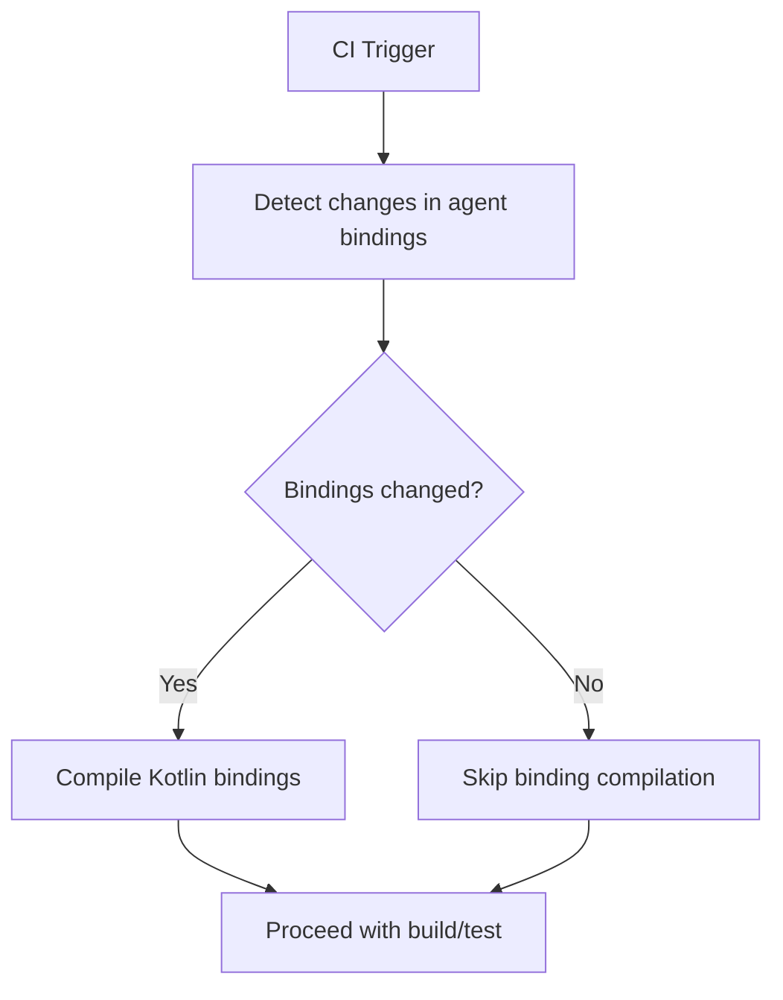

**Diagram sources**
- [agent/scripts/compile-bindings-if-diff.sh:1-8](file://agent/scripts/compile-bindings-if-diff.sh#L1-L8)

**Section sources**
- [agent/scripts/compile-bindings-if-diff.sh:1-8](file://agent/scripts/compile-bindings-if-diff.sh#L1-L8)
- [package.json:18-38](file://package.json#L18-L38)

### Monitoring and Observability Configuration
- Telemetry providers attach metadata (including tier) to events and support exporting events for testing and debugging.
- The agent exposes authenticated endpoints for exporting telemetry events and request errors, enabling observability in controlled environments.

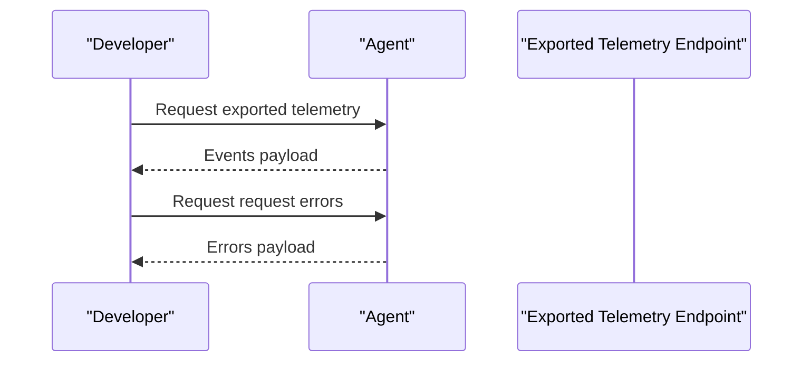

**Diagram sources**
- [lib/shared/src/telemetry-v2/TelemetryRecorderProvider.ts:111-135](file://lib/shared/src/telemetry-v2/TelemetryRecorderProvider.ts#L111-L135)
- [vscode/src/agent.ts:800-825](file://vscode/src/agent.ts#L800-L825)

**Section sources**
- [vscode/src/services/telemetry-v2.test.ts:119-161](file://vscode/src/services/telemetry-v2.test.ts#L119-L161)
- [lib/shared/src/telemetry-v2/TelemetryRecorderProvider.ts:182-207](file://lib/shared/src/telemetry-v2/TelemetryRecorderProvider.ts#L182-L207)
- [vscode/src/agent.ts:800-825](file://vscode/src/agent.ts#L800-L825)

## Dependency Analysis
- Configuration depends on the extension manifest for keys and environment variables for overrides.
- Telemetry depends on authentication status and subscription metadata to enrich events.
- The CLI agent depends on the Dockerfile for packaging and runtime libraries for secure credential storage.

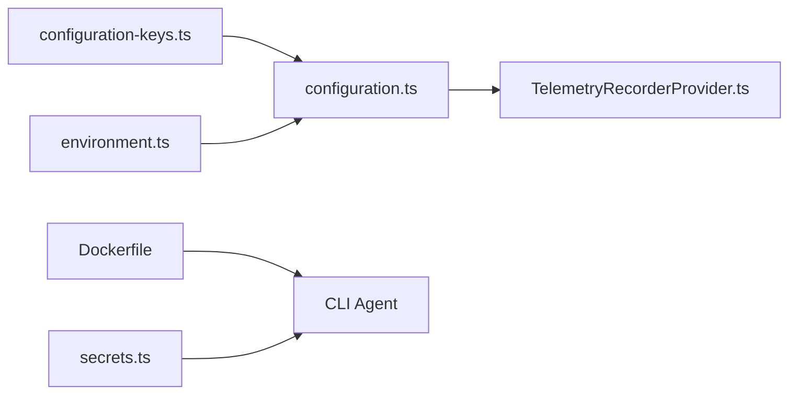

**Diagram sources**
- [vscode/src/configuration-keys.ts:1-55](file://vscode/src/configuration-keys.ts#L1-L55)
- [vscode/src/configuration.ts:1-233](file://vscode/src/configuration.ts#L1-L233)
- [lib/shared/src/configuration/environment.ts:1-141](file://lib/shared/src/configuration/environment.ts#L1-L141)
- [lib/shared/src/telemetry-v2/TelemetryRecorderProvider.ts:111-207](file://lib/shared/src/telemetry-v2/TelemetryRecorderProvider.ts#L111-L207)
- [Dockerfile:1-46](file://Dockerfile#L1-L46)
- [agent/src/cli/command-auth/secrets.ts:126-282](file://agent/src/cli/command-auth/secrets.ts#L126-L282)

**Section sources**
- [vscode/src/configuration.ts:1-233](file://vscode/src/configuration.ts#L1-L233)
- [lib/shared/src/telemetry-v2/TelemetryRecorderProvider.ts:111-207](file://lib/shared/src/telemetry-v2/TelemetryRecorderProvider.ts#L111-L207)
- [Dockerfile:1-46](file://Dockerfile#L1-L46)
- [agent/src/cli/command-auth/secrets.ts:126-282](file://agent/src/cli/command-auth/secrets.ts#L126-L282)

## Performance Considerations
- Prefer environment variables for settings that require minimal overhead and deep environment implications.
- Use hidden/internal overrides sparingly and only when necessary to avoid broad side effects.
- Leverage telemetry metadata to monitor performance and feature adoption across environments.

[No sources needed since this section provides general guidance]

## Troubleshooting Guide
- Proxy and network settings: verify proxy configuration and NO_PROXY behavior via environment variables.
- Authentication and enterprise endpoints: ensure the configured endpoint resolves and credentials are valid.
- Telemetry export: use the agent’s authenticated endpoints to export telemetry and request errors for debugging.
- Configuration parsing: if regex filters fail to parse, a default regex is applied; review configuration keys and values.

**Section sources**
- [lib/shared/src/configuration/environment.ts:22-122](file://lib/shared/src/configuration/environment.ts#L22-L122)
- [vscode/src/auth/auth.ts:61-65](file://vscode/src/auth/auth.ts#L61-L65)
- [vscode/src/agent.ts:800-825](file://vscode/src/agent.ts#L800-L825)
- [vscode/src/configuration.ts:32-48](file://vscode/src/configuration.ts#L32-L48)

## Conclusion
Cody’s configuration and deployment model emphasizes environment-driven settings, strong typing via manifest-derived keys, and telemetry enrichment for enterprise insights. The CLI agent is container-ready, and the VS Code extension provides robust configuration resolution and hidden overrides. For enterprise deployments, combine environment variables, secure secret management, and telemetry export to achieve reliable, observable, and scalable operations across development, staging, and production environments.

[No sources needed since this section summarizes without analyzing specific files]

## Appendices
- Example environment variables for enterprise deployments:
  - Proxy configuration and NO_PROXY handling
  - Internal/unstable feature flags
- Example CLI agent usage:
  - Build and run the agent container
  - Use wrapper script to invoke the agent

**Section sources**
- [lib/shared/src/configuration/environment.ts:22-122](file://lib/shared/src/configuration/environment.ts#L22-L122)
- [Dockerfile:1-46](file://Dockerfile#L1-L46)