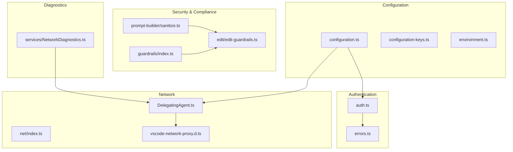
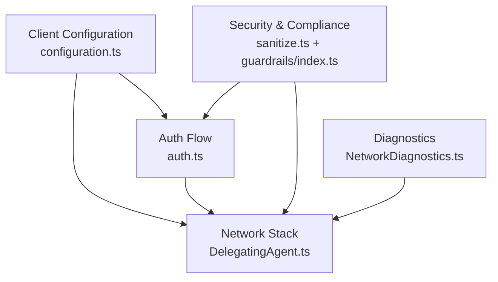
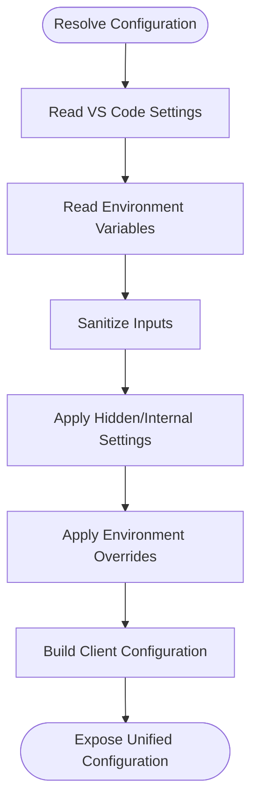
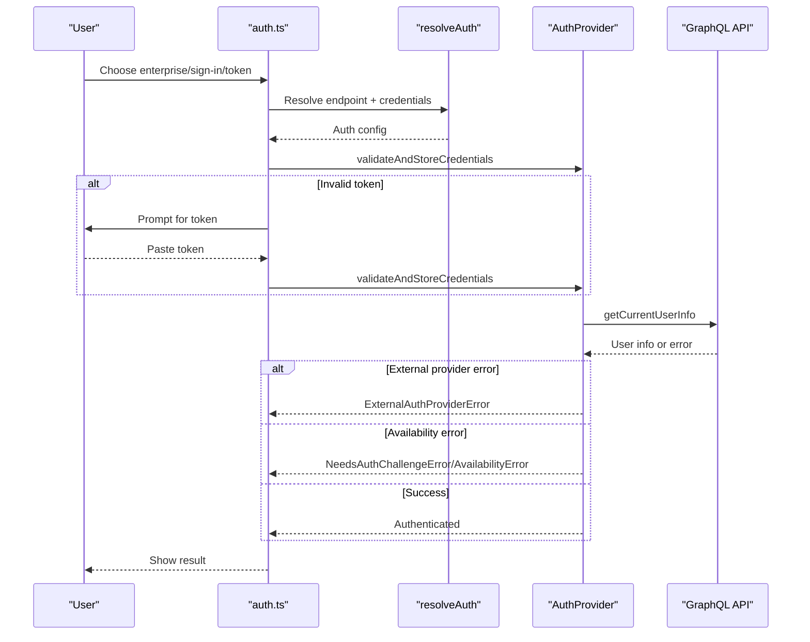
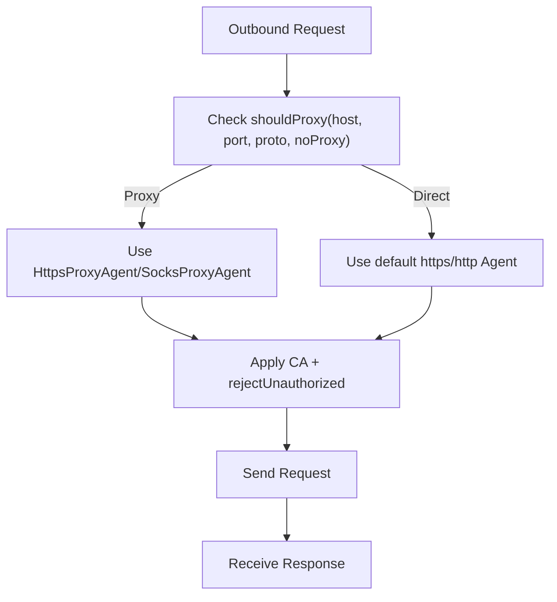
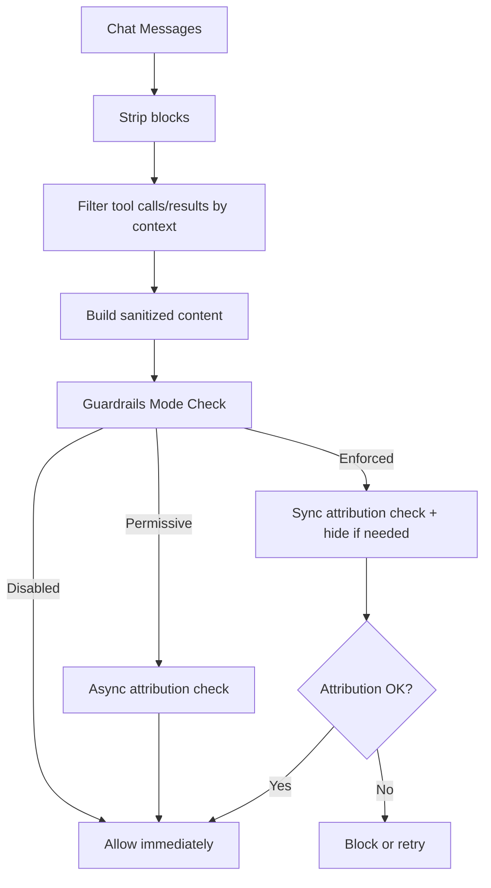
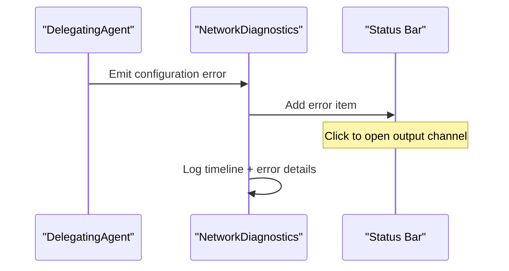
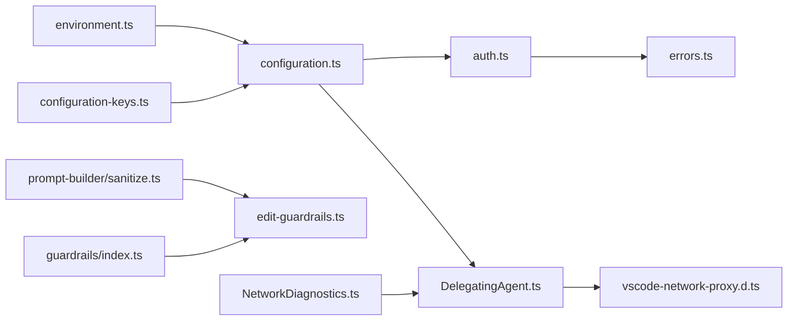

# Enterprise Policies

<cite>
**Referenced Files in This Document**
- [configuration.ts](file://vscode/src/configuration.ts)
- [configuration-keys.ts](file://vscode/src/configuration-keys.ts)
- [environment.ts](file://lib/shared/src/configuration/environment.ts)
- [auth.ts](file://vscode/src/auth/auth.ts)
- [DelegatingAgent.ts](file://vscode/src/net/DelegatingAgent.ts)
- [vscode-network-proxy.d.ts](file://vscode/src/net/vscode-network-proxy.d.ts)
- [index.ts](file://vscode/src/net/index.ts)
- [sanitize.ts](file://vscode/src/prompt-builder/sanitize.ts)
- [index.ts](file://lib/shared/src/guardrails/index.ts)
- [edit-guardrails.ts](file://vscode/src/edit/edit-guardrails.ts)
- [NetworkDiagnostics.ts](file://vscode/src/services/NetworkDiagnostics.ts)
- [errors.ts](file://lib/shared/src/sourcegraph-api/errors.ts)
- [DelegatingAgent.test.ts](file://vscode/src/net/DelegatingAgent.test.ts)
- [mitmProxy.ts](file://vscode/e2e/utils/vscody/fixture/mitmProxy.ts)
</cite>

## Table of Contents
1. [Introduction](#introduction)
2. [Project Structure](#project-structure)
3. [Core Components](#core-components)
4. [Architecture Overview](#architecture-overview)
5. [Detailed Component Analysis](#detailed-component-analysis)
6. [Dependency Analysis](#dependency-analysis)
7. [Performance Considerations](#performance-considerations)
8. [Troubleshooting Guide](#troubleshooting-guide)
9. [Conclusion](#conclusion)
10. [Appendices](#appendices)

## Introduction
This document describes enterprise configuration and policy management in the Cody platform. It covers server endpoint configuration, proxy settings, and network connectivity options including custom headers and certificate validation. It also documents enterprise authentication policies, external provider configurations, and SSO integration settings. Security policies are explained with a focus on codebase sanitization, guardrails configuration, and compliance requirements. Practical enterprise scenarios such as self-hosted deployments, corporate proxy configurations, and multi-tenant setups are included, along with configuration inheritance, policy enforcement, troubleshooting network connectivity issues, environment variable overrides, and deployment-specific configuration patterns.

## Project Structure
The enterprise policy surface spans several subsystems:
- Configuration resolution and sanitization
- Authentication and SSO integration
- Network stack with proxy and TLS customization
- Prompt sanitization and guardrails enforcement
- Diagnostics and error handling

**Diagram sources**
- [configuration.ts:1-233](file://vscode/src/configuration.ts#L1-L233)
- [configuration-keys.ts:1-55](file://vscode/src/configuration-keys.ts#L1-L55)
- [environment.ts:1-204](file://lib/shared/src/configuration/environment.ts#L1-L204)
- [auth.ts:1-603](file://vscode/src/auth/auth.ts#L1-L603)
- [errors.ts:171-229](file://lib/shared/src/sourcegraph-api/errors.ts#L171-L229)
- [index.ts:1-3](file://vscode/src/net/index.ts#L1-L3)
- [DelegatingAgent.ts:166-523](file://vscode/src/net/DelegatingAgent.ts#L166-L523)
- [vscode-network-proxy.d.ts:1-124](file://vscode/src/net/vscode-network-proxy.d.ts#L1-L124)
- [sanitize.ts:1-137](file://vscode/src/prompt-builder/sanitize.ts#L1-L137)
- [index.ts:1-208](file://lib/shared/src/guardrails/index.ts#L1-L208)
- [edit-guardrails.ts:1-142](file://vscode/src/edit/edit-guardrails.ts#L1-L142)
- [NetworkDiagnostics.ts:251-339](file://vscode/src/services/NetworkDiagnostics.ts#L251-L339)

**Section sources**
- [configuration.ts:1-233](file://vscode/src/configuration.ts#L1-L233)
- [auth.ts:1-603](file://vscode/src/auth/auth.ts#L1-L603)
- [DelegatingAgent.ts:166-523](file://vscode/src/net/DelegatingAgent.ts#L166-L523)
- [sanitize.ts:1-137](file://vscode/src/prompt-builder/sanitize.ts#L1-L137)
- [index.ts:1-208](file://lib/shared/src/guardrails/index.ts#L1-L208)
- [edit-guardrails.ts:1-142](file://vscode/src/edit/edit-guardrails.ts#L1-L142)
- [NetworkDiagnostics.ts:251-339](file://vscode/src/services/NetworkDiagnostics.ts#L251-L339)

## Core Components
- Configuration resolution and sanitization
  - Reads user/workspace settings and environment variables, normalizes values, and exposes a unified client configuration object. Includes sanitization for codebase strings and supports hidden/internal/unstable settings.
- Authentication and SSO
  - Supports enterprise endpoints, token-based and browser-based flows, external provider errors, and availability checks. Integrates with VS Code’s URI handler for redirects and handles special cases like YubiKey challenges.
- Network stack and proxy
  - Centralizes HTTP/HTTPS/SOCKS proxies, NO_PROXY handling, certificate validation controls, and CA bundle composition. Exposes VS Code proxy integration types and telemetry hooks.
- Prompt sanitization and guardrails
  - Removes sensitive content from chat messages and enforces guardrails for attribution checks, with configurable modes (disabled, permissive, enforced).
- Diagnostics
  - Surfaces network configuration problems via status bar and logs, with structured timing and error reporting.

**Section sources**
- [configuration.ts:25-204](file://vscode/src/configuration.ts#L25-L204)
- [auth.ts:458-569](file://vscode/src/auth/auth.ts#L458-L569)
- [DelegatingAgent.ts:166-333](file://vscode/src/net/DelegatingAgent.ts#L166-L333)
- [sanitize.ts:9-110](file://vscode/src/prompt-builder/sanitize.ts#L9-L110)
- [index.ts:25-81](file://lib/shared/src/guardrails/index.ts#L25-L81)
- [NetworkDiagnostics.ts:251-339](file://vscode/src/services/NetworkDiagnostics.ts#L251-L339)

## Architecture Overview
The enterprise policy architecture integrates configuration, authentication, networking, and security into a cohesive system. Configuration drives authentication and network behavior. Authentication validates credentials against enterprise endpoints and external providers. Networking applies proxy and TLS policies consistently across outbound requests. Security components enforce codebase sanitization and guardrails checks.

**Diagram sources**
- [configuration.ts:25-204](file://vscode/src/configuration.ts#L25-L204)
- [auth.ts:458-569](file://vscode/src/auth/auth.ts#L458-L569)
- [DelegatingAgent.ts:166-333](file://vscode/src/net/DelegatingAgent.ts#L166-L333)
- [sanitize.ts:9-110](file://vscode/src/prompt-builder/sanitize.ts#L9-L110)
- [index.ts:25-81](file://lib/shared/src/guardrails/index.ts#L25-L81)
- [NetworkDiagnostics.ts:251-339](file://vscode/src/services/NetworkDiagnostics.ts#L251-L339)

## Detailed Component Analysis

### Configuration Resolution and Policy Inheritance
- Purpose
  - Consolidates user/workspace settings and environment variables into a single client configuration object. Applies sanitization and hidden/internal settings.
- Key behaviors
  - Reads and normalizes server endpoint, custom headers, codebase, and network settings.
  - Supports hidden settings for internal use and environment overrides.
  - Provides environment variable overrides for authentication and server endpoint.
- Enterprise relevance
  - Enables centralized policy inheritance from workspace settings while allowing environment overrides for deployment-specific behavior.

**Diagram sources**
- [configuration.ts:25-204](file://vscode/src/configuration.ts#L25-L204)
- [environment.ts:22-85](file://lib/shared/src/configuration/environment.ts#L22-L85)

**Section sources**
- [configuration.ts:25-204](file://vscode/src/configuration.ts#L25-L204)
- [configuration-keys.ts:18-52](file://vscode/src/configuration-keys.ts#L18-L52)
- [environment.ts:22-85](file://lib/shared/src/configuration/environment.ts#L22-L85)

### Authentication Policies and SSO Integration
- Purpose
  - Validates credentials against enterprise endpoints, supports external provider flows, and handles availability and token challenges.
- Key behaviors
  - Supports enterprise URL entry, token paste, and browser-based OAuth callbacks.
  - Handles external provider errors and availability errors distinctly.
  - Manages sign-out and cleans up tokens appropriately.
- Enterprise relevance
  - Enables SSO integration with enterprise identity providers and enforces endpoint-specific authentication policies.

**Diagram sources**
- [auth.ts:61-146](file://vscode/src/auth/auth.ts#L61-L146)
- [auth.ts:458-569](file://vscode/src/auth/auth.ts#L458-L569)
- [errors.ts:171-229](file://lib/shared/src/sourcegraph-api/errors.ts#L171-L229)

**Section sources**
- [auth.ts:61-146](file://vscode/src/auth/auth.ts#L61-L146)
- [auth.ts:458-569](file://vscode/src/auth/auth.ts#L458-L569)
- [errors.ts:171-229](file://lib/shared/src/sourcegraph-api/errors.ts#L171-L229)

### Network Connectivity, Proxies, and Certificate Validation
- Purpose
  - Centralizes proxy selection, NO_PROXY rules, and TLS verification controls. Composes CA certificates and supports SOCKS and HTTP(S) proxies.
- Key behaviors
  - Determines proxy vs direct connections based on URL and NO_PROXY.
  - Builds a combined CA certificate list from system roots, global agent, and additional certs.
  - Respects environment variables for proxy and TLS behavior.
- Enterprise relevance
  - Supports corporate proxy environments, split-tunneling via NO_PROXY, and custom CA trust stores.

**Diagram sources**
- [DelegatingAgent.ts:166-333](file://vscode/src/net/DelegatingAgent.ts#L166-L333)
- [DelegatingAgent.ts:507-523](file://vscode/src/net/DelegatingAgent.ts#L507-L523)
- [environment.ts:27-38](file://lib/shared/src/configuration/environment.ts#L27-L38)

**Section sources**
- [DelegatingAgent.ts:166-333](file://vscode/src/net/DelegatingAgent.ts#L166-L333)
- [DelegatingAgent.ts:507-523](file://vscode/src/net/DelegatingAgent.ts#L507-L523)
- [environment.ts:27-38](file://lib/shared/src/configuration/environment.ts#L27-L38)
- [vscode-network-proxy.d.ts:55-98](file://vscode/src/net/vscode-network-proxy.d.ts#L55-L98)
- [DelegatingAgent.test.ts:86-143](file://vscode/src/net/DelegatingAgent.test.ts#L86-L143)

### Codebase Sanitization and Prompt Security
- Purpose
  - Removes potentially sensitive content from chat messages and enforces guardrails checks for attribution.
- Key behaviors
  - Strips content between specific tags and filters tool calls/results based on conversational context.
  - Guardrails modes: disabled, permissive, enforced; determines whether to hide code until attribution completes.
- Enterprise relevance
  - Ensures compliance with data handling policies by sanitizing prompts and enforcing attribution checks.

**Diagram sources**
- [sanitize.ts:9-110](file://vscode/src/prompt-builder/sanitize.ts#L9-L110)
- [index.ts:25-81](file://lib/shared/src/guardrails/index.ts#L25-L81)
- [edit-guardrails.ts:49-140](file://vscode/src/edit/edit-guardrails.ts#L49-L140)

**Section sources**
- [sanitize.ts:9-110](file://vscode/src/prompt-builder/sanitize.ts#L9-L110)
- [index.ts:25-81](file://lib/shared/src/guardrails/index.ts#L25-L81)
- [edit-guardrails.ts:49-140](file://vscode/src/edit/edit-guardrails.ts#L49-L140)

### Diagnostics and Network Troubleshooting
- Purpose
  - Reports network configuration issues via status bar and logs, with structured timing and error categorization.
- Key behaviors
  - Subscribes to diagnostics and displays actionable messages with navigation to output channels.
  - Logs request timelines and error details for investigation.
- Enterprise relevance
  - Provides operational visibility for diagnosing proxy, TLS, and endpoint connectivity issues.

**Diagram sources**
- [NetworkDiagnostics.ts:251-339](file://vscode/src/services/NetworkDiagnostics.ts#L251-L339)
- [DelegatingAgent.ts:166-333](file://vscode/src/net/DelegatingAgent.ts#L166-L333)

**Section sources**
- [NetworkDiagnostics.ts:251-339](file://vscode/src/services/NetworkDiagnostics.ts#L251-L339)
- [DelegatingAgent.ts:166-333](file://vscode/src/net/DelegatingAgent.ts#L166-L333)

## Dependency Analysis
- Configuration depends on VS Code settings and environment variables to produce a unified client configuration.
- Authentication depends on configuration and secret storage to validate credentials and integrate with external providers.
- Network stack depends on configuration and environment variables to decide proxy/TLS behavior and compose CA bundles.
- Security components depend on guardrails configuration and client settings to enforce policies.
- Diagnostics observe network configuration and agent states to surface issues.

**Diagram sources**
- [environment.ts:22-85](file://lib/shared/src/configuration/environment.ts#L22-L85)
- [configuration.ts:25-204](file://vscode/src/configuration.ts#L25-L204)
- [configuration-keys.ts:18-52](file://vscode/src/configuration-keys.ts#L18-L52)
- [auth.ts:458-569](file://vscode/src/auth/auth.ts#L458-L569)
- [errors.ts:171-229](file://lib/shared/src/sourcegraph-api/errors.ts#L171-L229)
- [DelegatingAgent.ts:166-333](file://vscode/src/net/DelegatingAgent.ts#L166-L333)
- [vscode-network-proxy.d.ts:55-98](file://vscode/src/net/vscode-network-proxy.d.ts#L55-L98)
- [sanitize.ts:9-110](file://vscode/src/prompt-builder/sanitize.ts#L9-L110)
- [index.ts:25-81](file://lib/shared/src/guardrails/index.ts#L25-L81)
- [edit-guardrails.ts:49-140](file://vscode/src/edit/edit-guardrails.ts#L49-L140)
- [NetworkDiagnostics.ts:251-339](file://vscode/src/services/NetworkDiagnostics.ts#L251-L339)

**Section sources**
- [configuration.ts:25-204](file://vscode/src/configuration.ts#L25-L204)
- [auth.ts:458-569](file://vscode/src/auth/auth.ts#L458-L569)
- [DelegatingAgent.ts:166-333](file://vscode/src/net/DelegatingAgent.ts#L166-L333)
- [index.ts:1-208](file://lib/shared/src/guardrails/index.ts#L1-L208)
- [NetworkDiagnostics.ts:251-339](file://vscode/src/services/NetworkDiagnostics.ts#L251-L339)

## Performance Considerations
- Proxy agent caching reduces overhead by reusing agents per endpoint and protocol.
- Guardrails checks are asynchronous in permissive mode and synchronous in enforced mode; tune guardrails mode to balance UX and safety.
- Certificate validation and CA bundle composition occur once per configuration update; keep CA lists minimal to reduce overhead.
- Network diagnostics log request timelines; avoid enabling verbose logging in production unless investigating issues.

[No sources needed since this section provides general guidance]

## Troubleshooting Guide
- Proxy and TLS issues
  - Verify NO_PROXY entries and ensure they match the target hosts. Confirm environment variables for proxy and TLS behavior are set correctly.
  - Use diagnostics to inspect configuration errors and navigate to output channels for detailed logs.
- Authentication failures
  - Check for external provider errors and availability errors. Re-enter tokens or retry SSO flows as prompted.
  - For YubiKey-related challenges, follow the on-screen guidance to renew authentication.
- Guardrails and attribution
  - In enforced mode, edits may be blocked until attribution checks complete. Retry or adjust guardrails mode if needed.
- Testing and development proxies
  - Use the included MITM proxy fixture to simulate enterprise and dotcom endpoints for testing.

**Section sources**
- [DelegatingAgent.test.ts:86-143](file://vscode/src/net/DelegatingAgent.test.ts#L86-L143)
- [NetworkDiagnostics.ts:251-339](file://vscode/src/services/NetworkDiagnostics.ts#L251-L339)
- [auth.ts:500-524](file://vscode/src/auth/auth.ts#L500-L524)
- [errors.ts:171-229](file://lib/shared/src/sourcegraph-api/errors.ts#L171-L229)
- [edit-guardrails.ts:98-140](file://vscode/src/edit/edit-guardrails.ts#L98-L140)
- [mitmProxy.ts:141-171](file://vscode/e2e/utils/vscody/fixture/mitmProxy.ts#L141-L171)

## Conclusion
Cody’s enterprise policy framework combines robust configuration resolution, flexible authentication and SSO integration, a configurable network stack with proxy and TLS controls, and strong security enforcement via prompt sanitization and guardrails. These components work together to support diverse enterprise environments, from self-hosted deployments behind corporate proxies to multi-tenant setups with strict compliance requirements. Administrators can rely on environment variable overrides, hidden settings, and diagnostics to tailor behavior and troubleshoot connectivity issues effectively.

[No sources needed since this section summarizes without analyzing specific files]

## Appendices

### Enterprise Scenarios and Patterns
- Self-hosted deployments
  - Configure server endpoint and custom headers in settings; ensure TLS validation aligns with internal CA policies.
- Corporate proxy configurations
  - Set proxy and NO_PROXY environment variables; verify agent reuse and certificate validation behavior.
- Multi-tenant setups
  - Use separate profiles or environment overrides to isolate tenant-specific endpoints and headers; enforce guardrails per tenant policy.

[No sources needed since this section provides general guidance]

### Environment Variable Overrides and Deployment-Specific Configuration
- Proxy and TLS
  - Default proxy fallback and NO_PROXY handling are supported via environment variables.
- Internal/unstable features
  - Enable testing flags via environment variables for internal use.
- UI and platform overrides
  - Force UI kind and other deployment-specific behaviors via environment variables.

**Section sources**
- [environment.ts:22-85](file://lib/shared/src/configuration/environment.ts#L22-L85)