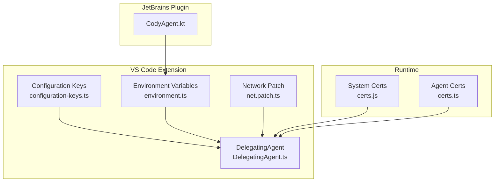
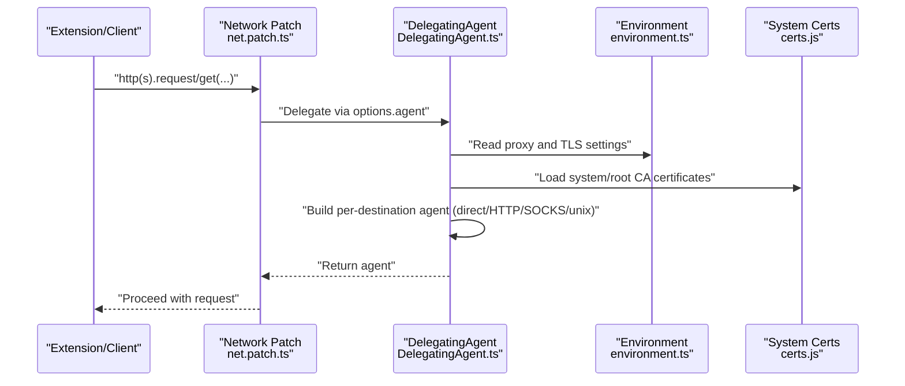
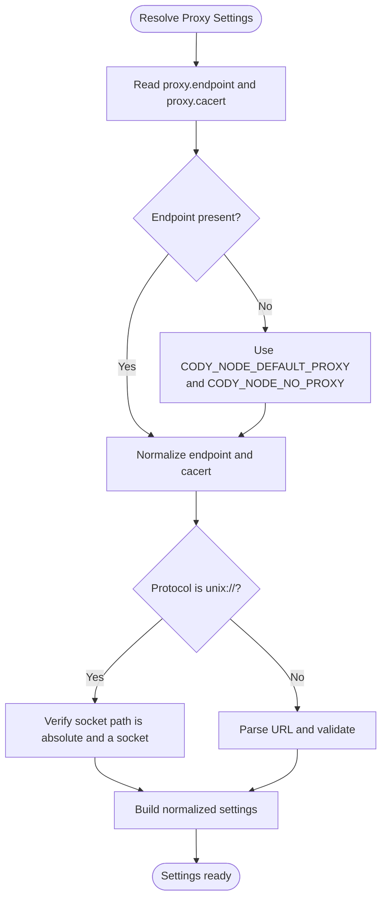
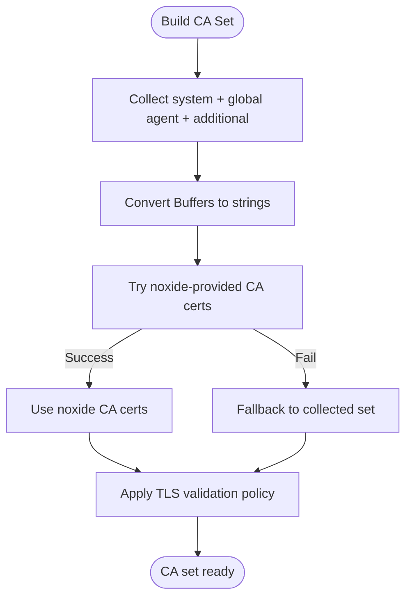
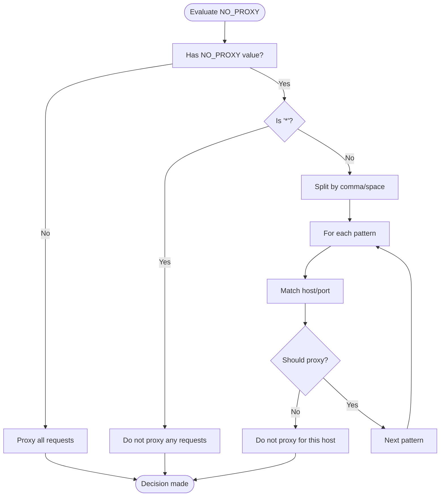
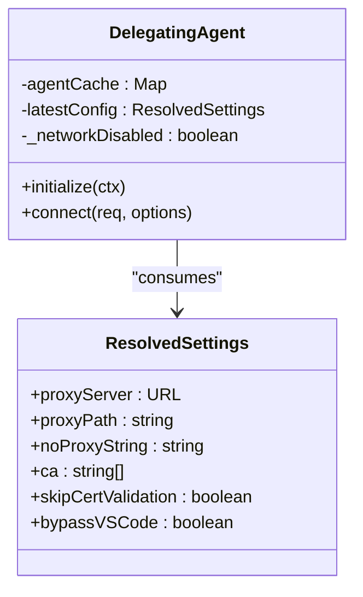
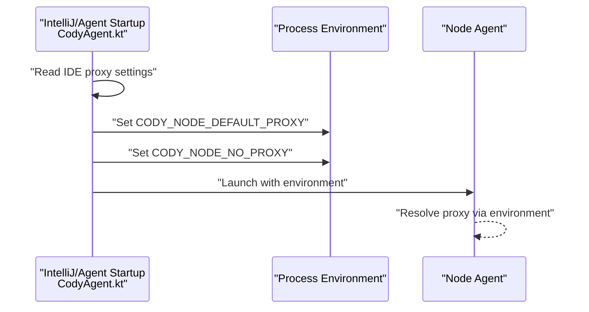
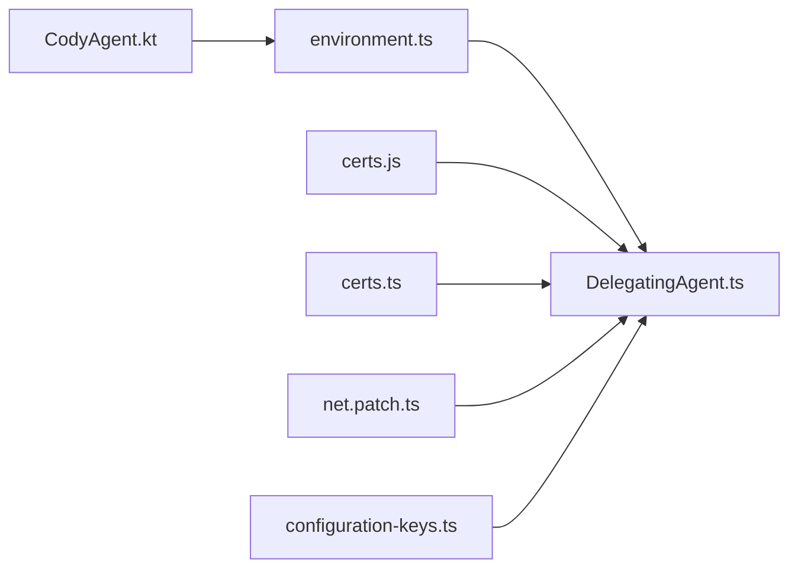

# Network Configuration

<cite>
**Referenced Files in This Document**
- [DelegatingAgent.ts](file://vscode/src/net/DelegatingAgent.ts)
- [index.ts](file://vscode/src/net/index.ts)
- [vscode-network-proxy.d.ts](file://vscode/src/net/vscode-network-proxy.d.ts)
- [net.patch.ts](file://vscode/src/net/net.patch.ts)
- [environment.ts](file://lib/shared/src/configuration/environment.ts)
- [configuration-keys.ts](file://vscode/src/configuration-keys.ts)
- [CodyAgent.kt](file://jetbrains/src/main/kotlin/com/sourcegraph/cody/agent/CodyAgent.kt)
- [certs.ts](file://agent/src/certs.ts)
- [certs.js](file://vscode/src/certs.js)
</cite>

## Table of Contents
1. [Introduction](#introduction)
2. [Project Structure](#project-structure)
3. [Core Components](#core-components)
4. [Architecture Overview](#architecture-overview)
5. [Detailed Component Analysis](#detailed-component-analysis)
6. [Dependency Analysis](#dependency-analysis)
7. [Performance Considerations](#performance-considerations)
8. [Troubleshooting Guide](#troubleshooting-guide)
9. [Conclusion](#conclusion)

## Introduction
This document explains how network configuration and proxy settings are implemented in the Cody enterprise environment. It covers proxy endpoint configuration (including Unix domain sockets), authentication mechanisms, certificate management for proxies, no-proxy patterns, environment variable overrides, connection pooling, timeouts, and reliability considerations. It also provides troubleshooting guidance for proxy connectivity and certificate validation issues.

## Project Structure
The network stack is centered around a configurable DelegatingAgent that selects appropriate Node.js agents (direct, HTTP(S) proxy, SOCKS, or Unix socket) and applies CA certificates and TLS validation policies. The VS Code and JetBrains integrations propagate IDE proxy settings into environment variables consumed by the runtime.

**Diagram sources**
- [configuration-keys.ts:1-55](file://vscode/src/configuration-keys.ts#L1-L55)
- [environment.ts:22-85](file://lib/shared/src/configuration/environment.ts#L22-L85)
- [net.patch.ts:15-49](file://vscode/src/net/net.patch.ts#L15-L49)
- [DelegatingAgent.ts:40-137](file://vscode/src/net/DelegatingAgent.ts#L40-L137)
- [CodyAgent.kt:257-283](file://jetbrains/src/main/kotlin/com/sourcegraph/cody/agent/CodyAgent.kt#L257-L283)
- [certs.js:16-47](file://vscode/src/certs.js#L16-L47)
- [certs.ts:13-29](file://agent/src/certs.ts#L13-L29)

**Section sources**
- [configuration-keys.ts:1-55](file://vscode/src/configuration-keys.ts#L1-L55)
- [environment.ts:22-85](file://lib/shared/src/configuration/environment.ts#L22-L85)
- [net.patch.ts:15-49](file://vscode/src/net/net.patch.ts#L15-L49)
- [DelegatingAgent.ts:40-137](file://vscode/src/net/DelegatingAgent.ts#L40-L137)
- [CodyAgent.kt:257-283](file://jetbrains/src/main/kotlin/com/sourcegraph/cody/agent/CodyAgent.kt#L257-L283)
- [certs.js:16-47](file://vscode/src/certs.js#L16-L47)
- [certs.ts:13-29](file://agent/src/certs.ts#L13-L29)

## Core Components
- DelegatingAgent: Central network agent that decides proxy vs direct connections, builds CA certificate sets, and manages per-destination agent instances.
- Environment configuration: Provides environment-backed proxy and TLS settings with fallbacks to Node’s standard variables.
- VS Code patch: Intercepts http/https requests and routes them through the DelegatingAgent.
- JetBrains integration: Reads IDE proxy settings and injects environment variables for the Node agent.
- Certificate loaders: Register platform-specific root certificates into the global HTTPS agent.

Key responsibilities:
- Proxy selection: Supports HTTP/HTTPS, SOCKS, and Unix domain sockets.
- Certificate handling: Merges system, global agent, and optional inline or file-based proxy CA certificates.
- No-proxy evaluation: Applies NO_PROXY-style patterns to decide whether to bypass the proxy.
- Reliability: Uses short-lived per-destination agents and a fixed timeout.

**Section sources**
- [DelegatingAgent.ts:40-137](file://vscode/src/net/DelegatingAgent.ts#L40-L137)
- [DelegatingAgent.ts:139-245](file://vscode/src/net/DelegatingAgent.ts#L139-L245)
- [DelegatingAgent.ts:247-296](file://vscode/src/net/DelegatingAgent.ts#L247-L296)
- [DelegatingAgent.ts:298-356](file://vscode/src/net/DelegatingAgent.ts#L298-L356)
- [environment.ts:22-85](file://lib/shared/src/configuration/environment.ts#L22-L85)
- [net.patch.ts:55-113](file://vscode/src/net/net.patch.ts#L55-L113)
- [CodyAgent.kt:257-283](file://jetbrains/src/main/kotlin/com/sourcegraph/cody/agent/CodyAgent.kt#L257-L283)
- [certs.js:16-47](file://vscode/src/certs.js#L16-L47)
- [certs.ts:13-29](file://agent/src/certs.ts#L13-L29)

## Architecture Overview
The runtime resolves proxy configuration from settings and environment variables, constructs a per-request agent, and applies CA certificates and TLS validation policy. The VS Code patch ensures all outgoing requests go through the DelegatingAgent.

**Diagram sources**
- [net.patch.ts:55-113](file://vscode/src/net/net.patch.ts#L55-L113)
- [DelegatingAgent.ts:139-245](file://vscode/src/net/DelegatingAgent.ts#L139-L245)
- [environment.ts:22-85](file://lib/shared/src/configuration/environment.ts#L22-L85)
- [certs.js:16-47](file://vscode/src/certs.js#L16-L47)

**Section sources**
- [net.patch.ts:55-113](file://vscode/src/net/net.patch.ts#L55-L113)
- [DelegatingAgent.ts:139-245](file://vscode/src/net/DelegatingAgent.ts#L139-L245)
- [environment.ts:22-85](file://lib/shared/src/configuration/environment.ts#L22-L85)
- [certs.js:16-47](file://vscode/src/certs.js#L16-L47)

## Detailed Component Analysis

### Proxy Configuration and Endpoint Resolution
- Endpoint formats:
  - HTTP/HTTPS proxies: URL with protocol and optional credentials.
  - SOCKS proxies: socks:, socks4:, socks4a:, or socks5: protocols.
  - Unix domain sockets: unix:// followed by an absolute path to a socket file.
- Resolution order:
  - If a proxy endpoint is configured, it is used; otherwise, environment variables are consulted.
  - NO_PROXY patterns are evaluated to decide whether to bypass the proxy for a given destination.
- Authentication:
  - For HTTP/HTTPS proxies, credentials can be embedded in the proxy URL.
  - SOCKS proxies are supported via dedicated agent libraries.
- Unix socket verification:
  - The path must be absolute, point to a filesystem socket, and be readable/writable.

**Diagram sources**
- [DelegatingAgent.ts:369-425](file://vscode/src/net/DelegatingAgent.ts#L369-L425)
- [DelegatingAgent.ts:438-457](file://vscode/src/net/DelegatingAgent.ts#L438-L457)
- [DelegatingAgent.ts:475-496](file://vscode/src/net/DelegatingAgent.ts#L475-L496)

**Section sources**
- [DelegatingAgent.ts:369-425](file://vscode/src/net/DelegatingAgent.ts#L369-L425)
- [DelegatingAgent.ts:438-457](file://vscode/src/net/DelegatingAgent.ts#L438-L457)
- [DelegatingAgent.ts:475-496](file://vscode/src/net/DelegatingAgent.ts#L475-L496)

### Certificate Management for Proxies
- CA certificate sources:
  - System root certificates and Node’s tls.rootCertificates.
  - Global HTTPS agent CA list.
  - Optional inline certificate string or file path for the proxy.
- Certificate loading:
  - Inline certificates are accepted if they start with the certificate header.
  - File-based certificates are read from an absolute path.
  - Platform-specific root certificates are registered into the global agent.
- Validation policy:
  - TLS validation can be disabled via environment variable or configuration flag.

**Diagram sources**
- [DelegatingAgent.ts:298-356](file://vscode/src/net/DelegatingAgent.ts#L298-L356)
- [certs.js:16-47](file://vscode/src/certs.js#L16-L47)
- [certs.ts:13-29](file://agent/src/certs.ts#L13-L29)

**Section sources**
- [DelegatingAgent.ts:298-356](file://vscode/src/net/DelegatingAgent.ts#L298-L356)
- [certs.js:16-47](file://vscode/src/certs.js#L16-L47)
- [certs.ts:13-29](file://agent/src/certs.ts#L13-L29)

### No-Proxy Patterns and Environment Overrides
- NO_PROXY patterns:
  - Wildcard '*' disables proxying for all destinations.
  - Hostname suffixes (e.g., '.corp.internal') and exact matches are supported.
  - Port-specific exclusions are considered when evaluating patterns.
- Environment variable precedence:
  - CODY_NODE_DEFAULT_PROXY: primary proxy override with Node fallback semantics.
  - CODY_NODE_NO_PROXY: no-proxy list with Node fallback semantics.
  - CODY_NODE_TLS_REJECT_UNAUTHORIZED: toggles TLS certificate validation.

**Diagram sources**
- [DelegatingAgent.ts:515-561](file://vscode/src/net/DelegatingAgent.ts#L515-L561)
- [environment.ts:27-38](file://lib/shared/src/configuration/environment.ts#L27-L38)

**Section sources**
- [DelegatingAgent.ts:515-561](file://vscode/src/net/DelegatingAgent.ts#L515-L561)
- [environment.ts:27-38](file://lib/shared/src/configuration/environment.ts#L27-L38)

### Connection Pooling, Timeouts, and Reliability
- Per-destination agents:
  - A unique agent is created per protocol/host/port combination to avoid cross-domain interference.
- Keep-alive and HTTP/2:
  - Keep-alive is disabled; HTTP/2 is not used to maintain stability.
- Scheduling and TCP options:
  - LIFO scheduling prioritizes autocomplete responsiveness.
  - Nagle’s algorithm is enabled via noDelay.
- Timeouts:
  - Fixed request timeout is applied consistently.
- Agent lifecycle:
  - Expired agents are destroyed after a grace period when configuration changes.

**Diagram sources**
- [DelegatingAgent.ts:40-137](file://vscode/src/net/DelegatingAgent.ts#L40-L137)
- [DelegatingAgent.ts:427-436](file://vscode/src/net/DelegatingAgent.ts#L427-L436)

**Section sources**
- [DelegatingAgent.ts:139-245](file://vscode/src/net/DelegatingAgent.ts#L139-L245)
- [DelegatingAgent.ts:50-95](file://vscode/src/net/DelegatingAgent.ts#L50-L95)

### Enterprise Integration: JetBrains Proxy Propagation
The JetBrains plugin reads IDE proxy settings and injects environment variables for the Node agent process:
- Sets CODY_NODE_DEFAULT_PROXY with protocol and optional credentials.
- Sets CODY_NODE_NO_PROXY from IDE exceptions list.
- Supports SOCKS vs HTTP proxy detection and credentials embedding.

**Diagram sources**
- [CodyAgent.kt:257-283](file://jetbrains/src/main/kotlin/com/sourcegraph/cody/agent/CodyAgent.kt#L257-L283)

**Section sources**
- [CodyAgent.kt:257-283](file://jetbrains/src/main/kotlin/com/sourcegraph/cody/agent/CodyAgent.kt#L257-L283)

## Dependency Analysis
- DelegatingAgent depends on:
  - Environment configuration for proxy and TLS settings.
  - System and global certificate stores.
  - Agent libraries for HTTP(S) and SOCKS proxies.
- VS Code patch integrates with the runtime by intercepting http/https and delegating to the DelegatingAgent.
- JetBrains integration feeds environment variables consumed by the Node runtime.

**Diagram sources**
- [environment.ts:22-85](file://lib/shared/src/configuration/environment.ts#L22-L85)
- [DelegatingAgent.ts:40-137](file://vscode/src/net/DelegatingAgent.ts#L40-L137)
- [certs.js:16-47](file://vscode/src/certs.js#L16-L47)
- [certs.ts:13-29](file://agent/src/certs.ts#L13-L29)
- [net.patch.ts:55-113](file://vscode/src/net/net.patch.ts#L55-L113)
- [CodyAgent.kt:257-283](file://jetbrains/src/main/kotlin/com/sourcegraph/cody/agent/CodyAgent.kt#L257-L283)
- [configuration-keys.ts:1-55](file://vscode/src/configuration-keys.ts#L1-L55)

**Section sources**
- [environment.ts:22-85](file://lib/shared/src/configuration/environment.ts#L22-L85)
- [DelegatingAgent.ts:40-137](file://vscode/src/net/DelegatingAgent.ts#L40-L137)
- [certs.js:16-47](file://vscode/src/certs.js#L16-L47)
- [certs.ts:13-29](file://agent/src/certs.ts#L13-L29)
- [net.patch.ts:55-113](file://vscode/src/net/net.patch.ts#L55-L113)
- [CodyAgent.kt:257-283](file://jetbrains/src/main/kotlin/com/sourcegraph/cody/agent/CodyAgent.kt#L257-L283)
- [configuration-keys.ts:1-55](file://vscode/src/configuration-keys.ts#L1-L55)

## Performance Considerations
- Per-destination agent creation avoids cross-domain interference and improves reliability.
- Fixed timeout prevents long-lived hanging requests.
- LIFO scheduling prioritizes interactive operations (e.g., autocomplete).
- Keep-alive disabled to reduce complexity and potential connection conflicts.
- Short-lived agent cache cleanup reduces resource accumulation during frequent config updates.

[No sources needed since this section provides general guidance]

## Troubleshooting Guide
Common issues and resolutions:
- Proxy endpoint invalid:
  - Symptom: Error indicating the proxy endpoint URL is invalid.
  - Action: Verify the endpoint format and credentials; ensure unix:// socket paths are absolute and point to a valid socket.
  - References: [DelegatingAgent.ts:387-395](file://vscode/src/net/DelegatingAgent.ts#L387-L395), [DelegatingAgent.ts:438-457](file://vscode/src/net/DelegatingAgent.ts#L438-L457)
- Socket path verification failure:
  - Symptom: Cannot verify proxy endpoint; path is not a socket or not accessible.
  - Action: Confirm the path is absolute, a socket, and readable/writable.
  - References: [DelegatingAgent.ts:438-457](file://vscode/src/net/DelegatingAgent.ts#L438-L457)
- Certificate read failures:
  - Symptom: Cannot read proxy CA certificate from file path.
  - Action: Ensure the path is absolute and readable; prefer inline certificates for simpler deployment.
  - References: [DelegatingAgent.ts:459-472](file://vscode/src/net/DelegatingAgent.ts#L459-L472)
- TLS validation errors:
  - Symptom: Certificate validation failure against CA set.
  - Action: Add the required CA certificate via inline or file-based configuration; optionally disable validation only for testing via environment variable.
  - References: [DelegatingAgent.ts:298-356](file://vscode/src/net/DelegatingAgent.ts#L298-L356), [environment.ts:37-38](file://lib/shared/src/configuration/environment.ts#L37-L38)
- NO_PROXY not taking effect:
  - Symptom: Requests still go through proxy despite NO_PROXY entries.
  - Action: Validate patterns (wildcards, suffixes, ports); ensure environment variable is set and not overridden.
  - References: [DelegatingAgent.ts:515-561](file://vscode/src/net/DelegatingAgent.ts#L515-L561), [environment.ts:32-32](file://lib/shared/src/configuration/environment.ts#L32-L32)
- JetBrains proxy not applied:
  - Symptom: Node agent ignores IDE proxy settings.
  - Action: Confirm IDE proxy is enabled and exceptions are set; verify environment variables are injected.
  - References: [CodyAgent.kt:278-283](file://jetbrains/src/main/kotlin/com/sourcegraph/cody/agent/CodyAgent.kt#L278-L283)

**Section sources**
- [DelegatingAgent.ts:387-395](file://vscode/src/net/DelegatingAgent.ts#L387-L395)
- [DelegatingAgent.ts:438-457](file://vscode/src/net/DelegatingAgent.ts#L438-L457)
- [DelegatingAgent.ts:459-472](file://vscode/src/net/DelegatingAgent.ts#L459-L472)
- [DelegatingAgent.ts:298-356](file://vscode/src/net/DelegatingAgent.ts#L298-L356)
- [environment.ts:32-38](file://lib/shared/src/configuration/environment.ts#L32-L38)
- [DelegatingAgent.ts:515-561](file://vscode/src/net/DelegatingAgent.ts#L515-L561)
- [CodyAgent.kt:278-283](file://jetbrains/src/main/kotlin/com/sourcegraph/cody/agent/CodyAgent.kt#L278-L283)

## Conclusion
Cody’s enterprise network stack provides robust proxy configuration supporting HTTP/HTTPS, SOCKS, and Unix domain sockets, with flexible certificate management and strict NO_PROXY pattern enforcement. Environment variables offer powerful overrides, while the DelegatingAgent ensures reliable, per-destination connection handling. For enterprise deployments, prefer explicit inline or file-based proxy CA certificates, validate NO_PROXY patterns carefully, and leverage environment variables to align IDE and Node runtime proxy behavior.