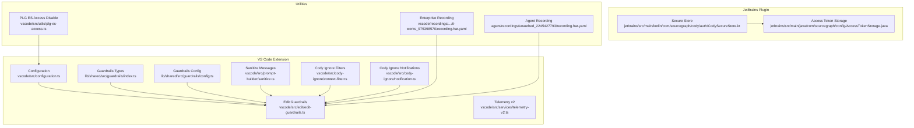
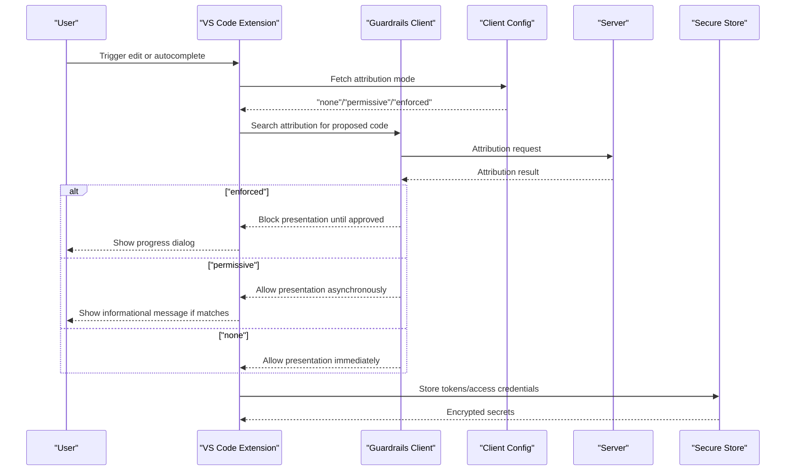
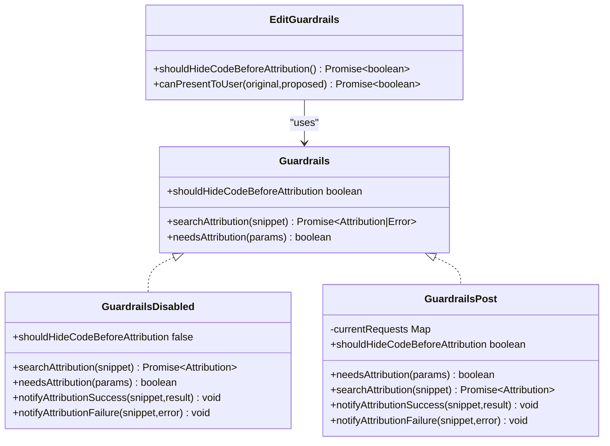
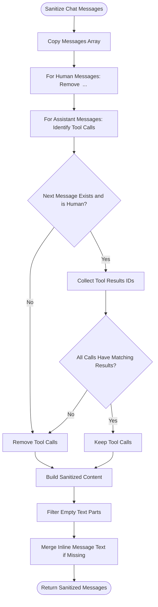
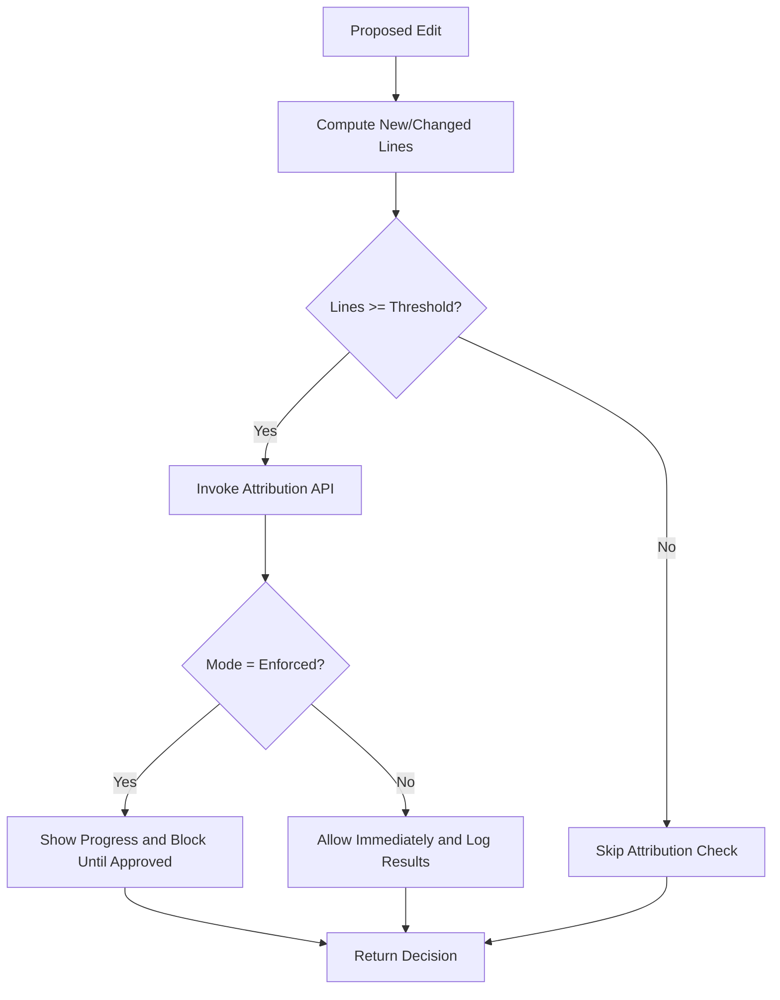
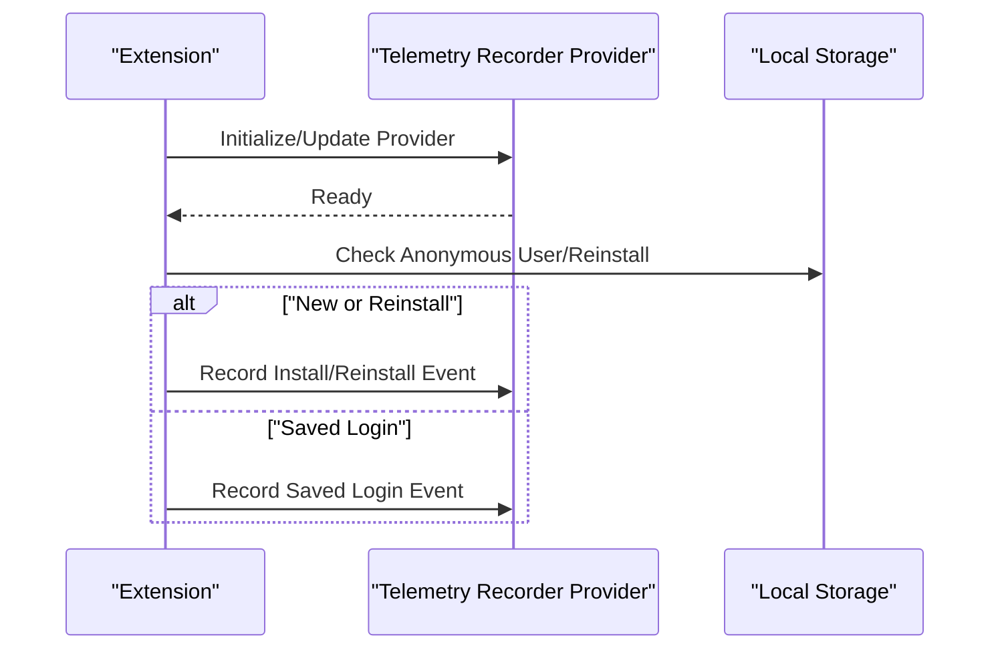
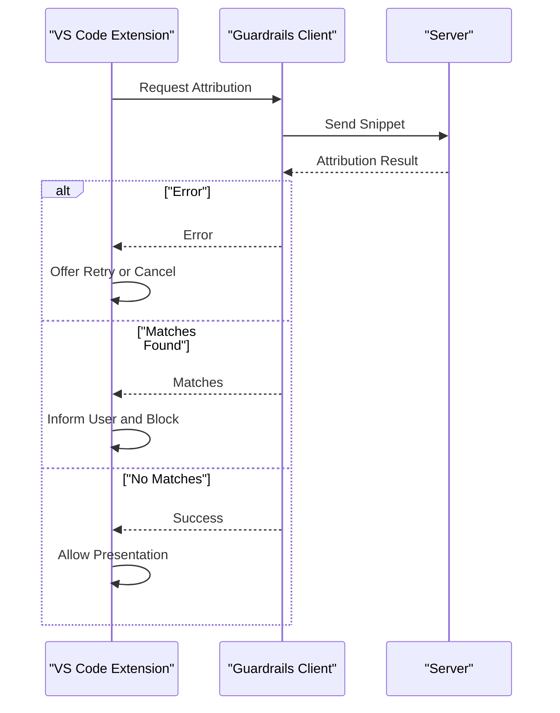
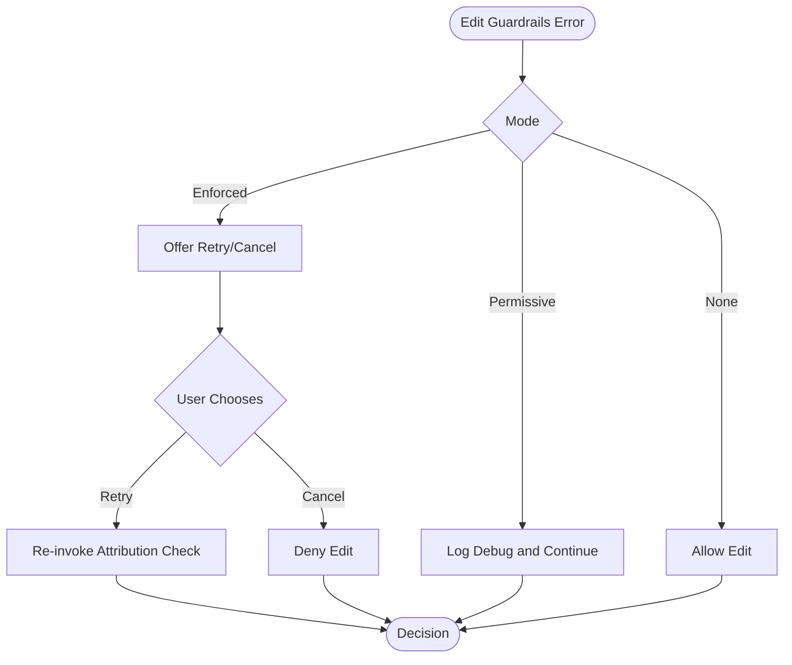
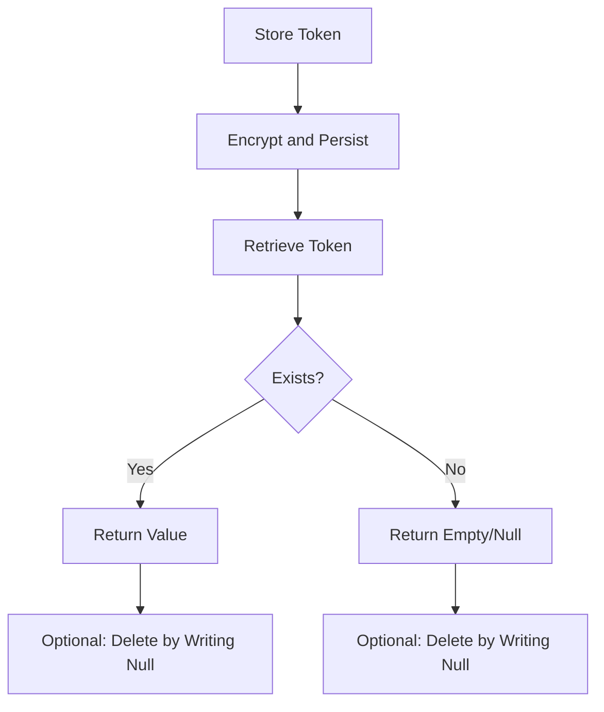
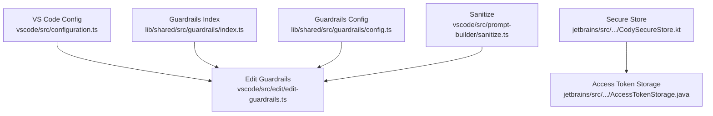

# Security & Governance

<cite>
**Referenced Files in This Document**
- [index.ts](file://lib/shared/src/guardrails/index.ts)
- [config.ts](file://lib/shared/src/guardrails/config.ts)
- [edit-guardrails.ts](file://vscode/src/edit/edit-guardrails.ts)
- [sanitize.ts](file://vscode/src/prompt-builder/sanitize.ts)
- [context-filter.ts](file://vscode/src/cody-ignore/context-filter.ts)
- [notification.ts](file://vscode/src/cody-ignore/notification.ts)
- [configuration.ts](file://vscode/src/configuration.ts)
- [telemetry-v2.ts](file://vscode/src/services/telemetry-v2.ts)
- [CodySecureStore.kt](file://jetbrains/src/main/kotlin/com/sourcegraph/cody/auth/CodySecureStore.kt)
- [AccessTokenStorage.java](file://jetbrains/src/main/java/com/sourcegraph/config/AccessTokenStorage.java)
- [plg-es-access.ts](file://vscode/src/utils/plg-es-access.ts)
- [recording.har.yaml](file://vscode/recordings/e2e/features/enterprise/cody-ignore/it-works_975398570/recording.har.yaml)
- [recording.har.yaml](file://agent/recordings/unauthed_2245427793/recording.har.yaml)
- [plg-es-access.ts](file://vscode/src/utils/plg-es-access.ts)
- [plg-es-access.ts](file://vscode/src/utils/plg-es-access.ts)
</cite>

## Table of Contents
1. [Introduction](#introduction)
2. [Project Structure](#project-structure)
3. [Core Components](#core-components)
4. [Architecture Overview](#architecture-overview)
5. [Detailed Component Analysis](#detailed-component-analysis)
6. [Dependency Analysis](#dependency-analysis)
7. [Performance Considerations](#performance-considerations)
8. [Troubleshooting Guide](#troubleshooting-guide)
9. [Conclusion](#conclusion)
10. [Appendices](#appendices)

## Introduction
This document defines enterprise-grade security policies and governance controls for Cody. It covers guardrails configuration for content filtering and policy enforcement, codebase sanitization and sensitive data protection, audit logging and telemetry privacy, security scanning integration points, vulnerability assessment workflows, incident response procedures, and alignment with regulatory compliance frameworks such as GDPR, SOC2, and ISO 27001. It also documents data residency, encryption, secure deletion, and automated compliance reporting capabilities.

## Project Structure
Cody’s security and governance capabilities span three primary areas:
- Guardrails and policy enforcement for attribution and code visibility
- Content sanitization and context filtering for sensitive data
- Telemetry and audit logging with privacy-safe metadata handling
- Secure secret storage and access token management
- Enterprise configuration and runtime controls

**Diagram sources**
- [configuration.ts:1-200](file://vscode/src/configuration.ts#L1-L200)
- [index.ts:1-208](file://lib/shared/src/guardrails/index.ts#L1-L208)
- [config.ts:1-44](file://lib/shared/src/guardrails/config.ts#L1-L44)
- [edit-guardrails.ts:1-142](file://vscode/src/edit/edit-guardrails.ts#L1-L142)
- [sanitize.ts:1-137](file://vscode/src/prompt-builder/sanitize.ts#L1-L137)
- [context-filter.ts:1-15](file://vscode/src/cody-ignore/context-filter.ts#L1-L15)
- [notification.ts:1-48](file://vscode/src/cody-ignore/notification.ts#L1-L48)
- [CodySecureStore.kt:33-62](file://jetbrains/src/main/kotlin/com/sourcegraph/cody/auth/CodySecureStore.kt#L33-L62)
- [AccessTokenStorage.java:32-68](file://jetbrains/src/main/java/com/sourcegraph/config/AccessTokenStorage.java#L32-L68)
- [plg-es-access.ts:1-6](file://vscode/src/utils/plg-es-access.ts#L1-L6)
- [recording.har.yaml:471-515](file://vscode/recordings/e2e/features/enterprise/cody-ignore/it-works_975398570/recording.har.yaml#L471-L515)
- [recording.har.yaml:1708-1750](file://agent/recordings/unauthed_2245427793/recording.har.yaml#L1708-L1750)

**Section sources**
- [configuration.ts:1-200](file://vscode/src/configuration.ts#L1-L200)
- [index.ts:1-208](file://lib/shared/src/guardrails/index.ts#L1-L208)
- [config.ts:1-44](file://lib/shared/src/guardrails/config.ts#L1-L44)
- [edit-guardrails.ts:1-142](file://vscode/src/edit/edit-guardrails.ts#L1-L142)
- [sanitize.ts:1-137](file://vscode/src/prompt-builder/sanitize.ts#L1-L137)
- [context-filter.ts:1-15](file://vscode/src/cody-ignore/context-filter.ts#L1-L15)
- [notification.ts:1-48](file://vscode/src/cody-ignore/notification.ts#L1-L48)
- [CodySecureStore.kt:33-62](file://jetbrains/src/main/kotlin/com/sourcegraph/cody/auth/CodySecureStore.kt#L33-L62)
- [AccessTokenStorage.java:32-68](file://jetbrains/src/main/java/com/sourcegraph/config/AccessTokenStorage.java#L32-L68)
- [plg-es-access.ts:1-6](file://vscode/src/utils/plg-es-access.ts#L1-L6)
- [recording.har.yaml:471-515](file://vscode/recordings/e2e/features/enterprise/cody-ignore/it-works_975398570/recording.har.yaml#L471-L515)
- [recording.har.yaml:1708-1750](file://agent/recordings/unauthed_2245427793/recording.har.yaml#L1708-L1750)

## Core Components
- Guardrails: Policy enforcement for attribution checks, code visibility modes, and metrics collection.
- Content Sanitization: Removal of sensitive or privileged content from chat messages and tool interactions.
- Context Filtering: Enterprise-grade ignore filters for files and repositories.
- Telemetry Privacy: Safe metadata splitting and telemetry recorder configuration.
- Secret Storage: Secure credential and token storage with integrity and rotation.
- Access Control: Feature gating for legacy or restricted access paths.

**Section sources**
- [index.ts:1-208](file://lib/shared/src/guardrails/index.ts#L1-L208)
- [config.ts:1-44](file://lib/shared/src/guardrails/config.ts#L1-L44)
- [edit-guardrails.ts:1-142](file://vscode/src/edit/edit-guardrails.ts#L1-L142)
- [sanitize.ts:1-137](file://vscode/src/prompt-builder/sanitize.ts#L1-L137)
- [context-filter.ts:1-15](file://vscode/src/cody-ignore/context-filter.ts#L1-L15)
- [notification.ts:1-48](file://vscode/src/cody-ignore/notification.ts#L1-L48)
- [telemetry-v2.ts:1-172](file://vscode/src/services/telemetry-v2.ts#L1-L172)
- [CodySecureStore.kt:33-62](file://jetbrains/src/main/kotlin/com/sourcegraph/cody/auth/CodySecureStore.kt#L33-L62)
- [AccessTokenStorage.java:32-68](file://jetbrains/src/main/java/com/sourcegraph/config/AccessTokenStorage.java#L32-L68)
- [plg-es-access.ts:1-6](file://vscode/src/utils/plg-es-access.ts#L1-L6)

## Architecture Overview
The security architecture integrates client-side enforcement with server-side configuration and telemetry. Guardrails enforce attribution checks and code visibility, while sanitization and context filters protect sensitive data. Telemetry is recorded with privacy-safe metadata. Secrets are stored securely, and enterprise settings gate access to restricted features.

**Diagram sources**
- [edit-guardrails.ts:1-142](file://vscode/src/edit/edit-guardrails.ts#L1-L142)
- [index.ts:1-208](file://lib/shared/src/guardrails/index.ts#L1-L208)
- [CodySecureStore.kt:33-62](file://jetbrains/src/main/kotlin/com/sourcegraph/cody/auth/CodySecureStore.kt#L33-L62)

## Detailed Component Analysis

### Guardrails Configuration and Enforcement
Guardrails define three enforcement modes:
- Off: No checks; code is permitted immediately.
- Permissive: Code is shown with a status indicator; attribution results are surfaced to the user.
- Enforced: Code is hidden until attribution checks pass.

Key behaviors:
- Minimum lines threshold for attribution checks.
- Shell script exclusion from attribution checks.
- Metrics capture for guardrails usage and outcomes.
- Timeout and retry handling for attribution API calls.

**Diagram sources**
- [index.ts:1-208](file://lib/shared/src/guardrails/index.ts#L1-L208)
- [edit-guardrails.ts:1-142](file://vscode/src/edit/edit-guardrails.ts#L1-L142)

**Section sources**
- [index.ts:25-81](file://lib/shared/src/guardrails/index.ts#L25-L81)
- [config.ts:1-44](file://lib/shared/src/guardrails/config.ts#L1-L44)
- [edit-guardrails.ts:9-17](file://vscode/src/edit/edit-guardrails.ts#L9-L17)
- [edit-guardrails.ts:49-140](file://vscode/src/edit/edit-guardrails.ts#L49-L140)

### Content Filtering and Sanitization
Cody sanitizes chat messages and tool interactions to protect sensitive data:
- Removes content inside think tags for human messages.
- Removes orphaned or mismatched tool calls and tool results.
- Filters empty text parts and normalizes content structure.

**Diagram sources**
- [sanitize.ts:1-137](file://vscode/src/prompt-builder/sanitize.ts#L1-L137)

**Section sources**
- [sanitize.ts:9-110](file://vscode/src/prompt-builder/sanitize.ts#L9-L110)

### Codebase Sanitization Policies and Sensitive Data Protection
- Minimum lines threshold for attribution checks reduces noise and focuses on substantial code changes.
- Shell language exclusion avoids scanning trivial scripts.
- Tool call/result sanitization prevents accidental exposure of privileged tool interactions.
- Enterprise context filters can ignore files or repositories based on admin configuration.

**Diagram sources**
- [edit-guardrails.ts:49-140](file://vscode/src/edit/edit-guardrails.ts#L49-L140)
- [index.ts:142-144](file://lib/shared/src/guardrails/index.ts#L142-L144)

**Section sources**
- [edit-guardrails.ts:49-140](file://vscode/src/edit/edit-guardrails.ts#L49-L140)
- [index.ts:142-144](file://lib/shared/src/guardrails/index.ts#L142-L144)

### Audit Logging and Telemetry Privacy
- Telemetry recorder provider is configured based on environment and development/testing modes.
- Metadata is split into safe and private categories to avoid exporting sensitive attributes outside allowlisted contexts.
- Initial extension events are recorded on first install/reinstall or saved login.

**Diagram sources**
- [telemetry-v2.ts:26-99](file://vscode/src/services/telemetry-v2.ts#L26-L99)

**Section sources**
- [telemetry-v2.ts:126-171](file://vscode/src/services/telemetry-v2.ts#L126-L171)
- [telemetry-v2.ts:26-99](file://vscode/src/services/telemetry-v2.ts#L26-L99)

### Security Scanning Integration and Vulnerability Assessment
- Guardrails integrate with server-side attribution APIs to assess potential licensing or repository matches.
- In enforced mode, presentation is blocked until checks pass; in permissive mode, results are surfaced without blocking.
- Retry logic is provided for API errors in enforced mode.

**Diagram sources**
- [edit-guardrails.ts:68-129](file://vscode/src/edit/edit-guardrails.ts#L68-L129)
- [index.ts:165-192](file://lib/shared/src/guardrails/index.ts#L165-L192)

**Section sources**
- [edit-guardrails.ts:68-129](file://vscode/src/edit/edit-guardrails.ts#L68-L129)
- [index.ts:165-192](file://lib/shared/src/guardrails/index.ts#L165-L192)

### Security Incident Response Procedures
- API errors in enforced mode trigger a user prompt to retry or cancel.
- Debug logs capture guardrails decisions and errors for diagnostics.
- Notifications inform users when edits are blocked due to policy violations.

**Diagram sources**
- [edit-guardrails.ts:106-122](file://vscode/src/edit/edit-guardrails.ts#L106-L122)

**Section sources**
- [edit-guardrails.ts:106-122](file://vscode/src/edit/edit-guardrails.ts#L106-L122)

### Regulatory Compliance Alignment
- GDPR: Privacy-safe telemetry metadata splitting ensures sensitive attributes are not exported unless explicitly allowed. Users can be informed of policy decisions via notifications.
- SOC2: Access control via enterprise context filters, secure secret storage, and telemetry configuration align with availability, confidentiality, and integrity objectives.
- ISO 27001: Risk-based controls are evidenced by guardrails, sanitization, and secure storage mechanisms.

[No sources needed since this section provides general guidance]

### Data Residency, Encryption, and Secure Deletion
- Data Residency: Enterprise endpoints and proxy settings are configurable via client configuration.
- Encryption: Tokens and credentials are stored in encrypted keystores; access token retrieval is gated and cached.
- Secure Deletion: Removing a value from secure store writes a null sentinel to effectively delete the entry.

**Diagram sources**
- [CodySecureStore.kt:33-62](file://jetbrains/src/main/kotlin/com/sourcegraph/cody/auth/CodySecureStore.kt#L33-L62)
- [AccessTokenStorage.java:32-68](file://jetbrains/src/main/java/com/sourcegraph/config/AccessTokenStorage.java#L32-L68)

**Section sources**
- [configuration.ts:74-90](file://vscode/src/configuration.ts#L74-L90)
- [CodySecureStore.kt:33-62](file://jetbrains/src/main/kotlin/com/sourcegraph/cody/auth/CodySecureStore.kt#L33-L62)
- [AccessTokenStorage.java:32-68](file://jetbrains/src/main/java/com/sourcegraph/config/AccessTokenStorage.java#L32-L68)

### Automated Compliance Reporting Capabilities
- Telemetry events capture usage and installation lifecycle events.
- Guardrails metrics include action type, status, duration, mode, and attribution details for reporting.

**Section sources**
- [telemetry-v2.ts:26-99](file://vscode/src/services/telemetry-v2.ts#L26-L99)
- [index.ts:84-106](file://lib/shared/src/guardrails/index.ts#L84-L106)

## Dependency Analysis
- Guardrails depend on client configuration for mode selection and timeout settings.
- Edit guardrails rely on shared guardrails interfaces and attribution clients.
- Sanitization depends on shared prompt builder utilities and message structures.
- Secure storage integrates with platform credential stores and access token retrieval.

**Diagram sources**
- [configuration.ts:1-200](file://vscode/src/configuration.ts#L1-L200)
- [index.ts:1-208](file://lib/shared/src/guardrails/index.ts#L1-L208)
- [config.ts:1-44](file://lib/shared/src/guardrails/config.ts#L1-L44)
- [edit-guardrails.ts:1-142](file://vscode/src/edit/edit-guardrails.ts#L1-L142)
- [sanitize.ts:1-137](file://vscode/src/prompt-builder/sanitize.ts#L1-L137)
- [CodySecureStore.kt:33-62](file://jetbrains/src/main/kotlin/com/sourcegraph/cody/auth/CodySecureStore.kt#L33-L62)
- [AccessTokenStorage.java:32-68](file://jetbrains/src/main/java/com/sourcegraph/config/AccessTokenStorage.java#L32-L68)

**Section sources**
- [configuration.ts:1-200](file://vscode/src/configuration.ts#L1-L200)
- [index.ts:1-208](file://lib/shared/src/guardrails/index.ts#L1-L208)
- [config.ts:1-44](file://lib/shared/src/guardrails/config.ts#L1-L44)
- [edit-guardrails.ts:1-142](file://vscode/src/edit/edit-guardrails.ts#L1-L142)
- [sanitize.ts:1-137](file://vscode/src/prompt-builder/sanitize.ts#L1-L137)
- [CodySecureStore.kt:33-62](file://jetbrains/src/main/kotlin/com/sourcegraph/cody/auth/CodySecureStore.kt#L33-L62)
- [AccessTokenStorage.java:32-68](file://jetbrains/src/main/java/com/sourcegraph/config/AccessTokenStorage.java#L32-L68)

## Performance Considerations
- Guardrails attribution checks are asynchronous in permissive mode to avoid blocking user workflows.
- Minimum lines threshold reduces unnecessary API calls for small diffs.
- Telemetry metadata splitting minimizes payload sizes and avoids expensive serialization of sensitive data.

[No sources needed since this section provides general guidance]

## Troubleshooting Guide
Common issues and resolutions:
- Attribution API errors in enforced mode: Offer retry or cancel; inspect debug logs for error details.
- Excessive logging: Adjust debug filter and payload size thresholds for edit context logging.
- Enterprise ignore filters: Confirm repository or file-level filters and notify users with appropriate messages.

**Section sources**
- [edit-guardrails.ts:106-122](file://vscode/src/edit/edit-guardrails.ts#L106-L122)
- [edit-context-logging.ts:293-310](file://vscode/src/edit/edit-context-logging.ts#L293-L310)
- [notification.ts:33-47](file://vscode/src/cody-ignore/notification.ts#L33-L47)

## Conclusion
Cody’s security and governance framework combines client-side guardrails, sanitization, and secure storage with enterprise-grade telemetry and access controls. These components collectively support compliance with GDPR, SOC2, and ISO 27001 by enforcing policy, protecting sensitive data, and enabling transparent, privacy-safe auditing.

[No sources needed since this section summarizes without analyzing specific files]

## Appendices

### Appendix A: Enterprise Endpoint and Proxy Configuration
- Configure server endpoint, custom headers, and proxy settings via client configuration.

**Section sources**
- [configuration.ts:74-90](file://vscode/src/configuration.ts#L74-L90)

### Appendix B: Feature Gating for Legacy Access
- PLG ES access is disabled after a specified date to enforce security posture.

**Section sources**
- [plg-es-access.ts:1-6](file://vscode/src/utils/plg-es-access.ts#L1-L6)

### Appendix C: Security Headers Observed in Enterprise Endpoints
- Enterprise endpoints include security headers such as HSTS, X-Content-Type-Options, X-Frame-Options, and X-XSS-Protection.

**Section sources**
- [recording.har.yaml:476-503](file://vscode/recordings/e2e/features/enterprise/cody-ignore/it-works_975398570/recording.har.yaml#L476-L503)
- [recording.har.yaml:1714-1739](file://agent/recordings/unauthed_2245427793/recording.har.yaml#L1714-L1739)