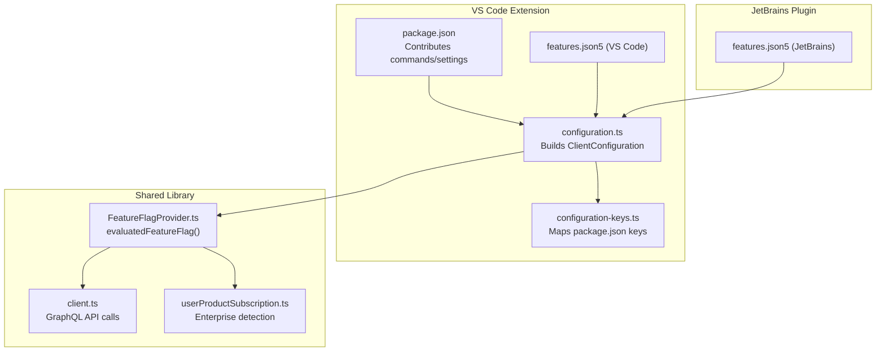
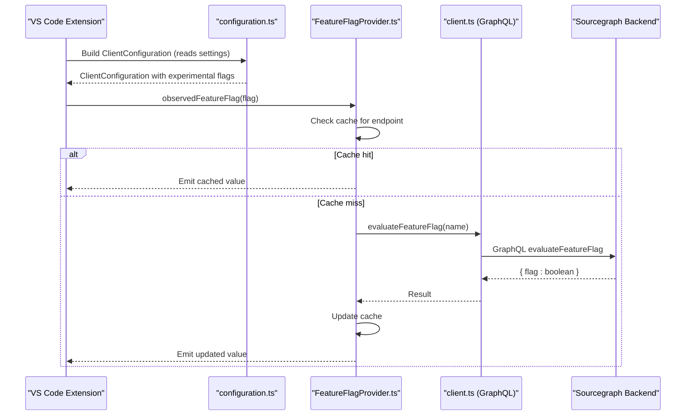
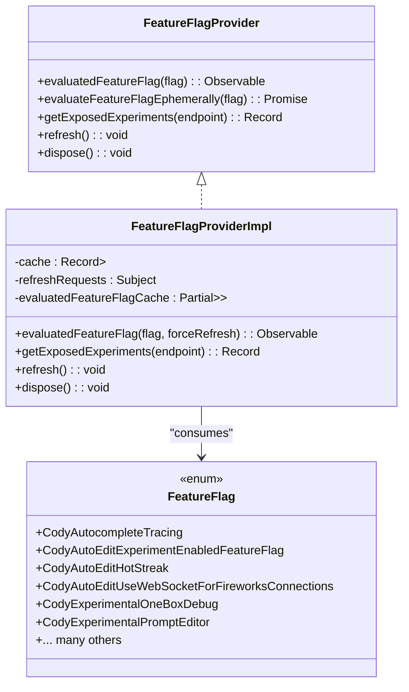
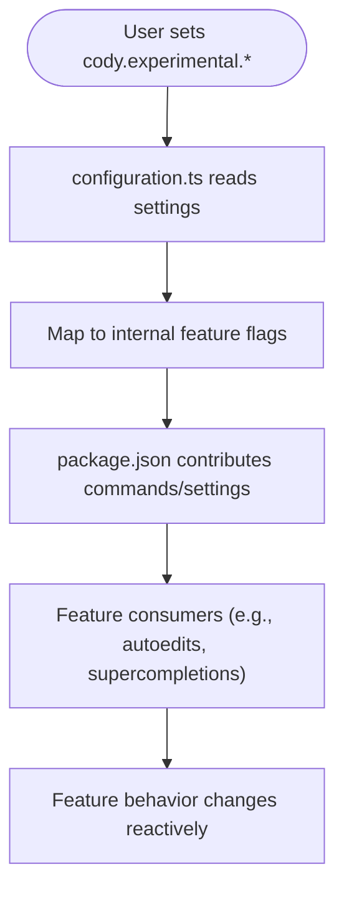
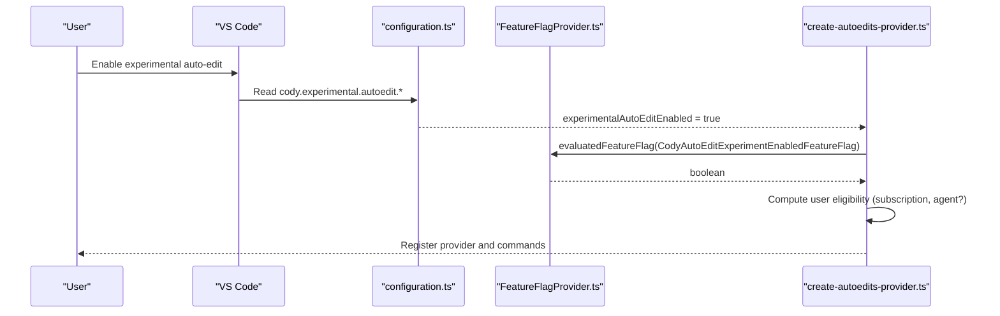
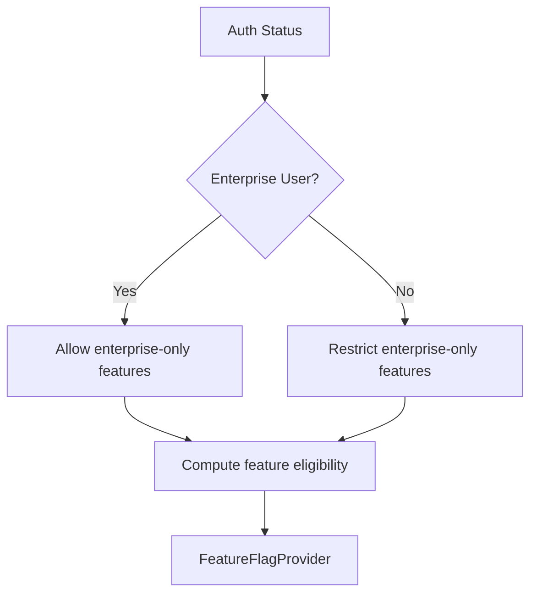
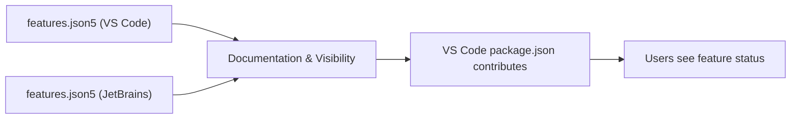
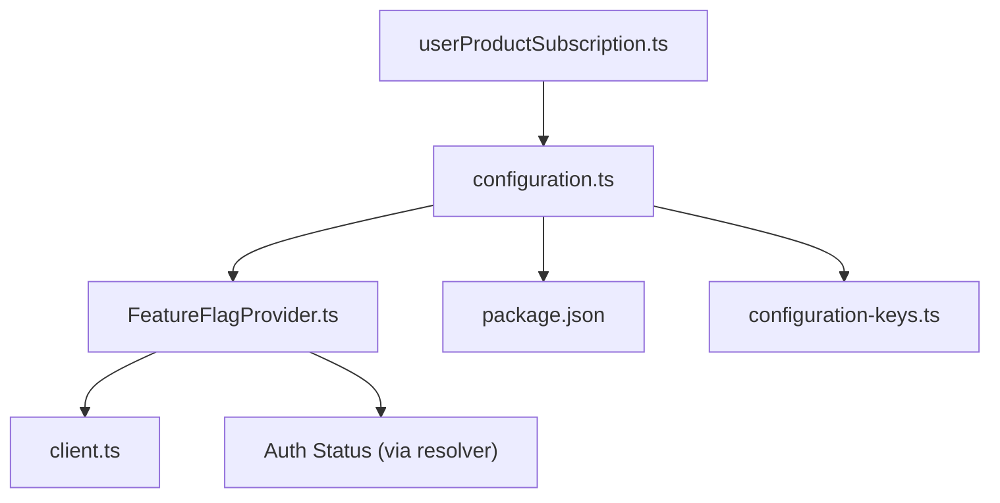

# Feature Flags & Experiments

<cite>
**Referenced Files in This Document**
- [FeatureFlagProvider.ts](file://lib/shared/src/experimentation/FeatureFlagProvider.ts)
- [client.ts](file://lib/shared/src/sourcegraph-api/graphql/client.ts)
- [configuration.ts](file://vscode/src/configuration.ts)
- [configuration-keys.ts](file://vscode/src/configuration-keys.ts)
- [package.json](file://vscode/package.json)
- [features.json5 (VS Code)](file://vscode/features.json5)
- [features.json5 (JetBrains)](file://jetbrains/features.json5)
- [create-autoedits-provider.ts](file://vscode/src/autoedits/create-autoedits-provider.ts)
- [autoedit-completions.test.ts](file://vscode/src/autoedits/adapters/sourcegraph-completions.test.ts)
- [userProductSubscription.ts](file://lib/shared/src/sourcegraph-api/userProductSubscription.ts)
- [FeatureFlagProvider.test.ts](file://lib/shared/src/experimentation/FeatureFlagProvider.test.ts)
</cite>

## Table of Contents
1. [Introduction](#introduction)
2. [Project Structure](#project-structure)
3. [Core Components](#core-components)
4. [Architecture Overview](#architecture-overview)
5. [Detailed Component Analysis](#detailed-component-analysis)
6. [Dependency Analysis](#dependency-analysis)
7. [Performance Considerations](#performance-considerations)
8. [Troubleshooting Guide](#troubleshooting-guide)
9. [Conclusion](#conclusion)
10. [Appendices](#appendices)

## Introduction
This document explains the feature flag management and experimental features system in the Cody platform. It covers:
- The centralized feature flag provider and its evaluation lifecycle
- How experimental features are surfaced in configuration and UI
- A/B testing and exposure tracking via the backend
- Enterprise controls and user permission relationships
- Practical scenarios: enabling beta features for specific users, gradual rollouts, testing, and deprecations
- Validation, rollback, and performance considerations
- The features.json5 configuration system and how it integrates with the broader configuration architecture

## Project Structure
The feature flag system spans shared libraries, VS Code extension code, and JetBrains plugin code. The VS Code extension reads user-facing configuration keys and maps them to internal feature flags. The shared library evaluates flags against the Sourcegraph backend and caches results for efficient consumption.

**Diagram sources**
- [configuration.ts:1-200](file://vscode/src/configuration.ts#L1-L200)
- [configuration-keys.ts:1-55](file://vscode/src/configuration-keys.ts#L1-L55)
- [package.json:1-800](file://vscode/package.json#L1-L800)
- [features.json5 (VS Code):1-91](file://vscode/features.json5#L1-L91)
- [features.json5 (JetBrains):1-69](file://jetbrains/features.json5#L1-L69)
- [FeatureFlagProvider.ts:182-358](file://lib/shared/src/experimentation/FeatureFlagProvider.ts#L182-L358)
- [client.ts:1564-1588](file://lib/shared/src/sourcegraph-api/graphql/client.ts#L1564-L1588)
- [userProductSubscription.ts:89-104](file://lib/shared/src/sourcegraph-api/userProductSubscription.ts#L89-L104)

**Section sources**
- [configuration.ts:1-200](file://vscode/src/configuration.ts#L1-L200)
- [configuration-keys.ts:1-55](file://vscode/src/configuration-keys.ts#L1-L55)
- [package.json:1-800](file://vscode/package.json#L1-L800)
- [features.json5 (VS Code):1-91](file://vscode/features.json5#L1-L91)
- [features.json5 (JetBrains):1-69](file://jetbrains/features.json5#L1-L69)
- [FeatureFlagProvider.ts:182-358](file://lib/shared/src/experimentation/FeatureFlagProvider.ts#L182-L358)
- [client.ts:1564-1588](file://lib/shared/src/sourcegraph-api/graphql/client.ts#L1564-L1588)
- [userProductSubscription.ts:89-104](file://lib/shared/src/sourcegraph-api/userProductSubscription.ts#L89-L104)

## Core Components
- FeatureFlagProvider: Centralized evaluator for feature flags with caching, exposure tracking, and reactive updates.
- GraphQL API client: Fetches evaluated flags and exposes them to the provider.
- VS Code configuration: Bridges user-facing settings to internal feature flags and experimental toggles.
- features.json5: Declares feature metadata and statuses per editor, used for documentation and visibility.

Key responsibilities:
- Evaluate flags reactively and cache results for performance
- Expose “exposed experiments” for immediate synchronous access
- Support forced refresh for rapidly changing flags
- Integrate with enterprise user detection for capability gating

**Section sources**
- [FeatureFlagProvider.ts:22-178](file://lib/shared/src/experimentation/FeatureFlagProvider.ts#L22-L178)
- [FeatureFlagProvider.ts:182-358](file://lib/shared/src/experimentation/FeatureFlagProvider.ts#L182-L358)
- [client.ts:1564-1588](file://lib/shared/src/sourcegraph-api/graphql/client.ts#L1564-L1588)
- [configuration.ts:144-159](file://vscode/src/configuration.ts#L144-L159)
- [features.json5 (VS Code):1-91](file://vscode/features.json5#L1-L91)

## Architecture Overview
The feature flag pipeline evaluates flags reactively, caches them, and exposes them to consumers. Enterprise users may have different capabilities gated by subscription checks.

**Diagram sources**
- [configuration.ts:144-159](file://vscode/src/configuration.ts#L144-L159)
- [FeatureFlagProvider.ts:288-335](file://lib/shared/src/experimentation/FeatureFlagProvider.ts#L288-L335)
- [client.ts:1564-1588](file://lib/shared/src/sourcegraph-api/graphql/client.ts#L1564-L1588)

**Section sources**
- [FeatureFlagProvider.ts:207-358](file://lib/shared/src/experimentation/FeatureFlagProvider.ts#L207-L358)
- [client.ts:1564-1588](file://lib/shared/src/sourcegraph-api/graphql/client.ts#L1564-L1588)

## Detailed Component Analysis

### Feature Flag Provider and Evaluation Lifecycle
- Reactive evaluation: Consumers subscribe to a flag via an observable to receive updates without reloading.
- Caching: Results are cached per server endpoint to avoid redundant network calls.
- Exposure tracking: Exposed experiments are synchronized for immediate access.
- Forced refresh: Supports refreshing values for flags that change frequently.
- No-op mode: When disabled via environment variable, all evaluations return false.

**Diagram sources**
- [FeatureFlagProvider.ts:182-358](file://lib/shared/src/experimentation/FeatureFlagProvider.ts#L182-L358)
- [FeatureFlagProvider.ts:22-178](file://lib/shared/src/experimentation/FeatureFlagProvider.ts#L22-L178)

**Section sources**
- [FeatureFlagProvider.ts:182-358](file://lib/shared/src/experimentation/FeatureFlagProvider.ts#L182-L358)
- [FeatureFlagProvider.test.ts:1-47](file://lib/shared/src/experimentation/FeatureFlagProvider.test.ts#L1-L47)

### Experimental Features in Configuration and UI
- VS Code configuration maps user-facing keys to internal feature flags. Examples include:
  - experimentalTracing: Controls tracing for autocomplete
  - experimentalSupercompletions: Enables supercompletions
  - experimentalAutoEditEnabled: Enables auto-edit suggestions
  - experimentalAutoEditConfigOverride: Allows provider/websocket overrides
- These settings influence UI commands and feature availability (e.g., commands gated by config conditions).

**Diagram sources**
- [configuration.ts:144-159](file://vscode/src/configuration.ts#L144-L159)
- [package.json:268-276](file://vscode/package.json#L268-L276)
- [package.json:529-532](file://vscode/package.json#L529-L532)

**Section sources**
- [configuration.ts:144-159](file://vscode/src/configuration.ts#L144-L159)
- [package.json:268-276](file://vscode/package.json#L268-L276)
- [package.json:529-532](file://vscode/package.json#L529-L532)

### Auto-Edit and Tracing Integration
- Auto-edit eligibility depends on:
  - Feature flag for auto-edit experiments
  - User subscription tier
  - Editor environment (e.g., agent vs desktop)
- Tracing can be toggled via configuration and also via a dedicated feature flag for autocomplete tracing.

**Diagram sources**
- [configuration.ts:148-153](file://vscode/src/configuration.ts#L148-L153)
- [create-autoedits-provider.ts:83-122](file://vscode/src/autoedits/create-autoedits-provider.ts#L83-L122)
- [FeatureFlagProvider.ts:66-69](file://lib/shared/src/experimentation/FeatureFlagProvider.ts#L66-L69)

**Section sources**
- [create-autoedits-provider.ts:83-122](file://vscode/src/autoedits/create-autoedits-provider.ts#L83-L122)
- [configuration.ts:148-153](file://vscode/src/configuration.ts#L148-L153)
- [autoedit-completions.test.ts:43-69](file://vscode/src/autoedits/adapters/sourcegraph-completions.test.ts#L43-L69)

### Enterprise Permissions and Capability Gating
- Enterprise detection helps gate advanced features based on subscription status.
- The provider supports exposing experiments per endpoint and caching per endpoint to avoid cross-instance contamination.

**Diagram sources**
- [userProductSubscription.ts:89-104](file://lib/shared/src/sourcegraph-api/userProductSubscription.ts#L89-L104)
- [FeatureFlagProvider.ts:207-264](file://lib/shared/src/experimentation/FeatureFlagProvider.ts#L207-L264)

**Section sources**
- [userProductSubscription.ts:89-104](file://lib/shared/src/sourcegraph-api/userProductSubscription.ts#L89-L104)
- [FeatureFlagProvider.ts:207-264](file://lib/shared/src/experimentation/FeatureFlagProvider.ts#L207-L264)

### features.json5 Configuration System
- Declares feature metadata and statuses per editor (VS Code/JetBrains).
- Used for documentation and visibility; does not directly control runtime behavior.
- Integrates with the broader configuration architecture by providing human-readable feature catalogs.

**Diagram sources**
- [features.json5 (VS Code):1-91](file://vscode/features.json5#L1-L91)
- [features.json5 (JetBrains):1-69](file://jetbrains/features.json5#L1-L69)
- [package.json:1-800](file://vscode/package.json#L1-L800)

**Section sources**
- [features.json5 (VS Code):1-91](file://vscode/features.json5#L1-L91)
- [features.json5 (JetBrains):1-69](file://jetbrains/features.json5#L1-L69)
- [package.json:1-800](file://vscode/package.json#L1-L800)

## Dependency Analysis
- FeatureFlagProvider depends on:
  - GraphQL client for evaluating flags
  - Auth status and endpoint information
  - Caching and reactive streams for performance and updates
- VS Code configuration depends on:
  - package.json contributions for command enablement
  - configuration-keys.ts for type-safe key mapping
- Enterprise gating depends on:
  - Subscription resolution and user product information

**Diagram sources**
- [FeatureFlagProvider.ts:182-358](file://lib/shared/src/experimentation/FeatureFlagProvider.ts#L182-L358)
- [client.ts:1564-1588](file://lib/shared/src/sourcegraph-api/graphql/client.ts#L1564-L1588)
- [configuration.ts:1-200](file://vscode/src/configuration.ts#L1-L200)
- [configuration-keys.ts:1-55](file://vscode/src/configuration-keys.ts#L1-L55)
- [package.json:1-800](file://vscode/package.json#L1-L800)
- [userProductSubscription.ts:89-104](file://lib/shared/src/sourcegraph-api/userProductSubscription.ts#L89-L104)

**Section sources**
- [FeatureFlagProvider.ts:182-358](file://lib/shared/src/experimentation/FeatureFlagProvider.ts#L182-L358)
- [client.ts:1564-1588](file://lib/shared/src/sourcegraph-api/graphql/client.ts#L1564-L1588)
- [configuration.ts:1-200](file://vscode/src/configuration.ts#L1-L200)
- [configuration-keys.ts:1-55](file://vscode/src/configuration-keys.ts#L1-L55)
- [package.json:1-800](file://vscode/package.json#L1-L800)
- [userProductSubscription.ts:89-104](file://lib/shared/src/sourcegraph-api/userProductSubscription.ts#L89-L104)

## Performance Considerations
- Caching: Per-endpoint caching avoids repeated network calls and ensures fast reads.
- Reactive updates: Subscriptions emit changes without requiring reloads.
- Refresh cadence: Periodic refresh keeps values fresh while minimizing overhead.
- Forced refresh: For rapidly changing flags, consumers can request immediate updates.
- No-op mode: Disabling feature flags globally avoids network calls and simplifies testing.

[No sources needed since this section provides general guidance]

## Troubleshooting Guide
Common issues and resolutions:
- Flags not updating: Trigger a refresh on the provider to pull latest values.
- Confusion about feature availability: Check both configuration keys and feature flags; ensure subscription allows the feature.
- Auto-edit not appearing: Verify experimental auto-edit is enabled in configuration and the auto-edit experiment flag is true.
- Tracing not visible: Confirm experimental tracing is enabled and the autocomplete tracing flag is set.

Operational tips:
- Use the provider’s refresh method when toggling flags in the backend.
- Prefer reactive subscriptions over ephemeral evaluations to avoid stale behavior.
- Validate enterprise eligibility using subscription utilities.

**Section sources**
- [FeatureFlagProvider.ts:337-346](file://lib/shared/src/experimentation/FeatureFlagProvider.ts#L337-L346)
- [configuration.ts:144-159](file://vscode/src/configuration.ts#L144-L159)
- [create-autoedits-provider.ts:83-122](file://vscode/src/autoedits/create-autoedits-provider.ts#L83-L122)

## Conclusion
Cody’s feature flag system combines a robust provider with reactive evaluation, caching, and exposure tracking. Experimental features are surfaced through VS Code configuration and UI, while enterprise users benefit from capability gating. The features.json5 files provide documentation and visibility. By leveraging reactive subscriptions, periodic refresh, and careful validation, teams can safely roll out, test, and deprecate features with minimal disruption.

[No sources needed since this section summarizes without analyzing specific files]

## Appendices

### Example Scenarios and How-To
- Enable beta auto-edit for specific users:
  - Set the experimental auto-edit configuration to true.
  - Ensure the auto-edit experiment flag is true for those users.
  - Optionally force-refresh flags if toggled mid-session.
- Test new autocomplete tracing:
  - Enable experimental tracing in configuration.
  - Toggle the autocomplete tracing feature flag.
  - Observe trace views and telemetry.
- Manage feature deprecations:
  - Keep the feature flag for a grace period.
  - Redirect behavior to a new implementation behind a new flag.
  - Announce deprecation and guide users to updated settings.

[No sources needed since this section provides general guidance]