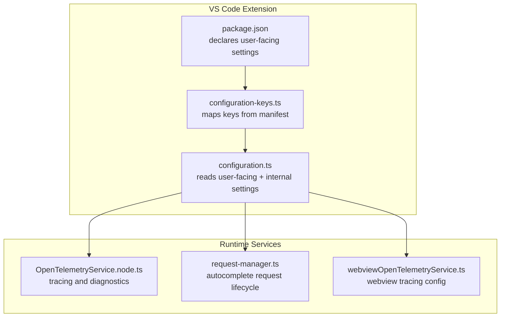
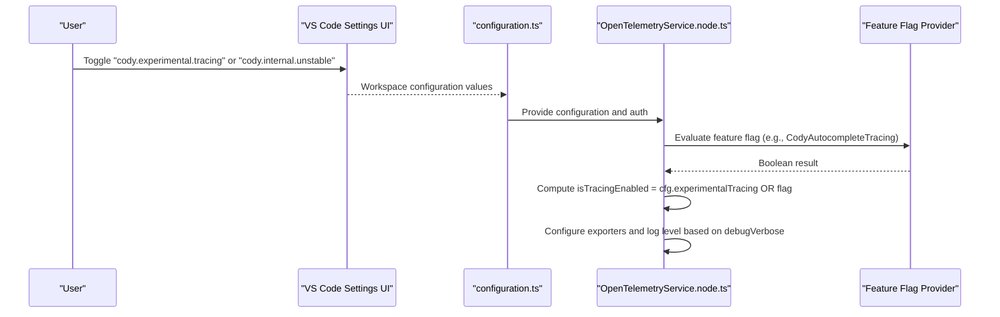
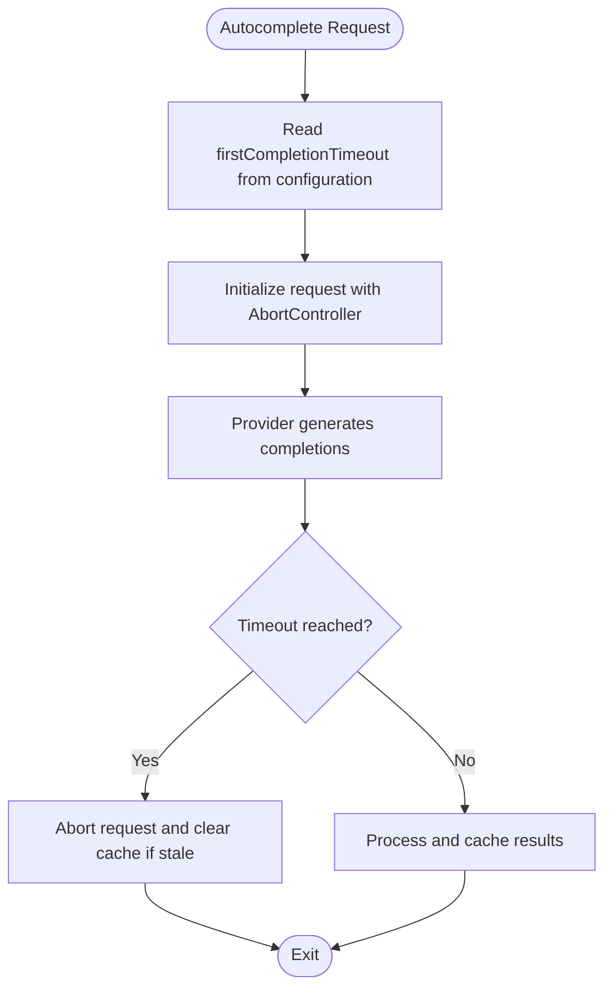
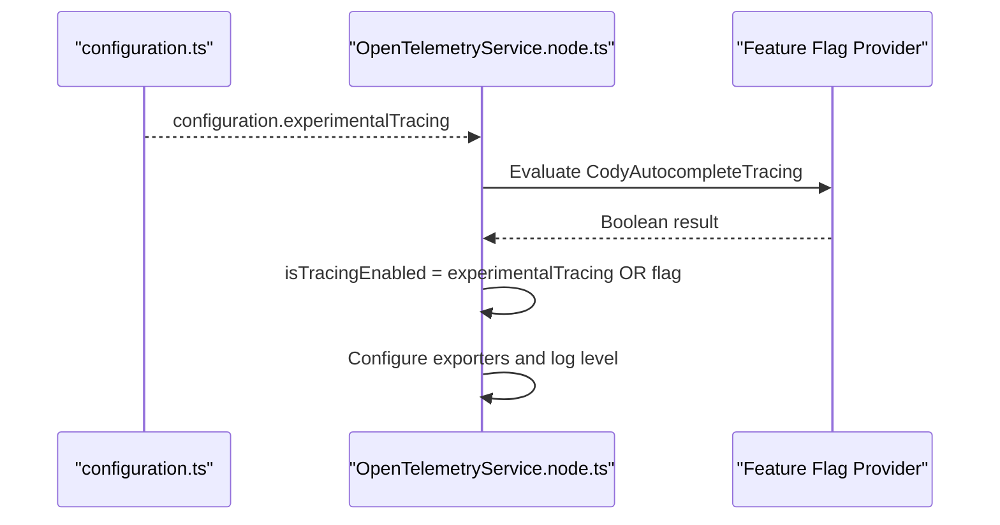
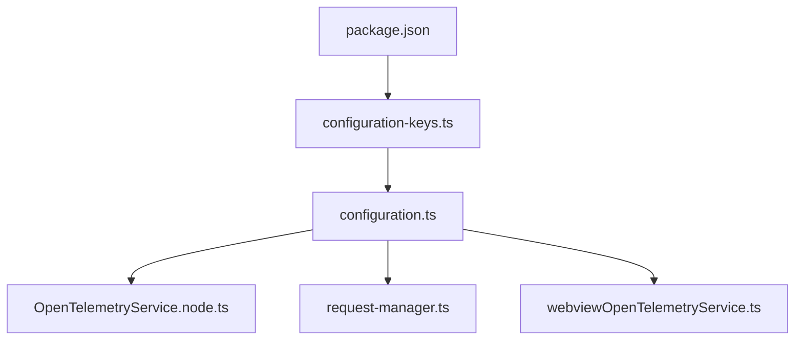

# Hidden & Advanced Settings

<cite>
**Referenced Files in This Document**
- [configuration.ts](file://vscode/src/configuration.ts)
- [configuration-keys.ts](file://vscode/src/configuration-keys.ts)
- [package.json](file://vscode/package.json)
- [OpenTelemetryService.node.ts](file://vscode/src/services/open-telemetry/OpenTelemetryService.node.ts)
- [webviewOpenTelemetryService.ts](file://vscode/webviews/utils/webviewOpenTelemetryService.ts)
- [request-manager.ts](file://vscode/src/completions/request-manager.ts)
- [StateDebugOverlay.tsx](file://vscode/webviews/components/StateDebugOverlay.tsx)
- [ContextCell.tsx](file://vscode/webviews/chat/cells/contextCell/ContextCell.tsx)
- [features.json5](file://vscode/features.json5)
- [features.json5](file://jetbrains/features.json5)
</cite>

## Table of Contents
1. [Introduction](#introduction)
2. [Project Structure](#project-structure)
3. [Core Components](#core-components)
4. [Architecture Overview](#architecture-overview)
5. [Detailed Component Analysis](#detailed-component-analysis)
6. [Dependency Analysis](#dependency-analysis)
7. [Performance Considerations](#performance-considerations)
8. [Troubleshooting Guide](#troubleshooting-guide)
9. [Conclusion](#conclusion)

## Introduction
This document explains hidden and advanced configuration settings in the Cody platform. It focuses on internal/debug settings, experimental features, performance tuning, and development configurations. It also clarifies the distinction between user-facing settings and internal-only configurations, and documents how hidden settings relate to feature flags and the broader configuration system.

## Project Structure
The configuration system is defined in the VS Code extension and consumed by runtime components:
- User-facing settings are declared in the extension manifest and surfaced in settings UI.
- Internal/debug settings are read via a dedicated getter and used to toggle low-level behaviors.
- Feature flags (server-side or evaluated client-side) can gate or augment behavior alongside configuration.

**Diagram sources**
- [package.json:877-1271](file://vscode/package.json#L877-L1271)
- [configuration-keys.ts:1-55](file://vscode/src/configuration-keys.ts#L1-L55)
- [configuration.ts:25-204](file://vscode/src/configuration.ts#L25-L204)
- [OpenTelemetryService.node.ts:65-99](file://vscode/src/services/open-telemetry/OpenTelemetryService.node.ts#L65-L99)
- [request-manager.ts:116-214](file://vscode/src/completions/request-manager.ts#L116-L214)
- [webviewOpenTelemetryService.ts:26-47](file://vscode/webviews/utils/webviewOpenTelemetryService.ts#L26-L47)

**Section sources**
- [package.json:877-1271](file://vscode/package.json#L877-L1271)
- [configuration-keys.ts:1-55](file://vscode/src/configuration-keys.ts#L1-L55)
- [configuration.ts:25-204](file://vscode/src/configuration.ts#L25-L204)

## Core Components
- User-facing settings: Defined in the extension manifest and surfaced in the settings UI. Examples include autocomplete behavior, provider selection, and network/proxy settings.
- Internal-only settings: Accessed via a dedicated getter and intended for debugging, development, or unstable features. They are not exposed in the settings UI.
- Feature flags: Evaluated client-side or controlled server-side to enable experimental capabilities.

Key responsibilities:
- configuration.ts reads and normalizes all settings, including internal-only toggles.
- OpenTelemetryService.node.ts uses configuration and feature flags to enable tracing.
- request-manager.ts applies timeouts and caching policies informed by configuration.

**Section sources**
- [configuration.ts:25-204](file://vscode/src/configuration.ts#L25-L204)
- [OpenTelemetryService.node.ts:65-99](file://vscode/src/services/open-telemetry/OpenTelemetryService.node.ts#L65-L99)
- [request-manager.ts:116-214](file://vscode/src/completions/request-manager.ts#L116-L214)

## Architecture Overview
The configuration pipeline integrates user-facing settings, internal toggles, and feature flags to drive runtime behavior. Tracing is enabled when either the internal tracing toggle or a feature flag is active.

**Diagram sources**
- [configuration.ts:95-146](file://vscode/src/configuration.ts#L95-L146)
- [OpenTelemetryService.node.ts:65-99](file://vscode/src/services/open-telemetry/OpenTelemetryService.node.ts#L65-L99)

**Section sources**
- [configuration.ts:95-146](file://vscode/src/configuration.ts#L95-L146)
- [OpenTelemetryService.node.ts:65-99](file://vscode/src/services/open-telemetry/OpenTelemetryService.node.ts#L65-L99)

## Detailed Component Analysis

### Hidden/Internal Settings
These settings are not exposed in the settings UI and are intended for internal use or advanced debugging. They are read via a dedicated getter and often gated behind a master internal toggle.

- Internal unstable master switch
  - Purpose: Enables additional unstable or experimental internal features.
  - Consumption: Used to unlock developer-only commands and behaviors.
  - Risk: May introduce instability; use only when instructed.

- Internal debug toggles
  - internal.debug.context: Enables alternate context ranking UI in chat.
  - internal.debug.state: Exposes a state debug overlay in the webview.
  - internal.debug.tokenUsage: Displays token usage in chat messages.

- Autocomplete advanced controls
  - autocomplete.advanced.model: Override model for advanced autocomplete.
  - autocomplete.advanced.timeout.firstCompletion: Tune first-completion timeout.
  - autocomplete.experimental.graphContext: Enable graph-based context retrieval.
  - autocomplete.experimental.ollamaOptions: Configure Ollama provider options.
  - autocomplete.experimental.fireworksOptions: Configure direct Fireworks provider options.

- Experimental features
  - experimental.tracing: Enable OpenTelemetry tracing.
  - experimental.supercompletions: Enable supercompletions feature.
  - experimental.noodle: Enable history explanation command gating.
  - experimental.autoedit.config.override: Override auto-edit provider configuration.
  - experimental.autoedit-renderer-testing: Enable auto-edit renderer testing mode.
  - experimental.minion.anthropicKey: Provide Anthropic key for internal testing.
  - experimental.noxide.enabled: Toggle internal Noxide feature.
  - experimental.guardrailsTimeoutSeconds: Adjust guardrails timeout.

- Agent and advanced environment
  - advanced.agent.running: Indicates running inside an agent.
  - advanced.hasNativeWebview: Indicates native webview availability.
  - advanced.agent.ide.name/version/extension.version: Agent environment metadata.
  - advanced.agent.capabilities.storage: Persistent storage capability.

- Developer overrides
  - telemetry.clientName: Override telemetry client name.
  - override.authToken/override.serverEndpoint: Force auth token or server endpoint.

Why and when to use:
- Use internal debug toggles to inspect internal state or context ranking during development.
- Tune autocomplete timeouts when experiencing slow completions or latency-sensitive environments.
- Enable experimental.tracing to diagnose autocomplete performance and provider issues.
- Use developer overrides only in controlled testing scenarios.

Risks and implications:
- Internal toggles may change or be removed without notice.
- Overriding server endpoint or auth token can break authentication or routing.
- Enabling experimental features may degrade stability or performance.

**Section sources**
- [configuration.ts:128-203](file://vscode/src/configuration.ts#L128-L203)
- [package.json:1141-1146](file://vscode/package.json#L1141-L1146)
- [package.json:1147-1152](file://vscode/package.json#L1147-L1152)
- [package.json:1153-1162](file://vscode/package.json#L1153-L1162)
- [package.json:1164-1175](file://vscode/package.json#L1164-L1175)
- [package.json:1176-1181](file://vscode/package.json#L1176-L1181)
- [package.json:1182-1188](file://vscode/package.json#L1182-L1188)
- [package.json:1190-1213](file://vscode/package.json#L1190-L1213)
- [package.json:1214-1222](file://vscode/package.json#L1214-L1222)
- [package.json:1223-1269](file://vscode/package.json#L1223-L1269)

### Autocomplete Timeout Controls
The first-completion timeout is configurable via an internal setting. It influences how quickly the first autocomplete response is considered stale or requires cancellation.

Behavior:
- The timeout is read from configuration with a default value.
- RequestManager coordinates request lifecycles and cancels irrelevant inflight requests.

**Diagram sources**
- [configuration.ts:186-189](file://vscode/src/configuration.ts#L186-L189)
- [request-manager.ts:116-214](file://vscode/src/completions/request-manager.ts#L116-L214)

**Section sources**
- [configuration.ts:186-189](file://vscode/src/configuration.ts#L186-L189)
- [request-manager.ts:116-214](file://vscode/src/completions/request-manager.ts#L116-L214)

### Tracing Options
Two complementary mechanisms enable tracing:
- Internal toggle: cody.experimental.tracing
- Feature flag: Evaluated client-side (e.g., CodyAutocompleteTracing)

OpenTelemetryService computes whether tracing is enabled by combining configuration and feature flags, then configures exporters and diagnostic log level.

**Diagram sources**
- [configuration.ts:146-146](file://vscode/src/configuration.ts#L146-L146)
- [OpenTelemetryService.node.ts:65-99](file://vscode/src/services/open-telemetry/OpenTelemetryService.node.ts#L65-L99)

**Section sources**
- [configuration.ts:146-146](file://vscode/src/configuration.ts#L146-L146)
- [OpenTelemetryService.node.ts:65-99](file://vscode/src/services/open-telemetry/OpenTelemetryService.node.ts#L65-L99)

### Debugging Utilities
- Debug verbosity and filtering
  - cody.debug.verbose enables verbose logging.
  - cody.debug.filter uses a regular expression to filter debug output.

- Internal debug overlays
  - internal.debug.state exposes a state debug overlay in the webview.
  - internal.debug.context enables alternate context ranking UI in chat.

- Telemetry client name override
  - telemetry.clientName allows overriding the telemetry client name for testing.

**Section sources**
- [configuration.ts:93-95](file://vscode/src/configuration.ts#L93-L95)
- [configuration.ts:136-138](file://vscode/src/configuration.ts#L136-L138)
- [configuration.ts:193-193](file://vscode/src/configuration.ts#L193-L193)
- [StateDebugOverlay.tsx:32-69](file://vscode/webviews/components/StateDebugOverlay.tsx#L32-L69)
- [ContextCell.tsx:172-183](file://vscode/webviews/chat/cells/contextCell/ContextCell.tsx#L172-L183)

### Relationship Between Hidden Settings and Feature Flags
- Internal toggles can gate developer-only commands and behaviors.
- Feature flags can independently enable or augment functionality (e.g., autocomplete tracing).
- OpenTelemetryService combines both to decide tracing behavior.

Practical implications:
- A feature flag may enable a capability even if the related internal toggle is off.
- Internal toggles can expose unstable behavior that is not yet available via feature flags.

**Section sources**
- [configuration.ts:128-135](file://vscode/src/configuration.ts#L128-L135)
- [OpenTelemetryService.node.ts:65-99](file://vscode/src/services/open-telemetry/OpenTelemetryService.node.ts#L65-L99)

### Configuration Validation, Stability, and Support
- User-facing settings are validated by the extension manifest and surfaced in the settings UI.
- Internal-only settings are not validated by the manifest and are intended for advanced users or developers.
- Experimental features may lack long-term stability guarantees and can change without notice.
- Support implications:
  - Internal toggles and experimental features are typically unsupported or require special arrangements.
  - When reporting issues, include relevant internal toggles and feature flags that were enabled.

**Section sources**
- [package.json:877-1271](file://vscode/package.json#L877-L1271)
- [configuration.ts:128-135](file://vscode/src/configuration.ts#L128-L135)

## Dependency Analysis
The configuration system interacts with tracing, autocomplete request management, and webview utilities.

**Diagram sources**
- [configuration.ts:25-204](file://vscode/src/configuration.ts#L25-L204)
- [package.json:877-1271](file://vscode/package.json#L877-L1271)
- [configuration-keys.ts:1-55](file://vscode/src/configuration-keys.ts#L1-L55)
- [OpenTelemetryService.node.ts:65-99](file://vscode/src/services/open-telemetry/OpenTelemetryService.node.ts#L65-L99)
- [request-manager.ts:116-214](file://vscode/src/completions/request-manager.ts#L116-L214)
- [webviewOpenTelemetryService.ts:26-47](file://vscode/webviews/utils/webviewOpenTelemetryService.ts#L26-L47)

**Section sources**
- [configuration.ts:25-204](file://vscode/src/configuration.ts#L25-L204)
- [OpenTelemetryService.node.ts:65-99](file://vscode/src/services/open-telemetry/OpenTelemetryService.node.ts#L65-L99)
- [request-manager.ts:116-214](file://vscode/src/completions/request-manager.ts#L116-L214)

## Performance Considerations
- Autocomplete timeout tuning:
  - Lower timeouts reduce perceived latency but may increase stale requests.
  - Higher timeouts improve accuracy but risk blocking the UI.
- Tracing overhead:
  - Enabling tracing adds CPU and memory overhead; use only when diagnosing issues.
  - Verbose debug logging increases I/O and can slow operations.
- Graph context and local providers:
  - Graph-based context retrieval may increase latency depending on repository size.
  - On-device inference may reduce latency but can cause request divergence if the document context changes rapidly.

[No sources needed since this section provides general guidance]

## Troubleshooting Guide
Common scenarios and remedies:
- Slow autocomplete:
  - Adjust autocomplete.advanced.timeout.firstCompletion to balance responsiveness and accuracy.
  - Disable experimental.graphContext if repository size is large.
- Tracing issues:
  - Verify cody.experimental.tracing is enabled or the feature flag is active.
  - Check debugVerbose to increase diagnostic logging.
- Debug overlays:
  - Enable internal.debug.state and internal.debug.context to inspect internal state and context ranking.
- Authentication or endpoint issues:
  - Use override.authToken or override.serverEndpoint only for testing; revert afterward.

**Section sources**
- [configuration.ts:146-146](file://vscode/src/configuration.ts#L146-L146)
- [configuration.ts:186-189](file://vscode/src/configuration.ts#L186-L189)
- [configuration.ts:136-138](file://vscode/src/configuration.ts#L136-L138)
- [OpenTelemetryService.node.ts:101-106](file://vscode/src/services/open-telemetry/OpenTelemetryService.node.ts#L101-L106)

## Conclusion
Hidden and advanced settings in Cody provide powerful controls for debugging, performance tuning, and accessing experimental features. While user-facing settings govern everyday behavior, internal-only toggles enable deep inspection and development workflows. Always exercise caution when enabling experimental features and internal toggles, and prefer stable user-facing settings for daily use. Combine configuration settings with feature flags to achieve the desired behavior, and leverage tracing and debug overlays to diagnose issues efficiently.