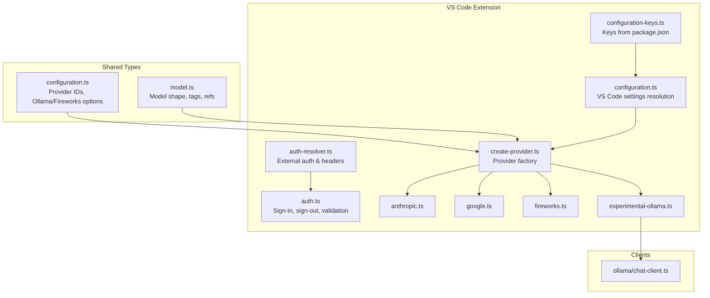
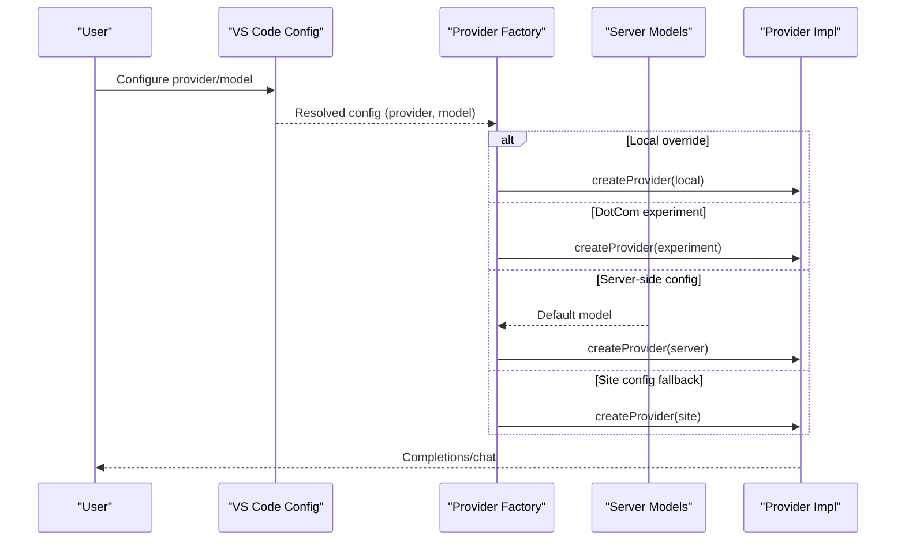
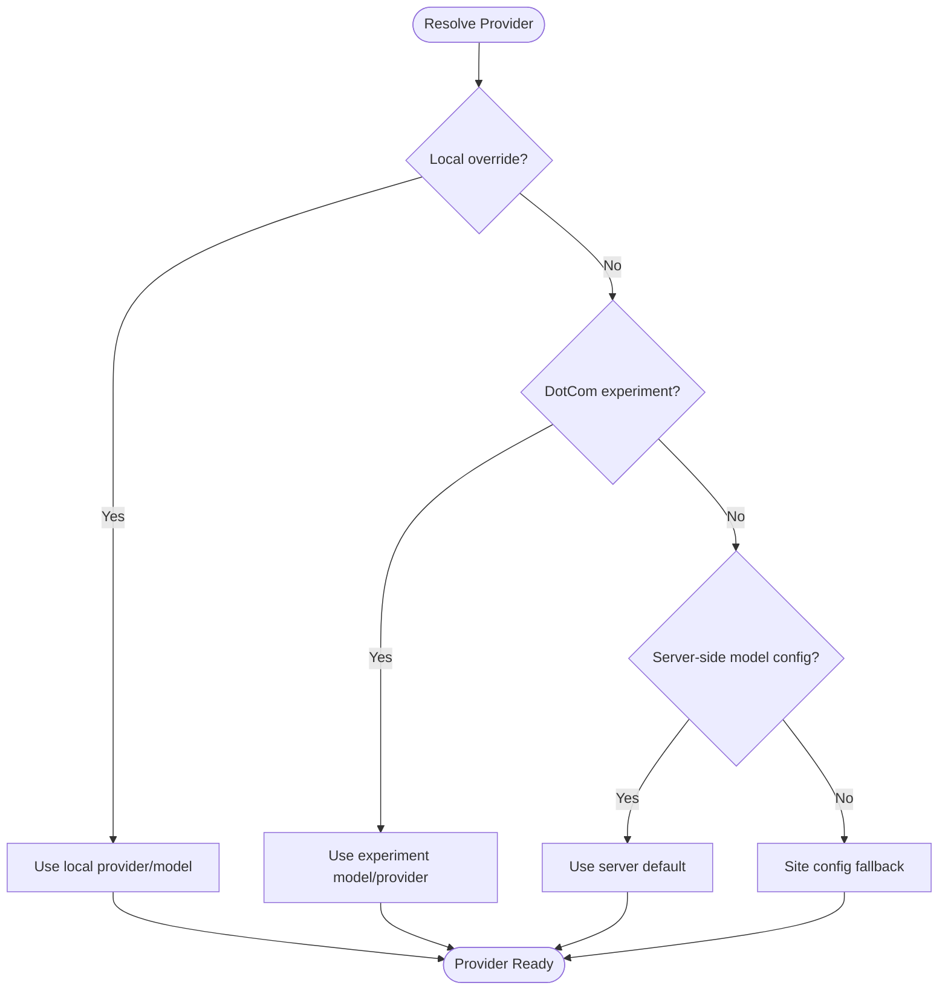
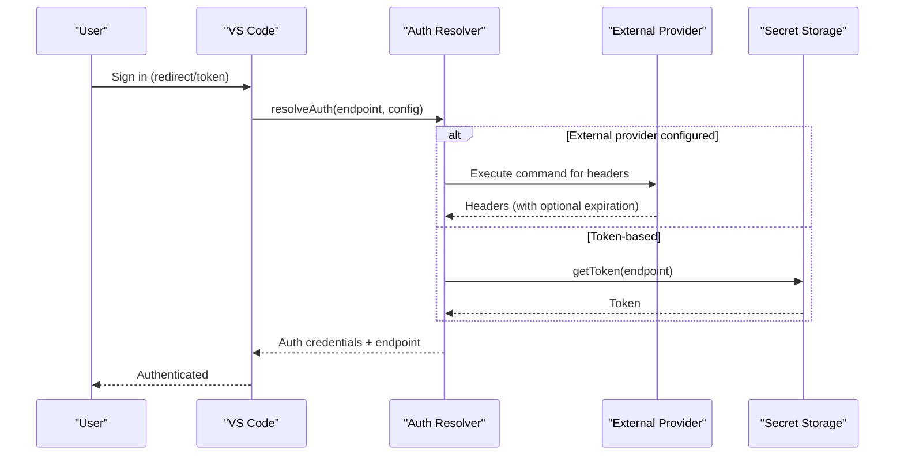
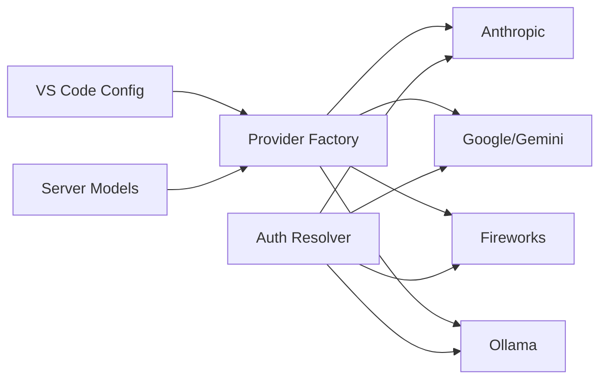

# LLM Provider Configuration

<cite>
**Referenced Files in This Document**
- [configuration.ts](file://lib/shared/src/configuration.ts)
- [configuration.ts](file://vscode/src/configuration.ts)
- [configuration-keys.ts](file://vscode/src/configuration-keys.ts)
- [auth-resolver.ts](file://lib/shared/src/configuration/auth-resolver.ts)
- [auth.ts](file://vscode/src/auth/auth.ts)
- [model.ts](file://lib/shared/src/models/model.ts)
- [create-provider.ts](file://vscode/src/completions/providers/shared/create-provider.ts)
- [anthropic.ts](file://vscode/src/completions/providers/anthropic.ts)
- [google.ts](file://vscode/src/completions/providers/google.ts)
- [fireworks.ts](file://vscode/src/completions/providers/fireworks.ts)
- [experimental-ollama.ts](file://vscode/src/completions/providers/experimental-ollama.ts)
- [chat-client.ts](file://lib/shared/src/llm-providers/ollama/chat-client.ts)
- [sync.ts](file://lib/shared/src/models/sync.ts)
- [nodeClient.ts](file://vscode/src/completions/nodeClient.ts)
- [ChatModelIcon.tsx](file://vscode/webviews/components/ChatModelIcon.tsx)
- [ModelUtil.kt](file://jetbrains/src/main/kotlin/com/sourcegraph/cody/agent/protocol_extensions/ModelUtil.kt)
- [create-provider-mocks.ts](file://vscode/src/completions/providers/shared/__mocks__/create-provider-mocks.ts)
</cite>

## Table of Contents
1. [Introduction](#introduction)
2. [Project Structure](#project-structure)
3. [Core Components](#core-components)
4. [Architecture Overview](#architecture-overview)
5. [Detailed Component Analysis](#detailed-component-analysis)
6. [Dependency Analysis](#dependency-analysis)
7. [Performance Considerations](#performance-considerations)
8. [Troubleshooting Guide](#troubleshooting-guide)
9. [Conclusion](#conclusion)

## Introduction
This document explains how the Cody platform configures and uses Large Language Model (LLM) providers. It covers supported providers (OpenAI-compatible, Anthropic, Google/Gemini, Fireworks, and Ollama), model selection, API key and authentication management, provider-specific configuration, advanced settings, and operational guidance such as rate limiting, fallbacks, and cost optimization.

## Project Structure
Cody’s LLM configuration spans shared configuration types, VS Code extension configuration resolution, provider factories, and provider-specific implementations. The structure enables:
- Centralized provider IDs and configuration shapes
- Editor-level configuration resolution and overrides
- Dynamic provider selection based on server-side model configuration or local settings
- Provider-specific request construction and client integrations

**Diagram sources**
- [configuration.ts:256-347](file://lib/shared/src/configuration.ts#L256-L347)
- [model.ts:25-121](file://lib/shared/src/models/model.ts#L25-L121)
- [configuration.ts:25-204](file://vscode/src/configuration.ts#L25-L204)
- [configuration-keys.ts:18-55](file://vscode/src/configuration-keys.ts#L18-L55)
- [auth-resolver.ts:129-159](file://lib/shared/src/configuration/auth-resolver.ts#L129-L159)
- [auth.ts:61-77](file://vscode/src/auth/auth.ts#L61-L77)
- [create-provider.ts:31-130](file://vscode/src/completions/providers/shared/create-provider.ts#L31-L130)
- [anthropic.ts:70-82](file://vscode/src/completions/providers/anthropic.ts#L70-L82)
- [google.ts:28-46](file://vscode/src/completions/providers/google.ts#L28-L46)
- [fireworks.ts:195-211](file://vscode/src/completions/providers/fireworks.ts#L195-L211)
- [experimental-ollama.ts:213-221](file://vscode/src/completions/providers/experimental-ollama.ts#L213-L221)
- [chat-client.ts:46-88](file://lib/shared/src/llm-providers/ollama/chat-client.ts#L46-L88)

**Section sources**
- [configuration.ts:256-347](file://lib/shared/src/configuration.ts#L256-L347)
- [configuration.ts:25-204](file://vscode/src/configuration.ts#L25-L204)
- [configuration-keys.ts:18-55](file://vscode/src/configuration-keys.ts#L18-L55)
- [auth-resolver.ts:129-159](file://lib/shared/src/configuration/auth-resolver.ts#L129-L159)
- [auth.ts:61-77](file://vscode/src/auth/auth.ts#L61-L77)
- [create-provider.ts:31-130](file://vscode/src/completions/providers/shared/create-provider.ts#L31-L130)
- [model.ts:25-121](file://lib/shared/src/models/model.ts#L25-L121)

## Core Components
- Provider IDs and configuration shapes:
  - Provider identifiers include default, OpenAI, Azure OpenAI, Anthropic, Google/Gemini, Fireworks, AWS Bedrock, and Ollama variants.
  - Ollama options define URL, model, and generation parameters.
  - Fireworks options define URL, token, model, and optional parameters.
- Model metadata:
  - Models carry provider, title, tags, usage, and context window.
  - Server-provided models are transformed into client-side models with tags and capabilities.
- Configuration resolution:
  - VS Code settings map to a normalized client configuration, including autocomplete provider/model, Ollama/Fireworks options, and hidden/internal toggles.
  - Keys are inferred from the extension manifest to ensure type safety.

**Section sources**
- [configuration.ts:256-347](file://lib/shared/src/configuration.ts#L256-L347)
- [configuration.ts:349-480](file://lib/shared/src/configuration.ts#L349-L480)
- [model.ts:25-121](file://lib/shared/src/models/model.ts#L25-L121)
- [configuration.ts:25-204](file://vscode/src/configuration.ts#L25-L204)
- [configuration-keys.ts:18-55](file://vscode/src/configuration-keys.ts#L18-L55)

## Architecture Overview
Cody selects a provider based on configuration precedence:
1. Local editor settings (advanced provider/model)
2. DotCom experiment model (A/B testing)
3. Server-side model configuration (enterprise)
4. Site configuration fallback

Provider factories route to Anthropic, Google/Gemini, Fireworks, or Ollama implementations. Authentication and headers are resolved centrally, supporting both token-based and external provider flows.

**Diagram sources**
- [create-provider.ts:31-130](file://vscode/src/completions/providers/shared/create-provider.ts#L31-L130)
- [anthropic.ts:70-82](file://vscode/src/completions/providers/anthropic.ts#L70-L82)
- [google.ts:28-46](file://vscode/src/completions/providers/google.ts#L28-L46)
- [fireworks.ts:195-211](file://vscode/src/completions/providers/fireworks.ts#L195-L211)
- [experimental-ollama.ts:213-221](file://vscode/src/completions/providers/experimental-ollama.ts#L213-L221)

## Detailed Component Analysis

### Supported Providers and Selection
- Provider IDs:
  - Default, OpenAI, Azure OpenAI, Anthropic, Google/Gemini, Fireworks, AWS Bedrock, Ollama variants.
- Selection logic:
  - Local settings override server defaults.
  - DotCom experiments can switch models dynamically.
  - Server-side model configuration determines provider and model when available.
  - Site configuration acts as a fallback.

**Diagram sources**
- [create-provider.ts:31-130](file://vscode/src/completions/providers/shared/create-provider.ts#L31-L130)

**Section sources**
- [create-provider.ts:183-231](file://vscode/src/completions/providers/shared/create-provider.ts#L183-L231)
- [create-provider.ts:236-261](file://vscode/src/completions/providers/shared/create-provider.ts#L236-L261)

### OpenAI-Compatible Provider
- Purpose: Unified integration for OpenAI-compatible APIs.
- Behavior: Provider factory routes OpenAI/Azure/OpenAI-compatible to a unified implementation.
- Configuration: Uses server-side openAICompatible flag to select the compatible provider.

**Section sources**
- [create-provider.ts:193-195](file://vscode/src/completions/providers/shared/create-provider.ts#L193-L195)
- [create-provider.ts:197-203](file://vscode/src/completions/providers/shared/create-provider.ts#L197-L203)

### Anthropic Provider
- Purpose: Claude models via Anthropic API.
- Behavior:
  - On DotCom, uses a default Claude model.
  - Otherwise uses the configured model or a BYOK placeholder.
- Notes: Supports switching between providers when using Cody Gateway.

**Section sources**
- [anthropic.ts:58-82](file://vscode/src/completions/providers/anthropic.ts#L58-L82)

### Google/Gemini Provider
- Purpose: Gemini models via Google APIs.
- Behavior:
  - Validates supported model IDs.
  - Constructs request parameters with model and messages.
- Compatibility: Limited to known Gemini models.

**Section sources**
- [google.ts:26-46](file://vscode/src/completions/providers/google.ts#L26-L46)

### Fireworks Provider
- Purpose: Fireworks-hosted models.
- Behavior:
  - Maps virtual and real model IDs to Fireworks identifiers.
  - Supports fast-path for DotCom/local instances to bypass the Sourcegraph backend.
  - Adds tracing headers when enabled.
- Context window: Per-model token limits.

**Section sources**
- [fireworks.ts:35-84](file://vscode/src/completions/providers/fireworks.ts#L35-L84)
- [fireworks.ts:114-178](file://vscode/src/completions/providers/fireworks.ts#L114-L178)
- [fireworks.ts:180-211](file://vscode/src/completions/providers/fireworks.ts#L180-L211)

### Ollama Provider (Experimental)
- Purpose: Local inference via Ollama REST API.
- Behavior:
  - Reads Ollama options from resolved configuration (URL, model, parameters).
  - Builds prompts and request options tailored to Ollama.
  - Applies timeouts and zipped generators for multiple completions.
- Notes: Intended for local development and offline use.

**Section sources**
- [experimental-ollama.ts:77-82](file://vscode/src/completions/providers/experimental-ollama.ts#L77-L82)
- [experimental-ollama.ts:146-162](file://vscode/src/completions/providers/experimental-ollama.ts#L146-L162)
- [experimental-ollama.ts:164-211](file://vscode/src/completions/providers/experimental-ollama.ts#L164-L211)
- [chat-client.ts:46-88](file://lib/shared/src/llm-providers/ollama/chat-client.ts#L46-L88)

### Model Metadata and Tags
- Model shape includes provider, title, tags, usage, and context window.
- Server-provided models are transformed to client models with tags reflecting tier, vision, reasoning, and categories.
- Legacy model IDs are derived from model references.

**Section sources**
- [model.ts:25-121](file://lib/shared/src/models/model.ts#L25-L121)
- [model.ts:138-189](file://lib/shared/src/models/model.ts#L138-L189)
- [model.ts:242-276](file://lib/shared/src/models/model.ts#L242-L276)

### Provider-Specific Configuration Options
- OpenAI-compatible:
  - Provider factory selects compatible implementation when server indicates openAICompatible.
- Anthropic:
  - Uses default model on DotCom; otherwise respects configured model or BYOK.
- Google/Gemini:
  - Enforces supported model list.
- Fireworks:
  - Supports fast-path, custom headers for tracing, and per-model context windows.
- Ollama:
  - URL, model, and extensive generation parameters (seed, temperature, top_k, top_p, num_ctx, num_predict, num_thread, mirostat, etc.).

**Section sources**
- [create-provider.ts:193-195](file://vscode/src/completions/providers/shared/create-provider.ts#L193-L195)
- [anthropic.ts:58-82](file://vscode/src/completions/providers/anthropic.ts#L58-L82)
- [google.ts:26-46](file://vscode/src/completions/providers/google.ts#L26-L46)
- [fireworks.ts:114-178](file://vscode/src/completions/providers/fireworks.ts#L114-L178)
- [configuration.ts:349-480](file://lib/shared/src/configuration.ts#L349-L480)

### Authentication and API Keys
- Authentication resolution:
  - Supports external auth providers that return headers via a command.
  - Falls back to token-based credentials from secret storage.
  - Allows endpoint and token overrides for testing.
- VS Code sign-in flow:
  - Redirect-based or token-based sign-in.
  - Validation checks user info and handles network/availability errors.
- Headers and custom headers:
  - Custom headers can be supplied globally and merged per request.

**Diagram sources**
- [auth-resolver.ts:129-159](file://lib/shared/src/configuration/auth-resolver.ts#L129-L159)
- [auth.ts:61-77](file://vscode/src/auth/auth.ts#L61-L77)
- [auth.ts:458-569](file://vscode/src/auth/auth.ts#L458-L569)

**Section sources**
- [auth-resolver.ts:129-159](file://lib/shared/src/configuration/auth-resolver.ts#L129-L159)
- [auth.ts:61-77](file://vscode/src/auth/auth.ts#L61-L77)
- [auth.ts:458-569](file://vscode/src/auth/auth.ts#L458-L569)

### Advanced Settings and Custom Endpoints
- Ollama:
  - URL, model, and generation parameters configurable via resolved configuration.
- Fireworks:
  - Custom URL, token, model, and optional parameters.
- Custom headers:
  - Global custom headers applied to requests.
- Proxy/network:
  - Proxy endpoint, CA cert, and certificate validation settings.

**Section sources**
- [configuration.ts:75-93](file://vscode/src/configuration.ts#L75-L93)
- [configuration.ts:164-174](file://vscode/src/configuration.ts#L164-L174)
- [configuration.ts:85-93](file://lib/shared/src/configuration.ts#L85-L93)
- [configuration.ts:475-528](file://lib/shared/src/configuration.ts#L475-L528)

### Model Parameter Tuning (Ollama)
- Generation parameters include seed, num_ctx, temperature, stop, top_k, top_p, num_thread, num_predict, mirostat, mirostat_eta, mirostat_tau, num_gqa, num_gpu, repeat_last_n, repeat_penalty, tfs_z.
- These map to Ollama client options and are applied to requests.

**Section sources**
- [configuration.ts:372-473](file://lib/shared/src/configuration.ts#L372-L473)
- [chat-client.ts:46-88](file://lib/shared/src/llm-providers/ollama/chat-client.ts#L46-L88)

### Provider-Specific Limitations and Compatibility
- Google/Gemini:
  - Only specific Gemini models are supported by the provider.
- Anthropic:
  - Supports switching providers via Cody Gateway when allowlisted.
- Fireworks:
  - Fast-path requires DotCom/local and Node.js streaming support.
- Ollama:
  - Designed for local inference; prompt construction and context sizing optimized for local latency.

**Section sources**
- [google.ts:26-46](file://vscode/src/completions/providers/google.ts#L26-L46)
- [anthropic.ts:46-56](file://vscode/src/completions/providers/anthropic.ts#L46-L56)
- [fireworks.ts:114-178](file://vscode/src/completions/providers/fireworks.ts#L114-L178)
- [experimental-ollama.ts:58-75](file://vscode/src/completions/providers/experimental-ollama.ts#L58-L75)

### Rate Limiting and Fallback Mechanisms
- Rate limiting detection:
  - HTTP 429 handling includes upgrade eligibility, retry-after, and limits via headers.
- Model fallback:
  - When rate limits are hit, models may be temporarily disabled and re-enabled later.

**Section sources**
- [nodeClient.ts:146-165](file://vscode/src/completions/nodeClient.ts#L146-L165)
- [sync.ts:366-401](file://lib/shared/src/models/sync.ts#L366-L401)

### Cost Optimization Strategies
- Provider selection:
  - Choose providers aligned with cost targets and performance.
- Model tuning:
  - Adjust temperature, top_p, and context window to balance quality and cost.
- Fast-path:
  - Using Fireworks fast-path reduces round-trips for DotCom/local instances.
- Context window:
  - Respect per-model token limits to avoid unnecessary costs.

[No sources needed since this section provides general guidance]

### Examples of Common Scenarios
- Switching providers:
  - Configure advanced provider and model in local settings; provider factory will route accordingly.
- Enterprise endpoints:
  - Use external auth provider to supply headers or configure token-based credentials.
- Optimizing performance:
  - Tune Ollama parameters for local inference latency.
  - Use Fireworks fast-path for DotCom/local.

**Section sources**
- [create-provider.ts:31-130](file://vscode/src/completions/providers/shared/create-provider.ts#L31-L130)
- [auth-resolver.ts:129-159](file://lib/shared/src/configuration/auth-resolver.ts#L129-L159)
- [configuration.ts:349-480](file://lib/shared/src/configuration.ts#L349-L480)
- [fireworks.ts:114-178](file://vscode/src/completions/providers/fireworks.ts#L114-L178)

## Dependency Analysis
Provider selection depends on configuration precedence and server-side model configuration. Authentication is centralized with support for external providers and token-based credentials.

**Diagram sources**
- [create-provider.ts:31-130](file://vscode/src/completions/providers/shared/create-provider.ts#L31-L130)
- [auth-resolver.ts:129-159](file://lib/shared/src/configuration/auth-resolver.ts#L129-L159)

**Section sources**
- [create-provider.ts:31-130](file://vscode/src/completions/providers/shared/create-provider.ts#L31-L130)
- [auth-resolver.ts:129-159](file://lib/shared/src/configuration/auth-resolver.ts#L129-L159)

## Performance Considerations
- Ollama:
  - Prompt caching benefits from large prefix and minimal suffix to leverage cached evaluations.
- Fireworks:
  - Fast-path reduces latency for DotCom/local instances.
- Context window:
  - Respect per-model limits to avoid truncation and retries.

**Section sources**
- [experimental-ollama.ts:58-75](file://vscode/src/completions/providers/experimental-ollama.ts#L58-L75)
- [fireworks.ts:114-178](file://vscode/src/completions/providers/fireworks.ts#L114-L178)
- [fireworks.ts:56-84](file://vscode/src/completions/providers/fireworks.ts#L56-L84)

## Troubleshooting Guide
- Authentication failures:
  - Verify endpoint formatting and token validity; external provider command output must include headers.
- Rate limiting:
  - Inspect 429 responses and upgrade eligibility; retry-after and limit headers indicate policy.
- Provider-specific issues:
  - Anthropic: ensure model is allowlisted for gateway switching.
  - Google/Gemini: confirm model is in supported list.
  - Fireworks: ensure fast-path conditions are met and tracing headers are correct.
  - Ollama: confirm URL and model parameters; check client error handling.

**Section sources**
- [auth.ts:458-569](file://vscode/src/auth/auth.ts#L458-L569)
- [auth-resolver.ts:51-72](file://lib/shared/src/configuration/auth-resolver.ts#L51-L72)
- [nodeClient.ts:146-165](file://vscode/src/completions/nodeClient.ts#L146-L165)
- [anthropic.ts:46-56](file://vscode/src/completions/providers/anthropic.ts#L46-L56)
- [google.ts:26-46](file://vscode/src/completions/providers/google.ts#L26-L46)
- [fireworks.ts:114-178](file://vscode/src/completions/providers/fireworks.ts#L114-L178)
- [experimental-ollama.ts:164-211](file://vscode/src/completions/providers/experimental-ollama.ts#L164-L211)

## Conclusion
Cody’s LLM provider configuration offers flexible provider selection, robust authentication, and provider-specific tuning. By leveraging server-side model configuration, local overrides, and advanced settings, teams can optimize performance and cost while maintaining reliability across providers like OpenAI-compatible, Anthropic, Google/Gemini, Fireworks, and Ollama.