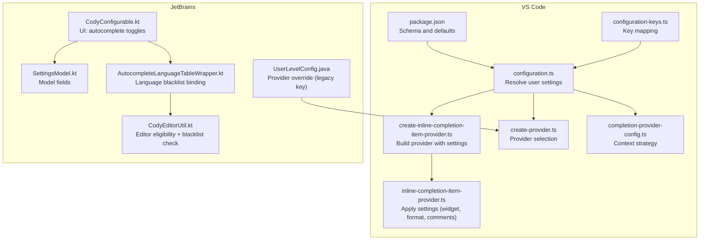
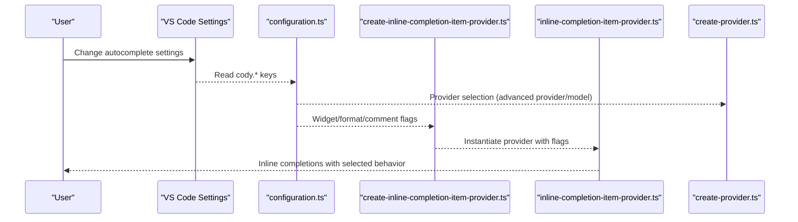
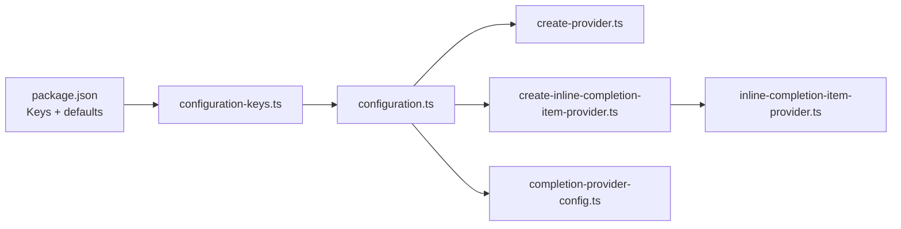

# Autocomplete Preferences

<cite>
**Referenced Files in This Document**
- [configuration.ts](file://vscode/src/configuration.ts)
- [configuration-keys.ts](file://vscode/src/configuration-keys.ts)
- [package.json](file://vscode/package.json)
- [inline-completion-item-provider.ts](file://vscode/src/completions/inline-completion-item-provider.ts)
- [create-inline-completion-item-provider.ts](file://vscode/src/completions/create-inline-completion-item-provider.ts)
- [create-provider.ts](file://vscode/src/completions/providers/shared/create-provider.ts)
- [completion-provider-config.ts](file://vscode/src/completions/completion-provider-config.ts)
- [CodyConfigurable.kt](file://jetbrains/src/main/kotlin/com/sourcegraph/cody/config/ui/CodyConfigurable.kt)
- [SettingsModel.kt](file://jetbrains/src/main/kotlin/com/sourcegraph/cody/config/SettingsModel.kt)
- [AutocompleteLanguageTableWrapper.kt](file://jetbrains/src/main/kotlin/com/sourcegraph/cody/config/ui/lang/AutocompleteLanguageTableWrapper.kt)
- [CodyEditorUtil.kt](file://jetbrains/src/main/kotlin/com/sourcegraph/utils/CodyEditorUtil.kt)
- [UserLevelConfig.java](file://jetbrains/src/main/java/com/sourcegraph/config/UserLevelConfig.java)
</cite>

## Table of Contents
1. [Introduction](#introduction)
2. [Project Structure](#project-structure)
3. [Core Components](#core-components)
4. [Architecture Overview](#architecture-overview)
5. [Detailed Component Analysis](#detailed-component-analysis)
6. [Dependency Analysis](#dependency-analysis)
7. [Performance Considerations](#performance-considerations)
8. [Troubleshooting Guide](#troubleshooting-guide)
9. [Conclusion](#conclusion)

## Introduction
This document explains autocomplete preferences in the Cody platform across the VS Code extension and JetBrains plugin. It covers suggestion modes, language-specific controls, format-on-accept behavior, widget selection options, provider configuration, and experimental features. Practical examples and troubleshooting guidance are included to help you configure autocomplete effectively and resolve common issues.

## Project Structure
The autocomplete configuration spans:
- VS Code extension configuration and runtime:
  - Configuration resolution and defaults
  - Provider creation and selection
  - Inline completion item provider behavior
- JetBrains plugin configuration UI and runtime:
  - Settings UI for autocomplete toggles and language blacklists
  - Runtime checks for editor eligibility and language blacklisting

**Diagram sources**
- [configuration.ts:25-204](file://vscode/src/configuration.ts#L25-L204)
- [package.json:877-1271](file://vscode/package.json#L877-L1271)
- [configuration-keys.ts:18-55](file://vscode/src/configuration-keys.ts#L18-L55)
- [create-inline-completion-item-provider.ts:70-89](file://vscode/src/completions/create-inline-completion-item-provider.ts#L70-L89)
- [inline-completion-item-provider.ts:134-161](file://vscode/src/completions/inline-completion-item-provider.ts#L134-L161)
- [create-provider.ts:31-130](file://vscode/src/completions/providers/shared/create-provider.ts#L31-L130)
- [completion-provider-config.ts:42-83](file://vscode/src/completions/completion-provider-config.ts#L42-L83)
- [CodyConfigurable.kt:26-109](file://jetbrains/src/main/kotlin/com/sourcegraph/cody/config/ui/CodyConfigurable.kt#L26-L109)
- [SettingsModel.kt:5-18](file://jetbrains/src/main/kotlin/com/sourcegraph/cody/config/SettingsModel.kt#L5-L18)
- [AutocompleteLanguageTableWrapper.kt:7-36](file://jetbrains/src/main/kotlin/com/sourcegraph/cody/config/ui/lang/AutocompleteLanguageTableWrapper.kt#L7-L36)
- [CodyEditorUtil.kt:108-136](file://jetbrains/src/main/kotlin/com/sourcegraph/utils/CodyEditorUtil.kt#L108-L136)
- [UserLevelConfig.java:15-30](file://jetbrains/src/main/java/com/sourcegraph/config/UserLevelConfig.java#L15-L30)

**Section sources**
- [configuration.ts:25-204](file://vscode/src/configuration.ts#L25-L204)
- [package.json:877-1271](file://vscode/package.json#L877-L1271)
- [configuration-keys.ts:18-55](file://vscode/src/configuration-keys.ts#L18-L55)
- [create-inline-completion-item-provider.ts:70-89](file://vscode/src/completions/create-inline-completion-item-provider.ts#L70-L89)
- [inline-completion-item-provider.ts:134-161](file://vscode/src/completions/inline-completion-item-provider.ts#L134-L161)
- [create-provider.ts:31-130](file://vscode/src/completions/providers/shared/create-provider.ts#L31-L130)
- [completion-provider-config.ts:42-83](file://vscode/src/completions/completion-provider-config.ts#L42-L83)
- [CodyConfigurable.kt:26-109](file://jetbrains/src/main/kotlin/com/sourcegraph/cody/config/ui/CodyConfigurable.kt#L26-L109)
- [SettingsModel.kt:5-18](file://jetbrains/src/main/kotlin/com/sourcegraph/cody/config/SettingsModel.kt#L5-L18)
- [AutocompleteLanguageTableWrapper.kt:7-36](file://jetbrains/src/main/kotlin/com/sourcegraph/cody/config/ui/lang/AutocompleteLanguageTableWrapper.kt#L7-L36)
- [CodyEditorUtil.kt:108-136](file://jetbrains/src/main/kotlin/com/sourcegraph/utils/CodyEditorUtil.kt#L108-L136)
- [UserLevelConfig.java:15-30](file://jetbrains/src/main/java/com/sourcegraph/config/UserLevelConfig.java#L15-L30)

## Core Components
- Suggestion mode and autocomplete enablement:
  - Suggestions mode controls whether autocomplete or auto-edit is active.
  - Autocomplete enablement toggles inline completions.
- Language-specific configuration:
  - Per-language enable/disable via a map keyed by language identifiers.
  - Default fallback is applied when no language-specific setting exists.
- Widget and format behavior:
  - Complete suggest widget selection into the completion.
  - Format on accept using the editor’s default formatter.
- Provider configuration:
  - Advanced provider selection and model overrides.
  - Provider-specific options (e.g., Ollama, Fireworks).
- Experimental features:
  - Graph context strategy, tracing, and other experimental flags.

Practical examples:
- Disable autocomplete for plaintext while keeping defaults:
  - Set cody.autocomplete.languages to include "*" as true and "plaintext" as false.
- Enable format-on-accept globally:
  - Set cody.autocomplete.formatOnAccept to true.
- Switch to an experimental provider:
  - Set cody.autocomplete.advanced.provider to "experimental-ollama" and configure cody.autocomplete.experimental.ollamaOptions.

**Section sources**
- [configuration.ts:50-115](file://vscode/src/configuration.ts#L50-L115)
- [package.json:907-917](file://vscode/package.json#L907-L917)
- [package.json:924-937](file://vscode/package.json#L924-L937)
- [package.json:1018-1022](file://vscode/package.json#L1018-L1022)
- [package.json:1023-1027](file://vscode/package.json#L1023-L1027)
- [package.json:1028-1032](file://vscode/package.json#L1028-L1032)
- [package.json:1008-1017](file://vscode/package.json#L1008-L1017)
- [package.json:1085-1120](file://vscode/package.json#L1085-L1120)
- [create-inline-completion-item-provider.ts:74-89](file://vscode/src/completions/create-inline-completion-item-provider.ts#L74-L89)
- [inline-completion-item-provider.ts:134-161](file://vscode/src/completions/inline-completion-item-provider.ts#L134-L161)

## Architecture Overview
The autocomplete pipeline resolves user preferences, selects a provider, and applies runtime behaviors to the inline completion item provider.

**Diagram sources**
- [configuration.ts:25-204](file://vscode/src/configuration.ts#L25-L204)
- [create-inline-completion-item-provider.ts:70-89](file://vscode/src/completions/create-inline-completion-item-provider.ts#L70-L89)
- [inline-completion-item-provider.ts:134-161](file://vscode/src/completions/inline-completion-item-provider.ts#L134-L161)
- [create-provider.ts:31-130](file://vscode/src/completions/providers/shared/create-provider.ts#L31-L130)

## Detailed Component Analysis

### Suggestion Modes and Autocomplete Enablement
- Suggestions mode:
  - Values: autocomplete, auto-edit, off.
  - Controls whether standard inline completions or advanced auto-edit mode is active.
- Autocomplete enablement:
  - Toggles inline completions on or off.

Behavior:
- When suggestions mode is set to auto-edit, the system normalizes the setting to the auto-edit mode internally.
- Autocomplete enablement is reflected in the resolved configuration and affects provider instantiation.

Practical example:
- To switch to auto-edit mode, set cody.suggestions.mode to "auto-edit".

**Section sources**
- [configuration.ts:50-72](file://vscode/src/configuration.ts#L50-L72)
- [package.json:907-917](file://vscode/package.json#L907-L917)

### Language-Specific Configuration and Blacklists
- Languages scope:
  - cody.autocomplete.languages is a map keyed by language identifiers.
  - Defaults to "*" as true, enabling autocomplete for all languages unless overridden.
- JetBrains UI:
  - The autocomplete settings UI exposes a language table to blacklist specific language IDs.
  - Runtime checks prevent autocomplete in blacklisted languages.

Practical example:
- Disable autocomplete for plaintext:
  - Set cody.autocomplete.languages to {"*": true, "plaintext": false}.
- JetBrains:
  - Use the autocomplete language table to select languages to exclude.

**Section sources**
- [package.json:924-937](file://vscode/package.json#L924-L937)
- [CodyConfigurable.kt:97-105](file://jetbrains/src/main/kotlin/com/sourcegraph/cody/config/ui/CodyConfigurable.kt#L97-L105)
- [AutocompleteLanguageTableWrapper.kt:22-28](file://jetbrains/src/main/kotlin/com/sourcegraph/cody/config/ui/lang/AutocompleteLanguageTableWrapper.kt#L22-L28)
- [CodyEditorUtil.kt:133-136](file://jetbrains/src/main/kotlin/com/sourcegraph/utils/CodyEditorUtil.kt#L133-L136)

### Widget Selection and Format-on-Accept
- Autocomplete complete suggest widget selection:
  - When enabled, the current suggest widget selection influences the completion inserted.
  - Requires VS Code user setting "editor.inlineSuggest.suppressSuggestions" to be true.
- Autocomplete format on accept:
  - When enabled, accepting a completion triggers the editor’s default formatter.

Runtime application:
- The inline completion item provider reads these flags and adjusts behavior accordingly.

Practical example:
- Enable widget selection integration:
  - Set cody.autocomplete.completeSuggestWidgetSelection to true.
- Enable formatting on accept:
  - Set cody.autocomplete.formatOnAccept to true.

**Section sources**
- [package.json:1018-1022](file://vscode/package.json#L1018-L1022)
- [package.json:1023-1027](file://vscode/package.json#L1023-L1027)
- [create-inline-completion-item-provider.ts:84-87](file://vscode/src/completions/create-inline-completion-item-provider.ts#L84-L87)
- [inline-completion-item-provider.ts:134-161](file://vscode/src/completions/inline-completion-item-provider.ts#L134-L161)

### Provider Configuration and Overrides
- Advanced provider:
  - cody.autocomplete.advanced.provider selects the provider ("default", "experimental-ollama").
  - "default" is recommended; "experimental-ollama" enables local inference via Ollama.
- Advanced model override:
  - cody.autocomplete.advanced.model allows overriding the model used by the provider.
- Provider-specific options:
  - Ollama options include URL, model, and parameters.
  - Fireworks options include URL, token, model, and parameters.

Resolution order:
- Local editor settings override take precedence.
- DotCom experiments may override provider/model.
- Server-side model configuration may be applied.
- Site configuration fallback is supported.

Practical example:
- Use Ollama locally:
  - Set cody.autocomplete.advanced.provider to "experimental-ollama".
  - Configure cody.autocomplete.experimental.ollamaOptions with URL and model.

**Section sources**
- [package.json:1008-1017](file://vscode/package.json#L1008-L1017)
- [package.json:1085-1120](file://vscode/package.json#L1085-L1120)
- [package.json:1049-1084](file://vscode/package.json#L1049-L1084)
- [create-provider.ts:31-130](file://vscode/src/completions/providers/shared/create-provider.ts#L31-L130)
- [create-provider.ts:183-231](file://vscode/src/completions/providers/shared/create-provider.ts#L183-L231)
- [UserLevelConfig.java:15-30](file://jetbrains/src/main/java/com/sourcegraph/config/UserLevelConfig.java#L15-L30)

### Experimental Features
- Graph context strategy:
  - cody.autocomplete.experimental.graphContext can be set to specific values to influence context retrieval.
- Tracing:
  - cody.experimental.tracing enables OpenTelemetry tracing for autocomplete.
- Other experimental flags:
  - Additional flags exist for internal or specialized use cases.

Practical example:
- Enable graph context strategy:
  - Set cody.autocomplete.experimental.graphContext to a supported value.

**Section sources**
- [package.json:1043-1048](file://vscode/package.json#L1043-L1048)
- [package.json:982-987](file://vscode/package.json#L982-L987)
- [completion-provider-config.ts:42-83](file://vscode/src/completions/completion-provider-config.ts#L42-L83)

### Comments and Autocomplete Behavior
- Disable inside comments:
  - cody.autocomplete.disableInsideComments prevents autocomplete requests while the cursor is inside comments.

Practical example:
- To avoid completions inside comments:
  - Set cody.autocomplete.disableInsideComments to true.

**Section sources**
- [package.json:1028-1032](file://vscode/package.json#L1028-L1032)
- [inline-completion-item-provider.ts:134-161](file://vscode/src/completions/inline-completion-item-provider.ts#L134-L161)

## Dependency Analysis
The autocomplete configuration depends on:
- Package schema for keys and defaults
- Configuration resolver for normalized values
- Provider factory for selecting and instantiating the appropriate autocomplete backend
- Inline completion item provider for applying user-facing behaviors

**Diagram sources**
- [package.json:877-1271](file://vscode/package.json#L877-L1271)
- [configuration-keys.ts:18-55](file://vscode/src/configuration-keys.ts#L18-L55)
- [configuration.ts:25-204](file://vscode/src/configuration.ts#L25-L204)
- [create-provider.ts:31-130](file://vscode/src/completions/providers/shared/create-provider.ts#L31-L130)
- [create-inline-completion-item-provider.ts:70-89](file://vscode/src/completions/create-inline-completion-item-provider.ts#L70-L89)
- [inline-completion-item-provider.ts:134-161](file://vscode/src/completions/inline-completion-item-provider.ts#L134-L161)
- [completion-provider-config.ts:42-83](file://vscode/src/completions/completion-provider-config.ts#L42-L83)

**Section sources**
- [configuration.ts:25-204](file://vscode/src/configuration.ts#L25-L204)
- [create-provider.ts:31-130](file://vscode/src/completions/providers/shared/create-provider.ts#L31-L130)
- [create-inline-completion-item-provider.ts:70-89](file://vscode/src/completions/create-inline-completion-item-provider.ts#L70-L89)
- [inline-completion-item-provider.ts:134-161](file://vscode/src/completions/inline-completion-item-provider.ts#L134-L161)
- [completion-provider-config.ts:42-83](file://vscode/src/completions/completion-provider-config.ts#L42-L83)

## Performance Considerations
- Provider selection:
  - Using "default" generally balances quality and latency; switching to local providers like Ollama may increase latency depending on hardware and model size.
- Format on accept:
  - Enabling format-on-accept adds formatting overhead; consider disabling if you experience delays.
- Graph context:
  - Enabling graph context may increase request latency; adjust based on workspace size and network conditions.
- Trigger delay:
  - Increase cody.autocomplete.triggerDelay to reduce accidental triggers and improve perceived responsiveness.

[No sources needed since this section provides general guidance]

## Troubleshooting Guide
Common issues and resolutions:
- Autocomplete not appearing:
  - Verify cody.suggestions.mode is not "off".
  - Confirm autocomplete enablement is true in the extension settings.
  - Ensure the language is not blacklisted in cody.autocomplete.languages or the JetBrains language table.
- Widget selection not applied:
  - Ensure "editor.inlineSuggest.suppressSuggestions" is true in VS Code settings.
  - Confirm cody.autocomplete.completeSuggestWidgetSelection is true.
- Formatting not applied on accept:
  - Ensure cody.autocomplete.formatOnAccept is true.
  - Confirm the editor’s default formatter supports the language.
- Provider errors:
  - If using a local provider (e.g., Ollama), verify cody.autocomplete.experimental.ollamaOptions is correctly configured.
  - Check that cody.autocomplete.advanced.provider is set appropriately.
- Disabling inside comments:
  - If completions appear inside comments unexpectedly, set cody.autocomplete.disableInsideComments to true.

**Section sources**
- [configuration.ts:50-115](file://vscode/src/configuration.ts#L50-L115)
- [package.json:907-917](file://vscode/package.json#L907-L917)
- [package.json:924-937](file://vscode/package.json#L924-L937)
- [package.json:1018-1022](file://vscode/package.json#L1018-L1022)
- [package.json:1023-1027](file://vscode/package.json#L1023-L1027)
- [package.json:1028-1032](file://vscode/package.json#L1028-L1032)
- [package.json:1085-1120](file://vscode/package.json#L1085-L1120)
- [create-inline-completion-item-provider.ts:74-89](file://vscode/src/completions/create-inline-completion-item-provider.ts#L74-L89)
- [inline-completion-item-provider.ts:134-161](file://vscode/src/completions/inline-completion-item-provider.ts#L134-L161)
- [CodyConfigurable.kt:97-105](file://jetbrains/src/main/kotlin/com/sourcegraph/cody/config/ui/CodyConfigurable.kt#L97-L105)
- [AutocompleteLanguageTableWrapper.kt:22-28](file://jetbrains/src/main/kotlin/com/sourcegraph/cody/config/ui/lang/AutocompleteLanguageTableWrapper.kt#L22-L28)
- [CodyEditorUtil.kt:133-136](file://jetbrains/src/main/kotlin/com/sourcegraph/utils/CodyEditorUtil.kt#L133-L136)

## Conclusion
Cody’s autocomplete preferences offer granular control over suggestion modes, language targeting, widget integration, formatting, provider selection, and experimental features. By aligning settings with your workflow—such as enabling format-on-accept, integrating widget selections, and choosing the right provider—you can optimize both accuracy and responsiveness. Use the troubleshooting guidance to diagnose and resolve common configuration conflicts and performance concerns.