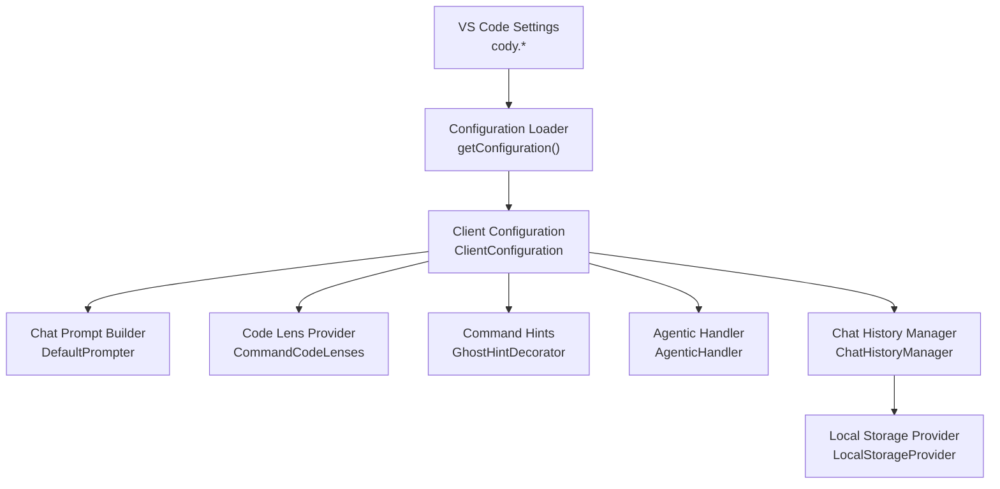
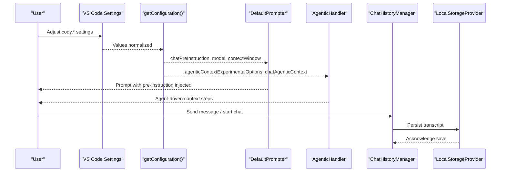
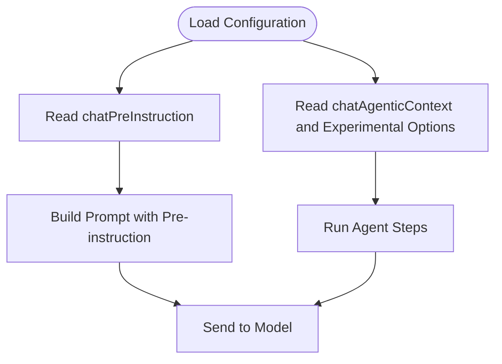
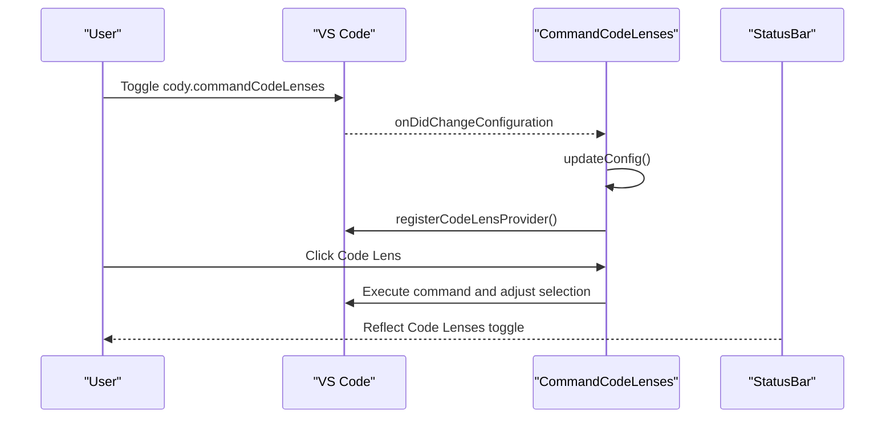
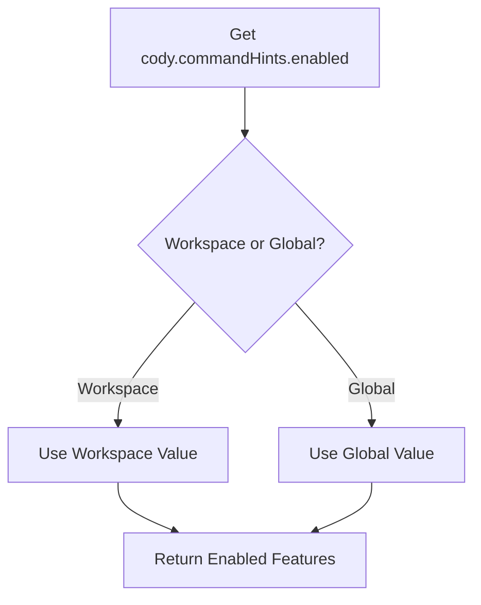
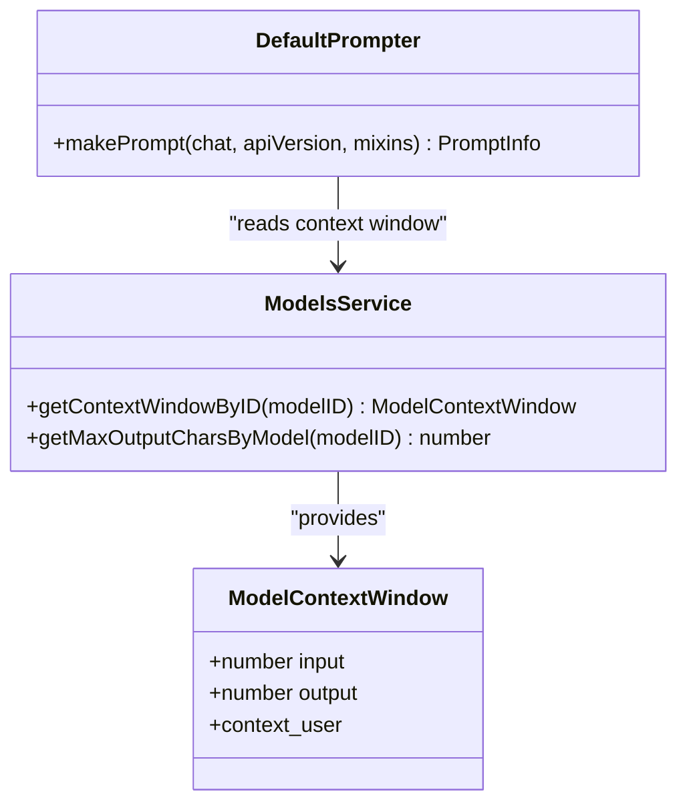
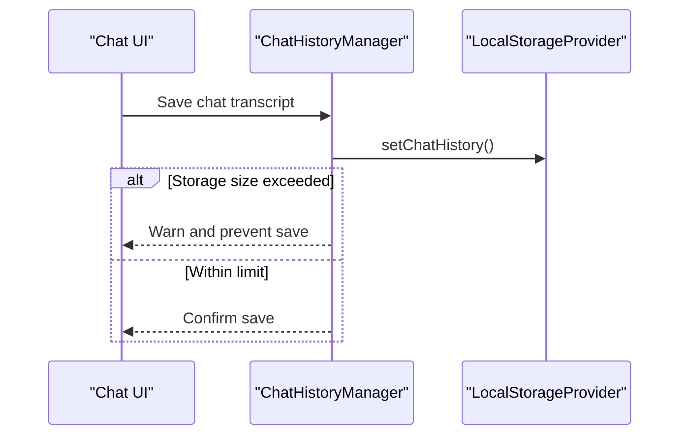
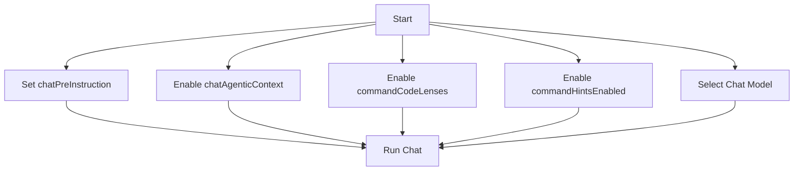
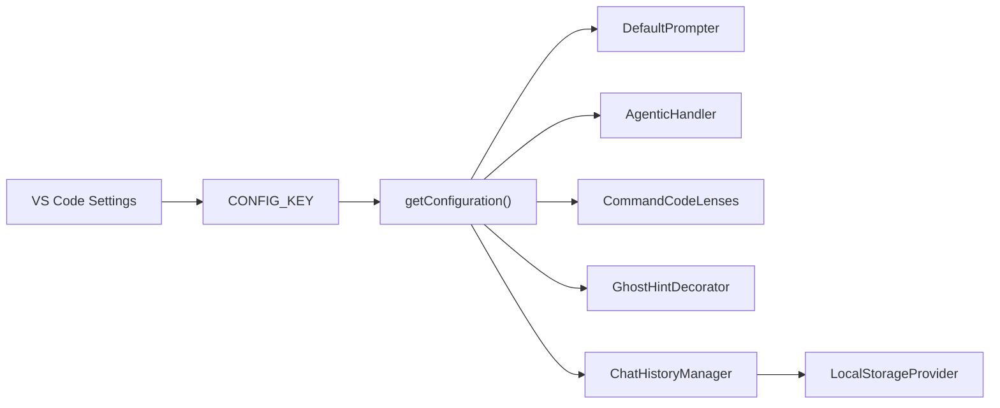

# Chat Preferences

<cite>
**Referenced Files in This Document**
- [configuration.ts](file://vscode/src/configuration.ts)
- [configuration-keys.ts](file://vscode/src/configuration-keys.ts)
- [package.json](file://vscode/package.json)
- [package.schema.json](file://vscode/package.schema.json)
- [code-lenses.ts](file://vscode/src/commands/services/code-lenses.ts)
- [GhostHintDecorator.ts](file://vscode/src/commands/GhostHintDecorator.ts)
- [StatusBar.ts](file://vscode/src/services/StatusBar.ts)
- [prompt.ts](file://vscode/src/chat/chat-view/prompt.ts)
- [prompt.test.ts](file://vscode/src/chat/chat-view/prompt.test.ts)
- [ChatHistoryManager.ts](file://vscode/src/chat/chat-view/ChatHistoryManager.ts)
- [LocalStorageProvider.ts](file://vscode/src/services/LocalStorageProvider.ts)
- [types.ts](file://lib/shared/src/models/types.ts)
- [modelsService.test.ts](file://lib/shared/src/models/modelsService.test.ts)
- [utils.test.ts](file://lib/shared/src/models/utils.test.ts)
- [Transcript.tsx](file://vscode/webviews/chat/Transcript.tsx)
- [AgenticHandler.ts](file://vscode/src/chat/chat-view/handlers/AgenticHandler.ts)
</cite>

## Table of Contents
1. [Introduction](#introduction)
2. [Project Structure](#project-structure)
3. [Core Components](#core-components)
4. [Architecture Overview](#architecture-overview)
5. [Detailed Component Analysis](#detailed-component-analysis)
6. [Dependency Analysis](#dependency-analysis)
7. [Performance Considerations](#performance-considerations)
8. [Troubleshooting Guide](#troubleshooting-guide)
9. [Conclusion](#conclusion)
10. [Appendices](#appendices)

## Introduction
This document explains how to configure and customize the Cody chat experience in the VS Code extension. It focuses on behavior preferences such as pre-instructions, agent-driven context features, code lens integration, and command hints. It also covers chat model selection, context window sizing, and conversation persistence. Practical customization scenarios and troubleshooting guidance are included to help you tailor Cody chat to your workflow.

## Project Structure
The chat preference system spans configuration ingestion, runtime behavior, UI integration, and persistence. Key areas:
- Configuration ingestion and normalization
- Chat prompt construction and pre-instruction injection
- Agent-driven context and advanced options
- UI integrations for code lenses and command hints
- Conversation persistence and storage limits

**Diagram sources**
- [configuration.ts:25-204](file://vscode/src/configuration.ts#L25-L204)
- [prompt.ts:28-46](file://vscode/src/chat/chat-view/prompt.ts#L28-L46)
- [code-lenses.ts:15-72](file://vscode/src/commands/services/code-lenses.ts#L15-L72)
- [GhostHintDecorator.ts:105-119](file://vscode/src/commands/GhostHintDecorator.ts#L105-L119)
- [AgenticHandler.ts:41-70](file://vscode/src/chat/chat-view/handlers/AgenticHandler.ts#L41-L70)
- [ChatHistoryManager.ts:94-118](file://vscode/src/chat/chat-view/ChatHistoryManager.ts#L94-L118)
- [LocalStorageProvider.ts:190-229](file://vscode/src/services/LocalStorageProvider.ts#L190-L229)

**Section sources**
- [configuration.ts:25-204](file://vscode/src/configuration.ts#L25-L204)
- [configuration-keys.ts:12-55](file://vscode/src/configuration-keys.ts#L12-L55)
- [package.json:123-539](file://vscode/package.json#L123-L539)
- [package.schema.json:92-95](file://vscode/package.schema.json#L92-L95)

## Core Components
- Behavior preferences
  - chatPreInstruction: Injects a user-defined instruction at the start of chat prompts.
  - editPreInstruction: Applies a pre-instruction for edit tasks.
  - commandCodeLenses: Enables quick-access code lenses in editors.
  - commandHintsEnabled: Controls contextual command hints overlay.
  - agenticContextExperimentalOptions: Advanced agent-driven context options.
  - chatAgenticContext: Enables agent-driven context for chat.
- Model and context
  - Chat model selection and context window sizing via shared model types and services.
- Persistence
  - Chat history saved locally with storage warnings and limits.

**Section sources**
- [configuration.ts:100-124](file://vscode/src/configuration.ts#L100-L124)
- [types.ts:67-87](file://lib/shared/src/models/types.ts#L67-L87)
- [modelsService.test.ts:65-119](file://lib/shared/src/models/modelsService.test.ts#L65-L119)
- [utils.test.ts:94-119](file://lib/shared/src/models/utils.test.ts#L94-L119)
- [ChatHistoryManager.ts:94-118](file://vscode/src/chat/chat-view/ChatHistoryManager.ts#L94-L118)
- [LocalStorageProvider.ts:190-229](file://vscode/src/services/LocalStorageProvider.ts#L190-L229)

## Architecture Overview
The configuration pipeline reads VS Code settings, normalizes them into a typed client configuration, and feeds downstream components that build prompts, manage agent context, render UI affordances, and persist conversations.

**Diagram sources**
- [configuration.ts:25-204](file://vscode/src/configuration.ts#L25-L204)
- [prompt.ts:28-46](file://vscode/src/chat/chat-view/prompt.ts#L28-L46)
- [AgenticHandler.ts:41-70](file://vscode/src/chat/chat-view/handlers/AgenticHandler.ts#L41-L70)
- [ChatHistoryManager.ts:94-118](file://vscode/src/chat/chat-view/ChatHistoryManager.ts#L94-L118)
- [LocalStorageProvider.ts:190-229](file://vscode/src/services/LocalStorageProvider.ts#L190-L229)

## Detailed Component Analysis

### Behavior Preferences: Pre-instructions and Agent Context
- chatPreInstruction
  - Purpose: Adds a fixed instruction at the beginning of chat prompts to steer model behavior.
  - Ingestion: Retrieved via a safe configuration accessor and passed into prompt building.
  - Effect: Ensures the model follows consistent instructions for tone, style, or domain-specific guidance.
- editPreInstruction
  - Purpose: Similar steering for edit tasks.
  - Ingestion: Normalized alongside chatPreInstruction.
- chatAgenticContext and agenticContextExperimentalOptions
  - Purpose: Enable agent-driven context retrieval and advanced agent behaviors.
  - Effect: When enabled, the chat handler computes context and orchestrates agent steps.

**Diagram sources**
- [configuration.ts:100-124](file://vscode/src/configuration.ts#L100-L124)
- [prompt.ts:28-46](file://vscode/src/chat/chat-view/prompt.ts#L28-L46)
- [AgenticHandler.ts:41-70](file://vscode/src/chat/chat-view/handlers/AgenticHandler.ts#L41-L70)

**Section sources**
- [configuration.ts:100-124](file://vscode/src/configuration.ts#L100-L124)
- [prompt.ts:28-46](file://vscode/src/chat/chat-view/prompt.ts#L28-L46)
- [prompt.test.ts:130-135](file://vscode/src/chat/chat-view/prompt.test.ts#L130-L135)
- [AgenticHandler.ts:41-70](file://vscode/src/chat/chat-view/handlers/AgenticHandler.ts#L41-L70)

### Code Lens Integration: commandCodeLenses
- Purpose: Adds quick-access code lenses in editors to trigger Cody commands.
- Behavior:
  - Watches configuration changes and registers/unregisters the provider accordingly.
  - Emits events to refresh lenses when editors change.
  - Clicking a lens triggers the associated command and updates selection.
- UI integration:
  - Status bar exposes a toggle for Code Lenses.
  - Feature flag and internal unstable settings influence availability.

**Diagram sources**
- [code-lenses.ts:15-72](file://vscode/src/commands/services/code-lenses.ts#L15-L72)
- [code-lenses.ts:63-71](file://vscode/src/commands/services/code-lenses.ts#L63-L71)
- [code-lenses.ts:161-168](file://vscode/src/commands/services/code-lenses.ts#L161-L168)
- [StatusBar.ts:508-516](file://vscode/src/services/StatusBar.ts#L508-L516)

**Section sources**
- [code-lenses.ts:15-72](file://vscode/src/commands/services/code-lenses.ts#L15-L72)
- [code-lenses.ts:63-71](file://vscode/src/commands/services/code-lenses.ts#L63-L71)
- [code-lenses.ts:161-168](file://vscode/src/commands/services/code-lenses.ts#L161-L168)
- [StatusBar.ts:508-516](file://vscode/src/services/StatusBar.ts#L508-L516)

### Command Hints: commandHintsEnabled
- Purpose: Displays contextual hints (e.g., “Opt+K to Edit”) to guide command usage.
- Behavior:
  - Reads the effective enablement state from configuration inspection.
  - Returns a consolidated boolean for Edit/Document/Generate features.
- UI integration:
  - Status bar exposes a toggle for Command Hints.
  - The effective enablement is computed dynamically from settings.

**Diagram sources**
- [GhostHintDecorator.ts:105-119](file://vscode/src/commands/GhostHintDecorator.ts#L105-L119)
- [StatusBar.ts:517-526](file://vscode/src/services/StatusBar.ts#L517-L526)

**Section sources**
- [GhostHintDecorator.ts:105-119](file://vscode/src/commands/GhostHintDecorator.ts#L105-L119)
- [StatusBar.ts:517-526](file://vscode/src/services/StatusBar.ts#L517-L526)

### Chat Model Selection and Context Window
- Model selection
  - Determined by the active chat model configuration and provider.
  - Shared model types define context windows and capabilities.
- Context window sizing
  - Input/output token budgets per model are enforced.
  - Extended context windows apply to specific models/providers.
- Prompt builder
  - Uses the configured context window to construct prompts safely.

**Diagram sources**
- [types.ts:67-87](file://lib/shared/src/models/types.ts#L67-L87)
- [modelsService.test.ts:65-119](file://lib/shared/src/models/modelsService.test.ts#L65-L119)
- [prompt.ts:28-46](file://vscode/src/chat/chat-view/prompt.ts#L28-L46)

**Section sources**
- [types.ts:67-87](file://lib/shared/src/models/types.ts#L67-L87)
- [modelsService.test.ts:65-119](file://lib/shared/src/models/modelsService.test.ts#L65-L119)
- [utils.test.ts:94-119](file://lib/shared/src/models/utils.test.ts#L94-L119)
- [prompt.ts:28-46](file://vscode/src/chat/chat-view/prompt.ts#L28-L46)

### Conversation Persistence
- Saving chats
  - Chats are persisted locally when they contain interactions.
  - Lightweight history is derived for UI lists.
- Storage limits and warnings
  - Large histories trigger a warning and may block further saves.
- Import/export
  - Supports merging or replacing stored histories.

**Diagram sources**
- [ChatHistoryManager.ts:94-118](file://vscode/src/chat/chat-view/ChatHistoryManager.ts#L94-L118)
- [LocalStorageProvider.ts:190-229](file://vscode/src/services/LocalStorageProvider.ts#L190-L229)

**Section sources**
- [ChatHistoryManager.ts:94-118](file://vscode/src/chat/chat-view/ChatHistoryManager.ts#L94-L118)
- [LocalStorageProvider.ts:190-229](file://vscode/src/services/LocalStorageProvider.ts#L190-L229)

### Conceptual Overview
Common customization scenarios:
- Always respond with a specific tone: set chatPreInstruction to a fixed instruction.
- Enable agent-driven context: turn on chatAgenticContext and configure agenticContextExperimentalOptions.
- Improve discoverability: enable commandCodeLenses and commandHintsEnabled.
- Tune model and context: select a model with appropriate context window sizes.

[No sources needed since this diagram shows conceptual workflow, not actual code structure]

## Dependency Analysis
- Configuration ingestion depends on VS Code settings and package.json contributions.
- Prompt building depends on context window sizing and pre-instructions.
- Agent context depends on configuration flags and handler orchestration.
- UI integrations depend on configuration toggles and status bar controls.
- Persistence depends on local storage and history manager.

**Diagram sources**
- [configuration-keys.ts:12-55](file://vscode/src/configuration-keys.ts#L12-L55)
- [configuration.ts:18-204](file://vscode/src/configuration.ts#L18-L204)
- [prompt.ts:28-46](file://vscode/src/chat/chat-view/prompt.ts#L28-L46)
- [AgenticHandler.ts:41-70](file://vscode/src/chat/chat-view/handlers/AgenticHandler.ts#L41-L70)
- [code-lenses.ts:15-72](file://vscode/src/commands/services/code-lenses.ts#L15-L72)
- [GhostHintDecorator.ts:105-119](file://vscode/src/commands/GhostHintDecorator.ts#L105-L119)
- [ChatHistoryManager.ts:94-118](file://vscode/src/chat/chat-view/ChatHistoryManager.ts#L94-L118)
- [LocalStorageProvider.ts:190-229](file://vscode/src/services/LocalStorageProvider.ts#L190-L229)

**Section sources**
- [configuration-keys.ts:12-55](file://vscode/src/configuration-keys.ts#L12-L55)
- [configuration.ts:18-204](file://vscode/src/configuration.ts#L18-L204)
- [package.json:123-539](file://vscode/package.json#L123-L539)
- [package.schema.json:92-95](file://vscode/package.schema.json#L92-L95)

## Performance Considerations
- Keep pre-instructions concise to reduce prompt overhead.
- Prefer smaller context windows for faster responses when working with limited memory.
- Limit the number of active chats to avoid excessive local storage growth.
- Disable experimental agent features if they cause slowdowns.

[No sources needed since this section provides general guidance]

## Troubleshooting Guide
- chatPreInstruction not applied
  - Verify the setting is present and formatted correctly.
  - Ensure the configuration loader resolves the value.
  - Confirm the prompt builder uses the resolved pre-instruction.
- Agent context not appearing
  - Check chatAgenticContext is enabled.
  - Review agenticContextExperimentalOptions for required configuration.
  - Inspect agent handler logs for errors.
- Code Lenses not visible
  - Confirm cody.commandCodeLenses is enabled.
  - Reopen editors to refresh lens registration.
  - Check for conflicting extensions.
- Command hints not showing
  - Verify cody.commandHints.enabled is set appropriately.
  - Ensure the editor supports ghost text rendering.
- Chat history not saving
  - Check storage size warnings and free up space if needed.
  - Attempt import/export to diagnose corruption.
- Model selection issues
  - Validate the selected model exists and is supported.
  - Confirm context window sizes align with your model.

**Section sources**
- [configuration.ts:100-124](file://vscode/src/configuration.ts#L100-L124)
- [prompt.test.ts:130-135](file://vscode/src/chat/chat-view/prompt.test.ts#L130-L135)
- [AgenticHandler.ts:41-70](file://vscode/src/chat/chat-view/handlers/AgenticHandler.ts#L41-L70)
- [code-lenses.ts:63-71](file://vscode/src/commands/services/code-lenses.ts#L63-L71)
- [GhostHintDecorator.ts:105-119](file://vscode/src/commands/GhostHintDecorator.ts#L105-L119)
- [ChatHistoryManager.ts:94-118](file://vscode/src/chat/chat-view/ChatHistoryManager.ts#L94-L118)
- [LocalStorageProvider.ts:190-229](file://vscode/src/services/LocalStorageProvider.ts#L190-L229)

## Conclusion
Cody’s chat preferences let you tailor behavior, agent-driven context, UI affordances, and persistence. By combining pre-instructions, agent options, code lenses, hints, model selection, and context windows, you can optimize chat for your workflow. Use the troubleshooting guidance to diagnose and resolve common configuration issues.

[No sources needed since this section summarizes without analyzing specific files]

## Appendices

### Appendix A: Configuration Keys Overview
- chatPreInstruction: Injects a fixed instruction at the start of chat prompts.
- editPreInstruction: Applies a pre-instruction for edit tasks.
- commandCodeLenses: Enables code lens integration in editors.
- commandHintsEnabled: Controls command hints overlay.
- chatAgenticContext: Enables agent-driven context.
- agenticContextExperimentalOptions: Advanced agent options.

**Section sources**
- [configuration.ts:100-124](file://vscode/src/configuration.ts#L100-L124)
- [configuration-keys.ts:12-55](file://vscode/src/configuration-keys.ts#L12-L55)
- [package.json:123-539](file://vscode/package.json#L123-L539)

### Appendix B: UI Integration Notes
- Code Lenses: Registered and refreshed based on configuration changes.
- Command Hints: Derived from configuration inspection and applied consistently across features.

**Section sources**
- [code-lenses.ts:15-72](file://vscode/src/commands/services/code-lenses.ts#L15-L72)
- [GhostHintDecorator.ts:105-119](file://vscode/src/commands/GhostHintDecorator.ts#L105-L119)
- [StatusBar.ts:508-526](file://vscode/src/services/StatusBar.ts#L508-L526)

### Appendix C: Agent Context Rendering
- Agent context cells are rendered conditionally in the chat transcript when agent mode is active and context is loading or available.

**Section sources**
- [Transcript.tsx:745-766](file://vscode/webviews/chat/Transcript.tsx#L745-L766)