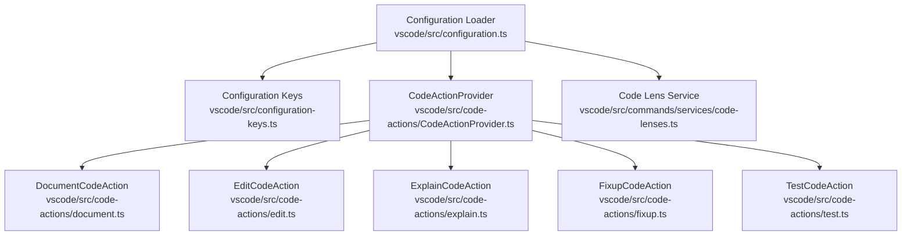
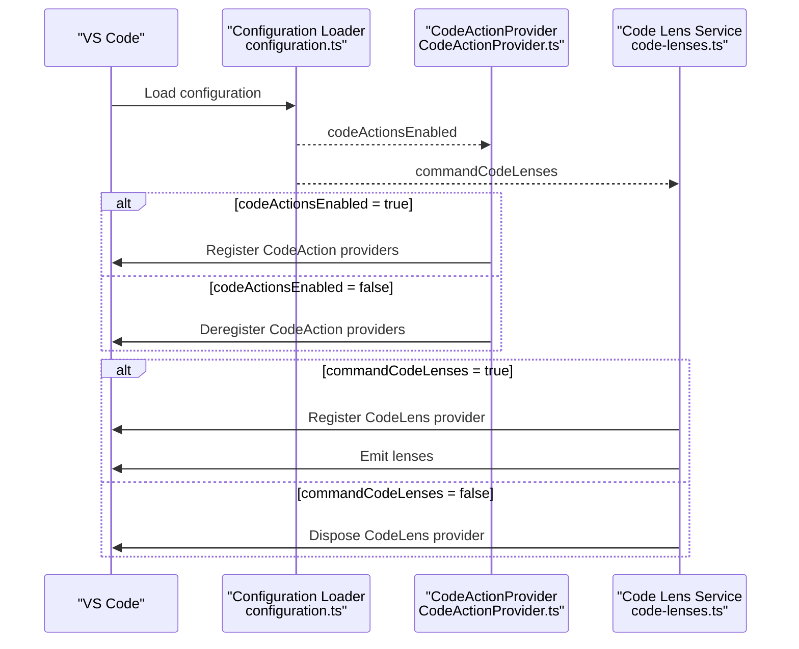
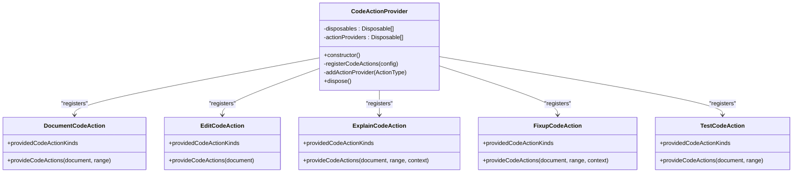
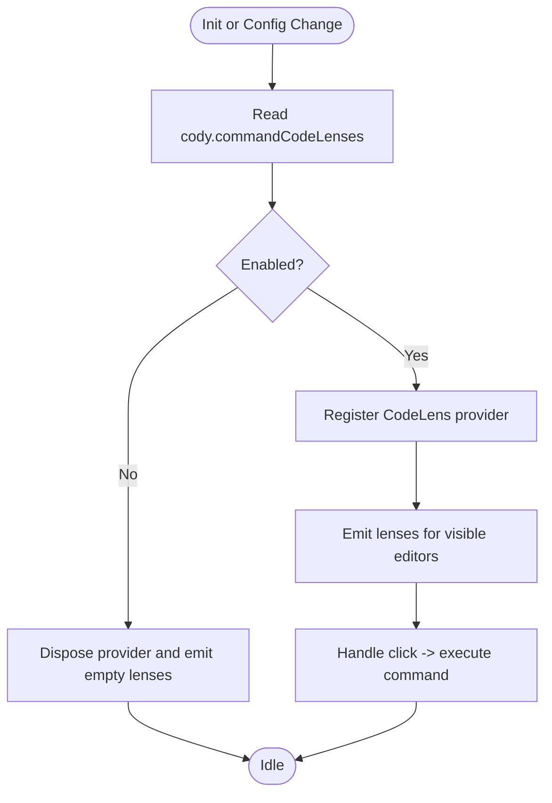
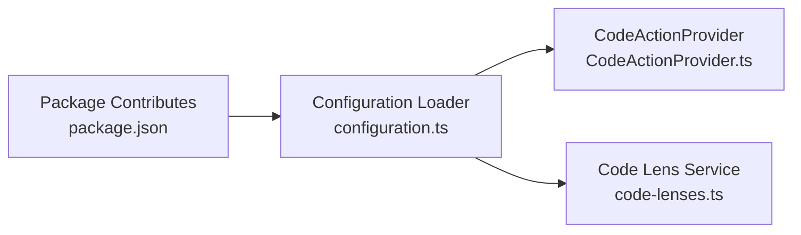

# Code Actions Preferences

<cite>
**Referenced Files in This Document**
- [configuration.ts](file://vscode/src/configuration.ts)
- [configuration-keys.ts](file://vscode/src/configuration-keys.ts)
- [CodeActionProvider.ts](file://vscode/src/code-actions/CodeActionProvider.ts)
- [document.ts](file://vscode/src/code-actions/document.ts)
- [edit.ts](file://vscode/src/code-actions/edit.ts)
- [explain.ts](file://vscode/src/code-actions/explain.ts)
- [fixup.ts](file://vscode/src/code-actions/fixup.ts)
- [test.ts](file://vscode/src/code-actions/test.ts)
- [code-lenses.ts](file://vscode/src/commands/services/code-lenses.ts)
- [package.json](file://vscode/package.json)
</cite>

## Table of Contents
1. [Introduction](#introduction)
2. [Project Structure](#project-structure)
3. [Core Components](#core-components)
4. [Architecture Overview](#architecture-overview)
5. [Detailed Component Analysis](#detailed-component-analysis)
6. [Dependency Analysis](#dependency-analysis)
7. [Performance Considerations](#performance-considerations)
8. [Troubleshooting Guide](#troubleshooting-guide)
9. [Conclusion](#conclusion)

## Introduction
This document explains the code action configuration preferences in the Cody platform and how they influence code lens visibility and action availability. It focuses on:
- codeActionsEnabled: controls whether Cody’s code actions are registered and active.
- commandCodeLenses: controls visibility and interaction of command code lenses in the editor.
- commandHintsEnabled: controls whether command hints are shown in the editor.

It also provides practical guidance for configuring these preferences per file type and workspace context, along with performance optimization tips and strategies to resolve conflicts with other extensions.

## Project Structure
The code actions feature spans several modules:
- Configuration loading and exposure to the client runtime.
- Code action providers that register VS Code CodeAction kinds.
- Command code lens service that renders and handles clicks for quick actions.
- Package contributions that define commands and menus.

**Diagram sources**
- [configuration.ts:25-204](file://vscode/src/configuration.ts#L25-L204)
- [configuration-keys.ts:18-55](file://vscode/src/configuration-keys.ts#L18-L55)
- [CodeActionProvider.ts:11-60](file://vscode/src/code-actions/CodeActionProvider.ts#L11-L60)
- [document.ts:6-55](file://vscode/src/code-actions/document.ts#L6-L55)
- [edit.ts:5-81](file://vscode/src/code-actions/edit.ts#L5-L81)
- [explain.ts:5-52](file://vscode/src/code-actions/explain.ts#L5-L52)
- [fixup.ts:12-152](file://vscode/src/code-actions/fixup.ts#L12-L152)
- [test.ts:6-56](file://vscode/src/code-actions/test.ts#L6-L56)
- [code-lenses.ts:33-206](file://vscode/src/commands/services/code-lenses.ts#L33-L206)

**Section sources**
- [configuration.ts:25-204](file://vscode/src/configuration.ts#L25-L204)
- [configuration-keys.ts:18-55](file://vscode/src/configuration-keys.ts#L18-L55)
- [CodeActionProvider.ts:11-60](file://vscode/src/code-actions/CodeActionProvider.ts#L11-L60)
- [code-lenses.ts:33-206](file://vscode/src/commands/services/code-lenses.ts#L33-L206)

## Core Components
- codeActionsEnabled: When disabled, the CodeActionProvider deregisters all Cody code actions. When enabled, it registers providers for refactors and quick fixes.
- commandCodeLenses: When enabled, the code lens service registers a provider and emits lenses for quick command invocation. Clicking a lens executes the associated command.
- commandHintsEnabled: Controls whether command hints appear in the editor. These are separate from code actions but share the same configuration key.

These preferences are loaded from VS Code configuration and exposed to the client runtime via the configuration loader.

**Section sources**
- [configuration.ts:97-117](file://vscode/src/configuration.ts#L97-L117)
- [configuration-keys.ts:18-55](file://vscode/src/configuration-keys.ts#L18-L55)
- [CodeActionProvider.ts:24-49](file://vscode/src/code-actions/CodeActionProvider.ts#L24-L49)
- [code-lenses.ts:33-72](file://vscode/src/commands/services/code-lenses.ts#L33-L72)

## Architecture Overview
The configuration-driven activation of code actions and code lenses follows a predictable flow:
- On startup and on configuration changes, the configuration loader reads cody.* settings.
- The CodeActionProvider conditionally registers providers based on codeActionsEnabled.
- The code lens service conditionally registers and updates lenses based on commandCodeLenses.

**Diagram sources**
- [configuration.ts:25-204](file://vscode/src/configuration.ts#L25-L204)
- [CodeActionProvider.ts:11-60](file://vscode/src/code-actions/CodeActionProvider.ts#L11-L60)
- [code-lenses.ts:33-72](file://vscode/src/commands/services/code-lenses.ts#L33-L72)

## Detailed Component Analysis

### Code Actions Provider Lifecycle
The CodeActionProvider manages registration of multiple code action providers and reacts to configuration changes.

**Diagram sources**
- [CodeActionProvider.ts:11-60](file://vscode/src/code-actions/CodeActionProvider.ts#L11-L60)
- [document.ts:6-55](file://vscode/src/code-actions/document.ts#L6-L55)
- [edit.ts:5-81](file://vscode/src/code-actions/edit.ts#L5-L81)
- [explain.ts:5-52](file://vscode/src/code-actions/explain.ts#L5-L52)
- [fixup.ts:12-152](file://vscode/src/code-actions/fixup.ts#L12-L152)
- [test.ts:6-56](file://vscode/src/code-actions/test.ts#L6-L56)

**Section sources**
- [CodeActionProvider.ts:11-60](file://vscode/src/code-actions/CodeActionProvider.ts#L11-L60)
- [document.ts:6-55](file://vscode/src/code-actions/document.ts#L6-L55)
- [edit.ts:5-81](file://vscode/src/code-actions/edit.ts#L5-L81)
- [explain.ts:5-52](file://vscode/src/code-actions/explain.ts#L5-L52)
- [fixup.ts:12-152](file://vscode/src/code-actions/fixup.ts#L12-L152)
- [test.ts:6-56](file://vscode/src/code-actions/test.ts#L6-L56)

### Code Lens Service Behavior
The code lens service controls visibility and interaction of command code lenses.

**Diagram sources**
- [code-lenses.ts:33-72](file://vscode/src/commands/services/code-lenses.ts#L33-L72)
- [code-lenses.ts:161-168](file://vscode/src/commands/services/code-lenses.ts#L161-L168)

**Section sources**
- [code-lenses.ts:33-72](file://vscode/src/commands/services/code-lenses.ts#L33-L72)
- [code-lenses.ts:161-168](file://vscode/src/commands/services/code-lenses.ts#L161-L168)

### Configuration Keys and Defaults
Configuration keys are inferred from the extension manifest and mapped to camelCase keys. The configuration loader reads cody.* settings and exposes them to the client runtime.

- codeActionsEnabled defaults to true.
- commandCodeLenses defaults to false.
- commandHintsEnabled defaults to false.

These defaults are applied when settings are missing.

**Section sources**
- [configuration-keys.ts:18-55](file://vscode/src/configuration-keys.ts#L18-L55)
- [configuration.ts:97-117](file://vscode/src/configuration.ts#L97-L117)

### Command Hints Behavior
Command hints are controlled by commandHintsEnabled. When enabled, hints appear in the editor to guide users to available commands. This setting is part of the same configuration surface as code actions and code lenses.

**Section sources**
- [configuration.ts:116-117](file://vscode/src/configuration.ts#L116-L117)

### Code Lens Visibility and Interaction
Command code lenses are rendered when commandCodeLenses is true. Clicking a lens sets the editor selection and executes the associated command. The lens service listens to editor visibility and active editor changes to refresh lens visibility.

**Section sources**
- [code-lenses.ts:33-72](file://vscode/src/commands/services/code-lenses.ts#L33-L72)
- [code-lenses.ts:161-168](file://vscode/src/commands/services/code-lenses.ts#L161-L168)

### Examples: Configuring Code Actions and Code Lenses
Below are practical examples of configuring preferences for different scenarios. Replace the example values with your desired settings in your VS Code settings.

- Enable code actions globally:
  - Setting: cody.codeActionsEnabled
  - Example value: true

- Disable code actions globally:
  - Setting: cody.codeActionsEnabled
  - Example value: false

- Enable command code lenses:
  - Setting: cody.commandCodeLenses
  - Example value: true

- Disable command code lenses:
  - Setting: cody.commandCodeLenses
  - Example value: false

- Enable command hints:
  - Setting: cody.commandHintsEnabled
  - Example value: true

- Disable command hints:
  - Setting: cody.commandHintsEnabled
  - Example value: false

- Configure per file type:
  - Use VS Code language-specific settings to override defaults for specific file types. For example, disable code actions for a specific language while keeping them enabled for others.

- Configure per workspace:
  - Place settings in .vscode/settings.json at the root of your workspace to apply only within that workspace.

Note: The exact key names are derived from the configuration loader and manifest. Use the keys as exposed by the configuration system.

**Section sources**
- [configuration.ts:97-117](file://vscode/src/configuration.ts#L97-L117)
- [configuration-keys.ts:18-55](file://vscode/src/configuration-keys.ts#L18-L55)

## Dependency Analysis
The following diagram shows how configuration influences code action and code lens behavior.

**Diagram sources**
- [package.json:123-800](file://vscode/package.json#L123-L800)
- [configuration.ts:25-204](file://vscode/src/configuration.ts#L25-L204)
- [CodeActionProvider.ts:11-60](file://vscode/src/code-actions/CodeActionProvider.ts#L11-L60)
- [code-lenses.ts:33-72](file://vscode/src/commands/services/code-lenses.ts#L33-L72)

**Section sources**
- [package.json:123-800](file://vscode/package.json#L123-L800)
- [configuration.ts:25-204](file://vscode/src/configuration.ts#L25-L204)
- [CodeActionProvider.ts:11-60](file://vscode/src/code-actions/CodeActionProvider.ts#L11-L60)
- [code-lenses.ts:33-72](file://vscode/src/commands/services/code-lenses.ts#L33-L72)

## Performance Considerations
- Keep codeActionsEnabled true only when needed. Disabling code actions reduces the number of registered providers and minimizes overhead.
- Disable commandCodeLenses if you do not need quick command access via code lenses. This reduces lens computation and rendering work.
- Limit command hints to environments where they improve usability; disabling them avoids unnecessary UI updates.
- Prefer language-specific overrides to narrow the scope of expensive features to relevant files.

[No sources needed since this section provides general guidance]

## Troubleshooting Guide
- Symptom: Code actions do not appear.
  - Verify cody.codeActionsEnabled is true.
  - Confirm the editor supports code actions and the file type is recognized.

- Symptom: Code lenses do not appear.
  - Verify cody.commandCodeLenses is true.
  - Ensure the editor is visible and active; the lens service refreshes on editor changes.

- Symptom: Conflicts with other extensions.
  - Temporarily disable other extensions that provide similar actions to isolate conflicts.
  - Adjust language-specific settings to restrict Cody features to specific file types.

- Symptom: Unexpected command hint appearance.
  - Toggle cody.commandHintsEnabled to false to disable hints.

**Section sources**
- [configuration.ts:97-117](file://vscode/src/configuration.ts#L97-L117)
- [CodeActionProvider.ts:24-49](file://vscode/src/code-actions/CodeActionProvider.ts#L24-L49)
- [code-lenses.ts:33-72](file://vscode/src/commands/services/code-lenses.ts#L33-L72)

## Conclusion
Cody’s code action preferences are controlled through three primary settings:
- codeActionsEnabled: Enables or disables all code actions.
- commandCodeLenses: Enables or disables command code lenses.
- commandHintsEnabled: Enables or disables command hints.

By tuning these settings per workspace and file type, you can optimize performance and reduce conflicts with other extensions while maintaining a productive editing experience.