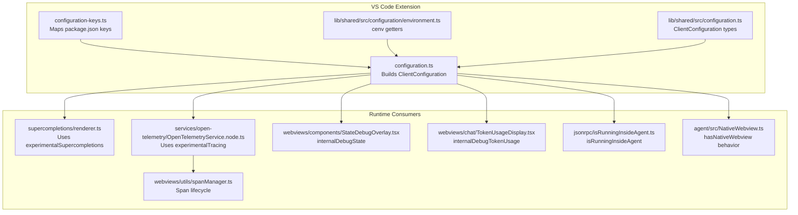
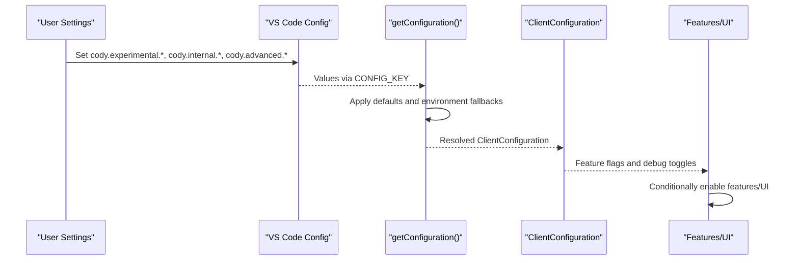
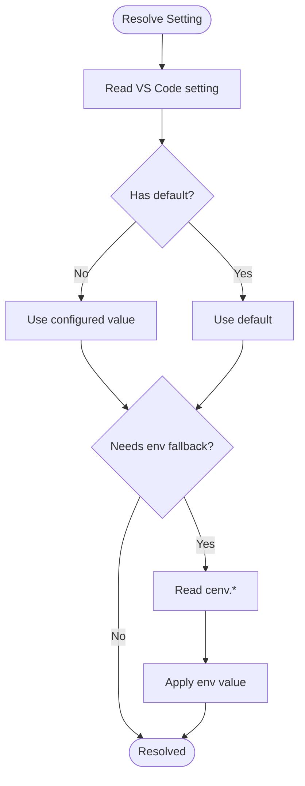
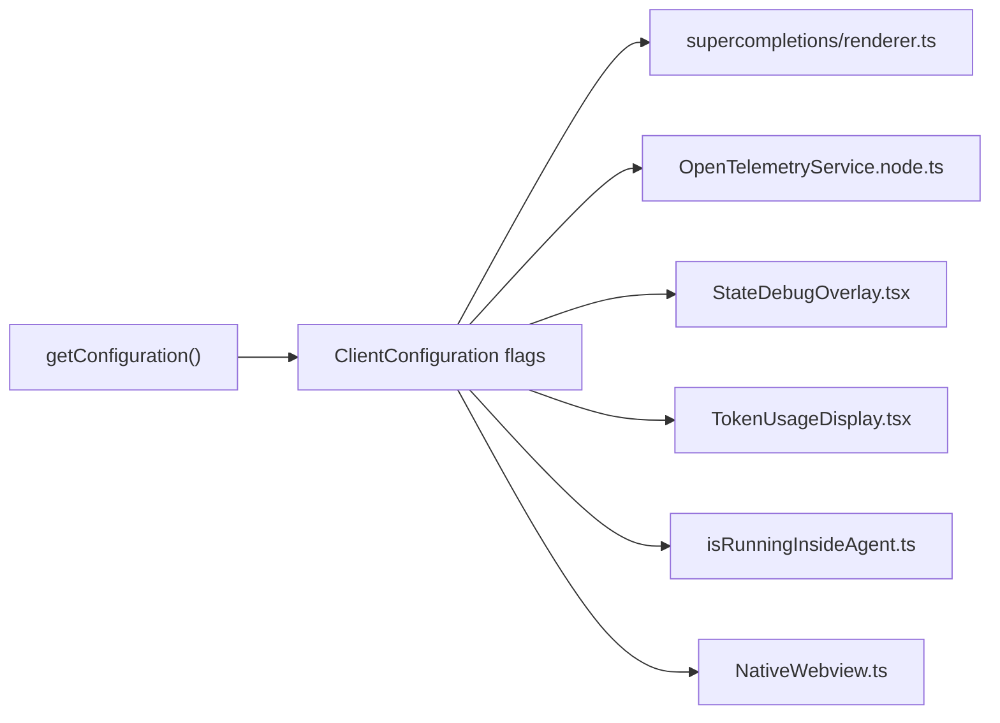

# Experimental & Hidden Preferences

<cite>
**Referenced Files in This Document**
- [configuration.ts](file://vscode/src/configuration.ts)
- [configuration-keys.ts](file://vscode/src/configuration-keys.ts)
- [configuration.ts](file://lib/shared/src/configuration.ts)
- [environment.ts](file://lib/shared/src/configuration/environment.ts)
- [isRunningInsideAgent.ts](file://vscode/src/jsonrpc/isRunningInsideAgent.ts)
- [TokenUsageDisplay.tsx](file://vscode/webviews/chat/TokenUsageDisplay.tsx)
- [StateDebugOverlay.tsx](file://vscode/webviews/components/StateDebugOverlay.tsx)
- [renderer.ts](file://vscode/src/supercompletions/renderer.ts)
- [OpenTelemetryService.node.ts](file://vscode/src/services/open-telemetry/OpenTelemetryService.node.ts)
- [spanManager.ts](file://vscode/webviews/utils/spanManager.ts)
- [NativeWebview.ts](file://agent/src/NativeWebview.ts)
</cite>

## Table of Contents
1. [Introduction](#introduction)
2. [Project Structure](#project-structure)
3. [Core Components](#core-components)
4. [Architecture Overview](#architecture-overview)
5. [Detailed Component Analysis](#detailed-component-analysis)
6. [Dependency Analysis](#dependency-analysis)
7. [Performance Considerations](#performance-considerations)
8. [Troubleshooting Guide](#troubleshooting-guide)
9. [Conclusion](#conclusion)

## Introduction
This document explains experimental and hidden preferences in the Cody platform. It focuses on:
- Experimental features: experimentalSupercompletions, experimentalAutoEditEnabled, and experimentalTracing
- Internal debugging settings: internalDebugContext, internalDebugState, and internalDebugTokenUsage
- Advanced agent settings: isRunningInsideAgent, hasNativeWebview, and related agent capability flags
- Developer-focused settings: autocompleteFirstCompletionTimeout and providerLimitPrompt
- Stability risks and guidance for enabling experimental features
- The relationship between hidden settings and environment variables

## Project Structure
The configuration pipeline is centralized in the VS Code extension layer and shared types, with optional agent-specific overrides and environment variable support.

**Diagram sources**
- [configuration.ts:25-204](file://vscode/src/configuration.ts#L25-L204)
- [configuration-keys.ts:18-52](file://vscode/src/configuration-keys.ts#L18-L52)
- [configuration.ts:115-214](file://lib/shared/src/configuration.ts#L115-L214)
- [environment.ts:22-85](file://lib/shared/src/configuration/environment.ts#L22-L85)
- [renderer.ts:107-172](file://vscode/src/supercompletions/renderer.ts#L107-L172)
- [OpenTelemetryService.node.ts:77-142](file://vscode/src/services/open-telemetry/OpenTelemetryService.node.ts#L77-L142)
- [spanManager.ts:90-137](file://vscode/webviews/utils/spanManager.ts#L90-L137)
- [StateDebugOverlay.tsx:71-100](file://vscode/webviews/components/StateDebugOverlay.tsx#L71-L100)
- [TokenUsageDisplay.tsx:15-38](file://vscode/webviews/chat/TokenUsageDisplay.tsx#L15-L38)
- [isRunningInsideAgent.ts:1-9](file://vscode/src/jsonrpc/isRunningInsideAgent.ts#L1-L9)
- [NativeWebview.ts:451-468](file://agent/src/NativeWebview.ts#L451-L468)

**Section sources**
- [configuration.ts:25-204](file://vscode/src/configuration.ts#L25-L204)
- [configuration-keys.ts:18-52](file://vscode/src/configuration-keys.ts#L18-L52)
- [configuration.ts:115-214](file://lib/shared/src/configuration.ts#L115-L214)
- [environment.ts:22-85](file://lib/shared/src/configuration/environment.ts#L22-L85)

## Core Components
- ClientConfiguration: central runtime configuration shape including experimental, internal, hidden, and developer settings
- Configuration builder: resolves settings from VS Code configuration and environment variables
- Environment variables: cenv exposes controlled environment-backed toggles for internal and testing scenarios

Key responsibilities:
- Expose experimental flags to gate new functionality
- Provide internal debugging overlays and token usage visibility
- Support agent-specific runtime flags and capabilities
- Allow developer tuning for autocomplete behavior and provider limits

**Section sources**
- [configuration.ts:25-204](file://vscode/src/configuration.ts#L25-L204)
- [configuration.ts:115-214](file://lib/shared/src/configuration.ts#L115-L214)
- [environment.ts:22-85](file://lib/shared/src/configuration/environment.ts#L22-L85)

## Architecture Overview
The configuration flow:
- VS Code settings are read via CONFIG_KEY mapping
- Hidden/internal/experimental flags are resolved with defaults and environment fallbacks
- Runtime consumers read from ClientConfiguration to conditionally enable features or debug UI

**Diagram sources**
- [configuration.ts:25-204](file://vscode/src/configuration.ts#L25-L204)
- [configuration-keys.ts:18-52](file://vscode/src/configuration-keys.ts#L18-L52)
- [configuration.ts:115-214](file://lib/shared/src/configuration.ts#L115-L214)

## Detailed Component Analysis

### Experimental Features

#### experimentalSupercompletions
- Purpose: Gate access to enhanced supercompletion rendering and UI affordances
- Resolution: Hidden setting under cody.experimental.supercompletions
- Behavior: Used by the supercompletion renderer to manage lens and hover UI elements
- Guidance: Enable only when evaluating the enhanced UI; may introduce additional UI actions

**Section sources**
- [configuration.ts:148-148](file://vscode/src/configuration.ts#L148-L148)
- [renderer.ts:135-172](file://vscode/src/supercompletions/renderer.ts#L135-L172)

#### experimentalAutoEditEnabled
- Purpose: Control whether auto-edit suggestions are treated as the active suggestion mode
- Resolution: Derived from the suggestion mode; hidden setting cody.experimental.autoedit.config.override exists for advanced overrides
- Behavior: When suggestion mode indicates auto-edit, this flag becomes true; used to route provider selection and UX
- Guidance: Prefer adjusting cody.suggestions.mode; use override only for testing

**Section sources**
- [configuration.ts:149-153](file://vscode/src/configuration.ts#L149-L153)

#### experimentalTracing
- Purpose: Enable tracing instrumentation for autocomplete and related flows
- Resolution: Hidden setting cody.experimental.tracing
- Behavior: Propagated to OpenTelemetry service to configure exporters and processors
- Guidance: Enable for debugging latency and flow issues; may increase overhead

**Section sources**
- [configuration.ts:146-146](file://vscode/src/configuration.ts#L146-L146)
- [OpenTelemetryService.node.ts:77-142](file://vscode/src/services/open-telemetry/OpenTelemetryService.node.ts#L77-L142)
- [spanManager.ts:90-137](file://vscode/webviews/utils/spanManager.ts#L90-L137)

### Internal Debugging Settings

#### internalDebugContext
- Purpose: Internal-only toggle for contextual debugging aids
- Resolution: Hidden setting cody.internal.debug.context
- Behavior: Used by internal systems to conditionally surface extra context
- Guidance: Keep disabled unless instructed by maintainers

**Section sources**
- [configuration.ts:136-136](file://vscode/src/configuration.ts#L136-L136)

#### internalDebugState
- Purpose: Toggle a state debug overlay in the webviews
- Resolution: Hidden setting cody.internal.debug.state
- Behavior: When enabled, a debug overlay appears to inspect runtime state
- Guidance: Enable temporarily for diagnostics; disable afterward

**Section sources**
- [configuration.ts:137-137](file://vscode/src/configuration.ts#L137-L137)
- [StateDebugOverlay.tsx:71-100](file://vscode/webviews/components/StateDebugOverlay.tsx#L71-L100)

#### internalDebugTokenUsage
- Purpose: Display token usage metrics in chat UI
- Resolution: Hidden setting cody.internal.debug.tokenUsage
- Behavior: When enabled, token usage fields are rendered in the chat UI
- Guidance: Enable for debugging token accounting; disable in normal usage

**Section sources**
- [configuration.ts:138-138](file://vscode/src/configuration.ts#L138-L138)
- [TokenUsageDisplay.tsx:15-38](file://vscode/webviews/chat/TokenUsageDisplay.tsx#L15-L38)

### Advanced Agent Settings

#### isRunningInsideAgent
- Purpose: Signal to the extension that it runs inside an agent host
- Resolution: Hidden setting cody.advanced.agent.running
- Behavior: Used to tailor error messaging and suppress certain events in agent contexts
- Guidance: Typically managed automatically; avoid manual changes unless integrating with agents

**Section sources**
- [configuration.ts:180-180](file://vscode/src/configuration.ts#L180-L180)
- [isRunningInsideAgent.ts:1-9](file://vscode/src/jsonrpc/isRunningInsideAgent.ts#L1-L9)

#### hasNativeWebview
- Purpose: Indicate native webview support in the agent environment
- Resolution: Hidden setting cody.advanced.hasNativeWebview
- Behavior: Impacts how webviews are presented and managed in agent hosts
- Guidance: Leave default unless testing agent-specific webview behavior

**Section sources**
- [configuration.ts:181-181](file://vscode/src/configuration.ts#L181-L181)
- [NativeWebview.ts:451-468](file://agent/src/NativeWebview.ts#L451-L468)

#### Agent capability flags
- Purpose: Represent agent capabilities such as persistent storage
- Resolution: Hidden settings under cody.advanced.agent.capabilities.*
- Behavior: Used to adapt feature availability and UX in agent environments
- Guidance: Configure only when integrating with a specific agent stack

**Section sources**
- [configuration.ts:185-185](file://vscode/src/configuration.ts#L185-L185)

### Developer-Focused Settings

#### autocompleteFirstCompletionTimeout
- Purpose: Tune the timeout for the first autocomplete completion
- Resolution: Hidden setting cody.autocomplete.advanced.timeout.firstCompletion
- Behavior: Controls early termination of slow-first-completion requests
- Guidance: Adjust only if experiencing slow initial suggestions; default is tuned for typical environments

**Section sources**
- [configuration.ts:186-189](file://vscode/src/configuration.ts#L186-L189)

#### providerLimitPrompt
- Purpose: Limit the prompt length passed to providers
- Resolution: Hidden setting cody.provider.limit.prompt
- Behavior: Caps prompt size to protect provider rate limits and performance
- Guidance: Use when working with providers that enforce strict size limits

**Section sources**
- [configuration.ts:190-190](file://vscode/src/configuration.ts#L190-L190)

### Relationship Between Hidden Settings and Environment Variables
- Hidden settings are resolved via VS Code configuration with defaults
- Environment variables are accessed through cenv and used for internal/unstable/testing controls
- Example: internal unstable flag can be enabled via CODY_CONFIG_ENABLE_INTERNAL_UNSTABLE

**Diagram sources**
- [configuration.ts:28-30](file://vscode/src/configuration.ts#L28-L30)
- [environment.ts:43-44](file://lib/shared/src/configuration/environment.ts#L43-L44)

**Section sources**
- [configuration.ts:28-30](file://vscode/src/configuration.ts#L28-L30)
- [environment.ts:43-44](file://lib/shared/src/configuration/environment.ts#L43-L44)

## Dependency Analysis
- Configuration builder depends on CONFIG_KEY mapping and cenv for environment-backed values
- Runtime consumers depend on ClientConfiguration fields to gate features and UI
- Tracing depends on experimentalTracing to configure OpenTelemetry processors and exporters

**Diagram sources**
- [configuration.ts:25-204](file://vscode/src/configuration.ts#L25-L204)
- [renderer.ts:107-172](file://vscode/src/supercompletions/renderer.ts#L107-L172)
- [OpenTelemetryService.node.ts:77-142](file://vscode/src/services/open-telemetry/OpenTelemetryService.node.ts#L77-L142)
- [StateDebugOverlay.tsx:71-100](file://vscode/webviews/components/StateDebugOverlay.tsx#L71-L100)
- [TokenUsageDisplay.tsx:15-38](file://vscode/webviews/chat/TokenUsageDisplay.tsx#L15-L38)
- [isRunningInsideAgent.ts:1-9](file://vscode/src/jsonrpc/isRunningInsideAgent.ts#L1-L9)
- [NativeWebview.ts:451-468](file://agent/src/NativeWebview.ts#L451-L468)

**Section sources**
- [configuration.ts:25-204](file://vscode/src/configuration.ts#L25-L204)

## Performance Considerations
- Enabling experimentalTracing adds overhead due to span processing and exporters
- internalDebugState and internalDebugTokenUsage add UI rendering cost
- autocompleteFirstCompletionTimeout affects perceived responsiveness; tune conservatively
- providerLimitPrompt helps avoid timeouts and rate limit penalties by constraining input size

## Troubleshooting Guide
- If autocomplete feels slow initially, consider adjusting autocompleteFirstCompletionTimeout
- If tracing seems noisy or slow, disable experimentalTracing
- If token usage is missing in chat UI, enable internalDebugTokenUsage
- If agent-specific UI behaves unexpectedly, verify isRunningInsideAgent and hasNativeWebview
- For internal debugging overlays, toggle internalDebugState to inspect runtime state

## Conclusion
Experimental and hidden preferences in Cody allow targeted feature evaluation, internal debugging, and agent-specific adaptation. Use them judiciously, prefer user-facing configuration where available, and revert experimental settings after evaluation. Environment variables should be reserved for internal or testing scenarios requiring environment-driven control.