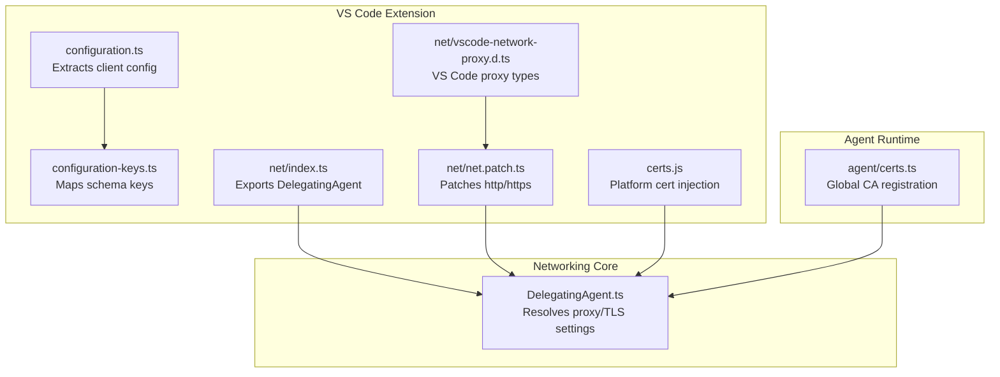
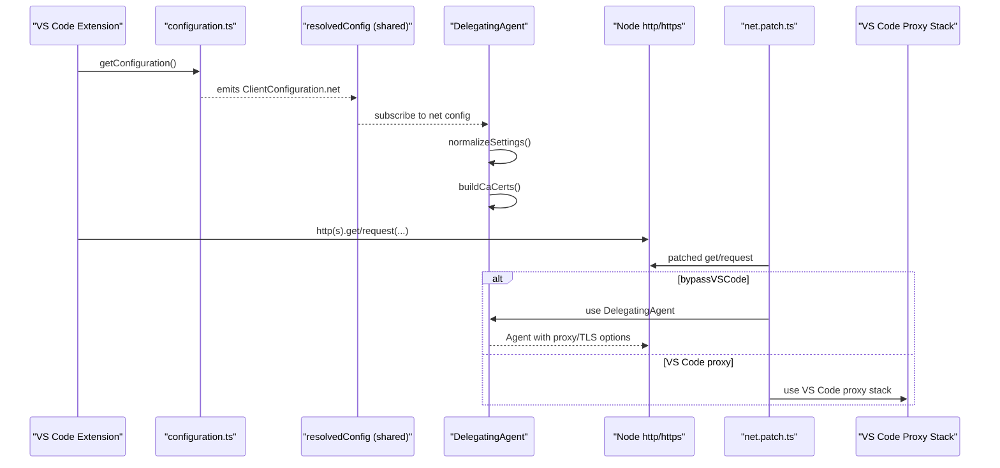
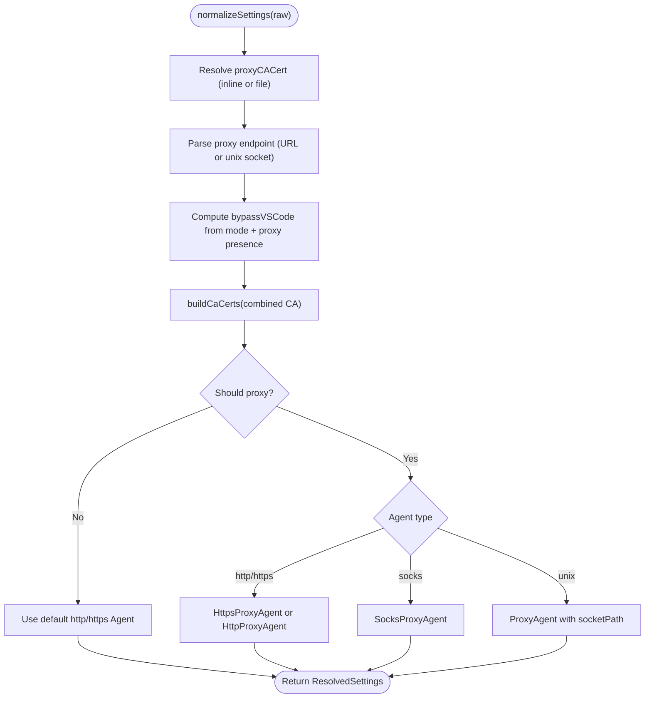
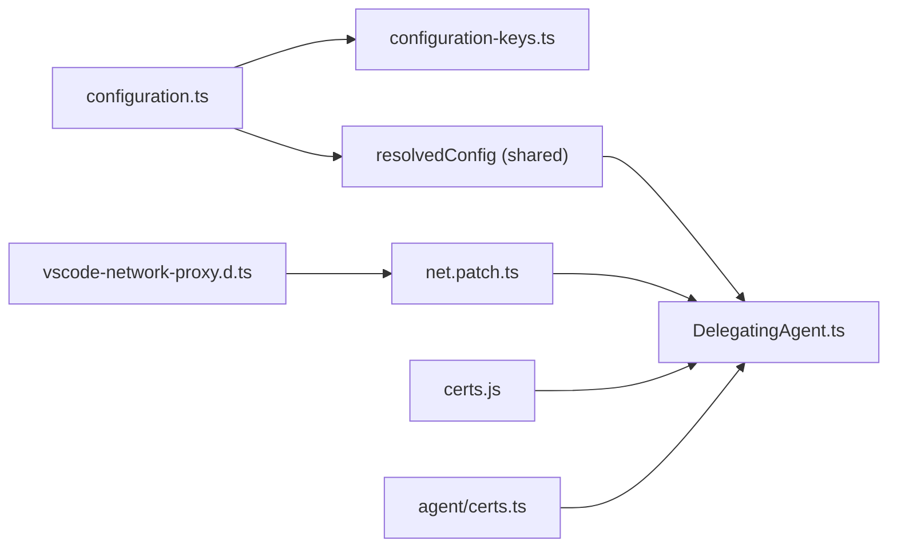

# Network & Proxy Preferences

<cite>
**Referenced Files in This Document**
- [configuration.ts](file://vscode/src/configuration.ts)
- [configuration-keys.ts](file://vscode/src/configuration-keys.ts)
- [DelegatingAgent.ts](file://vscode/src/net/DelegatingAgent.ts)
- [index.ts](file://vscode/src/net/index.ts)
- [net.patch.ts](file://vscode/src/net/net.patch.ts)
- [vscode-network-proxy.d.ts](file://vscode/src/net/vscode-network-proxy.d.ts)
- [certs.js](file://vscode/src/certs.js)
- [certs.ts](file://agent/src/certs.ts)
- [package.json](file://vscode/package.json)
</cite>

## Table of Contents
1. [Introduction](#introduction)
2. [Project Structure](#project-structure)
3. [Core Components](#core-components)
4. [Architecture Overview](#architecture-overview)
5. [Detailed Component Analysis](#detailed-component-analysis)
6. [Dependency Analysis](#dependency-analysis)
7. [Performance Considerations](#performance-considerations)
8. [Troubleshooting Guide](#troubleshooting-guide)
9. [Conclusion](#conclusion)
10. [Appendices](#appendices)

## Introduction
This document explains how the Cody platform controls network behavior and integrates with proxy configurations. It covers:
- netMode settings for controlling network behavior
- Proxy endpoint configuration
- Certificate validation options
- The proxyCACert setting for custom CA certificates
- The netProxySkipCertValidation option for SSL certificate handling
- Integration with VS Code’s http settings and how they affect Cody’s network connectivity
- Examples for enterprise environments
- Troubleshooting and security best practices

## Project Structure
The network and proxy configuration logic spans the VS Code extension and shared networking utilities:
- Configuration extraction and normalization live in the VS Code extension
- The DelegatingAgent selects and applies proxy and TLS settings
- Patching integrates the agent into Node’s http/https stack
- Platform-specific certificate installation supports system trust stores

**Diagram sources**
- [configuration.ts:25-204](file://vscode/src/configuration.ts#L25-L204)
- [configuration-keys.ts:18-55](file://vscode/src/configuration-keys.ts#L18-L55)
- [index.ts:1-3](file://vscode/src/net/index.ts#L1-L3)
- [net.patch.ts:15-49](file://vscode/src/net/net.patch.ts#L15-L49)
- [vscode-network-proxy.d.ts:10-124](file://vscode/src/net/vscode-network-proxy.d.ts#L10-L124)
- [DelegatingAgent.ts:97-137](file://vscode/src/net/DelegatingAgent.ts#L97-L137)
- [certs.js:13-47](file://vscode/src/certs.js#L13-L47)
- [certs.ts:13-71](file://agent/src/certs.ts#L13-L71)

**Section sources**
- [configuration.ts:25-204](file://vscode/src/configuration.ts#L25-L204)
- [DelegatingAgent.ts:97-137](file://vscode/src/net/DelegatingAgent.ts#L97-L137)
- [net.patch.ts:15-49](file://vscode/src/net/net.patch.ts#L15-L49)

## Core Components
- Client configuration extraction: Reads VS Code settings and exposes a normalized ClientConfiguration object, including net.mode, net.proxy, and a serialized http block for monitoring.
- DelegatingAgent: Observes configuration changes, resolves proxy and TLS settings, builds CA certificate bundles, and selects appropriate agents (direct, http/https, socks, or unix socket).
- Patching: Hooks Node’s http/https to route requests through the DelegatingAgent or VS Code’s proxy stack depending on mode and proxy configuration.
- Certificate handling: Loads platform-specific root certificates and merges them with optional custom proxy CA certificates.

**Section sources**
- [configuration.ts:74-89](file://vscode/src/configuration.ts#L74-L89)
- [DelegatingAgent.ts:97-137](file://vscode/src/net/DelegatingAgent.ts#L97-L137)
- [DelegatingAgent.ts:247-296](file://vscode/src/net/DelegatingAgent.ts#L247-L296)
- [net.patch.ts:55-113](file://vscode/src/net/net.patch.ts#L55-L113)

## Architecture Overview
The runtime network stack integrates configuration, proxy resolution, and TLS verification:

**Diagram sources**
- [configuration.ts:25-204](file://vscode/src/configuration.ts#L25-L204)
- [DelegatingAgent.ts:97-137](file://vscode/src/net/DelegatingAgent.ts#L97-L137)
- [DelegatingAgent.ts:369-425](file://vscode/src/net/DelegatingAgent.ts#L369-L425)
- [DelegatingAgent.ts:298-356](file://vscode/src/net/DelegatingAgent.ts#L298-L356)
- [net.patch.ts:55-113](file://vscode/src/net/net.patch.ts#L55-L113)

## Detailed Component Analysis

### Configuration Extraction and Schema Mapping
- The extension reads VS Code configuration and maps schema keys to typed constants, then constructs a ClientConfiguration object.
- The net field includes:
  - net.mode: controls whether to bypass VS Code proxy or use it
  - net.proxy.endpoint: proxy URL or unix socket path
  - net.proxy.cacert: inline PEM or path to a custom CA certificate
  - net.proxy.skipCertValidation: whether to skip TLS certificate validation
  - net.vscode: a serialized snapshot of VS Code http settings for change detection

**Section sources**
- [configuration-keys.ts:18-55](file://vscode/src/configuration-keys.ts#L18-L55)
- [configuration.ts:74-89](file://vscode/src/configuration.ts#L74-L89)

### DelegatingAgent: Proxy and TLS Resolution
- Subscribes to resolved configuration and normalizes settings:
  - Determines bypassVSCode based on mode and presence of proxy endpoint
  - Parses proxy endpoint as URL or unix socket path
  - Resolves proxyCACert from inline PEM or file path
  - Builds a CA certificate array combining system roots, global agent roots, and optional additional certs
  - Applies skipCertValidation to TLS verification
- Selects agent type:
  - Direct (Node default agent)
  - HTTP/HTTPS proxy agent
  - SOCKS proxy agent
  - Unix domain socket proxy agent
- Implements NO_PROXY logic to decide whether to route through a proxy

**Diagram sources**
- [DelegatingAgent.ts:369-425](file://vscode/src/net/DelegatingAgent.ts#L369-L425)
- [DelegatingAgent.ts:298-356](file://vscode/src/net/DelegatingAgent.ts#L298-L356)
- [DelegatingAgent.ts:515-561](file://vscode/src/net/DelegatingAgent.ts#L515-L561)

**Section sources**
- [DelegatingAgent.ts:369-425](file://vscode/src/net/DelegatingAgent.ts#L369-L425)
- [DelegatingAgent.ts:298-356](file://vscode/src/net/DelegatingAgent.ts#L298-L356)
- [DelegatingAgent.ts:515-561](file://vscode/src/net/DelegatingAgent.ts#L515-L561)

### Patching the Node HTTP/HTTPS Stack
- The patch intercepts http/https.get/request calls and:
  - Ensures options are normalized
  - Detects whether the request should go through the DelegatingAgent or VS Code proxy stack
  - Emits telemetry-like events for network requests
- If bypassVSCode is true, the request is routed to the DelegatingAgent; otherwise, it uses VS Code’s proxy stack when available.

**Section sources**
- [net.patch.ts:55-113](file://vscode/src/net/net.patch.ts#L55-L113)
- [net.patch.ts:115-185](file://vscode/src/net/net.patch.ts#L115-L185)

### Certificate Handling
- Platform-specific root certificates are injected into the Node global HTTPS agent:
  - macOS: loads macOS root certificates
  - Windows: injects Windows roots via a bundled helper
  - Linux: reads system CA bundle files and deduplicates entries
- DelegatingAgent augments the CA chain with additional certificates (e.g., proxyCACert) and uses them consistently across agents.

**Section sources**
- [certs.js:13-47](file://vscode/src/certs.js#L13-L47)
- [certs.ts:13-71](file://agent/src/certs.ts#L13-L71)
- [DelegatingAgent.ts:298-356](file://vscode/src/net/DelegatingAgent.ts#L298-L356)

### VS Code http Settings Integration
- The extension serializes VS Code’s http settings and includes them in the net.vscode field. Changes to these settings trigger re-initialization of the DelegatingAgent and potential re-connection of agents.
- This enables Cody to react to changes in VS Code’s proxy and TLS settings without requiring a restart.

**Section sources**
- [configuration.ts:85-89](file://vscode/src/configuration.ts#L85-L89)

## Dependency Analysis
- DelegatingAgent depends on:
  - Shared resolvedConfig stream for configuration updates
  - VS Code configuration keys for schema-driven access
  - Node http/https and agent libraries for proxy and TLS
  - Optional Noxide integration for CA certificate retrieval
- Patching depends on:
  - Node http/https modules
  - VS Code proxy agent types when present
- Certificate utilities depend on platform-specific modules and system paths.

**Diagram sources**
- [configuration.ts:25-204](file://vscode/src/configuration.ts#L25-L204)
- [DelegatingAgent.ts:97-137](file://vscode/src/net/DelegatingAgent.ts#L97-L137)
- [net.patch.ts:15-49](file://vscode/src/net/net.patch.ts#L15-L49)
- [vscode-network-proxy.d.ts:10-124](file://vscode/src/net/vscode-network-proxy.d.ts#L10-L124)
- [certs.js:13-47](file://vscode/src/certs.js#L13-L47)
- [certs.ts:13-71](file://agent/src/certs.ts#L13-L71)

**Section sources**
- [index.ts:1-3](file://vscode/src/net/index.ts#L1-L3)
- [net.patch.ts:15-49](file://vscode/src/net/net.patch.ts#L15-L49)

## Performance Considerations
- Agent caching: DelegatingAgent caches agents per proxy target and cleans them after a timeout to prevent resource leaks while maintaining connection reuse where beneficial.
- CA building: CA certificates are rebuilt on configuration changes to reflect system and custom CA updates.
- NO_PROXY evaluation: Efficiently evaluates whether a request should bypass the proxy to avoid unnecessary overhead.

**Section sources**
- [DelegatingAgent.ts:49-95](file://vscode/src/net/DelegatingAgent.ts#L49-L95)
- [DelegatingAgent.ts:298-356](file://vscode/src/net/DelegatingAgent.ts#L298-L356)
- [DelegatingAgent.ts:515-561](file://vscode/src/net/DelegatingAgent.ts#L515-L561)

## Troubleshooting Guide
Common issues and resolutions:
- Proxy endpoint invalid
  - Symptom: Error indicating the proxy endpoint URL is invalid
  - Action: Verify the proxy endpoint format and ensure it matches supported protocols
  - Reference: [DelegatingAgent.ts:387-395](file://vscode/src/net/DelegatingAgent.ts#L387-L395)
- Proxy path verification failure
  - Symptom: Cannot verify proxy endpoint path (must be a readable/writable UNIX socket)
  - Action: Confirm the path exists, is a socket, and has proper permissions
  - Reference: [DelegatingAgent.ts:438-457](file://vscode/src/net/DelegatingAgent.ts#L438-L457)
- Proxy CA certificate read failure
  - Symptom: Cannot read proxy CA certificate from the specified path
  - Action: Ensure the file exists, is readable, and contains a valid PEM
  - Reference: [DelegatingAgent.ts:459-473](file://vscode/src/net/DelegatingAgent.ts#L459-L473)
- TLS certificate validation errors
  - Symptom: Certificate verification failures when connecting through a proxy
  - Action: Use netProxySkipCertValidation carefully; prefer adding the correct CA via proxyCACert
  - Reference: [DelegatingAgent.ts:162-164](file://vscode/src/net/DelegatingAgent.ts#L162-L164), [DelegatingAgent.ts:405-407](file://vscode/src/net/DelegatingAgent.ts#L405-L407)
- NO_PROXY misconfiguration
  - Symptom: Unexpected proxy usage despite NO_PROXY being set
  - Action: Review NO_PROXY entries and ensure correct host/port matching
  - Reference: [DelegatingAgent.ts:515-561](file://vscode/src/net/DelegatingAgent.ts#L515-L561)
- VS Code http settings changes
  - Symptom: Connectivity does not reflect recent changes to VS Code proxy settings
  - Action: Wait for the DelegatingAgent to refresh on detected changes; confirm serialization of http settings
  - Reference: [configuration.ts:85-89](file://vscode/src/configuration.ts#L85-L89)

**Section sources**
- [DelegatingAgent.ts:387-395](file://vscode/src/net/DelegatingAgent.ts#L387-L395)
- [DelegatingAgent.ts:438-457](file://vscode/src/net/DelegatingAgent.ts#L438-L457)
- [DelegatingAgent.ts:459-473](file://vscode/src/net/DelegatingAgent.ts#L459-L473)
- [DelegatingAgent.ts:162-164](file://vscode/src/net/DelegatingAgent.ts#L162-L164)
- [DelegatingAgent.ts:405-407](file://vscode/src/net/DelegatingAgent.ts#L405-L407)
- [DelegatingAgent.ts:515-561](file://vscode/src/net/DelegatingAgent.ts#L515-L561)
- [configuration.ts:85-89](file://vscode/src/configuration.ts#L85-L89)

## Conclusion
Cody’s network stack provides fine-grained control over proxy routing and TLS verification through configuration-driven normalization and a robust DelegatingAgent. Integration with VS Code’s http settings ensures dynamic adaptation to environment changes, while platform-specific certificate handling maintains trust across diverse infrastructures. Use proxyCACert for enterprise CAs and netProxySkipCertValidation sparingly for diagnostics.

## Appendices

### Configuration Keys and Behavior Summary
- netMode
  - Controls whether to bypass VS Code proxy or use it
  - Reference: [DelegatingAgent.ts:410-413](file://vscode/src/net/DelegatingAgent.ts#L410-L413)
- netProxyEndpoint
  - Supports http/https/socks/socks4/socks4a/socks5 URLs and unix sockets (unix://)
  - Reference: [DelegatingAgent.ts:383-395](file://vscode/src/net/DelegatingAgent.ts#L383-L395)
- netProxyCacert
  - Accepts inline PEM or a file path; validated and merged into the CA bundle
  - Reference: [DelegatingAgent.ts:371-373](file://vscode/src/net/DelegatingAgent.ts#L371-L373), [DelegatingAgent.ts:459-473](file://vscode/src/net/DelegatingAgent.ts#L459-L473)
- netProxySkipCertValidation
  - Skips TLS certificate validation for proxy connections when true
  - Reference: [DelegatingAgent.ts:405-407](file://vscode/src/net/DelegatingAgent.ts#L405-L407), [DelegatingAgent.ts:162-164](file://vscode/src/net/DelegatingAgent.ts#L162-L164)
- VS Code http settings integration
  - Serialized snapshot included in net.vscode to detect changes
  - Reference: [configuration.ts:85-89](file://vscode/src/configuration.ts#L85-L89)

### Enterprise Configuration Examples
- Use a corporate HTTPS proxy with a custom CA:
  - Set netProxyEndpoint to the proxy URL
  - Set netProxyCacert to the path of the corporate CA PEM
  - Keep netProxySkipCertValidation false
  - Reference: [DelegatingAgent.ts:383-395](file://vscode/src/net/DelegatingAgent.ts#L383-L395), [DelegatingAgent.ts:459-473](file://vscode/src/net/DelegatingAgent.ts#L459-L473)
- Use a SOCKS proxy:
  - Set netProxyEndpoint to a socks/socks4/socks4a/socks5 URL
  - Reference: [DelegatingAgent.ts:221-227](file://vscode/src/net/DelegatingAgent.ts#L221-L227)
- Bypass VS Code proxy entirely:
  - Set netMode to bypass and provide a proxy endpoint or leave unset for direct
  - Reference: [DelegatingAgent.ts:410-413](file://vscode/src/net/DelegatingAgent.ts#L410-L413)
- NO_PROXY exclusions:
  - Configure NO_PROXY to exclude internal domains from proxy routing
  - Reference: [DelegatingAgent.ts:515-561](file://vscode/src/net/DelegatingAgent.ts#L515-L561)

### Security Best Practices
- Prefer adding trusted CAs via proxyCACert over disabling certificate validation
- Keep netProxySkipCertValidation disabled except for controlled diagnostics
- Regularly update system and custom CA certificates
- Limit NO_PROXY to necessary domains only