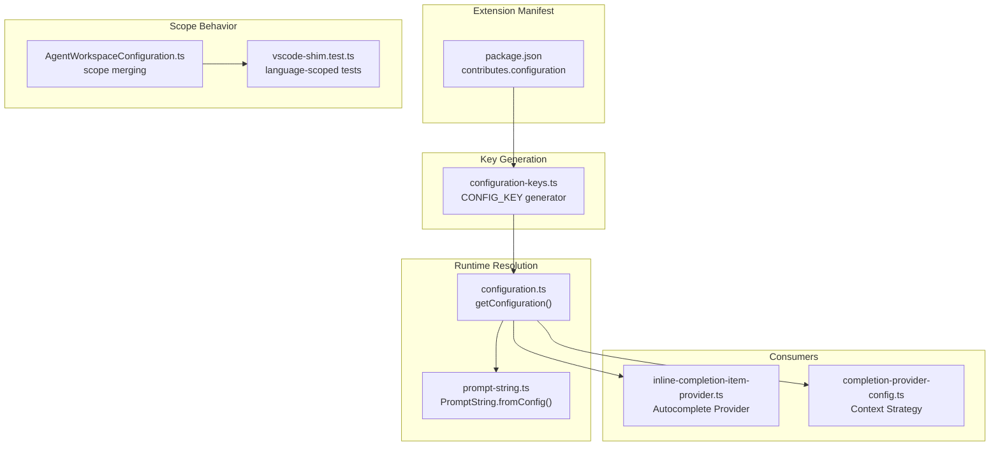
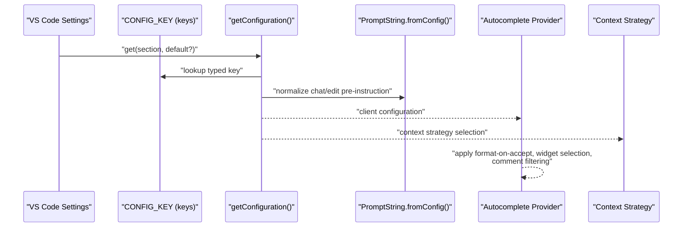
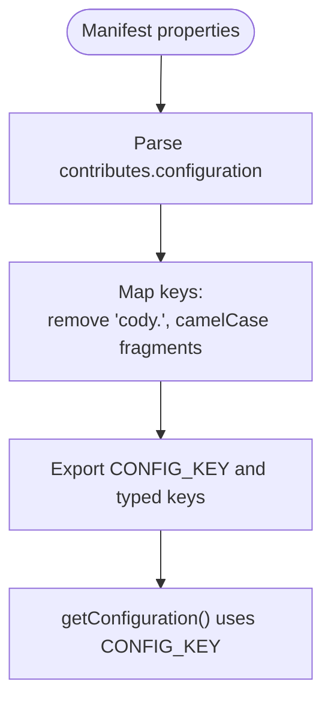
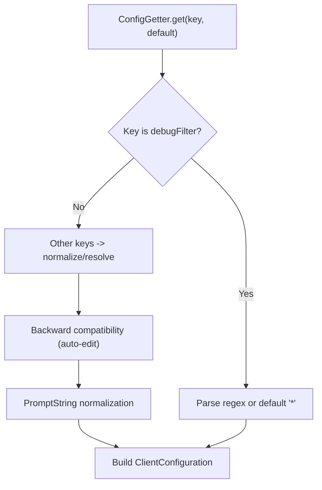
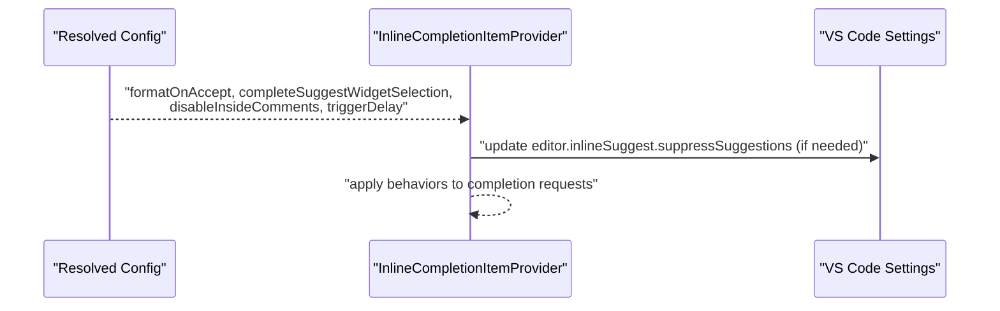
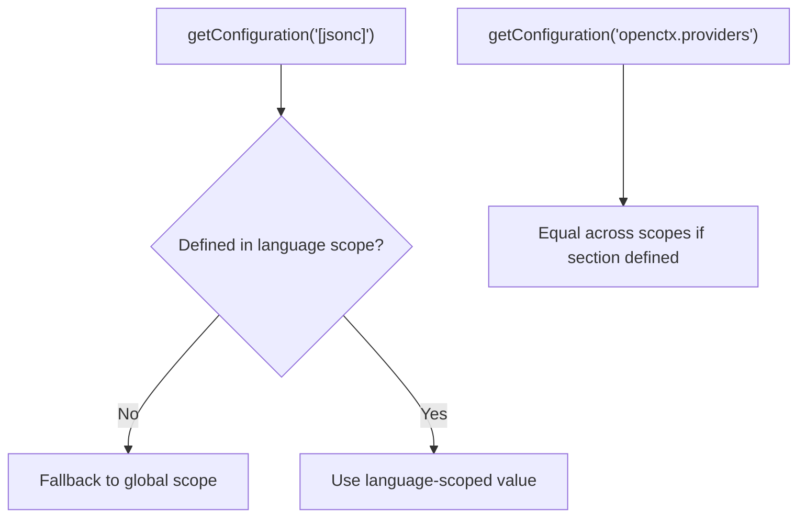
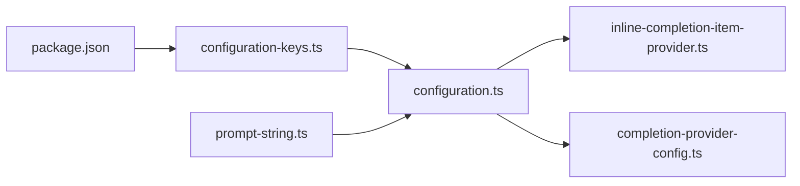

# User Preferences

<cite>
**Referenced Files in This Document**
- [configuration-keys.ts](file://vscode/src/configuration-keys.ts)
- [configuration.ts](file://vscode/src/configuration.ts)
- [package.json](file://vscode/package.json)
- [configuration.test.ts](file://vscode/src/configuration.test.ts)
- [prompt-string.ts](file://lib/shared/src/prompt/prompt-string.ts)
- [inline-completion-item-provider.ts](file://vscode/src/completions/inline-completion-item-provider.ts)
- [completion-provider-config.ts](file://vscode/src/completions/completion-provider-config.ts)
- [AgentWorkspaceConfiguration.ts](file://agent/src/AgentWorkspaceConfiguration.ts)
- [vscode-shim.test.ts](file://agent/src/vscode-shim.test.ts)
</cite>

## Table of Contents
1. [Introduction](#introduction)
2. [Project Structure](#project-structure)
3. [Core Components](#core-components)
4. [Architecture Overview](#architecture-overview)
5. [Detailed Component Analysis](#detailed-component-analysis)
6. [Dependency Analysis](#dependency-analysis)
7. [Performance Considerations](#performance-considerations)
8. [Troubleshooting Guide](#troubleshooting-guide)
9. [Conclusion](#conclusion)

## Introduction
This document explains the Cody platform’s user preference configuration system. It covers how autocomplete, chat, and code action behaviors are controlled, how configuration keys are generated and resolved, and how settings are inherited across user, workspace, and folder scopes. It also provides practical scenarios, validation and default behaviors, backward compatibility considerations, and troubleshooting guidance for common configuration issues.

## Project Structure
Cody’s configuration is defined declaratively in the extension manifest and consumed at runtime by a strongly typed configuration accessor. The key files involved are:
- Configuration schema and keys: package.json contributes a configuration object with properties and defaults
- Configuration key inference: a generator reads the schema to produce a type-safe key map
- Runtime configuration resolution: a resolver reads VS Code settings and applies sanitization and defaults
- Prompt handling: user-entered strings are normalized into prompt-safe values
- Autocomplete behavior: provider configuration consumes resolved settings
- Workspace scope behavior: tests demonstrate how language-scoped and nested sections behave

**Diagram sources**
- [package.json:877-1271](file://vscode/package.json#L877-L1271)
- [configuration-keys.ts:18-52](file://vscode/src/configuration-keys.ts#L18-L52)
- [configuration.ts:25-204](file://vscode/src/configuration.ts#L25-L204)
- [prompt-string.ts:226-238](file://lib/shared/src/prompt/prompt-string.ts#L226-L238)
- [inline-completion-item-provider.ts:134-159](file://vscode/src/completions/inline-completion-item-provider.ts#L134-L159)
- [completion-provider-config.ts:46-72](file://vscode/src/completions/completion-provider-config.ts#L46-L72)
- [AgentWorkspaceConfiguration.ts:114-150](file://agent/src/AgentWorkspaceConfiguration.ts#L114-L150)
- [vscode-shim.test.ts:415-434](file://agent/src/vscode-shim.test.ts#L415-L434)

**Section sources**
- [package.json:877-1271](file://vscode/package.json#L877-L1271)
- [configuration-keys.ts:18-52](file://vscode/src/configuration-keys.ts#L18-L52)
- [configuration.ts:25-204](file://vscode/src/configuration.ts#L25-L204)

## Core Components
- Configuration schema and defaults: declared in package.json under contributes.configuration. Keys include autocomplete, chat, code actions, command hints, networking, and internal/experimental toggles.
- Type-safe configuration keys: generated from the schema to prevent drift between keys and defaults.
- Runtime configuration resolver: reads VS Code configuration, applies sanitization, backward compatibility, and default values.
- Prompt normalization: converts user-entered strings into prompt-safe values with optional fallbacks.
- Autocomplete provider configuration: consumes resolved settings to adjust behavior like format-on-accept, widget selection, and comment filtering.
- Scope resolution: language-scoped and nested sections are supported; tests confirm fallback and equality semantics.

**Section sources**
- [package.json:877-1271](file://vscode/package.json#L877-L1271)
- [configuration-keys.ts:18-52](file://vscode/src/configuration-keys.ts#L18-L52)
- [configuration.ts:25-204](file://vscode/src/configuration.ts#L25-L204)
- [prompt-string.ts:226-238](file://lib/shared/src/prompt/prompt-string.ts#L226-L238)
- [inline-completion-item-provider.ts:134-159](file://vscode/src/completions/inline-completion-item-provider.ts#L134-L159)
- [vscode-shim.test.ts:415-434](file://agent/src/vscode-shim.test.ts#L415-L434)

## Architecture Overview
The configuration pipeline resolves user preferences from VS Code settings, normalizes them, and exposes a client configuration object to consumers. The diagram below maps the flow from schema to runtime behavior.

**Diagram sources**
- [configuration.ts:25-204](file://vscode/src/configuration.ts#L25-L204)
- [configuration-keys.ts:18-52](file://vscode/src/configuration-keys.ts#L18-L52)
- [prompt-string.ts:226-238](file://lib/shared/src/prompt/prompt-string.ts#L226-L238)
- [inline-completion-item-provider.ts:134-159](file://vscode/src/completions/inline-completion-item-provider.ts#L134-L159)
- [completion-provider-config.ts:46-72](file://vscode/src/completions/completion-provider-config.ts#L46-L72)

## Detailed Component Analysis

### Configuration Schema and Defaults
- The extension declares a comprehensive configuration object with properties for autocomplete, chat, code actions, command hints, networking, and internal/experimental toggles.
- Defaults are provided for each property, ensuring predictable behavior when users do not customize settings.
- Deprecated or transitional keys are annotated to guide migration.

Key categories and representative entries:
- Autocomplete: trigger delay, language enablement map, advanced provider, format-on-accept, complete suggest widget selection, disable-inside-comments, graph context, and provider-specific options.
- Chat: pre-instruction, default location, agentic context toggle, and experimental options.
- Code actions and command hints: enablement flags for Quick Fix integrations and command hints.
- Networking: proxy endpoint, mode, and certificate settings.
- Internal/experimental: tracing, guardrails timeout, and developer-only flags.

**Section sources**
- [package.json:877-1271](file://vscode/package.json#L877-L1271)

### Configuration Key System
- Keys are inferred from the manifest’s configuration properties to maintain type safety and reduce duplication.
- The generator removes the “cody.” prefix and camelCases remaining segments, producing a strongly typed CONFIG_KEY object.
- This approach ensures that adding or renaming keys in the manifest updates the consumer types automatically.

**Diagram sources**
- [configuration-keys.ts:18-52](file://vscode/src/configuration-keys.ts#L18-L52)

**Section sources**
- [configuration-keys.ts:18-52](file://vscode/src/configuration-keys.ts#L18-L52)

### Runtime Configuration Resolution
- getConfiguration reads VS Code settings via a ConfigGetter abstraction, applying:
  - Regex sanitization for debug filter with graceful fallback on invalid patterns
  - Backward compatibility for legacy auto-edit suggestion modes
  - Prompt normalization for chat and edit pre-instructions
  - Default values for all user-facing toggles and provider options
  - Hidden/internal/experimental flags with documented scope
- The resolver returns a ClientConfiguration object consumed by providers and services.

**Diagram sources**
- [configuration.ts:25-204](file://vscode/src/configuration.ts#L25-L204)
- [prompt-string.ts:226-238](file://lib/shared/src/prompt/prompt-string.ts#L226-L238)

**Section sources**
- [configuration.ts:25-204](file://vscode/src/configuration.ts#L25-L204)

### Prompt Normalization
- User-entered strings for chat and edit pre-instructions are normalized into prompt-safe values.
- Empty or null values fall back to provided defaults, ensuring robustness.

**Section sources**
- [prompt-string.ts:226-238](file://lib/shared/src/prompt/prompt-string.ts#L226-L238)

### Autocomplete Behavior and Widget Selection
- The autocomplete provider reads resolved settings to control:
  - Format on accept behavior
  - Complete suggest widget selection
  - Disable requests inside comments
  - Trigger delay and other provider-specific timeouts
- When complete suggest widget selection is enabled, the provider updates a VS Code setting to ensure inline completions remain visible.

**Diagram sources**
- [inline-completion-item-provider.ts:134-198](file://vscode/src/completions/inline-completion-item-provider.ts#L134-L198)

**Section sources**
- [inline-completion-item-provider.ts:134-198](file://vscode/src/completions/inline-completion-item-provider.ts#L134-L198)

### Chat Behavior and Agentic Context
- Chat pre-instruction and edit pre-instruction are normalized and applied to prompts.
- Agentic context for chat can be toggled, and experimental options allow fine-grained control over agent capabilities.

**Section sources**
- [configuration.ts:100-124](file://vscode/src/configuration.ts#L100-L124)
- [prompt-string.ts:226-238](file://lib/shared/src/prompt/prompt-string.ts#L226-L238)

### Code Action and Command Hint Configuration
- Code actions enablement controls whether Cody appears in Quick Fix menus.
- Command hints enablement controls contextual hints for commands like Edit and Document.

**Section sources**
- [configuration.ts:116-117](file://vscode/src/configuration.ts#L116-L117)

### Scope Resolution and Inheritance
- Language-scoped sections (e.g., [jsonc]) fall back to global scope when not explicitly defined.
- Nested section paths are supported and equal across scopes when the section itself is defined.
- Tests demonstrate consistent behavior across scopes and nested paths.

**Diagram sources**
- [vscode-shim.test.ts:415-434](file://agent/src/vscode-shim.test.ts#L415-L434)

**Section sources**
- [vscode-shim.test.ts:415-434](file://agent/src/vscode-shim.test.ts#L415-L434)

### Backward Compatibility and Legacy Keys
- Suggestions mode includes backward-compatible values for auto-edit modes, which are migrated to the modern suggestion mode and persisted.
- Deprecated keys are annotated in the manifest to guide users toward supported alternatives.

**Section sources**
- [configuration.ts:55-72](file://vscode/src/configuration.ts#L55-L72)
- [package.json:907-917](file://vscode/package.json#L907-L917)

## Dependency Analysis
- configuration.ts depends on:
  - configuration-keys.ts for typed keys
  - prompt-string.ts for prompt normalization
  - VS Code workspace configuration API for values
- inline-completion-item-provider.ts consumes resolved configuration to adjust provider behavior.
- completion-provider-config.ts observes resolved configuration to select context strategies.

**Diagram sources**
- [package.json:877-1271](file://vscode/package.json#L877-L1271)
- [configuration-keys.ts:18-52](file://vscode/src/configuration-keys.ts#L18-L52)
- [configuration.ts:25-204](file://vscode/src/configuration.ts#L25-L204)
- [prompt-string.ts:226-238](file://lib/shared/src/prompt/prompt-string.ts#L226-L238)
- [inline-completion-item-provider.ts:134-159](file://vscode/src/completions/inline-completion-item-provider.ts#L134-L159)
- [completion-provider-config.ts:46-72](file://vscode/src/completions/completion-provider-config.ts#L46-L72)

**Section sources**
- [configuration.ts:25-204](file://vscode/src/configuration.ts#L25-L204)
- [inline-completion-item-provider.ts:134-159](file://vscode/src/completions/inline-completion-item-provider.ts#L134-L159)
- [completion-provider-config.ts:46-72](file://vscode/src/completions/completion-provider-config.ts#L46-L72)

## Performance Considerations
- Autocomplete behavior is influenced by resolved configuration values such as trigger delay and first-completion timeout. Adjusting these can improve responsiveness or accuracy depending on user needs.
- Context strategy selection is driven by resolved configuration and feature flags, impacting retrieval performance and relevance.

[No sources needed since this section provides general guidance]

## Troubleshooting Guide
Common issues and resolutions:
- Invalid debug filter regex: The resolver catches errors and falls back to a default pattern. Verify the regex syntax in the configuration.
- Autocomplete not appearing despite enabled settings: Ensure the suggest widget suppression setting is correctly updated when complete suggest widget selection is enabled.
- Language-specific autocomplete not working: Confirm language-scoped sections are defined; if not, values fall back to global scope.
- Nested configuration sections: When a section is defined, values are equal across scopes; verify the section path matches the intended scope.
- Backward compatibility: If legacy auto-edit suggestion modes were used, they are migrated to the modern suggestion mode; check the persisted value after migration.

**Section sources**
- [configuration.ts:42-48](file://vscode/src/configuration.ts#L42-L48)
- [inline-completion-item-provider.ts:181-198](file://vscode/src/completions/inline-completion-item-provider.ts#L181-L198)
- [vscode-shim.test.ts:415-434](file://agent/src/vscode-shim.test.ts#L415-L434)
- [configuration.ts:55-72](file://vscode/src/configuration.ts#L55-L72)

## Conclusion
Cody’s configuration system balances flexibility and safety by deriving keys from the manifest, normalizing user inputs, and resolving defaults at runtime. Users can tailor autocomplete, chat, and code action behaviors to their workflow, with clear scope semantics and backward compatibility. The provided troubleshooting guidance helps diagnose common configuration pitfalls.