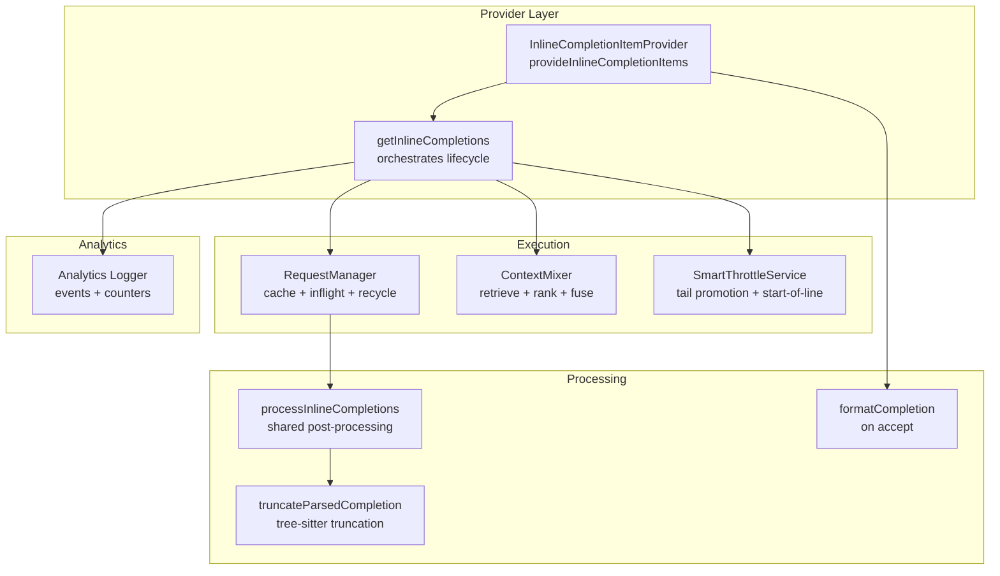
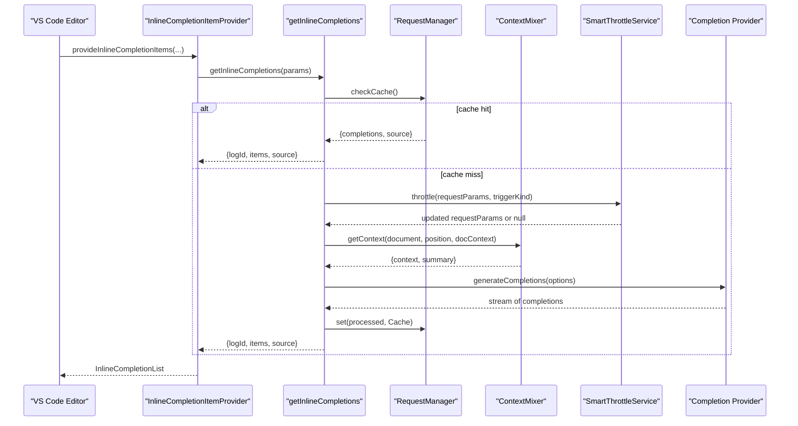
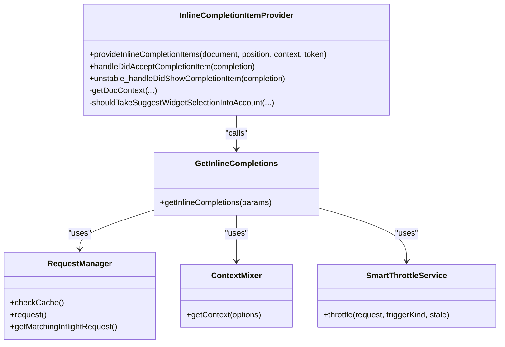
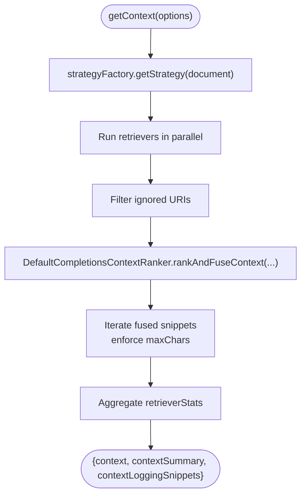
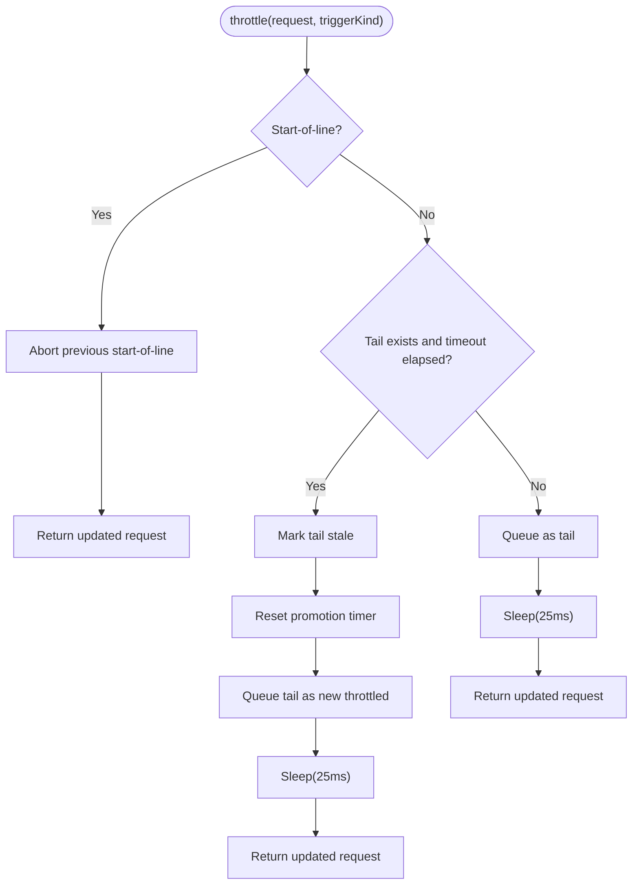
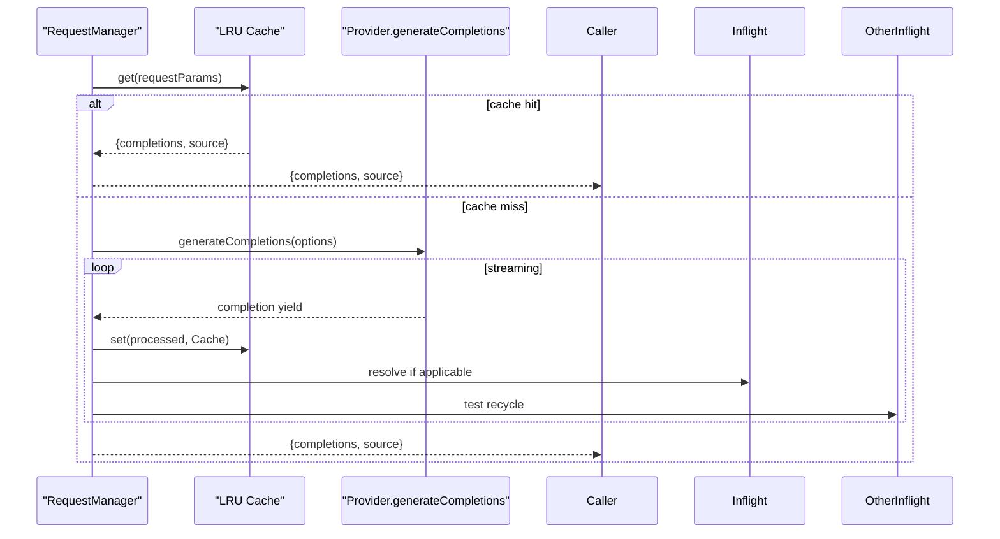
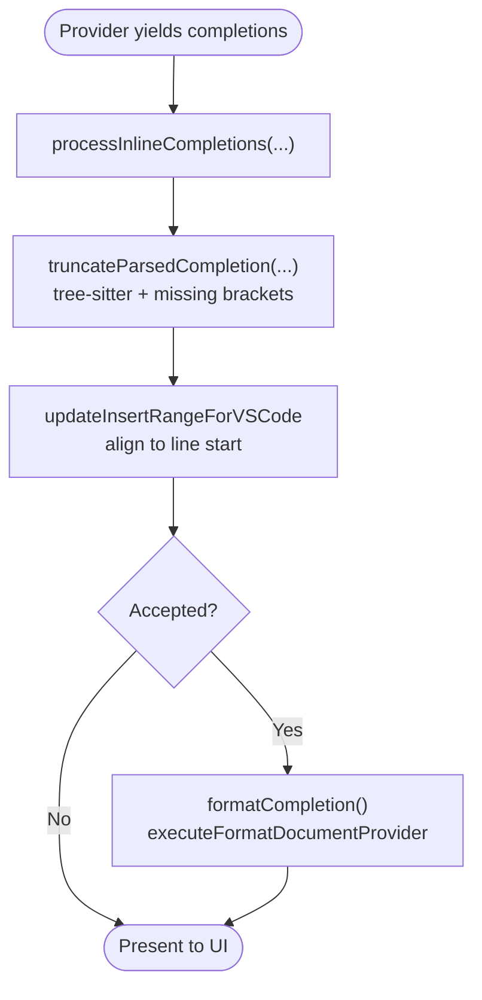
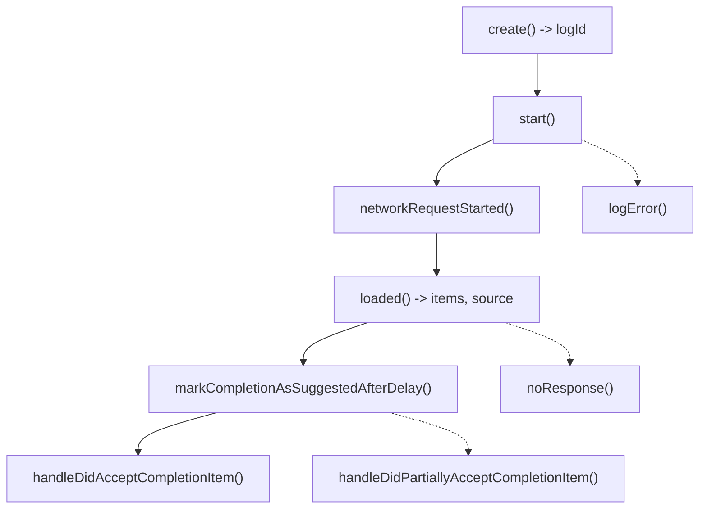
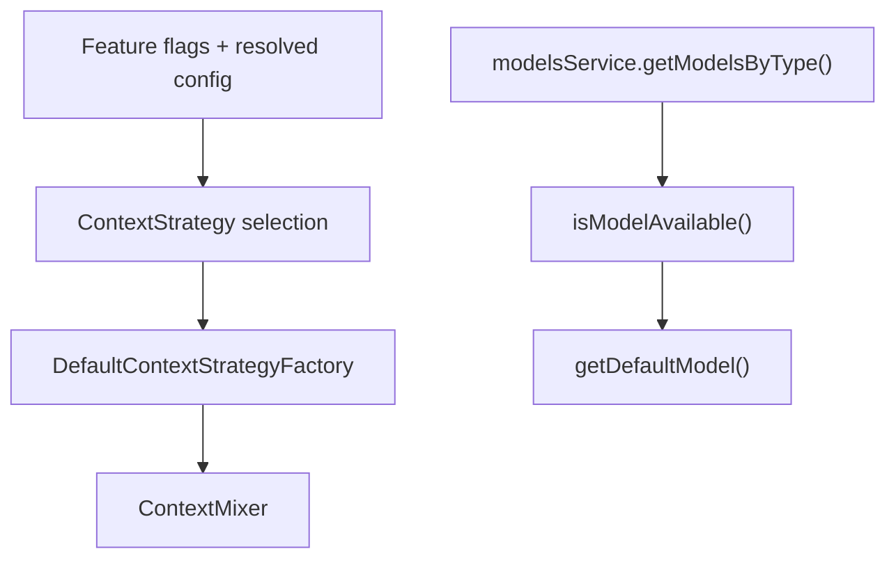
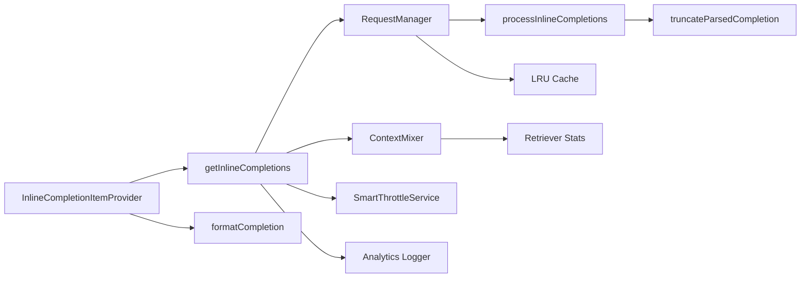

# Autocomplete Engine

<cite>
**Referenced Files in This Document**
- [inline-completion-item-provider.ts](file://vscode/src/completions/inline-completion-item-provider.ts)
- [get-inline-completions.ts](file://vscode/src/completions/get-inline-completions.ts)
- [smart-throttle.ts](file://vscode/src/completions/smart-throttle.ts)
- [context-mixer.ts](file://vscode/src/completions/context/context-mixer.ts)
- [request-manager.ts](file://vscode/src/completions/request-manager.ts)
- [suggested-autocomplete-items-cache.ts](file://vscode/src/completions/suggested-autocomplete-items-cache.ts)
- [format-completion.ts](file://vscode/src/completions/format-completion.ts)
- [completion-provider-config.ts](file://vscode/src/completions/completion-provider-config.ts)
- [analytics-logger.ts](file://vscode/src/completions/analytics-logger.ts)
- [truncate-parsed-completion.ts](file://vscode/src/completions/text-processing/truncate-parsed-completion.ts)
- [truncate-parsed-completion.test.ts](file://vscode/src/completions/text-processing/truncate-parsed-completion.test.ts)
- [post-processing.test.ts](file://vscode/src/completions/get-inline-completions-tests/post-processing.test.ts)
- [truncation.ts](file://lib/shared/src/prompt/truncation.ts)
- [model.ts](file://lib/shared/src/models/model.ts)
- [modelsService.ts](file://lib/shared/src/models/modelsService.ts)
- [agent.ts](file://agent/src/agent.ts)
- [inline-completion-item-provider.test.ts](file://vscode/src/completions/inline-completion-item-provider.test.ts)
- [inline-completion-item-provider-e2e.test.ts](file://vscode/src/completions/inline-completion-item-provider-e2e.test.ts)
</cite>

## Table of Contents
1. [Introduction](#introduction)
2. [Project Structure](#project-structure)
3. [Core Components](#core-components)
4. [Architecture Overview](#architecture-overview)
5. [Detailed Component Analysis](#detailed-component-analysis)
6. [Dependency Analysis](#dependency-analysis)
7. [Performance Considerations](#performance-considerations)
8. [Troubleshooting Guide](#troubleshooting-guide)
9. [Conclusion](#conclusion)
10. [Appendices](#appendices)

## Introduction
This document explains the Cody autocomplete engine: how inline completions are requested, processed, ranked, and presented; how context is mixed across multiple sources; how providers are integrated; and how performance and analytics are optimized. It covers the provider architecture, context mixing algorithms, suggestion ranking, text processing (parsing, truncation, formatting), configuration options, smart throttle and caching strategies, model selection, and analytics tracking.

## Project Structure
The autocomplete engine lives primarily under vscode/src/completions and integrates with shared libraries for models and telemetry. Key areas:
- Provider orchestration and UI integration
- Request lifecycle and caching
- Context retrieval and ranking
- Smart throttle and debouncing
- Text processing and formatting
- Analytics and telemetry
- Configuration and feature flags

**Diagram sources**
- [inline-completion-item-provider.ts:317-654](file://vscode/src/completions/inline-completion-item-provider.ts#L317-L654)
- [get-inline-completions.ts:184-527](file://vscode/src/completions/get-inline-completions.ts#L184-L527)
- [request-manager.ts:116-214](file://vscode/src/completions/request-manager.ts#L116-L214)
- [context-mixer.ts:107-244](file://vscode/src/completions/context/context-mixer.ts#L107-L244)
- [smart-throttle.ts:33-86](file://vscode/src/completions/smart-throttle.ts#L33-L86)
- [truncate-parsed-completion.ts:55-86](file://vscode/src/completions/text-processing/truncate-parsed-completion.ts#L55-L86)
- [format-completion.ts:8-58](file://vscode/src/completions/format-completion.ts#L8-L58)
- [analytics-logger.ts:636-745](file://vscode/src/completions/analytics-logger.ts#L636-L745)

**Section sources**
- [inline-completion-item-provider.ts:1-247](file://vscode/src/completions/inline-completion-item-provider.ts#L1-L247)
- [get-inline-completions.ts:1-120](file://vscode/src/completions/get-inline-completions.ts#L1-L120)

## Core Components
- InlineCompletionItemProvider: Orchestrates requests, manages UI state, triggers analytics, and formats on accept.
- getInlineCompletions: Central orchestrator that decides reuse, caching, throttling, context retrieval, and provider invocation.
- RequestManager: Manages cache, inflight requests, result recycling, and cancellation.
- ContextMixer: Retrieves context from multiple sources, filters, ranks via reciprocal rank fusion, and fuses into a bounded prompt.
- SmartThrottleService: Moves beyond simple debouncing; promotes tail requests and cancels outdated ones.
- Text Processing: Shared post-processing, truncation strategies, and formatting on accept.
- Analytics Logger: Records lifecycle events, suggestion/read/accept, and performance stages.
- Configuration: Feature flags and context strategy selection.

**Section sources**
- [inline-completion-item-provider.ts:97-247](file://vscode/src/completions/inline-completion-item-provider.ts#L97-L247)
- [get-inline-completions.ts:184-527](file://vscode/src/completions/get-inline-completions.ts#L184-L527)
- [request-manager.ts:74-303](file://vscode/src/completions/request-manager.ts#L74-L303)
- [context-mixer.ts:88-273](file://vscode/src/completions/context/context-mixer.ts#L88-L273)
- [smart-throttle.ts:21-101](file://vscode/src/completions/smart-throttle.ts#L21-L101)
- [analytics-logger.ts:636-745](file://vscode/src/completions/analytics-logger.ts#L636-L745)
- [completion-provider-config.ts:14-144](file://vscode/src/completions/completion-provider-config.ts#L14-L144)

## Architecture Overview
The engine follows a staged pipeline:
1. Provider receives a request and determines trigger kind and doc context.
2. It checks cache, inflight matches, and applies smart throttle.
3. ContextMixer retrieves and ranks context from multiple sources.
4. Provider invokes the completion provider and processes results.
5. Results are post-processed, truncated, and presented; analytics are recorded.

**Diagram sources**
- [inline-completion-item-provider.ts:317-654](file://vscode/src/completions/inline-completion-item-provider.ts#L317-L654)
- [get-inline-completions.ts:380-527](file://vscode/src/completions/get-inline-completions.ts#L380-L527)
- [request-manager.ts:116-214](file://vscode/src/completions/request-manager.ts#L116-L214)
- [context-mixer.ts:107-244](file://vscode/src/completions/context/context-mixer.ts#L107-L244)
- [smart-throttle.ts:33-86](file://vscode/src/completions/smart-throttle.ts#L33-L86)

## Detailed Component Analysis

### Provider Orchestration and Lifecycle
- InlineCompletionItemProvider coordinates feature flags, context filtering, trigger kinds, debounce, and UI updates.
- It computes doc context, completion intent, and passes parameters to getInlineCompletions.
- It formats on accept and tracks first completion onboarding.

**Diagram sources**
- [inline-completion-item-provider.ts:97-247](file://vscode/src/completions/inline-completion-item-provider.ts#L97-L247)
- [get-inline-completions.ts:184-527](file://vscode/src/completions/get-inline-completions.ts#L184-L527)
- [request-manager.ts:74-303](file://vscode/src/completions/request-manager.ts#L74-L303)
- [context-mixer.ts:88-273](file://vscode/src/completions/context/context-mixer.ts#L88-L273)
- [smart-throttle.ts:21-101](file://vscode/src/completions/smart-throttle.ts#L21-L101)

**Section sources**
- [inline-completion-item-provider.ts:317-654](file://vscode/src/completions/inline-completion-item-provider.ts#L317-L654)
- [get-inline-completions.ts:218-527](file://vscode/src/completions/get-inline-completions.ts#L218-L527)

### Context Mixing and Ranking
- ContextMixer selects a strategy (via factory) and runs multiple retrievers concurrently.
- It filters ignored URIs, ranks/fuses results using reciprocal rank fusion, and builds a bounded context list.
- Statistics and summaries are collected for analytics and diagnostics.

**Diagram sources**
- [context-mixer.ts:107-244](file://vscode/src/completions/context/context-mixer.ts#L107-L244)

**Section sources**
- [context-mixer.ts:1-287](file://vscode/src/completions/context/context-mixer.ts#L1-L287)

### Smart Throttle Mechanism
- Promotes tail requests after a timeout and cancels older ones.
- Immediately proceeds with start-of-line requests and resets promotion timer.
- Integrates with cancellation to avoid wasted work.

**Diagram sources**
- [smart-throttle.ts:33-86](file://vscode/src/completions/smart-throttle.ts#L33-L86)

**Section sources**
- [smart-throttle.ts:1-125](file://vscode/src/completions/smart-throttle.ts#L1-L125)

### Request Lifecycle, Caching, and Recycling
- RequestManager caches results keyed by a fuzzy prefix signature; supports exact and fuzzy matches.
- Recycles results across inflight requests when forward-typed continuations are detected.
- Cancels irrelevant inflight requests when context diverges.

**Diagram sources**
- [request-manager.ts:116-214](file://vscode/src/completions/request-manager.ts#L116-L214)
- [request-manager.ts:224-274](file://vscode/src/completions/request-manager.ts#L224-L274)

**Section sources**
- [request-manager.ts:74-303](file://vscode/src/completions/request-manager.ts#L74-L303)

### Text Processing Pipeline: Parsing, Truncation, Formatting
- Shared post-processing transforms provider outputs into VS Code items.
- Tree-sitter-based truncation ensures syntactic validity when inserting completions.
- Indentation-aware adjustments align insert ranges to current line start.
- Formatting on accept uses editor formatters to normalize inserted code.

**Diagram sources**
- [truncate-parsed-completion.ts:55-86](file://vscode/src/completions/text-processing/truncate-parsed-completion.ts#L55-L86)
- [suggested-autocomplete-items-cache.ts:189-212](file://vscode/src/completions/suggested-autocomplete-items-cache.ts#L189-L212)
- [format-completion.ts:8-58](file://vscode/src/completions/format-completion.ts#L8-L58)

**Section sources**
- [truncate-parsed-completion.ts:1-86](file://vscode/src/completions/text-processing/truncate-parsed-completion.ts#L1-L86)
- [truncate-parsed-completion.test.ts:1-39](file://vscode/src/completions/text-processing/truncate-parsed-completion.test.ts#L1-L39)
- [post-processing.test.ts:1-39](file://vscode/src/completions/get-inline-completions-tests/post-processing.test.ts#L1-L39)
- [suggested-autocomplete-items-cache.ts:189-212](file://vscode/src/completions/suggested-autocomplete-items-cache.ts#L189-L212)
- [format-completion.ts:1-75](file://vscode/src/completions/format-completion.ts#L1-L75)

### Analytics Tracking and Effectiveness
- Creates and tracks a lifecycle log ID per suggestion.
- Logs start, network request start, loaded, suggested, accepted, partial accept, no response, and error.
- Emits telemetry with mapped enums for trigger kind, source, and completion intent.
- Tracks stage timings and context summaries.

**Diagram sources**
- [analytics-logger.ts:636-745](file://vscode/src/completions/analytics-logger.ts#L636-L745)
- [inline-completion-item-provider.ts:660-697](file://vscode/src/completions/inline-completion-item-provider.ts#L660-L697)

**Section sources**
- [analytics-logger.ts:1-530](file://vscode/src/completions/analytics-logger.ts#L1-L530)

### Configuration Options and Model Selection
- Context strategy selection is driven by feature flags and resolved configuration.
- Model availability and defaults are computed centrally; tags and statuses influence eligibility.
- Provider configuration is prefetched to warm feature flags and reduce first-hit latency.

**Diagram sources**
- [completion-provider-config.ts:46-124](file://vscode/src/completions/completion-provider-config.ts#L46-L124)
- [modelsService.ts:425-459](file://lib/shared/src/models/modelsService.ts#L425-L459)
- [model.ts:253-282](file://lib/shared/src/models/model.ts#L253-L282)

**Section sources**
- [completion-provider-config.ts:1-144](file://vscode/src/completions/completion-provider-config.ts#L1-L144)
- [modelsService.ts:425-459](file://lib/shared/src/models/modelsService.ts#L425-L459)
- [model.ts:253-282](file://lib/shared/src/models/model.ts#L253-L282)

### Practical Usage Examples
- Manual trigger: Keyboard shortcut invokes a manual trigger, bypassing smart throttle.
- Preload: Empty line detection triggers preloading to reduce perceived latency.
- Suggest widget selection: When the user cycles suggestions, the engine incorporates the selected item into context.
- Agent integration: The agent calls the same provider entry point with structured parameters.

**Section sources**
- [inline-completion-item-provider.ts:254-310](file://vscode/src/completions/inline-completion-item-provider.ts#L254-L310)
- [inline-completion-item-provider.ts:403-475](file://vscode/src/completions/inline-completion-item-provider.ts#L403-L475)
- [agent.ts:975-1001](file://agent/src/agent.ts#L975-L1001)
- [inline-completion-item-provider.test.ts:611-642](file://vscode/src/completions/inline-completion-item-provider.test.ts#L611-L642)

## Dependency Analysis
- Provider depends on RequestManager, ContextMixer, SmartThrottleService, and analytics/logger.
- ContextMixer depends on retrievers and a ranking strategy; it logs retriever stats.
- RequestManager depends on provider generator and caches results; it recycles and cancels inflights.
- Analytics logger depends on telemetry recorder and maintains LRU caches for bookkeeping.

**Diagram sources**
- [inline-completion-item-provider.ts:97-247](file://vscode/src/completions/inline-completion-item-provider.ts#L97-L247)
- [get-inline-completions.ts:184-527](file://vscode/src/completions/get-inline-completions.ts#L184-L527)
- [request-manager.ts:74-303](file://vscode/src/completions/request-manager.ts#L74-L303)
- [context-mixer.ts:88-273](file://vscode/src/completions/context/context-mixer.ts#L88-L273)
- [smart-throttle.ts:21-101](file://vscode/src/completions/smart-throttle.ts#L21-L101)
- [truncate-parsed-completion.ts:55-86](file://vscode/src/completions/text-processing/truncate-parsed-completion.ts#L55-L86)
- [format-completion.ts:8-58](file://vscode/src/completions/format-completion.ts#L8-L58)
- [analytics-logger.ts:636-745](file://vscode/src/completions/analytics-logger.ts#L636-L745)

**Section sources**
- [inline-completion-item-provider.ts:1-247](file://vscode/src/completions/inline-completion-item-provider.ts#L1-L247)
- [get-inline-completions.ts:1-120](file://vscode/src/completions/get-inline-completions.ts#L1-L120)

## Performance Considerations
- Smart throttle reduces concurrency and cancellations; tail promotion minimizes staleness.
- Debounce split: immediate wait chunk plus parallel context retrieval.
- Request recycling avoids recomputation when forward-typed continuations are detected.
- Caching uses fuzzy prefix signatures to reuse results across minor edits.
- Truncation uses tree-sitter to preserve syntax correctness and minimize reparse overhead.
- Formatting is scoped to inserted range and uses editor-provided formatters.

[No sources needed since this section provides general guidance]

## Troubleshooting Guide
- Autocomplete disabled: Provider checks client configuration and throws an error if disabled.
- Rate limit or content mismatch: Provider hides suggestions when editor content does not match popup item.
- Aborted or stale requests: Engine marks requests stale when superseded by newer ones; aborts irrelevant inflight requests.
- Visibility checks: Provider filters completions that would not be visible in the UI.
- E2E behavior: Tests demonstrate that stale results are suppressed and only the latest is shown.

**Section sources**
- [inline-completion-item-provider.ts:357-401](file://vscode/src/completions/inline-completion-item-provider.ts#L357-L401)
- [get-inline-completions.ts:380-417](file://vscode/src/completions/get-inline-completions.ts#L380-L417)
- [inline-completion-item-provider-e2e.test.ts:356-381](file://vscode/src/completions/inline-completion-item-provider-e2e.test.ts#L356-L381)

## Conclusion
The Cody autocomplete engine combines a robust provider orchestration layer with efficient caching, smart throttling, and multi-source context mixing. Its text processing pipeline ensures syntactic correctness and a polished UX, while comprehensive analytics track effectiveness and user interaction patterns. Configuration and model selection logic ensure providers and models are tuned for performance and quality.

[No sources needed since this section summarizes without analyzing specific files]

## Appendices

### Configuration Options
- Trigger delay and debounce intervals
- Format on accept
- Disable inside comments
- Complete suggest widget selection behavior
- Provider configuration and model selection

**Section sources**
- [inline-completion-item-provider.ts:134-198](file://vscode/src/completions/inline-completion-item-provider.ts#L134-L198)
- [completion-provider-config.ts:46-124](file://vscode/src/completions/completion-provider-config.ts#L46-L124)

### Integration Notes
- Agent calls the same provider entry point with structured parameters.
- VS Code provider registers commands and manages disposables.

**Section sources**
- [agent.ts:975-1001](file://agent/src/agent.ts#L975-L1001)
- [inline-completion-item-provider.ts:226-233](file://vscode/src/completions/inline-completion-item-provider.ts#L226-L233)