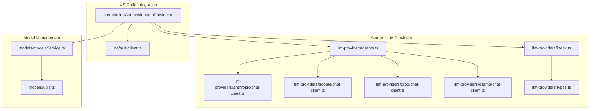
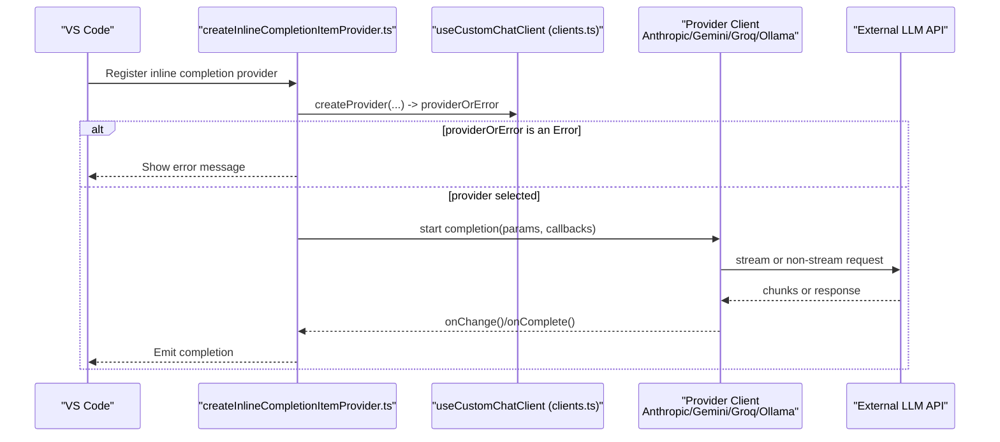
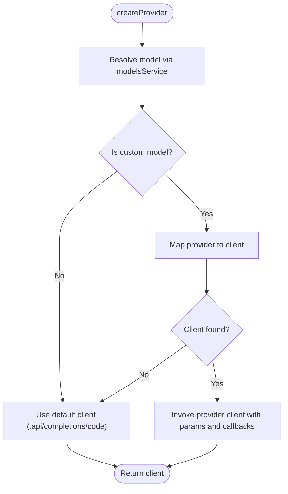
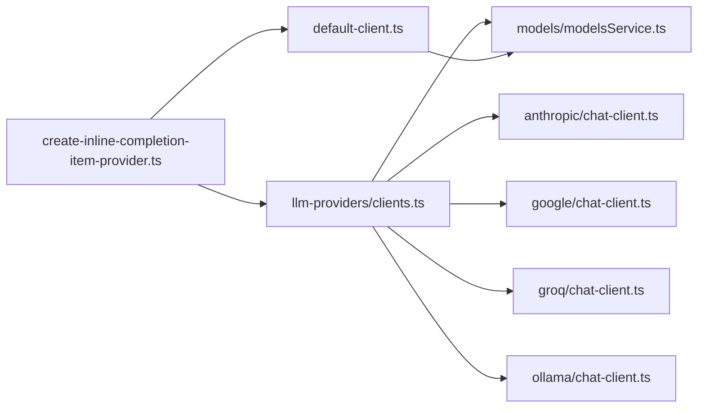

# Completion Providers

<cite>
**Referenced Files in This Document**
- [create-inline-completion-item-provider.ts](file://vscode/src/completions/create-inline-completion-item-provider.ts)
- [default-client.ts](file://vscode/src/completions/default-client.ts)
- [index.ts](file://lib/shared/src/llm-providers/index.ts)
- [clients.ts](file://lib/shared/src/llm-providers/clients.ts)
- [types.ts](file://lib/shared/src/llm-providers/types.ts)
- [anthropic/chat-client.ts](file://lib/shared/src/llm-providers/anthropic/chat-client.ts)
- [google/chat-client.ts](file://lib/shared/src/llm-providers/google/chat-client.ts)
- [groq/chat-client.ts](file://lib/shared/src/llm-providers/groq/chat-client.ts)
- [ollama/chat-client.ts](file://lib/shared/src/llm-providers/ollama/chat-client.ts)
- [modelsService.ts](file://lib/shared/src/models/modelsService.ts)
- [utils.ts](file://lib/shared/src/models/utils.ts)
</cite>

## Table of Contents
1. [Introduction](#introduction)
2. [Project Structure](#project-structure)
3. [Core Components](#core-components)
4. [Architecture Overview](#architecture-overview)
5. [Detailed Component Analysis](#detailed-component-analysis)
6. [Dependency Analysis](#dependency-analysis)
7. [Performance Considerations](#performance-considerations)
8. [Troubleshooting Guide](#troubleshooting-guide)
9. [Conclusion](#conclusion)

## Introduction
This document explains the completion providers subsystem in the Cody codebase. It covers the shared provider factory, AI model integrations (Anthropic Claude, Google Gemini, OpenAI-compatible via Groq/Ollama), provider selection logic, configuration options, error handling, lifecycle management, caching strategies, and fallback mechanisms. It also highlights provider-specific features such as temperature, max tokens, streaming, and limitations.

## Project Structure
The completion providers subsystem spans two main areas:
- VS Code integration layer: registers the inline completion provider and wires the shared provider factory.
- Shared LLM providers layer: encapsulates provider-specific clients and model configuration resolution.

**Diagram sources**
- [create-inline-completion-item-provider.ts:1-131](file://vscode/src/completions/create-inline-completion-item-provider.ts#L1-L131)
- [default-client.ts:1-331](file://vscode/src/completions/default-client.ts#L1-L331)
- [index.ts:1-24](file://lib/shared/src/llm-providers/index.ts#L1-L24)
- [clients.ts:1-36](file://lib/shared/src/llm-providers/clients.ts#L1-L36)
- [anthropic/chat-client.ts:1-84](file://lib/shared/src/llm-providers/anthropic/chat-client.ts#L1-L84)
- [google/chat-client.ts:1-80](file://lib/shared/src/llm-providers/google/chat-client.ts#L1-L80)
- [groq/chat-client.ts:1-161](file://lib/shared/src/llm-providers/groq/chat-client.ts#L1-L161)
- [ollama/chat-client.ts:1-89](file://lib/shared/src/llm-providers/ollama/chat-client.ts#L1-L89)
- [types.ts:1-8](file://lib/shared/src/llm-providers/types.ts#L1-L8)
- [modelsService.ts:1-711](file://lib/shared/src/models/modelsService.ts#L1-L711)
- [utils.ts:1-163](file://lib/shared/src/models/utils.ts#L1-L163)

**Section sources**
- [create-inline-completion-item-provider.ts:1-131](file://vscode/src/completions/create-inline-completion-item-provider.ts#L1-L131)
- [default-client.ts:1-331](file://vscode/src/completions/default-client.ts#L1-L331)
- [index.ts:1-24](file://lib/shared/src/llm-providers/index.ts#L1-L24)
- [clients.ts:1-36](file://lib/shared/src/llm-providers/clients.ts#L1-L36)
- [anthropic/chat-client.ts:1-84](file://lib/shared/src/llm-providers/anthropic/chat-client.ts#L1-L84)
- [google/chat-client.ts:1-80](file://lib/shared/src/llm-providers/google/chat-client.ts#L1-L80)
- [groq/chat-client.ts:1-161](file://lib/shared/src/llm-providers/groq/chat-client.ts#L1-L161)
- [ollama/chat-client.ts:1-89](file://lib/shared/src/llm-providers/ollama/chat-client.ts#L1-L89)
- [modelsService.ts:1-711](file://lib/shared/src/models/modelsService.ts#L1-L711)
- [utils.ts:1-163](file://lib/shared/src/models/utils.ts#L1-L163)

## Core Components
- Shared provider factory: resolves the appropriate provider client based on model metadata and configuration.
- Provider clients: Anthropic, Google, Groq (OpenAI-compatible), and Ollama.
- Model management: modelsService resolves and validates models, preferences, and context windows.
- Default client: handles Sourcegraph instance-backed completions with streaming and error handling.
- Types and interfaces: define provider contract and message structures.

Key responsibilities:
- Provider selection: useCustomChatClient maps a model’s provider to a client.
- Configuration: getCompletionsModelConfig supplies model-specific keys, endpoints, and options.
- Lifecycle: clients manage streaming, abort signals, and completion callbacks.
- Error handling: standardized error propagation and rate limiting.

**Section sources**
- [clients.ts:1-36](file://lib/shared/src/llm-providers/clients.ts#L1-L36)
- [modelsService.ts:1-711](file://lib/shared/src/models/modelsService.ts#L1-L711)
- [default-client.ts:1-331](file://vscode/src/completions/default-client.ts#L1-L331)

## Architecture Overview
The system integrates VS Code’s inline completion provider with a shared LLM provider abstraction. The flow:
- VS Code invokes the provider factory to create a provider instance.
- The factory selects a provider client based on model metadata.
- The client performs streaming or non-streaming requests to the provider’s API.
- Results are emitted incrementally via callbacks and finalized when complete.

**Diagram sources**
- [create-inline-completion-item-provider.ts:31-107](file://vscode/src/completions/create-inline-completion-item-provider.ts#L31-L107)
- [clients.ts:7-35](file://lib/shared/src/llm-providers/clients.ts#L7-L35)
- [anthropic/chat-client.ts:6-83](file://lib/shared/src/llm-providers/anthropic/chat-client.ts#L6-L83)
- [google/chat-client.ts:18-79](file://lib/shared/src/llm-providers/google/chat-client.ts#L18-L79)
- [groq/chat-client.ts:18-160](file://lib/shared/src/llm-providers/groq/chat-client.ts#L18-L160)
- [ollama/chat-client.ts:11-88](file://lib/shared/src/llm-providers/ollama/chat-client.ts#L11-L88)

## Detailed Component Analysis

### Shared Provider Factory and Selection
The shared factory determines whether to use a custom provider client or the default Sourcegraph instance client. It delegates to useCustomChatClient, which:
- Resolves the model via modelsService.
- Checks if the model is a custom model.
- Maps provider IDs to provider clients.
- Invokes the selected client with completion parameters and callbacks.

**Diagram sources**
- [clients.ts:7-35](file://lib/shared/src/llm-providers/clients.ts#L7-L35)
- [modelsService.ts:631-663](file://lib/shared/src/models/modelsService.ts#L631-L663)

**Section sources**
- [clients.ts:1-36](file://lib/shared/src/llm-providers/clients.ts#L1-L36)
- [modelsService.ts:1-711](file://lib/shared/src/models/modelsService.ts#L1-L711)

### Anthropic Claude Provider
- Authentication: requires an API key from model configuration.
- Messages: converts roles and filters content via context filters.
- Streaming: uses Anthropic SDK streaming; accumulates text deltas and emits incremental updates.
- Parameters: supports temperature, top_k, top_p, max_tokens, stop_sequences, and optional system prompt.
- Abort handling: respects AbortSignal to cancel streams.

Provider-specific features:
- Temperature, top_k, top_p, max_tokens, stop_sequences, stream, and extra options are passed through.
- Supports aborting mid-stream.

**Section sources**
- [anthropic/chat-client.ts:1-84](file://lib/shared/src/llm-providers/anthropic/chat-client.ts#L1-L84)

### Google Gemini Provider
- Authentication: requires an API key from model configuration.
- Messages: constructs chat messages using a dedicated utility and separates history from the latest user message.
- Streaming: uses Google Generative AI SDK streaming; accumulates text and sets stop reason from candidate finish reasons.
- Abort handling: checks AbortSignal and throws if aborted during streaming.

Provider-specific features:
- Requires API key.
- Uses startChat with history and streams last message.

**Section sources**
- [google/chat-client.ts:1-80](file://lib/shared/src/llm-providers/google/chat-client.ts#L1-L80)

### Groq (OpenAI-Compatible) Provider
- Authentication: requires an API key; supports configurable endpoint.
- Messages: converts roles and filters content.
- Streaming: supports both streaming and non-streaming modes; parses SSE-like stream chunks.
- Special handling: experimental Cortex support with adjusted parameters.
- Abort handling: cancels the underlying reader on abort.

Provider-specific features:
- Works with OpenAI-compatible APIs; endpoint configurable via model config.
- Supports streaming and non-streaming; includes special-case adjustments for Cortex.

**Section sources**
- [groq/chat-client.ts:1-161](file://lib/shared/src/llm-providers/groq/chat-client.ts#L1-L161)

### Ollama Provider
- Authentication: no API key required; endpoint configurable.
- Messages: converts roles and filters content.
- Streaming: uses Ollama browser SDK streaming; accumulates message content and marks completion when done.
- Options: passes temperature, top_k, top_p, tfs_z (mapped to max tokens), plus extra options.

Provider-specific features:
- Local runtime; endpoint configurable.
- Stream enabled by default if not overridden.

**Section sources**
- [ollama/chat-client.ts:1-89](file://lib/shared/src/llm-providers/ollama/chat-client.ts#L1-L89)

### Default Client (Sourcegraph Instance)
- Endpoint: constructs URL to the Sourcegraph instance’s completion API.
- Headers: adds client identification, trace headers (when enabled), and auth headers.
- Streaming: enables streaming in Node environments; supports SSE parsing and delta accumulation.
- Non-streaming: parses JSON response and yields a single completion.
- Error handling: detects rate limits, auth challenges, aborts, and malformed responses; logs and records telemetry.

Provider-specific features:
- Streaming controlled by environment and API version.
- Backward compatibility with SSE and JSON responses.

**Section sources**
- [default-client.ts:1-331](file://vscode/src/completions/default-client.ts#L1-L331)

### Model Capabilities and Configuration
- Model metadata: includes provider, model ID, endpoint, stream flag, and arbitrary options.
- Custom models: tagged as local/dev/BYOK; mapped to provider clients.
- Context windows: enterprise overrides and extended windows for supported models.
- Availability: modelsService enforces availability by auth tier and tags.

Provider-specific configuration:
- Anthropic: expects API key; supports temperature, top_k, top_p, max_tokens, stop_sequences, stream, and options.
- Google: expects API key; streams via SDK.
- Groq/OpenAI-compatible: expects API key; endpoint configurable; supports streaming and non-streaming.
- Ollama: endpoint configurable; supports streaming and options.

**Section sources**
- [index.ts:1-24](file://lib/shared/src/llm-providers/index.ts#L1-L24)
- [clients.ts:1-36](file://lib/shared/src/llm-providers/clients.ts#L1-L36)
- [modelsService.ts:1-711](file://lib/shared/src/models/modelsService.ts#L1-L711)
- [utils.ts:1-163](file://lib/shared/src/models/utils.ts#L1-L163)

### Error Handling and Fallback Mechanisms
- Provider selection errors: surfaced to the UI; in agent mode, triggers a hard failure with configuration details.
- Rate limiting: detected via status code and headers; surfaced as a structured error.
- Auth challenges: handled by throwing a specific challenge error.
- Abort handling: partial completions are recorded when aborted mid-stream.
- Fallback: if a provider client fails, the system falls back to the default Sourcegraph instance client.

**Section sources**
- [create-inline-completion-item-provider.ts:49-107](file://vscode/src/completions/create-inline-completion-item-provider.ts#L49-L107)
- [default-client.ts:149-165](file://vscode/src/completions/default-client.ts#L149-L165)
- [default-client.ts:272-297](file://vscode/src/completions/default-client.ts#L272-L297)

### Provider Lifecycle Management and Caching
- Lifecycle:
  - Registration: provider registered with VS Code for applicable document filters.
  - Initialization: provider created via factory; errors reported immediately.
  - Execution: completion invoked with parameters; streaming callbacks emit progress.
  - Cleanup: provider instance retained for lifetime of registration; manual trigger command registered.
- Caching:
  - Models data is cached and replayed via observables to avoid repeated network calls.
  - Context windows and availability are derived from cached models.
  - Preferences are persisted and synchronized with feature flags.

**Section sources**
- [create-inline-completion-item-provider.ts:74-101](file://vscode/src/completions/create-inline-completion-item-provider.ts#L74-L101)
- [modelsService.ts:273-276](file://lib/shared/src/models/modelsService.ts#L273-L276)
- [modelsService.ts:421-422](file://lib/shared/src/models/modelsService.ts#L421-L422)

## Dependency Analysis
The provider subsystem exhibits clear separation of concerns:
- VS Code layer depends on the shared provider factory and model service.
- Shared providers depend on model configuration and provider SDKs.
- Default client depends on configuration, auth, and telemetry.

**Diagram sources**
- [create-inline-completion-item-provider.ts:1-131](file://vscode/src/completions/create-inline-completion-item-provider.ts#L1-L131)
- [clients.ts:1-36](file://lib/shared/src/llm-providers/clients.ts#L1-L36)
- [modelsService.ts:1-711](file://lib/shared/src/models/modelsService.ts#L1-L711)
- [default-client.ts:1-331](file://vscode/src/completions/default-client.ts#L1-L331)
- [anthropic/chat-client.ts:1-84](file://lib/shared/src/llm-providers/anthropic/chat-client.ts#L1-L84)
- [google/chat-client.ts:1-80](file://lib/shared/src/llm-providers/google/chat-client.ts#L1-L80)
- [groq/chat-client.ts:1-161](file://lib/shared/src/llm-providers/groq/chat-client.ts#L1-L161)
- [ollama/chat-client.ts:1-89](file://lib/shared/src/llm-providers/ollama/chat-client.ts#L1-L89)

**Section sources**
- [create-inline-completion-item-provider.ts:1-131](file://vscode/src/completions/create-inline-completion-item-provider.ts#L1-L131)
- [clients.ts:1-36](file://lib/shared/src/llm-providers/clients.ts#L1-L36)
- [modelsService.ts:1-711](file://lib/shared/src/models/modelsService.ts#L1-L711)
- [default-client.ts:1-331](file://vscode/src/completions/default-client.ts#L1-L331)

## Performance Considerations
- Streaming: enabled for Node environments; improves perceived latency and responsiveness.
- Abort handling: minimizes wasted computation by canceling streams promptly.
- Context windows: enterprise overrides and extended windows help balance quality and cost.
- Rate limiting: detection and backoff reduce wasted retries.
- Local vs. hosted: Ollama avoids network latency; remote providers may benefit from streaming.

[No sources needed since this section provides general guidance]

## Troubleshooting Guide
Common issues and resolutions:
- Authentication failures:
  - Verify API keys for Anthropic, Google, Groq, and Ollama.
  - For Sourcegraph instance, ensure endpoint and auth headers are correct.
- Rate limit errors:
  - Respect retry-after and upgrade eligibility; reduce request frequency.
- Streaming problems:
  - Confirm environment supports streaming; fallback to non-streaming when needed.
- Model not found or unavailable:
  - Check model preferences and availability via modelsService.
- Aborted requests:
  - Ensure AbortSignal is wired correctly; partial completions are recorded.

**Section sources**
- [default-client.ts:149-165](file://vscode/src/completions/default-client.ts#L149-L165)
- [default-client.ts:272-297](file://vscode/src/completions/default-client.ts#L272-L297)
- [modelsService.ts:549-588](file://lib/shared/src/models/modelsService.ts#L549-L588)

## Conclusion
The completion providers subsystem cleanly separates VS Code integration from provider-specific logic, enabling flexible model selection and robust error handling. By centralizing model configuration and provider mapping, it supports Anthropic, Google, OpenAI-compatible, and local Ollama providers with consistent streaming, abort handling, and lifecycle management. Enterprise features like context window overrides and availability checks further tailor performance and cost to organizational needs.