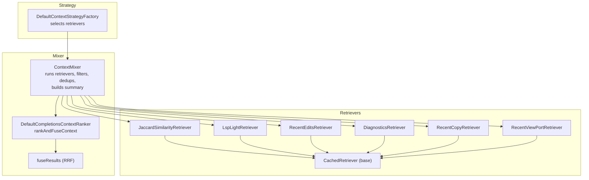
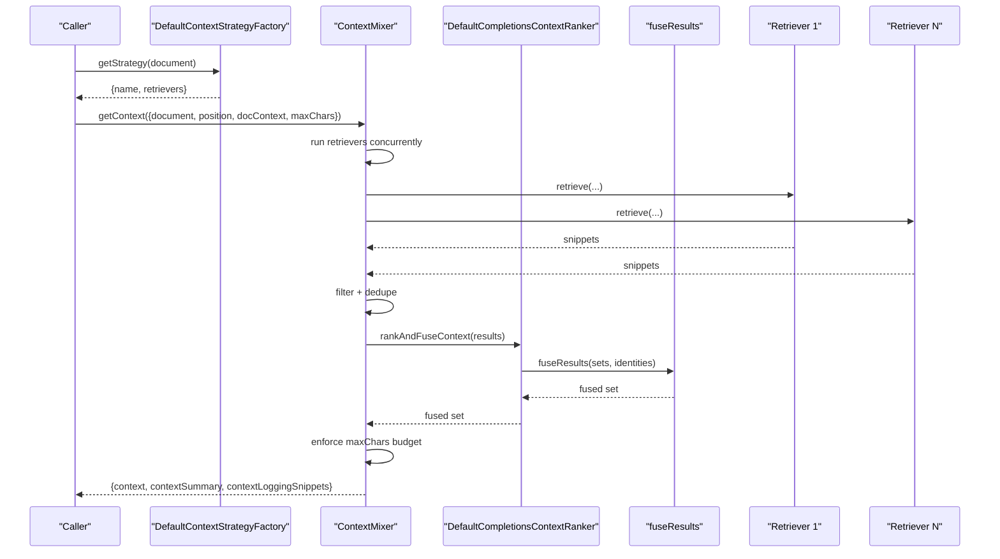
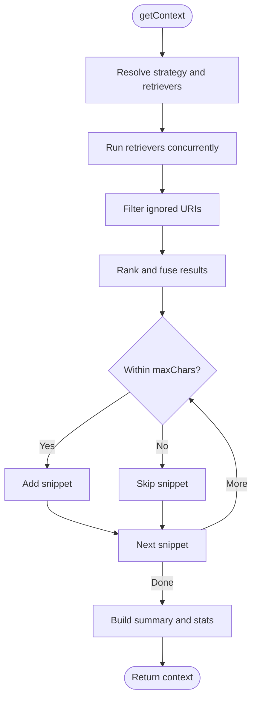
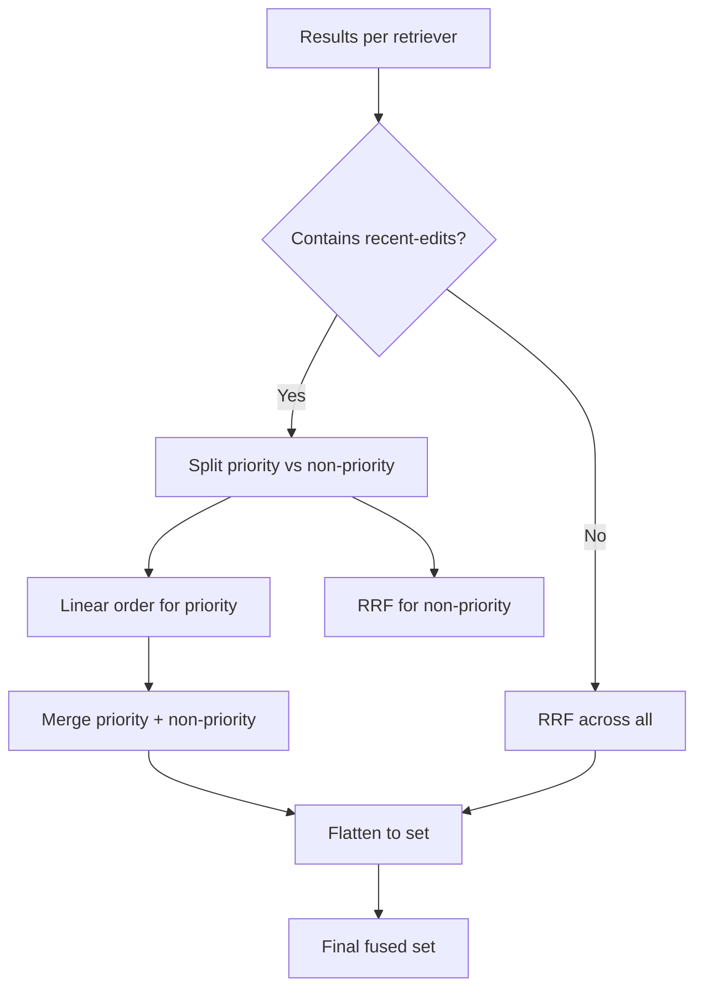
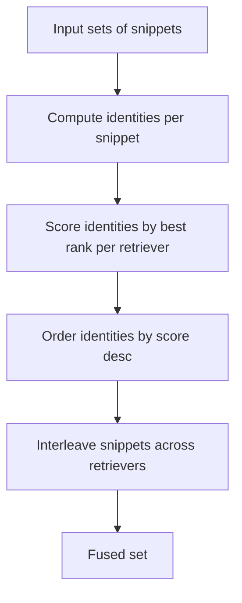
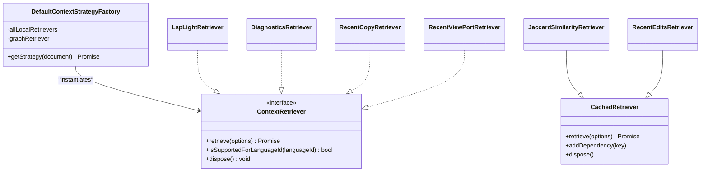
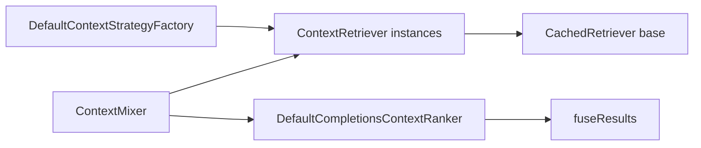

# Context Processing

<cite>
**Referenced Files in This Document**
- [context-mixer.ts](file://vscode/src/completions/context/context-mixer.ts)
- [completions-context-ranker.ts](file://vscode/src/completions/context/completions-context-ranker.ts)
- [reciprocal-rank-fusion.ts](file://vscode/src/completions/context/reciprocal-rank-fusion.ts)
- [context-strategy.ts](file://vscode/src/completions/context/context-strategy.ts)
- [utils.ts](file://vscode/src/completions/context/utils.ts)
- [jaccard-similarity-retriever.ts](file://vscode/src/completions/context/retrievers/jaccard-similarity/jaccard-similarity-retriever.ts)
- [lsp-light-retriever.ts](file://vscode/src/completions/context/retrievers/lsp-light/lsp-light-retriever.ts)
- [recent-edits-retriever.ts](file://vscode/src/completions/context/retrievers/recent-user-actions/recent-edits-retriever.ts)
- [diagnostics-retriever.ts](file://vscode/src/completions/context/retrievers/recent-user-actions/diagnostics-retriever.ts)
- [recent-copy.ts](file://vscode/src/completions/context/retrievers/recent-user-actions/recent-copy.ts)
- [recent-view-port.ts](file://vscode/src/completions/context/retrievers/recent-user-actions/recent-view-port.ts)
- [cached-retriever.ts](file://vscode/src/completions/context/retrievers/cached-retriever.ts)
- [load-tsc-retriever.ts](file://vscode/src/completions/context/retrievers/tsc/load-tsc-retriever.ts)
- [context-mixer.test.ts](file://vscode/src/completions/context/context-mixer.test.ts)
- [completions-context-ranker.test.ts](file://vscode/src/completions/context/completions-context-ranker.test.ts)
- [reciprocal-rank-fusion.test.ts](file://vscode/src/completions/context/reciprocal-rank-fusion.test.ts)
</cite>

## Table of Contents
1. [Introduction](#introduction)
2. [Project Structure](#project-structure)
3. [Core Components](#core-components)
4. [Architecture Overview](#architecture-overview)
5. [Detailed Component Analysis](#detailed-component-analysis)
6. [Dependency Analysis](#dependency-analysis)
7. [Performance Considerations](#performance-considerations)
8. [Troubleshooting Guide](#troubleshooting-guide)
9. [Conclusion](#conclusion)

## Introduction
This document explains the context processing system used to assemble relevant code and information for autocomplete and editing tasks. It covers how multiple context sources are combined, how ranking and fusion are applied, and how filtering, deduplication, and caching work. It also describes the retrievers (Jaccard similarity, LSP light, recent user actions, TypeScript symbols, and cached retrievers), and outlines strategies for controlling context size, truncation, and quality preservation.

## Project Structure
The context processing pipeline is organized around:
- A strategy factory that selects which retrievers to use based on configuration
- A context mixer that runs retrievers, filters and deduplicates results, and builds a final context list
- A context ranker that applies reciprocal rank fusion (RRF) and prioritizes certain retrievers
- Individual retrievers for local and graph-based sources
- A caching layer to optimize repeated retrievals and reduce latency

**Diagram sources**
- [context-strategy.ts:42-224](file://vscode/src/completions/context/context-strategy.ts#L42-L224)
- [context-mixer.ts:107-244](file://vscode/src/completions/context/context-mixer.ts#L107-L244)
- [completions-context-ranker.ts:35-154](file://vscode/src/completions/context/completions-context-ranker.ts#L35-L154)
- [reciprocal-rank-fusion.ts:38-125](file://vscode/src/completions/context/reciprocal-rank-fusion.ts#L38-L125)
- [jaccard-similarity-retriever.ts:40-99](file://vscode/src/completions/context/retrievers/jaccard-similarity/jaccard-similarity-retriever.ts#L40-L99)
- [lsp-light-retriever.ts:29-121](file://vscode/src/completions/context/retrievers/lsp-light/lsp-light-retriever.ts#L29-L121)
- [recent-edits-retriever.ts:32-84](file://vscode/src/completions/context/retrievers/recent-user-actions/recent-edits-retriever.ts#L32-L84)
- [diagnostics-retriever.ts:32-71](file://vscode/src/completions/context/retrievers/recent-user-actions/diagnostics-retriever.ts#L32-L71)
- [recent-copy.ts:21-55](file://vscode/src/completions/context/retrievers/recent-user-actions/recent-copy.ts#L21-L55)
- [recent-view-port.ts:33-106](file://vscode/src/completions/context/retrievers/recent-user-actions/recent-view-port.ts#L33-L106)
- [cached-retriever.ts:27-87](file://vscode/src/completions/context/retrievers/cached-retriever.ts#L27-L87)

**Section sources**
- [context-strategy.ts:20-224](file://vscode/src/completions/context/context-strategy.ts#L20-L224)
- [context-mixer.ts:88-244](file://vscode/src/completions/context/context-mixer.ts#L88-L244)
- [completions-context-ranker.ts:4-18](file://vscode/src/completions/context/completions-context-ranker.ts#L4-L18)

## Core Components
- Context strategy factory: Selects which retrievers to activate based on configuration and language support.
- Context mixer: Executes retrievers concurrently, filters ignored URIs, deduplicates, ranks/fuses, and enforces a character budget.
- Context ranker: Applies time-based ranking, priority-based fusion for recent edits, or RRF-based fusion otherwise.
- Reciprocal rank fusion: Scores and interleaves results across retrievers using a configurable constant.
- Retriever implementations: Local-only (Jaccard similarity, recent edits, diagnostics, recent copy, recent viewport) and graph-based (LSP light, TypeScript via loader).
- Cached retriever base: Provides LRU caching, dependency-aware invalidation, preloading, and subscription-based lifecycle.

**Section sources**
- [context-strategy.ts:42-224](file://vscode/src/completions/context/context-strategy.ts#L42-L224)
- [context-mixer.ts:107-244](file://vscode/src/completions/context/context-mixer.ts#L107-L244)
- [completions-context-ranker.ts:35-154](file://vscode/src/completions/context/completions-context-ranker.ts#L35-L154)
- [reciprocal-rank-fusion.ts:38-125](file://vscode/src/completions/context/reciprocal-rank-fusion.ts#L38-L125)
- [cached-retriever.ts:27-87](file://vscode/src/completions/context/retrievers/cached-retriever.ts#L27-L87)

## Architecture Overview
The system orchestrates retrievers, applies ranking/fusion, and constructs a final context list constrained by a character limit. It supports multiple strategies and can optionally collect data for logging.

**Diagram sources**
- [context-strategy.ts:175-224](file://vscode/src/completions/context/context-strategy.ts#L175-L224)
- [context-mixer.ts:107-244](file://vscode/src/completions/context/context-mixer.ts#L107-L244)
- [completions-context-ranker.ts:38-76](file://vscode/src/completions/context/completions-context-ranker.ts#L38-L76)
- [reciprocal-rank-fusion.ts:38-125](file://vscode/src/completions/context/reciprocal-rank-fusion.ts#L38-L125)

## Detailed Component Analysis

### Context Mixer
Responsibilities:
- Resolve strategy and retrievers
- Run retrievers concurrently with timeouts and spans
- Filter out ignored URIs
- Build a fused, deduplicated, and budget-constrained context list
- Collect per-retriever statistics and optional logging snippets

Key behaviors:
- Concurrency: retrievers are awaited in parallel
- Filtering: URIs marked as ignored are excluded
- Deduplication: Set-based storage ensures uniqueness
- Budgeting: Stops adding snippets when maxChars exceeded
- Statistics: Tracks retriever counts, durations, and positions

**Diagram sources**
- [context-mixer.ts:107-244](file://vscode/src/completions/context/context-mixer.ts#L107-L244)

**Section sources**
- [context-mixer.ts:107-244](file://vscode/src/completions/context/context-mixer.ts#L107-L244)
- [context-mixer.test.ts:64-155](file://vscode/src/completions/context/context-mixer.test.ts#L64-L155)

### Context Ranking and Fusion
- Strategies:
  - NoRanker: Flattens and deduplicates without reordering
  - TimeBased: Sorts by time since action (metadata)
  - Default: If recent edits present, maintains priority for them and applies RRF to others; otherwise, pure RRF
- Priority-based fusion: Splits results into priority retrievers (e.g., recent edits) and non-priority, then merges them deterministically
- RRF scoring: Uses a fixed constant to compute scores across retrievers and interleaves results greedily

**Diagram sources**
- [completions-context-ranker.ts:69-97](file://vscode/src/completions/context/completions-context-ranker.ts#L69-L97)
- [reciprocal-rank-fusion.ts:38-125](file://vscode/src/completions/context/reciprocal-rank-fusion.ts#L38-L125)

**Section sources**
- [completions-context-ranker.ts:38-154](file://vscode/src/completions/context/completions-context-ranker.ts#L38-L154)
- [completions-context-ranker.test.ts:142-166](file://vscode/src/completions/context/completions-context-ranker.test.ts#L142-L166)
- [reciprocal-rank-fusion.test.ts:1-31](file://vscode/src/completions/context/reciprocal-rank-fusion.test.ts#L1-L31)

### Reciprocal Rank Fusion (RRF)
- Purpose: Combine multiple retriever outputs into a single, interleaved list
- Identity mapping: One document can map to multiple identities (e.g., per line) to handle overlapping windows
- Scoring: Sum of 1/(k + rank) per retriever for the best-ranked occurrence of each identity
- Interleaving: Greedily picks from the highest-scoring identities across retrievers

**Diagram sources**
- [reciprocal-rank-fusion.ts:38-125](file://vscode/src/completions/context/reciprocal-rank-fusion.ts#L38-L125)

**Section sources**
- [reciprocal-rank-fusion.ts:38-125](file://vscode/src/completions/context/reciprocal-rank-fusion.ts#L38-L125)

### Context Strategy and Retrievers
- Strategy factory:
  - Supports strategies like 'jaccard-similarity', 'lsp-light', 'tsc', 'tsc-mixed', 'recent-edits(-1m|-5m)', 'recent-edits-mixed', 'recent-copy', 'diagnostics', 'recent-view-port', 'auto-edit', and 'none'
  - Builds retriever lists per strategy and defers to language support checks
- Retriever identifiers and language compatibility:
  - Identifiers enumerate retrievers used for filtering and logging
  - Language compatibility helper allows cross-family usage (e.g., TS/TSX, JS/JSX)

**Diagram sources**
- [context-strategy.ts:42-224](file://vscode/src/completions/context/context-strategy.ts#L42-L224)
- [utils.ts:4-36](file://vscode/src/completions/context/utils.ts#L4-L36)
- [jaccard-similarity-retriever.ts:40-99](file://vscode/src/completions/context/retrievers/jaccard-similarity/jaccard-similarity-retriever.ts#L40-L99)
- [lsp-light-retriever.ts:29-121](file://vscode/src/completions/context/retrievers/lsp-light/lsp-light-retriever.ts#L29-L121)
- [recent-edits-retriever.ts:32-84](file://vscode/src/completions/context/retrievers/recent-user-actions/recent-edits-retriever.ts#L32-L84)
- [diagnostics-retriever.ts:32-71](file://vscode/src/completions/context/retrievers/recent-user-actions/diagnostics-retriever.ts#L32-L71)
- [recent-copy.ts:21-55](file://vscode/src/completions/context/retrievers/recent-user-actions/recent-copy.ts#L21-L55)
- [recent-view-port.ts:33-106](file://vscode/src/completions/context/retrievers/recent-user-actions/recent-view-port.ts#L33-L106)
- [cached-retriever.ts:27-87](file://vscode/src/completions/context/retrievers/cached-retriever.ts#L27-L87)

**Section sources**
- [context-strategy.ts:42-224](file://vscode/src/completions/context/context-strategy.ts#L42-L224)
- [utils.ts:4-36](file://vscode/src/completions/context/utils.ts#L4-L36)

### Jaccard Similarity Retriever
- Purpose: Local-only retrieval using editor content (open tabs and history) to find relevant snippets based on a small prefix window
- Behavior:
  - Builds candidate files from visible tabs and recent edits
  - Computes best matches per file and filters zero-overlap matches
  - Skips matches overlapping the current context window in the same file
  - Uses a cache key derived from document URI and concatenated prefix/suffix
- Options: snippet window size and max matches per file

**Section sources**
- [jaccard-similarity-retriever.ts:40-99](file://vscode/src/completions/context/retrievers/jaccard-similarity/jaccard-similarity-retriever.ts#L40-L99)
- [jaccard-similarity-retriever.ts:122-240](file://vscode/src/completions/context/retrievers/jaccard-similarity/jaccard-similarity-retriever.ts#L122-L240)

### LSP Light Retriever
- Purpose: Graph-based symbol context retrieval with caching and preloading
- Behavior:
  - Resolves identifiers near the cursor and fetches symbol context snippets recursively
  - Preloads context on cursor movement and invalidates on document changes
  - Supports disabling cache and logs when enabled
- Limitations: Language support set is restricted

**Section sources**
- [lsp-light-retriever.ts:29-121](file://vscode/src/completions/context/retrievers/lsp-light/lsp-light-retriever.ts#L29-L121)
- [lsp-light-retriever.ts:137-159](file://vscode/src/completions/context/retrievers/lsp-light/lsp-light-retriever.ts#L137-L159)

### Recent User Actions
- Recent edits:
  - Tracks diffs across documents and converts them to snippets with timestamps
  - Applies diff strategies and caches results keyed by tracked document
- Diagnostics:
  - Gathers diagnostics for the current document or notebook cells and formats them into snippets
  - Supports XML or plain text rendering and caret indicators
- Recent copy:
  - Tracks recent selections and returns clipboard content if matched
- Recent viewport:
  - Tracks visible ranges per document and returns recent context snippets with optional line ranges

**Section sources**
- [recent-edits-retriever.ts:32-171](file://vscode/src/completions/context/retrievers/recent-user-actions/recent-edits-retriever.ts#L32-L171)
- [diagnostics-retriever.ts:32-312](file://vscode/src/completions/context/retrievers/recent-user-actions/diagnostics-retriever.ts#L32-L312)
- [recent-copy.ts:21-129](file://vscode/src/completions/context/retrievers/recent-user-actions/recent-copy.ts#L21-L129)
- [recent-view-port.ts:33-243](file://vscode/src/completions/context/retrievers/recent-user-actions/recent-view-port.ts#L33-L243)

### Cached Retriever Base
- Provides:
  - LRU cache keyed by retriever-specific keys
  - Dependency tracking to invalidate cache entries when dependencies change
  - Preloading on cursor movement with hints
  - Event subscriptions for document/text editor changes
- Lifecycle:
  - Aborts in-flight retrievals on new requests
  - Disposes subscriptions and clears caches

**Section sources**
- [cached-retriever.ts:27-279](file://vscode/src/completions/context/retrievers/cached-retriever.ts#L27-L279)

### TypeScript Symbol Retrieval Loader
- Dynamically loads the TypeScript-based retriever when available and logs errors if unavailable

**Section sources**
- [load-tsc-retriever.ts:7-21](file://vscode/src/completions/context/retrievers/tsc/load-tsc-retriever.ts#L7-L21)

## Dependency Analysis
- Strategy-to-retriever coupling:
  - Strategy factory instantiates concrete retrievers and decides which ones to include based on language support
- Mixer-to-retriever coupling:
  - Mixer aggregates results from all retrievers and delegates ranking/fusion to the ranker
- Ranker-to-RRF coupling:
  - Ranker uses RRF to fuse results when appropriate
- Retriever-to-base coupling:
  - Several retrievers inherit from the cached base to gain caching and dependency invalidation

**Diagram sources**
- [context-strategy.ts:175-224](file://vscode/src/completions/context/context-strategy.ts#L175-L224)
- [context-mixer.ts:107-184](file://vscode/src/completions/context/context-mixer.ts#L107-L184)
- [completions-context-ranker.ts:131-144](file://vscode/src/completions/context/completions-context-ranker.ts#L131-L144)
- [cached-retriever.ts:27-87](file://vscode/src/completions/context/retrievers/cached-retriever.ts#L27-L87)

**Section sources**
- [context-strategy.ts:175-224](file://vscode/src/completions/context/context-strategy.ts#L175-L224)
- [context-mixer.ts:107-184](file://vscode/src/completions/context/context-mixer.ts#L107-L184)
- [completions-context-ranker.ts:131-144](file://vscode/src/completions/context/completions-context-ranker.ts#L131-L144)

## Performance Considerations
- Concurrency:
  - Retrievers are executed in parallel to minimize latency
- Caching:
  - Cached retriever base uses LRU caches and dependency-aware invalidation to avoid recomputation
  - Preloading reduces perceived latency by warming caches on cursor movement
- Character budgeting:
  - The mixer stops adding snippets once the max character threshold is reached
- Time-based ranking:
  - Recent edits are prioritized to surface most relevant context quickly
- RRF tuning:
  - The RRF constant balances boosting of overlapping results against diversity across retrievers

[No sources needed since this section provides general guidance]

## Troubleshooting Guide
Common issues and remedies:
- Empty context:
  - Strategy may be 'none' or no retrievers are supported for the language
  - Verify strategy resolution and language support checks
- Slow retrievals:
  - Check for long-running retrievers and consider enabling caching or reducing snippet window sizes
- Incorrect or stale context:
  - Confirm dependency invalidation triggers on document changes and cursor moves
  - Ensure preloading is configured appropriately
- Excessive context size:
  - Adjust maxChars budget and review ranking strategy to prioritize most relevant snippets

**Section sources**
- [context-mixer.ts:113-126](file://vscode/src/completions/context/context-mixer.ts#L113-L126)
- [cached-retriever.ts:208-246](file://vscode/src/completions/context/retrievers/cached-retriever.ts#L208-L246)

## Conclusion
The context processing system integrates multiple retrievers behind a unified strategy, applies robust ranking and fusion, and enforces strict quality and performance controls. By combining local and graph-based sources, prioritizing recent user actions, and leveraging caching and preloading, it delivers a responsive and high-quality context experience tailored to the current editing session.