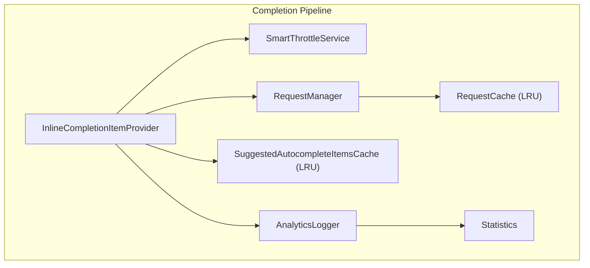
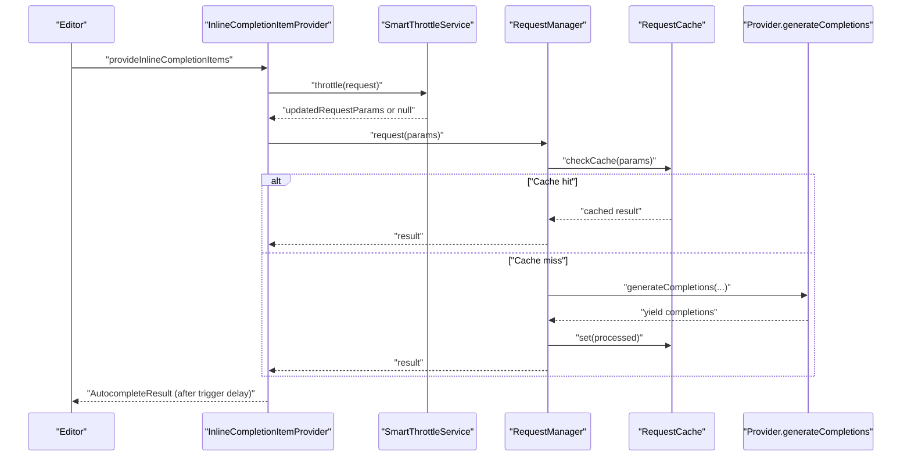
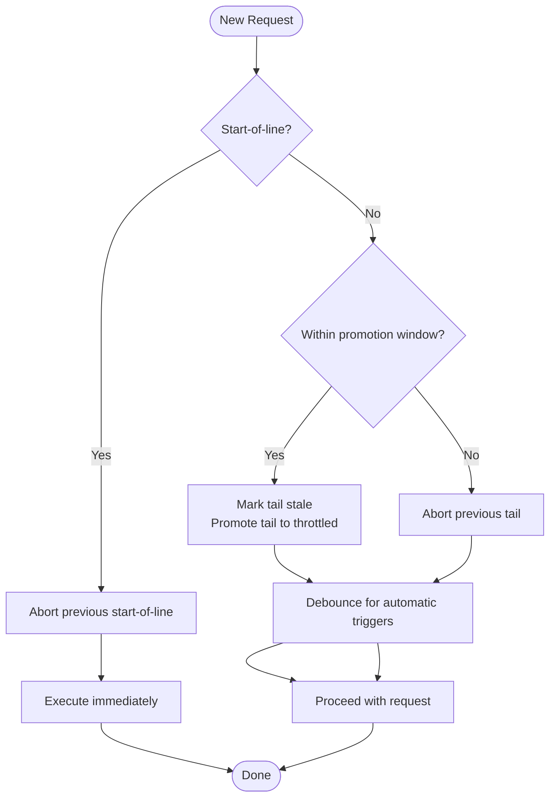
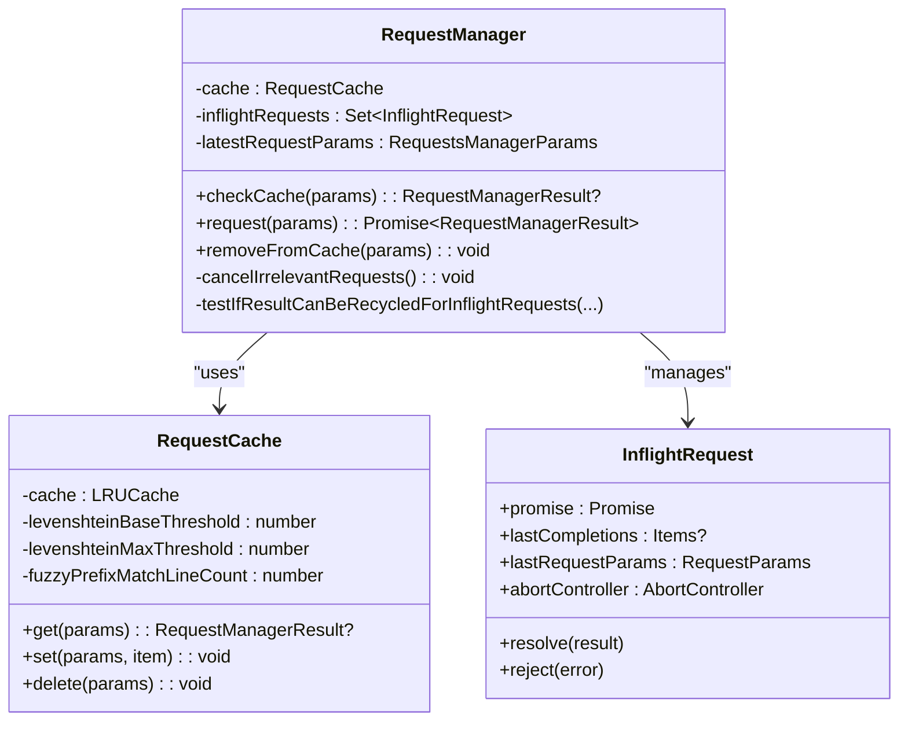
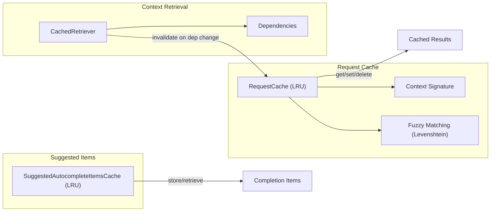
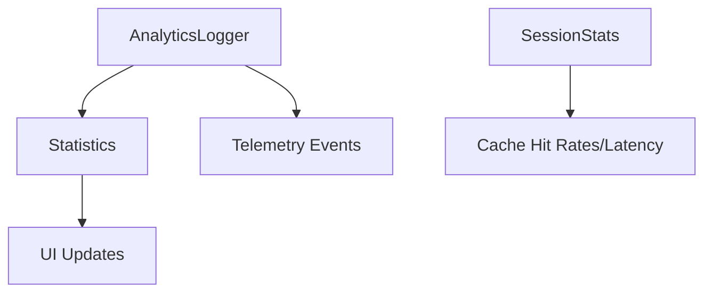
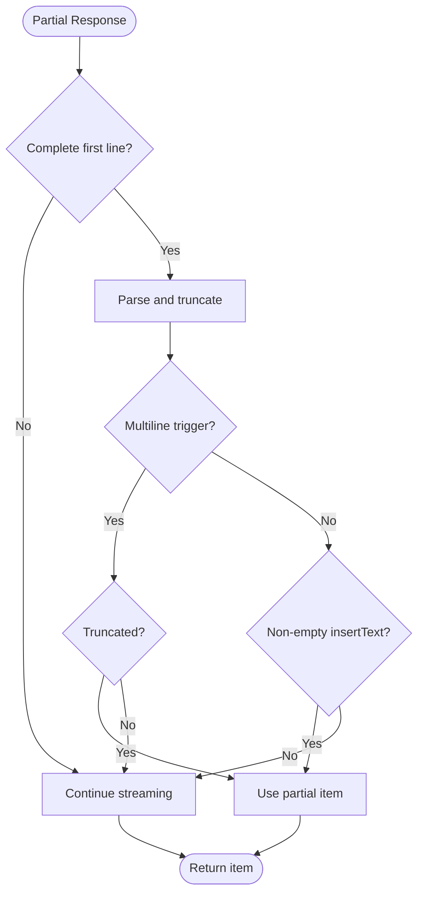
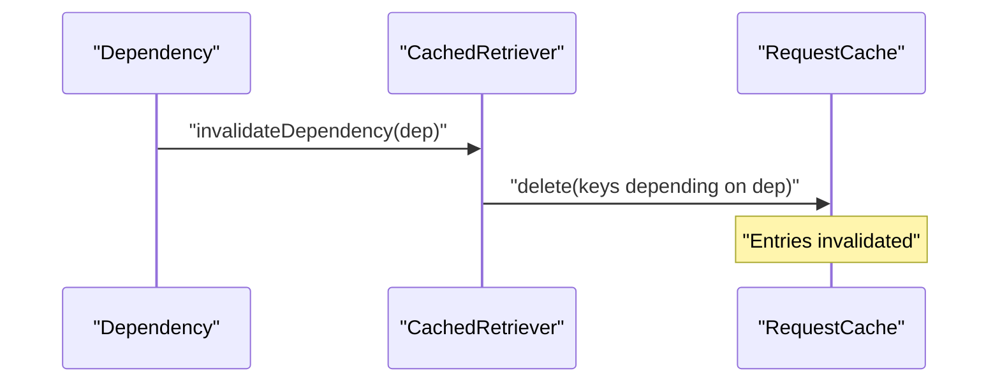
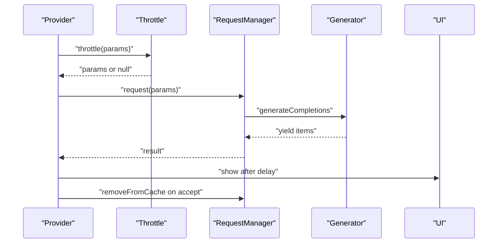
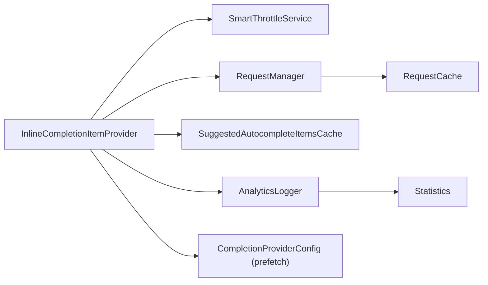

# Performance Optimization

<cite>
**Referenced Files in This Document**
- [smart-throttle.ts](file://vscode/src/completions/smart-throttle.ts)
- [smart-throttle.test.ts](file://vscode/src/completions/smart-throttle.test.ts)
- [inline-completion-item-provider-e2e.test.ts](file://vscode/src/completions/inline-completion-item-provider-e2e.test.ts)
- [request-manager.ts](file://vscode/src/completions/request-manager.ts)
- [request-manager.test.ts](file://vscode/src/completions/request-manager.test.ts)
- [suggested-autocomplete-items-cache.ts](file://vscode/src/completions/suggested-autocomplete-items-cache.ts)
- [statistics.ts](file://vscode/src/completions/statistics.ts)
- [analytics-logger.ts](file://vscode/src/completions/analytics-logger.ts)
- [can-use-partial-completion.ts](file://vscode/src/completions/can-use-partial-completion.ts)
- [reuse-last-candidate.ts](file://vscode/src/completions/reuse-last-candidate.ts)
- [inline-completion-item-provider.ts](file://vscode/src/completions/inline-completion-item-provider.ts)
- [completion-provider-config.ts](file://vscode/src/completions/completion-provider-config.ts)
- [cache.ts](file://lib/shared/src/sourcegraph-api/graphql/cache.ts)
- [cache.test.ts](file://lib/shared/src/sourcegraph-api/graphql/cache.test.ts)
- [cached-retriever.ts](file://vscode/src/completions/context/retrievers/cached-retriever.ts)
- [session-stats.ts](file://vscode/src/autoedits/debug-panel/session-stats.ts)
</cite>

## Table of Contents
1. [Introduction](#introduction)
2. [Project Structure](#project-structure)
3. [Core Components](#core-components)
4. [Architecture Overview](#architecture-overview)
5. [Detailed Component Analysis](#detailed-component-analysis)
6. [Dependency Analysis](#dependency-analysis)
7. [Performance Considerations](#performance-considerations)
8. [Troubleshooting Guide](#troubleshooting-guide)
9. [Conclusion](#conclusion)
10. [Appendices](#appendices)

## Introduction
This document explains the performance optimization strategies implemented in the autocomplete subsystem. It covers the smart throttle mechanism for controlling completion requests, request management and queuing, caching strategies for suggested completions, statistics tracking and completion effectiveness monitoring, partial completion usage logic, cache invalidation strategies, memory optimization techniques, and scalability considerations for large codebases. Practical tuning guidance and lifecycle/cancellation/resource management are included.

## Project Structure
The performance-critical parts of the autocomplete pipeline live primarily under the completions module:
- Smart throttling and request lifecycle orchestration
- Request manager with caching and inflight request recycling
- Analytics and statistics for completion effectiveness
- Partial completion logic and last-candidate reuse
- Context caching and dependency-aware invalidation
- Prefetching and configuration warm-up

**Diagram sources**
- [inline-completion-item-provider.ts:317-654](file://vscode/src/completions/inline-completion-item-provider.ts#L317-L654)
- [smart-throttle.ts:33-86](file://vscode/src/completions/smart-throttle.ts#L33-L86)
- [request-manager.ts:74-303](file://vscode/src/completions/request-manager.ts#L74-L303)
- [suggested-autocomplete-items-cache.ts:101-117](file://vscode/src/completions/suggested-autocomplete-items-cache.ts#L101-L117)
- [analytics-logger.ts:605-627](file://vscode/src/completions/analytics-logger.ts#L605-L627)
- [statistics.ts:10-13](file://vscode/src/completions/statistics.ts#L10-L13)

**Section sources**
- [inline-completion-item-provider.ts:97-247](file://vscode/src/completions/inline-completion-item-provider.ts#L97-L247)
- [request-manager.ts:74-303](file://vscode/src/completions/request-manager.ts#L74-L303)

## Core Components
- SmartThrottleService: Controls request initiation and cancellation to reduce redundant work and concurrency.
- RequestManager: Manages inflight requests, caches results, recycles results across concurrent requests, and cancels irrelevant requests.
- RequestCache: LRU cache keyed by document context with fuzzy matching to reuse results across minor edits.
- SuggestedAutocompleteItemsCache: LRU cache for suggested completion items to correlate analytics and lifecycle events.
- AnalyticsLogger: Tracks suggestion, acceptance, partial acceptance, and other completion lifecycle events with timing and metadata.
- Statistics: Lightweight counters for suggested/accepted totals and change notifications.
- Partial completion logic: Early termination of streaming responses when safe to use partial tokens.
- Context caching and dependency invalidation: Context retriever tracks dependencies and invalidates cached entries when dependencies change.
- Prefetching and warm-up: Pre-warming feature flags and configuration to avoid first-hit latency.

**Section sources**
- [smart-throttle.ts:21-101](file://vscode/src/completions/smart-throttle.ts#L21-L101)
- [request-manager.ts:74-303](file://vscode/src/completions/request-manager.ts#L74-L303)
- [suggested-autocomplete-items-cache.ts:101-117](file://vscode/src/completions/suggested-autocomplete-items-cache.ts#L101-L117)
- [analytics-logger.ts:605-627](file://vscode/src/completions/analytics-logger.ts#L605-L627)
- [statistics.ts:10-13](file://vscode/src/completions/statistics.ts#L10-L13)
- [can-use-partial-completion.ts:24-41](file://vscode/src/completions/can-use-partial-completion.ts#L24-L41)
- [cached-retriever.ts:95-126](file://vscode/src/completions/context/retrievers/cached-retriever.ts#L95-L126)
- [completion-provider-config.ts:22-40](file://vscode/src/completions/completion-provider-config.ts#L22-L40)

## Architecture Overview
The completion request lifecycle integrates throttling, request management, caching, analytics, and UI visibility checks. Smart throttle decides whether to proceed immediately or defer. RequestManager coordinates inflight requests, caches, and result recycling. AnalyticsLogger tracks stages and outcomes. UI visibility and trigger delay ensure a responsive user experience.

**Diagram sources**
- [inline-completion-item-provider.ts:317-654](file://vscode/src/completions/inline-completion-item-provider.ts#L317-L654)
- [smart-throttle.ts:33-86](file://vscode/src/completions/smart-throttle.ts#L33-L86)
- [request-manager.ts:116-214](file://vscode/src/completions/request-manager.ts#L116-L214)
- [request-manager.ts:348-459](file://vscode/src/completions/request-manager.ts#L348-L459)

## Detailed Component Analysis

### Smart Throttle Mechanism
SmartThrottleService reduces redundant work by:
- Immediately proceeding with start-of-line requests and cancelling prior ones.
- Promoting a “tail” request to a throttled request after a timeout window.
- Adding a short debounce for automatic triggers to stabilize input.

**Diagram sources**
- [smart-throttle.ts:33-86](file://vscode/src/completions/smart-throttle.ts#L33-L86)

**Section sources**
- [smart-throttle.ts:7-10](file://vscode/src/completions/smart-throttle.ts#L7-L10)
- [smart-throttle.ts:42-70](file://vscode/src/completions/smart-throttle.ts#L42-L70)
- [smart-throttle.test.ts:29-133](file://vscode/src/completions/smart-throttle.test.ts#L29-L133)
- [inline-completion-item-provider-e2e.test.ts:356-381](file://vscode/src/completions/inline-completion-item-provider-e2e.test.ts#L356-L381)

### Request Management and Queuing
RequestManager:
- Tracks inflight requests and cancels irrelevant ones based on document context divergence.
- Recycles results from resolved requests to newly inflight requests when safe.
- Uses an LRU cache keyed by a compact document context signature with fuzzy matching for minor edits.
- Removes entries from cache on explicit removal or acceptance.

**Diagram sources**
- [request-manager.ts:74-303](file://vscode/src/completions/request-manager.ts#L74-L303)
- [request-manager.ts:348-459](file://vscode/src/completions/request-manager.ts#L348-L459)
- [request-manager.ts:305-332](file://vscode/src/completions/request-manager.ts#L305-L332)

**Section sources**
- [request-manager.ts:74-303](file://vscode/src/completions/request-manager.ts#L74-L303)
- [request-manager.ts:348-459](file://vscode/src/completions/request-manager.ts#L348-L459)
- [request-manager.test.ts:121-157](file://vscode/src/completions/request-manager.test.ts#L121-L157)

### Caching Strategies for Suggested Completions
- SuggestedAutocompleteItemsCache: LRU cache mapping completion item IDs to enriched items for analytics and lifecycle tracking.
- RequestCache: LRU cache keyed by a compact signature of the document context; supports fuzzy matching using Levenshtein distance on recent lines to reuse results across minor edits.
- Context caching with dependency invalidation: Context retriever associates cache keys with dependencies and invalidates entries when dependencies change.

**Diagram sources**
- [suggested-autocomplete-items-cache.ts:101-117](file://vscode/src/completions/suggested-autocomplete-items-cache.ts#L101-L117)
- [request-manager.ts:348-459](file://vscode/src/completions/request-manager.ts#L348-L459)
- [cached-retriever.ts:95-126](file://vscode/src/completions/context/retrievers/cached-retriever.ts#L95-L126)

**Section sources**
- [suggested-autocomplete-items-cache.ts:101-117](file://vscode/src/completions/suggested-autocomplete-items-cache.ts#L101-L117)
- [request-manager.ts:348-459](file://vscode/src/completions/request-manager.ts#L348-L459)
- [cached-retriever.ts:95-126](file://vscode/src/completions/context/retrievers/cached-retriever.ts#L95-L126)

### Statistics Tracking and Completion Effectiveness Monitoring
- Statistics: Simple counters for suggested and accepted completions with change notifications.
- AnalyticsLogger: Comprehensive lifecycle tracking including suggestion, acceptance, partial acceptance, and no-response events, with timing and metadata.
- Session stats: Aggregates cache hit rates and latency percentiles for effectiveness monitoring.

**Diagram sources**
- [statistics.ts:10-13](file://vscode/src/completions/statistics.ts#L10-L13)
- [analytics-logger.ts:605-627](file://vscode/src/completions/analytics-logger.ts#L605-L627)
- [session-stats.ts:167-208](file://vscode/src/autoedits/debug-panel/session-stats.ts#L167-L208)

**Section sources**
- [statistics.ts:10-13](file://vscode/src/completions/statistics.ts#L10-L13)
- [analytics-logger.ts:605-627](file://vscode/src/completions/analytics-logger.ts#L605-L627)
- [session-stats.ts:167-208](file://vscode/src/autoedits/debug-panel/session-stats.ts#L167-L208)

### Partial Completion Usage Logic
- Early termination of streaming responses when a complete first line is available for single-line requests, or when truncation would occur for multi-line requests.
- Parsing and truncation logic ensures safe insertion and alignment with indentation rules.

**Diagram sources**
- [can-use-partial-completion.ts:24-41](file://vscode/src/completions/can-use-partial-completion.ts#L24-L41)

**Section sources**
- [can-use-partial-completion.ts:24-41](file://vscode/src/completions/can-use-partial-completion.ts#L24-L41)

### Cache Invalidation Strategies
- Dependency-aware invalidation: Context retriever maintains dependency-to-key mappings and deletes cached entries when dependencies change.
- GraphQLResultCache: Supports abort propagation and invalidation that cancels in-flight fetches using AbortSignal semantics.

**Diagram sources**
- [cached-retriever.ts:115-126](file://vscode/src/completions/context/retrievers/cached-retriever.ts#L115-L126)
- [cache.ts:214-240](file://lib/shared/src/sourcegraph-api/graphql/cache.ts#L214-L240)
- [cache.test.ts:25-54](file://lib/shared/src/sourcegraph-api/graphql/cache.test.ts#L25-L54)

**Section sources**
- [cached-retriever.ts:95-126](file://vscode/src/completions/context/retrievers/cached-retriever.ts#L95-L126)
- [cache.test.ts:25-54](file://lib/shared/src/sourcegraph-api/graphql/cache.test.ts#L25-L54)

### Memory Optimization Techniques
- LRU caches for:
  - Suggested autocomplete items (bounded size).
  - Request cache (bounded size).
  - Recent completion IDs and suggestion requests (bounded sizes).
- Abort-driven cancellation: Inflight requests are aborted when no longer relevant, preventing memory retention of stale results.
- Result recycling: Resolved results are reused for newly inflight requests, reducing recomputation and memory churn.

**Section sources**
- [suggested-autocomplete-items-cache.ts:101-117](file://vscode/src/completions/suggested-autocomplete-items-cache.ts#L101-L117)
- [request-manager.ts:348-459](file://vscode/src/completions/request-manager.ts#L348-L459)
- [request-manager.ts:276-302](file://vscode/src/completions/request-manager.ts#L276-L302)

### Completion Request Lifecycle, Cancellation, and Resource Management
- Lifecycle: Throttle → RequestManager → Cache lookup → Provider generation → Post-processing → Visibility check → Trigger delay → UI presentation.
- Cancellation: AbortController per request; SmartThrottleService forks signals; RequestManager cancels irrelevant inflight requests; Acceptance removes from network cache.
- Resource management: Debounce intervals, trigger delay, and cancellation prevent unnecessary work and UI churn.

**Diagram sources**
- [inline-completion-item-provider.ts:317-654](file://vscode/src/completions/inline-completion-item-provider.ts#L317-L654)
- [smart-throttle.ts:33-86](file://vscode/src/completions/smart-throttle.ts#L33-L86)
- [request-manager.ts:116-214](file://vscode/src/completions/request-manager.ts#L116-L214)

**Section sources**
- [inline-completion-item-provider.ts:317-654](file://vscode/src/completions/inline-completion-item-provider.ts#L317-L654)
- [request-manager.ts:276-302](file://vscode/src/completions/request-manager.ts#L276-L302)

## Dependency Analysis
- InlineCompletionItemProvider depends on SmartThrottleService and RequestManager.
- RequestManager depends on RequestCache and provider generation.
- AnalyticsLogger depends on Statistics and telemetry infrastructure.
- SuggestedAutocompleteItemsCache bridges analytics and UI item lifecycle.
- Prefetching and configuration warm-up reduce first-hit latency.

**Diagram sources**
- [inline-completion-item-provider.ts:97-247](file://vscode/src/completions/inline-completion-item-provider.ts#L97-L247)
- [completion-provider-config.ts:22-40](file://vscode/src/completions/completion-provider-config.ts#L22-L40)

**Section sources**
- [inline-completion-item-provider.ts:97-247](file://vscode/src/completions/inline-completion-item-provider.ts#L97-L247)
- [completion-provider-config.ts:22-40](file://vscode/src/completions/completion-provider-config.ts#L22-L40)

## Performance Considerations
- Concurrency control: Smart throttle caps concurrent requests and cancels stale ones to reduce contention and wasted work.
- Caching: LRU caches with fuzzy matching reuse results across minor edits; dependency-aware invalidation keeps cache fresh.
- Result recycling: Inflight result reuse reduces latency and computation for subsequent requests.
- Trigger delay and debounce: Prevent premature UI updates and stabilize input for better relevance.
- Abort-driven lifecycle: Ensures no memory retention for irrelevant requests.
- Prefetching: Warms feature flags and configuration to avoid first-hit latency.

[No sources needed since this section provides general guidance]

## Troubleshooting Guide
- Excessive stale requests: Verify SmartThrottleService promotion window and debounce behavior.
- High cache miss rate: Review fuzzy matching thresholds and context signature construction.
- Aborted in-flight requests: Confirm cancellation logic and AbortController usage.
- Slow first completion: Check prefetch subscriptions and configuration warm-up.

**Section sources**
- [smart-throttle.ts:33-86](file://vscode/src/completions/smart-throttle.ts#L33-L86)
- [request-manager.ts:276-302](file://vscode/src/completions/request-manager.ts#L276-L302)
- [cache.test.ts:25-54](file://lib/shared/src/sourcegraph-api/graphql/cache.test.ts#L25-L54)
- [completion-provider-config.ts:22-40](file://vscode/src/completions/completion-provider-config.ts#L22-L40)

## Conclusion
The autocomplete subsystem employs a layered performance strategy: smart throttling to control concurrency, robust request management with caching and result recycling, precise analytics and statistics for effectiveness monitoring, and careful memory and resource management. Together, these mechanisms deliver responsive, accurate completions at scale.

[No sources needed since this section summarizes without analyzing specific files]

## Appendices

### Performance Tuning Guidance
- Smart throttle timeout: Adjust the promotion window to balance responsiveness and concurrency.
- Debounce interval: Tune for single-line vs multi-line scenarios to stabilize input.
- Trigger delay: Increase to reduce UI churn; decrease for perceived responsiveness.
- Cache sizes: Increase LRU capacities for frequent editing sessions; monitor memory footprint.
- Fuzzy matching thresholds: Adjust Levenshtein thresholds for noisy contexts.

[No sources needed since this section provides general guidance]