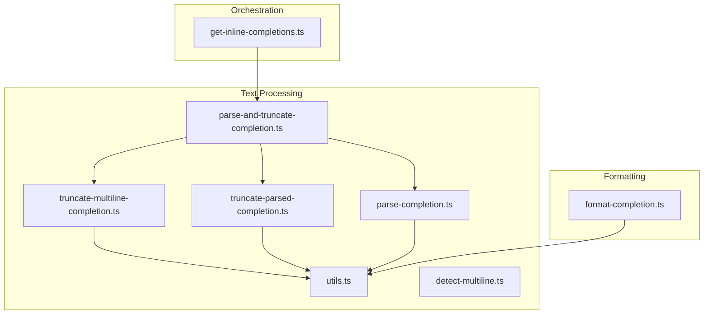
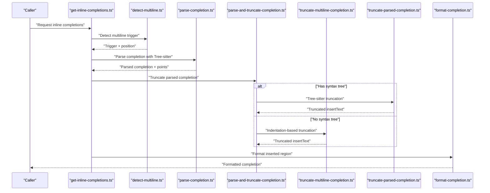
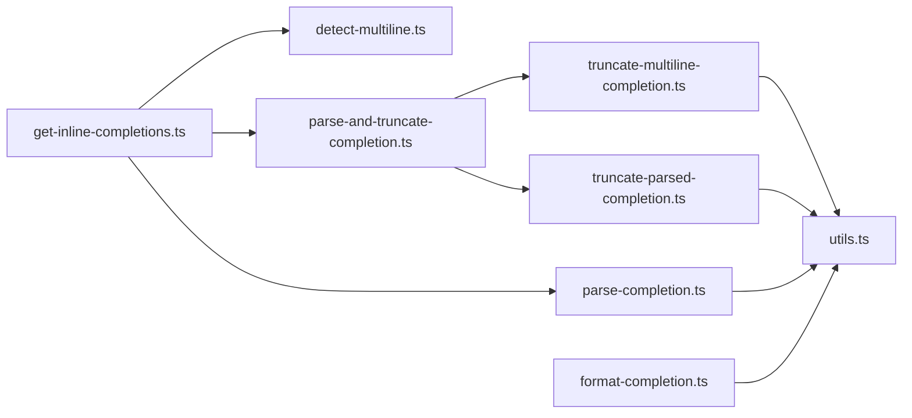

# Text Transformation

<cite>
**Referenced Files in This Document**
- [parse-and-truncate-completion.ts](file://vscode/src/completions/text-processing/parse-and-truncate-completion.ts)
- [truncate-multiline-completion.ts](file://vscode/src/completions/text-processing/truncate-multiline-completion.ts)
- [truncate-parsed-completion.ts](file://vscode/src/completions/text-processing/truncate-parsed-completion.ts)
- [parse-completion.ts](file://vscode/src/completions/text-processing/parse-completion.ts)
- [utils.ts](file://vscode/src/completions/text-processing/utils.ts)
- [detect-multiline.ts](file://vscode/src/completions/detect-multiline.ts)
- [format-completion.ts](file://vscode/src/completions/format-completion.ts)
- [get-inline-completions.ts](file://vscode/src/completions/get-inline-completions.ts)
</cite>

## Table of Contents
1. [Introduction](#introduction)
2. [Project Structure](#project-structure)
3. [Core Components](#core-components)
4. [Architecture Overview](#architecture-overview)
5. [Detailed Component Analysis](#detailed-component-analysis)
6. [Dependency Analysis](#dependency-analysis)
7. [Performance Considerations](#performance-considerations)
8. [Troubleshooting Guide](#troubleshooting-guide)
9. [Conclusion](#conclusion)

## Introduction
This document describes the text transformation pipeline used to process, validate, and format code completions. It covers the end-to-end workflow from raw completion generation to final insertion, including parsing, truncation, formatting, and post-processing. Special attention is given to multiline completion handling, indentation normalization, syntax-aware transformations, and quality assurance steps such as bracket balancing and error detection.

## Project Structure
The text transformation pipeline lives primarily under the completions subsystem, with dedicated modules for parsing, truncation, and formatting. The pipeline integrates with the broader autocomplete orchestration and uses Tree-sitter for syntax-aware operations.

**Diagram sources**
- [parse-and-truncate-completion.ts](file://vscode/src/completions/text-processing/parse-and-truncate-completion.ts)
- [truncate-multiline-completion.ts](file://vscode/src/completions/text-processing/truncate-multiline-completion.ts)
- [truncate-parsed-completion.ts](file://vscode/src/completions/text-processing/truncate-parsed-completion.ts)
- [parse-completion.ts](file://vscode/src/completions/text-processing/parse-completion.ts)
- [utils.ts](file://vscode/src/completions/text-processing/utils.ts)
- [detect-multiline.ts](file://vscode/src/completions/detect-multiline.ts)
- [format-completion.ts](file://vscode/src/completions/format-completion.ts)
- [get-inline-completions.ts](file://vscode/src/completions/get-inline-completions.ts)

**Section sources**
- [get-inline-completions.ts](file://vscode/src/completions/get-inline-completions.ts)
- [parse-and-truncate-completion.ts](file://vscode/src/completions/text-processing/parse-and-truncate-completion.ts)

## Core Components
- Multiline detection: Determines whether a completion should span multiple lines and identifies the trigger point.
- Parsing: Builds a Tree-sitter parse tree around the completion to detect syntax errors and guide truncation.
- Truncation:
  - Indentation-based truncation for multiline completions when syntax trees are unavailable.
  - Tree-sitter–based truncation for precise, syntax-aware cuts.
- Formatting: Applies editor formatting to the inserted completion region.
- Utilities: Provide indentation normalization, bracket handling, suffix trimming, and whitespace management.

**Section sources**
- [detect-multiline.ts](file://vscode/src/completions/detect-multiline.ts)
- [parse-completion.ts](file://vscode/src/completions/text-processing/parse-completion.ts)
- [truncate-multiline-completion.ts](file://vscode/src/completions/text-processing/truncate-multiline-completion.ts)
- [truncate-parsed-completion.ts](file://vscode/src/completions/text-processing/truncate-parsed-completion.ts)
- [format-completion.ts](file://vscode/src/completions/format-completion.ts)
- [utils.ts](file://vscode/src/completions/text-processing/utils.ts)

## Architecture Overview
The pipeline orchestrates detection, parsing, truncation, and formatting to produce a clean, syntactically valid, and editor-consistent completion.

**Diagram sources**
- [get-inline-completions.ts](file://vscode/src/completions/get-inline-completions.ts)
- [detect-multiline.ts](file://vscode/src/completions/detect-multiline.ts)
- [parse-completion.ts](file://vscode/src/completions/text-processing/parse-completion.ts)
- [parse-and-truncate-completion.ts](file://vscode/src/completions/text-processing/parse-and-truncate-completion.ts)
- [truncate-multiline-completion.ts](file://vscode/src/completions/text-processing/truncate-multiline-completion.ts)
- [truncate-parsed-completion.ts](file://vscode/src/completions/text-processing/truncate-parsed-completion.ts)
- [format-completion.ts](file://vscode/src/completions/format-completion.ts)

## Detailed Component Analysis

### Multiline Detection
Determines when a completion should be multiline and computes the trigger location. It avoids triggering for function/method invocations and unsupported languages, and uses language-specific block markers and bracket contexts to decide.

Key behaviors:
- Checks for block-start markers and opening brackets.
- Compares indentation of surrounding lines to infer empty-block contexts.
- Computes a trigger position that aligns with the end of the first line of the completion during streaming.

**Section sources**
- [detect-multiline.ts](file://vscode/src/completions/detect-multiline.ts)

### Parsing and Initial Truncation
Takes the raw completion, normalizes indentation for multiline starts, parses with Tree-sitter, and truncates appropriately. It records line count deltas for diagnostics and sets truncation metadata.

Highlights:
- Normalizes leading newline and indentation for multiline starts.
- Calls Tree-sitter parse and detects ERROR nodes to assess syntactic health.
- Chooses truncation strategy: Tree-sitter or indentation-based.

**Section sources**
- [parse-and-truncate-completion.ts](file://vscode/src/completions/text-processing/parse-and-truncate-completion.ts)
- [parse-completion.ts](file://vscode/src/completions/text-processing/parse-completion.ts)

### Indentation-Based Multiline Truncation
Ensures the completion shares or exceeds the editor’s indentation and then iterates lines to find the first line that drops below the starting indentation level. It respects language-specific block endings and bracket pairs to include closing constructs when appropriate.

Key logic:
- Detects editor tab size and adjusts indentation if needed.
- Scans lines to locate the cutoff based on indentation thresholds.
- Handles special cases for empty completion lines and block-end keywords.

**Section sources**
- [truncate-multiline-completion.ts](file://vscode/src/completions/text-processing/truncate-multiline-completion.ts)
- [utils.ts](file://vscode/src/completions/text-processing/utils.ts)

### Tree-Sitter–Based Truncation
When a syntax tree is available, this module inserts missing brackets to stabilize the parse, finds the last ancestor on the same row as the trigger, and overlaps the insert text with the minimal viable suffix to avoid duplication.

Highlights:
- Inserts missing closing brackets to balance the completion.
- Locates the insertion node and computes the largest suffix-prefix overlap.
- Emits debug telemetry for tracing truncation decisions.

**Section sources**
- [truncate-parsed-completion.ts](file://vscode/src/completions/text-processing/truncate-parsed-completion.ts)
- [parse-completion.ts](file://vscode/src/completions/text-processing/parse-completion.ts)

### Formatting
Applies editor formatting to the inserted region to ensure consistent indentation and style. It computes the formatting range from the insertion start and end positions and applies only the edits that intersect the range.

Behavior:
- Executes the editor’s format provider with current tab size and insert-spaces settings.
- Filters and applies only the relevant formatting changes.
- Logs timing and formatter identity for observability.

**Section sources**
- [format-completion.ts](file://vscode/src/completions/format-completion.ts)

### Utilities and Quality Assurance
Support functions for robust text processing:
- Extract code blocks and strip unwanted prefixes.
- Fix bad completion starts and trim whitespace.
- Collapse duplicative whitespace across prefix and completion boundaries.
- Trim insertion until it aligns with the suffix indentation.
- Normalize indentation and compute overlap metrics.
- Bracket pair mapping and inclusion heuristics.

Quality assurance:
- Detects ERROR nodes in the parse tree to quantify syntactic issues.
- Inserts missing brackets to improve truncation reliability.
- Removes trailing whitespace and collapses leading spaces to prevent duplicates.

**Section sources**
- [utils.ts](file://vscode/src/completions/text-processing/utils.ts)
- [parse-completion.ts](file://vscode/src/completions/text-processing/parse-completion.ts)
- [truncate-parsed-completion.ts](file://vscode/src/completions/text-processing/truncate-parsed-completion.ts)

## Dependency Analysis
The pipeline exhibits clear layering:
- Orchestration depends on detection and processing modules.
- Processing depends on parsing and utilities.
- Truncation strategies depend on utilities and language configuration.
- Formatting depends on editor configuration and utilities.

**Diagram sources**
- [get-inline-completions.ts](file://vscode/src/completions/get-inline-completions.ts)
- [detect-multiline.ts](file://vscode/src/completions/detect-multiline.ts)
- [parse-completion.ts](file://vscode/src/completions/text-processing/parse-completion.ts)
- [parse-and-truncate-completion.ts](file://vscode/src/completions/text-processing/parse-and-truncate-completion.ts)
- [truncate-multiline-completion.ts](file://vscode/src/completions/text-processing/truncate-multiline-completion.ts)
- [truncate-parsed-completion.ts](file://vscode/src/completions/text-processing/truncate-parsed-completion.ts)
- [utils.ts](file://vscode/src/completions/text-processing/utils.ts)
- [format-completion.ts](file://vscode/src/completions/format-completion.ts)

**Section sources**
- [get-inline-completions.ts](file://vscode/src/completions/get-inline-completions.ts)
- [parse-and-truncate-completion.ts](file://vscode/src/completions/text-processing/parse-and-truncate-completion.ts)
- [truncate-multiline-completion.ts](file://vscode/src/completions/text-processing/truncate-multiline-completion.ts)
- [truncate-parsed-completion.ts](file://vscode/src/completions/text-processing/truncate-parsed-completion.ts)
- [parse-completion.ts](file://vscode/src/completions/text-processing/parse-completion.ts)
- [utils.ts](file://vscode/src/completions/text-processing/utils.ts)
- [format-completion.ts](file://vscode/src/completions/format-completion.ts)

## Performance Considerations
- Minimize Tree-sitter parsing scope: The code comments indicate potential optimization by parsing only the changed document region instead of reparsing the entire tree. This reduces overhead when inserting completions.
- Debounce and smart throttle: The orchestration layer supports debouncing and throttling to reduce redundant work and improve responsiveness.
- Early exits: The pipeline short-circuits when completions are empty or when conditions (e.g., suffix containing word characters) prevent meaningful completions.
- Editor formatting scope: Formatting is scoped to the inserted region, limiting expensive operations to the affected area.

[No sources needed since this section provides general guidance]

## Troubleshooting Guide
Common issues and diagnostics:
- Empty or invalid completions: The pipeline returns early if the parsed insert text is empty.
- Multiline misfires: If the completion triggers on a function/method invocation or an unsupported language, it is suppressed. Review the detection logic and language support lists.
- Incorrect truncation: If indentation-based truncation cuts too early or late, verify the language configuration and block markers. Tree-sitter truncation is more accurate when available.
- Bracket imbalance: The pipeline attempts to insert missing brackets to stabilize the parse. If truncation still fails, inspect the parse tree and ERROR nodes.
- Formatting inconsistencies: Ensure the editor’s tab size and insert-spaces settings match the code style. Formatting is applied only to the inserted region.

**Section sources**
- [parse-and-truncate-completion.ts](file://vscode/src/completions/text-processing/parse-and-truncate-completion.ts)
- [truncate-multiline-completion.ts](file://vscode/src/completions/text-processing/truncate-multiline-completion.ts)
- [truncate-parsed-completion.ts](file://vscode/src/completions/text-processing/truncate-parsed-completion.ts)
- [parse-completion.ts](file://vscode/src/completions/text-processing/parse-completion.ts)
- [detect-multiline.ts](file://vscode/src/completions/detect-multiline.ts)

## Conclusion
The text transformation pipeline combines detection, parsing, truncation, and formatting to deliver high-quality completions. It leverages Tree-sitter for syntax-aware precision, indentation heuristics for fallback scenarios, and editor formatting for stylistic consistency. Robust utilities ensure whitespace and bracket handling are reliable, while orchestration features like debouncing and throttling optimize performance.

[No sources needed since this section summarizes without analyzing specific files]